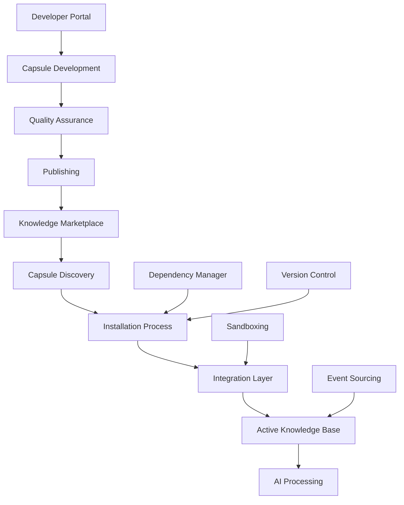

The Knowledge Capsule System is AIMatrix's revolutionary approach to modular knowledge management, enabling third-party developers to create, publish, and distribute specialized knowledge modules that can be seamlessly integrated into the platform.

## Overview

Knowledge Capsules are self-contained, versioned packages that encapsulate domain-specific knowledge, rules, workflows, and data processing logic. They function like plugins for the AIMatrix knowledge layer, allowing organizations to extend their AI capabilities with specialized expertise from third-party developers.

## Core Concept



## Architecture Components

### 1. Capsule Structure
- **Metadata**: Version, dependencies, compatibility
- **Knowledge Assets**: Rules, schemas, workflows
- **Integration Hooks**: API endpoints, event handlers
- **Resources**: Documentation, examples, tests

### 2. Runtime Environment
- **Isolation Layer**: Sandboxed execution environment
- **Dependency Resolution**: Automatic dependency management
- **Version Compatibility**: Semantic versioning support
- **Resource Management**: Memory and CPU allocation

### 3. Data Integration
- **Supabase Integration**: Native database operations
- **Vector Search**: Embedding and retrieval
- **Event Sourcing**: Complete audit trail
- **Real-time Sync**: Live updates and notifications

## Use Cases

### Enterprise Applications

#### LHDN e-Invoice Compliance
```typescript
// Example: Malaysian LHDN e-Invoice capsule
const lhdnCapsule = {
  id: "lhdn-einvoice-v2024",
  version: "1.2.3",
  knowledge: {
    taxRules: "Malaysian GST/SST compliance rules",
    invoiceFormats: "LHDN-approved XML schemas",
    validationLogic: "Real-time invoice validation"
  }
}
```

#### HR Management Systems
- Employee handbook automation
- Policy compliance checking
- Performance review workflows
- Regulatory compliance tracking

#### Industry-Specific Knowledge
- Legal document processing
- Medical diagnostic assistance
- Financial risk assessment
- Supply chain optimization

## Marketplace Ecosystem

### For Organizations
- **Discovery**: Browse certified knowledge capsules
- **Evaluation**: Test in sandbox environments
- **Integration**: One-click installation
- **Management**: Update, configure, and monitor

### For Developers
- **Monetization**: Revenue sharing models
- **Distribution**: Global marketplace reach
- **Support**: Developer tools and APIs
- **Analytics**: Usage metrics and feedback

### Quality Assurance
- **Certification Process**: Rigorous testing and validation
- **Security Scanning**: Automated vulnerability detection
- **Performance Testing**: Resource usage optimization
- **Compliance Verification**: Regulatory requirement checks

## Key Benefits

### Extensibility
- **Modular Architecture**: Add capabilities without core changes
- **Domain Expertise**: Access specialized knowledge from experts
- **Rapid Deployment**: Install and activate in minutes
- **Custom Solutions**: Tailored knowledge for specific needs

### Maintainability
- **Version Control**: Rollback and update capabilities
- **Dependency Management**: Automatic resolution and updates
- **Impact Analysis**: Understand changes before deployment
- **Event Sourcing**: Complete change history

### Scalability
- **Horizontal Scaling**: Distribute capsules across instances
- **Resource Isolation**: Prevent interference between capsules
- **Load Balancing**: Optimize resource utilization
- **Performance Monitoring**: Real-time metrics and alerts

## Technical Challenges

### The Removal Problem
The most complex challenge in the Knowledge Capsule System is safely removing capsules while maintaining system integrity:

- **Dependency Tracking**: Understanding interconnected relationships
- **Orphaned References**: Handling broken knowledge links
- **Data Migration**: Preserving essential information
- **Gradual Phase-out**: Minimizing disruption during removal

### Solutions Implemented
- **Immutable Knowledge Graphs**: Preserve historical relationships
- **Shadow Removal**: Mark as removed without data deletion
- **Reference Counting**: Track active usage patterns
- **Event Sourcing**: Enable complete rollback capabilities

## Database Schema Overview

```sql
-- Core capsule registry
CREATE TABLE knowledge_capsules (
    id UUID PRIMARY KEY DEFAULT uuid_generate_v4(),
    name TEXT NOT NULL,
    version TEXT NOT NULL,
    developer_id UUID REFERENCES developers(id),
    status capsule_status DEFAULT 'active',
    metadata JSONB NOT NULL,
    created_at TIMESTAMP WITH TIME ZONE DEFAULT NOW(),
    updated_at TIMESTAMP WITH TIME ZONE DEFAULT NOW(),
    
    UNIQUE(name, version)
);

-- Dependency relationships
CREATE TABLE capsule_dependencies (
    id UUID PRIMARY KEY DEFAULT uuid_generate_v4(),
    capsule_id UUID REFERENCES knowledge_capsules(id),
    depends_on_id UUID REFERENCES knowledge_capsules(id),
    version_constraint TEXT NOT NULL,
    dependency_type dependency_type DEFAULT 'required',
    created_at TIMESTAMP WITH TIME ZONE DEFAULT NOW()
);

-- Installation tracking
CREATE TABLE capsule_installations (
    id UUID PRIMARY KEY DEFAULT uuid_generate_v4(),
    capsule_id UUID REFERENCES knowledge_capsules(id),
    organization_id UUID REFERENCES organizations(id),
    installation_status installation_status DEFAULT 'pending',
    configuration JSONB DEFAULT '{}',
    installed_at TIMESTAMP WITH TIME ZONE DEFAULT NOW(),
    last_updated TIMESTAMP WITH TIME ZONE DEFAULT NOW()
);
```

## Event Sourcing Pattern

```typescript
interface CapsuleEvent {
  id: string;
  capsuleId: string;
  eventType: 'installed' | 'updated' | 'removed' | 'configured';
  payload: any;
  timestamp: Date;
  organizationId: string;
  userId: string;
}

// Event store for complete audit trail
const eventStore = new EventStore<CapsuleEvent>({
  table: 'capsule_events',
  partitionKey: 'capsuleId',
  sortKey: 'timestamp'
});
```

## Getting Started

1. **[Understanding Architecture](capsule-architecture.md)** - Deep dive into technical components
2. **[Lifecycle Management](capsule-lifecycle.md)** - Installation, updates, and removal
3. **[Developer Guide](developer-guide.md)** - Building your first capsule
4. **[Marketplace](marketplace.md)** - Publishing and monetization

## Next Steps

- Explore the [technical architecture](capsule-architecture.md) for implementation details
- Learn about [removal strategies](removal-strategy.md) for safe capsule management
- Understand [incremental updates](incremental-updates.md) for seamless deployments
- Review the [developer guide](developer-guide.md) to start building capsules