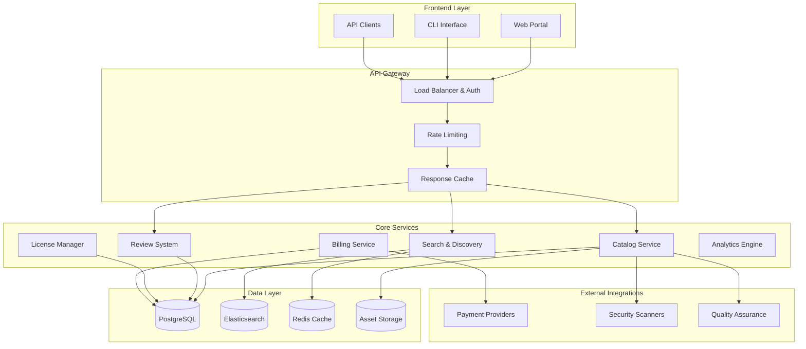

The AIMatrix Knowledge Marketplace is a comprehensive ecosystem for discovering, evaluating, and acquiring specialized knowledge capsules. It serves as the central hub connecting knowledge creators with organizations seeking domain expertise.

## Marketplace Architecture

### Platform Overview



### Database Schema

```sql
-- Publishers (developers/organizations)
CREATE TABLE publishers (
    id UUID PRIMARY KEY DEFAULT uuid_generate_v4(),
    name TEXT NOT NULL,
    email TEXT UNIQUE NOT NULL,
    organization TEXT,
    website TEXT,
    verified BOOLEAN DEFAULT FALSE,
    reputation_score DECIMAL(3,2) DEFAULT 0.0,
    total_downloads BIGINT DEFAULT 0,
    active_capsules INTEGER DEFAULT 0,
    created_at TIMESTAMP WITH TIME ZONE DEFAULT NOW(),
    updated_at TIMESTAMP WITH TIME ZONE DEFAULT NOW()
);

-- Marketplace capsule listings
CREATE TABLE marketplace_capsules (
    id UUID PRIMARY KEY DEFAULT uuid_generate_v4(),
    capsule_id UUID NOT NULL, -- References knowledge_capsules.id
    publisher_id UUID REFERENCES publishers(id),
    
    -- Marketplace metadata
    featured BOOLEAN DEFAULT FALSE,
    visibility marketplace_visibility DEFAULT 'public',
    status listing_status DEFAULT 'active',
    
    -- Pricing and licensing
    license_type license_type NOT NULL,
    pricing_model pricing_model NOT NULL,
    price_data JSONB DEFAULT '{}',
    
    -- Discovery metadata
    category TEXT NOT NULL,
    subcategory TEXT,
    tags TEXT[],
    keywords TEXT[],
    
    -- Statistics
    download_count BIGINT DEFAULT 0,
    install_count BIGINT DEFAULT 0,
    active_installations BIGINT DEFAULT 0,
    
    -- Ratings
    rating_average DECIMAL(2,1) DEFAULT 0.0,
    rating_count INTEGER DEFAULT 0,
    rating_distribution JSONB DEFAULT '{}',
    
    -- Marketplace specific timestamps
    published_at TIMESTAMP WITH TIME ZONE,
    last_updated TIMESTAMP WITH TIME ZONE DEFAULT NOW(),
    featured_until TIMESTAMP WITH TIME ZONE,
    
    UNIQUE(capsule_id),
    CHECK (rating_average >= 0.0 AND rating_average <= 5.0),
    CHECK (visibility IN ('public', 'private', 'organization'))
);

-- Custom types
CREATE TYPE marketplace_visibility AS ENUM ('public', 'private', 'organization');
CREATE TYPE listing_status AS ENUM ('active', 'inactive', 'suspended', 'pending_review');
CREATE TYPE license_type AS ENUM ('mit', 'apache', 'proprietary', 'commercial', 'custom');
CREATE TYPE pricing_model AS ENUM ('free', 'freemium', 'subscription', 'usage_based', 'enterprise');

-- Reviews and ratings
CREATE TABLE capsule_reviews (
    id UUID PRIMARY KEY DEFAULT uuid_generate_v4(),
    capsule_id UUID REFERENCES marketplace_capsules(capsule_id),
    organization_id UUID REFERENCES organizations(id),
    reviewer_id UUID NOT NULL,
    
    -- Review content
    rating INTEGER NOT NULL CHECK (rating >= 1 AND rating <= 5),
    title TEXT,
    review_text TEXT,
    pros TEXT[],
    cons TEXT[],
    
    -- Review metadata
    helpful_votes INTEGER DEFAULT 0,
    verified_purchase BOOLEAN DEFAULT FALSE,
    version_reviewed TEXT,
    usage_duration TEXT, -- e.g., '3 months', '1 year'
    
    -- Moderation
    status review_status DEFAULT 'published',
    moderation_notes TEXT,
    
    created_at TIMESTAMP WITH TIME ZONE DEFAULT NOW(),
    updated_at TIMESTAMP WITH TIME ZONE DEFAULT NOW(),
    
    UNIQUE(capsule_id, organization_id, reviewer_id)
);

CREATE TYPE review_status AS ENUM ('published', 'pending', 'rejected', 'flagged');

-- Review responses (publisher responses to reviews)
CREATE TABLE review_responses (
    id UUID PRIMARY KEY DEFAULT uuid_generate_v4(),
    review_id UUID REFERENCES capsule_reviews(id),
    publisher_id UUID REFERENCES publishers(id),
    response_text TEXT NOT NULL,
    created_at TIMESTAMP WITH TIME ZONE DEFAULT NOW(),
    updated_at TIMESTAMP WITH TIME ZONE DEFAULT NOW()
);

-- Categories and taxonomy
CREATE TABLE marketplace_categories (
    id UUID PRIMARY KEY DEFAULT uuid_generate_v4(),
    name TEXT UNIQUE NOT NULL,
    slug TEXT UNIQUE NOT NULL,
    description TEXT,
    parent_id UUID REFERENCES marketplace_categories(id),
    icon TEXT,
    sort_order INTEGER DEFAULT 0,
    active BOOLEAN DEFAULT TRUE
);

-- Licensing and usage tracking
CREATE TABLE license_agreements (
    id UUID PRIMARY KEY DEFAULT uuid_generate_v4(),
    capsule_id UUID REFERENCES marketplace_capsules(capsule_id),
    organization_id UUID REFERENCES organizations(id),
    
    license_type TEXT NOT NULL,
    agreement_version TEXT NOT NULL,
    terms_accepted_at TIMESTAMP WITH TIME ZONE NOT NULL,
    accepted_by UUID NOT NULL,
    
    -- License limits and usage
    usage_limits JSONB DEFAULT '{}',
    current_usage JSONB DEFAULT '{}',
    
    valid_from TIMESTAMP WITH TIME ZONE DEFAULT NOW(),
    valid_until TIMESTAMP WITH TIME ZONE,
    
    status license_status DEFAULT 'active',
    
    created_at TIMESTAMP WITH TIME ZONE DEFAULT NOW(),
    updated_at TIMESTAMP WITH TIME ZONE DEFAULT NOW()
);

CREATE TYPE license_status AS ENUM ('active', 'expired', 'suspended', 'terminated');

-- Usage tracking for billing
CREATE TABLE usage_records (
    id UUID PRIMARY KEY DEFAULT uuid_generate_v4(),
    license_id UUID REFERENCES license_agreements(id),
    
    usage_type TEXT NOT NULL, -- 'api_calls', 'data_processed', 'storage', etc.
    quantity DECIMAL NOT NULL,
    unit TEXT NOT NULL,
    unit_price DECIMAL,
    
    recorded_at TIMESTAMP WITH TIME ZONE DEFAULT NOW(),
    billing_period TEXT, -- 'YYYY-MM' format
    
    -- Metadata
    metadata JSONB DEFAULT '{}'
);

-- Revenue tracking
CREATE TABLE revenue_records (
    id UUID PRIMARY KEY DEFAULT uuid_generate_v4(),
    capsule_id UUID REFERENCES marketplace_capsules(capsule_id),
    publisher_id UUID REFERENCES publishers(id),
    organization_id UUID REFERENCES organizations(id),
    
    revenue_type revenue_type NOT NULL,
    gross_amount DECIMAL(10,2) NOT NULL,
    platform_fee DECIMAL(10,2) NOT NULL,
    net_amount DECIMAL(10,2) NOT NULL,
    currency TEXT DEFAULT 'USD',
    
    billing_period TEXT, -- 'YYYY-MM' format
    transaction_id TEXT,
    
    created_at TIMESTAMP WITH TIME ZONE DEFAULT NOW()
);

CREATE TYPE revenue_type AS ENUM ('subscription', 'usage', 'one_time', 'commission');

-- Create indexes for performance
CREATE INDEX idx_marketplace_capsules_category ON marketplace_capsules(category);
CREATE INDEX idx_marketplace_capsules_featured ON marketplace_capsules(featured, published_at DESC);
CREATE INDEX idx_marketplace_capsules_rating ON marketplace_capsules(rating_average DESC, rating_count DESC);
CREATE INDEX idx_marketplace_capsules_downloads ON marketplace_capsules(download_count DESC);
CREATE INDEX idx_marketplace_capsules_tags ON marketplace_capsules USING GIN(tags);
CREATE INDEX idx_capsule_reviews_rating ON capsule_reviews(capsule_id, rating DESC);
CREATE INDEX idx_usage_records_billing ON usage_records(license_id, billing_period);
```

## Discovery and Search

### Advanced Search Engine

The marketplace implements a sophisticated search system using Elasticsearch:

```typescript
class MarketplaceSearchEngine {
  private elasticsearch: Client;
  private redis: Redis;
  
  constructor(config: SearchConfig) {
    this.elasticsearch = new Client({ node: config.elasticsearchUrl });
    this.redis = new Redis(config.redisUrl);
  }
  
  async searchCapsules(query: SearchQuery): Promise<SearchResults> {
    const cacheKey = this.generateCacheKey(query);
    
    // Check cache first
    const cached = await this.redis.get(cacheKey);
    if (cached && !query.bypassCache) {
      return JSON.parse(cached);
    }
    
    // Build Elasticsearch query
    const esQuery = this.buildElasticsearchQuery(query);
    
    // Execute search
    const searchResponse = await this.elasticsearch.search({
      index: 'marketplace_capsules',
      body: esQuery
    });
    
    // Process results
    const results = this.processSearchResults(searchResponse, query);
    
    // Cache results
    await this.redis.setex(cacheKey, 300, JSON.stringify(results)); // 5 min cache
    
    return results;
  }
  
  private buildElasticsearchQuery(query: SearchQuery): any {
    const must: any[] = [];
    const filter: any[] = [];
    const should: any[] = [];
    
    // Text search
    if (query.text) {
      must.push({
        multi_match: {
          query: query.text,
          fields: [
            'name^3',           // Boost name matches
            'description^2',    // Boost description matches
            'tags^2',          // Boost tag matches
            'keywords^1.5',    // Boost keyword matches
            'category',
            'publisher_name'
          ],
          type: 'best_fields',
          fuzziness: 'AUTO'
        }
      });
      
      // Add semantic search using vector similarity
      const embedding = await this.generateQueryEmbedding(query.text);
      should.push({
        script_score: {
          query: { match_all: {} },
          script: {
            source: "cosineSimilarity(params.query_vector, 'description_embedding') + 1.0",
            params: { query_vector: embedding }
          },
          boost: 0.3
        }
      });
    }
    
    // Category filter
    if (query.categories?.length > 0) {
      filter.push({
        terms: { category: query.categories }
      });
    }
    
    // Rating filter
    if (query.minRating) {
      filter.push({
        range: { rating_average: { gte: query.minRating } }
      });
    }
    
    // Price filter
    if (query.pricingModels?.length > 0) {
      filter.push({
        terms: { pricing_model: query.pricingModels }
      });
    }
    
    // License filter
    if (query.licenseTypes?.length > 0) {
      filter.push({
        terms: { license_type: query.licenseTypes }
      });
    }
    
    // Popularity boost
    should.push({
      function_score: {
        query: { match_all: {} },
        script_score: {
          script: {
            source: "Math.log(2.0 + doc['download_count'].value)"
          }
        },
        boost_mode: 'multiply',
        boost: 0.1
      }
    });
    
    // Recency boost
    should.push({
      function_score: {
        query: { match_all: {} },
        gauss: {
          published_at: {
            origin: 'now',
            scale: '30d',
            decay: 0.5
          }
        },
        boost: 0.2
      }
    });
    
    // Build aggregations for facets
    const aggregations = {
      categories: {
        terms: { field: 'category', size: 20 }
      },
      pricing_models: {
        terms: { field: 'pricing_model', size: 10 }
      },
      license_types: {
        terms: { field: 'license_type', size: 10 }
      },
      rating_distribution: {
        histogram: {
          field: 'rating_average',
          interval: 1,
          min_doc_count: 1
        }
      }
    };
    
    return {
      query: {
        bool: {
          must,
          filter,
          should,
          minimum_should_match: should.length > 0 ? 1 : 0
        }
      },
      sort: this.buildSortCriteria(query.sortBy, query.sortOrder),
      aggregations,
      from: (query.page - 1) * query.size,
      size: query.size,
      highlight: {
        fields: {
          name: {},
          description: {},
          tags: {}
        }
      }
    };
  }
  
  private buildSortCriteria(sortBy?: string, sortOrder = 'desc'): any[] {
    const sortCriteria = [];
    
    switch (sortBy) {
      case 'relevance':
        sortCriteria.push({ _score: { order: sortOrder } });
        break;
      case 'rating':
        sortCriteria.push(
          { rating_average: { order: sortOrder } },
          { rating_count: { order: sortOrder } }
        );
        break;
      case 'downloads':
        sortCriteria.push({ download_count: { order: sortOrder } });
        break;
      case 'newest':
        sortCriteria.push({ published_at: { order: sortOrder } });
        break;
      case 'updated':
        sortCriteria.push({ last_updated: { order: sortOrder } });
        break;
      case 'name':
        sortCriteria.push({ 'name.keyword': { order: sortOrder } });
        break;
      default:
        // Default relevance sort with popularity boost
        sortCriteria.push(
          { _score: { order: 'desc' } },
          { download_count: { order: 'desc' } }
        );
    }
    
    return sortCriteria;
  }
}
```

### Recommendation Engine

```typescript
class RecommendationEngine {
  async getRecommendations(
    organizationId: string,
    context: RecommendationContext
  ): Promise<Recommendation[]> {
    
    const recommendations: Recommendation[] = [];
    
    // 1. Collaborative filtering - based on similar organizations
    const collaborativeRecs = await this.getCollaborativeRecommendations(
      organizationId,
      context
    );
    recommendations.push(...collaborativeRecs);
    
    // 2. Content-based filtering - based on current capsules
    const contentRecs = await this.getContentBasedRecommendations(
      organizationId,
      context
    );
    recommendations.push(...contentRecs);
    
    // 3. Knowledge gap analysis
    const gapRecs = await this.getKnowledgeGapRecommendations(
      organizationId,
      context
    );
    recommendations.push(...gapRecs);
    
    // 4. Trending capsules
    const trendingRecs = await this.getTrendingRecommendations(context);
    recommendations.push(...trendingRecs);
    
    // 5. Publisher recommendations
    const publisherRecs = await this.getPublisherRecommendations(
      organizationId,
      context
    );
    recommendations.push(...publisherRecs);
    
    // Deduplicate and rank
    const uniqueRecs = this.deduplicateRecommendations(recommendations);
    const rankedRecs = await this.rankRecommendations(uniqueRecs, context);
    
    return rankedRecs.slice(0, context.limit || 20);
  }
  
  private async getCollaborativeRecommendations(
    organizationId: string,
    context: RecommendationContext
  ): Promise<Recommendation[]> {
    
    // Find similar organizations based on installed capsules
    const similarOrgs = await this.findSimilarOrganizations(organizationId);
    
    const recommendations: Recommendation[] = [];
    
    for (const similarOrg of similarOrgs) {
      // Get capsules installed by similar orgs that current org doesn't have
      const theirCapsules = await this.getOrganizationCapsules(similarOrg.id);
      const ourCapsules = await this.getOrganizationCapsules(organizationId);
      
      const ourCapsuleIds = new Set(ourCapsules.map(c => c.capsule_id));
      
      for (const capsule of theirCapsules) {
        if (!ourCapsuleIds.has(capsule.capsule_id)) {
          recommendations.push({
            capsuleId: capsule.capsule_id,
            type: 'collaborative',
            score: similarOrg.similarity * capsule.rating_average,
            reason: `Organizations similar to yours also use this capsule`,
            metadata: {
              similarity: similarOrg.similarity,
              similar_org_count: 1
            }
          });
        }
      }
    }
    
    return recommendations;
  }
  
  private async getKnowledgeGapRecommendations(
    organizationId: string,
    context: RecommendationContext
  ): Promise<Recommendation[]> {
    
    // Analyze organization's knowledge usage patterns
    const usageAnalysis = await this.analyzeKnowledgeUsage(organizationId);
    
    // Identify knowledge gaps - areas with high query volume but low success rates
    const knowledgeGaps = usageAnalysis.gaps.filter(gap => 
      gap.queryVolume > 100 && gap.successRate < 0.7
    );
    
    const recommendations: Recommendation[] = [];
    
    for (const gap of knowledgeGaps) {
      // Find capsules that could fill this knowledge gap
      const matchingCapsules = await this.findCapsulesForKnowledgeArea(gap.domain);
      
      for (const capsule of matchingCapsules) {
        recommendations.push({
          capsuleId: capsule.capsule_id,
          type: 'knowledge_gap',
          score: gap.urgency * capsule.rating_average,
          reason: `Could help improve success rate for ${gap.domain} queries`,
          metadata: {
            knowledge_domain: gap.domain,
            current_success_rate: gap.successRate,
            query_volume: gap.queryVolume
          }
        });
      }
    }
    
    return recommendations;
  }
}
```

## Rating and Review System

### Review Management

```typescript
class ReviewSystem {
  async submitReview(review: ReviewSubmission): Promise<ReviewResult> {
    // Validate review
    const validation = await this.validateReview(review);
    if (!validation.valid) {
      throw new Error(`Invalid review: ${validation.errors.join(', ')}`);
    }
    
    // Check for existing review
    const existing = await this.getExistingReview(
      review.capsuleId,
      review.organizationId,
      review.reviewerId
    );
    
    if (existing) {
      throw new Error('Review already exists. Use update instead.');
    }
    
    // Verify purchase/usage
    const verifiedPurchase = await this.verifyPurchase(
      review.capsuleId,
      review.organizationId
    );
    
    // Content moderation
    const moderationResult = await this.moderateReviewContent(review);
    
    const reviewRecord: ReviewRecord = {
      id: uuid(),
      capsule_id: review.capsuleId,
      organization_id: review.organizationId,
      reviewer_id: review.reviewerId,
      rating: review.rating,
      title: review.title,
      review_text: review.reviewText,
      pros: review.pros || [],
      cons: review.cons || [],
      verified_purchase: verifiedPurchase,
      version_reviewed: review.versionReviewed,
      usage_duration: review.usageDuration,
      status: moderationResult.autoApprove ? 'published' : 'pending',
      created_at: new Date()
    };
    
    // Save review
    await this.saveReview(reviewRecord);
    
    // Update capsule rating statistics
    await this.updateCapsuleRatingStats(review.capsuleId);
    
    // Notify publisher if published
    if (reviewRecord.status === 'published') {
      await this.notifyPublisher(reviewRecord);
    }
    
    return {
      reviewId: reviewRecord.id,
      status: reviewRecord.status,
      estimatedApprovalTime: moderationResult.autoApprove ? null : '24-48 hours'
    };
  }
  
  private async moderateReviewContent(review: ReviewSubmission): Promise<ModerationResult> {
    const moderationChecks: ModerationCheck[] = [
      // Content quality check
      {
        name: 'content_quality',
        check: async () => {
          const wordCount = review.reviewText?.split(' ').length || 0;
          return {
            passed: wordCount >= 10, // Minimum 10 words
            score: Math.min(wordCount / 50, 1), // Normalize to 0-1
            reason: wordCount < 10 ? 'Review too short' : null
          };
        }
      },
      
      // Spam detection
      {
        name: 'spam_detection',
        check: async () => {
          const spamScore = await this.calculateSpamScore(review);
          return {
            passed: spamScore < 0.7,
            score: 1 - spamScore,
            reason: spamScore >= 0.7 ? 'Potential spam detected' : null
          };
        }
      },
      
      // Toxicity check
      {
        name: 'toxicity_check',
        check: async () => {
          const toxicityScore = await this.analyzeToxicity(review.reviewText);
          return {
            passed: toxicityScore < 0.5,
            score: 1 - toxicityScore,
            reason: toxicityScore >= 0.5 ? 'Inappropriate content detected' : null
          };
        }
      },
      
      // Authenticity check
      {
        name: 'authenticity_check',
        check: async () => {
          const authenticityScore = await this.checkAuthenticity(review);
          return {
            passed: authenticityScore > 0.6,
            score: authenticityScore,
            reason: authenticityScore <= 0.6 ? 'Review authenticity questionable' : null
          };
        }
      }
    ];
    
    const results: ModerationCheckResult[] = [];
    let overallScore = 0;
    let failedChecks = 0;
    
    for (const check of moderationChecks) {
      const result = await check.check();
      results.push({
        checkName: check.name,
        ...result
      });
      
      overallScore += result.score;
      if (!result.passed) failedChecks++;
    }
    
    const averageScore = overallScore / moderationChecks.length;
    
    return {
      autoApprove: failedChecks === 0 && averageScore >= 0.8,
      overallScore: averageScore,
      checkResults: results,
      flaggedReasons: results.filter(r => !r.passed).map(r => r.reason).filter(Boolean)
    };
  }
  
  async updateCapsuleRatingStats(capsuleId: string): Promise<void> {
    const reviews = await this.getCapsuleReviews(capsuleId, { status: 'published' });
    
    const ratingCounts = [0, 0, 0, 0, 0]; // Index 0 = 1-star, etc.
    let totalRating = 0;
    
    for (const review of reviews) {
      ratingCounts[review.rating - 1]++;
      totalRating += review.rating;
    }
    
    const ratingAverage = reviews.length > 0 ? totalRating / reviews.length : 0;
    const ratingDistribution = {
      1: ratingCounts[0],
      2: ratingCounts[1],
      3: ratingCounts[2],
      4: ratingCounts[3],
      5: ratingCounts[4]
    };
    
    await this.updateCapsuleStats(capsuleId, {
      rating_average: Math.round(ratingAverage * 10) / 10, // Round to 1 decimal
      rating_count: reviews.length,
      rating_distribution: ratingDistribution
    });
  }
  
  async getReviewInsights(capsuleId: string): Promise<ReviewInsights> {
    const reviews = await this.getCapsuleReviews(capsuleId, { status: 'published' });
    
    const insights: ReviewInsights = {
      summary: {
        totalReviews: reviews.length,
        averageRating: 0,
        ratingDistribution: { 1: 0, 2: 0, 3: 0, 4: 0, 5: 0 },
        verifiedPurchaseRate: 0
      },
      sentiment: await this.analyzeSentiment(reviews),
      commonTopics: await this.extractCommonTopics(reviews),
      timelineAnalysis: await this.analyzeReviewTimeline(reviews),
      competitorComparison: await this.compareWithCompetitors(capsuleId)
    };
    
    return insights;
  }
}
```

### Review Analytics

```typescript
class ReviewAnalytics {
  async generateReviewReport(
    capsuleId: string,
    timeframe: TimeFrame
  ): Promise<ReviewAnalyticsReport> {
    
    const reviews = await this.getReviewsInTimeframe(capsuleId, timeframe);
    
    return {
      period: timeframe,
      metrics: {
        totalReviews: reviews.length,
        averageRating: this.calculateAverageRating(reviews),
        ratingTrend: await this.calculateRatingTrend(capsuleId, timeframe),
        sentimentScore: await this.calculateSentimentScore(reviews),
        responseRate: await this.calculateResponseRate(capsuleId, timeframe),
        helpfulnessScore: this.calculateHelpfulnessScore(reviews)
      },
      breakdowns: {
        ratingDistribution: this.getRatingDistribution(reviews),
        sentimentDistribution: await this.getSentimentDistribution(reviews),
        verificationBreakdown: this.getVerificationBreakdown(reviews),
        lengthDistribution: this.getReviewLengthDistribution(reviews)
      },
      insights: {
        topPraises: await this.extractTopPraises(reviews),
        topComplaints: await this.extractTopComplaints(reviews),
        emergingThemes: await this.identifyEmergingThemes(reviews),
        recommendations: await this.generateRecommendations(reviews)
      }
    };
  }
  
  private async extractTopPraises(reviews: Review[]): Promise<TopicInsight[]> {
    const positiveReviews = reviews.filter(r => r.rating >= 4);
    const praises: string[] = [];
    
    for (const review of positiveReviews) {
      praises.push(review.review_text);
      praises.push(...(review.pros || []));
    }
    
    const topics = await this.extractTopics(praises.join(' '), {
      sentiment: 'positive',
      maxTopics: 10
    });
    
    return topics.map(topic => ({
      topic: topic.name,
      frequency: topic.frequency,
      sentiment: topic.sentiment,
      examples: topic.examples
    }));
  }
  
  private async identifyEmergingThemes(reviews: Review[]): Promise<EmergingTheme[]> {
    // Analyze recent reviews for new themes
    const recentReviews = reviews
      .filter(r => r.created_at > new Date(Date.now() - 30 * 24 * 60 * 60 * 1000))
      .sort((a, b) => b.created_at.getTime() - a.created_at.getTime());
    
    const themes: EmergingTheme[] = [];
    
    if (recentReviews.length >= 5) {
      const recentTopics = await this.extractTopics(
        recentReviews.map(r => r.review_text).join(' ')
      );
      
      const historicalTopics = await this.getHistoricalTopics(reviews);
      
      for (const topic of recentTopics) {
        const historicalMatch = historicalTopics.find(h => 
          this.calculateTopicSimilarity(topic.name, h.name) > 0.8
        );
        
        if (!historicalMatch || topic.frequency > historicalMatch.frequency * 2) {
          themes.push({
            theme: topic.name,
            frequency: topic.frequency,
            growthRate: historicalMatch 
              ? (topic.frequency - historicalMatch.frequency) / historicalMatch.frequency
              : 1, // New theme
            firstSeen: recentReviews[recentReviews.length - 1].created_at,
            sentiment: topic.sentiment
          });
        }
      }
    }
    
    return themes.sort((a, b) => b.growthRate - a.growthRate);
  }
}
```

## License Management

### Licensing Framework

```typescript
class LicenseManager {
  async createLicenseAgreement(
    capsuleId: string,
    organizationId: string,
    licenseType: string,
    customTerms?: CustomLicenseTerms
  ): Promise<LicenseAgreement> {
    
    // Get capsule licensing information
    const capsule = await this.getMarketplaceCapsule(capsuleId);
    if (!capsule) {
      throw new Error('Capsule not found');
    }
    
    // Generate license agreement
    const agreement = await this.generateLicenseAgreement({
      capsuleId,
      organizationId,
      licenseType,
      customTerms,
      capsuleInfo: capsule
    });
    
    // Store agreement
    const licenseAgreement: LicenseAgreement = {
      id: uuid(),
      capsule_id: capsuleId,
      organization_id: organizationId,
      license_type: licenseType,
      agreement_version: agreement.version,
      terms_accepted_at: new Date(),
      accepted_by: this.getCurrentUserId(),
      usage_limits: agreement.usageLimits,
      valid_from: new Date(),
      valid_until: agreement.validUntil,
      status: 'active'
    };
    
    await this.storeLicenseAgreement(licenseAgreement);
    
    // Set up usage tracking
    await this.setupUsageTracking(licenseAgreement);
    
    return licenseAgreement;
  }
  
  async trackUsage(
    licenseId: string,
    usageType: string,
    quantity: number,
    metadata?: Record<string, any>
  ): Promise<UsageRecord> {
    
    const license = await this.getLicenseAgreement(licenseId);
    if (!license || license.status !== 'active') {
      throw new Error('Invalid or inactive license');
    }
    
    // Check usage limits
    const currentUsage = await this.getCurrentUsage(licenseId);
    const limit = license.usage_limits[usageType];
    
    if (limit && currentUsage[usageType] + quantity > limit) {
      throw new Error(`Usage limit exceeded for ${usageType}`);
    }
    
    // Calculate pricing
    const pricing = await this.calculateUsagePricing(license, usageType, quantity);
    
    // Record usage
    const usageRecord: UsageRecord = {
      id: uuid(),
      license_id: licenseId,
      usage_type: usageType,
      quantity,
      unit: this.getUsageUnit(usageType),
      unit_price: pricing.unitPrice,
      recorded_at: new Date(),
      billing_period: this.getCurrentBillingPeriod(),
      metadata: metadata || {}
    };
    
    await this.storeUsageRecord(usageRecord);
    
    // Update current usage cache
    await this.updateUsageCache(licenseId, usageType, quantity);
    
    // Check for usage alerts
    await this.checkUsageAlerts(license, currentUsage, usageType, quantity);
    
    return usageRecord;
  }
  
  async validateLicense(
    capsuleId: string,
    organizationId: string,
    requestedOperation: string
  ): Promise<LicenseValidationResult> {
    
    const license = await this.getActiveLicense(capsuleId, organizationId);
    
    if (!license) {
      return {
        valid: false,
        reason: 'No active license found',
        requiredAction: 'purchase_license'
      };
    }
    
    // Check expiration
    if (license.valid_until && new Date() > license.valid_until) {
      return {
        valid: false,
        reason: 'License expired',
        requiredAction: 'renew_license',
        expiredAt: license.valid_until
      };
    }
    
    // Check operation permissions
    const operationAllowed = await this.checkOperationPermission(
      license,
      requestedOperation
    );
    
    if (!operationAllowed) {
      return {
        valid: false,
        reason: `Operation '${requestedOperation}' not permitted under current license`,
        requiredAction: 'upgrade_license'
      };
    }
    
    // Check usage limits
    const usageCheck = await this.checkUsageLimits(license, requestedOperation);
    
    if (!usageCheck.allowed) {
      return {
        valid: false,
        reason: usageCheck.reason,
        requiredAction: 'upgrade_license',
        currentUsage: usageCheck.currentUsage,
        limit: usageCheck.limit
      };
    }
    
    return {
      valid: true,
      license,
      remainingUsage: usageCheck.remaining
    };
  }
}
```

## Revenue Sharing Model

### Revenue Distribution

```typescript
class RevenueManager {
  private readonly PLATFORM_FEE_RATES = {
    basic: 0.30,      // 30% for basic publishers
    verified: 0.25,   // 25% for verified publishers
    premium: 0.20,    // 20% for premium publishers
    enterprise: 0.15  // 15% for enterprise partnerships
  };
  
  async processRevenue(
    transactionId: string,
    capsuleId: string,
    grossAmount: number,
    currency = 'USD'
  ): Promise<RevenueDistribution> {
    
    const transaction = await this.beginTransaction();
    
    try {
      // Get capsule and publisher information
      const capsule = await this.getMarketplaceCapsule(capsuleId);
      const publisher = await this.getPublisher(capsule.publisher_id);
      
      // Calculate platform fee based on publisher tier
      const platformFeeRate = this.PLATFORM_FEE_RATES[publisher.tier] || this.PLATFORM_FEE_RATES.basic;
      const platformFee = grossAmount * platformFeeRate;
      const netAmount = grossAmount - platformFee;
      
      // Handle referral commissions if applicable
      const referralCommission = await this.calculateReferralCommission(
        transactionId,
        grossAmount
      );
      
      const finalNetAmount = netAmount - (referralCommission?.amount || 0);
      
      // Create revenue record
      const revenueRecord: RevenueRecord = {
        id: uuid(),
        capsule_id: capsuleId,
        publisher_id: publisher.id,
        organization_id: await this.getTransactionOrganization(transactionId),
        revenue_type: await this.getRevenueType(transactionId),
        gross_amount: grossAmount,
        platform_fee: platformFee,
        net_amount: finalNetAmount,
        currency,
        billing_period: this.getCurrentBillingPeriod(),
        transaction_id: transactionId,
        created_at: new Date()
      };
      
      await this.storeRevenueRecord(revenueRecord);
      
      // Update publisher revenue statistics
      await this.updatePublisherRevenue(publisher.id, finalNetAmount, currency);
      
      // Process payout if threshold reached
      await this.checkPayoutThreshold(publisher.id);
      
      // Handle referral payout
      if (referralCommission) {
        await this.processReferralPayout(referralCommission);
      }
      
      await transaction.commit();
      
      return {
        revenueRecordId: revenueRecord.id,
        grossAmount,
        platformFee,
        netAmount: finalNetAmount,
        publisherShare: finalNetAmount,
        platformShare: platformFee,
        referralCommission: referralCommission?.amount || 0,
        currency
      };
      
    } catch (error) {
      await transaction.rollback();
      throw error;
    }
  }
  
  async generatePayoutReport(
    publisherId: string,
    period: BillingPeriod
  ): Promise<PayoutReport> {
    
    const revenues = await this.getPublisherRevenues(publisherId, period);
    const adjustments = await this.getPublisherAdjustments(publisherId, period);
    
    // Group by currency
    const currencyTotals = new Map<string, PayoutCurrencyTotal>();
    
    for (const revenue of revenues) {
      const existing = currencyTotals.get(revenue.currency) || {
        currency: revenue.currency,
        grossRevenue: 0,
        platformFees: 0,
        netRevenue: 0,
        adjustments: 0,
        finalPayout: 0,
        transactionCount: 0
      };
      
      existing.grossRevenue += revenue.gross_amount;
      existing.platformFees += revenue.platform_fee;
      existing.netRevenue += revenue.net_amount;
      existing.transactionCount += 1;
      
      currencyTotals.set(revenue.currency, existing);
    }
    
    // Apply adjustments
    for (const adjustment of adjustments) {
      const existing = currencyTotals.get(adjustment.currency);
      if (existing) {
        existing.adjustments += adjustment.amount;
        existing.finalPayout = existing.netRevenue + existing.adjustments;
      }
    }
    
    return {
      publisherId,
      period,
      currencyTotals: Array.from(currencyTotals.values()),
      totalTransactions: revenues.length,
      payoutStatus: await this.getPayoutStatus(publisherId, period),
      taxInformation: await this.getTaxInformation(publisherId),
      paymentMethod: await this.getPaymentMethod(publisherId)
    };
  }
  
  async processAutomaticPayout(publisherId: string): Promise<PayoutResult> {
    const publisher = await this.getPublisher(publisherId);
    const pendingRevenue = await this.getPendingRevenue(publisherId);
    
    // Check minimum payout threshold
    if (pendingRevenue.totalAmount < publisher.minimum_payout_threshold) {
      return {
        success: false,
        reason: 'Below minimum payout threshold',
        currentAmount: pendingRevenue.totalAmount,
        threshold: publisher.minimum_payout_threshold
      };
    }
    
    // Process payout through payment provider
    const payoutResult = await this.processPayment({
      publisherId,
      amount: pendingRevenue.totalAmount,
      currency: pendingRevenue.currency,
      paymentMethod: publisher.payment_method,
      description: `Marketplace revenue payout for ${this.getCurrentBillingPeriod()}`
    });
    
    if (payoutResult.success) {
      // Mark revenue as paid
      await this.markRevenueAsPaid(publisherId, pendingRevenue.revenueIds);
      
      // Log payout transaction
      await this.logPayoutTransaction({
        publisherId,
        amount: pendingRevenue.totalAmount,
        currency: pendingRevenue.currency,
        transactionId: payoutResult.transactionId,
        paymentMethod: publisher.payment_method,
        processedAt: new Date()
      });
    }
    
    return payoutResult;
  }
}
```

## Quality Control System

### Automated Quality Checks

```typescript
class QualityController {
  async performQualityAssessment(capsuleId: string): Promise<QualityAssessment> {
    const assessment: QualityAssessment = {
      capsuleId,
      timestamp: new Date(),
      overallScore: 0,
      categories: {
        functionality: await this.assessFunctionality(capsuleId),
        security: await this.assessSecurity(capsuleId),
        performance: await this.assessPerformance(capsuleId),
        documentation: await this.assessDocumentation(capsuleId),
        usability: await this.assessUsability(capsuleId),
        maintenance: await this.assessMaintenance(capsuleId)
      },
      issues: [],
      recommendations: [],
      certificationLevel: 'none'
    };
    
    // Calculate overall score
    const scores = Object.values(assessment.categories).map(c => c.score);
    assessment.overallScore = scores.reduce((sum, score) => sum + score, 0) / scores.length;
    
    // Collect all issues
    Object.values(assessment.categories).forEach(category => {
      assessment.issues.push(...category.issues);
    });
    
    // Generate recommendations
    assessment.recommendations = await this.generateQualityRecommendations(assessment);
    
    // Determine certification level
    assessment.certificationLevel = this.determineCertificationLevel(assessment);
    
    return assessment;
  }
  
  private async assessSecurity(capsuleId: string): Promise<QualityCategory> {
    const securityChecks: SecurityCheck[] = [
      {
        name: 'dependency_vulnerabilities',
        check: async () => await this.scanDependencyVulnerabilities(capsuleId),
        weight: 0.3,
        critical: true
      },
      {
        name: 'code_security',
        check: async () => await this.performStaticSecurityAnalysis(capsuleId),
        weight: 0.25,
        critical: true
      },
      {
        name: 'permission_usage',
        check: async () => await this.validatePermissionUsage(capsuleId),
        weight: 0.2,
        critical: false
      },
      {
        name: 'data_handling',
        check: async () => await this.assessDataHandling(capsuleId),
        weight: 0.15,
        critical: true
      },
      {
        name: 'authentication',
        check: async () => await this.validateAuthentication(capsuleId),
        weight: 0.1,
        critical: false
      }
    ];
    
    let totalScore = 0;
    let totalWeight = 0;
    const issues: QualityIssue[] = [];
    
    for (const check of securityChecks) {
      const result = await check.check();
      const weightedScore = result.score * check.weight;
      
      totalScore += weightedScore;
      totalWeight += check.weight;
      
      if (result.issues) {
        issues.push(...result.issues.map(issue => ({
          ...issue,
          category: 'security',
          critical: check.critical && issue.severity === 'high'
        })));
      }
    }
    
    return {
      name: 'security',
      score: totalScore / totalWeight,
      weight: 0.25,
      issues,
      passed: issues.filter(i => i.critical).length === 0
    };
  }
  
  private async assessPerformance(capsuleId: string): Promise<QualityCategory> {
    // Run performance benchmarks
    const benchmarks = await this.runPerformanceBenchmarks(capsuleId);
    
    const performanceMetrics = {
      responseTime: this.evaluateResponseTime(benchmarks.responseTime),
      throughput: this.evaluateThroughput(benchmarks.throughput),
      resourceUsage: this.evaluateResourceUsage(benchmarks.resourceUsage),
      scalability: this.evaluateScalability(benchmarks.scalability),
      reliability: this.evaluateReliability(benchmarks.reliability)
    };
    
    const issues: QualityIssue[] = [];
    let totalScore = 0;
    
    Object.entries(performanceMetrics).forEach(([metric, evaluation]) => {
      totalScore += evaluation.score;
      
      if (evaluation.issues) {
        issues.push(...evaluation.issues.map(issue => ({
          ...issue,
          category: 'performance',
          metric
        })));
      }
    });
    
    return {
      name: 'performance',
      score: totalScore / Object.keys(performanceMetrics).length,
      weight: 0.2,
      issues,
      passed: issues.filter(i => i.severity === 'high').length === 0,
      benchmarks: benchmarks
    };
  }
  
  private determineCertificationLevel(assessment: QualityAssessment): CertificationLevel {
    const criticalIssues = assessment.issues.filter(i => i.critical);
    const highSeverityIssues = assessment.issues.filter(i => i.severity === 'high');
    
    if (criticalIssues.length > 0) {
      return 'none';
    }
    
    if (assessment.overallScore >= 0.9 && highSeverityIssues.length === 0) {
      return 'enterprise';
    } else if (assessment.overallScore >= 0.8 && highSeverityIssues.length <= 2) {
      return 'advanced';
    } else if (assessment.overallScore >= 0.7 && highSeverityIssues.length <= 5) {
      return 'basic';
    }
    
    return 'none';
  }
}
```

### Marketplace Moderation

```typescript
class MarketplaceModerator {
  async moderateNewSubmission(capsuleId: string): Promise<ModerationResult> {
    const moderation: ModerationResult = {
      capsuleId,
      status: 'pending',
      checks: [],
      issues: [],
      approved: false,
      autoApprove: false
    };
    
    // Automated checks
    const automatedChecks = await this.runAutomatedChecks(capsuleId);
    moderation.checks.push(...automatedChecks);
    
    // Content policy compliance
    const policyCheck = await this.checkContentPolicy(capsuleId);
    moderation.checks.push(policyCheck);
    
    // Quality assessment
    const qualityCheck = await this.performQualityAssessment(capsuleId);
    moderation.checks.push(qualityCheck);
    
    // Determine if manual review needed
    const needsManualReview = this.needsManualReview(moderation.checks);
    
    if (!needsManualReview && this.allChecksPassed(moderation.checks)) {
      moderation.status = 'approved';
      moderation.approved = true;
      moderation.autoApprove = true;
    } else if (needsManualReview) {
      moderation.status = 'manual_review';
      await this.queueForManualReview(capsuleId, moderation);
    } else {
      moderation.status = 'rejected';
      moderation.issues = this.extractIssues(moderation.checks);
    }
    
    await this.saveModerationResult(moderation);
    await this.notifyPublisher(capsuleId, moderation);
    
    return moderation;
  }
  
  private needsManualReview(checks: ModerationCheck[]): boolean {
    return checks.some(check => 
      check.flagged || 
      check.confidence < 0.8 || 
      check.requiresHumanReview
    );
  }
}
```

The Knowledge Marketplace provides a comprehensive ecosystem for discovering, evaluating, and managing Knowledge Capsules, with sophisticated search capabilities, transparent review systems, flexible licensing models, fair revenue sharing, and robust quality control mechanisms that ensure a high-quality experience for both publishers and consumers.