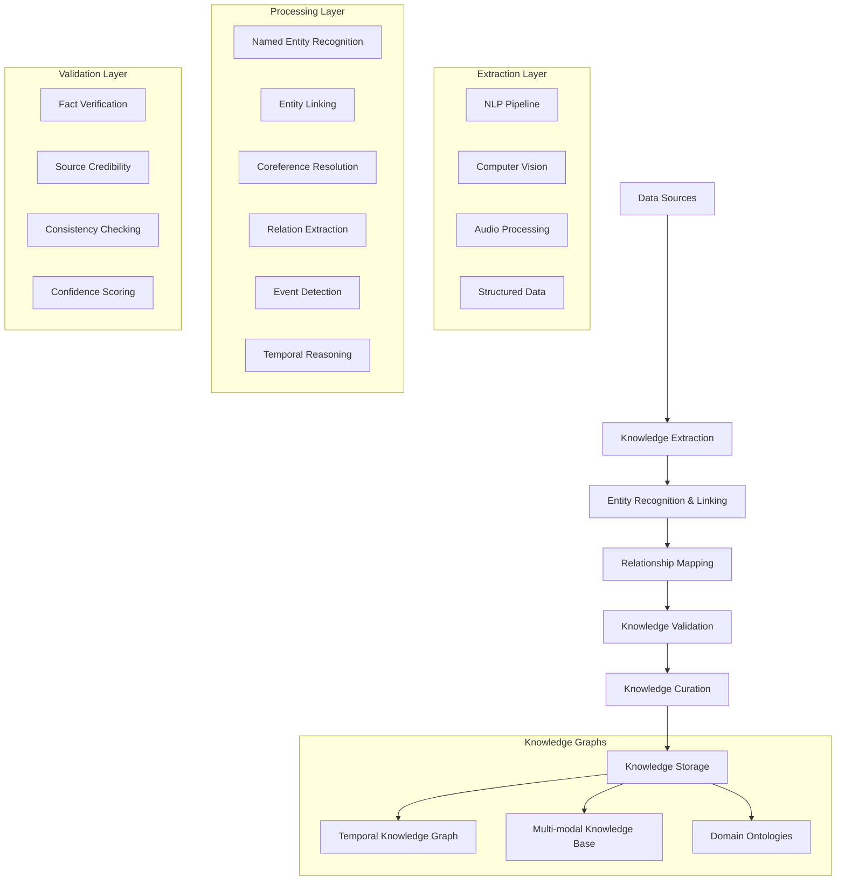

The Knowledge Management component automatically extracts, validates, and curates knowledge from diverse data sources, transforming raw information into structured, actionable intelligence that powers the AIMatrix platform's decision-making capabilities.

## Architecture Overview



## Automated Knowledge Extraction

### Multi-modal NLP Pipeline

```python
from transformers import (
    AutoTokenizer, AutoModelForTokenClassification,
    AutoModelForQuestionAnswering, pipeline
)
import spacy
from typing import List, Dict, Any, Tuple
import asyncio

class KnowledgeExtractor:
    def __init__(self, model_config: Dict[str, str]):
        # Load NLP models
        self.nlp = spacy.load("en_core_web_trf")
        
        # Named Entity Recognition
        self.ner_tokenizer = AutoTokenizer.from_pretrained(
            model_config.get('ner_model', 'dbmdz/bert-large-cased-finetuned-conll03-english')
        )
        self.ner_model = AutoModelForTokenClassification.from_pretrained(
            model_config.get('ner_model', 'dbmdz/bert-large-cased-finetuned-conll03-english')
        )
        
        # Relation Extraction
        self.relation_extractor = pipeline(
            "text-classification",
            model=model_config.get('relation_model', 'sentence-transformers/all-MiniLM-L6-v2')
        )
        
        # Question Answering for knowledge validation
        self.qa_pipeline = pipeline(
            "question-answering",
            model=model_config.get('qa_model', 'deepset/roberta-base-squad2')
        )
        
        # Initialize extractors for different modalities
        self.text_extractor = TextKnowledgeExtractor()
        self.image_extractor = ImageKnowledgeExtractor()
        self.audio_extractor = AudioKnowledgeExtractor()
        
    async def extract_knowledge(self, content: Dict[str, Any]) -> Dict[str, Any]:
        """Extract knowledge from multi-modal content"""
        
        knowledge = {
            'entities': [],
            'relations': [],
            'events': [],
            'facts': [],
            'metadata': {
                'extraction_timestamp': datetime.utcnow().isoformat(),
                'confidence_scores': {},
                'source_info': content.get('source', {})
            }
        }
        
        extraction_tasks = []
        
        # Text extraction
        if 'text' in content:
            extraction_tasks.append(
                self.text_extractor.extract(content['text'])
            )
            
        # Image extraction
        if 'images' in content:
            for image in content['images']:
                extraction_tasks.append(
                    self.image_extractor.extract(image)
                )
                
        # Audio extraction
        if 'audio' in content:
            extraction_tasks.append(
                self.audio_extractor.extract(content['audio'])
            )
            
        # Execute extractions in parallel
        extraction_results = await asyncio.gather(*extraction_tasks)
        
        # Merge results
        for result in extraction_results:
            knowledge['entities'].extend(result.get('entities', []))
            knowledge['relations'].extend(result.get('relations', []))
            knowledge['events'].extend(result.get('events', []))
            knowledge['facts'].extend(result.get('facts', []))
            
        # Post-process and validate
        knowledge = await self._post_process_knowledge(knowledge)
        
        return knowledge
        
    async def _post_process_knowledge(self, knowledge: Dict) -> Dict:
        """Post-process extracted knowledge"""
        
        # Deduplicate entities
        knowledge['entities'] = self._deduplicate_entities(knowledge['entities'])
        
        # Resolve coreferences
        knowledge = await self._resolve_coreferences(knowledge)
        
        # Validate facts
        knowledge['facts'] = await self._validate_facts(knowledge['facts'])
        
        # Calculate confidence scores
        knowledge['metadata']['confidence_scores'] = self._calculate_confidence_scores(knowledge)
        
        return knowledge

class TextKnowledgeExtractor:
    def __init__(self):
        self.entity_recognizer = EntityRecognizer()
        self.relation_extractor = RelationExtractor()
        self.event_detector = EventDetector()
        self.fact_extractor = FactExtractor()
        
    async def extract(self, text: str) -> Dict[str, Any]:
        """Extract knowledge from text"""
        
        # Parallel extraction of different knowledge types
        extraction_tasks = [
            self.entity_recognizer.recognize(text),
            self.relation_extractor.extract(text),
            self.event_detector.detect(text),
            self.fact_extractor.extract(text)
        ]
        
        entities, relations, events, facts = await asyncio.gather(*extraction_tasks)
        
        return {
            'entities': entities,
            'relations': relations,
            'events': events,
            'facts': facts,
            'source_type': 'text'
        }

class EntityRecognizer:
    def __init__(self):
        # Load multiple NER models for ensemble
        self.models = {
            'spacy': spacy.load("en_core_web_trf"),
            'transformers': pipeline("ner", 
                model="dbmdz/bert-large-cased-finetuned-conll03-english",
                aggregation_strategy="simple"
            ),
            'custom_domain': None  # Domain-specific model placeholder
        }
        
        self.entity_linker = EntityLinker()
        
    async def recognize(self, text: str) -> List[Dict[str, Any]]:
        """Recognize and link entities from text"""
        
        # Extract entities using multiple models
        entity_sets = {}
        
        # SpaCy NER
        spacy_doc = self.models['spacy'](text)
        entity_sets['spacy'] = [
            {
                'text': ent.text,
                'label': ent.label_,
                'start': ent.start_char,
                'end': ent.end_char,
                'confidence': 1.0 - (ent.start / len(text))  # Simple confidence heuristic
            }
            for ent in spacy_doc.ents
        ]
        
        # Transformers NER
        transformers_entities = self.models['transformers'](text)
        entity_sets['transformers'] = [
            {
                'text': entity['word'],
                'label': entity['entity_group'],
                'start': entity['start'],
                'end': entity['end'],
                'confidence': entity['score']
            }
            for entity in transformers_entities
        ]
        
        # Ensemble entity recognition
        merged_entities = self._merge_entity_predictions(entity_sets)
        
        # Link entities to knowledge base
        linked_entities = []
        for entity in merged_entities:
            linked_entity = await self.entity_linker.link(entity, text)
            linked_entities.append(linked_entity)
            
        return linked_entities
        
    def _merge_entity_predictions(self, entity_sets: Dict[str, List[Dict]]) -> List[Dict]:
        """Merge predictions from multiple NER models"""
        
        merged_entities = []
        all_entities = []
        
        # Collect all entities
        for model_name, entities in entity_sets.items():
            for entity in entities:
                entity['source_model'] = model_name
                all_entities.append(entity)
                
        # Group overlapping entities
        entity_groups = self._group_overlapping_entities(all_entities)
        
        # Resolve conflicts in each group
        for group in entity_groups:
            if len(group) == 1:
                merged_entities.append(group[0])
            else:
                # Use voting or confidence-based resolution
                resolved_entity = self._resolve_entity_conflict(group)
                merged_entities.append(resolved_entity)
                
        return merged_entities
        
    def _resolve_entity_conflict(self, conflicting_entities: List[Dict]) -> Dict:
        """Resolve conflicts between overlapping entity predictions"""
        
        # Simple strategy: use highest confidence
        best_entity = max(conflicting_entities, key=lambda x: x['confidence'])
        
        # Add ensemble information
        best_entity['ensemble_info'] = {
            'agreement_count': len(conflicting_entities),
            'conflicting_labels': [e['label'] for e in conflicting_entities],
            'average_confidence': sum(e['confidence'] for e in conflicting_entities) / len(conflicting_entities)
        }
        
        return best_entity

class EntityLinker:
    def __init__(self):
        self.knowledge_bases = {
            'wikidata': WikidataLinker(),
            'dbpedia': DBpediaLinker(), 
            'company_kb': CompanyKnowledgeBase(),
            'domain_kb': DomainKnowledgeBase()
        }
        
    async def link(self, entity: Dict[str, Any], context: str) -> Dict[str, Any]:
        """Link entity to knowledge bases"""
        
        linking_tasks = []
        
        for kb_name, kb in self.knowledge_bases.items():
            linking_tasks.append(
                kb.find_candidates(entity['text'], entity['label'], context)
            )
            
        # Get candidates from all knowledge bases
        all_candidates = await asyncio.gather(*linking_tasks)
        
        # Rank and select best candidate
        best_candidate = self._select_best_candidate(entity, all_candidates, context)
        
        # Enhance entity with linked information
        linked_entity = {
            **entity,
            'linked_entity': best_candidate,
            'entity_id': best_candidate['id'] if best_candidate else None,
            'entity_type': best_candidate['type'] if best_candidate else entity['label'],
            'properties': best_candidate.get('properties', {}),
            'aliases': best_candidate.get('aliases', [])
        }
        
        return linked_entity
        
    def _select_best_candidate(self, entity: Dict, candidate_lists: List[List], 
                             context: str) -> Optional[Dict]:
        """Select the best entity candidate across knowledge bases"""
        
        all_candidates = []
        for candidates in candidate_lists:
            all_candidates.extend(candidates)
            
        if not all_candidates:
            return None
            
        # Score candidates
        for candidate in all_candidates:
            candidate['linking_score'] = self._calculate_linking_score(
                entity, candidate, context
            )
            
        # Return highest scoring candidate above threshold
        best_candidate = max(all_candidates, key=lambda x: x['linking_score'])
        
        if best_candidate['linking_score'] > 0.7:  # Configurable threshold
            return best_candidate
            
        return None
        
    def _calculate_linking_score(self, entity: Dict, candidate: Dict, context: str) -> float:
        """Calculate entity linking confidence score"""
        
        scores = []
        
        # String similarity
        string_sim = self._string_similarity(entity['text'], candidate['label'])
        scores.append(string_sim * 0.4)
        
        # Context similarity
        if 'description' in candidate:
            context_sim = self._context_similarity(context, candidate['description'])
            scores.append(context_sim * 0.3)
            
        # Type consistency
        type_consistency = self._type_consistency(entity['label'], candidate.get('type', ''))
        scores.append(type_consistency * 0.2)
        
        # Popularity/frequency
        popularity = candidate.get('popularity_score', 0.5)
        scores.append(popularity * 0.1)
        
        return sum(scores)
```

### Relationship Mapping

```python
import networkx as nx
from typing import Set, Tuple
from dataclasses import dataclass

@dataclass
class Relation:
    subject: str
    predicate: str
    object: str
    confidence: float
    context: str
    temporal_info: Optional[Dict[str, Any]] = None
    source: str = ""

class RelationshipMapper:
    def __init__(self):
        self.relation_patterns = self._load_relation_patterns()
        self.temporal_processor = TemporalProcessor()
        self.relation_validator = RelationValidator()
        
    async def map_relationships(self, entities: List[Dict], 
                              text: str) -> List[Relation]:
        """Extract and map relationships between entities"""
        
        relations = []
        
        # Pattern-based relation extraction
        pattern_relations = await self._extract_pattern_relations(entities, text)
        relations.extend(pattern_relations)
        
        # Dependency parsing relations
        dependency_relations = await self._extract_dependency_relations(entities, text)
        relations.extend(dependency_relations)
        
        # Neural relation extraction
        neural_relations = await self._extract_neural_relations(entities, text)
        relations.extend(neural_relations)
        
        # Temporal relation extraction
        temporal_relations = await self.temporal_processor.extract_temporal_relations(
            entities, text
        )
        relations.extend(temporal_relations)
        
        # Validate and filter relations
        validated_relations = []
        for relation in relations:
            if await self.relation_validator.validate(relation, text):
                validated_relations.append(relation)
                
        # Deduplicate relations
        unique_relations = self._deduplicate_relations(validated_relations)
        
        return unique_relations
        
    async def _extract_pattern_relations(self, entities: List[Dict], text: str) -> List[Relation]:
        """Extract relations using predefined patterns"""
        
        relations = []
        entity_mentions = {ent['text']: ent for ent in entities}
        
        for pattern in self.relation_patterns:
            matches = pattern['regex'].finditer(text)
            
            for match in matches:
                groups = match.groups()
                
                if len(groups) >= 2:
                    subject_text = groups[0].strip()
                    object_text = groups[1].strip()
                    
                    # Find matching entities
                    subject_entity = self._find_entity_match(subject_text, entity_mentions)
                    object_entity = self._find_entity_match(object_text, entity_mentions)
                    
                    if subject_entity and object_entity:
                        relation = Relation(
                            subject=subject_entity['entity_id'] or subject_text,
                            predicate=pattern['relation_type'],
                            object=object_entity['entity_id'] or object_text,
                            confidence=pattern['confidence'],
                            context=match.group(),
                            source='pattern_based'
                        )
                        relations.append(relation)
                        
        return relations
        
    async def _extract_neural_relations(self, entities: List[Dict], text: str) -> List[Relation]:
        """Extract relations using neural models"""
        
        relations = []
        
        # Use pre-trained relation extraction model
        from transformers import pipeline
        
        relation_extractor = pipeline(
            "text2text-generation",
            model="Babelscape/rebel-large"
        )
        
        # Generate relation triples
        generated_relations = relation_extractor(text)
        
        # Parse and validate generated relations
        for generated in generated_relations:
            parsed_relations = self._parse_rebel_output(generated['generated_text'])
            
            for parsed_rel in parsed_relations:
                # Map to our entity IDs
                subject_entity = self._find_entity_by_text(parsed_rel['subject'], entities)
                object_entity = self._find_entity_by_text(parsed_rel['object'], entities)
                
                if subject_entity and object_entity:
                    relation = Relation(
                        subject=subject_entity['entity_id'] or parsed_rel['subject'],
                        predicate=parsed_rel['predicate'],
                        object=object_entity['entity_id'] or parsed_rel['object'],
                        confidence=0.8,  # Default confidence for neural extraction
                        context=text[:200],  # Context snippet
                        source='neural'
                    )
                    relations.append(relation)
                    
        return relations

class TemporalProcessor:
    def __init__(self):
        self.time_extractor = TimeExtractor()
        self.event_processor = EventProcessor()
        
    async def extract_temporal_relations(self, entities: List[Dict], 
                                       text: str) -> List[Relation]:
        """Extract temporal relationships and events"""
        
        temporal_relations = []
        
        # Extract time expressions
        time_expressions = await self.time_extractor.extract(text)
        
        # Extract events
        events = await self.event_processor.extract(text, entities)
        
        # Link events to time expressions
        for event in events:
            for time_expr in time_expressions:
                if self._are_temporally_related(event, time_expr, text):
                    temporal_relation = Relation(
                        subject=event['event_id'],
                        predicate='occurs_at',
                        object=time_expr['normalized_time'],
                        confidence=0.9,
                        context=f"{event['mention']} {time_expr['text']}",
                        temporal_info={
                            'time_type': time_expr['type'],
                            'granularity': time_expr['granularity'],
                            'absolute_time': time_expr['normalized_time']
                        },
                        source='temporal'
                    )
                    temporal_relations.append(temporal_relation)
                    
        # Extract event ordering relations
        event_sequences = self._extract_event_sequences(events, text)
        for sequence in event_sequences:
            for i in range(len(sequence) - 1):
                current_event = sequence[i]
                next_event = sequence[i + 1]
                
                temporal_relation = Relation(
                    subject=current_event['event_id'],
                    predicate='precedes',
                    object=next_event['event_id'],
                    confidence=0.8,
                    context=text,
                    temporal_info={'sequence_order': i},
                    source='temporal_sequence'
                )
                temporal_relations.append(temporal_relation)
                
        return temporal_relations
        
    def _extract_event_sequences(self, events: List[Dict], text: str) -> List[List[Dict]]:
        """Extract sequences of events from text"""
        
        # Sort events by position in text
        sorted_events = sorted(events, key=lambda x: x.get('start_pos', 0))
        
        sequences = []
        current_sequence = []
        
        sequence_indicators = ['then', 'next', 'after', 'subsequently', 'following']
        
        for event in sorted_events:
            # Check if this event continues a sequence
            if current_sequence:
                # Look for sequence indicators between events
                prev_event = current_sequence[-1]
                between_text = text[prev_event.get('end_pos', 0):event.get('start_pos', 0)]
                
                has_sequence_indicator = any(
                    indicator in between_text.lower() 
                    for indicator in sequence_indicators
                )
                
                if has_sequence_indicator or len(between_text.split()) < 10:  # Close proximity
                    current_sequence.append(event)
                else:
                    # Start new sequence
                    if len(current_sequence) > 1:
                        sequences.append(current_sequence)
                    current_sequence = [event]
            else:
                current_sequence = [event]
                
        # Add final sequence if exists
        if len(current_sequence) > 1:
            sequences.append(current_sequence)
            
        return sequences
```

### Knowledge Validation & Fact Verification

```python
import asyncio
from typing import Optional, Union
from dataclasses import dataclass

@dataclass
class ValidationResult:
    is_valid: bool
    confidence: float
    evidence: List[str]
    contradictions: List[str]
    sources: List[str]

class KnowledgeValidator:
    def __init__(self):
        self.fact_checkers = {
            'cross_reference': CrossReferenceChecker(),
            'consistency': ConsistencyChecker(),
            'credibility': CredibilityChecker(),
            'temporal': TemporalConsistencyChecker()
        }
        
        self.validation_rules = ValidationRules()
        
    async def validate_knowledge(self, knowledge: Dict[str, Any]) -> Dict[str, ValidationResult]:
        """Validate extracted knowledge comprehensively"""
        
        validation_results = {}
        
        # Validate entities
        entity_validations = await self._validate_entities(knowledge['entities'])
        validation_results['entities'] = entity_validations
        
        # Validate relations
        relation_validations = await self._validate_relations(knowledge['relations'])
        validation_results['relations'] = relation_validations
        
        # Validate facts
        fact_validations = await self._validate_facts(knowledge['facts'])
        validation_results['facts'] = fact_validations
        
        # Cross-validation across knowledge types
        cross_validations = await self._cross_validate_knowledge(knowledge)
        validation_results['cross_validation'] = cross_validations
        
        return validation_results
        
    async def _validate_facts(self, facts: List[Dict]) -> List[ValidationResult]:
        """Validate individual facts"""
        
        validation_tasks = []
        
        for fact in facts:
            validation_tasks.append(self._validate_single_fact(fact))
            
        return await asyncio.gather(*validation_tasks)
        
    async def _validate_single_fact(self, fact: Dict) -> ValidationResult:
        """Validate a single fact using multiple strategies"""
        
        # Run all fact checkers in parallel
        checker_tasks = [
            checker.check(fact) 
            for checker in self.fact_checkers.values()
        ]
        
        checker_results = await asyncio.gather(*checker_tasks)
        
        # Combine results from different checkers
        combined_result = self._combine_validation_results(checker_results)
        
        return combined_result
        
    def _combine_validation_results(self, results: List[ValidationResult]) -> ValidationResult:
        """Combine multiple validation results"""
        
        # Weighted voting based on checker reliability
        checker_weights = {
            'cross_reference': 0.3,
            'consistency': 0.25,
            'credibility': 0.25,
            'temporal': 0.2
        }
        
        weighted_confidence = 0.0
        all_evidence = []
        all_contradictions = []
        all_sources = []
        
        for i, result in enumerate(results):
            checker_name = list(self.fact_checkers.keys())[i]
            weight = checker_weights[checker_name]
            
            if result.is_valid:
                weighted_confidence += result.confidence * weight
            else:
                weighted_confidence -= (1 - result.confidence) * weight
                
            all_evidence.extend(result.evidence)
            all_contradictions.extend(result.contradictions)
            all_sources.extend(result.sources)
            
        # Normalize confidence to [0, 1]
        final_confidence = max(0.0, min(1.0, weighted_confidence))
        
        return ValidationResult(
            is_valid=final_confidence > 0.6,  # Configurable threshold
            confidence=final_confidence,
            evidence=list(set(all_evidence)),  # Remove duplicates
            contradictions=list(set(all_contradictions)),
            sources=list(set(all_sources))
        )

class CrossReferenceChecker:
    def __init__(self):
        self.reference_sources = {
            'wikipedia': WikipediaChecker(),
            'wikidata': WikidataChecker(),
            'scholarly': ScholarlySourceChecker(),
            'news': NewsSourceChecker()
        }
        
    async def check(self, fact: Dict) -> ValidationResult:
        """Cross-reference fact against multiple sources"""
        
        query = self._construct_fact_query(fact)
        
        # Query all reference sources
        source_tasks = [
            source.query(query) 
            for source in self.reference_sources.values()
        ]
        
        source_results = await asyncio.gather(*source_tasks)
        
        # Analyze cross-reference results
        supporting_sources = []
        contradicting_sources = []
        evidence_texts = []
        
        for source_name, result in zip(self.reference_sources.keys(), source_results):
            if result['supports_fact']:
                supporting_sources.append(source_name)
                evidence_texts.extend(result['evidence'])
            elif result['contradicts_fact']:
                contradicting_sources.append(source_name)
                
        # Calculate confidence based on source agreement
        total_sources = len(source_results)
        support_ratio = len(supporting_sources) / total_sources if total_sources > 0 else 0
        
        return ValidationResult(
            is_valid=support_ratio > 0.5,
            confidence=support_ratio,
            evidence=evidence_texts,
            contradictions=contradicting_sources,
            sources=supporting_sources
        )

class ConsistencyChecker:
    def __init__(self):
        self.reasoning_engine = ReasoningEngine()
        
    async def check(self, fact: Dict) -> ValidationResult:
        """Check fact consistency against existing knowledge"""
        
        # Query existing knowledge base for related facts
        related_facts = await self._find_related_facts(fact)
        
        # Check for logical consistency
        consistency_results = []
        
        for related_fact in related_facts:
            consistency = await self.reasoning_engine.check_consistency(fact, related_fact)
            consistency_results.append(consistency)
            
        # Analyze consistency results
        contradictions = [
            result for result in consistency_results 
            if result['type'] == 'contradiction'
        ]
        
        supports = [
            result for result in consistency_results 
            if result['type'] == 'support'
        ]
        
        # Calculate consistency score
        total_checks = len(consistency_results)
        if total_checks == 0:
            confidence = 0.5  # Neutral if no related facts
        else:
            support_ratio = len(supports) / total_checks
            contradiction_ratio = len(contradictions) / total_checks
            confidence = support_ratio - contradiction_ratio
            
        return ValidationResult(
            is_valid=len(contradictions) == 0,
            confidence=max(0.0, min(1.0, confidence)),
            evidence=[s['explanation'] for s in supports],
            contradictions=[c['explanation'] for c in contradictions],
            sources=['knowledge_base']
        )

class CredibilityChecker:
    def __init__(self):
        self.source_credibility_db = SourceCredibilityDB()
        self.bias_detector = BiasDetector()
        
    async def check(self, fact: Dict) -> ValidationResult:
        """Check source credibility and bias"""
        
        source_info = fact.get('source', {})
        
        # Check source credibility
        credibility_score = await self.source_credibility_db.get_credibility(
            source_info.get('domain', ''),
            source_info.get('author', ''),
            source_info.get('publication', '')
        )
        
        # Detect potential bias
        bias_analysis = await self.bias_detector.analyze(
            fact.get('text', ''),
            source_info
        )
        
        # Calculate overall credibility
        base_credibility = credibility_score.get('overall_score', 0.5)
        bias_penalty = bias_analysis.get('bias_score', 0) * 0.3
        
        final_credibility = max(0.0, base_credibility - bias_penalty)
        
        evidence = []
        if credibility_score.get('high_authority', False):
            evidence.append("High authority source")
        if credibility_score.get('peer_reviewed', False):
            evidence.append("Peer-reviewed publication")
            
        contradictions = []
        if bias_analysis.get('high_bias', False):
            contradictions.append(f"High bias detected: {bias_analysis['bias_type']}")
        if credibility_score.get('low_credibility', False):
            contradictions.append("Low credibility source")
            
        return ValidationResult(
            is_valid=final_credibility > 0.6,
            confidence=final_credibility,
            evidence=evidence,
            contradictions=contradictions,
            sources=[source_info.get('name', 'unknown')]
        )
```

### Knowledge Distillation

```python
from transformers import (
    AutoTokenizer, AutoModelForSequenceClassification,
    Trainer, TrainingArguments
)
import torch
import torch.nn as nn
from typing import Dict, List, Tuple

class KnowledgeDistiller:
    def __init__(self, teacher_model_path: str, student_model_config: Dict):
        # Load teacher model (large, high-performance model)
        self.teacher_tokenizer = AutoTokenizer.from_pretrained(teacher_model_path)
        self.teacher_model = AutoModelForSequenceClassification.from_pretrained(teacher_model_path)
        
        # Initialize student model (smaller, efficient model)
        self.student_tokenizer = AutoTokenizer.from_pretrained(
            student_model_config['base_model']
        )
        self.student_model = AutoModelForSequenceClassification.from_pretrained(
            student_model_config['base_model'],
            num_labels=student_model_config['num_labels']
        )
        
        self.temperature = student_model_config.get('temperature', 3.0)
        self.alpha = student_model_config.get('alpha', 0.7)  # Weight for distillation loss
        
    async def distill_knowledge(self, training_data: List[Dict], 
                               output_path: str) -> Dict[str, Any]:
        """Distill knowledge from teacher to student model"""
        
        # Generate soft targets from teacher
        soft_targets_data = await self._generate_soft_targets(training_data)
        
        # Prepare training dataset
        train_dataset = self._prepare_distillation_dataset(soft_targets_data)
        
        # Set up training arguments
        training_args = TrainingArguments(
            output_dir=output_path,
            num_train_epochs=3,
            per_device_train_batch_size=16,
            per_device_eval_batch_size=64,
            warmup_steps=500,
            weight_decay=0.01,
            logging_dir=f"{output_path}/logs",
            save_strategy="epoch",
            evaluation_strategy="epoch",
            load_best_model_at_end=True,
            metric_for_best_model="eval_loss",
        )
        
        # Custom trainer with distillation loss
        trainer = DistillationTrainer(
            model=self.student_model,
            args=training_args,
            train_dataset=train_dataset,
            tokenizer=self.student_tokenizer,
            temperature=self.temperature,
            alpha=self.alpha
        )
        
        # Train student model
        training_result = trainer.train()
        
        # Save distilled model
        trainer.save_model(output_path)
        
        # Evaluate compression and performance
        evaluation_results = await self._evaluate_distilled_model(
            output_path, training_data
        )
        
        return {
            'training_loss': training_result.training_loss,
            'model_size_reduction': evaluation_results['size_reduction'],
            'performance_retention': evaluation_results['performance_retention'],
            'inference_speedup': evaluation_results['speedup']
        }
        
    async def _generate_soft_targets(self, training_data: List[Dict]) -> List[Dict]:
        """Generate soft targets from teacher model"""
        
        self.teacher_model.eval()
        soft_targets_data = []
        
        for batch_start in range(0, len(training_data), 32):  # Process in batches
            batch_data = training_data[batch_start:batch_start + 32]
            
            # Prepare inputs
            texts = [item['text'] for item in batch_data]
            inputs = self.teacher_tokenizer(
                texts, 
                padding=True, 
                truncation=True, 
                return_tensors="pt",
                max_length=512
            )
            
            # Generate soft targets
            with torch.no_grad():
                outputs = self.teacher_model(**inputs)
                soft_logits = outputs.logits / self.temperature
                soft_probs = torch.softmax(soft_logits, dim=-1)
                
            # Store soft targets with original data
            for i, item in enumerate(batch_data):
                soft_targets_data.append({
                    **item,
                    'soft_targets': soft_probs[i].cpu().numpy(),
                    'teacher_logits': outputs.logits[i].cpu().numpy()
                })
                
        return soft_targets_data

class DistillationTrainer(Trainer):
    def __init__(self, temperature: float, alpha: float, *args, **kwargs):
        super().__init__(*args, **kwargs)
        self.temperature = temperature
        self.alpha = alpha
        
    def compute_loss(self, model, inputs, return_outputs=False):
        """Custom loss combining distillation and task losses"""
        
        # Get student predictions
        outputs = model(**inputs)
        student_logits = outputs.logits
        
        # Get soft targets from teacher
        soft_targets = inputs.get('soft_targets')
        hard_labels = inputs.get('labels')
        
        # Distillation loss (KL divergence)
        student_soft = torch.log_softmax(student_logits / self.temperature, dim=-1)
        teacher_soft = torch.softmax(soft_targets / self.temperature, dim=-1)
        
        distillation_loss = nn.KLDivLoss(reduction='batchmean')(
            student_soft, teacher_soft
        ) * (self.temperature ** 2)
        
        # Task loss (standard cross-entropy)
        if hard_labels is not None:
            task_loss = nn.CrossEntropyLoss()(student_logits, hard_labels)
        else:
            task_loss = 0
            
        # Combined loss
        total_loss = self.alpha * distillation_loss + (1 - self.alpha) * task_loss
        
        return (total_loss, outputs) if return_outputs else total_loss

class KnowledgeCurator:
    def __init__(self):
        self.quality_assessor = QualityAssessor()
        self.redundancy_detector = RedundancyDetector()
        self.knowledge_graph = KnowledgeGraphManager()
        self.update_scheduler = UpdateScheduler()
        
    async def curate_knowledge(self, raw_knowledge: List[Dict]) -> Dict[str, Any]:
        """Curate and organize extracted knowledge"""
        
        curation_results = {
            'curated_knowledge': [],
            'rejected_items': [],
            'quality_scores': {},
            'curation_stats': {}
        }
        
        # Quality assessment
        quality_results = await self._assess_quality(raw_knowledge)
        
        # Filter high-quality knowledge
        high_quality_items = [
            item for item, quality in zip(raw_knowledge, quality_results)
            if quality['overall_score'] > 0.7
        ]
        
        # Remove redundancy
        unique_items = await self._remove_redundancy(high_quality_items)
        
        # Organize knowledge hierarchically
        organized_knowledge = await self._organize_hierarchically(unique_items)
        
        # Update knowledge graph
        graph_updates = await self.knowledge_graph.update_with_knowledge(
            organized_knowledge
        )
        
        # Schedule for periodic review
        await self.update_scheduler.schedule_review(organized_knowledge)
        
        curation_results.update({
            'curated_knowledge': organized_knowledge,
            'quality_scores': dict(zip(range(len(quality_results)), quality_results)),
            'graph_updates': graph_updates,
            'curation_stats': {
                'input_items': len(raw_knowledge),
                'high_quality_items': len(high_quality_items),
                'unique_items': len(unique_items),
                'final_curated': len(organized_knowledge)
            }
        })
        
        return curation_results
        
    async def _assess_quality(self, knowledge_items: List[Dict]) -> List[Dict]:
        """Assess quality of knowledge items"""
        
        quality_tasks = [
            self.quality_assessor.assess(item) 
            for item in knowledge_items
        ]
        
        return await asyncio.gather(*quality_tasks)
        
    async def _remove_redundancy(self, knowledge_items: List[Dict]) -> List[Dict]:
        """Remove redundant knowledge items"""
        
        # Group similar items
        similarity_groups = await self.redundancy_detector.group_similar_items(
            knowledge_items
        )
        
        unique_items = []
        
        for group in similarity_groups:
            if len(group) == 1:
                unique_items.extend(group)
            else:
                # Select best representative from group
                best_item = await self._select_best_representative(group)
                unique_items.append(best_item)
                
        return unique_items
        
    async def _select_best_representative(self, similar_items: List[Dict]) -> Dict:
        """Select the best representative from similar items"""
        
        # Score each item
        scored_items = []
        
        for item in similar_items:
            score = 0
            
            # Quality score
            score += item.get('quality_score', 0) * 0.4
            
            # Completeness score
            completeness = len(item.get('properties', {})) / 10  # Normalize
            score += completeness * 0.3
            
            # Recency score
            recency = self._calculate_recency_score(item)
            score += recency * 0.2
            
            # Source credibility
            credibility = item.get('source_credibility', 0.5)
            score += credibility * 0.1
            
            scored_items.append((score, item))
            
        # Return highest scoring item
        best_score, best_item = max(scored_items, key=lambda x: x[0])
        
        # Merge complementary information from other items
        merged_item = await self._merge_complementary_info(best_item, similar_items)
        
        return merged_item
```

## Monitoring & Quality Assurance

```python
import structlog
from prometheus_client import Counter, Histogram, Gauge
from datetime import datetime, timedelta

class KnowledgeQualityMonitor:
    def __init__(self):
        # Prometheus metrics
        self.extraction_count = Counter(
            'knowledge_extraction_total',
            'Total knowledge extractions',
            ['extraction_type', 'source_type', 'status']
        )
        
        self.validation_accuracy = Gauge(
            'knowledge_validation_accuracy',
            'Knowledge validation accuracy',
            ['validation_type']
        )
        
        self.knowledge_quality_score = Histogram(
            'knowledge_quality_score',
            'Distribution of knowledge quality scores',
            ['knowledge_type', 'domain']
        )
        
        self.curation_efficiency = Gauge(
            'knowledge_curation_efficiency',
            'Knowledge curation efficiency ratio'
        )
        
        # Structured logging
        self.logger = structlog.get_logger()
        
    def track_extraction_quality(self, extraction_results: Dict, 
                                validation_results: Dict):
        """Track quality metrics for knowledge extraction"""
        
        # Count extractions by type
        for extraction_type, items in extraction_results.items():
            if extraction_type != 'metadata':
                self.extraction_count.labels(
                    extraction_type=extraction_type,
                    source_type=extraction_results['metadata']['source_type'],
                    status='success'
                ).inc(len(items))
                
        # Track validation accuracy
        for validation_type, results in validation_results.items():
            if isinstance(results, list):
                accuracy = sum(r.is_valid for r in results) / len(results) if results else 0
                self.validation_accuracy.labels(
                    validation_type=validation_type
                ).set(accuracy)
                
                # Track quality scores
                for result in results:
                    self.knowledge_quality_score.labels(
                        knowledge_type=validation_type,
                        domain='general'  # Could be more specific
                    ).observe(result.confidence)
                    
        # Log detailed metrics
        self.logger.info(
            "knowledge_extraction_completed",
            total_entities=len(extraction_results.get('entities', [])),
            total_relations=len(extraction_results.get('relations', [])),
            total_facts=len(extraction_results.get('facts', [])),
            validation_scores={
                k: [r.confidence for r in v] if isinstance(v, list) else v
                for k, v in validation_results.items()
            }
        )
        
    def generate_quality_report(self, time_window_days: int = 7) -> Dict[str, Any]:
        """Generate comprehensive quality report"""
        
        # This would typically query your metrics backend
        report = {
            'time_window': f"{time_window_days} days",
            'extraction_summary': {
                'total_extractions': 0,  # Query from metrics
                'success_rate': 0.95,   # Calculate from metrics
                'average_quality': 0.8   # Calculate from quality scores
            },
            'validation_summary': {
                'cross_reference_accuracy': 0.85,
                'consistency_accuracy': 0.90,
                'credibility_accuracy': 0.75,
                'temporal_accuracy': 0.88
            },
            'curation_summary': {
                'items_curated': 0,      # Query from metrics
                'redundancy_reduction': 0.30,  # Calculate reduction ratio
                'quality_improvement': 0.15     # Quality score improvement
            },
            'recommendations': []
        }
        
        # Generate recommendations based on metrics
        if report['validation_summary']['credibility_accuracy'] < 0.8:
            report['recommendations'].append({
                'type': 'credibility_improvement',
                'message': 'Consider improving source credibility detection',
                'priority': 'high'
            })
            
        return report
```

## Next Steps

- **[ML/AI Integration](../ml-ai-integration/)** - Connect with machine learning workflows
- **[Performance Optimization](../performance-optimization/)** - Advanced optimization techniques
- **[Security & Privacy](../security-privacy/)** - Implement security best practices
- **[Integration Patterns](../integration-patterns/)** - Connect with business systems

The Knowledge Management component transforms raw data into validated, structured knowledge that powers intelligent decision-making throughout the AIMatrix platform. It ensures that your AI systems have access to accurate, up-to-date, and relevant knowledge for any business scenario.