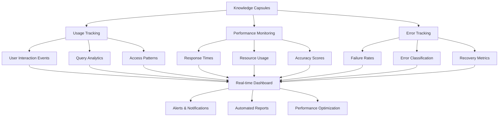

Implement comprehensive monitoring and analytics to track knowledge capsule performance, usage patterns, and effectiveness in real-time.

## Monitoring Architecture



## Usage Tracking System

### Event Collection Framework

```typescript
interface UsageEvent {
  id: string;
  timestamp: Date;
  eventType: EventType;
  capsuleId: string;
  userId: string;
  sessionId: string;
  context: EventContext;
  metrics: EventMetrics;
}

enum EventType {
  QUERY = 'query',
  ACCESS = 'access',
  UPDATE = 'update',
  FEEDBACK = 'feedback',
  ERROR = 'error'
}

interface EventContext {
  userAgent?: string;
  ipAddress?: string;
  location?: string;
  department?: string;
  userRole?: string;
  queryText?: string;
  responseTime?: number;
  accuracy?: number;
}

class UsageTracker {
  private supabase: SupabaseClient;
  private eventQueue: UsageEvent[] = [];
  
  constructor(supabaseClient: SupabaseClient) {
    this.supabase = supabaseClient;
    this.startBatchProcessor();
  }
  
  async trackQuery(
    capsuleId: string,
    query: string,
    userId: string,
    responseTime: number,
    accuracy: number
  ): Promise<void> {
    
    const event: UsageEvent = {
      id: crypto.randomUUID(),
      timestamp: new Date(),
      eventType: EventType.QUERY,
      capsuleId,
      userId,
      sessionId: this.getSessionId(userId),
      context: {
        queryText: query,
        responseTime,
        accuracy,
        userRole: await this.getUserRole(userId),
        department: await this.getUserDepartment(userId)
      },
      metrics: {
        responseTime,
        accuracy,
        success: accuracy > 0.7
      }
    };
    
    this.eventQueue.push(event);
  }
  
  private async startBatchProcessor(): Promise<void> {
    setInterval(async () => {
      if (this.eventQueue.length > 0) {
        const batch = this.eventQueue.splice(0, 100); // Process 100 at a time
        await this.processBatch(batch);
      }
    }, 5000); // Process every 5 seconds
  }
  
  private async processBatch(events: UsageEvent[]): Promise<void> {
    try {
      const { error } = await this.supabase
        .from('usage_events')
        .insert(events);
      
      if (error) {
        console.error('Failed to insert usage events:', error);
        // Re-queue failed events
        this.eventQueue.unshift(...events);
      }
      
    } catch (error) {
      console.error('Batch processing error:', error);
      this.eventQueue.unshift(...events);
    }
  }
}
```

### Supabase Schema for Usage Tracking

```sql
-- Usage events table
CREATE TABLE usage_events (
    id UUID PRIMARY KEY,
    timestamp TIMESTAMP WITH TIME ZONE NOT NULL,
    event_type TEXT NOT NULL,
    capsule_id UUID NOT NULL REFERENCES knowledge_capsules(id),
    user_id UUID NOT NULL,
    session_id UUID NOT NULL,
    context JSONB DEFAULT '{}',
    metrics JSONB DEFAULT '{}',
    created_at TIMESTAMP WITH TIME ZONE DEFAULT NOW()
);

-- Indexes for performance
CREATE INDEX idx_usage_events_timestamp ON usage_events(timestamp);
CREATE INDEX idx_usage_events_capsule_id ON usage_events(capsule_id);
CREATE INDEX idx_usage_events_user_id ON usage_events(user_id);
CREATE INDEX idx_usage_events_type ON usage_events(event_type);

-- Aggregated usage statistics table
CREATE TABLE usage_statistics (
    id UUID PRIMARY KEY DEFAULT gen_random_uuid(),
    capsule_id UUID NOT NULL REFERENCES knowledge_capsules(id),
    date DATE NOT NULL,
    total_queries INTEGER DEFAULT 0,
    unique_users INTEGER DEFAULT 0,
    avg_response_time FLOAT DEFAULT 0,
    avg_accuracy FLOAT DEFAULT 0,
    error_rate FLOAT DEFAULT 0,
    satisfaction_score FLOAT DEFAULT 0,
    created_at TIMESTAMP WITH TIME ZONE DEFAULT NOW(),
    UNIQUE(capsule_id, date)
);

-- Real-time usage aggregation function
CREATE OR REPLACE FUNCTION aggregate_daily_usage()
RETURNS VOID
LANGUAGE plpgsql
AS $$
BEGIN
    INSERT INTO usage_statistics (
        capsule_id,
        date,
        total_queries,
        unique_users,
        avg_response_time,
        avg_accuracy,
        error_rate
    )
    SELECT 
        capsule_id,
        DATE(timestamp) as date,
        COUNT(*) as total_queries,
        COUNT(DISTINCT user_id) as unique_users,
        AVG((metrics->>'responseTime')::FLOAT) as avg_response_time,
        AVG((metrics->>'accuracy')::FLOAT) as avg_accuracy,
        AVG(CASE WHEN metrics->>'success' = 'false' THEN 1.0 ELSE 0.0 END) as error_rate
    FROM usage_events 
    WHERE event_type = 'query'
    AND DATE(timestamp) = CURRENT_DATE - INTERVAL '1 day'
    GROUP BY capsule_id, DATE(timestamp)
    ON CONFLICT (capsule_id, date) 
    DO UPDATE SET
        total_queries = EXCLUDED.total_queries,
        unique_users = EXCLUDED.unique_users,
        avg_response_time = EXCLUDED.avg_response_time,
        avg_accuracy = EXCLUDED.avg_accuracy,
        error_rate = EXCLUDED.error_rate;
END;
$$;

-- Schedule daily aggregation
SELECT cron.schedule('daily-usage-aggregation', '0 1 * * *', 'SELECT aggregate_daily_usage();');
```

## Performance Metrics Dashboard

### Real-time Performance Monitoring

```typescript
interface PerformanceMetrics {
  responseTime: {
    current: number;
    average: number;
    p95: number;
    p99: number;
  };
  accuracy: {
    current: number;
    average: number;
    trend: 'improving' | 'declining' | 'stable';
  };
  throughput: {
    queriesPerSecond: number;
    peakQPS: number;
    averageQPS: number;
  };
  errors: {
    currentRate: number;
    totalErrors: number;
    errorTypes: Record<string, number>;
  };
  resources: {
    memoryUsage: number;
    cpuUsage: number;
    storageUsage: number;
  };
}

class PerformanceMonitor {
  private metrics: Map<string, PerformanceMetrics> = new Map();
  private supabase: SupabaseClient;
  
  constructor(supabaseClient: SupabaseClient) {
    this.supabase = supabaseClient;
    this.startRealTimeMonitoring();
  }
  
  private async startRealTimeMonitoring(): Promise<void> {
    // Subscribe to real-time updates
    const subscription = this.supabase
      .channel('performance-monitoring')
      .on(
        'postgres_changes',
        {
          event: 'INSERT',
          schema: 'public',
          table: 'usage_events',
          filter: 'event_type=eq.query'
        },
        (payload) => this.processRealtimeEvent(payload)
      )
      .subscribe();
    
    // Periodic metric calculation
    setInterval(() => this.calculateMetrics(), 30000); // Every 30 seconds
  }
  
  private async processRealtimeEvent(payload: any): Promise<void> {
    const event = payload.new as UsageEvent;
    
    // Update real-time metrics
    const capsuleMetrics = this.getOrCreateMetrics(event.capsuleId);
    
    // Update response time metrics
    capsuleMetrics.responseTime.current = event.metrics.responseTime;
    
    // Update accuracy metrics  
    capsuleMetrics.accuracy.current = event.metrics.accuracy;
    
    // Update throughput
    this.updateThroughputMetrics(event.capsuleId);
    
    // Check for alerts
    await this.checkAlerts(event.capsuleId, capsuleMetrics);
  }
  
  private async calculateMetrics(): Promise<void> {
    const capsuleIds = await this.getActiveCapsules();
    
    for (const capsuleId of capsuleIds) {
      const metrics = await this.calculateCapsuleMetrics(capsuleId);
      this.metrics.set(capsuleId, metrics);
    }
  }
  
  private async calculateCapsuleMetrics(capsuleId: string): Promise<PerformanceMetrics> {
    const timeWindow = new Date(Date.now() - 3600000); // Last hour
    
    const { data: events } = await this.supabase
      .from('usage_events')
      .select('*')
      .eq('capsule_id', capsuleId)
      .eq('event_type', 'query')
      .gte('timestamp', timeWindow.toISOString());
    
    if (!events || events.length === 0) {
      return this.getDefaultMetrics();
    }
    
    const responseTimes = events
      .map(e => e.metrics.responseTime)
      .filter(rt => rt != null)
      .sort((a, b) => a - b);
    
    const accuracyScores = events
      .map(e => e.metrics.accuracy)
      .filter(acc => acc != null);
    
    return {
      responseTime: {
        current: responseTimes[responseTimes.length - 1] || 0,
        average: responseTimes.reduce((a, b) => a + b, 0) / responseTimes.length,
        p95: this.calculatePercentile(responseTimes, 95),
        p99: this.calculatePercentile(responseTimes, 99)
      },
      accuracy: {
        current: accuracyScores[accuracyScores.length - 1] || 0,
        average: accuracyScores.reduce((a, b) => a + b, 0) / accuracyScores.length,
        trend: this.calculateTrend(accuracyScores)
      },
      throughput: {
        queriesPerSecond: events.length / 3600,
        peakQPS: await this.calculatePeakQPS(capsuleId),
        averageQPS: await this.calculateAverageQPS(capsuleId)
      },
      errors: await this.calculateErrorMetrics(capsuleId, timeWindow),
      resources: await this.getResourceMetrics(capsuleId)
    };
  }
}
```

### Performance Analytics Views

```sql
-- Performance analytics views
CREATE VIEW performance_dashboard AS
SELECT 
    kc.id as capsule_id,
    kc.title,
    kc.namespace_id,
    us.date,
    us.total_queries,
    us.unique_users,
    us.avg_response_time,
    us.avg_accuracy,
    us.error_rate,
    us.satisfaction_score,
    CASE 
        WHEN us.avg_response_time <= 500 THEN 'excellent'
        WHEN us.avg_response_time <= 1000 THEN 'good' 
        WHEN us.avg_response_time <= 2000 THEN 'fair'
        ELSE 'poor'
    END as response_time_grade,
    CASE 
        WHEN us.avg_accuracy >= 0.9 THEN 'excellent'
        WHEN us.avg_accuracy >= 0.8 THEN 'good'
        WHEN us.avg_accuracy >= 0.7 THEN 'fair'
        ELSE 'poor'
    END as accuracy_grade
FROM knowledge_capsules kc
LEFT JOIN usage_statistics us ON kc.id = us.capsule_id
WHERE us.date >= CURRENT_DATE - INTERVAL '30 days';

-- Trending analytics
CREATE VIEW trending_capsules AS
WITH daily_metrics AS (
    SELECT 
        capsule_id,
        date,
        total_queries,
        avg_accuracy,
        ROW_NUMBER() OVER (PARTITION BY capsule_id ORDER BY date DESC) as day_rank
    FROM usage_statistics
    WHERE date >= CURRENT_DATE - INTERVAL '7 days'
),
trends AS (
    SELECT 
        capsule_id,
        AVG(CASE WHEN day_rank <= 3 THEN total_queries END) as recent_avg,
        AVG(CASE WHEN day_rank > 3 THEN total_queries END) as previous_avg,
        AVG(CASE WHEN day_rank <= 3 THEN avg_accuracy END) as recent_accuracy,
        AVG(CASE WHEN day_rank > 3 THEN avg_accuracy END) as previous_accuracy
    FROM daily_metrics
    GROUP BY capsule_id
)
SELECT 
    kc.id,
    kc.title,
    t.recent_avg,
    t.previous_avg,
    ((t.recent_avg - t.previous_avg) / NULLIF(t.previous_avg, 0) * 100) as usage_trend_percent,
    ((t.recent_accuracy - t.previous_accuracy) / NULLIF(t.previous_accuracy, 0) * 100) as accuracy_trend_percent,
    CASE 
        WHEN ((t.recent_avg - t.previous_avg) / NULLIF(t.previous_avg, 0) * 100) > 20 THEN 'trending_up'
        WHEN ((t.recent_avg - t.previous_avg) / NULLIF(t.previous_avg, 0) * 100) < -20 THEN 'trending_down'
        ELSE 'stable'
    END as trend_status
FROM knowledge_capsules kc
JOIN trends t ON kc.id = t.capsule_id
WHERE t.recent_avg IS NOT NULL;
```

## Error Tracking and Issue Detection

### Automated Error Classification

```typescript
enum ErrorType {
  QUERY_PARSING = 'query_parsing',
  KNOWLEDGE_NOT_FOUND = 'knowledge_not_found',
  ACCURACY_TOO_LOW = 'accuracy_too_low',
  TIMEOUT = 'timeout',
  SYSTEM_ERROR = 'system_error',
  AUTHENTICATION = 'authentication',
  AUTHORIZATION = 'authorization'
}

interface ErrorEvent {
  id: string;
  timestamp: Date;
  errorType: ErrorType;
  capsuleId?: string;
  userId: string;
  errorMessage: string;
  stackTrace?: string;
  context: ErrorContext;
  severity: 'low' | 'medium' | 'high' | 'critical';
  resolved: boolean;
}

interface ErrorContext {
  query?: string;
  userAgent?: string;
  sessionId: string;
  requestId: string;
  responseTime?: number;
}

class ErrorTracker {
  private supabase: SupabaseClient;
  
  constructor(supabaseClient: SupabaseClient) {
    this.supabase = supabaseClient;
  }
  
  async trackError(
    error: Error,
    context: ErrorContext,
    capsuleId?: string,
    userId?: string
  ): Promise<void> {
    
    const errorEvent: ErrorEvent = {
      id: crypto.randomUUID(),
      timestamp: new Date(),
      errorType: this.classifyError(error),
      capsuleId,
      userId: userId || 'anonymous',
      errorMessage: error.message,
      stackTrace: error.stack,
      context,
      severity: this.determineSeverity(error, context),
      resolved: false
    };
    
    // Store error event
    await this.storeErrorEvent(errorEvent);
    
    // Check if immediate action is needed
    if (errorEvent.severity === 'critical') {
      await this.triggerImmediateAlert(errorEvent);
    }
    
    // Update error rate metrics
    await this.updateErrorRateMetrics(errorEvent);
  }
  
  private classifyError(error: Error): ErrorType {
    const message = error.message.toLowerCase();
    
    if (message.includes('timeout') || message.includes('timed out')) {
      return ErrorType.TIMEOUT;
    }
    
    if (message.includes('not found') || message.includes('no results')) {
      return ErrorType.KNOWLEDGE_NOT_FOUND;
    }
    
    if (message.includes('accuracy') || message.includes('confidence')) {
      return ErrorType.ACCURACY_TOO_LOW;
    }
    
    if (message.includes('auth') || message.includes('token')) {
      return ErrorType.AUTHENTICATION;
    }
    
    if (message.includes('permission') || message.includes('access denied')) {
      return ErrorType.AUTHORIZATION;
    }
    
    if (message.includes('parse') || message.includes('invalid query')) {
      return ErrorType.QUERY_PARSING;
    }
    
    return ErrorType.SYSTEM_ERROR;
  }
  
  private determineSeverity(error: Error, context: ErrorContext): 'low' | 'medium' | 'high' | 'critical' {
    // Critical: System-wide failures or security issues
    if (error.message.includes('database') || error.message.includes('connection')) {
      return 'critical';
    }
    
    // High: User-facing errors affecting functionality
    if (context.responseTime && context.responseTime > 5000) {
      return 'high';
    }
    
    // Medium: Degraded experience but functional
    if (context.responseTime && context.responseTime > 2000) {
      return 'medium';
    }
    
    // Low: Minor issues with minimal impact
    return 'low';
  }
  
  async generateErrorReport(
    timeRange: { start: Date; end: Date },
    capsuleId?: string
  ): Promise<ErrorReport> {
    
    let query = this.supabase
      .from('error_events')
      .select('*')
      .gte('timestamp', timeRange.start.toISOString())
      .lte('timestamp', timeRange.end.toISOString());
    
    if (capsuleId) {
      query = query.eq('capsule_id', capsuleId);
    }
    
    const { data: errors } = await query;
    
    if (!errors) return this.getEmptyErrorReport();
    
    return {
      timeRange,
      totalErrors: errors.length,
      errorsByType: this.groupErrorsByType(errors),
      errorsBySeverity: this.groupErrorsBySeverity(errors),
      topAffectedCapsules: this.getTopAffectedCapsules(errors),
      resolutionStats: this.calculateResolutionStats(errors),
      trends: await this.calculateErrorTrends(timeRange)
    };
  }
}
```

## User Feedback Integration

### Feedback Collection System

```typescript
interface UserFeedback {
  id: string;
  userId: string;
  capsuleId: string;
  sessionId: string;
  timestamp: Date;
  feedbackType: FeedbackType;
  rating: number; // 1-5 scale
  comment?: string;
  context: FeedbackContext;
  processed: boolean;
}

enum FeedbackType {
  ACCURACY = 'accuracy',
  RELEVANCE = 'relevance',
  COMPLETENESS = 'completeness',
  CLARITY = 'clarity',
  GENERAL = 'general'
}

interface FeedbackContext {
  query: string;
  responseContent: string;
  responseTime: number;
  userAgent?: string;
}

class FeedbackCollector {
  private supabase: SupabaseClient;
  
  constructor(supabaseClient: SupabaseClient) {
    this.supabase = supabaseClient;
    this.startFeedbackProcessor();
  }
  
  async collectFeedback(feedback: UserFeedback): Promise<void> {
    // Store feedback
    await this.supabase
      .from('user_feedback')
      .insert(feedback);
    
    // Update capsule satisfaction score
    await this.updateSatisfactionScore(feedback.capsuleId);
    
    // Process negative feedback immediately
    if (feedback.rating <= 2) {
      await this.processNegativeFeedback(feedback);
    }
  }
  
  private async updateSatisfactionScore(capsuleId: string): Promise<void> {
    const { data: recentFeedback } = await this.supabase
      .from('user_feedback')
      .select('rating')
      .eq('capsule_id', capsuleId)
      .gte('timestamp', new Date(Date.now() - 7 * 24 * 60 * 60 * 1000).toISOString())
      .order('timestamp', { ascending: false })
      .limit(100);
    
    if (recentFeedback && recentFeedback.length > 0) {
      const averageRating = recentFeedback.reduce((sum, f) => sum + f.rating, 0) / recentFeedback.length;
      
      await this.supabase
        .from('knowledge_capsules')
        .update({ satisfaction_score: averageRating })
        .eq('id', capsuleId);
    }
  }
  
  private async processNegativeFeedback(feedback: UserFeedback): Promise<void> {
    // Create improvement task
    const improvementTask = {
      capsule_id: feedback.capsuleId,
      feedback_id: feedback.id,
      priority: feedback.rating === 1 ? 'high' : 'medium',
      issue_type: this.identifyIssueType(feedback),
      description: feedback.comment || 'User reported low satisfaction',
      created_at: new Date()
    };
    
    await this.supabase
      .from('improvement_tasks')
      .insert(improvementTask);
    
    // Notify relevant stakeholders
    await this.notifyStakeholders(improvementTask);
  }
  
  private identifyIssueType(feedback: UserFeedback): string {
    if (feedback.comment) {
      const comment = feedback.comment.toLowerCase();
      
      if (comment.includes('wrong') || comment.includes('incorrect')) {
        return 'accuracy_issue';
      }
      
      if (comment.includes('slow') || comment.includes('timeout')) {
        return 'performance_issue';
      }
      
      if (comment.includes('unclear') || comment.includes('confusing')) {
        return 'clarity_issue';
      }
      
      if (comment.includes('missing') || comment.includes('incomplete')) {
        return 'completeness_issue';
      }
    }
    
    // Default based on feedback type and rating
    return feedback.feedbackType === FeedbackType.ACCURACY ? 'accuracy_issue' : 'general_issue';
  }
}
```

## Knowledge Effectiveness Scoring

### Comprehensive Effectiveness Metrics

```typescript
interface EffectivenessMetrics {
  overallScore: number; // 0-100 scale
  components: {
    usage: number;        // How frequently used
    accuracy: number;     // How accurate responses are
    satisfaction: number; // User satisfaction rating
    performance: number;  // Response time and reliability
    freshness: number;    // How up-to-date the knowledge is
  };
  trend: 'improving' | 'declining' | 'stable';
  benchmarkComparison: number; // vs similar capsules
  actionItems: ActionItem[];
}

interface ActionItem {
  priority: 'low' | 'medium' | 'high' | 'critical';
  category: string;
  description: string;
  estimatedImpact: number;
  estimatedEffort: number;
}

class EffectivenessScorer {
  private supabase: SupabaseClient;
  private weights = {
    usage: 0.25,
    accuracy: 0.25,
    satisfaction: 0.20,
    performance: 0.15,
    freshness: 0.15
  };
  
  constructor(supabaseClient: SupabaseClient) {
    this.supabase = supabaseClient;
  }
  
  async calculateEffectiveness(
    capsuleId: string,
    timeRange: { start: Date; end: Date }
  ): Promise<EffectivenessMetrics> {
    
    const [
      usageScore,
      accuracyScore,
      satisfactionScore,
      performanceScore,
      freshnessScore
    ] = await Promise.all([
      this.calculateUsageScore(capsuleId, timeRange),
      this.calculateAccuracyScore(capsuleId, timeRange),
      this.calculateSatisfactionScore(capsuleId, timeRange),
      this.calculatePerformanceScore(capsuleId, timeRange),
      this.calculateFreshnessScore(capsuleId)
    ]);
    
    const overallScore = (
      usageScore * this.weights.usage +
      accuracyScore * this.weights.accuracy +
      satisfactionScore * this.weights.satisfaction +
      performanceScore * this.weights.performance +
      freshnessScore * this.weights.freshness
    );
    
    const trend = await this.calculateTrend(capsuleId);
    const benchmarkComparison = await this.calculateBenchmark(capsuleId);
    const actionItems = this.generateActionItems(
      capsuleId,
      {
        usage: usageScore,
        accuracy: accuracyScore,
        satisfaction: satisfactionScore,
        performance: performanceScore,
        freshness: freshnessScore
      }
    );
    
    return {
      overallScore: Math.round(overallScore),
      components: {
        usage: usageScore,
        accuracy: accuracyScore,
        satisfaction: satisfactionScore,
        performance: performanceScore,
        freshness: freshnessScore
      },
      trend,
      benchmarkComparison,
      actionItems
    };
  }
  
  private async calculateUsageScore(
    capsuleId: string,
    timeRange: { start: Date; end: Date }
  ): Promise<number> {
    
    const { data: usage } = await this.supabase
      .from('usage_statistics')
      .select('total_queries')
      .eq('capsule_id', capsuleId)
      .gte('date', timeRange.start.toISOString().split('T')[0])
      .lte('date', timeRange.end.toISOString().split('T')[0]);
    
    if (!usage || usage.length === 0) return 0;
    
    const totalQueries = usage.reduce((sum, day) => sum + day.total_queries, 0);
    const days = usage.length;
    const avgQueriesPerDay = totalQueries / days;
    
    // Score based on query volume (logarithmic scale)
    // 1 query/day = 20, 10 queries/day = 60, 100 queries/day = 100
    return Math.min(100, 20 + Math.log10(avgQueriesPerDay + 1) * 40);
  }
  
  private async calculateAccuracyScore(
    capsuleId: string,
    timeRange: { start: Date; end: Date }
  ): Promise<number> {
    
    const { data: usage } = await this.supabase
      .from('usage_statistics')
      .select('avg_accuracy')
      .eq('capsule_id', capsuleId)
      .gte('date', timeRange.start.toISOString().split('T')[0])
      .lte('date', timeRange.end.toISOString().split('T')[0]);
    
    if (!usage || usage.length === 0) return 50; // Default neutral score
    
    const avgAccuracy = usage.reduce((sum, day) => sum + (day.avg_accuracy || 0), 0) / usage.length;
    
    // Convert 0-1 scale to 0-100 scale
    return Math.round(avgAccuracy * 100);
  }
  
  private generateActionItems(
    capsuleId: string,
    scores: Record<string, number>
  ): ActionItem[] {
    
    const actionItems: ActionItem[] = [];
    
    // Low usage
    if (scores.usage < 30) {
      actionItems.push({
        priority: 'medium',
        category: 'usage',
        description: 'Consider improving discoverability or relevance of this knowledge capsule',
        estimatedImpact: 40,
        estimatedEffort: 20
      });
    }
    
    // Low accuracy
    if (scores.accuracy < 60) {
      actionItems.push({
        priority: 'high',
        category: 'accuracy',
        description: 'Review and update content to improve accuracy',
        estimatedImpact: 60,
        estimatedEffort: 40
      });
    }
    
    // Low satisfaction
    if (scores.satisfaction < 50) {
      actionItems.push({
        priority: 'high',
        category: 'satisfaction',
        description: 'Investigate user feedback and improve content quality',
        estimatedImpact: 50,
        estimatedEffort: 30
      });
    }
    
    // Poor performance
    if (scores.performance < 40) {
      actionItems.push({
        priority: 'medium',
        category: 'performance',
        description: 'Optimize content structure and embedding for better response times',
        estimatedImpact: 30,
        estimatedEffort: 25
      });
    }
    
    // Stale content
    if (scores.freshness < 30) {
      actionItems.push({
        priority: 'low',
        category: 'freshness',
        description: 'Review and update content to ensure current relevance',
        estimatedImpact: 25,
        estimatedEffort: 15
      });
    }
    
    return actionItems.sort((a, b) => {
      const priorityOrder = { critical: 4, high: 3, medium: 2, low: 1 };
      return priorityOrder[b.priority] - priorityOrder[a.priority];
    });
  }
}
```

## Real-World Monitoring Examples

### LHDN E-Invoice Compliance Monitoring

```sql
-- LHDN specific monitoring queries
CREATE VIEW lhdn_compliance_monitoring AS
SELECT 
    kc.id,
    kc.title,
    us.date,
    us.total_queries,
    us.avg_accuracy,
    us.error_rate,
    -- Compliance-specific metrics
    COUNT(CASE WHEN ue.context->>'query' ILIKE '%deadline%' THEN 1 END) as deadline_queries,
    COUNT(CASE WHEN ue.context->>'query' ILIKE '%xml format%' THEN 1 END) as format_queries,
    COUNT(CASE WHEN ue.context->>'query' ILIKE '%api%' THEN 1 END) as api_queries,
    AVG(CASE 
        WHEN ue.context->>'query' ILIKE '%deadline%' 
        THEN (ue.metrics->>'accuracy')::FLOAT 
    END) as deadline_accuracy,
    AVG(CASE 
        WHEN ue.context->>'query' ILIKE '%xml format%' 
        THEN (ue.metrics->>'accuracy')::FLOAT 
    END) as format_accuracy
FROM knowledge_capsules kc
JOIN usage_statistics us ON kc.id = us.capsule_id
LEFT JOIN usage_events ue ON kc.id = ue.capsule_id 
    AND ue.event_type = 'query'
    AND DATE(ue.timestamp) = us.date
WHERE kc.metadata->>'domain' = 'lhdn_einvoice'
AND us.date >= CURRENT_DATE - INTERVAL '30 days'
GROUP BY kc.id, kc.title, us.date, us.total_queries, us.avg_accuracy, us.error_rate;

-- Alert for LHDN compliance issues
CREATE OR REPLACE FUNCTION check_lhdn_compliance_alerts()
RETURNS TABLE(alert_type TEXT, capsule_id UUID, message TEXT)
LANGUAGE plpgsql
AS $$
BEGIN
    -- Low accuracy on critical queries
    RETURN QUERY
    SELECT 
        'low_accuracy'::TEXT,
        lcm.id,
        'Low accuracy (' || ROUND(lcm.deadline_accuracy * 100) || '%) on deadline queries'
    FROM lhdn_compliance_monitoring lcm
    WHERE lcm.date = CURRENT_DATE - INTERVAL '1 day'
    AND lcm.deadline_accuracy < 0.85;
    
    -- High error rates
    RETURN QUERY
    SELECT 
        'high_error_rate'::TEXT,
        lcm.id,
        'High error rate (' || ROUND(lcm.error_rate * 100) || '%) detected'
    FROM lhdn_compliance_monitoring lcm
    WHERE lcm.date = CURRENT_DATE - INTERVAL '1 day'
    AND lcm.error_rate > 0.1;
    
    -- Sudden drop in queries
    RETURN QUERY
    WITH query_trends AS (
        SELECT 
            id,
            date,
            total_queries,
            LAG(total_queries, 1) OVER (PARTITION BY id ORDER BY date) as prev_queries
        FROM lhdn_compliance_monitoring
        WHERE date >= CURRENT_DATE - INTERVAL '2 days'
    )
    SELECT 
        'query_drop'::TEXT,
        qt.id,
        'Sudden drop in queries: ' || qt.total_queries || ' vs ' || qt.prev_queries || ' previous day'
    FROM query_trends qt
    WHERE qt.date = CURRENT_DATE - INTERVAL '1 day'
    AND qt.prev_queries > 0
    AND qt.total_queries < qt.prev_queries * 0.5; -- 50% drop
END;
$$;
```

### HR Policy Usage Analytics

```typescript
// HR policy specific analytics
class HRPolicyAnalytics {
  async generateHRDashboard(
    departmentId?: string,
    timeRange?: { start: Date; end: Date }
  ): Promise<HRDashboard> {
    
    const range = timeRange || {
      start: new Date(Date.now() - 30 * 24 * 60 * 60 * 1000),
      end: new Date()
    };
    
    return {
      overview: await this.getHROverviewMetrics(range, departmentId),
      policyUsage: await this.getPolicyUsageBreakdown(range, departmentId),
      commonQuestions: await this.getCommonHRQuestions(range, departmentId),
      complianceStatus: await this.getHRComplianceStatus(range, departmentId),
      userEngagement: await this.getUserEngagementMetrics(range, departmentId),
      alerts: await this.getHRAlerts()
    };
  }
  
  private async getPolicyUsageBreakdown(
    range: { start: Date; end: Date },
    departmentId?: string
  ): Promise<PolicyUsageBreakdown> {
    
    let query = this.supabase
      .from('usage_events')
      .select(`
        *,
        knowledge_capsules!inner(title, metadata)
      `)
      .eq('event_type', 'query')
      .eq('knowledge_capsules.metadata->>domain', 'hr_policy')
      .gte('timestamp', range.start.toISOString())
      .lte('timestamp', range.end.toISOString());
    
    if (departmentId) {
      query = query.eq('context->>department', departmentId);
    }
    
    const { data: events } = await query;
    
    if (!events) return this.getEmptyPolicyBreakdown();
    
    const breakdown = events.reduce((acc, event) => {
      const policyType = event.knowledge_capsules.metadata.policy_type;
      if (!acc[policyType]) {
        acc[policyType] = {
          queries: 0,
          uniqueUsers: new Set(),
          avgAccuracy: 0,
          accuracySum: 0
        };
      }
      
      acc[policyType].queries++;
      acc[policyType].uniqueUsers.add(event.user_id);
      acc[policyType].accuracySum += event.metrics.accuracy || 0;
      acc[policyType].avgAccuracy = acc[policyType].accuracySum / acc[policyType].queries;
      
      return acc;
    }, {} as Record<string, any>);
    
    return Object.keys(breakdown).map(policyType => ({
      policyType,
      totalQueries: breakdown[policyType].queries,
      uniqueUsers: breakdown[policyType].uniqueUsers.size,
      averageAccuracy: breakdown[policyType].avgAccuracy,
      trend: await this.calculatePolicyTrend(policyType, range)
    }));
  }
  
  private async getCommonHRQuestions(
    range: { start: Date; end: Date },
    departmentId?: string
  ): Promise<CommonQuestion[]> {
    
    let query = this.supabase
      .from('usage_events')
      .select('context->>queryText as query, metrics->>accuracy as accuracy')
      .eq('event_type', 'query')
      .gte('timestamp', range.start.toISOString())
      .lte('timestamp', range.end.toISOString());
    
    if (departmentId) {
      query = query.eq('context->>department', departmentId);
    }
    
    const { data: events } = await query;
    
    if (!events) return [];
    
    // Group similar questions using text similarity
    const questionGroups = this.groupSimilarQuestions(events);
    
    return questionGroups
      .sort((a, b) => b.frequency - a.frequency)
      .slice(0, 10)
      .map(group => ({
        question: group.representative,
        frequency: group.frequency,
        averageAccuracy: group.averageAccuracy,
        trend: group.trend,
        relatedPolicies: group.relatedPolicies
      }));
  }
}
```

## Alerting and Notifications

### Intelligent Alert System

```typescript
interface AlertRule {
  id: string;
  name: string;
  condition: AlertCondition;
  severity: 'info' | 'warning' | 'error' | 'critical';
  channels: NotificationChannel[];
  cooldownPeriod: number; // minutes
  enabled: boolean;
}

interface AlertCondition {
  metric: string;
  operator: 'gt' | 'lt' | 'eq' | 'gte' | 'lte';
  threshold: number;
  timeWindow: number; // minutes
  aggregation: 'avg' | 'sum' | 'max' | 'min' | 'count';
}

class AlertManager {
  private supabase: SupabaseClient;
  private activeAlerts: Map<string, Date> = new Map();
  
  constructor(supabaseClient: SupabaseClient) {
    this.supabase = supabaseClient;
    this.startAlertMonitoring();
  }
  
  private async startAlertMonitoring(): Promise<void> {
    // Check alerts every minute
    setInterval(() => this.checkAlerts(), 60000);
    
    // Real-time monitoring for critical metrics
    this.supabase
      .channel('alert-monitoring')
      .on('postgres_changes', { event: 'INSERT', schema: 'public', table: 'usage_events' }, 
          (payload) => this.processRealtimeAlert(payload))
      .subscribe();
  }
  
  private async checkAlerts(): Promise<void> {
    const { data: alertRules } = await this.supabase
      .from('alert_rules')
      .select('*')
      .eq('enabled', true);
    
    if (!alertRules) return;
    
    for (const rule of alertRules) {
      await this.evaluateAlertRule(rule);
    }
  }
  
  private async evaluateAlertRule(rule: AlertRule): Promise<void> {
    // Check cooldown period
    const lastAlert = this.activeAlerts.get(rule.id);
    if (lastAlert && Date.now() - lastAlert.getTime() < rule.cooldownPeriod * 60000) {
      return;
    }
    
    const metricValue = await this.getMetricValue(rule.condition);
    const isTriggered = this.evaluateCondition(metricValue, rule.condition);
    
    if (isTriggered) {
      await this.triggerAlert(rule, metricValue);
      this.activeAlerts.set(rule.id, new Date());
    }
  }
  
  private async getMetricValue(condition: AlertCondition): Promise<number> {
    const timeWindow = new Date(Date.now() - condition.timeWindow * 60000);
    
    let query = this.supabase
      .from('usage_events')
      .select(condition.metric)
      .gte('timestamp', timeWindow.toISOString());
    
    const { data } = await query;
    
    if (!data || data.length === 0) return 0;
    
    const values = data.map(row => row[condition.metric]).filter(v => v != null);
    
    switch (condition.aggregation) {
      case 'avg':
        return values.reduce((a, b) => a + b, 0) / values.length;
      case 'sum':
        return values.reduce((a, b) => a + b, 0);
      case 'max':
        return Math.max(...values);
      case 'min':
        return Math.min(...values);
      case 'count':
        return values.length;
      default:
        return 0;
    }
  }
  
  private async triggerAlert(rule: AlertRule, value: number): Promise<void> {
    const alert = {
      rule_id: rule.id,
      timestamp: new Date(),
      severity: rule.severity,
      metric_value: value,
      message: `${rule.name}: ${rule.condition.metric} is ${value} (threshold: ${rule.condition.threshold})`
    };
    
    // Store alert
    await this.supabase.from('alerts').insert(alert);
    
    // Send notifications
    for (const channel of rule.channels) {
      await this.sendNotification(channel, alert);
    }
  }
}
```

## Best Practices

### 1. Data Collection Strategy
- Implement sampling for high-volume systems
- Use async processing to minimize performance impact
- Establish data retention policies
- Ensure GDPR compliance for user data

### 2. Dashboard Design
- Focus on actionable metrics
- Use appropriate visualization types
- Implement real-time updates where needed
- Provide drill-down capabilities

### 3. Alert Management
- Avoid alert fatigue with intelligent filtering
- Set appropriate thresholds based on baselines
- Implement escalation procedures
- Regular review and tuning of alert rules

### 4. Performance Monitoring
- Monitor both system and user experience metrics
- Track trends over time, not just point-in-time values
- Correlate performance with usage patterns
- Set up automated performance regression detection

## Integration with Supabase Features

Take full advantage of Supabase capabilities for monitoring:

- **Real-time subscriptions** for live dashboard updates
- **Row Level Security** to control access to monitoring data
- **Database functions** for complex analytics calculations
- **Edge functions** for real-time alert processing
- **pg_cron extension** for scheduled monitoring tasks