Understanding how AIMatrix products and services integrate is crucial for successful implementation. This architecture guide shows how each component works together to transform your business data into intelligent automation.

## The Complete Integration Picture

```mermaid
graph TB
    subgraph "Data Sources"
        A1[Documents]
        A2[Videos]
        A3[BigLedger ERP]
        A4[Databases]
        A5[APIs]
    end
    
    subgraph "Processing Layer - AMX Engine"
        B1[Knowledge Pipeline]
        B2[Video Intelligence]
        B3[Data Hub Integration]
    end
    
    subgraph "Storage Layer - Workspaces"
        C1[Knowledge Capsules]
        C2[Knowledge Volumes]
        C3[Knowledge Libraries]
    end
    
    subgraph "Interface Layer - AMX Console"
        D1[Human Review]
        D2[Agent Monitoring]
        D3[Quality Control]
    end
    
    subgraph "Activation Layer - Services"
        E1[MCP Servers]
        E2[Course Generation]
        E3[Content Publishing]
        E4[Software Intelligence]
    end
    
    A1 --> B1
    A2 --> B2
    A3 --> B3
    A4 --> B1
    A5 --> B1
    
    B1 --> C1
    B2 --> C1
    B3 --> C1
    
    C1 --> C2
    C2 --> C3
    
    C3 --> D1
    D1 --> E1
    D2 --> E1
    D3 --> C3
    
    C3 --> E2
    C3 --> E3
    C3 --> E4
    
    style B1 fill:#333,stroke:#00ff00
    style C3 fill:#333,stroke:#00ff00
    style E1 fill:#333,stroke:#00ff00
```



## Product Roles in Service Delivery

### AIMatrix CLI: The Developer Command Center

The CLI manages workspaces and knowledge artifacts (like git manages repositories):

```bash
# Initialize a new workspace (like git init)
aimatrix init customer-service

# Clone existing workspace from Hub (like git clone)
aimatrix clone hub.aimatrix.com/company/customer-service

# Configure Knowledge Pipeline in workspace
aimatrix pipeline create \
  --source=bigledger \
  --source=support-tickets \
  --source=call-recordings

# Commit knowledge changes (like git commit)
aimatrix commit -m "Update customer service knowledge"

# Push workspace to Hub (like git push)
aimatrix push origin main

# Work with issues
aimatrix issue list
aimatrix issue create "Missing customer refund policy capsule"
aimatrix issue close 42 --comment "Added in commit abc123"

# Manage workspace actions
aimatrix action list
aimatrix action run quality-check
aimatrix action logs deploy-mcp

# Configure workspace settings
aimatrix config set quality.min_confidence 0.9
aimatrix config add team engineers --permission write
```

**Service Integration:**
- **Knowledge Pipeline**: Configures data sources and processing rules
- **MCP Development**: Deploys intelligent API servers
- **Software Intelligence**: Integrates with CI/CD pipelines
- **AI Model Training**: Sets up training pipelines

### AMX Engine: The Processing Powerhouse

The Engine is where all heavy lifting happens, processing raw data into structured knowledge:

**Knowledge Creation Services:**
```yaml
Knowledge Pipeline:
  Input: Raw business documents, emails, PDFs
  Processing: Multi-modal LLMs (GPT-4, Claude, Gemini)
  Output: Knowledge capsules (200-600 tokens)
  
Video Intelligence:
  Input: Meeting recordings, training videos
  Processing: Whisper (audio), GPT-4V (visual)
  Output: Transcripts, summaries, action items

Data Hub Integration:
  Input: BigLedger ERP data
  Processing: ETL transformations, real-time sync
  Output: Structured data for agents
```

**Knowledge Activation Services:**
```yaml
MCP Server Hosting:
  Function: Run intelligent API endpoints
  Processing: RAG retrieval, guardrail validation
  Output: Grounded responses with citations

AI Model Training:
  Function: Fine-tune models on business data
  Processing: Custom training pipelines
  Output: Specialized business models

Digital Twin Simulation:
  Function: Business process modeling
  Processing: Kalasim discrete event simulation
  Output: Predictive analytics, optimization
```

### AMX Console: The Human Interface

Console provides universal access across all platforms with critical human-in-the-loop capabilities:

**Service Touch Points:**

| Service | Console Function | Human Role |
|---------|-----------------|------------|
| Knowledge Pipeline | Review low-confidence extractions | Validate/correct AI understanding |
| Video Intelligence | Verify meeting summaries | Confirm action items |
| Course Generation | Approve training content | Ensure accuracy and relevance |
| Content Publishing | Schedule and review posts | Maintain brand voice |
| Software Intelligence | Review code suggestions | Accept/reject changes |
| MCP Development | Test API responses | Verify answer accuracy |

**Multi-Channel Monitoring:**
```
┌─────────────────────────────────────┐
│     AMX Console Dashboard           │
├─────────────────────────────────────┤
│ Active Agents        │ Quality Score│
│ ├─ Customer Support  │     95%      │
│ ├─ Sales Assistant   │     92%      │
│ └─ Order Processing  │     98%      │
├─────────────────────────────────────┤
│ Recent Conversations │ Status       │
│ ├─ WhatsApp #1234   │ Resolved     │
│ ├─ Email #5678      │ Escalated    │
│ └─ Telegram #9012   │ Processing   │
└─────────────────────────────────────┘
```

### AMX Hub: The Collaboration Platform

Hub hosts and manages workspaces (like GitHub hosts git repositories):

**AMX Workspace Structure:**
```
customer-service-workspace/
├── .aimatrix/              # Workspace configuration (like .git)
│   ├── config.yaml        # Workspace settings
│   ├── pipelines/         # Knowledge pipeline definitions
│   ├── hooks/             # Automation hooks
│   ├── issues/            # Issue tracker database
│   └── settings.yaml      # Workspace-specific settings
├── .aimatrix-actions/     # Automated workflows (like GitHub Actions)
│   ├── on-push.yaml       # Trigger on knowledge push
│   ├── on-capsule.yaml    # Trigger on new capsule
│   ├── quality-check.yaml # Automated quality validation
│   └── deploy-mcp.yaml    # Auto-deploy MCP servers
├── knowledge/             # Knowledge artifacts
│   ├── capsules/          # Atomic knowledge units (200-600 tokens)
│   │   ├── issues/        # Customer issue capsules
│   │   ├── solutions/     # Resolution capsules
│   │   └── policies/      # Policy capsules
│   ├── volumes/           # Topic collections (10-20 capsules)
│   │   ├── onboarding.vol # Onboarding procedures
│   │   └── escalation.vol # Escalation processes
│   └── libraries/         # Complete knowledge bases
│       └── support.lib    # Full support knowledge library
├── agents/                # Agent configurations
│   ├── support-bot.yaml   # Customer support agent
│   └── escalation.yaml    # Escalation agent
├── workflows/             # Business process definitions
├── integrations/          # Third-party connections
├── models/               # Fine-tuned model configs
└── WORKSPACE.md          # Workspace documentation
```

**Workspace Features (via AMX Hub):**

*Issue Tracking:*
```yaml
Issue Types:
  - Knowledge Gap: Missing knowledge capsules
  - Quality Issue: Low confidence scores
  - Agent Error: Incorrect agent behavior
  - Integration Bug: Connection failures
  - Enhancement: Feature requests

Issue Workflow:
  1. Create: aimatrix issue create "Agent giving wrong responses"
  2. Assign: Auto-assign to knowledge engineer
  3. Track: Link to specific capsules/volumes
  4. Resolve: Update knowledge and close
  5. Verify: Automated testing confirms fix
```

*Workspace Automation (AIMatrix Actions):*
```yaml
# .aimatrix-actions/quality-check.yaml
name: Knowledge Quality Check
on:
  push:
    paths:
      - 'knowledge/capsules/**'
jobs:
  validate:
    runs-on: amx-engine
    steps:
      - name: Check capsule format
        run: aimatrix validate capsules
      - name: Run confidence scoring
        run: aimatrix score --threshold=0.8
      - name: Test against examples
        run: aimatrix test knowledge/tests/
      - name: Deploy if passing
        if: success()
        run: aimatrix deploy --stage=production
```

*Workspace Settings:*
```yaml
# .aimatrix/settings.yaml
workspace:
  visibility: private  # private/internal/public
  default_branch: main
  protected_branches: [main, production]
  
access:
  teams:
    - engineers: write
    - reviewers: read
    - admins: admin
  
integrations:
  bigledger: enabled
  slack: webhook_url
  
quality:
  min_confidence: 0.85
  require_review: true
  auto_deploy: false
```

**Hub Platform Services:**
- **Workspace Hosting**: Hosts workspaces like GitHub hosts repos
- **Issue Tracking**: Built-in issue management per workspace
- **Workspace Actions**: Automated workflows and CI/CD
- **Version Control**: Full history and branching for workspaces
- **Collaboration**: Teams work together on shared workspaces
- **Webhook Reservoir**: Central integration point for external services
- **Engine Orchestration**: Spin up processing capacity on demand
- **Access Control**: Fine-grained permissions per workspace
- **Settings Management**: Per-workspace configuration

## Service-to-Product Mapping

### Knowledge Creation Services

#### Knowledge Pipeline
```
Flow: Raw Data → AMX Engine → Workspaces → AMX Console
```
- **AMX Engine**: Processes documents using AI models
- **Workspaces**: Store versioned knowledge capsules (hosted on AMX Hub)
- **AMX Console**: Human validation interface
- **AIMatrix CLI**: Pipeline configuration and management

#### Video Intelligence
```
Flow: Videos → AMX Engine → Knowledge → Workspaces → Services
```
- **AMX Engine**: Multi-modal processing (audio + visual)
- **Workspaces**: Store extracted knowledge artifacts
- **AMX Console**: Review and edit summaries
- **AIMatrix CLI**: Batch processing setup

#### Knowledge Library
```
Flow: Capsules → Organization → Workspaces → API Access
```
- **Workspaces**: Primary storage of knowledge artifacts
- **AMX Hub**: Hosts and manages workspaces (like GitHub)
- **AMX Console**: Browse and search interface
- **AMX Engine**: Indexing and retrieval
- **AIMatrix CLI**: Library management commands

### Knowledge Activation Services

#### Course Generation
```
Flow: Knowledge Library → AMX Engine → Courses → LMS
```
- **Workspaces**: Source knowledge libraries
- **AMX Engine**: Content generation and structuring
- **AMX Console**: Course review and approval
- **AIMatrix CLI**: Bulk course generation

#### Content Publishing
```
Flow: Knowledge → AMX Engine → Content → Social Platforms
```
- **Workspaces**: Knowledge source
- **AMX Engine**: Content transformation
- **AMX Console**: Publishing calendar and approval
- **AIMatrix CLI**: Automation scripts

#### MCP Development
```
Flow: Knowledge → MCP Server → AMX Engine → API Endpoints
```
- **AMX Engine**: Hosts MCP servers
- **Workspaces**: Knowledge retrieval source
- **AMX Console**: Test and monitor APIs
- **AIMatrix CLI**: Server deployment

#### Software Intelligence
```
Flow: Code → AMX Engine → Analysis → AMX Console → Feedback
```
- **AMX Engine**: Code analysis and testing
- **AMX Console**: Review suggestions
- **Workspaces**: Store code patterns and knowledge
- **AIMatrix CLI**: CI/CD integration

## Data Flow Examples

### Example 1: Customer Service Knowledge Pipeline

```
1. INGESTION
   Support Tickets → AMX Engine (Knowledge Pipeline)
   
2. PROCESSING
   AMX Engine extracts:
   - Common issues (capsules)
   - Resolution patterns (volumes)
   - Best practices (library)
   
3. STORAGE
   Knowledge → Workspaces (hosted on AMX Hub)
   
4. VALIDATION
   AMX Console → Human review → Approval
   
5. ACTIVATION
   Approved Knowledge → MCP Server (AMX Engine)
   
6. DEPLOYMENT
   Customer Service API → Handles inquiries 24/7
```

### Example 2: Video Training to Course Generation

```
1. VIDEO PROCESSING
   Training Videos → AMX Engine (Video Intelligence)
   
2. KNOWLEDGE EXTRACTION
   - Transcripts (Whisper)
   - Visual demos (GPT-4V)
   - Key concepts (capsules)
   
3. ORGANIZATION
   Capsules → Volumes → Training Library (in Workspaces)
   
4. COURSE CREATION
   Library → AMX Engine (Course Generation)
   
5. REVIEW
   AMX Console → Instructional designer approval
   
6. PUBLICATION
   Approved Course → LMS Integration
```

### Example 3: BigLedger Integration for Real-time Intelligence

```
1. DATA SYNC
   BigLedger ERP → Data Hub Integration (AMX Engine)
   
2. TRANSFORMATION
   Structured Data → Knowledge Capsules
   - Inventory levels
   - Order patterns
   - Customer preferences
   
3. STORAGE & INDEXING
   Real-time Updates → Workspaces
   
4. AGENT ACCESS
   MCP Servers → Query knowledge → Intelligent responses
   
5. MONITORING
   AMX Console → Track agent performance
```

## Workspace Automation Examples

### Auto-Deploy on Knowledge Update
```yaml
# .aimatrix-actions/auto-deploy.yaml
name: Auto Deploy MCP Server
on:
  push:
    branches: [main]
    paths:
      - 'knowledge/libraries/**'

jobs:
  deploy:
    runs-on: amx-engine
    steps:
      - name: Checkout workspace
        uses: actions/checkout@v2
      
      - name: Validate knowledge quality
        run: aimatrix validate --min-confidence=0.85
      
      - name: Run integration tests
        run: aimatrix test integration/
      
      - name: Deploy MCP server
        run: |
          aimatrix mcp build --library=knowledge/libraries/support.lib
          aimatrix mcp deploy --env=production
      
      - name: Notify team
        if: success()
        run: aimatrix notify slack "MCP server updated with latest knowledge"
```

### Issue-Driven Knowledge Updates
```yaml
# .aimatrix-actions/issue-to-capsule.yaml
name: Convert Issue to Knowledge Capsule
on:
  issues:
    types: [labeled]

jobs:
  process:
    if: github.event.label.name == 'knowledge-gap'
    runs-on: amx-engine
    steps:
      - name: Extract issue content
        id: extract
        run: |
          echo "::set-output name=title::${{ github.event.issue.title }}"
          echo "::set-output name=body::${{ github.event.issue.body }}"
      
      - name: Generate capsule
        run: |
          aimatrix capsule generate \
            --title="${{ steps.extract.outputs.title }}" \
            --content="${{ steps.extract.outputs.body }}" \
            --output=knowledge/capsules/issues/
      
      - name: Create pull request
        run: |
          aimatrix checkout -b issue-${{ github.event.issue.number }}
          aimatrix add knowledge/capsules/issues/
          aimatrix commit -m "Add capsule for issue #${{ github.event.issue.number }}"
          aimatrix push origin issue-${{ github.event.issue.number }}
          aimatrix pr create --title="Knowledge capsule for issue #${{ github.event.issue.number }}"
```

### Quality Gate Enforcement
```yaml
# .aimatrix-actions/quality-gate.yaml
name: Knowledge Quality Gate
on:
  pull_request:
    paths:
      - 'knowledge/**'

jobs:
  quality_check:
    runs-on: amx-engine
    steps:
      - name: Check capsule format
        run: aimatrix lint knowledge/capsules/
      
      - name: Validate confidence scores
        run: |
          SCORE=$(aimatrix score knowledge/ --format=json | jq .average)
          if (( $(echo "$SCORE < 0.85" | bc -l) )); then
            echo "Quality score $SCORE is below threshold"
            exit 1
          fi
      
      - name: Check for duplicates
        run: aimatrix dedupe check knowledge/
      
      - name: Test with examples
        run: aimatrix test examples/ --knowledge=knowledge/
      
      - name: Post results
        if: always()
        run: |
          aimatrix pr comment \
            --body="Quality check results: Score: $SCORE, Tests: ${{ steps.test.outcome }}"
```

## Deployment Architectures

### Small Business Setup
```
Single Server Deployment:
├── AIMatrix CLI (developer machine)
├── AMX Engine (local server)
├── AMX Console (employee devices)
└── AMX Hub (cloud backup)

Services:
- Knowledge Pipeline (basic)
- MCP Development (customer service)
- Content Publishing (social media)
```

### Medium Enterprise
```
Hybrid Deployment:
├── AIMatrix CLI (dev team)
├── AMX Engine (on-premise + cloud)
├── AMX Console (company-wide)
└── AMX Hub (private cloud)

Services:
- Full Knowledge Pipeline
- Video Intelligence
- Course Generation
- Software Intelligence
- Multiple MCP servers
```

### Large Corporation
```
Full Cloud Architecture:
├── AIMatrix CLI (global dev teams)
├── AMX Engine (kubernetes cluster)
├── AMX Console (10,000+ users)
└── AMX Hub (multi-region)

Services:
- All services at scale
- Custom integrations
- White-label options
- 24/7 support
```

## Security & Compliance Integration

### Data Flow Security
```
Encryption Points:
1. Data Ingestion: TLS 1.3 for all transfers
2. Processing: Encrypted compute environments
3. Storage: AES-256 encryption at rest
4. API Access: OAuth 2.0 + API keys
5. Console Access: Multi-factor authentication
```

### Compliance Controls
- **Knowledge Pipeline**: PII detection and masking
- **Video Intelligence**: GDPR-compliant processing
- **AMX Hub**: Audit trails and access logs
- **MCP Servers**: Response filtering and guardrails

## Getting Started with Integration

### Phase 1: Foundation (Week 1-2)
1. Install AIMatrix CLI
2. Deploy local AMX Engine
3. Set up AMX Console for key users
4. Connect to AMX Hub

### Phase 2: Knowledge Creation (Week 3-4)
1. Configure Knowledge Pipeline
2. Process initial documents
3. Build first Knowledge Library
4. Validate with human review

### Phase 3: Activation (Week 5-6)
1. Deploy first MCP server
2. Generate initial courses
3. Start content publishing
4. Monitor with Console

### Phase 4: Scale (Week 7-8)
1. Add more data sources
2. Expand to more services
3. Increase automation
4. Optimize based on metrics

## Integration Best Practices

### Knowledge Quality
- Always validate initial capsules with domain experts
- Use Console for regular quality checks
- Maintain feedback loops for continuous improvement

### Performance Optimization
- Process sensitive data locally with Engine
- Use Hub for collaboration and sharing
- Cache frequently accessed knowledge
- Monitor API response times

### Scalability Planning
- Start with core use cases
- Gradually add services
- Plan for data growth
- Design for multi-region deployment

---

*Integration Architecture - Where products and services unite to create intelligent automation*