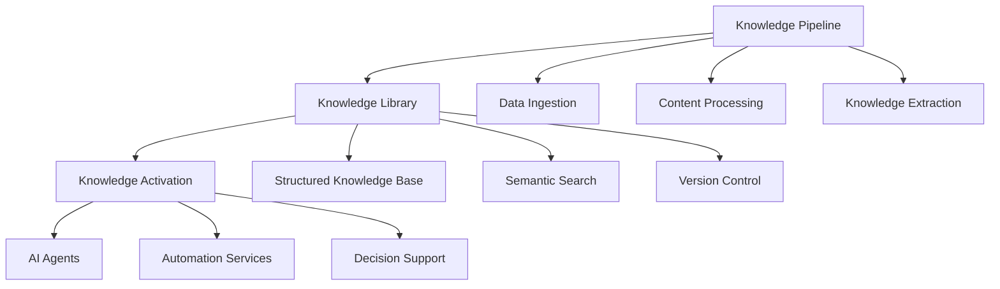

**85% of businesses struggle to extract value from their AI investments.** Despite massive spending on AI initiatives, most enterprises face a critical challenge: their valuable knowledge remains trapped in silos, making intelligent automation impossible at scale.

AIMatrix solves this fundamental problem by transforming how businesses create, organize, and activate their collective intelligence.

## The AIMatrix Solution Architecture

AIMatrix operates through three interconnected layers that transform your business into an intelligent, self-improving system:

### Layer 1: Knowledge Pipeline - Your Intelligence Factory

The **Knowledge Pipeline** is AIMatrix's foundational system that continuously ingests, processes, and structures your business information:

**Video Intelligence Service** - Automatically extracts insights from meetings, training videos, and presentations, converting hours of content into searchable, actionable knowledge.

**Content Processing Engine** - Transforms documents, emails, reports, and communications into structured knowledge graphs that preserve context and relationships.

**Real-time Data Integration** - Connects with your existing systems through our **BigLedger Data Hub**, creating unified data streams that feed intelligent decision-making.

**Business Impact**: Companies typically reduce knowledge discovery time by 90% and eliminate information silos that cause costly delays and duplicated efforts.

### Layer 2: Knowledge Library - Your Business Brain

Your **Knowledge Library** becomes the centralized intelligence hub where all organizational knowledge lives, breathes, and grows:

**Semantic Knowledge Organization** - Advanced language models automatically categorize and connect information, making complex business knowledge instantly discoverable.

**Digital Twin Creation** - Creates intelligent replicas of your business processes, enabling simulation and optimization before implementing changes.

**Adaptive Learning** - The system continuously learns from usage patterns, improving knowledge recommendations and automation suggestions over time.

**Cross-functional Intelligence** - Breaks down departmental silos by connecting related knowledge across teams, revealing hidden opportunities and preventing redundant work.

**ROI Example**: A manufacturing company reduced product development cycles by 40% when engineers could instantly access relevant knowledge from sales interactions, customer feedback, and previous projects.

### Layer 3: Knowledge Activation - Your Intelligent Workforce

**Knowledge Activation** deploys your structured intelligence through multiple channels:

**AI Agent Deployment** - Intelligent agents that understand your business context handle complex tasks from customer service to financial analysis, working 24/7 with consistent quality.

**Automated Course Generation** - Transform your expertise into comprehensive training programs, ensuring knowledge transfer and consistent execution across teams.

**Software Intelligence Integration** - Your development teams gain AI-powered assistance that understands your codebase, accelerating development and reducing technical debt.

**MCP (Model Control Protocol) Development** - Create custom AI tools that integrate seamlessly with your existing workflows, extending intelligence to every business process.

**Content Publishing Automation** - Generate reports, documentation, and communications that maintain your brand voice while ensuring accuracy and compliance.

## The Complete Product Ecosystem

AIMatrix delivers intelligence through four integrated products:

### AIMatrix CLI - Developer Command Center
Command-line interface that gives technical teams direct access to AI capabilities, enabling rapid prototyping and integration.

### AIMatrix Console - Business Control Hub  
Web-based interface where business users configure workflows, monitor AI agents, and access insights without technical complexity.

### AIMatrix Engine - Processing Powerhouse
The core AI processing system that handles multimodal large language models, tool integration, and real-time decision-making.

### AIMatrix Hub - Integration Gateway
Centralized connection point for all business systems, ensuring data flows securely and efficiently across your technology stack.

## Why Businesses Fail Without AIMatrix

**Knowledge Fragmentation Crisis**: The average enterprise has knowledge scattered across 147 different systems. Employees spend 2.5 hours daily searching for information they need to do their jobs effectively.

**AI Implementation Failures**: 70% of AI projects fail because businesses lack structured knowledge foundations. Without proper knowledge organization, AI systems provide inconsistent results and require constant manual intervention.

**Competitive Disadvantage**: Companies without intelligent knowledge systems fall behind competitors who can make faster, data-driven decisions and respond quickly to market changes.

**Talent Retention Challenges**: Knowledge walks out the door when employees leave. Organizations lose millions in intellectual capital because critical knowledge exists only in people's heads.

## The AIMatrix Competitive Advantage

**Speed of Intelligence**: Make decisions 5x faster with AI agents that instantly access your complete knowledge base and provide contextual recommendations.

**Scale Without Complexity**: Grow your business without proportional increases in headcount. AI agents handle routine tasks while humans focus on strategic initiatives.

**Continuous Learning**: Your system gets smarter every day, learning from interactions and outcomes to provide increasingly valuable insights.

**Risk Mitigation**: Reduce human error by 85% through consistent AI-powered processes that follow your established best practices.

## Measurable Business Outcomes

Organizations implementing AIMatrix report dramatic improvements:

**Operational Efficiency**
- 60-80% reduction in time spent searching for information
- 70% faster onboarding of new employees
- 45% improvement in project delivery timelines

**Revenue Growth**
- 35% increase in sales conversion rates through intelligent lead scoring
- 50% faster product development cycles
- 25% improvement in customer retention rates

**Cost Optimization**
- 40-60% reduction in operational costs through automation
- 80% decrease in manual data processing overhead
- 30% reduction in training and development expenses

**Competitive Performance**
- 3x faster response to market opportunities
- 90% improvement in regulatory compliance accuracy
- 65% reduction in security incident response times

## Real-World Implementation Example

**Case Study - Global Manufacturing Firm**:
- **Challenge**: 15,000 employees across 40 countries struggled to access engineering specifications, safety protocols, and best practices
- **AIMatrix Solution**: Implemented Knowledge Pipeline to process technical documentation, Knowledge Library to organize expertise, and AI agents for real-time support
- **Results**: 
  - 50% reduction in production delays
  - 30% improvement in safety compliance
  - $12M annual savings from reduced errors and faster problem resolution
  - 85% employee satisfaction improvement in accessing needed information

## Integration with Your Technology Stack

AIMatrix doesn't replace your existing systems - it makes them intelligent:

**CRM Enhancement**: Transform customer data into predictive insights and automated engagement strategies.

**ERP Optimization**: Add intelligent forecasting and automated decision-making to your existing enterprise resource planning.

**Communication Platforms**: Upgrade Slack, Teams, and email with AI agents that understand context and provide instant expertise.

**Business Intelligence**: Enhance existing BI tools with natural language querying and automated insight generation.

## Begin Your Intelligent Transformation

The gap between AI-powered businesses and traditional operations grows wider every day. Companies that delay intelligent knowledge systems risk being left behind by competitors who can think, learn, and adapt faster.

**Phase 1: Knowledge Foundation (30 days)**
Deploy Knowledge Pipeline to begin structuring your most critical business information.

**Phase 2: Intelligence Activation (60 days)**
Launch AI agents in your highest-impact areas while building your Knowledge Library.

**Phase 3: Enterprise Scale (90 days)**
Expand intelligent automation across all departments with full ecosystem integration.

**Phase 4: Competitive Dominance (Ongoing)**
Continuous optimization and expansion as your system learns and adapts to market changes.

Your business knowledge is your greatest competitive asset. AIMatrix transforms that knowledge into intelligent action, automated efficiency, and sustainable growth advantage.

**Ready to unlock your organization's intelligence?** Contact our team to schedule a customized demonstration of how AIMatrix can transform your specific business challenges into competitive advantages.