Four integrated products that create a complete AI ecosystem for businesses, developers, and end users.

## Product Portfolio

  

    <h2>🖥️ AIMatrix CLI</h2>
    
<strong>Free Developer Tools</strong>

    
Command-line application for setting up and managing AIMatrix environments

    <ul>
      <li>Local environment setup</li>
      <li>Desktop app launcher</li>
      <li>Engine installation & updates</li>
      <li>User account management</li>
      <li>Built with Kotlin + Clikt</li>
    </ul>
    <a href="/business/products/aimatrix-cli/" style="color: #00ff00;">View Data Sheet →</a>
  

  

    <h2>💬 AMX Console</h2>
    
<strong>Universal User Interface</strong>

    
Native apps for all platforms with conversational and graphical UI

    <ul>
      <li>iOS, Android, Windows, Mac, Linux</li>
      <li>Conversational + graphical UI</li>
      <li>Todo lists & conversations</li>
      <li>Multi-channel agent monitoring</li>
      <li>Compose Multiplatform</li>
    </ul>
    <a href="/business/products/amx-console/" style="color: #00ff00;">View Data Sheet →</a>
  

  

    <h2>⚙️ AMX Engine</h2>
    
<strong>AI & Simulation Core</strong>

    
The digital twin factory and agent orchestration engine

    <ul>
      <li>Digital twin simulations</li>
      <li>Agent design & workflows</li>
      <li>MCP & A2A servers</li>
      <li>Kalasim simulation engine</li>
      <li>Built with Ktor</li>
    </ul>
    <a href="/business/products/amx-engine/" style="color: #00ff00;">View Data Sheet →</a>
  

  

    <h2>🌐 AMX Hub</h2>
    
<strong>Collaboration Platform</strong>

    
GitHub-like platform for hosting workspaces and orchestrating engines

    <ul>
      <li>Workspace hosting</li>
      <li>Webhook integrations</li>
      <li>Engine orchestration</li>
      <li>License & subscriptions</li>
      <li>Spring Cloud + Angular</li>
    </ul>
    <a href="/business/products/amx-hub/" style="color: #00ff00;">View Data Sheet →</a>
  

## How Our Products Work Together

```mermaid
graph LR
    A[AIMatrix CLI] --> B[AMX Engine]
    B --> C[AMX Console]
    B --> D[AMX Hub]
    C --> D
    
    A -->|Installs & Manages| B
    B -->|Powers| C
    D -->|Orchestrates| B
    C -->|Connects to| B
    
    style A fill:#333,stroke:#00ff00
    style B fill:#333,stroke:#00ff00
    style C fill:#333,stroke:#00ff00
    style D fill:#333,stroke:#00ff00
```

### Complete Integration Flow

1. **Start with CLI**: Free download to set up your environment
2. **Deploy Engine**: Local or cloud deployment for AI processing
3. **Access via Console**: Native apps for all users on all devices
4. **Scale with Hub**: Enterprise orchestration and collaboration

### Deployment Scenarios

#### Small Business
- CLI on owner's computer → Local Engine → Console on phones
- **Cost**: Free to start, $99/month for professional features

#### Medium Business
- CLI for developers → Server Engine → Company-wide Console → Hub backup
- **Cost**: $500-2,000/month depending on scale

#### Enterprise
- CLI development → Cloud Engine cluster → Global Console deployment → Hub orchestration
- **Cost**: Custom pricing based on requirements

---

*AIMatrix - Four Products, One Vision: Complete Business Automation*