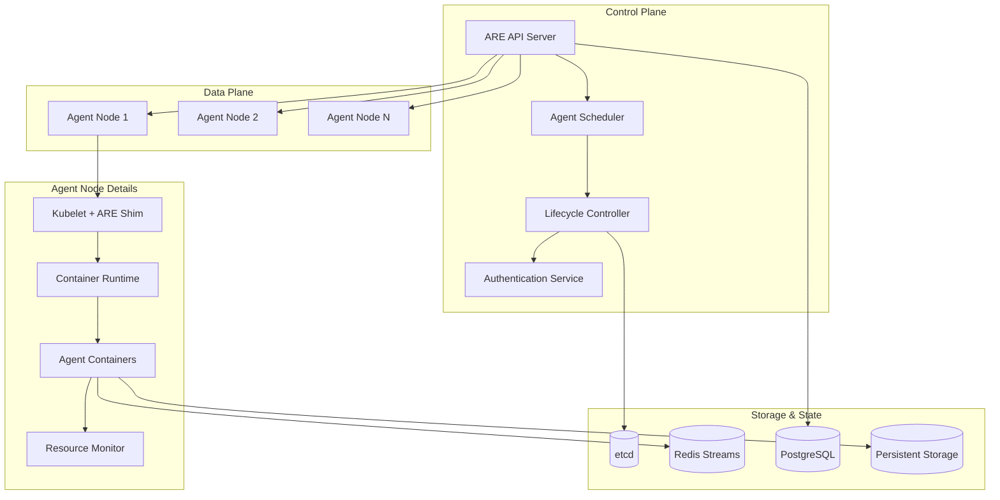

## Executive Summary

AMX Agent Runtime Environment (ARE) is a specialized execution platform designed as the "JVM for AI agents" within the AIMatrix ecosystem. ARE provides containerized isolation, comprehensive lifecycle management, resource monitoring, and secure execution environments for AI agents of all types. Built on Kubernetes with custom controllers, ARE enables scalable, secure, and efficient agent deployment across cloud, edge, and hybrid environments.

## Technical Specifications

| Specification | Details |
|---------------|---------|
| **Product Name** | AMX Agent Runtime Environment (ARE) |
| **Version** | 1.0 |
| **Runtime Architecture** | Container-based with Kubernetes orchestration |
| **Agent Types Supported** | Cognitive, Interface, Coordinator, Specialist |
| **Isolation Technology** | OCI-compliant containers with gVisor security |
| **Orchestration** | Custom Kubernetes controllers |
| **State Management** | CQRS/Event Sourcing with Redis Streams |
| **Communication** | gRPC, Message Queues, WebSocket |
| **Monitoring** | Prometheus metrics with custom agent telemetry |

### Performance Specifications
| Metric | Specification |
|--------|--------------|
| **Agent Startup Time** | < 500ms for standard agents |
| **Concurrent Agents** | 50,000+ per cluster |
| **Memory Overhead** | < 50MB per agent container |
| **CPU Efficiency** | < 5% runtime overhead |
| **Network Latency** | < 10ms inter-agent communication |
| **Scaling Speed** | 0-1000 agents in < 30 seconds |
| **High Availability** | 99.9% uptime SLA |

## System Requirements

### Minimum Requirements
| Component | Specification |
|-----------|---------------|
| **Operating System** | Linux (Ubuntu 20.04+), Container Runtime |
| **Kubernetes** | v1.24+ with CRI-O or containerd |
| **CPU** | 4 cores, 2.4 GHz |
| **RAM** | 8 GB |
| **Storage** | 100 GB NVMe SSD |
| **Network** | 1 Gbps |
| **Database** | PostgreSQL 13+ for metadata |

### Recommended Production
| Component | Specification |
|-----------|---------------|
| **Operating System** | Linux (Ubuntu 22.04 LTS) |
| **Kubernetes** | v1.28+ with HA control plane |
| **CPU** | 16+ cores, 3.2 GHz |
| **RAM** | 64 GB |
| **Storage** | 1 TB NVMe SSD with persistent volumes |
| **Network** | 10 Gbps with service mesh |
| **Database** | PostgreSQL 15+ cluster with read replicas |

## Core Architecture

### ARE System Overview



### Container Architecture

```dockerfile
# ARE Agent Base Container
FROM gcr.io/distroless/java17-debian11

# Security and isolation layers
USER 65532:65532
WORKDIR /agent

# Agent runtime components
COPY --chown=65532:65532 agent-runtime.jar /agent/
COPY --chown=65532:65532 config/ /agent/config/
COPY --chown=65532:65532 plugins/ /agent/plugins/

# Resource limits and capabilities
LABEL are.agent.type="cognitive"
LABEL are.agent.version="1.0"
LABEL are.security.profile="restricted"

# Health and readiness endpoints
HEALTHCHECK --interval=30s --timeout=10s --start-period=60s \
  CMD curl -f http://localhost:8080/health || exit 1

# Default command
ENTRYPOINT ["/agent/agent-runtime.jar"]
CMD ["--config=/agent/config/agent.yaml"]
```

### Agent Lifecycle Management

```kotlin
// ARE Agent Lifecycle Controller
class AgentLifecycleController(
    private val kubernetesClient: KubernetesClient,
    private val stateManager: AgentStateManager,
    private val resourceAllocator: ResourceAllocator
) {
    
    suspend fun deployAgent(agentSpec: AgentDeploymentSpec): AgentInstance {
        // Validate agent specification
        val validation = validateAgentSpec(agentSpec)
        if (!validation.isValid) {
            throw AgentValidationException(validation.errors)
        }
        
        // Allocate resources
        val resources = resourceAllocator.allocate(
            cpu = agentSpec.resources.cpu,
            memory = agentSpec.resources.memory,
            storage = agentSpec.resources.storage,
            networking = agentSpec.resources.networking
        )
        
        // Create container specification
        val containerSpec = ContainerSpec(
            image = selectAgentImage(agentSpec.agentType),
            resources = resources,
            securityContext = createSecurityContext(agentSpec),
            environment = buildEnvironment(agentSpec),
            volumes = createVolumes(agentSpec)
        )
        
        // Deploy to Kubernetes
        val pod = kubernetesClient.createPod(
            namespace = agentSpec.namespace,
            podSpec = PodSpec(
                containers = listOf(containerSpec),
                serviceAccount = agentSpec.serviceAccount,
                nodeName = selectOptimalNode(agentSpec.affinityRules),
                priorityClass = agentSpec.priorityClass
            )
        )
        
        // Initialize agent state
        val agentInstance = AgentInstance(
            id = generateAgentId(),
            podName = pod.name,
            spec = agentSpec,
            status = AgentStatus.INITIALIZING,
            createdAt = Instant.now()
        )
        
        stateManager.initializeAgent(agentInstance)
        
        // Start lifecycle monitoring
        startLifecycleMonitoring(agentInstance)
        
        return agentInstance
    }
    
    suspend fun scaleAgent(
        agentId: String, 
        targetInstances: Int
    ): ScalingResult {
        val currentAgent = stateManager.getAgent(agentId)
        val currentInstances = getCurrentInstanceCount(agentId)
        
        when {
            targetInstances > currentInstances -> {
                // Scale up
                val additionalInstances = targetInstances - currentInstances
                val scalingPlan = createScalingPlan(currentAgent, additionalInstances)
                return executeScaleUp(scalingPlan)
            }
            
            targetInstances < currentInstances -> {
                // Scale down
                val instancesToRemove = currentInstances - targetInstances
                return executeScaleDown(agentId, instancesToRemove)
            }
            
            else -> {
                return ScalingResult.NoActionRequired
            }
        }
    }
    
    suspend fun updateAgent(
        agentId: String,
        updateSpec: AgentUpdateSpec
    ): UpdateResult {
        val currentAgent = stateManager.getAgent(agentId)
        
        // Create rolling update plan
        val updatePlan = RollingUpdatePlan(
            agentId = agentId,
            currentSpec = currentAgent.spec,
            targetSpec = updateSpec,
            strategy = RollingUpdateStrategy(
                maxUnavailable = updateSpec.maxUnavailable ?: "25%",
                maxSurge = updateSpec.maxSurge ?: "25%"
            )
        )
        
        // Execute rolling update
        return executeRollingUpdate(updatePlan)
    }
    
    suspend fun terminateAgent(
        agentId: String,
        gracefulShutdown: Boolean = true
    ): TerminationResult {
        val agent = stateManager.getAgent(agentId)
        
        if (gracefulShutdown) {
            // Send shutdown signal to agent
            sendShutdownSignal(agent, timeoutSeconds = 30)
            
            // Wait for graceful shutdown
            val shutdownResult = waitForGracefulShutdown(agent)
            if (shutdownResult.successful) {
                cleanupResources(agent)
                stateManager.markAgentTerminated(agentId)
                return TerminationResult.GracefulShutdown
            }
        }
        
        // Force termination if graceful shutdown failed
        forceTerminate(agent)
        cleanupResources(agent)
        stateManager.markAgentTerminated(agentId)
        return TerminationResult.ForceTerminated
    }
}
```

## Resource Isolation and Security

### Security Sandboxing

```kotlin
// Security Context Builder
class SecurityContextBuilder {
    
    fun buildSecurityContext(agentSpec: AgentDeploymentSpec): SecurityContext {
        return SecurityContext(
            runAsUser = generateUniqueUID(),
            runAsGroup = generateUniqueGID(),
            runAsNonRoot = true,
            readOnlyRootFilesystem = true,
            allowPrivilegeEscalation = false,
            capabilities = buildCapabilities(agentSpec.permissions),
            seccompProfile = SeccompProfile(
                type = "RuntimeDefault"
            ),
            seLinuxOptions = SELinuxOptions(
                level = "s0:c${generateCompartmentIds()}"
            )
        )
    }
    
    private fun buildCapabilities(permissions: AgentPermissions): Capabilities {
        val allowedCapabilities = mutableSetOf<String>()
        val requiredCapabilities = mutableSetOf<String>()
        
        // Network permissions
        if (permissions.allowNetworkAccess) {
            allowedCapabilities.add("NET_BIND_SERVICE")
        }
        
        // File system permissions  
        if (permissions.allowFileSystemAccess) {
            allowedCapabilities.add("DAC_OVERRIDE")
        }
        
        // Process permissions
        if (permissions.allowProcessManagement) {
            allowedCapabilities.add("SYS_PTRACE")
        }
        
        return Capabilities(
            add = requiredCapabilities.toList(),
            drop = listOf("ALL") // Drop all capabilities by default
        )
    }
}

// Resource Limits Enforcement
class ResourceLimitsEnforcer {
    
    fun enforceResourceLimits(
        agentId: String,
        limits: ResourceLimits
    ): ResourceEnforcement {
        
        // CPU limits using cgroups v2
        val cpuLimits = CpuLimits(
            cpus = limits.cpu.cores,
            cpuShares = calculateCpuShares(limits.cpu.priority),
            cpuQuota = calculateCpuQuota(limits.cpu.cores)
        )
        
        // Memory limits with OOM protection
        val memoryLimits = MemoryLimits(
            limit = limits.memory.max,
            request = limits.memory.min,
            swapLimit = 0, // Disable swap
            oomKillDisabled = false
        )
        
        // Network bandwidth shaping
        val networkLimits = NetworkLimits(
            ingressBandwidth = limits.network.ingressMbps,
            egressBandwidth = limits.network.egressMbps,
            connectionLimit = limits.network.maxConnections
        )
        
        // Storage I/O throttling
        val storageIoLimits = StorageIoLimits(
            readBytesPerSecond = limits.storage.readMbps * 1024 * 1024,
            writeBytesPerSecond = limits.storage.writeMbps * 1024 * 1024,
            readIopsLimit = limits.storage.readIops,
            writeIopsLimit = limits.storage.writeIops
        )
        
        return ResourceEnforcement(
            agentId = agentId,
            cpuLimits = cpuLimits,
            memoryLimits = memoryLimits,
            networkLimits = networkLimits,
            storageIoLimits = storageIoLimits,
            enforcedAt = Instant.now()
        )
    }
}
```

### Network Isolation

```yaml
# Network Policy for Agent Isolation
apiVersion: networking.k8s.io/v1
kind: NetworkPolicy
metadata:
  name: agent-network-isolation
  namespace: agents
spec:
  podSelector:
    matchLabels:
      app: aimatrix-agent
  policyTypes:
  - Ingress
  - Egress
  ingress:
  - from:
    - namespaceSelector:
        matchLabels:
          name: agents
    - namespaceSelector:
        matchLabels:
          name: are-system
    ports:
    - protocol: TCP
      port: 8080  # Agent API port
    - protocol: TCP
      port: 9090  # Metrics port
  egress:
  - to:
    - namespaceSelector:
        matchLabels:
          name: are-system
    ports:
    - protocol: TCP
      port: 443   # HTTPS
    - protocol: TCP
      port: 6379  # Redis
    - protocol: TCP
      port: 5432  # PostgreSQL
  - to:
    - namespaceSelector:
        matchLabels:
          name: agents
    ports:
    - protocol: TCP
      port: 8080  # Inter-agent communication
```

## State Management with CQRS

### Event Sourcing Implementation

```kotlin
// Agent State Event Store
class AgentEventStore(
    private val redisStreams: RedisStreams
) {
    
    suspend fun appendEvent(agentId: String, event: AgentEvent): EventId {
        val streamKey = "agent:$agentId:events"
        val eventData = mapOf(
            "type" to event.type,
            "data" to event.toJson(),
            "timestamp" to event.timestamp.toEpochMilli(),
            "version" to event.version,
            "causationId" to event.causationId,
            "correlationId" to event.correlationId
        )
        
        return redisStreams.xAdd(streamKey, eventData)
    }
    
    suspend fun getEventStream(
        agentId: String,
        fromEventId: EventId? = null
    ): List<AgentEvent> {
        val streamKey = "agent:$agentId:events"
        val startId = fromEventId?.value ?: "0"
        
        return redisStreams.xRead(streamKey, startId)
            .map { entry ->
                parseAgentEvent(entry.fields)
            }
    }
    
    suspend fun projectCurrentState(agentId: String): AgentState {
        val events = getEventStream(agentId)
        
        return events.fold(AgentState.initial()) { state, event ->
            state.apply(event)
        }
    }
}

// Agent State Projector
class AgentStateProjector {
    
    fun project(events: List<AgentEvent>): AgentState {
        return events.fold(AgentState.initial()) { state, event ->
            when (event) {
                is AgentDeployedEvent -> state.copy(
                    status = AgentStatus.DEPLOYED,
                    deployedAt = event.timestamp,
                    podName = event.podName,
                    nodeId = event.nodeId
                )
                
                is AgentStartedEvent -> state.copy(
                    status = AgentStatus.RUNNING,
                    startedAt = event.timestamp,
                    processId = event.processId
                )
                
                is AgentScaledEvent -> state.copy(
                    replicas = event.newReplicas,
                    scaledAt = event.timestamp
                )
                
                is AgentUpdatedEvent -> state.copy(
                    version = event.newVersion,
                    updatedAt = event.timestamp,
                    status = if (event.successful) AgentStatus.RUNNING 
                            else AgentStatus.UPDATE_FAILED
                )
                
                is AgentTerminatedEvent -> state.copy(
                    status = AgentStatus.TERMINATED,
                    terminatedAt = event.timestamp,
                    exitCode = event.exitCode
                )
                
                is AgentErrorEvent -> state.copy(
                    lastError = event.error,
                    errorCount = state.errorCount + 1,
                    lastErrorAt = event.timestamp
                )
                
                else -> state
            }
        }
    }
}

// Command Handler
class AgentCommandHandler(
    private val eventStore: AgentEventStore,
    private val lifecycleController: AgentLifecycleController
) {
    
    suspend fun handle(command: AgentCommand): CommandResult {
        return when (command) {
            is DeployAgentCommand -> {
                val agentInstance = lifecycleController.deployAgent(command.spec)
                val event = AgentDeployedEvent(
                    agentId = agentInstance.id,
                    spec = command.spec,
                    podName = agentInstance.podName,
                    nodeId = agentInstance.nodeId,
                    timestamp = Instant.now()
                )
                eventStore.appendEvent(command.agentId, event)
                CommandResult.Success(agentInstance.id)
            }
            
            is ScaleAgentCommand -> {
                val result = lifecycleController.scaleAgent(
                    command.agentId,
                    command.targetReplicas
                )
                val event = AgentScaledEvent(
                    agentId = command.agentId,
                    oldReplicas = result.previousReplicas,
                    newReplicas = result.currentReplicas,
                    timestamp = Instant.now()
                )
                eventStore.appendEvent(command.agentId, event)
                CommandResult.Success(result)
            }
            
            is UpdateAgentCommand -> {
                val result = lifecycleController.updateAgent(
                    command.agentId,
                    command.updateSpec
                )
                val event = AgentUpdatedEvent(
                    agentId = command.agentId,
                    oldVersion = command.updateSpec.currentVersion,
                    newVersion = command.updateSpec.targetVersion,
                    successful = result.successful,
                    timestamp = Instant.now()
                )
                eventStore.appendEvent(command.agentId, event)
                CommandResult.Success(result)
            }
            
            is TerminateAgentCommand -> {
                val result = lifecycleController.terminateAgent(
                    command.agentId,
                    command.graceful
                )
                val event = AgentTerminatedEvent(
                    agentId = command.agentId,
                    graceful = result == TerminationResult.GracefulShutdown,
                    exitCode = result.exitCode,
                    timestamp = Instant.now()
                )
                eventStore.appendEvent(command.agentId, event)
                CommandResult.Success(result)
            }
        }
    }
}
```

## Communication Protocols

### Inter-Agent Communication

```kotlin
// Agent Communication Service
class AgentCommunicationService(
    private val grpcServerFactory: GrpcServerFactory,
    private val messageQueue: MessageQueue,
    private val serviceDiscovery: ServiceDiscovery
) {
    
    suspend fun setupCommunication(agentInstance: AgentInstance) {
        // Setup gRPC server for direct communication
        val grpcServer = grpcServerFactory.create(
            port = agentInstance.communicationPort,
            services = listOf(
                AgentControlService(agentInstance.id),
                AgentDataService(agentInstance.id),
                AgentCollaborationService(agentInstance.id)
            )
        )
        
        // Register with service discovery
        serviceDiscovery.register(
            serviceName = "agent-${agentInstance.id}",
            address = agentInstance.ipAddress,
            port = agentInstance.communicationPort,
            metadata = mapOf(
                "agent-type" to agentInstance.spec.agentType,
                "agent-version" to agentInstance.spec.version,
                "capabilities" to agentInstance.spec.capabilities.joinToString(",")
            )
        )
        
        // Setup message queue subscriptions
        setupMessageQueueSubscriptions(agentInstance)
        
        grpcServer.start()
    }
    
    private suspend fun setupMessageQueueSubscriptions(
        agentInstance: AgentInstance
    ) {
        val topics = listOf(
            "agent.${agentInstance.id}.commands",
            "agent.${agentInstance.id}.events",
            "agent.global.broadcasts",
            "agent.type.${agentInstance.spec.agentType}"
        )
        
        topics.forEach { topic ->
            messageQueue.subscribe(
                topic = topic,
                consumerGroup = "agent-${agentInstance.id}",
                handler = createMessageHandler(agentInstance, topic)
            )
        }
    }
    
    suspend fun sendMessageToAgent(
        fromAgentId: String,
        toAgentId: String,
        message: AgentMessage
    ): MessageResult {
        // Try direct gRPC communication first
        val targetAgent = serviceDiscovery.find("agent-$toAgentId")
        if (targetAgent != null) {
            try {
                val client = createGrpcClient(targetAgent.address, targetAgent.port)
                return client.sendMessage(message)
            } catch (e: Exception) {
                // Fall back to message queue
            }
        }
        
        // Fall back to asynchronous message queue
        return messageQueue.publish(
            topic = "agent.$toAgentId.messages",
            message = message.toByteArray(),
            headers = mapOf(
                "sender" to fromAgentId,
                "message-type" to message.type,
                "correlation-id" to message.correlationId
            )
        )
    }
}

// Agent Message Protocol
interface AgentMessage {
    val id: String
    val type: String
    val correlationId: String
    val payload: ByteArray
    val timestamp: Instant
    
    fun toByteArray(): ByteArray
    fun toJson(): String
}

data class TaskAssignmentMessage(
    override val id: String = UUID.randomUUID().toString(),
    override val type: String = "TASK_ASSIGNMENT",
    override val correlationId: String,
    override val payload: ByteArray,
    override val timestamp: Instant = Instant.now(),
    val taskId: String,
    val taskType: String,
    val priority: Int,
    val deadline: Instant?,
    val requirements: Map<String, Any>
) : AgentMessage

data class CollaborationRequest(
    override val id: String = UUID.randomUUID().toString(),
    override val type: String = "COLLABORATION_REQUEST",
    override val correlationId: String,
    override val payload: ByteArray,
    override val timestamp: Instant = Instant.now(),
    val requesterAgentId: String,
    val collaborationType: String,
    val context: Map<String, Any>,
    val expectedDuration: Duration?
) : AgentMessage
```

## Monitoring and Observability

### Custom Metrics Collection

```kotlin
// Agent Runtime Metrics Collector
class AgentMetricsCollector(
    private val prometheusRegistry: PrometheusMeterRegistry
) {
    
    private val agentStartupTimeGauge = Gauge.builder("are.agent.startup.time")
        .description("Time taken for agent to start (seconds)")
        .tags("agent_type", "agent_id")
        .register(prometheusRegistry)
    
    private val agentMemoryUsageGauge = Gauge.builder("are.agent.memory.usage")
        .description("Agent memory usage in bytes")
        .tags("agent_type", "agent_id")
        .register(prometheusRegistry)
    
    private val agentCpuUsageGauge = Gauge.builder("are.agent.cpu.usage")
        .description("Agent CPU usage percentage")
        .tags("agent_type", "agent_id")
        .register(prometheusRegistry)
    
    private val interAgentMessageCounter = Counter.builder("are.agent.messages.sent")
        .description("Number of inter-agent messages sent")
        .tags("sender_type", "receiver_type", "message_type")
        .register(prometheusRegistry)
    
    private val agentErrorCounter = Counter.builder("are.agent.errors.total")
        .description("Total number of agent errors")
        .tags("agent_type", "error_type")
        .register(prometheusRegistry)
    
    fun recordAgentStartup(
        agentId: String,
        agentType: String,
        startupTime: Duration
    ) {
        agentStartupTimeGauge
            .tags("agent_type", agentType, "agent_id", agentId)
            .set(startupTime.toMillis() / 1000.0)
    }
    
    fun recordResourceUsage(
        agentId: String,
        agentType: String,
        memoryBytes: Long,
        cpuPercent: Double
    ) {
        agentMemoryUsageGauge
            .tags("agent_type", agentType, "agent_id", agentId)
            .set(memoryBytes.toDouble())
            
        agentCpuUsageGauge
            .tags("agent_type", agentType, "agent_id", agentId)
            .set(cpuPercent)
    }
    
    fun recordMessageSent(
        senderType: String,
        receiverType: String,
        messageType: String
    ) {
        interAgentMessageCounter
            .tags("sender_type", senderType, "receiver_type", receiverType, "message_type", messageType)
            .increment()
    }
    
    fun recordError(
        agentType: String,
        errorType: String
    ) {
        agentErrorCounter
            .tags("agent_type", agentType, "error_type", errorType)
            .increment()
    }
}

// Health Check Implementation
class AgentHealthChecker {
    
    suspend fun checkAgentHealth(agentInstance: AgentInstance): HealthStatus {
        val checks = listOf(
            checkContainerHealth(agentInstance),
            checkResourceUsage(agentInstance),
            checkCommunicationHealth(agentInstance),
            checkApplicationHealth(agentInstance)
        )
        
        val failedChecks = checks.filter { !it.healthy }
        
        return when {
            failedChecks.isEmpty() -> HealthStatus.Healthy
            failedChecks.any { it.critical } -> HealthStatus.Unhealthy(failedChecks)
            else -> HealthStatus.Degraded(failedChecks)
        }
    }
    
    private suspend fun checkContainerHealth(
        agentInstance: AgentInstance
    ): HealthCheck {
        val pod = kubernetesClient.getPod(
            agentInstance.namespace,
            agentInstance.podName
        )
        
        return HealthCheck(
            name = "container_health",
            healthy = pod.status.phase == "Running" && 
                     pod.status.containerStatuses.all { it.ready },
            critical = pod.status.phase == "Failed",
            message = if (pod.status.phase != "Running") 
                     "Pod phase: ${pod.status.phase}" else "Container ready"
        )
    }
    
    private suspend fun checkApplicationHealth(
        agentInstance: AgentInstance
    ): HealthCheck {
        return try {
            val response = httpClient.get("http://${agentInstance.ipAddress}:8080/health")
            HealthCheck(
                name = "application_health",
                healthy = response.status == HttpStatusCode.OK,
                critical = response.status.value >= 500,
                message = "HTTP ${response.status.value}"
            )
        } catch (e: Exception) {
            HealthCheck(
                name = "application_health",
                healthy = false,
                critical = true,
                message = "Health check failed: ${e.message}"
            )
        }
    }
}
```

## Deployment and Operations

### ARE Installation

```bash
#!/bin/bash
# ARE Installation Script

set -e

echo "Installing AMX Agent Runtime Environment (ARE)..."

# Validate prerequisites
echo "Checking prerequisites..."
kubectl version --client=true >/dev/null 2>&1 || {
    echo "Error: kubectl not found. Please install Kubernetes CLI."
    exit 1
}

helm version >/dev/null 2>&1 || {
    echo "Error: helm not found. Please install Helm."
    exit 1
}

# Create namespace
echo "Creating ARE namespace..."
kubectl create namespace are-system --dry-run=client -o yaml | kubectl apply -f -

# Add ARE Helm repository
echo "Adding ARE Helm repository..."
helm repo add aimatrix https://charts.aimatrix.com/
helm repo update

# Install ARE with custom values
echo "Installing ARE components..."
cat > are-values.yaml <<EOF
replicaCount: 3

api:
  port: 8080
  resources:
    limits:
      cpu: 2000m
      memory: 4Gi
    requests:
      cpu: 1000m
      memory: 2Gi

scheduler:
  replicas: 2
  resources:
    limits:
      cpu: 1000m
      memory: 2Gi
    requests:
      cpu: 500m
      memory: 1Gi

controller:
  replicas: 2
  resources:
    limits:
      cpu: 1000m
      memory: 2Gi
    requests:
      cpu: 500m
      memory: 1Gi

redis:
  enabled: true
  cluster:
    enabled: true
    slaveCount: 2

postgresql:
  enabled: true
  primary:
    persistence:
      enabled: true
      size: 20Gi
  readReplicas:
    replicaCount: 1

monitoring:
  prometheus:
    enabled: true
  grafana:
    enabled: true
    dashboards:
      - agent-overview
      - resource-usage
      - communication-metrics

networkPolicy:
  enabled: true

securityContext:
  runAsNonRoot: true
  runAsUser: 65532
  fsGroup: 65532
EOF

helm upgrade --install are aimatrix/are \
    --namespace are-system \
    --values are-values.yaml \
    --wait --timeout=10m

echo "ARE installation completed successfully!"

# Verify installation
echo "Verifying installation..."
kubectl wait --namespace are-system \
    --for=condition=ready pod \
    --selector=app.kubernetes.io/name=are \
    --timeout=300s

echo "ARE is ready for agent deployments!"
```

### Agent Deployment Example

```yaml
# Example Agent Deployment
apiVersion: are.aimatrix.com/v1
kind: AgentDeployment
metadata:
  name: customer-service-agent
  namespace: agents
spec:
  agentType: cognitive
  replicas: 5
  image: aimatrix/customer-service-agent:v1.2.0
  
  resources:
    requests:
      cpu: 500m
      memory: 1Gi
      storage: 5Gi
    limits:
      cpu: 1000m
      memory: 2Gi
      storage: 10Gi
  
  securityProfile: restricted
  
  permissions:
    allowNetworkAccess: true
    allowedDomains:
      - "*.aimatrix.com"
      - "api.openai.com"
    allowFileSystemAccess: false
    maxFileSystemSize: 1Gi
  
  communication:
    protocols: ["grpc", "http", "websocket"]
    ports:
      - name: api
        port: 8080
        protocol: TCP
      - name: grpc
        port: 9090
        protocol: TCP
  
  environment:
    - name: AGENT_TYPE
      value: "customer_service"
    - name: LOG_LEVEL
      value: "INFO"
    - name: REDIS_URL
      valueFrom:
        secretKeyRef:
          name: redis-credentials
          key: url
  
  affinity:
    nodeAffinity:
      preferredDuringSchedulingIgnoredDuringExecution:
      - weight: 100
        preference:
          matchExpressions:
          - key: agent-workload
            operator: In
            values: ["cognitive"]
  
  updateStrategy:
    type: RollingUpdate
    rollingUpdate:
      maxUnavailable: 25%
      maxSurge: 25%
  
  healthCheck:
    httpGet:
      path: /health
      port: 8080
    initialDelaySeconds: 30
    periodSeconds: 10
    timeoutSeconds: 5
    failureThreshold: 3
```

## Agent Type Runtime Assignments

### Which Agents Run in ARE

**Cognitive Agents** (Primary ARE Users):
- **Planner Agents**: Strategic planning and decision-making
- **Executor Agents**: Operational task execution  
- **Coworker Agents**: Human-AI collaboration
- **Specialist Agents**: Domain-specific expertise

**Interface Agents** (Mixed Deployment):
- **Remote Desktop Agents**: Run in ARE with special desktop access privileges
- **API Gateway Agents**: Run in ARE with network access permissions
- **IoT Edge Agents**: Deploy in ARE on edge nodes

**Coordination Agents** (System-Level):
- **Swarm Controllers**: Run in ARE control plane
- **Consensus Managers**: Distributed across ARE cluster
- **Emergent Behavior Monitors**: Dedicated ARE monitoring nodes

### Runtime Selection Criteria

```kotlin
fun selectOptimalRuntime(agentSpec: AgentDeploymentSpec): RuntimeSelection {
    return when {
        // Cognitive agents always use ARE
        agentSpec.agentType in listOf("planner", "executor", "coworker", "specialist") -> 
            RuntimeSelection.ARE
        
        // Interface agents based on requirements
        agentSpec.agentType == "remote_desktop" && agentSpec.requiresDesktopAccess ->
            RuntimeSelection.ARE_WITH_DESKTOP
        
        agentSpec.agentType == "iot_edge" && agentSpec.deploymentLocation == "edge" ->
            RuntimeSelection.ARE_EDGE
        
        // Simulation-heavy agents prefer TRE
        agentSpec.requiresSimulation || agentSpec.processesTimeSeries ->
            RuntimeSelection.TRE
        
        // Default to ARE for most agents
        else -> RuntimeSelection.ARE
    }
}
```

---

**Download AMX ARE**: [are.aimatrix.com](https://are.aimatrix.com)  
**Documentation**: [docs.aimatrix.com/are](https://docs.aimatrix.com/are)  
**Support**: [support@aimatrix.com](mailto:support@aimatrix.com)