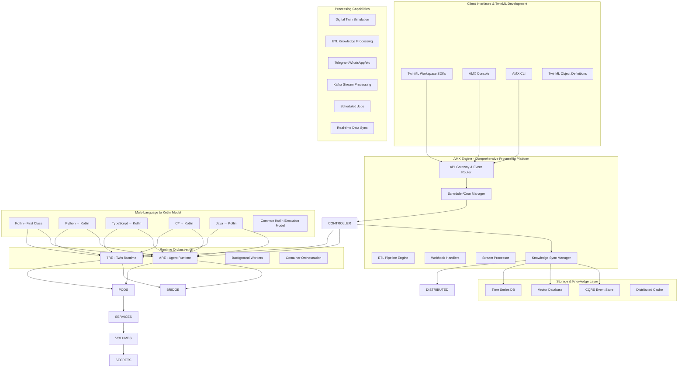
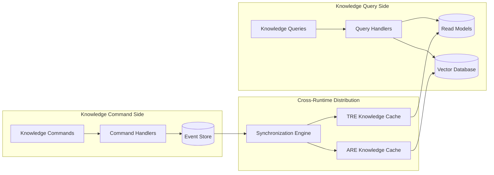

## Executive Summary

AMX Engine is the comprehensive processing platform that serves as the "operating system" for AI and Digital Twin workloads within the AIMatrix ecosystem. Far beyond just simulation, AMX Engine orchestrates the full spectrum of intelligent processing capabilities including ETL pipelines for knowledge processing, webhook handlers (Telegram, WhatsApp, etc.), stream processing (Kafka, system signals), scheduler/cron job management, process orchestration, background workers, API gateways, event bus management, and real-time data synchronization.

Built around the innovative **TwinML (Twin Markup Language)** - an object-oriented design language similar to traditional OOP but for digital systems - AMX Engine enables developers to define Components, Systems, and Objects with inheritance, composition, interfaces, and event handling. With **Kotlin as the first-class language** providing native performance and direct execution, while Python, TypeScript, C#, and Java transpile to the common Kotlin model, AMX Engine delivers a Unity-like development experience for the AI era.

## Technical Specifications

| Specification | Details |
|---------------|---------|
| **Product Name** | AMX Engine |
| **Version** | 4.0 (Next Generation Architecture) |
| **Core Framework** | Comprehensive AI/Digital Twin Processing Platform |
| **Platform Capabilities** | Digital twin simulation, ETL pipelines, webhook handlers, stream processing, scheduling, orchestration |
| **Modeling Language** | TwinML (Twin Markup Language) - Object-oriented design for digital systems |
| **First-Class Language** | Kotlin (native performance, direct execution) |
| **SDK Languages** | Python, TypeScript, C#, Java (transpile to Kotlin model) |
| **Runtime Environments** | Integrated ARE (Agent Runtime) + TRE (Twin Runtime) |
| **Container Technology** | OCI-compliant containers with Kubernetes-style orchestration |
| **Processing Types** | Stream processing, ETL, webhooks, background jobs, API management, event routing |
| **Knowledge Management** | CQRS-based distributed knowledge system with real-time sync |
| **Communication** | gRPC, Message Queues, WebSocket, REST APIs, Event Bus |
| **Database** | Multi-model: PostgreSQL, TimescaleDB, Redis, Vector DB |
| **Workspace Integration** | Git-based workspace with hot reload and dynamic loading |

### Performance Specifications
| Metric | ARE (Agent Runtime) | TRE (Twin Runtime) | Combined Platform |
|--------|-------------------|-------------------|-------------------|
| **Concurrent Workloads** | 50,000+ agents | 1,000+ twins | Auto-scheduled across runtimes |
| **Processing Speed** | 10ms inter-agent latency | 1M+ events/sec simulation | Dynamic load balancing |
| **Container Startup** | <500ms agent containers | <2s twin containers | Pod-style orchestration |
| **Memory Efficiency** | <50MB per agent | <1GB per 10K entities | Resource limits & quotas |
| **API Throughput** | 100,000+ ops/sec | 50,000+ ops/sec | Service mesh routing |
| **Multi-Language SDK** | Native performance | Polyglot interop | Cross-language messaging |
| **Scaling Speed** | 0-1000 agents in 30s | Distributed twin clusters | Horizontal pod autoscaling |
| **High Availability** | 99.95% SLA | 99.95% SLA | 99.99% platform SLA |

## System Requirements

### Development Workspace Requirements
| Component | Specification |
|-----------|---------------|
| **Operating System** | Linux (Ubuntu 22.04+), macOS 13+, Windows 11+ |
| **Container Runtime** | Docker Desktop 4.0+ or Podman 4.0+ |
| **CPU** | 4 cores, 2.8 GHz (ARM64 or x86_64) |
| **RAM** | 8 GB |
| **Storage** | 50 GB SSD (for workspace + containers) |
| **Network** | 1 Gbps |
| **SDK Prerequisites** | Node.js 18+, Python 3.11+, JVM 21+, .NET 8.0+, Java 17+ (LTS) |

### Production Cluster Requirements
| Component | Specification |
|-----------|---------------|
| **Orchestration Platform** | Kubernetes 1.28+ or Docker Swarm |
| **Operating System** | Linux (Ubuntu 22.04 LTS) |
| **Control Plane** | 3+ nodes, 4 cores, 8 GB RAM each |
| **Worker Nodes** | 5+ nodes, 16+ cores, 64 GB RAM each |
| **Storage** | Distributed: Ceph, Longhorn, or cloud storage |
| **Network** | 10 Gbps with service mesh support |
| **Load Balancer** | Istio, NGINX Ingress, or cloud LB |
| **Monitoring** | Prometheus + Grafana + Jaeger |

### High-Availability Multi-Cloud
| Component | Specification |
|-----------|---------------|
| **Multi-Region Setup** | 3+ availability zones per region |
| **Edge Nodes** | Lightweight nodes for edge deployment |
| **Cross-Runtime LB** | Intelligent ARE/TRE workload routing |
| **Data Replication** | Cross-region knowledge synchronization |
| **Disaster Recovery** | Automated backup and failover |
| **Security** | Zero-trust network with mTLS |

## Next-Generation Architecture

### Comprehensive AI/Digital Twin Processing Platform

AMX Engine 4.0 represents a fundamental architectural evolution, serving as the **operating system for intelligent workloads**. Beyond traditional simulation, it provides a comprehensive processing platform that combines container orchestration, ETL pipeline management, webhook handling, stream processing, job scheduling, and real-time data synchronization into a unified system. Built around **TwinML (Twin Markup Language)** with **Kotlin as the first-class language**, AMX Engine delivers native performance while supporting multi-language development through a common execution model.



## TwinML (Twin Markup Language) & Platform Capabilities

### TwinML: Object-Oriented Design for Digital Systems

TwinML represents a revolutionary approach to modeling digital systems using object-oriented principles similar to traditional programming languages. Like Pulumi's infrastructure-as-code model, TwinML provides a unified way to define Components, Systems, Objects, and their relationships across multiple programming languages.

#### Core TwinML Concepts

**Components**: Reusable building blocks that encapsulate functionality
**Systems**: Collections of components working together to achieve specific goals  
**Objects**: Data entities with properties, methods, and lifecycle management
**Interfaces**: Contracts defining how different parts of the system interact
**Inheritance**: Component hierarchies enabling code reuse and specialization
**Composition**: Combining multiple components to create complex behaviors

#### TwinML Example - Supply Chain Digital Twin

```kotlin
// Kotlin (First-Class Implementation)
@TwinML
class SupplyChainTwin : DigitalTwin() {
    @Component
    val warehouse = WarehouseComponent {
        capacity = 10000
        location = "Chicago, IL"
        automationLevel = AutomationLevel.FULLY_AUTOMATED
    }
    
    @System
    val logistics = LogisticsSystem {
        routes = listOf(
            Route("Chicago" to "New York", TransportMode.TRUCK),
            Route("New York" to "Boston", TransportMode.RAIL)
        )
        optimizer = RouteOptimizer.GENETIC_ALGORITHM
    }
    
    @Object
    val inventory = InventoryObject {
        items = mutableMapOf<String, Int>()
        reorderThreshold = 100
        onReorder { item, quantity -> 
            logistics.scheduleDelivery(item, quantity)
        }
    }
    
    @Interface
    interface SupplyChainEvents {
        suspend fun onInventoryLow(item: String, currentLevel: Int)
        suspend fun onDeliveryScheduled(delivery: Delivery)
        suspend fun onWarehouseCapacityChanged(newCapacity: Int)
    }
}
```

### Comprehensive Processing Platform Architecture

AMX Engine serves as the **operating system for intelligent workloads**, providing far more than just simulation capabilities:

#### 1. **ETL Pipeline Engine**
- **Knowledge Processing**: Transform and process data from multiple sources
- **Data Integration**: Connect to databases, APIs, files, and streaming sources
- **Transformation Logic**: Custom business rules and data mapping
- **Quality Control**: Data validation, cleansing, and error handling
- **Scheduling**: Automated pipeline execution with dependency management

#### 2. **Webhook Handler System**
- **Multi-Platform Support**: Telegram, WhatsApp, Discord, Slack, SMS
- **Event Processing**: Real-time message handling and response generation  
- **Authentication**: Secure webhook verification and API key management
- **Rate Limiting**: Protect against spam and abuse
- **Message Routing**: Intelligent routing to appropriate processing components

#### 3. **Stream Processing Engine**
- **Kafka Integration**: High-throughput message stream processing
- **Signal Processing**: Real-time system signals and sensor data
- **Event Sourcing**: Capture and replay event streams
- **Complex Event Processing**: Pattern recognition and correlation
- **Windowing**: Time-based and count-based data windows

#### 4. **Scheduler & Cron Job Management**
- **Distributed Scheduling**: Fault-tolerant job scheduling across clusters
- **Dependency Management**: Job chains and conditional execution
- **Resource Allocation**: Intelligent resource assignment based on job requirements
- **Monitoring**: Job execution tracking, success/failure notifications
- **Retry Logic**: Automatic retry with exponential backoff

#### 5. **Process Orchestration**
- **Workflow Management**: Complex multi-step process automation
- **State Machines**: Visual workflow design and execution
- **Parallel Processing**: Concurrent execution with synchronization points
- **Error Handling**: Comprehensive error recovery and compensation
- **Human-in-the-Loop**: Manual approval steps and decision points

#### 6. **Background Worker Management**
- **Queue Processing**: Asynchronous job processing with priority queues
- **Load Balancing**: Distribute work across available workers
- **Health Monitoring**: Worker health checks and automatic recovery
- **Resource Scaling**: Auto-scale workers based on queue depth
- **Job Persistence**: Durable job storage with crash recovery

#### 7. **API Gateway & Event Bus**
- **Unified API Layer**: Single entry point for all platform services
- **Protocol Translation**: HTTP, gRPC, WebSocket, and message queue support
- **Load Balancing**: Intelligent request routing and circuit breakers
- **Event Bus**: Publish-subscribe messaging for loose coupling
- **Service Mesh**: Inter-service communication with observability

#### 8. **Real-time Data Synchronization**
- **Multi-Region Sync**: Keep data consistent across geographic locations
- **Conflict Resolution**: Handle concurrent updates with merge strategies
- **Change Data Capture**: Track and replicate database changes
- **Cache Synchronization**: Distributed cache consistency
- **Event Replay**: Recreate system state from event history

### Multi-Language to Common Kotlin Model

AMX Engine implements a **Pulumi-inspired architecture** where all programming languages compile to a common execution model, with Kotlin as the first-class language:

#### Kotlin: First-Class Performance
- **Native Execution**: Direct compilation to bytecode without transpilation overhead
- **JIT Optimization**: HotSpot JVM optimizations for long-running processes  
- **Memory Management**: Efficient garbage collection and memory pooling
- **Coroutines**: Built-in async/await for high-concurrency workloads
- **Type Safety**: Compile-time guarantees for robust system behavior

#### Other Languages: Transpilation to Kotlin
- **Python**: NumPy/Pandas operations translate to optimized Kotlin equivalents
- **TypeScript**: Node.js async patterns map to Kotlin coroutines  
- **C#**: .NET async/await converts to Kotlin structured concurrency
- **Java**: Direct interoperability with Kotlin through shared JVM runtime

#### Dynamic Loading & Hot Reload
- **Container-based Execution**: Each language runtime runs in isolated containers
- **Hot Code Swapping**: Update running components without full restart
- **A/B Testing**: Deploy multiple versions simultaneously for gradual rollout
- **Resource Isolation**: Prevent one component failure from affecting others

### Core Components Architecture

#### 1. Unified Container Orchestration (Kubernetes-Inspired)
- **Pod Management**: Agent and twin containers managed as pods with resource limits, health checks, and lifecycle hooks
- **Service Mesh**: Intelligent routing between agents, twins, and external services with load balancing and fault tolerance  
- **ConfigMaps & Secrets**: Configuration and sensitive data management with automatic injection
- **Horizontal Pod Autoscaling**: Dynamic scaling based on CPU, memory, custom metrics, and workload patterns
- **Network Policies**: Microsegmentation and traffic control between runtime environments

#### 2. Agent Runtime Environment (ARE) - Internal Component
- **Container Isolation**: Secure sandboxes for agent execution with resource quotas and security contexts
- **Agent Lifecycle**: Deployment, scaling, updating, and termination with rolling updates and canary deployments
- **Inter-Agent Communication**: High-performance gRPC and message queue routing with service discovery
- **State Management**: CQRS event sourcing for agent state with snapshots and replay capabilities
- **Multi-Language Support**: Native execution for Kotlin, Python, TypeScript, C#, and Java agent implementations

#### 3. Twin Runtime Environment (TRE) - Internal Component
- **Simulation Engine**: Multi-method simulation (Discrete Event, Agent-Based, System Dynamics) with Kalasim integration
- **Time Control**: Variable speed execution, pause/resume, scenario branching with distributed time synchronization
- **Real-Time Sync**: Sub-50ms data synchronization with external systems and IoT devices
- **Model Execution**: Visual process modeling with BPMN 2.0 support and business rule engines
- **Distributed Twins**: Cross-node twin execution with eventual consistency and conflict resolution

### Pulumi-Inspired Multi-Language SDK Architecture

AMX Engine adopts a **Pulumi-inspired architecture** that enables developers to define agents and twins as **declarative resources** using their preferred programming language (Kotlin, Python, TypeScript, C#, Java), while maintaining cross-language interoperability and component sharing.

#### Core Design Principles (Adopted from Pulumi)

**1. Language-Native Experience**
- Each SDK feels completely natural to its target language ecosystem
- Leverages language-specific features (async/await, generics, decorators)
- Integrates with native package managers (npm, pip, Maven/Gradle)
- Provides full IntelliSense and type-safe development

**2. Shared Resource Model**
- Agents and Twins are treated as **first-class resources** with lifecycle management
- Input/Output properties with automatic dependency resolution
- Cross-language resource sharing and composition
- Unified state management across all languages

**3. Provider Architecture for Extensions**
- Plugin system for custom capabilities and integrations
- Third-party providers for specialized domains (ML, IoT, Financial Services)
- Cross-language component library sharing
- Version management and compatibility guarantees

#### Multi-Language Resource Declaration

The same logical agent/twin can be declared in any supported language, with the AMX Engine handling cross-language communication and resource management:

##### Kotlin SDK (Type-Safe Performance)
```kotlin
// Define agent as a resource with Kotlin-native syntax
@Resource
class CustomerServiceAgent : Agent() {
    // Input properties (configuration)
    var knowledgeCapsules: List<String> by input()
    var maxConcurrentChats: Int by input(default = 10)
    var responseTimeout: Duration by input(default = 30.seconds)
    
    // Output properties (runtime state)
    val deploymentStatus: Output<String> by output()
    val activeConnections: Output<Int> by output()
    val averageResponseTime: Output<Duration> by output()
    
    override suspend fun configure() {
        // Resource configuration with compile-time validation
        registerCapabilities {
            nlpProcessing {
                model = "gpt-4o"
                temperature = 0.7
            }
            customerDataAccess {
                capsules = knowledgeCapsules.get()
                permissions = listOf("read", "customer_history")
            }
        }
        
        // Define dependencies
        dependsOn(knowledgeService, messagingService)
    }
    
    @MessageHandler("customer_inquiry")
    suspend fun handleInquiry(inquiry: CustomerInquiry): CustomerResponse {
        val context = knowledgeAccess.getCustomerContext(inquiry.customerId)
        val response = nlpProcessor.generateResponse(inquiry.message, context)
        
        return CustomerResponse(
            message = response.text,
            confidence = response.confidence,
            suggestedActions = response.actions
        )
    }
}

// Deploy with resource-style configuration
fun main() {
    AMXEngine.run { stack ->
        val customerAgent = CustomerServiceAgent().apply {
            knowledgeCapsules = listOf("customer_profiles", "product_catalog")
            maxConcurrentChats = 50
            responseTimeout = 45.seconds
        }
        
        // Export outputs for other resources to consume
        stack.export("customerServiceEndpoint", customerAgent.serviceUrl)
        stack.export("agentMetrics", customerAgent.metricsEndpoint)
    }
}
```

##### Python SDK (ML/Data Science Optimized)
```python
# Same agent logic, Python-native implementation
import aimatrix as amx
from aimatrix.ml import MLPipeline, FeatureStore
from typing import List, Dict, Any
import asyncio

class CustomerServiceAgent(amx.Agent):
    """Customer service agent with ML-powered response generation"""
    
    def __init__(self, name: str, opts: amx.ResourceOptions = None):
        super().__init__("aimatrix:agents:CustomerService", name, {}, opts)
        
        # Input properties (Pulumi-style resource inputs)
        self.knowledge_capsules: amx.Input[List[str]] = None
        self.max_concurrent_chats: amx.Input[int] = 10
        self.response_timeout: amx.Input[int] = 30
        self.ml_model_version: amx.Input[str] = "customer_service_v2.1"
        
        # Output properties (runtime state)
        self.deployment_status: amx.Output[str] = None
        self.active_connections: amx.Output[int] = None
        self.model_accuracy: amx.Output[float] = None
    
    def configure(self):
        """Configure agent resources and capabilities"""
        # ML Pipeline setup
        self.ml_pipeline = MLPipeline(
            model_name=self.ml_model_version,
            features=["customer_sentiment", "inquiry_category", "urgency_score"],
            preprocessing=["text_normalization", "intent_extraction"]
        )
        
        # Feature store integration
        self.feature_store = FeatureStore(
            capsules=self.knowledge_capsules,
            cache_strategy="aggressive",
            update_frequency="real_time"
        )
        
        # Async capabilities
        self.register_capabilities([
            "ml_inference",
            "sentiment_analysis", 
            "multilingual_support",
            "escalation_routing"
        ])
    
    @amx.message_handler("customer_inquiry")
    async def handle_inquiry(self, inquiry: Dict[str, Any]) -> Dict[str, Any]:
        """Process customer inquiry with ML-powered analysis"""
        
        # Feature extraction from inquiry
        features = await self.feature_store.extract_features({
            "customer_id": inquiry["customer_id"],
            "message": inquiry["message"],
            "channel": inquiry.get("channel", "web"),
            "timestamp": inquiry["timestamp"]
        })
        
        # ML inference for intent and sentiment
        ml_results = await self.ml_pipeline.predict({
            "features": features,
            "context": await self.get_customer_context(inquiry["customer_id"])
        })
        
        # Generate personalized response
        response = await self.generate_response(
            inquiry=inquiry["message"],
            intent=ml_results["predicted_intent"],
            sentiment=ml_results["sentiment_score"],
            customer_profile=ml_results["customer_profile"]
        )
        
        return {
            "response": response["message"],
            "confidence": response["confidence"],
            "intent": ml_results["predicted_intent"],
            "sentiment": ml_results["sentiment_score"],
            "suggested_actions": response["actions"],
            "model_version": self.ml_model_version
        }
    
    async def get_customer_context(self, customer_id: str) -> Dict[str, Any]:
        """Retrieve customer context from knowledge capsules"""
        return await self.knowledge_access.query_multiple([
            {"capsule": "customer_profiles", "filter": {"id": customer_id}},
            {"capsule": "interaction_history", "filter": {"customer_id": customer_id, "limit": 10}},
            {"capsule": "preferences", "filter": {"customer_id": customer_id}}
        ])

# Deploy with Python-native syntax
def deploy():
    customer_agent = CustomerServiceAgent("customer-service", amx.ResourceOptions(
        protect=False  # Allow updates
    ))
    
    customer_agent.knowledge_capsules = [
        "customer_profiles", 
        "product_catalog", 
        "interaction_history"
    ]
    customer_agent.max_concurrent_chats = 100
    customer_agent.ml_model_version = "customer_service_v3.0"
    
    # Export outputs
    amx.export("customer_service_url", customer_agent.service_url)
    amx.export("ml_model_accuracy", customer_agent.model_accuracy)

if __name__ == "__main__":
    deploy()
```

##### TypeScript SDK (Full-Stack Web Integration)
```typescript
// Same agent, TypeScript implementation with full-stack integration
import * as amx from "@aimatrix/sdk"
import * as web from "@aimatrix/web"
import { WebSocketManager, APIServer } from "@aimatrix/web"

interface CustomerInquiry {
    customerId: string
    message: string
    channel: "web" | "mobile" | "email" | "chat"
    timestamp: string
}

interface CustomerResponse {
    message: string
    confidence: number
    suggestedActions: string[]
    escalationRequired: boolean
}

export class CustomerServiceAgent extends amx.Agent {
    // Pulumi-style resource properties
    public readonly knowledgeCapsules!: amx.Input<string[]>
    public readonly maxConcurrentChats!: amx.Input<number>
    public readonly responseTimeout!: amx.Input<number>
    public readonly webIntegration!: amx.Input<boolean>
    
    // Output properties
    public readonly deploymentStatus!: amx.Output<string>
    public readonly activeConnections!: amx.Output<number>
    public readonly webSocketEndpoint!: amx.Output<string>
    public readonly apiEndpoint!: amx.Output<string>
    
    private webSocketManager?: WebSocketManager
    private apiServer?: APIServer
    
    constructor(name: string, args: CustomerServiceAgentArgs, opts?: amx.ResourceOptions) {
        super("aimatrix:agents:CustomerService", name, args, opts)
        
        // Initialize web integration if enabled
        if (args.webIntegration) {
            this.setupWebIntegration()
        }
    }
    
    protected async configure(): Promise<void> {
        // Register capabilities with TypeScript type safety
        await this.registerCapabilities({
            nlpProcessing: {
                provider: "openai",
                model: "gpt-4o",
                temperature: 0.7
            },
            webSocketSupport: {
                enabled: this.webIntegration,
                maxConnections: this.maxConcurrentChats,
                heartbeatInterval: 30000
            },
            apiIntegration: {
                enabled: true,
                rateLimiting: {
                    windowMs: 15 * 60 * 1000, // 15 minutes
                    max: 100 // limit each IP to 100 requests per windowMs
                }
            }
        })
    }
    
    @amx.messageHandler("customer_inquiry")
    async handleInquiry(inquiry: CustomerInquiry): Promise<CustomerResponse> {
        // TypeScript-native async processing
        const [customerContext, nlpAnalysis] = await Promise.all([
            this.getCustomerContext(inquiry.customerId),
            this.analyzeInquiry(inquiry.message)
        ])
        
        // Generate response with context
        const response = await this.generateContextualResponse({
            inquiry: inquiry.message,
            customerProfile: customerContext.profile,
            interactionHistory: customerContext.history,
            intent: nlpAnalysis.intent,
            sentiment: nlpAnalysis.sentiment
        })
        
        // Real-time notification if web integration is enabled
        if (this.webIntegration) {
            await this.notifyWebClients(inquiry.customerId, {
                type: "response_generated",
                data: response
            })
        }
        
        return {
            message: response.text,
            confidence: response.confidence,
            suggestedActions: response.suggestedActions,
            escalationRequired: response.confidence < 0.7 || nlpAnalysis.sentiment < -0.5
        }
    }
    
    private async setupWebIntegration(): Promise<void> {
        // WebSocket server for real-time communication
        this.webSocketManager = new WebSocketManager({
            port: 8081,
            path: "/customer-service/ws"
        })
        
        // REST API server
        this.apiServer = new APIServer({
            port: 8080,
            middleware: ["cors", "rateLimit", "auth"]
        })
        
        // API routes with automatic OpenAPI generation
        this.apiServer.post("/inquiry", async (req, res) => {
            const inquiry = req.body as CustomerInquiry
            const response = await this.handleInquiry(inquiry)
            res.json(response)
        })
        
        this.apiServer.get("/health", (req, res) => {
            res.json({ 
                status: "healthy",
                activeConnections: this.webSocketManager?.connectionCount || 0,
                uptime: process.uptime()
            })
        })
    }
    
    private async notifyWebClients(customerId: string, notification: any): Promise<void> {
        const connections = this.webSocketManager?.getConnectionsByCustomer(customerId)
        connections?.forEach(ws => {
            if (ws.readyState === ws.OPEN) {
                ws.send(JSON.stringify(notification))
            }
        })
    }
}

// Resource interface (Pulumi-style)
interface CustomerServiceAgentArgs {
    knowledgeCapsules: amx.Input<string[]>
    maxConcurrentChats: amx.Input<number>
    responseTimeout?: amx.Input<number>
    webIntegration?: amx.Input<boolean>
}

// Deploy with TypeScript resource definition
export function deployCustomerService(): CustomerServiceAgent {
    return new CustomerServiceAgent("customer-service", {
        knowledgeCapsules: ["customer_profiles", "product_catalog", "faq_database"],
        maxConcurrentChats: 200,
        responseTimeout: 30,
        webIntegration: true
    }, {
        protect: false,
        ignoreChanges: ["lastDeployed"]
    })
}

// Export for consumption by other resources
const customerAgent = deployCustomerService()
export const customerServiceUrl = customerAgent.apiEndpoint
export const customerWebSocketUrl = customerAgent.webSocketEndpoint
export const deploymentStatus = customerAgent.deploymentStatus
```

##### C# SDK (Enterprise .NET Integration)
```csharp
// Same agent logic, C# implementation with enterprise features
using AIMatrix.SDK;
using AIMatrix.Enterprise;
using Microsoft.Extensions.DependencyInjection;
using Microsoft.Extensions.Logging;
using System;
using System.Collections.Generic;
using System.Linq;
using System.Threading.Tasks;

namespace AIMatrix.CustomerService
{
    public interface ICustomerInquiry
    {
        string CustomerId { get; set; }
        string Message { get; set; }
        string Channel { get; set; }
        DateTime Timestamp { get; set; }
    }

    public interface ICustomerResponse
    {
        string Message { get; set; }
        double Confidence { get; set; }
        IEnumerable<string> SuggestedActions { get; set; }
        bool EscalationRequired { get; set; }
    }

    [Agent("aimatrix:agents:CustomerService")]
    public class CustomerServiceAgent : AgentBase
    {
        private readonly ILogger<CustomerServiceAgent> _logger;
        private readonly IKnowledgeAccess _knowledgeAccess;
        private readonly INLPProcessor _nlpProcessor;
        private readonly IServiceProvider _serviceProvider;
        
        // Pulumi-style resource properties with .NET attributes
        [Input("knowledgeCapsules")]
        public Input<IEnumerable<string>> KnowledgeCapsules { get; set; } = new List<string>();
        
        [Input("maxConcurrentChats")]
        public Input<int> MaxConcurrentChats { get; set; } = 10;
        
        [Input("responseTimeout")]
        public Input<TimeSpan> ResponseTimeout { get; set; } = TimeSpan.FromSeconds(30);
        
        [Input("enableActiveDirectory")]
        public Input<bool> EnableActiveDirectory { get; set; } = true;
        
        [Input("sqlServerConnection")]
        public Input<string> SqlServerConnection { get; set; }
        
        // Output properties with automatic serialization
        [Output("deploymentStatus")]
        public Output<string> DeploymentStatus { get; private set; }
        
        [Output("activeConnections")]
        public Output<int> ActiveConnections { get; private set; }
        
        [Output("averageResponseTime")]
        public Output<TimeSpan> AverageResponseTime { get; private set; }
        
        [Output("windowsServiceEndpoint")]
        public Output<string> WindowsServiceEndpoint { get; private set; }

        public CustomerServiceAgent(
            string name, 
            CustomerServiceAgentArgs args, 
            AgentOptions? options = null,
            IServiceProvider serviceProvider = null) 
            : base("aimatrix:agents:CustomerService", name, args, options)
        {
            _serviceProvider = serviceProvider ?? throw new ArgumentNullException(nameof(serviceProvider));
            _logger = _serviceProvider.GetRequiredService<ILogger<CustomerServiceAgent>>();
            _knowledgeAccess = _serviceProvider.GetRequiredService<IKnowledgeAccess>();
            _nlpProcessor = _serviceProvider.GetRequiredService<INLPProcessor>();
            
            // Apply input values from args
            this.KnowledgeCapsules = args.KnowledgeCapsules;
            this.MaxConcurrentChats = args.MaxConcurrentChats;
            this.ResponseTimeout = args.ResponseTimeout ?? TimeSpan.FromSeconds(30);
            this.EnableActiveDirectory = args.EnableActiveDirectory ?? true;
            this.SqlServerConnection = args.SqlServerConnection;
        }

        protected override async Task ConfigureAsync()
        {
            _logger.LogInformation("Configuring Customer Service Agent with enterprise features");
            
            // Configure enterprise authentication
            if (await EnableActiveDirectory.GetValueAsync(true))
            {
                await RegisterCapabilityAsync(new ActiveDirectoryIntegration
                {
                    Domain = Environment.GetEnvironmentVariable("AD_DOMAIN"),
                    ServiceAccount = Environment.GetEnvironmentVariable("AD_SERVICE_ACCOUNT")
                });
            }
            
            // Configure SQL Server integration
            var connectionString = await SqlServerConnection.GetValueAsync();
            if (!string.IsNullOrEmpty(connectionString))
            {
                await RegisterCapabilityAsync(new SqlServerIntegration
                {
                    ConnectionString = connectionString,
                    CommandTimeout = TimeSpan.FromSeconds(30),
                    EnableConnectionPooling = true
                });
            }
            
            // Register core capabilities with async/await patterns
            await RegisterCapabilityAsync(new NLPProcessingCapability
            {
                Provider = "azure_cognitive_services",
                Model = "gpt-4o",
                Temperature = 0.7,
                Language = "en-US"
            });
            
            // LINQ-based knowledge access configuration
            var knowledgeCapsules = await KnowledgeCapsules.GetValueAsync();
            await RegisterCapabilityAsync(new KnowledgeAccessCapability
            {
                Capsules = knowledgeCapsules.ToList(),
                Permissions = new[] { "read", "customer_history" },
                CacheEnabled = true,
                CacheExpirationMinutes = 15
            });
            
            // Windows Service hosting capability
            await RegisterCapabilityAsync(new WindowsServiceHosting
            {
                ServiceName = "AIMatrixCustomerService",
                DisplayName = "AIMatrix Customer Service Agent",
                Description = "Enterprise customer service automation agent",
                StartType = ServiceStartType.Automatic,
                Port = 8080
            });
            
            _logger.LogInformation("Customer Service Agent configuration completed");
        }

        [MessageHandler("customer_inquiry")]
        public async Task<ICustomerResponse> HandleInquiry(ICustomerInquiry inquiry)
        {
            _logger.LogInformation($"Processing inquiry from customer {inquiry.CustomerId}");
            
            try
            {
                // Use LINQ for knowledge queries with Entity Framework-style syntax
                var customerContext = await _knowledgeAccess
                    .From("customer_profiles")
                    .Where(c => c.CustomerId == inquiry.CustomerId)
                    .Include("interaction_history")
                    .Include("preferences")
                    .FirstOrDefaultAsync();

                // Parallel processing with async/await
                var (nlpAnalysis, relatedKnowledge) = await (
                    _nlpProcessor.AnalyzeAsync(inquiry.Message),
                    GetRelatedKnowledgeAsync(inquiry.Message, customerContext)
                );
                
                // Generate response using enterprise ML services
                var response = await GenerateResponseAsync(new ResponseGenerationRequest
                {
                    Inquiry = inquiry.Message,
                    CustomerProfile = customerContext,
                    Intent = nlpAnalysis.Intent,
                    Sentiment = nlpAnalysis.Sentiment,
                    RelatedKnowledge = relatedKnowledge,
                    ComplianceRequired = true // Enterprise compliance check
                });
                
                // Log for audit trail (SOX compliance)
                await LogInteractionAsync(new InteractionLog
                {
                    CustomerId = inquiry.CustomerId,
                    Inquiry = inquiry.Message,
                    Response = response.Message,
                    Confidence = response.Confidence,
                    ProcessingTimeMs = (DateTime.UtcNow - inquiry.Timestamp).TotalMilliseconds,
                    ComplianceFlags = response.ComplianceFlags
                });
                
                return new CustomerResponse
                {
                    Message = response.Message,
                    Confidence = response.Confidence,
                    SuggestedActions = response.SuggestedActions,
                    EscalationRequired = response.Confidence < 0.7 || nlpAnalysis.Sentiment < -0.5
                };
            }
            catch (Exception ex)
            {
                _logger.LogError(ex, $"Error processing inquiry for customer {inquiry.CustomerId}");
                
                return new CustomerResponse
                {
                    Message = "I apologize, but I'm experiencing technical difficulties. Let me connect you with a human agent.",
                    Confidence = 0.0,
                    SuggestedActions = new[] { "escalate_to_human" },
                    EscalationRequired = true
                };
            }
        }

        private async Task<IEnumerable<KnowledgeItem>> GetRelatedKnowledgeAsync(
            string message, 
            CustomerProfile customerContext)
        {
            // LINQ-to-Vector database query
            var vectorQuery = await _knowledgeAccess.VectorSearch()
                .FromCollection("knowledge_base")
                .WithQuery(message)
                .WithFilters(f => f
                    .CustomerSegment.In(customerContext?.Segments ?? new List<string>())
                    .Category.NotEqual("internal_only")
                    .LastUpdated.GreaterThan(DateTime.UtcNow.AddDays(-30)))
                .TopK(10)
                .MinimumSimilarity(0.8)
                .ExecuteAsync();
                
            return vectorQuery.Results;
        }

        private async Task<ResponseGenerationResult> GenerateResponseAsync(
            ResponseGenerationRequest request)
        {
            // Integration with Azure AI services
            var azureAI = _serviceProvider.GetRequiredService<IAzureAIService>();
            
            var prompt = $@"
                Customer Profile: {request.CustomerProfile?.Segment}
                Intent: {request.Intent}
                Sentiment: {request.Sentiment:F2}
                Customer Inquiry: {request.Inquiry}
                
                Available Knowledge:
                {string.Join("\n", request.RelatedKnowledge.Select(k => $"- {k.Summary}"))}
                
                Generate a helpful, professional response that:
                1. Addresses the customer's specific needs
                2. Maintains brand voice and compliance
                3. Provides actionable next steps
                4. Respects data privacy regulations
            ";
            
            var response = await azureAI.GenerateResponseAsync(new AIGenerationRequest
            {
                Prompt = prompt,
                MaxTokens = 500,
                Temperature = 0.7,
                ComplianceMode = true, // Enterprise compliance checking
                OutputFormat = "customer_service"
            });
            
            return new ResponseGenerationResult
            {
                Message = response.Text,
                Confidence = response.Confidence,
                SuggestedActions = ExtractSuggestedActions(response.Text),
                ComplianceFlags = response.ComplianceFlags
            };
        }
        
        private async Task LogInteractionAsync(InteractionLog log)
        {
            // Enterprise audit logging with SQL Server
            var sqlService = _serviceProvider.GetRequiredService<ISqlServerService>();
            
            await sqlService.ExecuteAsync(@"
                INSERT INTO CustomerInteractionLogs 
                (CustomerId, Inquiry, Response, Confidence, ProcessingTimeMs, ComplianceFlags, CreatedAt)
                VALUES (@CustomerId, @Inquiry, @Response, @Confidence, @ProcessingTimeMs, @ComplianceFlags, @CreatedAt)",
                new
                {
                    log.CustomerId,
                    log.Inquiry,
                    log.Response,
                    log.Confidence,
                    log.ProcessingTimeMs,
                    ComplianceFlags = string.Join(",", log.ComplianceFlags),
                    CreatedAt = DateTime.UtcNow
                });
        }
    }
    
    // Resource arguments with .NET-specific enterprise features
    public class CustomerServiceAgentArgs : AgentArgs
    {
        [Input("knowledgeCapsules", required: true)]
        public Input<IEnumerable<string>> KnowledgeCapsules { get; set; } = null!;
        
        [Input("maxConcurrentChats")]
        public Input<int> MaxConcurrentChats { get; set; } = 10;
        
        [Input("responseTimeout")]
        public Input<TimeSpan?> ResponseTimeout { get; set; }
        
        [Input("enableActiveDirectory")]
        public Input<bool?> EnableActiveDirectory { get; set; }
        
        [Input("sqlServerConnection")]
        public Input<string> SqlServerConnection { get; set; } = string.Empty;
        
        [Input("azureResourceGroup")]
        public Input<string> AzureResourceGroup { get; set; } = string.Empty;
        
        [Input("enableWindowsAuth")]
        public Input<bool> EnableWindowsAuth { get; set; } = true;
        
        [Input("comInteropEnabled")]
        public Input<bool> ComInteropEnabled { get; set; } = false;
    }
    
    // Dependency Injection setup for enterprise features
    public static class ServiceCollectionExtensions
    {
        public static IServiceCollection AddAIMatrixCustomerService(
            this IServiceCollection services, 
            Action<CustomerServiceOptions> configureOptions = null)
        {
            var options = new CustomerServiceOptions();
            configureOptions?.Invoke(options);
            
            services.AddSingleton(options);
            services.AddScoped<IKnowledgeAccess, EnterpriseKnowledgeAccess>();
            services.AddScoped<INLPProcessor, AzureCognitiveNLP>();
            services.AddScoped<ISqlServerService, SqlServerService>();
            services.AddScoped<IAzureAIService, AzureOpenAIService>();
            services.AddScoped<CustomerServiceAgent>();
            
            // Enterprise features
            if (options.EnableActiveDirectory)
            {
                services.AddAuthentication("Windows")
                    .AddNegotiate();
            }
            
            if (!string.IsNullOrEmpty(options.SqlServerConnectionString))
            {
                services.AddDbContext<CustomerServiceContext>(opts =>
                    opts.UseSqlServer(options.SqlServerConnectionString));
            }
            
            return services;
        }
    }
}

// Program.cs - Console application or Windows Service hosting
using Microsoft.Extensions.Hosting;
using Microsoft.Extensions.DependencyInjection;
using AIMatrix.CustomerService;

public class Program
{
    public static async Task Main(string[] args)
    {
        // Enterprise deployment with dependency injection
        var host = Host.CreateDefaultBuilder(args)
            .UseWindowsService() // Enable Windows Service hosting
            .ConfigureServices((context, services) =>
            {
                services.AddAIMatrixCustomerService(options =>
                {
                    options.EnableActiveDirectory = true;
                    options.SqlServerConnectionString = context.Configuration.GetConnectionString("DefaultConnection");
                    options.AzureOpenAIEndpoint = context.Configuration["AzureOpenAI:Endpoint"];
                    options.EnableComplianceLogging = true;
                });
                
                services.AddHostedService<CustomerServiceHostedService>();
            })
            .Build();
            
        await host.RunAsync();
    }
}

// AIMatrix deployment with C# resource definition
public static class CustomerServiceDeployment
{
    public static async Task<CustomerServiceAgent> DeployAsync()
    {
        return await Deployment.RunAsync(() =>
        {
            var customerAgent = new CustomerServiceAgent("customer-service-enterprise", 
                new CustomerServiceAgentArgs
                {
                    KnowledgeCapsules = new[] 
                    { 
                        "customer_profiles", 
                        "product_catalog", 
                        "enterprise_policies",
                        "compliance_guidelines"
                    },
                    MaxConcurrentChats = 100,
                    ResponseTimeout = TimeSpan.FromSeconds(30),
                    EnableActiveDirectory = true,
                    SqlServerConnection = "Server=sql-server;Database=CustomerService;Integrated Security=true;",
                    AzureResourceGroup = "rg-customer-service-prod",
                    EnableWindowsAuth = true,
                    ComInteropEnabled = false
                }, 
                new AgentOptions
                {
                    Protect = false,
                    IgnoreChanges = { "lastDeployed" },
                    AdditionalSecretOutputs = { "sqlServerConnection" }
                });
                
            // Export enterprise-specific outputs
            return new Dictionary<string, object?>
            {
                ["customerServiceUrl"] = customerAgent.WindowsServiceEndpoint,
                ["deploymentStatus"] = customerAgent.DeploymentStatus,
                ["activeDirectoryEnabled"] = customerAgent.EnableActiveDirectory,
                ["complianceEndpoint"] = customerAgent.WindowsServiceEndpoint.Apply(url => $"{url}/compliance"),
                ["healthCheckEndpoint"] = customerAgent.WindowsServiceEndpoint.Apply(url => $"{url}/health")
            };
        });
    }
}
```

##### Java SDK (Enterprise Platform Integration)
```java
// Same agent logic, Java implementation with Spring Boot and Apache ecosystem
package com.aimatrix.agents.customerservice;

import com.aimatrix.sdk.Agent;
import com.aimatrix.sdk.annotations.*;
import com.aimatrix.sdk.types.*;
import org.springframework.boot.SpringApplication;
import org.springframework.boot.autoconfigure.SpringBootApplication;
import org.springframework.boot.context.properties.ConfigurationProperties;
import org.springframework.context.annotation.Bean;
import org.springframework.context.annotation.Configuration;
import org.springframework.data.jpa.repository.JpaRepository;
import org.springframework.kafka.annotation.KafkaListener;
import org.springframework.kafka.core.KafkaTemplate;
import org.springframework.scheduling.annotation.Async;
import org.springframework.transaction.annotation.Transactional;
import org.springframework.web.bind.annotation.*;

import javax.persistence.*;
import javax.validation.Valid;
import javax.validation.constraints.*;
import java.time.Duration;
import java.time.LocalDateTime;
import java.util.*;
import java.util.concurrent.CompletableFuture;
import java.util.stream.Collectors;

@Agent("aimatrix:agents:CustomerService")
@SpringBootApplication
@RestController
@RequestMapping("/api/v1/customer-service")
public class CustomerServiceAgent extends AgentBase {
    
    private final CustomerRepository customerRepository;
    private final KnowledgeService knowledgeService;
    private final MLInferenceService mlService;
    private final KafkaTemplate<String, Object> kafkaTemplate;
    private final SpringDataKnowledgeAccess knowledgeAccess;
    
    // Pulumi-style resource properties with Jakarta Bean Validation
    @Input("knowledgeCapsules")
    @NotEmpty(message = "At least one knowledge capsule is required")
    private Input<List<String>> knowledgeCapsules = Input.of(Arrays.asList("customer_profiles", "product_catalog"));
    
    @Input("maxConcurrentChats")
    @Min(value = 1, message = "Max concurrent chats must be at least 1")
    @Max(value = 1000, message = "Max concurrent chats cannot exceed 1000")
    private Input<Integer> maxConcurrentChats = Input.of(50);
    
    @Input("responseTimeout")
    private Input<Duration> responseTimeout = Input.of(Duration.ofSeconds(30));
    
    @Input("enableKafkaStreaming")
    private Input<Boolean> enableKafkaStreaming = Input.of(true);
    
    @Input("sparkClusterEndpoint")
    private Input<String> sparkClusterEndpoint = Input.of("");
    
    @Input("enableApacheCamelIntegration")
    private Input<Boolean> enableApacheCamelIntegration = Input.of(false);
    
    @Input("jpaDataSourceUrl")
    private Input<String> jpaDataSourceUrl = Input.of("");
    
    @Input("enableGraalVMNativeImage")
    private Input<Boolean> enableGraalVMNativeImage = Input.of(false);
    
    // Output properties with JMX monitoring
    @Output("deploymentStatus")
    @ManagedAttribute(description = "Current deployment status")
    private Output<String> deploymentStatus;
    
    @Output("activeConnections")
    @ManagedAttribute(description = "Number of active customer connections")
    private Output<Integer> activeConnections;
    
    @Output("averageResponseTime")
    @ManagedAttribute(description = "Average response time in milliseconds")
    private Output<Duration> averageResponseTime;
    
    @Output("kafkaTopicEndpoint")
    private Output<String> kafkaTopicEndpoint;
    
    @Output("springBootActuatorEndpoint")
    private Output<String> springBootActuatorEndpoint;
    
    public CustomerServiceAgent(CustomerRepository customerRepository,
                              KnowledgeService knowledgeService,
                              MLInferenceService mlService,
                              KafkaTemplate<String, Object> kafkaTemplate,
                              SpringDataKnowledgeAccess knowledgeAccess) {
        super("aimatrix:agents:CustomerService");
        this.customerRepository = customerRepository;
        this.knowledgeService = knowledgeService;
        this.mlService = mlService;
        this.kafkaTemplate = kafkaTemplate;
        this.knowledgeAccess = knowledgeAccess;
    }
    
    @Override
    @PostConstruct
    protected void configure() throws Exception {
        log.info("Configuring Customer Service Agent with Java enterprise features");
        
        // Spring Boot capabilities registration
        registerCapability(NLPProcessingCapability.builder()
            .provider("apache_opennlp")
            .model("customer-service-model-v2")
            .temperature(0.7)
            .language("en-US")
            .enableMultilingualSupport(true)
            .build());
        
        // Apache Kafka streaming capability
        if (enableKafkaStreaming.getValue()) {
            registerCapability(KafkaStreamingCapability.builder()
                .inputTopic("customer-inquiries")
                .outputTopic("customer-responses")
                .consumerGroupId("customer-service-agents")
                .enableExactlyOnceDelivery(true)
                .build());
        }
        
        // Apache Spark for big data analytics
        if (!sparkClusterEndpoint.getValue().isEmpty()) {
            registerCapability(SparkAnalyticsCapability.builder()
                .sparkMaster(sparkClusterEndpoint.getValue())
                .applicationName("CustomerServiceAnalytics")
                .enableStreamProcessing(true)
                .checkpointLocation("/tmp/spark-checkpoints")
                .build());
        }
        
        // JPA/Hibernate for data persistence
        if (!jpaDataSourceUrl.getValue().isEmpty()) {
            registerCapability(JPADataAccessCapability.builder()
                .dataSourceUrl(jpaDataSourceUrl.getValue())
                .hibernateDialect("org.hibernate.dialect.PostgreSQLDialect")
                .enableSecondLevelCache(true)
                .showSql(false)
                .build());
        }
        
        // Apache Camel for enterprise integration patterns
        if (enableApacheCamelIntegration.getValue()) {
            registerCapability(CamelIntegrationCapability.builder()
                .enableRestDSL(true)
                .enableEIP(true) // Enterprise Integration Patterns
                .addRoute("timer://customerServiceHeartbeat?period=30s")
                .addRoute("kafka:customer-inquiries?brokers=localhost:9092")
                .build());
        }
        
        // Stream API based knowledge access
        var capsules = knowledgeCapsules.getValue();
        registerCapability(KnowledgeAccessCapability.builder()
            .capsules(capsules)
            .permissions(Arrays.asList("read", "customer_history", "analytics"))
            .cacheEnabled(true)
            .cacheExpirationMinutes(15)
            .enableStreamProcessing(true)
            .build());
        
        // JMX monitoring and management
        registerCapability(JMXMonitoringCapability.builder()
            .enableMBeanExport(true)
            .jmxDomain("com.aimatrix.agents.customerservice")
            .enableRemoteJMX(true)
            .jmxPort(9999)
            .build());
        
        log.info("Customer Service Agent configuration completed successfully");
    }
    
    @MessageHandler("customer_inquiry")
    @PostMapping("/inquiry")
    @Async("customerServiceExecutor")
    @Timed(name = "customer_inquiry_processing", description = "Time taken to process customer inquiry")
    public CompletableFuture<CustomerResponse> handleInquiry(@Valid @RequestBody CustomerInquiry inquiry) {
        log.info("Processing inquiry from customer: {}", inquiry.getCustomerId());
        
        return CompletableFuture.supplyAsync(() -> {
            try {
                // Stream API for parallel knowledge retrieval
                var customerContextFuture = CompletableFuture.supplyAsync(() ->
                    getCustomerContextUsingStreams(inquiry.getCustomerId()));
                
                var nlpAnalysisFuture = CompletableFuture.supplyAsync(() ->
                    mlService.analyzeInquiry(inquiry.getMessage()));
                
                var relatedKnowledgeFuture = CompletableFuture.supplyAsync(() ->
                    getRelatedKnowledgeUsingStreams(inquiry.getMessage()));
                
                // Combine all async operations
                var allDataFuture = customerContextFuture
                    .thenCombine(nlpAnalysisFuture, (context, nlp) -> Map.of("context", context, "nlp", nlp))
                    .thenCombine(relatedKnowledgeFuture, (combined, knowledge) -> {
                        combined.put("knowledge", knowledge);
                        return combined;
                    });
                
                var allData = allDataFuture.join();
                var customerContext = (CustomerContext) allData.get("context");
                var nlpAnalysis = (NLPAnalysis) allData.get("nlp");
                var relatedKnowledge = (List<KnowledgeItem>) allData.get("knowledge");
                
                // Generate response using Apache OpenNLP and Spring AI
                var response = generateEnterpriseResponse(ResponseGenerationRequest.builder()
                    .inquiry(inquiry.getMessage())
                    .customerProfile(customerContext)
                    .intent(nlpAnalysis.getIntent())
                    .sentiment(nlpAnalysis.getSentiment())
                    .relatedKnowledge(relatedKnowledge)
                    .complianceRequired(true)
                    .build());
                
                // Publish to Kafka for real-time analytics
                if (enableKafkaStreaming.getValue()) {
                    publishToKafka("customer-interactions", InteractionEvent.builder()
                        .customerId(inquiry.getCustomerId())
                        .inquiry(inquiry.getMessage())
                        .response(response.getMessage())
                        .confidence(response.getConfidence())
                        .processingTimeMs(System.currentTimeMillis() - inquiry.getTimestamp().toEpochMilli())
                        .build());
                }
                
                // JPA transaction for audit logging
                logInteractionWithJPA(InteractionLog.builder()
                    .customerId(inquiry.getCustomerId())
                    .inquiry(inquiry.getMessage())
                    .response(response.getMessage())
                    .confidence(response.getConfidence())
                    .processingTimeMs(System.currentTimeMillis() - inquiry.getTimestamp().toEpochMilli())
                    .build());
                
                return CustomerResponse.builder()
                    .message(response.getMessage())
                    .confidence(response.getConfidence())
                    .suggestedActions(response.getSuggestedActions())
                    .escalationRequired(response.getConfidence() < 0.7 || nlpAnalysis.getSentiment() < -0.5)
                    .modelVersion("java-spring-v1.0")
                    .build();
                    
            } catch (Exception e) {
                log.error("Error processing inquiry for customer {}: {}", inquiry.getCustomerId(), e.getMessage(), e);
                
                return CustomerResponse.builder()
                    .message("I apologize, but I'm experiencing technical difficulties. Let me connect you with a human agent.")
                    .confidence(0.0)
                    .suggestedActions(Collections.singletonList("escalate_to_human"))
                    .escalationRequired(true)
                    .build();
            }
        });
    }
    
    // Apache Kafka event streaming
    @KafkaListener(topics = "customer-inquiries", groupId = "customer-service-agents")
    @Async("kafkaConsumerExecutor")
    public void handleKafkaInquiry(CustomerInquiry inquiry) {
        log.info("Received inquiry from Kafka: {}", inquiry.getCustomerId());
        
        handleInquiry(inquiry)
            .thenAccept(response -> {
                // Publish response back to Kafka
                kafkaTemplate.send("customer-responses", inquiry.getCustomerId(), response);
            })
            .exceptionally(throwable -> {
                log.error("Error processing Kafka inquiry", throwable);
                return null;
            });
    }
    
    // Stream API for efficient data processing
    private CustomerContext getCustomerContextUsingStreams(String customerId) {
        return customerRepository.findByCustomerId(customerId)
            .map(customer -> {
                // Use Stream API for data transformation
                var interactionHistory = customer.getInteractionHistory().stream()
                    .filter(interaction -> interaction.getCreatedAt().isAfter(LocalDateTime.now().minusDays(30)))
                    .sorted((i1, i2) -> i2.getCreatedAt().compareTo(i1.getCreatedAt()))
                    .limit(10)
                    .collect(Collectors.toList());
                
                var preferences = customer.getPreferences().stream()
                    .filter(pref -> pref.isActive())
                    .collect(Collectors.toMap(
                        CustomerPreference::getKey,
                        CustomerPreference::getValue
                    ));
                
                return CustomerContext.builder()
                    .customerId(customerId)
                    .profile(customer.getProfile())
                    .interactionHistory(interactionHistory)
                    .preferences(preferences)
                    .segments(customer.getSegments())
                    .build();
            })
            .orElse(CustomerContext.builder()
                .customerId(customerId)
                .isNewCustomer(true)
                .build());
    }
    
    // Stream API with parallel processing for knowledge retrieval
    private List<KnowledgeItem> getRelatedKnowledgeUsingStreams(String message) {
        return knowledgeCapsules.getValue().parallelStream()
            .flatMap(capsule -> knowledgeAccess.searchInCapsule(capsule, message).stream())
            .filter(item -> item.getRelevanceScore() > 0.8)
            .sorted((item1, item2) -> Double.compare(item2.getRelevanceScore(), item1.getRelevanceScore()))
            .limit(10)
            .collect(Collectors.toList());
    }
    
    // Enterprise response generation with Apache libraries
    private ResponseGenerationResult generateEnterpriseResponse(ResponseGenerationRequest request) {
        // Integration with Apache OpenNLP for natural language processing
        var prompt = String.format("""
            Customer Profile: %s
            Intent: %s
            Sentiment: %.2f
            Customer Inquiry: %s
            
            Available Knowledge:
            %s
            
            Generate a helpful, professional response that:
            1. Addresses the customer's specific needs
            2. Maintains brand voice and compliance
            3. Provides actionable next steps
            4. Respects data privacy regulations (GDPR, CCPA)
            """,
            request.getCustomerProfile().getSegment(),
            request.getIntent(),
            request.getSentiment(),
            request.getInquiry(),
            request.getRelatedKnowledge().stream()
                .map(k -> "- " + k.getSummary())
                .collect(Collectors.joining("\n"))
        );
        
        // Use Apache OpenNLP for response generation (placeholder for actual implementation)
        var response = mlService.generateResponse(MLGenerationRequest.builder()
            .prompt(prompt)
            .maxTokens(500)
            .temperature(0.7)
            .complianceMode(true)
            .outputFormat("customer_service")
            .build());
        
        return ResponseGenerationResult.builder()
            .message(response.getText())
            .confidence(response.getConfidence())
            .suggestedActions(extractSuggestedActions(response.getText()))
            .complianceFlags(response.getComplianceFlags())
            .build();
    }
    
    // JPA-based audit logging with Spring Data
    @Transactional
    private void logInteractionWithJPA(InteractionLog log) {
        var entity = CustomerInteractionLogEntity.builder()
            .customerId(log.getCustomerId())
            .inquiry(log.getInquiry())
            .response(log.getResponse())
            .confidence(log.getConfidence())
            .processingTimeMs(log.getProcessingTimeMs())
            .createdAt(LocalDateTime.now())
            .build();
            
        customerRepository.saveInteractionLog(entity);
    }
    
    // Apache Kafka publishing
    @Async("kafkaPublisherExecutor")
    private void publishToKafka(String topic, Object message) {
        kafkaTemplate.send(topic, message)
            .addCallback(
                result -> log.debug("Successfully published message to Kafka topic: {}", topic),
                failure -> log.error("Failed to publish message to Kafka topic: {}", topic, failure)
            );
    }
    
    // Spring Boot Actuator health check
    @GetMapping("/health")
    public Map<String, Object> health() {
        return Map.of(
            "status", "UP",
            "activeConnections", activeConnections.getValue(),
            "averageResponseTime", averageResponseTime.getValue().toMillis(),
            "knowledgeCapsules", knowledgeCapsules.getValue().size(),
            "kafkaEnabled", enableKafkaStreaming.getValue(),
            "uptime", Duration.between(startTime, LocalDateTime.now()).toSeconds()
        );
    }
    
    // JMX management operations
    @ManagedOperation(description = "Reload knowledge capsules")
    public String reloadKnowledgeCapsules() {
        try {
            knowledgeService.reloadCapsules(knowledgeCapsules.getValue());
            return "Knowledge capsules reloaded successfully";
        } catch (Exception e) {
            return "Failed to reload knowledge capsules: " + e.getMessage();
        }
    }
    
    public static void main(String[] args) {
        SpringApplication.run(CustomerServiceAgent.class, args);
    }
}

// Spring Boot Configuration for Enterprise Java Features
@Configuration
@EnableJpaRepositories(basePackages = "com.aimatrix.agents.customerservice.repository")
@EnableKafka
@EnableScheduling
@EnableAsync
@EnableJpaAuditing
@ConfigurationProperties(prefix = "aimatrix.customer-service")
class CustomerServiceConfiguration {
    
    @Bean
    @Primary
    public TaskExecutor customerServiceExecutor() {
        var executor = new ThreadPoolTaskExecutor();
        executor.setCorePoolSize(10);
        executor.setMaxPoolSize(50);
        executor.setQueueCapacity(100);
        executor.setThreadNamePrefix("customer-service-");
        executor.setRejectedExecutionHandler(new ThreadPoolExecutor.CallerRunsPolicy());
        executor.initialize();
        return executor;
    }
    
    @Bean
    public TaskExecutor kafkaConsumerExecutor() {
        var executor = new ThreadPoolTaskExecutor();
        executor.setCorePoolSize(5);
        executor.setMaxPoolSize(20);
        executor.setQueueCapacity(50);
        executor.setThreadNamePrefix("kafka-consumer-");
        executor.initialize();
        return executor;
    }
    
    @Bean
    public TaskExecutor kafkaPublisherExecutor() {
        var executor = new ThreadPoolTaskExecutor();
        executor.setCorePoolSize(3);
        executor.setMaxPoolSize(10);
        executor.setQueueCapacity(25);
        executor.setThreadNamePrefix("kafka-publisher-");
        executor.initialize();
        return executor;
    }
    
    // Apache Kafka configuration
    @Bean
    public ProducerFactory<String, Object> producerFactory() {
        Map<String, Object> configProps = new HashMap<>();
        configProps.put(ProducerConfig.BOOTSTRAP_SERVERS_CONFIG, "localhost:9092");
        configProps.put(ProducerConfig.KEY_SERIALIZER_CLASS_CONFIG, StringSerializer.class);
        configProps.put(ProducerConfig.VALUE_SERIALIZER_CLASS_CONFIG, JsonSerializer.class);
        configProps.put(ProducerConfig.ACKS_CONFIG, "all");
        configProps.put(ProducerConfig.ENABLE_IDEMPOTENCE_CONFIG, true);
        return new DefaultKafkaProducerFactory<>(configProps);
    }
    
    @Bean
    public KafkaTemplate<String, Object> kafkaTemplate() {
        return new KafkaTemplate<>(producerFactory());
    }
    
    // Apache Spark configuration (if enabled)
    @Bean
    @ConditionalOnProperty(name = "aimatrix.customer-service.spark.enabled", havingValue = "true")
    public SparkSession sparkSession(@Value("${aimatrix.customer-service.spark.master}") String sparkMaster) {
        return SparkSession.builder()
            .appName("CustomerServiceAnalytics")
            .master(sparkMaster)
            .config("spark.sql.adaptive.enabled", "true")
            .config("spark.serializer", "org.apache.spark.serializer.KryoSerializer")
            .getOrCreate();
    }
}

// JPA Entities for enterprise data persistence
@Entity
@Table(name = "customer_interaction_logs")
@Data
@Builder
@NoArgsConstructor
@AllArgsConstructor
class CustomerInteractionLogEntity {
    @Id
    @GeneratedValue(strategy = GenerationType.IDENTITY)
    private Long id;
    
    @Column(name = "customer_id", nullable = false)
    private String customerId;
    
    @Column(name = "inquiry", columnDefinition = "TEXT")
    private String inquiry;
    
    @Column(name = "response", columnDefinition = "TEXT")
    private String response;
    
    @Column(name = "confidence")
    private Double confidence;
    
    @Column(name = "processing_time_ms")
    private Long processingTimeMs;
    
    @Column(name = "created_at", nullable = false)
    @CreationTimestamp
    private LocalDateTime createdAt;
}

// Spring Data JPA Repository
@Repository
public interface CustomerRepository extends JpaRepository<Customer, Long> {
    
    Optional<Customer> findByCustomerId(String customerId);
    
    @Query("SELECT c FROM Customer c WHERE c.segment = :segment AND c.active = true")
    List<Customer> findActiveCustomersBySegment(@Param("segment") String segment);
    
    @Modifying
    @Query(value = "INSERT INTO customer_interaction_logs (customer_id, inquiry, response, confidence, processing_time_ms, created_at) " +
                   "VALUES (:#{#log.customerId}, :#{#log.inquiry}, :#{#log.response}, :#{#log.confidence}, :#{#log.processingTimeMs}, :#{#log.createdAt})", 
           nativeQuery = true)
    void saveInteractionLog(@Param("log") CustomerInteractionLogEntity log);
}

// AIMatrix deployment with Java resource definition
@Component
public class JavaCustomerServiceDeployment {
    
    public CompletableFuture<CustomerServiceAgent> deployAsync() {
        return AMXDeployment.runAsync(() -> {
            var customerAgent = new CustomerServiceAgent(
                "customer-service-java-enterprise",
                CustomerServiceAgentArgs.builder()
                    .knowledgeCapsules(Arrays.asList(
                        "customer_profiles",
                        "product_catalog",
                        "enterprise_policies",
                        "compliance_guidelines",
                        "java_specific_knowledge"
                    ))
                    .maxConcurrentChats(100)
                    .responseTimeout(Duration.ofSeconds(30))
                    .enableKafkaStreaming(true)
                    .sparkClusterEndpoint("spark://spark-master:7077")
                    .enableApacheCamelIntegration(true)
                    .jpaDataSourceUrl("jdbc:postgresql://postgres:5432/customer_service")
                    .enableGraalVMNativeImage(false)
                    .build(),
                AgentOptions.builder()
                    .protect(false)
                    .ignoreChanges(Set.of("lastDeployed"))
                    .additionalSecretOutputs(Set.of("jpaDataSourceUrl"))
                    .build()
            );
            
            // Export Java-specific enterprise outputs
            return Map.of(
                "customerServiceUrl", customerAgent.getSpringBootActuatorEndpoint(),
                "deploymentStatus", customerAgent.getDeploymentStatus(),
                "kafkaTopicEndpoint", customerAgent.getKafkaTopicEndpoint(),
                "healthCheckEndpoint", customerAgent.getSpringBootActuatorEndpoint()
                    .apply(url -> url + "/actuator/health"),
                "metricsEndpoint", customerAgent.getSpringBootActuatorEndpoint()
                    .apply(url -> url + "/actuator/metrics"),
                "jmxEndpoint", "service:jmx:rmi:///jndi/rmi://localhost:9999/jmxrmi"
            );
        });
    }
}

// Dockerfile for GraalVM Native Image (optional)
/*
FROM ghcr.io/graalvm/graalvm-ce:java17-21.3.0 AS builder
WORKDIR /app
COPY . .
RUN ./mvnw clean native:compile -Pnative

FROM scratch
COPY --from=builder /app/target/customer-service-agent /customer-service-agent
EXPOSE 8080 9999
ENTRYPOINT ["/customer-service-agent"]
*/
```

#### Cross-Language Component Architecture

**Component Sharing Across Languages**  
AMX Engine enables seamless sharing of components (agents, twins, knowledge capsules) across different language implementations, similar to how Pulumi allows infrastructure components to be consumed across languages.

```yaml
# Component Package Manifest (amx-package.yaml)
name: "customer-service-suite"
version: "2.1.0"
description: "Complete customer service automation components"
author: "enterprise-team"
license: "proprietary"

components:
  agents:
    - name: "CustomerServiceAgent"
      languages: ["kotlin", "python", "typescript", "csharp", "java"]
      capabilities: ["nlp_processing", "customer_data_access"]
      resource_requirements:
        cpu: "500m"
        memory: "1Gi"
    
  twins:
    - name: "CustomerJourneyTwin"
      languages: ["python", "typescript"] 
      simulation_type: "discrete_event"
      resource_requirements:
        cpu: "2000m"
        memory: "4Gi"
  
  knowledge_capsules:
    - name: "customer_profiles"
      schema: "schemas/customer.json"
      access_policies: "policies/customer_access.yaml"
    
    - name: "interaction_history"
      schema: "schemas/interaction.json"
      retention_policy: "90_days"

dependencies:
  - "aimatrix/nlp-models@3.1.0"
  - "aimatrix/ml-pipelines@2.4.0"
  - "enterprise/security-policies@1.2.0"

exports:
  customer_service_endpoint: "${CustomerServiceAgent.apiEndpoint}"
  journey_analytics_endpoint: "${CustomerJourneyTwin.analyticsEndpoint}"
```

**Component Consumption (Kotlin)**
```kotlin
// Import components from package registry
import com.aimatrix.packages.customerservice.*
import com.aimatrix.registry.ComponentRegistry

class EnterpriseCustomerSolution {
    fun deploy() {
        val registry = ComponentRegistry.connect()
        
        // Import Python ML-optimized customer analytics
        val analyticsComponent = registry.import<CustomerAnalyticsAgent>(
            package = "customer-service-suite@2.1.0",
            language = "python", // Use Python implementation for ML features
            name = "customer-analytics"
        )
        
        // Import TypeScript web-optimized customer interface
        val webComponent = registry.import<CustomerWebAgent>(
            package = "customer-service-suite@2.1.0", 
            language = "typescript", // Use TypeScript for web integration
            name = "customer-web-interface"
        )
        
        // Define Kotlin orchestration agent
        val orchestrator = CustomerOrchestrationAgent().apply {
            analyticsAgent = analyticsComponent
            webInterfaceAgent = webComponent
            
            // Cross-language communication configuration
            communicationMode = CrossLanguageBridge.OPTIMIZED
            messageFormat = MessageFormat.PROTOBUF
        }
        
        // Deploy as integrated solution
        AMXEngine.deployComponentSuite(
            "enterprise-customer-solution",
            components = listOf(analyticsComponent, webComponent, orchestrator)
        )
    }
}
```

**Component Consumption (Python)**
```python
# Import components from different languages
import aimatrix as amx
from aimatrix.registry import ComponentRegistry
from aimatrix.packages.customerservice import CustomerServiceSuite

async def deploy_hybrid_solution():
    registry = ComponentRegistry()
    
    # Import high-performance Kotlin agent for real-time processing
    realtime_agent = await registry.import_component(
        package="customer-service-suite@2.1.0",
        component="CustomerServiceAgent", 
        language="kotlin",  # Use Kotlin for performance-critical operations
        name="realtime-customer-agent"
    )
    
    # Import TypeScript web integration
    web_integration = await registry.import_component(
        package="customer-service-suite@2.1.0",
        component="CustomerWebAgent",
        language="typescript",  # Use TypeScript for web/frontend integration
        name="web-integration-agent"
    )
    
    # Define Python ML pipeline coordinator
    class MLCoordinator(amx.Agent):
        def __init__(self):
            super().__init__("ml-coordinator")
            self.realtime_agent = realtime_agent
            self.web_integration = web_integration
        
        async def coordinate_customer_journey(self, customer_data):
            # Process with high-performance Kotlin agent
            realtime_insights = await self.realtime_agent.process({
                "action": "analyze_customer_realtime",
                "data": customer_data
            })
            
            # Update web interface via TypeScript agent
            await self.web_integration.update_customer_interface({
                "customer_id": customer_data["id"],
                "insights": realtime_insights,
                "recommendations": await self.generate_ml_recommendations(customer_data)
            })
            
            return {
                "status": "processed",
                "components_used": ["kotlin_agent", "typescript_agent", "python_ml"]
            }
    
    # Deploy integrated multi-language solution
    ml_coordinator = MLCoordinator()
    await amx.deploy_integrated_solution([
        realtime_agent,
        web_integration, 
        ml_coordinator
    ])
```

**Component Consumption (TypeScript)**
```typescript
// Import and compose components from multiple languages
import * as amx from "@aimatrix/sdk"
import { ComponentRegistry } from "@aimatrix/registry"
import type { CustomerServiceSuite } from "@aimatrix/customer-service-suite"

interface IntegratedSolutionConfig {
    analyticsLanguage: "python" | "kotlin"
    performanceMode: "balanced" | "high_performance" | "ml_optimized"
    webIntegration: boolean
}

export async function deployIntegratedCustomerSolution(
    config: IntegratedSolutionConfig
): Promise<amx.DeploymentResult> {
    
    const registry = new ComponentRegistry()
    
    // Dynamic component selection based on requirements
    const analyticsComponent = await registry.importComponent({
        package: "customer-service-suite@2.1.0",
        component: "CustomerAnalyticsAgent",
        language: config.analyticsLanguage, // Choose Python for ML or Kotlin for performance
        name: "customer-analytics",
        configuration: {
            mode: config.performanceMode,
            resources: config.analyticsLanguage === "python" ? 
                { cpu: "2000m", memory: "4Gi", gpu: 1 } : 
                { cpu: "1000m", memory: "2Gi" }
        }
    })
    
    // Always use Kotlin for high-performance real-time processing
    const realtimeComponent = await registry.importComponent({
        package: "customer-service-suite@2.1.0",
        component: "CustomerServiceAgent", 
        language: "kotlin",
        name: "realtime-customer-service"
    })
    
    // Define TypeScript orchestration and web integration
    class CustomerSolutionOrchestrator extends amx.Agent {
        private analytics: typeof analyticsComponent
        private realtime: typeof realtimeComponent
        
        constructor() {
            super("customer-solution-orchestrator", {
                capabilities: ["orchestration", "web_integration", "api_management"]
            })
            
            this.analytics = analyticsComponent
            this.realtime = realtimeComponent
        }
        
        @amx.messageHandler("process_customer_request")
        async processCustomerRequest(request: CustomerRequest): Promise<CustomerSolution> {
            // Parallel processing across different language components
            const [analyticsResult, realtimeResult] = await Promise.all([
                // Use Python/Kotlin analytics component
                this.analytics.analyze({
                    customer_data: request.customerData,
                    analysis_type: "comprehensive"
                }),
                
                // Use Kotlin real-time component  
                this.realtime.processInquiry({
                    inquiry: request.inquiry,
                    priority: "high"
                })
            ])
            
            // Combine results and generate solution
            return {
                immediate_response: realtimeResult.response,
                analytics_insights: analyticsResult.insights,
                recommendations: this.combineRecommendations(
                    analyticsResult.recommendations,
                    realtimeResult.suggestions
                ),
                cross_language_processing_time: {
                    analytics: analyticsResult.processing_time,
                    realtime: realtimeResult.processing_time
                }
            }
        }
    }
    
    const orchestrator = new CustomerSolutionOrchestrator()
    
    // Deploy integrated multi-language solution
    return await amx.deployIntegratedSolution({
        name: "enterprise-customer-solution",
        components: [analyticsComponent, realtimeComponent, orchestrator],
        networking: {
            internal_communication: "optimized",
            external_apis: config.webIntegration,
            cross_language_bridge: "high_performance"
        },
        monitoring: {
            per_language_metrics: true,
            cross_language_tracing: true,
            performance_profiling: config.performanceMode === "high_performance"
        }
    })
}
```

**Component Consumption (C#)**
```csharp
// Import and compose components from multiple languages with enterprise features
using AIMatrix.SDK;
using AIMatrix.Registry;
using AIMatrix.Enterprise;
using Microsoft.Extensions.DependencyInjection;
using Microsoft.Extensions.Configuration;
using Microsoft.EntityFrameworkCore;

namespace AIMatrix.Enterprise.CustomerSolution
{
    public interface IEnterpriseCustomerSolutionConfig
    {
        string AnalyticsLanguage { get; set; } // "python" | "kotlin"
        string PerformanceMode { get; set; }   // "balanced" | "high_performance" | "ml_optimized"
        bool EnableActiveDirectory { get; set; }
        bool EnableSqlServerIntegration { get; set; }
        bool EnableAzureServices { get; set; }
    }

    public class EnterpriseCustomerSolutionDeployment
    {
        private readonly IComponentRegistry _registry;
        private readonly IConfiguration _configuration;
        private readonly IServiceProvider _serviceProvider;

        public EnterpriseCustomerSolutionDeployment(
            IComponentRegistry registry,
            IConfiguration configuration,
            IServiceProvider serviceProvider)
        {
            _registry = registry;
            _configuration = configuration;
            _serviceProvider = serviceProvider;
        }

        public async Task<IDeploymentResult> DeployIntegratedSolutionAsync(
            IEnterpriseCustomerSolutionConfig config)
        {
            // Dynamic component selection based on enterprise requirements
            var analyticsComponent = await _registry.ImportComponentAsync<ICustomerAnalyticsAgent>(
                new ComponentImportRequest
                {
                    Package = "customer-service-suite@2.1.0",
                    Component = "CustomerAnalyticsAgent",
                    Language = config.AnalyticsLanguage, // Choose Python for ML or Kotlin for performance
                    Name = "customer-analytics-enterprise",
                    Configuration = new Dictionary<string, object>
                    {
                        ["mode"] = config.PerformanceMode,
                        ["resources"] = config.AnalyticsLanguage == "python" 
                            ? new { cpu = "4000m", memory = "8Gi", gpu = 1 }
                            : new { cpu = "2000m", memory = "4Gi" },
                        ["enableGpuAcceleration"] = config.PerformanceMode == "ml_optimized"
                    }
                });

            // Always use Kotlin for high-performance real-time processing
            var realtimeComponent = await _registry.ImportComponentAsync<ICustomerServiceAgent>(
                new ComponentImportRequest
                {
                    Package = "customer-service-suite@2.1.0",
                    Component = "CustomerServiceAgent",
                    Language = "kotlin", // Kotlin for performance-critical operations
                    Name = "realtime-customer-service"
                });

            // Use TypeScript for web integration if needed
            var webComponent = await _registry.ImportComponentAsync<ICustomerWebAgent>(
                new ComponentImportRequest
                {
                    Package = "customer-service-suite@2.1.0",
                    Component = "CustomerWebAgent",
                    Language = "typescript", // TypeScript for web/frontend integration
                    Name = "web-integration-agent",
                    Configuration = new Dictionary<string, object>
                    {
                        ["enableRealTimeUpdates"] = true,
                        ["websocketSupport"] = true
                    }
                });

            // Define C# orchestration and enterprise integration
            var orchestrator = new EnterpriseCustomerSolutionOrchestrator(
                _serviceProvider,
                new EnterpriseOrchestratorOptions
                {
                    AnalyticsComponent = analyticsComponent,
                    RealtimeComponent = realtimeComponent,
                    WebComponent = webComponent,
                    EnableActiveDirectory = config.EnableActiveDirectory,
                    EnableSqlServerIntegration = config.EnableSqlServerIntegration,
                    EnableAzureServices = config.EnableAzureServices
                });

            // Deploy integrated multi-language solution with enterprise features
            return await DeployIntegratedSolutionAsync(new IntegratedSolutionRequest
            {
                Name = "enterprise-customer-solution",
                Components = new IComponent[] 
                { 
                    analyticsComponent, 
                    realtimeComponent, 
                    webComponent, 
                    orchestrator 
                },
                Networking = new NetworkingConfiguration
                {
                    InternalCommunication = "optimized",
                    ExternalApis = true,
                    CrossLanguageBridge = "high_performance",
                    EnableServiceMesh = true
                },
                Security = new SecurityConfiguration
                {
                    EnableActiveDirectory = config.EnableActiveDirectory,
                    EnableTls = true,
                    EnableDataEncryption = true,
                    AuditLogging = true,
                    ComplianceMode = "enterprise" // SOX, GDPR, CCPA
                },
                Monitoring = new MonitoringConfiguration
                {
                    PerLanguageMetrics = true,
                    CrossLanguageTracing = true,
                    PerformanceProfiling = config.PerformanceMode == "high_performance",
                    EnterpriseAlerts = true,
                    IntegrateWithSystemCenter = true
                },
                Enterprise = new EnterpriseConfiguration
                {
                    SqlServerIntegration = config.EnableSqlServerIntegration,
                    AzureIntegration = config.EnableAzureServices,
                    WindowsServiceDeployment = true,
                    ComInteropSupport = false,
                    DotNetFrameworkCompatibility = false // .NET 8.0+ only
                }
            });
        }
    }

    [EnterpriseAgent("customer-solution-orchestrator")]
    public class EnterpriseCustomerSolutionOrchestrator : AgentBase
    {
        private readonly ICustomerAnalyticsAgent _analyticsComponent;
        private readonly ICustomerServiceAgent _realtimeComponent;
        private readonly ICustomerWebAgent _webComponent;
        private readonly ILogger<EnterpriseCustomerSolutionOrchestrator> _logger;
        private readonly ISqlServerService _sqlServer;
        private readonly IAzureAIService _azureAI;

        public EnterpriseCustomerSolutionOrchestrator(
            IServiceProvider serviceProvider,
            EnterpriseOrchestratorOptions options)
            : base("enterprise-customer-solution-orchestrator", 
                   new AgentCapabilities 
                   { 
                       "orchestration", 
                       "enterprise_integration", 
                       "cross_language_communication",
                       "compliance_monitoring"
                   })
        {
            _analyticsComponent = options.AnalyticsComponent;
            _realtimeComponent = options.RealtimeComponent;
            _webComponent = options.WebComponent;
            _logger = serviceProvider.GetRequiredService<ILogger<EnterpriseCustomerSolutionOrchestrator>>();
            
            if (options.EnableSqlServerIntegration)
            {
                _sqlServer = serviceProvider.GetRequiredService<ISqlServerService>();
            }
            
            if (options.EnableAzureServices)
            {
                _azureAI = serviceProvider.GetRequiredService<IAzureAIService>();
            }
        }

        [MessageHandler("process_enterprise_customer_request")]
        public async Task<EnterpriseCustomerSolution> ProcessEnterpriseCustomerRequestAsync(
            EnterpriseCustomerRequest request)
        {
            _logger.LogInformation($"Processing enterprise customer request for {request.CustomerId}");

            try
            {
                // Parallel processing across different language components with error handling
                var (analyticsResult, realtimeResult, webResult) = await (
                    ProcessWithAnalyticsComponentAsync(request),
                    ProcessWithRealtimeComponentAsync(request),
                    ProcessWithWebComponentAsync(request)
                );

                // Combine results with enterprise logic
                var solution = new EnterpriseCustomerSolution
                {
                    CustomerId = request.CustomerId,
                    ImmediateResponse = realtimeResult.Response,
                    AnalyticsInsights = analyticsResult.Insights,
                    WebInteractionData = webResult.InteractionData,
                    Recommendations = CombineRecommendations(
                        analyticsResult.Recommendations,
                        realtimeResult.Suggestions,
                        webResult.PersonalizationData
                    ),
                    CrossLanguageProcessingMetrics = new ProcessingMetrics
                    {
                        AnalyticsProcessingTime = analyticsResult.ProcessingTime,
                        RealtimeProcessingTime = realtimeResult.ProcessingTime,
                        WebProcessingTime = webResult.ProcessingTime,
                        TotalProcessingTime = DateTime.UtcNow - request.Timestamp,
                        ComponentsUsed = new[] { "python_analytics", "kotlin_realtime", "typescript_web", "csharp_orchestrator" }
                    },
                    ComplianceData = await GenerateComplianceDataAsync(request, analyticsResult, realtimeResult, webResult),
                    EnterpriseAuditTrail = await CreateAuditTrailAsync(request, solution)
                };

                // Store results in SQL Server for enterprise reporting
                if (_sqlServer != null)
                {
                    await _sqlServer.StoreEnterpriseCustomerSolutionAsync(solution);
                }

                return solution;
            }
            catch (Exception ex)
            {
                _logger.LogError(ex, $"Error processing enterprise customer request for {request.CustomerId}");
                
                // Enterprise error handling with compliance considerations
                await LogComplianceErrorAsync(request.CustomerId, ex);
                throw;
            }
        }

        private async Task<AnalyticsResult> ProcessWithAnalyticsComponentAsync(
            EnterpriseCustomerRequest request)
        {
            // Call Python/Kotlin analytics component through cross-language bridge
            return await _analyticsComponent.AnalyzeAsync(new AnalyticsRequest
            {
                CustomerData = request.CustomerData,
                AnalysisType = "comprehensive_enterprise",
                IncludeMLPredictions = true,
                ComplianceRequired = true
            });
        }

        private async Task<RealtimeResult> ProcessWithRealtimeComponentAsync(
            EnterpriseCustomerRequest request)
        {
            // Call Kotlin real-time component for high-performance processing
            return await _realtimeComponent.ProcessInquiryAsync(new CustomerInquiry
            {
                CustomerId = request.CustomerId,
                Message = request.Inquiry,
                Priority = "enterprise_high",
                RequireCompliance = true
            });
        }

        private async Task<WebResult> ProcessWithWebComponentAsync(
            EnterpriseCustomerRequest request)
        {
            // Call TypeScript web component for frontend integration
            return await _webComponent.UpdateCustomerInterfaceAsync(new WebInterfaceRequest
            {
                CustomerId = request.CustomerId,
                PersonalizationData = request.PersonalizationContext,
                RealTimeUpdates = true,
                ComplianceMode = "enterprise"
            });
        }
    }

    // Enterprise configuration and dependency injection
    public static class ServiceCollectionExtensions
    {
        public static IServiceCollection AddEnterpriseCustomerSolution(
            this IServiceCollection services,
            IConfiguration configuration)
        {
            // Register enterprise services
            services.AddScoped<IComponentRegistry, EnterpriseComponentRegistry>();
            services.AddScoped<EnterpriseCustomerSolutionDeployment>();
            
            // SQL Server integration
            var connectionString = configuration.GetConnectionString("EnterpriseDatabase");
            if (!string.IsNullOrEmpty(connectionString))
            {
                services.AddDbContext<EnterpriseContext>(options =>
                    options.UseSqlServer(connectionString)
                           .EnableSensitiveDataLogging(false) // Production security
                           .EnableServiceProviderCaching());
                           
                services.AddScoped<ISqlServerService, EnterpriseSqlServerService>();
            }

            // Azure services integration
            if (configuration.GetValue<bool>("Azure:Enabled"))
            {
                services.AddAzureClients(builder =>
                {
                    builder.AddOpenAIClient(configuration.GetConnectionString("AzureOpenAI"));
                    builder.AddBlobServiceClient(configuration.GetConnectionString("AzureStorage"));
                });
                
                services.AddScoped<IAzureAIService, AzureOpenAIService>();
            }

            // Enterprise authentication
            if (configuration.GetValue<bool>("ActiveDirectory:Enabled"))
            {
                services.AddAuthentication("Windows")
                    .AddNegotiate()
                    .AddJwtBearer("AzureAD", options =>
                    {
                        configuration.Bind("AzureAd", options);
                    });
            }

            return services;
        }
    }
}

// Startup.cs or Program.cs for enterprise deployment
public class Program
{
    public static async Task Main(string[] args)
    {
        var builder = WebApplication.CreateBuilder(args);
        
        // Enterprise configuration
        builder.Services.AddEnterpriseCustomerSolution(builder.Configuration);
        
        // Windows Service support
        if (OperatingSystem.IsWindows())
        {
            builder.Services.AddWindowsService(options =>
            {
                options.ServiceName = "AIMatrix Enterprise Customer Solution";
            });
        }
        
        var app = builder.Build();
        
        // Deploy enterprise solution
        using var scope = app.Services.CreateScope();
        var deployment = scope.ServiceProvider.GetRequiredService<EnterpriseCustomerSolutionDeployment>();
        
        var config = new EnterpriseCustomerSolutionConfig
        {
            AnalyticsLanguage = "python", // Use Python for advanced ML
            PerformanceMode = "high_performance",
            EnableActiveDirectory = true,
            EnableSqlServerIntegration = true,
            EnableAzureServices = true
        };
        
        var result = await deployment.DeployIntegratedSolutionAsync(config);
        Console.WriteLine($"Enterprise solution deployed: {result.DeploymentId}");
        
        await app.RunAsync();
    }
}
```

#### Provider Architecture and Extension System

**Third-Party Provider Integration**  
AMX Engine supports a provider ecosystem similar to Pulumi's provider model, enabling third-party extensions for specialized domains:

```kotlin
// Custom Financial Services Provider (Kotlin)
@Provider("financial-services")
class FinancialServicesProvider : AMXProvider {
    
    @Resource("RiskAnalysisAgent")
    class RiskAnalysisAgent : Agent() {
        var riskModels: List<RiskModel> by input()
        var complianceRules: ComplianceRuleSet by input()
        var regulatoryRegion: RegulatoryRegion by input()
        
        val riskScore: Output<Double> by output()
        val complianceStatus: Output<ComplianceStatus> by output()
        
        override suspend fun configure() {
            registerCapabilities {
                creditRiskAnalysis {
                    models = riskModels.get()
                    region = regulatoryRegion.get()
                }
                
                complianceMonitoring {
                    rules = complianceRules.get()
                    realTimeChecking = true
                }
            }
        }
    }
    
    @Resource("TradingTwin") 
    class TradingTwin : Twin() {
        var marketDataFeeds: List<MarketDataFeed> by input()
        var tradingStrategies: List<TradingStrategy> by input()
        var riskLimits: RiskLimits by input()
        
        val portfolioValue: Output<BigDecimal> by output()
        val dailyPnL: Output<BigDecimal> by output()
        
        override suspend fun configure() {
            simulationEngine {
                type = SimulationType.MONTE_CARLO
                timeStep = Duration.ofMilliseconds(100)
                realTimeSync = true
            }
        }
    }
}

// Usage of custom provider
fun deployFinancialSolution() {
    AMXEngine.run { stack ->
        // Use resources from financial services provider
        val riskAgent = FinancialServicesProvider.RiskAnalysisAgent().apply {
            riskModels = listOf(
                CreditRiskModel("internal_v2.1"),
                MarketRiskModel("basel_iii_compliant"),
                OperationalRiskModel("advanced_measurement")
            )
            complianceRules = ComplianceRuleSet.forRegion(RegulatoryRegion.US)
            regulatoryRegion = RegulatoryRegion.US
        }
        
        val tradingTwin = FinancialServicesProvider.TradingTwin().apply {
            marketDataFeeds = listOf(
                MarketDataFeed.bloomberg(),
                MarketDataFeed.reuters()
            )
            tradingStrategies = listOf(
                MeanReversionStrategy(),
                MomentumStrategy(),
                ArbitrageStrategy()
            )
            riskLimits = RiskLimits(
                maxPositionSize = BigDecimal("10000000"),
                maxDailyLoss = BigDecimal("500000")
            )
        }
        
        // Cross-provider integration
        riskAgent.dependsOn(tradingTwin)
        
        stack.export("riskScore", riskAgent.riskScore)
        stack.export("portfolioValue", tradingTwin.portfolioValue)
    }
}
```

**Python Provider Example**
```python
# IoT/Manufacturing Provider (Python)
import aimatrix as amx
from aimatrix.providers import Provider, Resource

@amx.provider("iot-manufacturing")
class IoTManufacturingProvider(Provider):
    
    @Resource("SensorNetworkAgent")
    class SensorNetworkAgent(amx.Agent):
        def __init__(self, name: str, args: dict, opts: amx.ResourceOptions = None):
            super().__init__("iot-manufacturing:SensorNetworkAgent", name, args, opts)
            
            # Input properties
            self.sensor_types: amx.Input[list] = args.get("sensor_types", [])
            self.data_collection_interval: amx.Input[int] = args.get("interval", 1000)
            self.anomaly_detection: amx.Input[bool] = args.get("anomaly_detection", True)
            
            # Output properties  
            self.active_sensors: amx.Output[int] = None
            self.anomaly_count: amx.Output[int] = None
            self.data_throughput: amx.Output[float] = None
    
    @Resource("ProductionLineTwin")
    class ProductionLineTwin(amx.Twin):
        def __init__(self, name: str, args: dict, opts: amx.ResourceOptions = None):
            super().__init__("iot-manufacturing:ProductionLineTwin", name, args, opts)
            
            # Input properties
            self.production_line_config: amx.Input[dict] = args.get("config", {})
            self.quality_thresholds: amx.Input[dict] = args.get("quality_thresholds", {})
            self.maintenance_schedule: amx.Input[list] = args.get("maintenance", [])
            
            # Output properties
            self.production_rate: amx.Output[float] = None
            self.quality_score: amx.Output[float] = None
            self.next_maintenance: amx.Output[str] = None

# Usage with ML optimization
def deploy_smart_factory():
    # Import IoT provider components
    sensor_network = IoTManufacturingProvider.SensorNetworkAgent(
        "factory-sensors",
        args={
            "sensor_types": ["temperature", "pressure", "vibration", "quality"],
            "interval": 500,  # 500ms data collection
            "anomaly_detection": True
        }
    )
    
    production_twin = IoTManufacturingProvider.ProductionLineTwin(
        "production-line-1",
        args={
            "config": {
                "line_type": "automotive_assembly",
                "stations": 12,
                "cycle_time": 180  # 3 minutes per unit
            },
            "quality_thresholds": {
                "defect_rate": 0.02,
                "tolerance": 0.001
            }
        }
    )
    
    # Add ML-powered optimization agent (Python native)
    class ProductionOptimizationAgent(amx.Agent):
        def __init__(self):
            super().__init__("production-optimizer")
            self.sensor_network = sensor_network
            self.production_twin = production_twin
            
        async def optimize_production(self, current_metrics):
            # Get real-time sensor data
            sensor_data = await self.sensor_network.get_current_data()
            
            # Run production simulation
            simulation_results = await self.production_twin.simulate_optimization_scenarios([
                {"speed_increase": 0.05},
                {"quality_tightening": 0.01}, 
                {"predictive_maintenance": True}
            ])
            
            # ML-based optimization
            optimized_parameters = self.ml_optimizer.optimize(
                current_state=sensor_data,
                simulation_results=simulation_results,
                objectives=["maximize_throughput", "minimize_defects", "reduce_downtime"]
            )
            
            return optimized_parameters
    
    optimizer = ProductionOptimizationAgent()
    
    # Deploy integrated solution
    return amx.deploy_solution([sensor_network, production_twin, optimizer])
```

#### Resource Lifecycle Management and Dependencies

**Pulumi-Style Dependency Resolution**  
AMX Engine automatically handles resource dependencies, state management, and lifecycle operations across all supported languages:

```kotlin
// Kotlin: Complex dependency graph with automatic ordering
fun deployEnterpriseAISystem() {
    AMXEngine.run { stack ->
        // Knowledge infrastructure (deployed first)
        val knowledgeService = KnowledgeService().apply {
            capsules = listOf("customers", "products", "analytics")
            replicationFactor = 3
            encryptionEnabled = true
        }
        
        // ML model registry (depends on knowledge service)
        val mlRegistry = MLModelRegistry().apply {
            knowledgeService = knowledgeService // Automatic dependency
            modelTypes = listOf("nlp", "recommendation", "forecasting")
            gpuAcceleration = true
        }
        
        // Customer service agent (depends on both knowledge and ML)
        val customerAgent = CustomerServiceAgent().apply {
            knowledgeAccess = knowledgeService // Dependency declared
            mlModels = mlRegistry.getModels("nlp", "recommendation") // Dependency
            replicas = 5
        }
        
        // Analytics twin (depends on knowledge service)
        val analyticsTwin = CustomerAnalyticsTwin().apply {
            knowledgeSource = knowledgeService // Dependency
            mlRegistry = mlRegistry // Dependency  
            realTimeSync = true
        }
        
        // Orchestration agent (depends on all other components)
        val orchestrator = CustomerOrchestrationAgent().apply {
            customerAgent = customerAgent // Dependency
            analyticsTwin = analyticsTwin // Dependency
            
            // Automatic dependency ordering ensures:
            // 1. Knowledge service starts first
            // 2. ML registry starts after knowledge service
            // 3. Customer agent starts after both dependencies ready
            // 4. Analytics twin starts after knowledge and ML ready
            // 5. Orchestrator starts last, after all dependencies ready
        }
        
        // Export final endpoints (will be available only after full deployment)
        stack.export("customerServiceUrl", customerAgent.serviceUrl)
        stack.export("analyticsEndpoint", analyticsTwin.apiEndpoint)
        stack.export("orchestrationDashboard", orchestrator.dashboardUrl)
    }
}
```

**State Management and Updates**
```python
# Python: Graceful state updates and rolling deployments
import aimatrix as amx

class CustomerAnalyticsPlatform:
    def __init__(self):
        # Resource state tracking
        self.knowledge_service = amx.KnowledgeService(
            "analytics-knowledge",
            capsules=["customer_behavior", "product_analytics"],
            state_management="persistent"
        )
        
        self.ml_pipeline = amx.MLPipeline(
            "customer-ml-pipeline", 
            models=["churn_prediction", "lifetime_value", "recommendation"],
            model_registry=self.knowledge_service.ml_registry,  # Dependency
            auto_retrain=True
        )
        
        self.analytics_agents = [
            CustomerBehaviorAgent(
                f"behavior-agent-{i}",
                knowledge_service=self.knowledge_service,  # Dependency
                ml_pipeline=self.ml_pipeline  # Dependency
            ) for i in range(3)
        ]
    
    async def deploy(self):
        # Automatic dependency ordering and state management
        deployment = await amx.deploy_stack("customer-analytics-platform", {
            "knowledge": self.knowledge_service,
            "ml_pipeline": self.ml_pipeline,
            "analytics_agents": self.analytics_agents
        })
        
        return deployment
    
    async def update_ml_models(self, new_model_versions: dict):
        # Zero-downtime rolling update
        await self.ml_pipeline.update(
            new_versions=new_model_versions,
            strategy="rolling",  # Blue-green, canary, or rolling
            health_check_timeout=300,  # Wait 5 minutes for health checks
            rollback_on_failure=True
        )
        
        # Dependent agents automatically updated after ML pipeline ready
        for agent in self.analytics_agents:
            await agent.reload_models()  # Automatic coordination
```

**TypeScript: Frontend-Backend Resource Coordination**
```typescript
// TypeScript: Full-stack resource management with frontend integration
import * as amx from "@aimatrix/sdk"
import type { StackExports } from "./stack-types"

interface CustomerPlatformConfig {
    environment: "development" | "staging" | "production"
    scalingPolicy: "cost_optimized" | "performance_optimized" | "balanced"
    frontendIntegration: boolean
}

export class CustomerEngagementPlatform {
    private config: CustomerPlatformConfig
    private stack: amx.Stack
    
    constructor(config: CustomerPlatformConfig) {
        this.config = config
        this.stack = new amx.Stack("customer-engagement-platform")
    }
    
    async deploy(): Promise<StackExports> {
        // Backend knowledge infrastructure
        const knowledgeService = new amx.KnowledgeService("customer-knowledge", {
            capsules: ["profiles", "interactions", "preferences"],
            scaling: this.getScalingConfig(),
            backupPolicy: this.config.environment === "production" ? "daily" : "weekly"
        })
        
        // ML/Analytics backend (Python component import)
        const analyticsBackend = await amx.importComponent({
            package: "aimatrix/customer-analytics@3.1.0",
            language: "python",  // Use Python for ML heavy lifting
            name: "analytics-backend",
            configuration: {
                knowledge_service: knowledgeService,  // Dependency
                gpu_enabled: this.config.scalingPolicy === "performance_optimized"
            }
        })
        
        // Real-time processing (Kotlin component import)  
        const realtimeProcessor = await amx.importComponent({
            package: "aimatrix/realtime-processing@2.0.0",
            language: "kotlin",  // Use Kotlin for high-performance real-time
            name: "realtime-processor",
            configuration: {
                knowledge_service: knowledgeService,  // Dependency
                max_throughput: this.getMaxThroughput()
            }
        })
        
        // TypeScript API Gateway (native implementation)
        const apiGateway = new CustomerAPIGateway("api-gateway", {
            analyticsBackend: analyticsBackend,      // Dependency
            realtimeProcessor: realtimeProcessor,    // Dependency  
            rateLimiting: this.getRateLimitConfig(),
            authentication: this.getAuthConfig()
        })
        
        // Frontend integration (if enabled)
        let frontendApp: CustomerFrontendApp | undefined
        if (this.config.frontendIntegration) {
            frontendApp = new CustomerFrontendApp("customer-frontend", {
                apiGateway: apiGateway,  // Dependency
                realTimeUpdates: true,
                theme: this.config.environment === "production" ? "enterprise" : "development"
            })
        }
        
        // Export endpoints and configuration
        const exports: StackExports = {
            // Backend services
            knowledgeServiceUrl: knowledgeService.serviceUrl,
            analyticsApiUrl: analyticsBackend.apiEndpoint,
            realtimeWebSocketUrl: realtimeProcessor.webSocketEndpoint,
            
            // API Gateway
            mainApiUrl: apiGateway.publicUrl,
            internalApiUrl: apiGateway.internalUrl,
            
            // Frontend (if deployed)
            ...(frontendApp && {
                frontendUrl: frontendApp.publicUrl,
                adminDashboardUrl: frontendApp.adminUrl
            }),
            
            // Monitoring and management
            healthCheckUrl: this.stack.healthCheckEndpoint,
            metricsUrl: this.stack.metricsEndpoint,
            
            // Cross-language integration info
            languageComponents: {
                knowledge: "typescript",
                analytics: "python", 
                realtime: "kotlin",
                frontend: "typescript"
            }
        }
        
        return exports
    }
    
    private getScalingConfig(): amx.ScalingConfig {
        switch (this.config.scalingPolicy) {
            case "cost_optimized":
                return { minReplicas: 1, maxReplicas: 5, targetCPU: 80 }
            case "performance_optimized":
                return { minReplicas: 3, maxReplicas: 20, targetCPU: 50 }
            case "balanced":
                return { minReplicas: 2, maxReplicas: 10, targetCPU: 70 }
        }
    }
}

### Workspace Integration Pattern

```
workspace/
├── .aimatrix/
│   ├── config.yaml           # Engine configuration
│   ├── docker/
│   │   ├── agent.Dockerfile  # Agent container template
│   │   └── twin.Dockerfile   # Twin container template
│   └── k8s/                  # Kubernetes manifests
├── agents/
│   ├── kotlin/
│   │   └── CustomerAgent.kt
│   ├── python/
│   │   └── analytics_agent.py
│   ├── typescript/
│   │   └── web-agent.ts
│   ├── csharp/
│   │   └── CustomerServiceAgent.cs
│   └── java/
│       └── CustomerServiceAgent.java
├── twins/
│   ├── kotlin/
│   │   └── ProcessTwin.kt
│   ├── python/
│   │   └── predictive_twin.py
│   ├── typescript/
│   │   └── ui-twin.ts
│   ├── csharp/
│   │   └── ProcessTwin.cs
│   └── java/
│       └── ProcessTwin.java
├── knowledge/
│   ├── capsules/            # Knowledge capsules
│   ├── schemas/             # Data schemas
│   └── policies/            # Distribution policies
└── docker-compose.yaml     # Local development stack
```

### Cross-Runtime Communication Bridge

```kotlin
// Cross-runtime communication bridge
class CrossRuntimeBridge {
    suspend fun routeMessage(
        from: RuntimeType,
        to: RuntimeType,
        message: CrossRuntimeMessage
    ): MessageResponse {
        return when {
            from == ARE && to == TRE -> {
                // Agent requesting twin simulation
                val twin = twinRegistry.findById(message.targetId)
                twin.processAgentRequest(message)
            }
            
            from == TRE && to == ARE -> {
                // Twin notifying agents of simulation results
                val agents = agentRegistry.findByPattern(message.targetPattern)
                agents.forEach { agent ->
                    agent.handleTwinUpdate(message)
                }
            }
            
            else -> {
                // Same-runtime communication (optimized path)
                routeDirectly(from, to, message)
            }
        }
    }
}
```

## Deployment Patterns

### 1. Local Development with Workspace Integration

```bash
# Initialize new workspace
mkdir my-aimatrix-project
cd my-aimatrix-project
aimatrix workspace init

# Workspace structure automatically created
tree .
# ├── .aimatrix/
# │   ├── config.yaml
# │   ├── docker/
# │   │   ├── agent.Dockerfile
# │   │   └── twin.Dockerfile
# │   └── k8s/
# ├── agents/
# │   ├── kotlin/
# │   ├── python/
# │   ├── typescript/
# │   ├── csharp/
# │   └── java/
# ├── twins/
# │   ├── kotlin/
# │   ├── python/
# │   ├── typescript/
# │   ├── csharp/
# │   └── java/
# ├── knowledge/
# └── docker-compose.yaml

# Start local AMX Engine with integrated ARE/TRE
aimatrix engine start --local
# ✅ AMX Engine Control Plane running on localhost:8080
# ✅ ARE runtime ready for agents
# ✅ TRE runtime ready for twins
# ✅ Cross-runtime bridge enabled
# ✅ Multi-language SDK endpoints active
```

### 2. Kubernetes-Native Deployment

```yaml
# amx-engine-platform.yaml
apiVersion: v1
kind: Namespace
metadata:
  name: aimatrix-system
---
apiVersion: apps/v1
kind: Deployment
metadata:
  name: amx-engine-control-plane
  namespace: aimatrix-system
spec:
  replicas: 3
  selector:
    matchLabels:
      app: amx-engine-control-plane
  template:
    metadata:
      labels:
        app: amx-engine-control-plane
    spec:
      containers:
      - name: amx-engine
        image: aimatrix/amx-engine:4.0
        ports:
        - containerPort: 8080
          name: api
        - containerPort: 9090
          name: metrics
        env:
        - name: ENGINE_MODE
          value: "control-plane"
        - name: ARE_ENABLED
          value: "true"
        - name: TRE_ENABLED
          value: "true"
        resources:
          requests:
            cpu: "1000m"
            memory: "2Gi"
          limits:
            cpu: "4000m"
            memory: "8Gi"
        livenessProbe:
          httpGet:
            path: /health
            port: 8080
          initialDelaySeconds: 30
          periodSeconds: 10
        readinessProbe:
          httpGet:
            path: /ready
            port: 8080
          initialDelaySeconds: 5
          periodSeconds: 5
---
apiVersion: v1
kind: Service
metadata:
  name: amx-engine-service
  namespace: aimatrix-system
spec:
  selector:
    app: amx-engine-control-plane
  ports:
  - name: api
    port: 8080
    targetPort: 8080
  - name: metrics
    port: 9090
    targetPort: 9090
  type: ClusterIP
---
apiVersion: apps/v1
kind: DaemonSet
metadata:
  name: amx-engine-workers
  namespace: aimatrix-system
spec:
  selector:
    matchLabels:
      app: amx-engine-worker
  template:
    metadata:
      labels:
        app: amx-engine-worker
    spec:
      containers:
      - name: amx-worker
        image: aimatrix/amx-engine:4.0
        env:
        - name: ENGINE_MODE
          value: "worker"
        - name: CONTROL_PLANE_URL
          value: "http://amx-engine-service:8080"
        securityContext:
          privileged: true  # For container-in-container execution
        volumeMounts:
        - name: docker-socket
          mountPath: /var/run/docker.sock
        - name: container-runtime
          mountPath: /var/lib/containers
        resources:
          requests:
            cpu: "2000m"
            memory: "4Gi"
          limits:
            cpu: "8000m"
            memory: "32Gi"
      volumes:
      - name: docker-socket
        hostPath:
          path: /var/run/docker.sock
      - name: container-runtime
        hostPath:
          path: /var/lib/containers
```

### 3. Multi-Language SDK Deployment Example

```yaml
# agent-deployment.yaml - Deploy from workspace
apiVersion: aimatrix.com/v1
kind: AgentDeployment
metadata:
  name: customer-service-agents
  namespace: default
spec:
  runtime: ARE
  language: kotlin
  source:
    workspace: ./agents/kotlin/
    main: CustomerServiceAgent.kt
  replicas: 5
  resources:
    requests:
      cpu: "500m"
      memory: "1Gi"
    limits:
      cpu: "1000m"
      memory: "2Gi"
  configuration:
    knowledgeAccess:
      - "customer_data_capsule"
      - "product_catalog_capsule"
    capabilities:
      - "nlp_processing"
      - "customer_lookup"
  networking:
    ports:
    - containerPort: 8080
      protocol: TCP
    serviceType: ClusterIP
---
apiVersion: aimatrix.com/v1
kind: TwinDeployment
metadata:
  name: supply-chain-twin
  namespace: default
spec:
  runtime: TRE
  language: python
  source:
    workspace: ./twins/python/
    main: supply_chain_twin.py
  replicas: 2
  resources:
    requests:
      cpu: "2000m"
      memory: "4Gi"
    limits:
      cpu: "4000m"
      memory: "8Gi"
  simulation:
    timeControl: true
    scenarioBranching: true
    realTimeSync: true
  dataSources:
  - type: "erp_system"
    connection: "postgresql://erp-db:5432/production"
  - type: "iot_sensors"
    connection: "mqtt://iot-broker:1883"
```

### 4. Docker Compose Development Stack

```yaml
# docker-compose.yaml
version: '3.8'
services:
  amx-engine:
    image: aimatrix/amx-engine:4.0
    ports:
      - "8080:8080"  # API Gateway
      - "9090:9090"  # Metrics
    environment:
      - ENGINE_MODE=standalone
      - ARE_ENABLED=true
      - TRE_ENABLED=true
    volumes:
      - .:/workspace:ro
      - /var/run/docker.sock:/var/run/docker.sock
    depends_on:
      - postgres
      - redis
      - vector-db
  
  postgres:
    image: postgres:15
    environment:
      POSTGRES_DB: aimatrix
      POSTGRES_USER: amx
      POSTGRES_PASSWORD: secure_password
    volumes:
      - postgres_data:/var/lib/postgresql/data
  
  redis:
    image: redis:7-alpine
    volumes:
      - redis_data:/data
  
  vector-db:
    image: pgvector/pgvector:pg15
    environment:
      POSTGRES_DB: vectors
      POSTGRES_USER: vector
      POSTGRES_PASSWORD: vector_password
    volumes:
      - vector_data:/var/lib/postgresql/data
  
  timescale:
    image: timescale/timescaledb:latest-pg15
    environment:
      POSTGRES_DB: timeseries
      POSTGRES_USER: ts
      POSTGRES_PASSWORD: ts_password
    volumes:
      - timescale_data:/var/lib/postgresql/data

volumes:
  postgres_data:
  redis_data:
  vector_data:
  timescale_data:
```

### 5. Cloud-Native Deployment with Helm

```bash
# Add AMX Engine Helm repository
helm repo add aimatrix https://charts.aimatrix.com/
helm repo update

# Install with custom values
helm install amx-engine aimatrix/amx-engine \
  --namespace aimatrix-system \
  --create-namespace \
  --values - <<EOF
controlPlane:
  replicas: 3
  resources:
    limits:
      cpu: 4000m
      memory: 8Gi
      
runtimeEnvironments:
  are:
    enabled: true
    maxAgents: 10000
    securityProfile: restricted
  tre:
    enabled: true
    maxTwins: 1000
    simulationEngine: kalasim

sdk:
  kotlin:
    enabled: true
    imageTag: "1.0.0"
  python:
    enabled: true
    imageTag: "1.0.0"
  typescript:
    enabled: true
    imageTag: "1.0.0"

storage:
  postgres:
    enabled: true
    persistence:
      size: 100Gi
  redis:
    enabled: true
    cluster:
      enabled: true
  vectorDb:
    enabled: true
    persistence:
      size: 50Gi

monitoring:
  prometheus:
    enabled: true
  grafana:
    enabled: true
    dashboards:
      - amx-overview
      - are-metrics
      - tre-performance
EOF

# Verify deployment
kubectl get pods -n aimatrix-system
# NAME                                    READY   STATUS    RESTARTS   AGE
# amx-engine-control-plane-0              1/1     Running   0          2m
# amx-engine-control-plane-1              1/1     Running   0          2m
# amx-engine-control-plane-2              1/1     Running   0          2m
# amx-engine-worker-abc12                 1/1     Running   0          2m
# amx-engine-worker-def34                 1/1     Running   0          2m
# postgres-0                              1/1     Running   0          2m
# redis-cluster-0                         1/1     Running   0          2m
```

### 6. Edge Deployment Pattern

```yaml
# edge-deployment.yaml
apiVersion: apps/v1
kind: Deployment
metadata:
  name: amx-engine-edge
  namespace: edge-computing
spec:
  replicas: 1
  selector:
    matchLabels:
      app: amx-engine-edge
  template:
    spec:
      containers:
      - name: amx-engine-edge
        image: aimatrix/amx-engine:4.0-edge
        env:
        - name: ENGINE_MODE
          value: "edge"
        - name: UPSTREAM_CLUSTER
          value: "https://main-cluster.aimatrix.com"
        - name: ARE_ENABLED
          value: "true"
        - name: TRE_ENABLED
          value: "false"  # Lightweight edge deployment
        resources:
          requests:
            cpu: "500m"
            memory: "1Gi"
          limits:
            cpu: "2000m"
            memory: "4Gi"
        volumeMounts:
        - name: edge-storage
          mountPath: /data
      volumes:
      - name: edge-storage
        persistentVolumeClaim:
          claimName: edge-storage-pvc
      nodeSelector:
        node-type: edge
      tolerations:
      - key: "edge"
        operator: "Equal"
        value: "true"
        effect: "NoSchedule"
```

## Knowledge Management & CQRS Implementation

### Distributed Knowledge Architecture

AMX Engine 4.0 implements a sophisticated CQRS (Command Query Responsibility Segregation) knowledge management system that enables seamless knowledge distribution across agents and twins running in different runtime environments.



### Knowledge Access Patterns

#### Kotlin SDK Knowledge Access
```kotlin
// Knowledge capsule access in Kotlin
class CustomerAnalyticsAgent : Agent {
    
    private val knowledgeAccess: KnowledgeAccess by inject()
    
    override suspend fun initialize() {
        // Subscribe to knowledge updates
        knowledgeAccess.subscribe("customer_behavior_patterns") { update ->
            updateBehaviorModel(update.data)
        }
    }
    
    suspend fun analyzeCustomerBehavior(customerId: String): CustomerInsights {
        // Query structured knowledge
        val customerHistory = knowledgeAccess.query<CustomerHistory>(
            CapsuleQuery.builder()
                .capsule("customer_transactions")
                .filter("customer_id = ?", customerId)
                .limit(100)
                .build()
        )
        
        // Vector similarity search
        val similarPatterns = knowledgeAccess.vectorSearch(
            VectorQuery.builder()
                .embedding(customerHistory.behaviorVector)
                .collection("behavior_patterns")
                .topK(10)
                .threshold(0.8)
                .build()
        )
        
        return CustomerInsights(
            history = customerHistory,
            similarPatterns = similarPatterns,
            predictions = generatePredictions(customerHistory, similarPatterns)
        )
    }
}
```

#### Python SDK Knowledge Access
```python
from amx import Knowledge, VectorSearch, Agent
import numpy as np
from typing import Dict, List, Any

class PredictiveAnalyticsAgent(Agent):
    def __init__(self):
        super().__init__()
        self.knowledge = Knowledge()
    
    async def initialize(self):
        # Subscribe to real-time knowledge updates
        await self.knowledge.subscribe(
            "market_data_feed",
            callback=self.on_market_update
        )
    
    async def predict_demand(self, product_id: str, timeframe: str) -> Dict[str, Any]:
        # Query time-series knowledge
        historical_data = await self.knowledge.query(
            capsule="sales_timeseries",
            query={
                "product_id": product_id,
                "timeframe": f"last_{timeframe}",
                "aggregation": "daily"
            }
        )
        
        # ML model inference with knowledge context
        market_context = await self.knowledge.vector_search(
            query_vector=self.encode_product_features(product_id),
            collection="market_intelligence",
            top_k=20,
            filters={"category": historical_data["category"]}
        )
        
        # Combine structured and vector data
        prediction = self.ml_model.predict({
            "historical": historical_data,
            "market_context": market_context,
            "external_factors": await self.get_external_factors()
        })
        
        return {
            "product_id": product_id,
            "predicted_demand": prediction["demand"],
            "confidence": prediction["confidence"],
            "factors": prediction["key_factors"],
            "knowledge_sources": {
                "historical_records": len(historical_data["data_points"]),
                "market_signals": len(market_context),
                "model_version": self.ml_model.version
            }
        }
    
    async def on_market_update(self, update: Dict[str, Any]):
        # Real-time knowledge update handling
        if update["type"] == "price_change":
            await self.recalibrate_models(update["affected_products"])
```

#### TypeScript SDK Knowledge Access
```typescript
import { Knowledge, Agent, VectorQuery, CapsuleQuery } from '@aimatrix/amx-sdk'
import type { CustomerProfile, ProductRecommendation } from './types'

class RecommendationAgent extends Agent {
    private knowledge: Knowledge
    
    constructor() {
        super()
        this.knowledge = new Knowledge()
    }
    
    async initialize(): Promise<void> {
        // Set up real-time knowledge streaming
        await this.knowledge.stream('user_interactions')
            .on('data', this.handleUserInteraction.bind(this))
            .on('error', this.handleStreamError.bind(this))
    }
    
    async generateRecommendations(
        userId: string, 
        context: 'homepage' | 'product_page' | 'cart'
    ): Promise<ProductRecommendation[]> {
        
        // Parallel knowledge queries
        const [userProfile, productCatalog, behaviorPatterns] = await Promise.all([
            // Structured data query
            this.knowledge.query<CustomerProfile>({
                capsule: 'user_profiles',
                filter: { user_id: userId },
                include: ['preferences', 'purchase_history', 'demographics']
            }),
            
            // Product catalog with availability
            this.knowledge.query({
                capsule: 'product_catalog',
                filter: { 
                    status: 'available',
                    category: { $in: userProfile.preferred_categories }
                },
                limit: 1000
            }),
            
            // Vector similarity search for behavior patterns
            this.knowledge.vectorSearch({
                collection: 'user_behavior_patterns',
                query_vector: await this.encodeUserBehavior(userId),
                top_k: 50,
                metadata_filter: { context: context }
            })
        ])
        
        // Apply ML recommendation algorithm
        const recommendations = this.recommendation_engine.generate({
            user_profile: userProfile,
            available_products: productCatalog,
            similar_users: behaviorPatterns,
            context: context,
            real_time_factors: await this.getRealTimeFactors()
        })
        
        // Cache results for performance
        await this.knowledge.cache.set(
            `recommendations:${userId}:${context}`,
            recommendations,
            { ttl: 300 } // 5 minutes
        )
        
        return recommendations
    }
    
    private async handleUserInteraction(interaction: UserInteraction): Promise<void> {
        // Update user behavior patterns in real-time
        const behaviorUpdate = this.analyzeInteraction(interaction)
        
        // Command-side update (writes to event store)
        await this.knowledge.updateBehaviorPattern(
            interaction.user_id,
            behaviorUpdate,
            { source: 'real_time', timestamp: new Date() }
        )
    }
}
```

### SDK Architecture Specifications

#### 1. Kotlin SDK (Native Performance)

**Core Components:**
- **Agent Framework**: Coroutine-based agents with structured concurrency
- **Twin Framework**: Discrete event simulation with Kalasim integration  
- **Knowledge Access**: Type-safe knowledge capsule access with compile-time validation
- **Container Runtime**: Native JVM execution with optimal memory management
- **Cross-Runtime Bridge**: High-performance gRPC communication with other runtimes

**Performance Characteristics:**
- Sub-millisecond agent-to-agent communication
- Zero-copy knowledge access for large datasets
- Automatic resource management and lifecycle hooks
- Native Kotlin coroutines for async operations
- AOT compilation support for reduced startup time

#### 2. Python SDK (ML/Data Science Optimized)

**Core Components:**
- **ML Integration**: Native support for TensorFlow, PyTorch, scikit-learn, XGBoost
- **Data Pipeline**: Pandas/NumPy integration with distributed computing support
- **Async Framework**: AsyncIO-based agents with concurrent processing
- **Knowledge Analytics**: Advanced analytics on knowledge capsules with SQL/NoSQL support
- **Jupyter Integration**: Native notebook support for interactive development

**Performance Characteristics:**
- Efficient NumPy array sharing between agents and twins
- GPU acceleration support for ML workloads
- Streaming data processing with backpressure handling
- Memory-mapped knowledge access for large datasets
- Automatic data serialization/deserialization optimization

#### 3. TypeScript SDK (Full-Stack Web Integration)

**Core Components:**
- **Web Framework**: Express/Fastify integration for web agents
- **Real-time Communication**: WebSocket and Server-Sent Events support
- **Frontend Integration**: React/Vue/Angular components for agent interfaces
- **API Generation**: Automatic OpenAPI/GraphQL schema generation
- **Edge Deployment**: Lightweight agents for Cloudflare Workers/Vercel Edge

**Performance Characteristics:**
- Non-blocking I/O with event loop optimization
- Efficient JSON streaming for knowledge access
- WebSocket connection pooling and management
- Automatic API throttling and rate limiting
- Progressive Web App support for offline agents

#### 4. C# SDK (Enterprise .NET Integration)

**Core Components:**
- **Enterprise Framework**: Built on .NET 8.0+ with dependency injection and configuration patterns
- **Async/Await Patterns**: Task-based asynchronous programming with ConfigureAwait optimization
- **LINQ Integration**: Type-safe knowledge queries with Entity Framework-style syntax
- **Azure Integration**: Native support for Azure AI, Storage, and Cognitive Services
- **Windows Services**: First-class Windows Service hosting with enterprise deployment
- **SQL Server Integration**: Entity Framework Core with enterprise-grade data access patterns

**Performance Characteristics:**
- Native .NET JIT compilation with ahead-of-time (AOT) support for reduced startup time
- Memory-efficient object pooling and garbage collection optimization
- High-performance serialization with System.Text.Json and MessagePack
- Native Windows integration with COM interop support for legacy systems
- SignalR for real-time bi-directional communication with sub-50ms latency
- Enterprise-grade connection pooling and circuit breaker patterns

**Enterprise Features:**
- **Active Directory Integration**: Seamless Windows Authentication and authorization
- **SQL Server Integration**: Enterprise-grade database connectivity with Always Encrypted support
- **Azure Services**: Native integration with Azure OpenAI, Cognitive Services, and Storage
- **Compliance Support**: Built-in SOX, GDPR, and CCPA compliance logging and audit trails
- **Windows Service Deployment**: Production-ready Windows Service hosting with automatic recovery
- **COM Interop**: Legacy system integration through Component Object Model interfaces
- **NuGet Package Distribution**: Enterprise package management with private feed support

## Zero-Trust Security Architecture

### Container & Runtime Security
| Security Layer | Implementation |
|----------------|----------------|
| **Container Isolation** | gVisor sandboxes with restricted syscalls and capability dropping |
| **Network Microsegmentation** | Kubernetes NetworkPolicies with default-deny ingress/egress |
| **Secrets Management** | HashiCorp Vault integration with automatic secret rotation |
| **Image Security** | Signed container images with vulnerability scanning (Trivy/Clair) |
| **Runtime Protection** | Falco runtime threat detection with anomaly alerting |
| **mTLS Communication** | Automatic certificate provisioning with Istio/Linkerd service mesh |

### Knowledge Access Control
| Feature | Implementation |
|---------|----------------|
| **Capsule-Level Permissions** | Fine-grained access control per knowledge capsule |
| **Query Authorization** | SQL-level security with row-level security policies |
| **Vector Search Security** | Encrypted embeddings with metadata-based filtering |
| **Audit Trails** | Complete knowledge access logging with tamper-proof storage |
| **Data Classification** | Automatic PII/sensitive data tagging and protection |
| **Cross-Runtime Security** | Secure knowledge sharing between ARE and TRE environments |

### Multi-Language SDK Security
```kotlin
// Kotlin: Compile-time security validation
@SecureAgent
class FinancialAnalysisAgent : Agent {
    @RequireCapability("financial_data_access")
    @AuditLogged("financial_analysis")
    suspend fun analyzeTransactions(request: AnalysisRequest): AnalysisResult {
        // Automatic input validation and sanitization
        val sanitizedRequest = SecurityContext.sanitize(request)
        
        // Knowledge access with automatic authorization
        val transactionData = knowledgeAccess.secureQuery<TransactionData>(
            query = "financial_transactions",
            userContext = SecurityContext.current()
        )
        
        return performAnalysis(sanitizedRequest, transactionData)
    }
}
```

```python
# Python: Runtime security with decorators
from amx.security import require_capability, audit_trail, secure_agent

@secure_agent(profile="sensitive_data")
class ComplianceAgent(Agent):
    
    @require_capability("compliance_monitoring")
    @audit_trail(category="compliance_check")
    async def monitor_transactions(self, account_id: str) -> ComplianceReport:
        # Automatic data classification
        account_data = await self.knowledge.secure_query(
            "account_data",
            filters={"account_id": account_id},
            classification="pii_protected"
        )
        
        # ML inference with differential privacy
        risk_score = await self.ml_model.predict_with_privacy(
            account_data,
            epsilon=1.0  # Differential privacy parameter
        )
        
        return ComplianceReport(
            account_id=account_id,
            risk_score=risk_score,
            checked_at=datetime.utcnow()
        )
```

```typescript
// TypeScript: Runtime validation with type safety
import { SecureAgent, requireCapability, auditTrail } from '@aimatrix/security'

@SecureAgent({ profile: 'customer_service', dataClassification: 'internal' })
class CustomerServiceAgent extends Agent {
    
    @requireCapability('customer_data_access')
    @auditTrail('customer_interaction')
    async processCustomerRequest(request: CustomerRequest): Promise<CustomerResponse> {
        // Automatic input validation
        const validatedRequest = await this.validator.validate(request)
        
        // Secure knowledge access with automatic masking
        const customerData = await this.knowledge.secureQuery<CustomerProfile>({
            capsule: 'customer_profiles',
            filter: { customerId: validatedRequest.customerId },
            maskSensitiveFields: true
        })
        
        return await this.generateResponse(validatedRequest, customerData)
    }
}
```

## Getting Started with Multi-Language Development

### 1. Workspace Initialization

```bash
# Create new multi-language workspace
aimatrix workspace create my-enterprise-project --template=multi-lang

cd my-enterprise-project
tree .
# ├── .aimatrix/
# │   ├── config.yaml
# │   ├── security/
# │   │   ├── policies.yaml
# │   │   └── secrets.yaml
# │   ├── docker/
# │   │   ├── kotlin-agent.Dockerfile
# │   │   ├── python-agent.Dockerfile
# │   │   ├── typescript-agent.Dockerfile
# │   │   └── twin.Dockerfile
# │   └── k8s/
# │       ├── namespace.yaml
# │       ├── rbac.yaml
# │       └── network-policies.yaml
# ├── agents/
# │   ├── kotlin/
# │   │   ├── build.gradle.kts
# │   │   └── src/main/kotlin/
# │   ├── python/
# │   │   ├── pyproject.toml
# │   │   ├── requirements.txt
# │   │   └── src/
# │   ├── typescript/
# │   │   ├── package.json
# │   │   ├── tsconfig.json
# │   │   └── src/
# │   ├── csharp/
# │   │   ├── CustomerService.csproj
# │   │   ├── appsettings.json
# │   │   └── src/
# │   └── java/
# │       ├── pom.xml
# │       ├── application.properties
# │       └── src/main/java/
# ├── twins/
# │   ├── kotlin/
# │   ├── python/
# │   ├── typescript/
# │   ├── csharp/
# │   └── java/
# ├── knowledge/
# │   ├── capsules/
# │   ├── schemas/
# │   └── policies/
# └── docker-compose.dev.yaml

# Initialize development environment
aimatrix dev setup
# ✅ Docker containers started
# ✅ Knowledge infrastructure ready
# ✅ Multi-language SDK endpoints active
# ✅ Development dashboard: http://localhost:3000
```

### 2. Multi-Language Agent Development

#### Kotlin Agent (High Performance)
```kotlin
// agents/kotlin/src/main/kotlin/RiskAnalysisAgent.kt
package com.company.agents

import com.aimatrix.agent.*
import com.aimatrix.knowledge.*
import kotlinx.coroutines.*
import kotlinx.serialization.*

@Serializable
data class RiskAssessment(
    val entityId: String,
    val riskScore: Double,
    val factors: List<RiskFactor>,
    val recommendation: String
)

@Agent(name = "risk-analysis", runtime = RuntimeType.ARE)
class RiskAnalysisAgent : BaseAgent() {
    
    private val knowledgeAccess by inject<KnowledgeAccess>()
    private val riskModels by inject<RiskModels>()
    
    override suspend fun initialize() {
        // Register capabilities
        registerCapability(FinancialRiskAnalysis())
        registerCapability(CreditScoring())
        registerCapability(FraudDetection())
        
        // Subscribe to real-time data
        knowledgeAccess.subscribe("market_data_updates") { update ->
            updateRiskParameters(update)
        }
    }
    
    @MessageHandler("assess_risk")
    suspend fun assessRisk(
        @MessagePayload request: RiskAssessmentRequest
    ): RiskAssessment {
        
        val entityData = knowledgeAccess.query<EntityData>(
            CapsuleQuery.builder()
                .capsule("entity_profiles")
                .filter("entity_id = ?", request.entityId)
                .includeRelated("financial_history", "market_position")
                .build()
        )
        
        val marketConditions = knowledgeAccess.vectorSearch(
            VectorQuery.builder()
                .collection("market_conditions")
                .queryVector(entityData.sectorVector)
                .topK(50)
                .threshold(0.7)
                .build()
        )
        
        // Parallel risk factor analysis
        val riskFactors = listOf(
            async { analyzeCreditRisk(entityData) },
            async { analyzeMarketRisk(entityData, marketConditions) },
            async { analyzeLiquidityRisk(entityData) },
            async { analyzeOperationalRisk(entityData) }
        ).awaitAll()
        
        val aggregatedRisk = riskModels.calculateCompositeScore(riskFactors)
        
        return RiskAssessment(
            entityId = request.entityId,
            riskScore = aggregatedRisk.score,
            factors = riskFactors,
            recommendation = generateRecommendation(aggregatedRisk)
        )
    }
}

// Deployment configuration
// agents/kotlin/deployment.yaml
apiVersion: aimatrix.com/v1
kind: AgentDeployment
metadata:
  name: risk-analysis-agent
spec:
  runtime: ARE
  language: kotlin
  replicas: 3
  resources:
    requests:
      cpu: "1000m"
      memory: "2Gi"
    limits:
      cpu: "2000m"
      memory: "4Gi"
  autoscaling:
    enabled: true
    minReplicas: 2
    maxReplicas: 10
    metrics:
      - type: Resource
        resource:
          name: cpu
          target:
            averageUtilization: 70
```

#### Python Agent (ML/Analytics Focused)
```python
# agents/python/src/predictive_analytics_agent.py
import asyncio
import numpy as np
import pandas as pd
from sklearn.ensemble import RandomForestRegressor
from aimatrix import Agent, MessageHandler, KnowledgeAccess
from aimatrix.ml import MLModelRegistry, FeatureStore
from typing import Dict, List, Optional
import logging

logger = logging.getLogger(__name__)

class PredictiveAnalyticsAgent(Agent):
    def __init__(self):
        super().__init__(name="predictive-analytics", runtime="ARE")
        self.knowledge = KnowledgeAccess()
        self.feature_store = FeatureStore()
        self.model_registry = MLModelRegistry()
        self.models: Dict[str, any] = {}
    
    async def initialize(self):
        """Initialize ML models and feature pipelines"""
        # Load pre-trained models
        self.models['demand_forecasting'] = await self.model_registry.load(
            "demand_forecasting_v2.1"
        )
        self.models['customer_lifetime_value'] = await self.model_registry.load(
            "clv_xgboost_v1.3"
        )
        
        # Set up feature streaming
        await self.feature_store.subscribe([
            "customer_transactions",
            "product_interactions", 
            "seasonal_patterns"
        ], callback=self.on_feature_update)
        
        # Register for real-time data updates
        await self.knowledge.subscribe(
            "sales_data_stream",
            callback=self.on_sales_update
        )
        
        logger.info("Predictive Analytics Agent initialized with ML models")
    
    @MessageHandler("predict_demand")
    async def predict_demand(self, request: Dict) -> Dict:
        """Predict product demand with confidence intervals"""
        product_id = request['product_id']
        forecast_horizon = request.get('horizon_days', 30)
        
        try:
            # Gather features from multiple sources
            features = await asyncio.gather(
                self.get_historical_sales(product_id),
                self.get_seasonal_features(product_id),
                self.get_market_features(product_id),
                self.get_promotional_features(product_id)
            )
            
            # Combine feature sets
            feature_matrix = self.feature_store.combine_features(*features)
            
            # Generate predictions with uncertainty quantification
            predictions = self.models['demand_forecasting'].predict(feature_matrix)
            confidence_intervals = self.calculate_prediction_intervals(
                feature_matrix, predictions
            )
            
            # Store predictions for model monitoring
            await self.knowledge.store_prediction(
                model_name="demand_forecasting",
                prediction_data={
                    "product_id": product_id,
                    "predictions": predictions.tolist(),
                    "confidence_intervals": confidence_intervals.tolist(),
                    "feature_importance": self.get_feature_importance().tolist()
                }
            )
            
            return {
                "product_id": product_id,
                "forecast_horizon": forecast_horizon,
                "predicted_demand": predictions.tolist(),
                "confidence_intervals": confidence_intervals.tolist(),
                "model_version": "demand_forecasting_v2.1",
                "feature_count": len(feature_matrix[0]),
                "prediction_timestamp": pd.Timestamp.now().isoformat()
            }
            
        except Exception as e:
            logger.error(f"Prediction failed for product {product_id}: {str(e)}")
            return {
                "product_id": product_id,
                "error": str(e),
                "status": "prediction_failed"
            }
    
    async def get_historical_sales(self, product_id: str) -> np.ndarray:
        """Get historical sales data with feature engineering"""
        sales_data = await self.knowledge.query(
            capsule="sales_timeseries",
            query={
                "product_id": product_id,
                "timeframe": "last_2_years",
                "granularity": "daily"
            }
        )
        
        # Feature engineering
        df = pd.DataFrame(sales_data['timeseries'])
        df['sales_7d_ma'] = df['sales'].rolling(7).mean()
        df['sales_30d_ma'] = df['sales'].rolling(30).mean()
        df['sales_trend'] = df['sales'].pct_change(30)
        df['seasonality'] = df['sales'] / df['sales_30d_ma']
        
        return df[['sales_7d_ma', 'sales_30d_ma', 'sales_trend', 'seasonality']].values
```

#### TypeScript Agent (Web/API Integration)
```typescript
// agents/typescript/src/customer-engagement-agent.ts
import { Agent, MessageHandler, KnowledgeAccess, WebSocketManager } from '@aimatrix/sdk'
import { Express } from 'express'
import WebSocket from 'ws'

interface CustomerEngagementRequest {
    customerId: string
    action: 'page_view' | 'product_click' | 'cart_add' | 'purchase'
    context: {
        page?: string
        productId?: string
        sessionId: string
        timestamp: string
    }
}

interface EngagementResponse {
    customerId: string
    nextBestActions: Array<{
        type: string
        priority: number
        message: string
        data: any
    }>
    personalizedContent: {
        products: string[]
        offers: string[]
        messages: string[]
    }
}

export class CustomerEngagementAgent extends Agent {
    private knowledge: KnowledgeAccess
    private wsManager: WebSocketManager
    private realtimeEngagement: Map<string, WebSocket> = new Map()
    
    constructor() {
        super({
            name: 'customer-engagement',
            runtime: 'ARE',
            capabilities: ['real_time_personalization', 'behavioral_analysis']
        })
        
        this.knowledge = new KnowledgeAccess()
        this.wsManager = new WebSocketManager()
    }
    
    async initialize(): Promise<void> {
        // Set up real-time customer behavior streaming
        await this.knowledge.stream('customer_behavior_events')
            .on('data', this.handleBehaviorEvent.bind(this))
            .on('error', this.handleStreamError.bind(this))
        
        // Initialize WebSocket server for real-time communications
        await this.wsManager.createServer({
            port: 8081,
            path: '/engagement'
        })
        
        this.wsManager.on('connection', this.handleWebSocketConnection.bind(this))
        
        console.log('Customer Engagement Agent initialized')
    }
    
    @MessageHandler('process_engagement')
    async processEngagement(request: CustomerEngagementRequest): Promise<EngagementResponse> {
        const { customerId, action, context } = request
        
        try {
            // Parallel data gathering
            const [customerProfile, behaviorHistory, currentSession] = await Promise.all([
                this.getCustomerProfile(customerId),
                this.getRecentBehavior(customerId, 7), // Last 7 days
                this.getCurrentSession(context.sessionId)
            ])
            
            // Real-time personalization engine
            const personalizationEngine = await this.createPersonalizationEngine(
                customerProfile,
                behaviorHistory,
                currentSession
            )
            
            // Generate next best actions
            const nextBestActions = await personalizationEngine.generateActions({
                currentAction: action,
                context: context,
                realTimeSignals: await this.getRealTimeMarketSignals()
            })
            
            // Get personalized content
            const personalizedContent = await this.generatePersonalizedContent(
                customerProfile,
                nextBestActions,
                context
            )
            
            // Update customer journey in real-time
            await this.updateCustomerJourney(customerId, {
                action,
                context,
                nextActions: nextBestActions,
                timestamp: new Date()
            })
            
            // Send real-time updates to connected clients
            await this.broadcastEngagementUpdate(customerId, {
                nextBestActions,
                personalizedContent
            })
            
            return {
                customerId,
                nextBestActions,
                personalizedContent
            }
            
        } catch (error) {
            console.error(`Engagement processing failed for customer ${customerId}:`, error)
            return this.generateFallbackResponse(customerId)
        }
    }
    
    private async getCustomerProfile(customerId: string) {
        return await this.knowledge.query({
            capsule: 'customer_profiles',
            filter: { customer_id: customerId },
            include: [
                'demographics',
                'preferences', 
                'purchase_history',
                'engagement_patterns'
            ]
        })
    }
    
    private async generatePersonalizedContent(
        profile: any,
        actions: any[],
        context: any
    ) {
        // Vector similarity search for product recommendations
        const productRecommendations = await this.knowledge.vectorSearch({
            collection: 'product_embeddings',
            query_vector: profile.preference_vector,
            top_k: 10,
            metadata_filter: {
                category: { $in: profile.preferred_categories },
                availability: 'in_stock'
            }
        })
        
        // Dynamic offer generation
        const dynamicOffers = await this.knowledge.query({
            capsule: 'promotional_campaigns',
            filter: {
                target_segment: { $in: profile.segments },
                status: 'active',
                applicable_products: { $overlap: productRecommendations.map(p => p.id) }
            }
        })
        
        return {
            products: productRecommendations.map(p => p.id),
            offers: dynamicOffers.map(o => o.id),
            messages: await this.generatePersonalizedMessages(profile, actions)
        }
    }
    
    private handleWebSocketConnection(ws: WebSocket, customerId: string) {
        this.realtimeEngagement.set(customerId, ws)
        
        ws.on('close', () => {
            this.realtimeEngagement.delete(customerId)
        })
        
        ws.on('message', async (data) => {
            const message = JSON.parse(data.toString())
            await this.processRealtimeMessage(customerId, message)
        })
    }
    
    private async broadcastEngagementUpdate(customerId: string, update: any) {
        const ws = this.realtimeEngagement.get(customerId)
        if (ws && ws.readyState === WebSocket.OPEN) {
            ws.send(JSON.stringify({
                type: 'engagement_update',
                data: update,
                timestamp: new Date().toISOString()
            }))
        }
    }
}

// Deployment with ingress configuration
// agents/typescript/deployment.yaml
apiVersion: aimatrix.com/v1
kind: AgentDeployment
metadata:
  name: customer-engagement-agent
spec:
  runtime: ARE
  language: typescript
  replicas: 5
  resources:
    requests:
      cpu: "500m" 
      memory: "1Gi"
    limits:
      cpu: "1000m"
      memory: "2Gi"
  networking:
    ports:
      - containerPort: 8080
        protocol: HTTP
        name: api
      - containerPort: 8081
        protocol: TCP
        name: websocket
    ingress:
      enabled: true
      hostname: engagement-api.company.com
      paths:
        - path: /api/engagement
          port: 8080
        - path: /realtime/engagement  
          port: 8081
```

### 3. Cross-Runtime Twin Integration

```python
# twins/python/supply_chain_twin.py - Integrating with agents
from aimatrix import Twin, CrossRuntimeBridge
import asyncio

class SupplyChainTwin(Twin):
    def __init__(self):
        super().__init__(
            name="supply-chain-optimization",
            runtime="TRE"
        )
        self.bridge = CrossRuntimeBridge()
    
    async def initialize(self):
        # Connect to agents running in ARE
        self.risk_agent = await self.bridge.connect_to_agent(
            "risk-analysis",
            runtime="ARE"
        )
        
        self.demand_agent = await self.bridge.connect_to_agent(
            "predictive-analytics", 
            runtime="ARE"
        )
        
        # Set up simulation with agent integration
        await self.setup_simulation_with_agents()
    
    async def simulate_supply_disruption(self, disruption_scenario):
        # Get risk analysis from ARE agent
        risk_assessment = await self.risk_agent.send_message({
            "action": "assess_risk",
            "payload": disruption_scenario
        })
        
        # Get demand predictions from ARE agent
        demand_forecast = await self.demand_agent.send_message({
            "action": "predict_demand",
            "payload": {
                "products": disruption_scenario["affected_products"],
                "horizon_days": 90
            }
        })
        
        # Run TRE simulation with agent insights
        simulation_results = await self.run_scenario({
            "disruption": disruption_scenario,
            "risk_factors": risk_assessment["factors"],
            "demand_changes": demand_forecast["predictions"]
        })
        
        return {
            "simulation_id": simulation_results["id"],
            "optimization_suggestions": simulation_results["recommendations"],
            "risk_mitigation": risk_assessment["recommendation"],
            "demand_impact": demand_forecast["impact_analysis"]
        }
```

---

**Download AMX Engine 4.0**: [engine.aimatrix.com/v4](https://engine.aimatrix.com/v4)  
**Multi-Language SDKs**: [sdk.aimatrix.com](https://sdk.aimatrix.com)  
**Developer Documentation**: [docs.aimatrix.com/engine/v4](https://docs.aimatrix.com/engine/v4)  
**Enterprise Support**: [enterprise@aimatrix.com](mailto:enterprise@aimatrix.com)