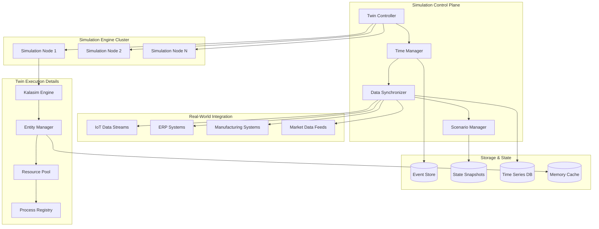

## Executive Summary

AMX Twin Runtime Environment (TRE) is a specialized simulation engine runtime designed as the "Unity Engine for Digital Twins" within the AIMatrix ecosystem. TRE provides discrete event simulation capabilities, real-time data synchronization with physical systems, advanced scenario branching, and precise time control for digital twin execution. Built on Kalasim's discrete event simulation engine with custom real-time extensions, TRE enables complex business process modeling, supply chain optimization, and predictive scenario planning.

## Technical Specifications

| Specification | Details |
|---------------|---------|
| **Product Name** | AMX Twin Runtime Environment (TRE) |
| **Version** | 1.0 |
| **Simulation Engine** | Kalasim DES with real-time extensions |
| **Architecture** | Event-driven microservices with time synchronization |
| **Twin Types Supported** | Process, Supply Chain, Financial, Organizational |
| **Time Control** | Variable speed (0.1x - 1000x), pause, rewind |
| **Data Synchronization** | Real-time streaming with conflict resolution |
| **Scenario Management** | Branch/merge with parallel execution |
| **Scalability** | Distributed simulation across compute clusters |

### Performance Specifications
| Metric | Specification |
|--------|--------------|
| **Simulation Speed** | 1M+ events per second per core |
| **Real-time Sync Latency** | < 50ms for critical data streams |
| **Scenario Branches** | 10,000+ parallel scenarios |
| **Twin Complexity** | 100,000+ entities per twin |
| **Time Precision** | Nanosecond-level event ordering |
| **Memory Efficiency** | < 1GB per 10K entities |
| **Concurrent Twins** | 1,000+ active twins per cluster |

## System Requirements

### Minimum Requirements
| Component | Specification |
|-----------|---------------|
| **Operating System** | Linux (Ubuntu 20.04+), Windows Server 2019+ |
| **Runtime** | JVM 17+ with specialized GC tuning |
| **CPU** | 8 cores, 2.8 GHz with high single-thread performance |
| **RAM** | 16 GB with low-latency memory |
| **Storage** | 200 GB NVMe SSD for event logs |
| **Network** | 1 Gbps with low latency (< 1ms) |
| **Time Sync** | NTP/PTP for precision time protocol |

### Recommended Production
| Component | Specification |
|-----------|---------------|
| **Operating System** | Linux (Ubuntu 22.04 LTS) with real-time kernel |
| **Runtime** | OpenJDK 21 LTS with ZGC collector |
| **CPU** | 32+ cores, 4.0 GHz with NUMA topology |
| **RAM** | 128 GB with persistent memory (Intel Optane) |
| **Storage** | 2 TB NVMe SSD in RAID 0 configuration |
| **Network** | 25 Gbps with RDMA support |
| **Time Sync** | Hardware GPS/PTP clock synchronization |

## Core Architecture

### TRE System Overview



### Discrete Event Simulation Engine

```kotlin
// TRE Simulation Runtime
class TRESimulationRuntime(
    private val timeManager: SimulationTimeManager,
    private val dataSync: RealTimeDataSynchronizer,
    private val scenarioManager: ScenarioManager
) {
    
    suspend fun executeTwin(twinSpec: DigitalTwinSpec): TwinExecution {
        // Initialize simulation environment
        val simEnv = createSimulationEnvironment(twinSpec)
        
        // Set up real-time data synchronization
        val syncConfig = dataSync.configure(
            dataSources = twinSpec.dataSources,
            syncFrequency = twinSpec.syncFrequency,
            conflictResolution = twinSpec.conflictResolution
        )
        
        // Initialize time management
        timeManager.initialize(
            startTime = twinSpec.simulationStart,
            timeScale = twinSpec.timeScale,
            maxSimulationTime = twinSpec.maxDuration
        )
        
        // Create base scenario
        val baseScenario = scenarioManager.createScenario(
            name = "baseline",
            spec = twinSpec,
            parentScenario = null
        )
        
        // Execute simulation
        return executeSimulation(simEnv, baseScenario, syncConfig)
    }
    
    private suspend fun executeSimulation(
        simEnv: SimulationEnvironment,
        scenario: TwinScenario,
        syncConfig: DataSyncConfiguration
    ): TwinExecution {
        
        val simulation = simEnv.simulation {
            // Initialize entities and resources
            initializeEntities(scenario.entities)
            initializeResources(scenario.resources)
            initializeProcesses(scenario.processes)
            
            // Set up event handlers
            setupEventHandlers(scenario.eventHandlers)
            
            // Configure real-time data integration
            setupRealTimeDataIntegration(syncConfig)
        }
        
        // Start simulation execution
        val executionId = UUID.randomUUID().toString()
        val execution = TwinExecution(
            id = executionId,
            twinId = scenario.twinId,
            scenarioId = scenario.id,
            startTime = Instant.now(),
            simulation = simulation
        )
        
        // Execute with monitoring
        try {
            simulation.run()
        } catch (e: Exception) {
            execution.markFailed(e)
            throw SimulationExecutionException("Simulation failed", e)
        }
        
        execution.markCompleted()
        return execution
    }
    
    suspend fun createScenarioBranch(
        parentExecutionId: String,
        branchPoint: SimulationTime,
        modifications: ScenarioModifications
    ): TwinExecution {
        
        val parentExecution = getExecution(parentExecutionId)
        val parentScenario = scenarioManager.getScenario(parentExecution.scenarioId)
        
        // Create snapshot at branch point
        val snapshot = createSnapshot(parentExecution, branchPoint)
        
        // Create branched scenario with modifications
        val branchedScenario = scenarioManager.createBranch(
            parentScenario = parentScenario,
            branchPoint = branchPoint,
            modifications = modifications,
            snapshot = snapshot
        )
        
        // Execute branched scenario
        return executeBranchedScenario(branchedScenario, snapshot)
    }
}

// Kalasim Integration with Real-Time Extensions
class RealTimeKalasimEngine(
    private val timeManager: SimulationTimeManager,
    private val dataSync: RealTimeDataSynchronizer
) {
    
    fun createSimulation(twinSpec: DigitalTwinSpec): Environment {
        return Environment(
            name = twinSpec.name,
            timeUnit = TimeUnit.MILLISECONDS,
            randomSeed = twinSpec.randomSeed
        ).apply {
            
            // Configure real-time synchronization
            setupRealTimeSync()
            
            // Define entities and their behaviors
            setupEntityTypes(twinSpec.entityTypes)
            
            // Configure resources and constraints
            setupResources(twinSpec.resources)
            
            // Define processes and workflows
            setupProcesses(twinSpec.processes)
        }
    }
    
    private fun Environment.setupRealTimeSync() {
        // Custom component for real-time data integration
        val realTimeSync = object : Component("real-time-sync") {
            override fun process(): Sequence<ComponentState> = sequence {
                while (true) {
                    // Synchronize with real-world data
                    val updates = dataSync.fetchUpdates(now)
                    
                    updates.forEach { update ->
                        when (update.type) {
                            "entity_state" -> updateEntityState(update)
                            "resource_capacity" -> updateResourceCapacity(update)
                            "process_parameter" -> updateProcessParameter(update)
                            "external_event" -> injectExternalEvent(update)
                        }
                    }
                    
                    // Wait for next sync interval
                    yield(hold(timeManager.syncInterval))
                }
            }
        }
        
        realTimeSync.activate()
    }
    
    private fun Environment.setupEntityTypes(entityTypes: List<EntityTypeSpec>) {
        entityTypes.forEach { entityType ->
            // Register entity type factory
            registerEntityType(entityType.name) { 
                createEntityInstance(entityType)
            }
        }
    }
    
    private fun createEntityInstance(entityType: EntityTypeSpec): Component {
        return object : Component(entityType.name) {
            
            val attributes = entityType.attributes.mapValues { (_, attr) ->
                generateAttributeValue(attr)
            }.toMutableMap()
            
            override fun process(): Sequence<ComponentState> = sequence {
                // Execute entity lifecycle based on type
                when (entityType.category) {
                    "customer" -> yield* executeCustomerLifecycle()
                    "product" -> yield* executeProductLifecycle()
                    "order" -> yield* executeOrderLifecycle()
                    "resource" -> yield* executeResourceLifecycle()
                    else -> yield* executeGenericLifecycle()
                }
            }
            
            private suspend fun SequenceScope<ComponentState>.executeCustomerLifecycle() {
                while (isActive) {
                    // Customer behavior patterns
                    val nextAction = determineCustomerAction()
                    
                    when (nextAction.type) {
                        "purchase" -> {
                            yield(request(resources["sales_channel"]) {
                                hold(nextAction.duration)
                                generatePurchaseEvent(nextAction)
                            })
                        }
                        "support_contact" -> {
                            yield(request(resources["support_team"]) {
                                hold(nextAction.duration)
                                generateSupportEvent(nextAction)
                            })
                        }
                        "churn_evaluation" -> {
                            val churnDecision = evaluateChurn()
                            if (churnDecision.willChurn) {
                                generateChurnEvent()
                                return@executeCustomerLifecycle
                            }
                        }
                    }
                    
                    yield(hold(nextAction.waitTime))
                }
            }
        }
    }
}
```

## Real-Time Data Synchronization

### Data Stream Integration

```kotlin
// Real-Time Data Synchronizer
class RealTimeDataSynchronizer(
    private val streamProcessors: Map<String, StreamProcessor>,
    private val conflictResolver: ConflictResolver,
    private val changeDetector: ChangeDetector
) {
    
    suspend fun synchronizeData(
        dataSources: List<DataSourceConfig>,
        simulationTime: SimulationTime
    ): List<DataUpdate> {
        
        val updates = mutableListOf<DataUpdate>()
        
        // Fetch updates from all configured sources
        val sourceUpdates = dataSources.map { source ->
            async {
                fetchSourceUpdates(source, simulationTime)
            }
        }.awaitAll()
        
        // Merge and resolve conflicts
        val mergedUpdates = conflictResolver.resolve(sourceUpdates.flatten())
        
        // Apply temporal adjustments for simulation time
        val adjustedUpdates = adjustForSimulationTime(
            updates = mergedUpdates,
            simulationTime = simulationTime,
            realTime = Instant.now()
        )
        
        return adjustedUpdates
    }
    
    private suspend fun fetchSourceUpdates(
        source: DataSourceConfig,
        simulationTime: SimulationTime
    ): List<DataUpdate> {
        
        val processor = streamProcessors[source.type]
            ?: throw IllegalArgumentException("No processor for source type: ${source.type}")
        
        return when (source.type) {
            "iot_sensors" -> fetchIoTUpdates(processor, source, simulationTime)
            "erp_system" -> fetchERPUpdates(processor, source, simulationTime)
            "market_feed" -> fetchMarketUpdates(processor, source, simulationTime)
            "manufacturing" -> fetchMESUpdates(processor, source, simulationTime)
            else -> emptyList()
        }
    }
    
    private suspend fun fetchIoTUpdates(
        processor: StreamProcessor,
        source: DataSourceConfig,
        simulationTime: SimulationTime
    ): List<DataUpdate> {
        
        // Connect to IoT data stream
        val stream = processor.connect(source.connectionString)
        
        // Fetch data within time window
        val timeWindow = calculateTimeWindow(simulationTime, source.syncFrequency)
        val rawData = stream.fetchDataInWindow(timeWindow)
        
        // Transform to simulation entities
        return rawData.map { iotReading ->
            DataUpdate(
                entityId = iotReading.deviceId,
                entityType = "sensor",
                attribute = iotReading.measurementType,
                newValue = iotReading.value,
                timestamp = iotReading.timestamp,
                source = source.id,
                confidence = iotReading.accuracy
            )
        }
    }
    
    private suspend fun adjustForSimulationTime(
        updates: List<DataUpdate>,
        simulationTime: SimulationTime,
        realTime: Instant
    ): List<DataUpdate> {
        
        val timeScale = simulationTime.scale
        val simulationStartReal = simulationTime.startTime
        val simulationStartSim = simulationTime.simulationStartTime
        
        return updates.map { update ->
            // Calculate equivalent simulation time
            val realTimeDelta = Duration.between(simulationStartReal, update.timestamp)
            val simulationTimeDelta = realTimeDelta.dividedBy(timeScale.toLong())
            val simulationTimestamp = simulationStartSim.plus(simulationTimeDelta)
            
            update.copy(
                timestamp = simulationTimestamp,
                simulationTime = simulationTimestamp
            )
        }
    }
}

// Conflict Resolution for Concurrent Updates
class ConflictResolver {
    
    fun resolve(updates: List<DataUpdate>): List<DataUpdate> {
        // Group updates by entity and attribute
        val groupedUpdates = updates.groupBy { "${it.entityId}:${it.attribute}" }
        
        return groupedUpdates.flatMap { (key, conflictingUpdates) ->
            if (conflictingUpdates.size == 1) {
                conflictingUpdates
            } else {
                resolveConflicts(key, conflictingUpdates)
            }
        }
    }
    
    private fun resolveConflicts(
        key: String,
        conflicts: List<DataUpdate>
    ): List<DataUpdate> {
        
        // Sort by timestamp and confidence
        val sortedConflicts = conflicts.sortedWith(
            compareBy<DataUpdate> { it.timestamp }
                .thenByDescending { it.confidence }
        )
        
        return when (determineResolutionStrategy(conflicts)) {
            ConflictResolutionStrategy.LATEST_WINS -> 
                listOf(sortedConflicts.last())
            
            ConflictResolutionStrategy.HIGHEST_CONFIDENCE -> 
                listOf(sortedConflicts.maxBy { it.confidence })
            
            ConflictResolutionStrategy.SOURCE_PRIORITY -> 
                resolveBySourcePriority(sortedConflicts)
            
            ConflictResolutionStrategy.INTERPOLATE -> 
                interpolateValues(sortedConflicts)
            
            ConflictResolutionStrategy.MERGE_ALL -> 
                mergeConflictingValues(sortedConflicts)
        }
    }
    
    private fun interpolateValues(conflicts: List<DataUpdate>): List<DataUpdate> {
        if (conflicts.size < 2) return conflicts
        
        // Interpolate between values based on timestamps
        val first = conflicts.first()
        val last = conflicts.last()
        
        if (first.newValue is Number && last.newValue is Number) {
            val interpolatedValue = interpolateNumeric(
                startValue = first.newValue as Double,
                endValue = last.newValue as Double,
                startTime = first.timestamp,
                endTime = last.timestamp,
                targetTime = last.timestamp
            )
            
            return listOf(last.copy(newValue = interpolatedValue))
        }
        
        return listOf(last) // Fallback to latest
    }
}
```

## Scenario Branching and Management

### Parallel Scenario Execution

```kotlin
// Scenario Manager with Branching Support
class ScenarioManager(
    private val snapshotManager: SnapshotManager,
    private val executionEngine: TRESimulationRuntime
) {
    
    data class ScenarioBranch(
        val id: String,
        val parentScenarioId: String?,
        val branchPoint: SimulationTime,
        val modifications: ScenarioModifications,
        val snapshot: SimulationSnapshot,
        val execution: TwinExecution?,
        val status: BranchStatus
    )
    
    private val branches = ConcurrentHashMap<String, ScenarioBranch>()
    private val branchExecutor = Executors.newCachedThreadPool()
    
    suspend fun createBranch(
        parentScenario: TwinScenario,
        branchPoint: SimulationTime,
        modifications: ScenarioModifications,
        executeImmediately: Boolean = true
    ): ScenarioBranch {
        
        // Create snapshot at branch point
        val snapshot = snapshotManager.createSnapshot(
            scenarioId = parentScenario.id,
            timestamp = branchPoint
        )
        
        // Generate branch ID
        val branchId = "${parentScenario.id}-branch-${UUID.randomUUID()}"
        
        // Create branch specification
        val branch = ScenarioBranch(
            id = branchId,
            parentScenarioId = parentScenario.id,
            branchPoint = branchPoint,
            modifications = modifications,
            snapshot = snapshot,
            execution = null,
            status = BranchStatus.CREATED
        )
        
        branches[branchId] = branch
        
        // Execute branch if requested
        if (executeImmediately) {
            executeBranch(branch)
        }
        
        return branch
    }
    
    suspend fun executeBranch(branch: ScenarioBranch): TwinExecution {
        // Update branch status
        val updatedBranch = branch.copy(status = BranchStatus.EXECUTING)
        branches[branch.id] = updatedBranch
        
        // Create modified scenario specification
        val modifiedScenario = applyModifications(
            baseSnapshot = branch.snapshot,
            modifications = branch.modifications
        )
        
        // Execute scenario from branch point
        val execution = try {
            executionEngine.executeFromSnapshot(
                scenario = modifiedScenario,
                snapshot = branch.snapshot,
                branchPoint = branch.branchPoint
            )
        } catch (e: Exception) {
            branches[branch.id] = updatedBranch.copy(
                status = BranchStatus.FAILED,
                execution = null
            )
            throw e
        }
        
        // Update branch with execution results
        branches[branch.id] = updatedBranch.copy(
            status = BranchStatus.COMPLETED,
            execution = execution
        )
        
        return execution
    }
    
    suspend fun compareScenarios(
        scenarioIds: List<String>,
        metrics: List<String>
    ): ScenarioComparison {
        
        val scenarios = scenarioIds.map { id ->
            branches[id] ?: throw IllegalArgumentException("Scenario not found: $id")
        }
        
        val comparisons = metrics.map { metric ->
            val metricValues = scenarios.mapNotNull { scenario ->
                scenario.execution?.getMetricValue(metric)
            }
            
            MetricComparison(
                metricName = metric,
                values = scenarioIds.zip(metricValues).toMap(),
                bestValue = metricValues.maxOrNull(),
                worstValue = metricValues.minOrNull(),
                averageValue = metricValues.average(),
                standardDeviation = calculateStandardDeviation(metricValues)
            )
        }
        
        return ScenarioComparison(
            scenarios = scenarios.map { it.id },
            metrics = comparisons,
            recommendation = generateRecommendation(comparisons)
        )
    }
    
    suspend fun mergeBranches(
        targetBranchId: String,
        sourceBranchIds: List<String>,
        mergeStrategy: MergeStrategy
    ): ScenarioBranch {
        
        val targetBranch = branches[targetBranchId]
            ?: throw IllegalArgumentException("Target branch not found: $targetBranchId")
        
        val sourceBranches = sourceBranchIds.map { id ->
            branches[id] ?: throw IllegalArgumentException("Source branch not found: $id")
        }
        
        // Validate branches can be merged
        validateMergeCompatibility(targetBranch, sourceBranches)
        
        // Apply merge strategy
        val mergedModifications = when (mergeStrategy) {
            MergeStrategy.UNION -> mergeUnion(targetBranch, sourceBranches)
            MergeStrategy.INTERSECTION -> mergeIntersection(targetBranch, sourceBranches)
            MergeStrategy.WEIGHTED_AVERAGE -> mergeWeightedAverage(targetBranch, sourceBranches)
            MergeStrategy.BEST_PERFORMING -> mergeBestPerforming(targetBranch, sourceBranches)
        }
        
        // Create merged branch
        return createBranch(
            parentScenario = getScenario(targetBranch.parentScenarioId!!),
            branchPoint = targetBranch.branchPoint,
            modifications = mergedModifications
        )
    }
}

// Scenario Modifications DSL
data class ScenarioModifications(
    val entityModifications: List<EntityModification> = emptyList(),
    val resourceModifications: List<ResourceModification> = emptyList(),
    val processModifications: List<ProcessModification> = emptyList(),
    val parameterChanges: Map<String, Any> = emptyMap()
) {
    
    companion object {
        fun build(block: ScenarioModificationsBuilder.() -> Unit): ScenarioModifications {
            return ScenarioModificationsBuilder().apply(block).build()
        }
    }
}

class ScenarioModificationsBuilder {
    private val entities = mutableListOf<EntityModification>()
    private val resources = mutableListOf<ResourceModification>()
    private val processes = mutableListOf<ProcessModification>()
    private val parameters = mutableMapOf<String, Any>()
    
    fun modifyEntity(entityId: String, block: EntityModificationBuilder.() -> Unit) {
        entities.add(EntityModificationBuilder(entityId).apply(block).build())
    }
    
    fun modifyResource(resourceId: String, block: ResourceModificationBuilder.() -> Unit) {
        resources.add(ResourceModificationBuilder(resourceId).apply(block).build())
    }
    
    fun modifyProcess(processId: String, block: ProcessModificationBuilder.() -> Unit) {
        processes.add(ProcessModificationBuilder(processId).apply(block).build())
    }
    
    fun setParameter(name: String, value: Any) {
        parameters[name] = value
    }
    
    fun build() = ScenarioModifications(entities, resources, processes, parameters)
}

// Example Usage
suspend fun createWhatIfScenario() {
    val modifications = ScenarioModifications.build {
        // Increase customer demand by 25%
        setParameter("customer_arrival_rate", 1.25)
        
        // Add additional staff resources
        modifyResource("customer_service_staff") {
            increaseCapacity(5)
        }
        
        // Modify process efficiency
        modifyProcess("order_fulfillment") {
            reduceProcessingTime(0.15) // 15% improvement
        }
        
        // Simulate supply chain disruption
        modifyEntity("primary_supplier") {
            setAttribute("reliability", 0.7)
            setAttribute("lead_time_multiplier", 1.5)
        }
    }
    
    val branch = scenarioManager.createBranch(
        parentScenario = baselineScenario,
        branchPoint = SimulationTime.now(),
        modifications = modifications
    )
}
```

## Time Control and Management

### Temporal Control System

```kotlin
// Simulation Time Manager
class SimulationTimeManager {
    
    data class TimeControlState(
        val currentTime: SimulationTime,
        val realTimeStart: Instant,
        val simulationTimeStart: SimulationTime,
        val timeScale: Double,
        val isPaused: Boolean,
        val maxSpeed: Double = 1000.0,
        val minSpeed: Double = 0.1
    )
    
    private var timeState = AtomicReference<TimeControlState>()
    private val timeListeners = mutableSetOf<TimeChangeListener>()
    
    suspend fun setTimeScale(newScale: Double) {
        val currentState = timeState.get()
        
        // Validate scale bounds
        val clampedScale = newScale.coerceIn(currentState.minSpeed, currentState.maxSpeed)
        
        // Calculate new simulation time based on real time elapsed
        val realTimeElapsed = Duration.between(currentState.realTimeStart, Instant.now())
        val simulationTimeElapsed = realTimeElapsed.multipliedBy(currentState.timeScale.toLong())
        val newSimulationTime = currentState.simulationTimeStart.plus(simulationTimeElapsed)
        
        // Update state
        val newState = currentState.copy(
            currentTime = newSimulationTime,
            timeScale = clampedScale,
            realTimeStart = Instant.now(),
            simulationTimeStart = newSimulationTime
        )
        
        timeState.set(newState)
        notifyTimeScaleChange(currentState.timeScale, clampedScale)
    }
    
    suspend fun pauseSimulation() {
        val currentState = timeState.get()
        if (currentState.isPaused) return
        
        // Calculate current simulation time
        val realTimeElapsed = Duration.between(currentState.realTimeStart, Instant.now())
        val simulationTimeElapsed = realTimeElapsed.multipliedBy(currentState.timeScale.toLong())
        val currentSimTime = currentState.simulationTimeStart.plus(simulationTimeElapsed)
        
        // Update to paused state
        val pausedState = currentState.copy(
            currentTime = currentSimTime,
            isPaused = true
        )
        
        timeState.set(pausedState)
        notifyTimeControlChange(TimeControlEvent.PAUSED)
    }
    
    suspend fun resumeSimulation() {
        val currentState = timeState.get()
        if (!currentState.isPaused) return
        
        // Resume from current simulation time
        val resumedState = currentState.copy(
            isPaused = false,
            realTimeStart = Instant.now(),
            simulationTimeStart = currentState.currentTime
        )
        
        timeState.set(resumedState)
        notifyTimeControlChange(TimeControlEvent.RESUMED)
    }
    
    suspend fun jumpToTime(targetTime: SimulationTime) {
        val currentState = timeState.get()
        
        // Validate target time
        if (targetTime.isBefore(currentState.simulationTimeStart)) {
            throw IllegalArgumentException("Cannot jump to time before simulation start")
        }
        
        // Create snapshot before jump if jumping forward significantly
        val timeDifference = Duration.between(currentState.currentTime.instant, targetTime.instant)
        if (timeDifference.toHours() > 1) {
            snapshotManager.createSnapshot(
                timestamp = currentState.currentTime,
                reason = "time_jump_backup"
            )
        }
        
        // Update state to target time
        val jumpedState = currentState.copy(
            currentTime = targetTime,
            realTimeStart = Instant.now(),
            simulationTimeStart = targetTime
        )
        
        timeState.set(jumpedState)
        notifyTimeJump(currentState.currentTime, targetTime)
    }
    
    fun getCurrentSimulationTime(): SimulationTime {
        val currentState = timeState.get()
        
        if (currentState.isPaused) {
            return currentState.currentTime
        }
        
        val realTimeElapsed = Duration.between(currentState.realTimeStart, Instant.now())
        val simulationTimeElapsed = realTimeElapsed.multipliedBy(currentState.timeScale.toLong())
        return currentState.simulationTimeStart.plus(simulationTimeElapsed)
    }
    
    // Time travel for debugging and analysis
    suspend fun rewindToSnapshot(snapshotId: String) {
        val snapshot = snapshotManager.getSnapshot(snapshotId)
        
        // Restore simulation state from snapshot
        restoreFromSnapshot(snapshot)
        
        // Update time state
        val rewindState = timeState.get().copy(
            currentTime = snapshot.timestamp,
            realTimeStart = Instant.now(),
            simulationTimeStart = snapshot.timestamp
        )
        
        timeState.set(rewindState)
        notifyTimeRewind(snapshot.timestamp)
    }
}

// Advanced Time Synchronization for Multi-Node Simulations
class DistributedTimeCoordinator(
    private val nodes: List<SimulationNode>
) {
    
    suspend fun synchronizeTime(targetTime: SimulationTime): TimeSyncResult {
        // Vector clock for distributed time synchronization
        val vectorClock = VectorClock()
        
        // Send synchronization request to all nodes
        val syncRequests = nodes.map { node ->
            async {
                node.requestTimeSync(targetTime, vectorClock.tick(node.id))
            }
        }
        
        // Collect responses
        val responses = syncRequests.awaitAll()
        
        // Determine if synchronization was successful
        val allSynced = responses.all { it.successful }
        val maxDrift = responses.maxOfOrNull { it.timeDrift } ?: Duration.ZERO
        
        return TimeSyncResult(
            successful = allSynced,
            participatingNodes = nodes.size,
            syncedNodes = responses.count { it.successful },
            maxTimeDrift = maxDrift,
            vectorClock = vectorClock
        )
    }
    
    suspend fun coordinatedTimeAdvance(
        targetTime: SimulationTime,
        maxDrift: Duration = Duration.ofMillis(10)
    ): CoordinatedAdvanceResult {
        
        // Phase 1: Prepare all nodes for time advance
        val prepareResults = nodes.map { node ->
            async { node.prepareTimeAdvance(targetTime) }
        }.awaitAll()
        
        if (!prepareResults.all { it.ready }) {
            // Some nodes not ready, abort
            return CoordinatedAdvanceResult.Aborted(
                reason = "Nodes not ready",
                notReadyNodes = prepareResults
                    .zip(nodes)
                    .filter { !it.first.ready }
                    .map { it.second.id }
            )
        }
        
        // Phase 2: Commit time advance on all nodes
        val commitBarrier = CyclicBarrier(nodes.size)
        val commitResults = nodes.map { node ->
            async {
                commitBarrier.await() // Wait for all nodes
                node.commitTimeAdvance(targetTime)
            }
        }.awaitAll()
        
        // Phase 3: Verify synchronization
        val verificationResults = nodes.map { node ->
            async { node.verifyTimeSync(targetTime, maxDrift) }
        }.awaitAll()
        
        val allVerified = verificationResults.all { it.verified }
        
        return if (allVerified) {
            CoordinatedAdvanceResult.Success(
                targetTime = targetTime,
                actualDrift = verificationResults.maxOf { it.actualDrift }
            )
        } else {
            CoordinatedAdvanceResult.Failed(
                reason = "Post-commit verification failed",
                failedNodes = verificationResults
                    .zip(nodes)
                    .filter { !it.first.verified }
                    .map { it.second.id }
            )
        }
    }
}
```

## Model Execution Environment

### Digital Twin Execution Framework

```kotlin
// Twin Execution Environment
class TwinExecutionEnvironment(
    private val resourceManager: ResourceManager,
    private val processRegistry: ProcessRegistry,
    private val eventBus: EventBus
) {
    
    suspend fun loadTwinModel(modelSpec: TwinModelSpec): LoadedTwinModel {
        // Validate model specification
        val validation = validateTwinModel(modelSpec)
        if (!validation.isValid) {
            throw TwinModelValidationException(validation.errors)
        }
        
        // Allocate resources for twin
        val resources = resourceManager.allocateResources(
            cpu = modelSpec.computeRequirements.cpu,
            memory = modelSpec.computeRequirements.memory,
            storage = modelSpec.computeRequirements.storage
        )
        
        // Initialize twin entities
        val entities = initializeTwinEntities(modelSpec.entityDefinitions)
        
        // Set up processes
        val processes = registerTwinProcesses(modelSpec.processDefinitions)
        
        // Configure event handlers
        val eventHandlers = setupEventHandlers(modelSpec.eventHandlers)
        
        return LoadedTwinModel(
            id = modelSpec.id,
            specification = modelSpec,
            entities = entities,
            processes = processes,
            eventHandlers = eventHandlers,
            resources = resources,
            loadedAt = Instant.now()
        )
    }
    
    private suspend fun initializeTwinEntities(
        entityDefs: List<EntityDefinition>
    ): Map<String, List<TwinEntity>> {
        
        val entities = mutableMapOf<String, MutableList<TwinEntity>>()
        
        entityDefs.forEach { entityDef ->
            val entityInstances = (1..entityDef.initialCount).map { index ->
                createTwinEntity(entityDef, index)
            }
            entities[entityDef.type] = entityInstances.toMutableList()
        }
        
        return entities
    }
    
    private suspend fun createTwinEntity(
        entityDef: EntityDefinition,
        instanceIndex: Int
    ): TwinEntity {
        
        val entityId = "${entityDef.type}_${instanceIndex}"
        
        return TwinEntity(
            id = entityId,
            type = entityDef.type,
            attributes = initializeAttributes(entityDef.attributes),
            behaviors = initializeBehaviors(entityDef.behaviors),
            state = EntityState.CREATED,
            createdAt = Instant.now()
        )
    }
    
    private fun initializeAttributes(
        attributeDefs: Map<String, AttributeDefinition>
    ): MutableMap<String, Any> {
        
        return attributeDefs.mapValues { (_, attrDef) ->
            when (attrDef.type) {
                AttributeType.INTEGER -> generateIntegerValue(attrDef)
                AttributeType.DOUBLE -> generateDoubleValue(attrDef)
                AttributeType.STRING -> generateStringValue(attrDef)
                AttributeType.BOOLEAN -> generateBooleanValue(attrDef)
                AttributeType.ENUM -> generateEnumValue(attrDef)
                AttributeType.DISTRIBUTION -> generateDistributionValue(attrDef)
            }
        }.toMutableMap()
    }
    
    private suspend fun registerTwinProcesses(
        processDefs: List<ProcessDefinition>
    ): Map<String, TwinProcess> {
        
        return processDefs.associate { processDef ->
            val process = createTwinProcess(processDef)
            processRegistry.register(process)
            processDef.id to process
        }
    }
    
    private fun createTwinProcess(processDef: ProcessDefinition): TwinProcess {
        return when (processDef.type) {
            ProcessType.WORKFLOW -> createWorkflowProcess(processDef)
            ProcessType.SERVICE -> createServiceProcess(processDef)
            ProcessType.BATCH -> createBatchProcess(processDef)
            ProcessType.STREAMING -> createStreamingProcess(processDef)
        }
    }
}

// Business Process Modeling in TRE
class BusinessProcessTwin(
    val id: String,
    val name: String,
    val processSteps: List<ProcessStep>,
    val resources: Map<String, Resource>,
    val kpis: List<KPIDefinition>
) : Component(name) {
    
    override fun process(): Sequence<ComponentState> = sequence {
        while (true) {
            // Wait for process trigger
            val processInstance = waitForProcessTrigger()
            
            // Execute process steps
            var currentContext = ProcessContext(
                instanceId = generateInstanceId(),
                startTime = now,
                variables = mutableMapOf()
            )
            
            for (step in processSteps) {
                try {
                    currentContext = executeProcessStep(step, currentContext)
                } catch (e: ProcessExecutionException) {
                    currentContext = handleProcessException(e, step, currentContext)
                }
            }
            
            // Record process completion metrics
            recordProcessMetrics(currentContext)
            
            yield(passivate()) // Wait for next process instance
        }
    }
    
    private suspend fun executeProcessStep(
        step: ProcessStep,
        context: ProcessContext
    ): ProcessContext {
        
        return when (step.type) {
            StepType.TASK -> executeTaskStep(step, context)
            StepType.GATEWAY -> executeGatewayStep(step, context)
            StepType.SUBPROCESS -> executeSubprocessStep(step, context)
            StepType.SERVICE_CALL -> executeServiceCallStep(step, context)
        }
    }
    
    private suspend fun executeTaskStep(
        step: ProcessStep,
        context: ProcessContext
    ): ProcessContext {
        
        // Request required resources
        val requiredResources = step.resourceRequirements
        val allocatedResources = mutableListOf<Resource>()
        
        for ((resourceType, quantity) in requiredResources) {
            val resource = resources[resourceType]
                ?: throw ResourceNotFoundException("Resource $resourceType not found")
            
            repeat(quantity) {
                val allocation = request(resource)
                allocatedResources.add(resource)
            }
        }
        
        try {
            // Execute task logic
            val executionTime = calculateTaskExecutionTime(step, context)
            hold(executionTime)
            
            // Update process variables
            val updatedVariables = executeTaskLogic(step, context.variables)
            
            return context.copy(
                variables = updatedVariables,
                completedSteps = context.completedSteps + step.id
            )
            
        } finally {
            // Release resources
            allocatedResources.forEach { resource ->
                release(resource)
            }
        }
    }
}
```

## Twin Types and Runtime Assignment

### Which Twins Run in TRE

**Process Twins** (Primary TRE Users):
- **Business Process Twins**: Workflow modeling and optimization
- **Supply Chain Twins**: Multi-tier supplier and logistics networks
- **Financial Process Twins**: Trading, risk management, compliance workflows
- **Manufacturing Twins**: Production line simulation and optimization

**Organizational Twins** (TRE Native):
- **Team Performance Twins**: Human resource and collaboration modeling
- **Department Twins**: Organizational structure and interaction simulation
- **Customer Journey Twins**: End-to-end customer experience modeling
- **Service Delivery Twins**: Service process optimization and capacity planning

**Analytical Twins** (Hybrid TRE/ARE):
- **Predictive Analytics Twins**: Time series forecasting with scenario planning
- **Risk Management Twins**: Monte Carlo simulation and stress testing
- **Market Simulation Twins**: Customer behavior and demand modeling
- **Optimization Twins**: Resource allocation and constraint satisfaction

### Runtime Selection Logic

```kotlin
fun selectTwinRuntime(twinSpec: DigitalTwinSpec): RuntimeSelection {
    return when {
        // Time-critical simulations always use TRE
        twinSpec.requiresTimeControl || twinSpec.hasScenarioBranching -> 
            RuntimeSelection.TRE
        
        // Process-heavy twins prefer TRE
        twinSpec.processComplexity > 0.7 || twinSpec.hasWorkflows ->
            RuntimeSelection.TRE
        
        // Real-time data sync requirements
        twinSpec.realTimeDataSources.isNotEmpty() && twinSpec.syncFrequency < Duration.ofMinutes(1) ->
            RuntimeSelection.TRE
        
        // Heavy simulation workloads
        twinSpec.expectedEvents > 100000 || twinSpec.simulationDuration > Duration.ofHours(24) ->
            RuntimeSelection.TRE_CLUSTER
        
        // Interactive/agent-driven twins may use ARE
        twinSpec.requiresAgentInteraction && !twinSpec.requiresTimeControl ->
            RuntimeSelection.ARE
        
        // Default to TRE for most digital twins
        else -> RuntimeSelection.TRE
    }
}
```

---

**Download AMX TRE**: [tre.aimatrix.com](https://tre.aimatrix.com)  
**Documentation**: [docs.aimatrix.com/tre](https://docs.aimatrix.com/tre)  
**Support**: [support@aimatrix.com](mailto:support@aimatrix.com)