Beyond our core products, AIMatrix offers specialized services that transform raw business data into structured, actionable knowledge. These services bridge the gap between information chaos and intelligent automation.

## Our Service Portfolio

  

    <h2>🔄 Knowledge Pipeline</h2>
    
<strong>Data to Intelligence Transformation</strong>

    
Ingest, process, and structure data from all your business systems into reusable knowledge artifacts

    <ul>
      <li>Multi-source integration</li>
      <li>Intelligent data cleaning</li>
      <li>Automated structuring</li>
      <li>Real-time processing</li>
    </ul>
    <a href="/business/services/knowledge-pipeline/" style="color: #00ff00;">Learn More →</a>
  

  

    <h2>🎥 Video Intelligence</h2>
    
<strong>Meeting & Media ETL</strong>

    
Extract actionable insights from video recordings, meetings, and multimedia content

    <ul>
      <li>Meeting transcription & analysis</li>
      <li>Action item extraction</li>
      <li>Knowledge capsule generation</li>
      <li>Multi-modal processing</li>
    </ul>
    <a href="/business/services/video-intelligence/" style="color: #00ff00;">Learn More →</a>
  

  

    <h2>📚 Knowledge Library</h2>
    
<strong>Enterprise Knowledge Management</strong>

    
Build and maintain a living library of your organization's collective intelligence

    <ul>
      <li>Knowledge capsule organization</li>
      <li>Volume compilation</li>
      <li>Cross-referencing & citations</li>
      <li>Continuous learning system</li>
    </ul>
    <a href="/business/services/knowledge-library/" style="color: #00ff00;">Learn More →</a>
  

## The Knowledge Hierarchy

Our services follow a structured approach to knowledge management:

```mermaid
graph TD
    A[Raw Data Sources] -->|Ingestion| B[Knowledge Pipeline]
    B -->|Processing| C[Knowledge Capsules]
    C -->|Compilation| D[Knowledge Volumes]
    D -->|Organization| E[Knowledge Library]
    E -->|Deployment| F[AI Agents & Systems]
    
    style A fill:#333,stroke:#00ff00
    style B fill:#333,stroke:#00ff00
    style C fill:#333,stroke:#00ff00
    style D fill:#333,stroke:#00ff00
    style E fill:#333,stroke:#00ff00
    style F fill:#333,stroke:#00ff00
```

### Knowledge Units Explained

#### 🧬 **Knowledge Capsule** (Micro-unit)
- **Size**: 1-5 minutes reading / 200-600 tokens
- **Content**: One atomic idea, fact, or procedure
- **Example**: "How to process an invoice", "Customer complaint resolution steps"
- **Purpose**: Smallest reusable knowledge unit for AI consumption

#### 📘 **Knowledge Volume** (Mid-unit)
- **Size**: 30-60 minutes reading / 10-20 capsules
- **Content**: Complete topic or domain coverage
- **Example**: "Complete E-invoice Setup Guide", "Customer Service Playbook"
- **Purpose**: Comprehensive resource on specific subjects

#### 📚 **Knowledge Library** (Macro-unit)
- **Size**: Unlimited curated collection
- **Content**: Organized catalog of volumes and capsules
- **Example**: "Enterprise Operations Library", "Compliance Knowledge Base"
- **Purpose**: Centralized organizational intelligence

## Why AIMatrix Services?

### The Challenge

Modern businesses generate massive amounts of unstructured data:
- 📧 Thousands of emails daily
- 📹 Hours of meeting recordings
- 📄 Countless documents and reports
- 💬 Continuous chat conversations
- 🗂️ Scattered across multiple systems

This valuable knowledge remains:
- **Inaccessible**: Trapped in silos
- **Unstructured**: No standardization
- **Disconnected**: No relationships mapped
- **Static**: Not improving over time
- **Underutilized**: AI can't consume it

### Our Solution

AIMatrix services transform this chaos into:
- **Structured Knowledge**: Organized, searchable, reusable
- **Living Intelligence**: Continuously updated and improved
- **AI-Ready Content**: Optimized for machine consumption
- **Connected Insights**: Relationships and dependencies mapped
- **Actionable Information**: Ready for immediate use

## Service Integration

Our services work seamlessly together:

## Real-World Applications

### Finance Department
- **Input**: Invoices, receipts, reports, emails
- **Processing**: Automated extraction and structuring
- **Output**: Financial knowledge base powering AI accountants

### Sales Team
- **Input**: Call recordings, CRM data, emails
- **Processing**: Conversation analysis and insight extraction
- **Output**: Sales playbooks and customer intelligence

### Operations
- **Input**: Process documents, training videos, SOPs
- **Processing**: Procedure extraction and optimization
- **Output**: Operational knowledge powering automation

### Human Resources
- **Input**: Policy documents, training materials, meetings
- **Processing**: Content structuring and relationship mapping
- **Output**: HR knowledge base for employee self-service

## Service Benefits

### 🚀 Immediate Value
- Start seeing results within days
- No need to replace existing systems
- Works with your current data sources

### 💡 Continuous Improvement
- Knowledge grows automatically
- AI learns from every interaction
- Quality improves over time

### 🔒 Enterprise Security
- Your data stays yours
- On-premise options available
- Compliance-ready architecture

### 📈 Scalable Architecture
- Process terabytes of data
- Handle thousands of sources
- Support unlimited users

## Pricing Models

### Knowledge Pipeline
- **Starter**: $2,000/month (up to 10 sources)
- **Professional**: $5,000/month (up to 50 sources)
- **Enterprise**: Custom pricing (unlimited sources)

### Video Intelligence
- **Basic**: $500/month (100 hours processing)
- **Standard**: $2,000/month (500 hours processing)
- **Premium**: Custom pricing (unlimited processing)

### Knowledge Library
- **Small**: $1,000/month (up to 1,000 volumes)
- **Medium**: $3,000/month (up to 10,000 volumes)
- **Large**: Custom pricing (unlimited volumes)

### Bundle Pricing
**Complete Knowledge Suite**: Save 30% with all three services
- Comprehensive data processing
- Full video intelligence
- Complete library management
- Priority support included

## Getting Started

### Step 1: Assessment
We analyze your current data landscape:
- Identify key data sources
- Map information flows
- Define knowledge gaps
- Estimate value potential

### Step 2: Pilot Program
Start with a focused implementation:
- Connect 2-3 data sources
- Process sample content
- Build initial knowledge base
- Measure impact

### Step 3: Full Deployment
Scale across your organization:
- Connect all data sources
- Process historical content
- Deploy AI agents
- Continuous optimization

## Success Metrics

Our services deliver measurable results:

| Metric | Before AIMatrix | After AIMatrix |
|--------|----------------|----------------|
| Time to find information | 30-45 minutes | < 30 seconds |
| Knowledge reuse rate | 5-10% | 70-80% |
| Decision accuracy | 60-70% | 90-95% |
| Process automation | 10-20% | 60-80% |
| Employee productivity | Baseline | +40-60% |

## Technology Stack

### Processing Engines
- **Multi-modal LLMs**: GPT-4V, Claude 3, Gemini
- **Specialized Models**: Whisper, CLIP, Custom models
- **Adaptive Selection**: Automatic model routing

### Infrastructure
- **Scalable Pipeline**: Kafka, Apache Beam
- **Vector Storage**: Pinecone, Weaviate
- **Graph Database**: Neo4j for relationships
- **Cloud/On-Premise**: Flexible deployment

## Next Steps

  <h2 style="color: white; margin-top: 0;">Transform Your Data Into Intelligence</h2>
  

    Let us show you how AIMatrix services can unlock the value in your data
  

  

    <a href="/business/contact" style="padding: 15px 30px; background: white; color: #667eea; text-decoration: none; border-radius: 6px; font-weight: bold; font-size: 1.1em;">
      Schedule Consultation →
    </a>
    <a href="/business/partnership-model" style="padding: 15px 30px; border: 2px solid white; color: white; text-decoration: none; border-radius: 6px; font-weight: bold; font-size: 1.1em;">
      View Pricing Options
    </a>
  

---

*AIMatrix Services - Where raw data becomes actionable intelligence*