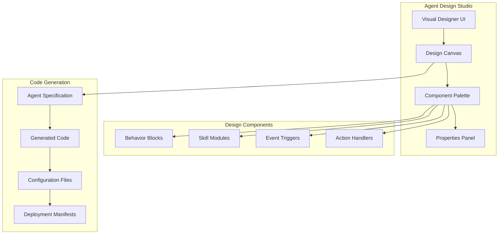
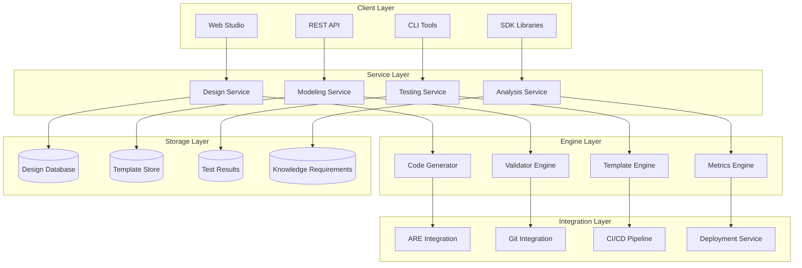

## Service Overview

The Agent Design Service (ADS) provides comprehensive design, development, and testing capabilities for AI agents within the AIMatrix ecosystem. ADS bridges the gap between business requirements and technical implementation, offering visual design tools, behavioral modeling frameworks, automated testing harnesses, and knowledge requirement analysis for all types of AI agents deployed in the AMX Agent Runtime Environment (ARE). With multi-language support including Kotlin, Python, TypeScript, C#, and Java, ADS enables enterprise-grade agent development across diverse technology stacks.

## Core Service Capabilities

### Agent Specification Creation

#### Visual Agent Designer



The ADS Visual Agent Designer provides an intuitive drag-and-drop interface for creating agent specifications:

```typescript
// Agent Design Studio API
interface AgentDesignStudio {
    // Canvas management
    createCanvas(projectId: string): Promise<DesignCanvas>;
    loadCanvas(canvasId: string): Promise<DesignCanvas>;
    saveCanvas(canvas: DesignCanvas): Promise<void>;
    
    // Component management
    addComponent(canvas: DesignCanvas, component: DesignComponent): Promise<void>;
    connectComponents(from: ComponentId, to: ComponentId, connection: Connection): Promise<void>;
    configureComponent(componentId: ComponentId, properties: ComponentProperties): Promise<void>;
    
    // Code generation
    generateSpecification(canvas: DesignCanvas): Promise<AgentSpecification>;
    generateImplementation(specification: AgentSpecification, language: "kotlin" | "python" | "typescript" | "csharp" | "java"): Promise<GeneratedCode>;
    validateDesign(canvas: DesignCanvas): Promise<ValidationResult>;
}

// Example agent design session
class CustomerServiceAgentDesigner {
    private studio: AgentDesignStudio;
    
    async designCustomerServiceAgent(): Promise<AgentSpecification> {
        // Create new design canvas
        const canvas = await this.studio.createCanvas("customer-service-project");
        
        // Add core components
        const inputProcessor = await this.studio.addComponent(canvas, {
            type: "InputProcessor",
            category: "NLP",
            properties: {
                supportedLanguages: ["en", "es", "fr"],
                intentRecognition: true,
                sentimentAnalysis: true
            }
        });
        
        const knowledgeBase = await this.studio.addComponent(canvas, {
            type: "KnowledgeBase",
            category: "Memory",
            properties: {
                knowledgeSourceType: "vector_database",
                maxContextSize: 8192,
                updateFrequency: "real-time"
            }
        });
        
        const responseGenerator = await this.studio.addComponent(canvas, {
            type: "ResponseGenerator", 
            category: "Output",
            properties: {
                responseStyle: "professional_friendly",
                maxResponseLength: 500,
                includeSourceCitations: true
            }
        });
        
        const escalationHandler = await this.studio.addComponent(canvas, {
            type: "EscalationHandler",
            category: "Flow Control",
            properties: {
                escalationThreshold: 0.3,
                escalationTargets: ["human_agent", "supervisor"],
                escalationCriteria: ["unsure", "complex", "frustrated"]
            }
        });
        
        // Connect components to create agent flow
        await this.studio.connectComponents(inputProcessor.id, knowledgeBase.id, {
            type: "DataFlow",
            condition: "intent_recognized"
        });
        
        await this.studio.connectComponents(knowledgeBase.id, responseGenerator.id, {
            type: "DataFlow",
            condition: "knowledge_found"
        });
        
        await this.studio.connectComponents(inputProcessor.id, escalationHandler.id, {
            type: "ControlFlow",
            condition: "confidence < 0.7"
        });
        
        // Generate final specification
        const specification = await this.studio.generateSpecification(canvas);
        
        // Generate implementations for all supported languages
        const implementations = await Promise.all([
            this.studio.generateImplementation(specification, "kotlin"),
            this.studio.generateImplementation(specification, "python"),
            this.studio.generateImplementation(specification, "typescript"),
            this.studio.generateImplementation(specification, "csharp"),
            this.studio.generateImplementation(specification, "java")
        ]);
        
        return { specification, implementations };
    }
}
```

#### Agent Specification Format

```yaml
# Generated Agent Specification
apiVersion: aimatrix.com/v1
kind: AgentSpecification
metadata:
  name: customer-service-agent
  version: "1.0.0"
  author: "Agent Design Service"
  created: "2024-01-15T10:30:00Z"
  
spec:
  agentType: cognitive
  category: customer_service
  
  # Behavioral configuration
  behavior:
    personality:
      traits:
        - helpful
        - patient
        - professional
      responseStyle: conversational
      emotionalIntelligence: enabled
    
    capabilities:
      - intent_recognition
      - sentiment_analysis
      - knowledge_retrieval
      - multi_language_support
      - escalation_management
    
    constraints:
      maxConversationLength: 50
      responseTimeLimit: "5s"
      escalationThreshold: 0.3
  
  # Knowledge requirements
  knowledge:
    sources:
      - type: vector_database
        name: product_knowledge
        priority: high
      - type: faq_database
        name: common_questions
        priority: medium
      - type: real_time_api
        name: order_system
        priority: high
    
    updateFrequency: real_time
    contextWindow: 8192
  
  # Input/Output configuration
  interfaces:
    input:
      - type: text
        languages: [en, es, fr, de]
        maxLength: 1000
      - type: voice
        enabled: true
        transcriptionEngine: whisper
    
    output:
      - type: text
        maxLength: 500
        includeMarkdown: true
      - type: voice
        enabled: true
        voiceModel: natural_tts
  
  # Integration points
  integrations:
    - name: crm_system
      type: salesforce
      operations: [read, update]
      authentication: oauth2
    
    - name: order_system
      type: rest_api
      baseUrl: "https://orders.company.com/api"
      authentication: api_key
  
  # Performance requirements
  performance:
    responseTime: "< 3s"
    availability: "99.9%"
    throughput: "1000 req/min"
    scalability: auto
  
  # Security and compliance
  security:
    dataRetention: "90 days"
    encryptionRequired: true
    auditLogging: enabled
    compliance: [gdpr, ccpa, sox]
```

### Behavior Modeling Framework

#### State Machine Designer

```kotlin
// Behavior State Machine DSL
class BehaviorStateMachineBuilder {
    
    fun buildCustomerServiceBehavior(): StateMachine<AgentState, AgentEvent> {
        return stateMachine {
            // Define states
            state<Idle> {
                onEntry { 
                    log("Agent ready for customer interaction")
                    metrics.incrementReadyCount()
                }
            }
            
            state<ProcessingInput> {
                onEntry {
                    startProcessingTimer()
                    updateStatus("Processing customer input...")
                }
                
                onExit {
                    stopProcessingTimer()
                }
            }
            
            state<RetrievingKnowledge> {
                onEntry {
                    queryKnowledgeBase(currentContext.customerQuery)
                }
            }
            
            state<GeneratingResponse> {
                onEntry {
                    generateResponse(
                        query = currentContext.customerQuery,
                        knowledge = currentContext.retrievedKnowledge,
                        customerContext = currentContext.customerProfile
                    )
                }
            }
            
            state<EscalatingToHuman> {
                onEntry {
                    notifyHumanAgent(currentContext.escalationReason)
                    transferContext(currentContext)
                }
            }
            
            state<Learning> {
                onEntry {
                    processCustomerFeedback(currentContext.feedback)
                    updateKnowledgeBase(currentContext.interaction)
                }
            }
            
            // Define transitions
            transition<Idle, ProcessingInput> {
                on<CustomerMessageReceived> {
                    guard { event.message.isNotEmpty() }
                    action { 
                        currentContext = currentContext.copy(
                            customerQuery = event.message,
                            customerId = event.customerId
                        )
                    }
                }
            }
            
            transition<ProcessingInput, RetrievingKnowledge> {
                on<InputProcessed> {
                    guard { event.confidence > 0.7 }
                    action { 
                        currentContext = currentContext.copy(
                            processedQuery = event.processedQuery,
                            detectedIntent = event.intent
                        )
                    }
                }
            }
            
            transition<ProcessingInput, EscalatingToHuman> {
                on<InputProcessed> {
                    guard { event.confidence <= 0.3 }
                    action {
                        currentContext = currentContext.copy(
                            escalationReason = "Low confidence in understanding"
                        )
                    }
                }
            }
            
            transition<RetrievingKnowledge, GeneratingResponse> {
                on<KnowledgeRetrieved> {
                    guard { event.relevantKnowledge.isNotEmpty() }
                    action {
                        currentContext = currentContext.copy(
                            retrievedKnowledge = event.relevantKnowledge
                        )
                    }
                }
            }
            
            transition<GeneratingResponse, Idle> {
                on<ResponseGenerated> {
                    action {
                        sendResponseToCustomer(event.response)
                        logInteraction(currentContext, event.response)
                        resetContext()
                    }
                }
            }
            
            transition<EscalatingToHuman, Learning> {
                on<HumanAgentTookOver> {
                    action {
                        currentContext = currentContext.copy(
                            handoffSuccessful = true
                        )
                    }
                }
            }
            
            // Error handling transitions
            transition<ProcessingInput, Idle> {
                on<ProcessingError> {
                    action {
                        sendErrorResponse("I'm sorry, I encountered an error processing your request.")
                        logError(event.error)
                    }
                }
            }
        }
    }
}

// Behavior Analytics and Optimization
class BehaviorAnalyzer {
    
    suspend fun analyzeBehaviorPerformance(
        agentId: String,
        timeRange: TimeRange
    ): BehaviorAnalysis {
        
        val interactions = getAgentInteractions(agentId, timeRange)
        val stateTransitions = getStateTransitions(agentId, timeRange)
        
        return BehaviorAnalysis(
            agentId = agentId,
            totalInteractions = interactions.size,
            averageResponseTime = calculateAverageResponseTime(interactions),
            escalationRate = calculateEscalationRate(interactions),
            customerSatisfaction = calculateSatisfactionScore(interactions),
            
            stateAnalysis = StateAnalysis(
                mostCommonPaths = findMostCommonStatePaths(stateTransitions),
                bottleneckStates = identifyBottleneckStates(stateTransitions),
                errorPronePaths = identifyErrorPronePaths(stateTransitions)
            ),
            
            recommendations = generateOptimizationRecommendations(
                interactions, stateTransitions
            )
        )
    }
    
    private fun generateOptimizationRecommendations(
        interactions: List<AgentInteraction>,
        stateTransitions: List<StateTransition>
    ): List<BehaviorRecommendation> {
        
        val recommendations = mutableListOf<BehaviorRecommendation>()
        
        // Analyze response time bottlenecks
        val slowStates = stateTransitions
            .groupBy { it.toState }
            .mapValues { (_, transitions) ->
                transitions.map { it.duration }.average()
            }
            .filter { (_, avgDuration) -> avgDuration > Duration.ofSeconds(2) }
        
        slowStates.forEach { (state, avgDuration) ->
            recommendations.add(
                BehaviorRecommendation(
                    type = RecommendationType.PERFORMANCE_OPTIMIZATION,
                    priority = Priority.HIGH,
                    description = "State '$state' takes ${avgDuration.toSeconds()}s on average. Consider optimizing.",
                    suggestedActions = listOf(
                        "Cache frequently accessed data",
                        "Optimize knowledge retrieval algorithms",
                        "Implement parallel processing"
                    )
                )
            )
        }
        
        // Analyze escalation patterns
        val highEscalationIntents = interactions
            .filter { it.escalated }
            .groupBy { it.detectedIntent }
            .mapValues { (_, escalatedInteractions) ->
                escalatedInteractions.size.toDouble() / interactions.count { it.detectedIntent == escalatedInteractions.first().detectedIntent }
            }
            .filter { (_, escalationRate) -> escalationRate > 0.3 }
        
        highEscalationIntents.forEach { (intent, escalationRate) ->
            recommendations.add(
                BehaviorRecommendation(
                    type = RecommendationType.KNOWLEDGE_ENHANCEMENT,
                    priority = Priority.MEDIUM,
                    description = "Intent '$intent' has ${(escalationRate * 100).toInt()}% escalation rate.",
                    suggestedActions = listOf(
                        "Add more knowledge content for this intent",
                        "Improve intent recognition accuracy",
                        "Create specialized handling for this scenario"
                    )
                )
            )
        }
        
        return recommendations
    }
}
```

#### C# Agent Implementation with Enterprise Features

```csharp
// Enterprise Customer Service Agent with comprehensive C# integration
using AIMatrix.ADS;
using AIMatrix.Enterprise;
using Microsoft.Extensions.DependencyInjection;
using Microsoft.Extensions.Logging;
using Microsoft.Extensions.Configuration;
using System;
using System.Collections.Generic;
using System.Linq;
using System.Threading.Tasks;
using System.ComponentModel.DataAnnotations;

namespace AIMatrix.Enterprise.Agents
{
    /// <summary>
    /// Enterprise Customer Service Agent with Active Directory integration,
    /// SQL Server data access, and Azure AI services.
    /// </summary>
    [Agent("CustomerServiceAgent")]
    [EnterpriseCompliant(ComplianceStandards.SOX | ComplianceStandards.GDPR)]
    public class CustomerServiceAgent : EnterpriseAgentBase
    {
        private readonly ILogger<CustomerServiceAgent> _logger;
        private readonly IAzureOpenAIService _aiService;
        private readonly ICustomerRepository _customerRepository;
        private readonly IKnowledgeService _knowledgeService;
        private readonly IComplianceService _complianceService;

        // Agent State Machine with C# enums
        public enum AgentState
        {
            Idle,
            ProcessingInput,
            RetrievingKnowledge,
            GeneratingResponse,
            EscalatingToHuman,
            Learning,
            ComplianceValidation
        }

        // Agent configuration with data annotations
        [Required]
        [MinLength(1, ErrorMessage = "At least one knowledge capsule is required")]
        public List<string> KnowledgeCapsules { get; set; } = new();

        [Range(1, 100, ErrorMessage = "Max concurrent chats must be between 1 and 100")]
        public int MaxConcurrentChats { get; set; } = 10;

        [Range(1, 300, ErrorMessage = "Response timeout must be between 1 and 300 seconds")]
        public int ResponseTimeoutSeconds { get; set; } = 30;

        public bool EnableActiveDirectoryAuth { get; set; } = true;
        public bool EnableAzureIntegration { get; set; } = true;
        public string SqlServerConnectionString { get; set; } = string.Empty;

        // Current agent state
        public AgentState CurrentState { get; private set; } = AgentState.Idle;

        public CustomerServiceAgent(
            IServiceProvider serviceProvider,
            ILogger<CustomerServiceAgent> logger,
            IAzureOpenAIService aiService,
            ICustomerRepository customerRepository,
            IKnowledgeService knowledgeService,
            IComplianceService complianceService)
            : base(serviceProvider)
        {
            _logger = logger ?? throw new ArgumentNullException(nameof(logger));
            _aiService = aiService ?? throw new ArgumentNullException(nameof(aiService));
            _customerRepository = customerRepository ?? throw new ArgumentNullException(nameof(customerRepository));
            _knowledgeService = knowledgeService ?? throw new ArgumentNullException(nameof(knowledgeService));
            _complianceService = complianceService ?? throw new ArgumentNullException(nameof(complianceService));
        }

        protected override async Task InitializeAsync()
        {
            _logger.LogInformation("Initializing Customer Service Agent with enterprise features");

            // Validate configuration
            var validationContext = new ValidationContext(this);
            var validationResults = new List<ValidationResult>();
            if (!Validator.TryValidateObject(this, validationContext, validationResults, true))
            {
                var errors = string.Join(", ", validationResults.Select(r => r.ErrorMessage));
                throw new InvalidOperationException($"Agent configuration validation failed: {errors}");
            }

            // Initialize knowledge capsules with LINQ querying
            await _knowledgeService.InitializeCapsulesAsync(KnowledgeCapsules);

            // Register event handlers for state transitions
            RegisterStateTransitionHandlers();

            // Set up compliance monitoring
            await _complianceService.InitializeMonitoringAsync(this.GetType().Name);

            _logger.LogInformation("Customer Service Agent initialization completed successfully");
        }

        private void RegisterStateTransitionHandlers()
        {
            // State machine transition handlers
            OnStateTransition(AgentState.Idle, AgentState.ProcessingInput, OnStartProcessing);
            OnStateTransition(AgentState.ProcessingInput, AgentState.RetrievingKnowledge, OnStartKnowledgeRetrieval);
            OnStateTransition(AgentState.RetrievingKnowledge, AgentState.GeneratingResponse, OnStartResponseGeneration);
            OnStateTransition(AgentState.GeneratingResponse, AgentState.ComplianceValidation, OnStartComplianceValidation);
            OnStateTransition(AgentState.ComplianceValidation, AgentState.Idle, OnCompleteInteraction);
        }

        [MessageHandler("customer_inquiry")]
        public async Task<CustomerResponse> HandleCustomerInquiryAsync(CustomerInquiry inquiry)
        {
            var correlationId = Guid.NewGuid();
            _logger.LogInformation($"Processing customer inquiry {correlationId} from customer {inquiry.CustomerId}");

            try
            {
                // Transition to processing state
                await TransitionStateAsync(AgentState.ProcessingInput, correlationId);

                // Input validation and sanitization
                var sanitizedInquiry = await SanitizeInputAsync(inquiry);
                
                // Retrieve customer context using Entity Framework-style LINQ queries
                await TransitionStateAsync(AgentState.RetrievingKnowledge, correlationId);
                var customerContext = await GetCustomerContextAsync(sanitizedInquiry.CustomerId);

                // Parallel knowledge retrieval with LINQ
                var knowledgeTask = _knowledgeService.QueryAsync(
                    from capsule in KnowledgeCapsules
                    where capsule.Contains("customer") || capsule.Contains("product")
                    select capsule
                ).ToListAsync();

                var aiAnalysisTask = _aiService.AnalyzeInquiryAsync(new AIAnalysisRequest
                {
                    Text = sanitizedInquiry.Message,
                    Context = customerContext,
                    RequireCompliance = true
                });

                var (relevantKnowledge, aiAnalysis) = await (knowledgeTask, aiAnalysisTask);

                // Generate response with compliance validation
                await TransitionStateAsync(AgentState.GeneratingResponse, correlationId);
                var responseCandidate = await GenerateResponseAsync(new ResponseGenerationContext
                {
                    OriginalInquiry = sanitizedInquiry,
                    CustomerContext = customerContext,
                    RelevantKnowledge = relevantKnowledge,
                    AIAnalysis = aiAnalysis,
                    CorrelationId = correlationId
                });

                // Compliance validation
                await TransitionStateAsync(AgentState.ComplianceValidation, correlationId);
                var complianceResult = await _complianceService.ValidateResponseAsync(responseCandidate);
                
                if (!complianceResult.IsCompliant)
                {
                    _logger.LogWarning($"Response failed compliance validation: {string.Join(", ", complianceResult.Issues)}");
                    responseCandidate = await GenerateFallbackResponseAsync(sanitizedInquiry, complianceResult);
                }

                // Log interaction for audit trail
                await LogInteractionAsync(new InteractionAuditLog
                {
                    CorrelationId = correlationId,
                    CustomerId = inquiry.CustomerId,
                    Inquiry = sanitizedInquiry.Message,
                    Response = responseCandidate.Message,
                    Confidence = responseCandidate.Confidence,
                    ComplianceStatus = complianceResult.IsCompliant ? "Compliant" : "Fallback",
                    ProcessingTimeMs = (DateTime.UtcNow - inquiry.Timestamp).TotalMilliseconds,
                    KnowledgeSourcesUsed = relevantKnowledge.Select(k => k.Source).ToList()
                });

                await TransitionStateAsync(AgentState.Idle, correlationId);

                return responseCandidate;
            }
            catch (Exception ex)
            {
                _logger.LogError(ex, $"Error processing customer inquiry {correlationId}");
                await TransitionStateAsync(AgentState.Idle, correlationId);
                
                return new CustomerResponse
                {
                    Message = "I apologize, but I'm experiencing technical difficulties. Let me connect you with a human agent.",
                    Confidence = 0.0,
                    EscalationRequired = true,
                    ComplianceFlags = new[] { "technical_error", "human_escalation" }
                };
            }
        }

        private async Task<CustomerContext> GetCustomerContextAsync(string customerId)
        {
            // Entity Framework-style repository pattern with async LINQ
            return await _customerRepository
                .GetByIdAsync(customerId)
                .Include(c => c.InteractionHistory.Take(10))
                .Include(c => c.Preferences)
                .Include(c => c.AccountDetails)
                .Where(c => c.IsActive && !c.IsDeleted)
                .FirstOrDefaultAsync() 
                ?? new CustomerContext { CustomerId = customerId, IsNewCustomer = true };
        }

        private async Task<CustomerResponse> GenerateResponseAsync(ResponseGenerationContext context)
        {
            // Use Azure OpenAI with enterprise compliance
            var azureRequest = new AzureOpenAIRequest
            {
                Messages = new[]
                {
                    new ChatMessage("system", BuildSystemPrompt(context)),
                    new ChatMessage("user", context.OriginalInquiry.Message)
                },
                Temperature = 0.7,
                MaxTokens = 500,
                ComplianceMode = true,
                CustomerId = context.OriginalInquiry.CustomerId // For audit
            };

            var azureResponse = await _aiService.CreateChatCompletionAsync(azureRequest);

            // Extract structured response using pattern matching (C# 8+ feature)
            var structuredResponse = azureResponse.Content switch
            {
                var content when content.Contains("escalate") => new CustomerResponse
                {
                    Message = content,
                    Confidence = Math.Max(0.1, azureResponse.Confidence - 0.3),
                    EscalationRequired = true
                },
                var content when azureResponse.Confidence >= 0.8 => new CustomerResponse
                {
                    Message = content,
                    Confidence = azureResponse.Confidence,
                    EscalationRequired = false
                },
                _ => new CustomerResponse
                {
                    Message = azureResponse.Content,
                    Confidence = azureResponse.Confidence,
                    EscalationRequired = azureResponse.Confidence < 0.7
                }
            };

            // Add enterprise metadata
            structuredResponse.ProcessedBy = Environment.MachineName;
            structuredResponse.ProcessingTime = DateTime.UtcNow;
            structuredResponse.ComplianceFlags = await _complianceService.GetComplianceFlagsAsync(structuredResponse.Message);

            return structuredResponse;
        }

        private async Task TransitionStateAsync(AgentState newState, Guid correlationId)
        {
            var previousState = CurrentState;
            CurrentState = newState;
            
            _logger.LogDebug($"State transition {previousState} -> {newState} for correlation {correlationId}");
            
            // Trigger state transition event handlers
            await OnStateTransitionAsync(previousState, newState, correlationId);
            
            // Update metrics for behavior analysis
            await UpdateStateMetricsAsync(previousState, newState, correlationId);
        }

        // Performance monitoring with SignalR real-time updates
        private async Task UpdateStateMetricsAsync(AgentState from, AgentState to, Guid correlationId)
        {
            var transition = new StateTransitionMetric
            {
                FromState = from.ToString(),
                ToState = to.ToString(),
                Timestamp = DateTime.UtcNow,
                CorrelationId = correlationId,
                AgentId = this.GetType().Name
            };

            // Store in SQL Server for analytics
            await _customerRepository.LogStateTransitionAsync(transition);

            // Send real-time update via SignalR
            await NotifyRealTimeMetricsAsync(transition);
        }

        // Method for compliance audit logging
        private async Task LogInteractionAsync(InteractionAuditLog auditLog)
        {
            // Store in SQL Server with proper indexing for compliance queries
            await _customerRepository.LogInteractionAsync(auditLog);

            // Additional compliance logging for SOX/GDPR
            await _complianceService.LogComplianceInteractionAsync(auditLog);
        }

        // Agent capabilities exposure for ADS integration
        public override AgentCapabilities GetCapabilities()
        {
            return new AgentCapabilities
            {
                SupportedLanguages = new[] { "en-US", "es-ES", "fr-FR", "de-DE" },
                MaxConcurrentSessions = MaxConcurrentChats,
                ResponseTimeTarget = TimeSpan.FromSeconds(ResponseTimeoutSeconds),
                ComplianceStandards = new[] { "SOX", "GDPR", "CCPA", "PCI-DSS" },
                IntegrationCapabilities = new[]
                {
                    "ActiveDirectory",
                    "SqlServer",
                    "AzureAI",
                    "SignalR",
                    "EntityFramework"
                },
                KnowledgeCapabilities = new[]
                {
                    "VectorSearch",
                    "SemanticQuerying", 
                    "RealTimeUpdates",
                    "ComplianceFiltering"
                }
            };
        }
    }

    // Supporting classes and interfaces
    public class CustomerInquiry
    {
        public string CustomerId { get; set; } = string.Empty;
        public string Message { get; set; } = string.Empty;
        public string Channel { get; set; } = "web";
        public DateTime Timestamp { get; set; } = DateTime.UtcNow;
        public Dictionary<string, object> Metadata { get; set; } = new();
    }

    public class CustomerResponse
    {
        public string Message { get; set; } = string.Empty;
        public double Confidence { get; set; }
        public bool EscalationRequired { get; set; }
        public string[] ComplianceFlags { get; set; } = Array.Empty<string>();
        public string ProcessedBy { get; set; } = string.Empty;
        public DateTime ProcessingTime { get; set; }
        public List<string> SuggestedActions { get; set; } = new();
    }

    // Enterprise compliance standards
    [Flags]
    public enum ComplianceStandards
    {
        None = 0,
        SOX = 1,
        GDPR = 2,
        CCPA = 4,
        PCI_DSS = 8,
        HIPAA = 16
    }
}

// Dependency injection configuration for enterprise deployment
public static class ServiceCollectionExtensions
{
    public static IServiceCollection AddCustomerServiceAgent(
        this IServiceCollection services,
        IConfiguration configuration)
    {
        // Register enterprise agent
        services.AddScoped<CustomerServiceAgent>();
        
        // Register dependencies
        services.AddScoped<IAzureOpenAIService, AzureOpenAIService>();
        services.AddScoped<ICustomerRepository, SqlServerCustomerRepository>();
        services.AddScoped<IKnowledgeService, EnterpriseKnowledgeService>();
        services.AddScoped<IComplianceService, EnterpriseComplianceService>();
        
        // Entity Framework for SQL Server
        services.AddDbContext<CustomerServiceContext>(options =>
            options.UseSqlServer(configuration.GetConnectionString("DefaultConnection")));
        
        // Azure services
        services.AddAzureClients(builder =>
        {
            builder.AddOpenAIClient(configuration.GetConnectionString("AzureOpenAI"));
        });
        
        // SignalR for real-time updates
        services.AddSignalR();
        
        // Enterprise authentication
        services.AddAuthentication()
            .AddNegotiate() // Windows Authentication
            .AddJwtBearer(); // Azure AD
        
        return services;
    }
}
```

#### Java Agent Implementation with Spring Boot and Apache Ecosystem

```java
// Enterprise Customer Service Agent with Spring Boot, Apache Kafka, and Spark
package com.aimatrix.agents.customerservice;

import com.aimatrix.ads.*;
import com.aimatrix.enterprise.*;
import org.springframework.boot.SpringApplication;
import org.springframework.boot.autoconfigure.SpringBootApplication;
import org.springframework.boot.context.properties.ConfigurationProperties;
import org.springframework.context.annotation.Bean;
import org.springframework.context.annotation.Configuration;
import org.springframework.data.jpa.repository.JpaRepository;
import org.springframework.kafka.annotation.KafkaListener;
import org.springframework.kafka.core.KafkaTemplate;
import org.springframework.scheduling.annotation.Async;
import org.springframework.transaction.annotation.Transactional;
import org.springframework.web.bind.annotation.*;
import org.apache.spark.sql.SparkSession;
import org.apache.camel.CamelContext;
import org.apache.camel.builder.RouteBuilder;

import javax.persistence.*;
import javax.validation.Valid;
import javax.validation.constraints.*;
import java.time.Duration;
import java.time.LocalDateTime;
import java.util.*;
import java.util.concurrent.CompletableFuture;
import java.util.stream.Collectors;

/**
 * Enterprise Customer Service Agent with comprehensive Java enterprise integration
 * Features: Spring Boot, Apache Kafka, Apache Spark, Apache Camel, JPA/Hibernate
 */
@Agent("CustomerServiceAgent")
@EnterpriseCompliant(ComplianceStandards.SOX | ComplianceStandards.GDPR)
@SpringBootApplication
@RestController
@RequestMapping("/api/v1/customer-service")
public class CustomerServiceAgent extends EnterpriseAgentBase {
    
    private final CustomerRepository customerRepository;
    private final KnowledgeService knowledgeService;
    private final MLInferenceService mlService;
    private final KafkaTemplate<String, Object> kafkaTemplate;
    private final SparkSession sparkSession;
    private final CamelContext camelContext;
    
    // Agent Configuration with Jakarta Bean Validation
    @NotEmpty(message = "At least one knowledge capsule is required")
    private List<String> knowledgeCapsules = Arrays.asList("customer_profiles", "product_catalog");
    
    @Min(value = 1, message = "Max concurrent chats must be at least 1")
    @Max(value = 1000, message = "Max concurrent chats cannot exceed 1000")
    private int maxConcurrentChats = 50;
    
    private Duration responseTimeout = Duration.ofSeconds(30);
    private boolean enableKafkaStreaming = true;
    private String sparkClusterEndpoint = "spark://localhost:7077";
    private boolean enableApacheCamelIntegration = true;
    private String jpaDataSourceUrl = "jdbc:postgresql://localhost:5432/customer_service";
    private boolean enableGraalVMNativeImage = false;
    
    // Agent State Machine with Java enums
    public enum AgentState {
        IDLE("Agent ready for customer interaction"),
        PROCESSING_INPUT("Processing customer input"),
        RETRIEVING_KNOWLEDGE("Retrieving knowledge from capsules"),
        GENERATING_RESPONSE("Generating customer response"),
        ESCALATING_TO_HUMAN("Escalating to human agent"),
        LEARNING("Learning from interaction"),
        ANALYTICS_PROCESSING("Processing analytics with Spark");
        
        private final String description;
        
        AgentState(String description) {
            this.description = description;
        }
        
        public String getDescription() { return description; }
    }
    
    // Current agent state
    private volatile AgentState currentState = AgentState.IDLE;
    private volatile Map<String, Object> realTimeMetrics = new ConcurrentHashMap<>();
    
    public CustomerServiceAgent(CustomerRepository customerRepository,
                              KnowledgeService knowledgeService,
                              MLInferenceService mlService,
                              KafkaTemplate<String, Object> kafkaTemplate,
                              SparkSession sparkSession,
                              CamelContext camelContext) {
        this.customerRepository = customerRepository;
        this.knowledgeService = knowledgeService;
        this.mlService = mlService;
        this.kafkaTemplate = kafkaTemplate;
        this.sparkSession = sparkSession;
        this.camelContext = camelContext;
    }
    
    @Override
    @PostConstruct
    protected void initializeAsync() throws Exception {
        log.info("Initializing Customer Service Agent with Java enterprise features");
        
        try {
            transitionState(AgentState.IDLE);
            
            // Validate configuration using Bean Validation
            var validator = Validation.buildDefaultValidatorFactory().getValidator();
            var violations = validator.validate(this);
            if (!violations.isEmpty()) {
                var errors = violations.stream()
                    .map(ConstraintViolation::getMessage)
                    .collect(Collectors.joining(", "));
                throw new IllegalStateException("Agent configuration validation failed: " + errors);
            }
            
            // Initialize Apache Kafka streaming if enabled
            if (enableKafkaStreaming) {
                setupKafkaIntegration();
            }
            
            // Initialize Apache Spark for big data analytics
            if (!sparkClusterEndpoint.isEmpty()) {
                setupSparkAnalytics();
            }
            
            // Initialize JPA/Hibernate for data persistence
            if (!jpaDataSourceUrl.isEmpty()) {
                setupJPADataAccess();
            }
            
            // Initialize Apache Camel for enterprise integration patterns
            if (enableApacheCamelIntegration) {
                setupCamelIntegration();
            }
            
            // Load knowledge capsules using Stream API
            loadKnowledgeCapsulesAsync();
            
            // Register state transition handlers
            registerStateTransitionHandlers();
            
            log.info("Customer Service Agent initialization completed successfully");
        } catch (Exception ex) {
            log.error("Failed to initialize Customer Service Agent", ex);
            transitionState(AgentState.IDLE); // Reset state on failure
            throw ex;
        }
    }
    
    @MessageHandler("customer_inquiry")
    @PostMapping("/inquiry")
    @Async("customerServiceExecutor")
    @Transactional
    @Timed(name = "customer_inquiry_processing")
    public CompletableFuture<CustomerResponse> handleCustomerInquiryAsync(
            @Valid @RequestBody CustomerInquiry inquiry) {
        
        var correlationId = UUID.randomUUID();
        log.info("Processing customer inquiry {} from customer {}", correlationId, inquiry.getCustomerId());
        
        return CompletableFuture.supplyAsync(() -> {
            try {
                transitionState(AgentState.PROCESSING_INPUT);
                
                // Input validation and sanitization
                var sanitizedInquiry = sanitizeInput(inquiry);
                
                transitionState(AgentState.RETRIEVING_KNOWLEDGE);
                
                // Parallel knowledge retrieval using Stream API
                var customerContextFuture = CompletableFuture.supplyAsync(() ->
                    getCustomerContextUsingStreams(sanitizedInquiry.getCustomerId()));
                
                var nlpAnalysisFuture = CompletableFuture.supplyAsync(() ->
                    mlService.analyzeInquiry(sanitizedInquiry.getMessage()));
                
                var knowledgeRetrievalFuture = CompletableFuture.supplyAsync(() ->
                    getRelatedKnowledgeUsingStreams(sanitizedInquiry.getMessage()));
                
                // Combine all async operations using CompletableFuture
                var allData = CompletableFuture.allOf(
                    customerContextFuture, nlpAnalysisFuture, knowledgeRetrievalFuture
                ).thenApply(v -> Map.of(
                    "context", customerContextFuture.join(),
                    "nlp", nlpAnalysisFuture.join(),
                    "knowledge", knowledgeRetrievalFuture.join()
                )).join();
                
                var customerContext = (CustomerContext) allData.get("context");
                var nlpAnalysis = (NLPAnalysis) allData.get("nlp");
                var relatedKnowledge = (List<KnowledgeItem>) allData.get("knowledge");
                
                transitionState(AgentState.GENERATING_RESPONSE);
                
                // Generate response using Apache libraries
                var response = generateEnterpriseResponse(ResponseGenerationRequest.builder()
                    .inquiry(sanitizedInquiry.getMessage())
                    .customerProfile(customerContext)
                    .intent(nlpAnalysis.getIntent())
                    .sentiment(nlpAnalysis.getSentiment())
                    .relatedKnowledge(relatedKnowledge)
                    .complianceRequired(true)
                    .build());
                
                // Real-time analytics with Apache Spark
                if (!sparkClusterEndpoint.isEmpty()) {
                    transitionState(AgentState.ANALYTICS_PROCESSING);
                    processInteractionAnalytics(correlationId, inquiry, response);
                }
                
                // Publish to Kafka for event streaming
                if (enableKafkaStreaming) {
                    publishToKafka("customer-interactions", InteractionEvent.builder()
                        .correlationId(correlationId)
                        .customerId(inquiry.getCustomerId())
                        .inquiry(inquiry.getMessage())
                        .response(response.getMessage())
                        .confidence(response.getConfidence())
                        .processingTimeMs(System.currentTimeMillis() - inquiry.getTimestamp().toEpochMilli())
                        .build());
                }
                
                // JPA-based audit logging
                logInteractionWithJPA(InteractionLog.builder()
                    .correlationId(correlationId)
                    .customerId(inquiry.getCustomerId())
                    .inquiry(inquiry.getMessage())
                    .response(response.getMessage())
                    .confidence(response.getConfidence())
                    .processingTimeMs(System.currentTimeMillis() - inquiry.getTimestamp().toEpochMilli())
                    .build());
                
                transitionState(AgentState.IDLE);
                
                return CustomerResponse.builder()
                    .message(response.getMessage())
                    .confidence(response.getConfidence())
                    .suggestedActions(response.getSuggestedActions())
                    .escalationRequired(response.getConfidence() < 0.7 || nlpAnalysis.getSentiment() < -0.5)
                    .correlationId(correlationId)
                    .modelVersion("java-enterprise-v1.0")
                    .build();
                    
            } catch (Exception e) {
                log.error("Error processing inquiry for customer {}: {}", inquiry.getCustomerId(), e.getMessage(), e);
                transitionState(AgentState.IDLE);
                
                return CustomerResponse.builder()
                    .message("I apologize, but I'm experiencing technical difficulties. Let me connect you with a human agent.")
                    .confidence(0.0)
                    .suggestedActions(Collections.singletonList("escalate_to_human"))
                    .escalationRequired(true)
                    .correlationId(correlationId)
                    .build();
            }
        });
    }
    
    // Apache Kafka event streaming
    @KafkaListener(topics = "customer-inquiries", groupId = "customer-service-agents")
    @Async("kafkaConsumerExecutor")
    public void handleKafkaInquiry(CustomerInquiry inquiry) {
        log.info("Received inquiry from Kafka: {}", inquiry.getCustomerId());
        
        handleCustomerInquiryAsync(inquiry)
            .thenAccept(response -> {
                // Publish response back to Kafka
                kafkaTemplate.send("customer-responses", inquiry.getCustomerId(), response);
            })
            .exceptionally(throwable -> {
                log.error("Error processing Kafka inquiry", throwable);
                return null;
            });
    }
    
    // Stream API for efficient customer context retrieval
    private CustomerContext getCustomerContextUsingStreams(String customerId) {
        return customerRepository.findByCustomerId(customerId)
            .map(customer -> {
                // Use Stream API for data transformation and filtering
                var recentInteractions = customer.getInteractionHistory().stream()
                    .filter(interaction -> interaction.getCreatedAt().isAfter(LocalDateTime.now().minusDays(30)))
                    .sorted((i1, i2) -> i2.getCreatedAt().compareTo(i1.getCreatedAt()))
                    .limit(10)
                    .collect(Collectors.toList());
                
                var activePreferences = customer.getPreferences().stream()
                    .filter(CustomerPreference::isActive)
                    .collect(Collectors.toMap(
                        CustomerPreference::getKey,
                        CustomerPreference::getValue,
                        (v1, v2) -> v2 // Handle key collision by taking the newer value
                    ));
                
                return CustomerContext.builder()
                    .customerId(customerId)
                    .profile(customer.getProfile())
                    .interactionHistory(recentInteractions)
                    .preferences(activePreferences)
                    .segments(customer.getSegments())
                    .build();
            })
            .orElse(CustomerContext.builder()
                .customerId(customerId)
                .isNewCustomer(true)
                .build());
    }
    
    // Parallel Stream API for knowledge retrieval
    private List<KnowledgeItem> getRelatedKnowledgeUsingStreams(String message) {
        return knowledgeCapsules.parallelStream()
            .flatMap(capsule -> knowledgeService.searchInCapsule(capsule, message).stream())
            .filter(item -> item.getRelevanceScore() > 0.8)
            .sorted(Comparator.comparingDouble(KnowledgeItem::getRelevanceScore).reversed())
            .limit(10)
            .collect(Collectors.toList());
    }
    
    // Apache Spark analytics processing
    @Async("sparkAnalyticsExecutor")
    private void processInteractionAnalytics(UUID correlationId, CustomerInquiry inquiry, ResponseGenerationResult response) {
        if (sparkSession == null) return;
        
        try {
            // Create Spark DataFrame from interaction data
            var interactionData = List.of(
                Row.of(correlationId.toString(), inquiry.getCustomerId(), inquiry.getMessage(), 
                      response.getMessage(), response.getConfidence(), System.currentTimeMillis())
            );
            
            var schema = DataTypes.createStructType(Arrays.asList(
                DataTypes.createStructField("correlation_id", DataTypes.StringType, false),
                DataTypes.createStructField("customer_id", DataTypes.StringType, false),
                DataTypes.createStructField("inquiry", DataTypes.StringType, false),
                DataTypes.createStructField("response", DataTypes.StringType, false),
                DataTypes.createStructField("confidence", DataTypes.DoubleType, false),
                DataTypes.createStructField("timestamp", DataTypes.LongType, false)
            ));
            
            var df = sparkSession.createDataFrame(interactionData, schema);
            
            // Real-time analytics with Spark SQL
            df.createOrReplaceTempView("customer_interactions");
            
            var analyticsResults = sparkSession.sql("""
                SELECT customer_id, 
                       AVG(confidence) as avg_confidence,
                       COUNT(*) as interaction_count,
                       MAX(timestamp) as last_interaction
                FROM customer_interactions 
                GROUP BY customer_id
                """).collectAsList();
            
            // Store analytics results for real-time dashboard
            analyticsResults.forEach(row -> {
                var customerId = row.getString(0);
                var avgConfidence = row.getDouble(1);
                var interactionCount = row.getLong(2);
                
                realTimeMetrics.put(customerId + "_avg_confidence", avgConfidence);
                realTimeMetrics.put(customerId + "_interaction_count", interactionCount);
            });
            
            log.debug("Processed analytics for correlation ID: {}", correlationId);
            
        } catch (Exception e) {
            log.error("Error processing Spark analytics for correlation {}: {}", correlationId, e.getMessage(), e);
        }
    }
    
    // Apache Camel enterprise integration patterns
    private void setupCamelIntegration() throws Exception {
        camelContext.addRoutes(new RouteBuilder() {
            @Override
            public void configure() throws Exception {
                // Customer service heartbeat route
                from("timer://heartbeat?period=30000")
                    .setBody(constant("heartbeat"))
                    .to("kafka:customer-service-heartbeat")
                    .log("Customer service heartbeat sent");
                
                // Dead letter queue for failed messages
                from("kafka:customer-inquiries?groupId=dlq-processor")
                    .onException(Exception.class)
                        .handled(true)
                        .to("kafka:customer-inquiries-dlq")
                        .log("Message sent to dead letter queue: ${exception.message}")
                    .end()
                    .process(exchange -> {
                        // Process messages that failed in main pipeline
                        var body = exchange.getIn().getBody(String.class);
                        log.info("Processing DLQ message: {}", body);
                    });
                
                // File integration for batch knowledge updates
                from("file://./knowledge-updates?noop=true")
                    .split(body().tokenize("\n"))
                    .process(exchange -> {
                        var knowledgeUpdate = exchange.getIn().getBody(String.class);
                        knowledgeService.updateKnowledge(knowledgeUpdate);
                    })
                    .to("kafka:knowledge-updates-processed");
            }
        });
        
        camelContext.start();
        log.info("Apache Camel integration setup completed");
    }
    
    // JMX monitoring capabilities
    @ManagedResource(description = "Customer Service Agent Management")
    public class AgentManagement {
        
        @ManagedAttribute(description = "Current agent state")
        public String getCurrentState() {
            return currentState.name() + " - " + currentState.getDescription();
        }
        
        @ManagedAttribute(description = "Active knowledge capsules count")
        public int getKnowledgeCapsulesCount() {
            return knowledgeCapsules.size();
        }
        
        @ManagedAttribute(description = "Real-time metrics")
        public Map<String, Object> getRealTimeMetrics() {
            return new HashMap<>(realTimeMetrics);
        }
        
        @ManagedOperation(description = "Reload knowledge capsules")
        public String reloadKnowledgeCapsules() {
            try {
                knowledgeService.reloadCapsules(knowledgeCapsules);
                return "Knowledge capsules reloaded successfully at " + LocalDateTime.now();
            } catch (Exception e) {
                return "Failed to reload knowledge capsules: " + e.getMessage();
            }
        }
        
        @ManagedOperation(description = "Get Spark session status")
        public String getSparkSessionStatus() {
            if (sparkSession == null) {
                return "Spark session not initialized";
            }
            return "Spark session active - App ID: " + sparkSession.sparkContext().applicationId();
        }
    }
    
    private void transitionState(AgentState newState) {
        var previousState = currentState;
        currentState = newState;
        
        log.debug("Agent state transition: {} -> {}", previousState, newState);
        realTimeMetrics.put("current_state", newState.name());
        realTimeMetrics.put("state_transition_time", LocalDateTime.now());
    }
    
    // Spring Boot Actuator health indicator
    @Component
    public static class CustomerServiceHealthIndicator implements HealthIndicator {
        
        @Override
        public Health health() {
            // Check various service dependencies
            var healthBuilder = Health.up();
            
            try {
                // Check database connectivity
                // Check Kafka connectivity  
                // Check Spark cluster connectivity
                // Check knowledge service availability
                
                healthBuilder
                    .withDetail("database", "Connected")
                    .withDetail("kafka", "Connected") 
                    .withDetail("spark", "Connected")
                    .withDetail("knowledge_service", "Available");
                    
            } catch (Exception e) {
                return Health.down().withException(e).build();
            }
            
            return healthBuilder.build();
        }
    }
    
    public static void main(String[] args) {
        SpringApplication.run(CustomerServiceAgent.class, args);
    }
}

// Configuration class for Java enterprise features
@Configuration
@EnableJpaRepositories(basePackages = "com.aimatrix.agents.customerservice.repository")
@EnableKafka
@EnableScheduling
@EnableAsync
@EnableJpaAuditing
@EnableManagementEndpoints
@ConfigurationProperties(prefix = "aimatrix.customer-service")
public class CustomerServiceConfiguration {
    
    // Thread pool executors for different workloads
    @Bean
    @Primary
    public TaskExecutor customerServiceExecutor() {
        var executor = new ThreadPoolTaskExecutor();
        executor.setCorePoolSize(10);
        executor.setMaxPoolSize(50);
        executor.setQueueCapacity(100);
        executor.setThreadNamePrefix("customer-service-");
        executor.setRejectedExecutionHandler(new ThreadPoolExecutor.CallerRunsPolicy());
        executor.initialize();
        return executor;
    }
    
    @Bean
    public TaskExecutor kafkaConsumerExecutor() {
        var executor = new ThreadPoolTaskExecutor();
        executor.setCorePoolSize(5);
        executor.setMaxPoolSize(20);
        executor.setQueueCapacity(50);
        executor.setThreadNamePrefix("kafka-consumer-");
        executor.initialize();
        return executor;
    }
    
    @Bean
    public TaskExecutor sparkAnalyticsExecutor() {
        var executor = new ThreadPoolTaskExecutor();
        executor.setCorePoolSize(2);
        executor.setMaxPoolSize(8);
        executor.setQueueCapacity(20);
        executor.setThreadNamePrefix("spark-analytics-");
        executor.initialize();
        return executor;
    }
    
    // Apache Kafka configuration with enterprise settings
    @Bean
    public ProducerFactory<String, Object> producerFactory() {
        Map<String, Object> configProps = new HashMap<>();
        configProps.put(ProducerConfig.BOOTSTRAP_SERVERS_CONFIG, "localhost:9092");
        configProps.put(ProducerConfig.KEY_SERIALIZER_CLASS_CONFIG, StringSerializer.class);
        configProps.put(ProducerConfig.VALUE_SERIALIZER_CLASS_CONFIG, JsonSerializer.class);
        configProps.put(ProducerConfig.ACKS_CONFIG, "all");
        configProps.put(ProducerConfig.ENABLE_IDEMPOTENCE_CONFIG, true);
        configProps.put(ProducerConfig.RETRIES_CONFIG, 3);
        configProps.put(ProducerConfig.BATCH_SIZE_CONFIG, 16384);
        configProps.put(ProducerConfig.LINGER_MS_CONFIG, 5);
        return new DefaultKafkaProducerFactory<>(configProps);
    }
    
    @Bean
    public KafkaTemplate<String, Object> kafkaTemplate() {
        return new KafkaTemplate<>(producerFactory());
    }
    
    // Apache Spark configuration
    @Bean
    @ConditionalOnProperty(name = "aimatrix.customer-service.spark.enabled", havingValue = "true")
    public SparkSession sparkSession(@Value("${aimatrix.customer-service.spark.master}") String sparkMaster) {
        return SparkSession.builder()
            .appName("CustomerServiceAnalytics")
            .master(sparkMaster)
            .config("spark.sql.adaptive.enabled", "true")
            .config("spark.sql.adaptive.coalescePartitions.enabled", "true")
            .config("spark.serializer", "org.apache.spark.serializer.KryoSerializer")
            .config("spark.sql.session.timeZone", "UTC")
            .getOrCreate();
    }
    
    // Apache Camel configuration
    @Bean
    public CamelContext camelContext() throws Exception {
        var context = new DefaultCamelContext();
        context.setName("CustomerServiceCamel");
        return context;
    }
    
    // JMX configuration for monitoring
    @Bean
    public MBeanServer mBeanServer() {
        return ManagementFactory.getPlatformMBeanServer();
    }
    
    @Bean
    public MBeanExporter mBeanExporter() {
        var exporter = new MBeanExporter();
        exporter.setDefaultDomain("com.aimatrix.agents.customerservice");
        return exporter;
    }
}
```

### Knowledge Requirements Analysis

#### Intelligent Knowledge Discovery

```kotlin
// Knowledge Requirements Analyzer
class KnowledgeRequirementsAnalyzer(
    private val intentAnalyzer: IntentAnalyzer,
    private val domainAnalyzer: DomainAnalyzer,
    private val gapAnalyzer: KnowledgeGapAnalyzer
) {
    
    suspend fun analyzeKnowledgeRequirements(
        agentSpec: AgentSpecification
    ): KnowledgeRequirements {
        
        // Analyze required knowledge domains
        val domains = domainAnalyzer.identifyDomains(
            agentType = agentSpec.agentType,
            useCases = agentSpec.useCases,
            integrations = agentSpec.integrations
        )
        
        // Analyze potential user intents
        val intents = intentAnalyzer.predictIntents(
            agentPurpose = agentSpec.behavior.purpose,
            domains = domains,
            historicalData = getHistoricalIntentData(agentSpec.category)
        )
        
        // Identify knowledge gaps
        val knowledgeGaps = gapAnalyzer.identifyGaps(
            requiredDomains = domains,
            supportedIntents = intents,
            existingKnowledge = agentSpec.knowledge.sources
        )
        
        // Generate knowledge source recommendations
        val recommendedSources = recommendKnowledgeSources(
            domains = domains,
            gaps = knowledgeGaps,
            performanceRequirements = agentSpec.performance
        )
        
        return KnowledgeRequirements(
            domains = domains,
            intents = intents,
            gaps = knowledgeGaps,
            recommendedSources = recommendedSources,
            estimatedKnowledgeSize = calculateEstimatedSize(recommendedSources),
            updateFrequency = determineOptimalUpdateFrequency(domains)
        )
    }
    
    private suspend fun recommendKnowledgeSources(
        domains: List<KnowledgeDomain>,
        gaps: List<KnowledgeGap>,
        performanceRequirements: PerformanceRequirements
    ): List<RecommendedKnowledgeSource> {
        
        val recommendations = mutableListOf<RecommendedKnowledgeSource>()
        
        domains.forEach { domain ->
            val domainGaps = gaps.filter { it.domain == domain.name }
            
            when (domain.category) {
                DomainCategory.PRODUCT_INFORMATION -> {
                    recommendations.addAll(recommendProductKnowledgeSources(domain, domainGaps))
                }
                
                DomainCategory.PROCEDURES_AND_POLICIES -> {
                    recommendations.addAll(recommendProcedureKnowledgeSources(domain, domainGaps))
                }
                
                DomainCategory.TECHNICAL_SUPPORT -> {
                    recommendations.addAll(recommendTechnicalKnowledgeSources(domain, domainGaps))
                }
                
                DomainCategory.CUSTOMER_DATA -> {
                    recommendations.addAll(recommendCustomerDataSources(domain, domainGaps))
                }
                
                DomainCategory.REAL_TIME_OPERATIONS -> {
                    recommendations.addAll(recommendRealTimeDataSources(domain, domainGaps))
                }
            }
        }
        
        // Optimize recommendations based on performance requirements
        return optimizeKnowledgeSourceRecommendations(
            recommendations,
            performanceRequirements
        )
    }
    
    private fun recommendProductKnowledgeSources(
        domain: KnowledgeDomain,
        gaps: List<KnowledgeGap>
    ): List<RecommendedKnowledgeSource> {
        
        return listOf(
            RecommendedKnowledgeSource(
                id = "product_catalog_vector_db",
                name = "Product Catalog Vector Database",
                type = KnowledgeSourceType.VECTOR_DATABASE,
                priority = Priority.HIGH,
                estimatedSize = "500MB",
                updateFrequency = "daily",
                accessPattern = AccessPattern.READ_HEAVY,
                rationale = "Essential for product information queries",
                implementationComplexity = ComplexityLevel.MEDIUM,
                estimatedCost = "$200/month"
            ),
            
            RecommendedKnowledgeSource(
                id = "product_api_integration",
                name = "Real-time Product API",
                type = KnowledgeSourceType.REST_API,
                priority = Priority.MEDIUM,
                estimatedSize = "N/A (API)",
                updateFrequency = "real-time",
                accessPattern = AccessPattern.ON_DEMAND,
                rationale = "For up-to-date pricing and inventory information",
                implementationComplexity = ComplexityLevel.LOW,
                estimatedCost = "$50/month"
            )
        )
    }
}

// Knowledge Quality Assurance
class KnowledgeQualityAssurance {
    
    suspend fun validateKnowledgeQuality(
        knowledgeSources: List<KnowledgeSource>
    ): KnowledgeQualityReport {
        
        val validationResults = knowledgeSources.map { source ->
            async {
                validateSingleSource(source)
            }
        }.awaitAll()
        
        return KnowledgeQualityReport(
            overallScore = calculateOverallQualityScore(validationResults),
            sourceValidations = validationResults,
            recommendations = generateQualityRecommendations(validationResults),
            estimatedAccuracy = estimateKnowledgeAccuracy(validationResults)
        )
    }
    
    private suspend fun validateSingleSource(
        source: KnowledgeSource
    ): KnowledgeSourceValidation {
        
        return KnowledgeSourceValidation(
            sourceId = source.id,
            accuracyScore = validateAccuracy(source),
            completenessScore = validateCompleteness(source),
            freshnessScore = validateFreshness(source),
            consistencyScore = validateConsistency(source),
            accessibilityScore = validateAccessibility(source),
            issues = identifyQualityIssues(source),
            recommendations = generateSourceRecommendations(source)
        )
    }
}
```

### Testing Harness Creation

#### Automated Agent Testing Framework

```kotlin
// Agent Testing Harness
class AgentTestingHarness(
    private val agentFactory: AgentFactory,
    private val testDataGenerator: TestDataGenerator,
    private val assertionEngine: AssertionEngine
) {
    
    suspend fun createTestSuite(
        agentSpec: AgentSpecification,
        testingRequirements: TestingRequirements
    ): AgentTestSuite {
        
        val testSuite = AgentTestSuite(
            agentId = agentSpec.metadata.name,
            version = agentSpec.metadata.version,
            createdAt = Instant.now()
        )
        
        // Generate unit tests for individual capabilities
        val unitTests = generateUnitTests(agentSpec)
        testSuite.addTests(unitTests)
        
        // Generate integration tests for external systems
        val integrationTests = generateIntegrationTests(agentSpec)
        testSuite.addTests(integrationTests)
        
        // Generate behavior tests for state machine validation
        val behaviorTests = generateBehaviorTests(agentSpec)
        testSuite.addTests(behaviorTests)
        
        // Generate performance tests
        val performanceTests = generatePerformanceTests(agentSpec)
        testSuite.addTests(performanceTests)
        
        // Generate load tests for scalability validation
        val loadTests = generateLoadTests(agentSpec)
        testSuite.addTests(loadTests)
        
        return testSuite
    }
    
    private suspend fun generateBehaviorTests(
        agentSpec: AgentSpecification
    ): List<AgentTest> {
        
        val tests = mutableListOf<AgentTest>()
        
        // Test happy path scenarios
        tests.add(
            AgentTest(
                id = "behavior_happy_path_customer_query",
                name = "Customer Query Happy Path",
                type = TestType.BEHAVIOR,
                scenario = TestScenario(
                    name = "Simple product inquiry",
                    initialState = AgentState.IDLE,
                    inputEvents = listOf(
                        CustomerMessageReceived(
                            message = "What are the features of your premium plan?",
                            customerId = "test_customer_001"
                        )
                    ),
                    expectedStateSequence = listOf(
                        AgentState.IDLE,
                        AgentState.PROCESSING_INPUT,
                        AgentState.RETRIEVING_KNOWLEDGE,
                        AgentState.GENERATING_RESPONSE,
                        AgentState.IDLE
                    ),
                    expectedOutputs = listOf(
                        ResponseOutput(
                            responseType = "informational",
                            confidence = "> 0.8",
                            containsKeywords = listOf("premium plan", "features")
                        )
                    ),
                    maxExecutionTime = Duration.ofSeconds(5)
                ),
                assertions = listOf(
                    StateSequenceAssertion("Follows expected state sequence"),
                    ResponseQualityAssertion("Provides relevant product information"),
                    PerformanceAssertion("Responds within 5 seconds")
                )
            )
        )
        
        // Test escalation scenarios
        tests.add(
            AgentTest(
                id = "behavior_escalation_complex_query",
                name = "Complex Query Escalation",
                type = TestType.BEHAVIOR,
                scenario = TestScenario(
                    name = "Complex technical query requiring escalation",
                    initialState = AgentState.IDLE,
                    inputEvents = listOf(
                        CustomerMessageReceived(
                            message = "I need help with custom API integration for enterprise SSO with SAML 2.0 including attribute mapping and I'm getting 403 errors",
                            customerId = "test_customer_complex"
                        )
                    ),
                    expectedStateSequence = listOf(
                        AgentState.IDLE,
                        AgentState.PROCESSING_INPUT,
                        AgentState.ESCALATING_TO_HUMAN
                    ),
                    expectedOutputs = listOf(
                        EscalationOutput(
                            reason = "complex_technical_query",
                            escalationTarget = "technical_specialist",
                            contextTransferred = true
                        )
                    ),
                    maxExecutionTime = Duration.ofSeconds(3)
                ),
                assertions = listOf(
                    EscalationAssertion("Correctly escalates complex technical queries"),
                    ContextPreservationAssertion("Preserves customer context for human agent")
                )
            )
        )
        
        return tests
    }
    
    suspend fun executeTestSuite(testSuite: AgentTestSuite): TestExecutionResult {
        val testResults = mutableListOf<TestResult>()
        val agent = agentFactory.createAgent(testSuite.agentSpec)
        
        try {
            // Start agent for testing
            agent.start()
            
            // Execute each test
            for (test in testSuite.tests) {
                val testResult = executeTest(agent, test)
                testResults.add(testResult)
                
                // Reset agent state between tests
                agent.reset()
            }
            
        } finally {
            // Clean up agent
            agent.stop()
        }
        
        return TestExecutionResult(
            testSuite = testSuite,
            results = testResults,
            overallResult = determineOverallResult(testResults),
            executionTime = testResults.sumOf { it.executionTime.toMillis() }.milliseconds,
            coverage = calculateTestCoverage(testSuite, testResults)
        )
    }
    
    private suspend fun executeTest(agent: Agent, test: AgentTest): TestResult {
        val startTime = Instant.now()
        
        try {
            // Set up initial state
            agent.setState(test.scenario.initialState)
            
            // Execute input events
            val outputs = mutableListOf<AgentOutput>()
            val stateSequence = mutableListOf<AgentState>()
            
            stateSequence.add(agent.getCurrentState())
            
            for (event in test.scenario.inputEvents) {
                val output = agent.processEvent(event)
                outputs.add(output)
                stateSequence.add(agent.getCurrentState())
            }
            
            // Validate assertions
            val assertionResults = test.assertions.map { assertion ->
                assertionEngine.validate(
                    assertion = assertion,
                    actualStateSequence = stateSequence,
                    actualOutputs = outputs,
                    agent = agent
                )
            }
            
            val testPassed = assertionResults.all { it.passed }
            
            return TestResult(
                testId = test.id,
                passed = testPassed,
                executionTime = Duration.between(startTime, Instant.now()),
                assertionResults = assertionResults,
                actualOutputs = outputs,
                actualStateSequence = stateSequence,
                error = null
            )
            
        } catch (e: Exception) {
            return TestResult(
                testId = test.id,
                passed = false,
                executionTime = Duration.between(startTime, Instant.now()),
                assertionResults = emptyList(),
                actualOutputs = emptyList(),
                actualStateSequence = emptyList(),
                error = e
            )
        }
    }
}

// Performance Testing
class AgentPerformanceTestSuite {
    
    suspend fun runLoadTest(
        agentSpec: AgentSpecification,
        loadTestConfig: LoadTestConfiguration
    ): LoadTestResult {
        
        val agents = (1..loadTestConfig.concurrentAgents).map {
            agentFactory.createAgent(agentSpec)
        }
        
        val testStartTime = Instant.now()
        val results = ConcurrentHashMap<String, MutableList<ResponseTime>>()
        
        try {
            // Start all agents
            agents.forEach { it.start() }
            
            // Generate load
            val loadGenerators = agents.map { agent ->
                async {
                    generateLoadForAgent(
                        agent = agent,
                        duration = loadTestConfig.testDuration,
                        requestsPerSecond = loadTestConfig.requestsPerSecond / loadTestConfig.concurrentAgents,
                        results = results
                    )
                }
            }
            
            // Wait for all load generators to complete
            loadGenerators.awaitAll()
            
        } finally {
            // Clean up agents
            agents.forEach { it.stop() }
        }
        
        return LoadTestResult(
            testDuration = Duration.between(testStartTime, Instant.now()),
            totalRequests = results.values.sumOf { it.size },
            requestsPerSecond = results.values.sumOf { it.size }.toDouble() / loadTestConfig.testDuration.seconds,
            averageResponseTime = calculateAverageResponseTime(results.values.flatten()),
            percentileResponseTimes = calculatePercentiles(results.values.flatten()),
            errorRate = calculateErrorRate(results.values.flatten()),
            throughputDistribution = results.mapValues { (_, times) -> times.size }
        )
    }
}
```

### Design Patterns and Templates

#### Agent Architecture Patterns

```kotlin
// Agent Design Patterns Library
object AgentDesignPatterns {
    
    // Observer Pattern for Event-Driven Agents
    fun createEventDrivenAgentPattern(): AgentTemplate {
        return AgentTemplate(
            name = "Event-Driven Agent",
            category = "Behavioral",
            description = "Agent that responds to external events and maintains event subscriptions",
            components = listOf(
                TemplateComponent(
                    type = "EventSubscriber",
                    properties = mapOf(
                        "subscriptions" to listOf("customer_events", "system_events"),
                        "batchSize" to 10,
                        "processingTimeout" to "30s"
                    )
                ),
                TemplateComponent(
                    type = "EventProcessor",
                    properties = mapOf(
                        "processingStrategy" to "parallel",
                        "maxConcurrency" to 5,
                        "retryPolicy" to "exponential_backoff"
                    )
                )
            ),
            stateConfiguration = StateConfiguration(
                initialState = "Listening",
                states = listOf("Listening", "Processing", "Error", "Recovering"),
                transitions = mapOf(
                    "Listening -> Processing" to "event_received",
                    "Processing -> Listening" to "event_processed",
                    "Processing -> Error" to "processing_failed",
                    "Error -> Recovering" to "recovery_initiated"
                )
            )
        )
    }
    
    // Chain of Responsibility for Multi-Step Processing
    fun createProcessingChainPattern(): AgentTemplate {
        return AgentTemplate(
            name = "Processing Chain Agent",
            category = "Structural", 
            description = "Agent with configurable processing pipeline",
            components = listOf(
                TemplateComponent(
                    type = "InputValidator",
                    properties = mapOf(
                        "validationRules" to listOf("format", "content", "security"),
                        "failureAction" to "reject"
                    )
                ),
                TemplateComponent(
                    type = "DataEnricher",
                    properties = mapOf(
                        "enrichmentSources" to listOf("customer_db", "product_catalog"),
                        "cacheEnabled" to true
                    )
                ),
                TemplateComponent(
                    type = "BusinessLogicProcessor",
                    properties = mapOf(
                        "ruleEngine" to "drools",
                        "decisionTable" to "customer_service_rules"
                    )
                ),
                TemplateComponent(
                    type = "OutputFormatter",
                    properties = mapOf(
                        "outputFormat" to "json",
                        "includeMeta" to true
                    )
                )
            ),
            processingFlow = ProcessingFlow(
                steps = listOf(
                    "InputValidator -> DataEnricher",
                    "DataEnricher -> BusinessLogicProcessor", 
                    "BusinessLogicProcessor -> OutputFormatter"
                ),
                errorHandling = "skip_step_continue",
                parallelization = "none"
            )
        )
    }
    
    // Strategy Pattern for Adaptive Behavior
    fun createAdaptiveBehaviorPattern(): AgentTemplate {
        return AgentTemplate(
            name = "Adaptive Behavior Agent",
            category = "Behavioral",
            description = "Agent that adapts its behavior based on context and performance",
            components = listOf(
                TemplateComponent(
                    type = "ContextAnalyzer",
                    properties = mapOf(
                        "contextFeatures" to listOf("customer_segment", "time_of_day", "system_load"),
                        "analysisInterval" to "5m"
                    )
                ),
                TemplateComponent(
                    type = "BehaviorSelector",
                    properties = mapOf(
                        "selectionStrategy" to "performance_based",
                        "strategies" to listOf("aggressive", "conservative", "balanced"),
                        "adaptationThreshold" to 0.1
                    )
                ),
                TemplateComponent(
                    type = "PerformanceMonitor",
                    properties = mapOf(
                        "metrics" to listOf("response_time", "accuracy", "customer_satisfaction"),
                        "monitoringWindow" to "1h"
                    )
                )
            ),
            adaptationLogic = AdaptationLogic(
                triggers = listOf("performance_degradation", "context_change"),
                evaluationCriteria = listOf("response_time < 3s", "accuracy > 0.9"),
                adaptationActions = listOf("switch_strategy", "adjust_parameters", "request_resources")
            )
        )
    }
}
```

## Service Architecture

### ADS Service Framework



### Service API Specifications

```yaml
# ADS API Specification
openapi: 3.0.0
info:
  title: Agent Design Service API
  version: 1.0.0
  description: Comprehensive API for AI agent design and development

paths:
  /api/v1/designs:
    post:
      summary: Create new agent design
      requestBody:
        content:
          application/json:
            schema:
              $ref: '#/components/schemas/AgentDesignRequest'
      responses:
        201:
          description: Design created successfully
          content:
            application/json:
              schema:
                $ref: '#/components/schemas/AgentDesign'

  /api/v1/designs/{designId}/generate:
    post:
      summary: Generate agent implementation
      parameters:
        - name: designId
          in: path
          required: true
          schema:
            type: string
      requestBody:
        content:
          application/json:
            schema:
              $ref: '#/components/schemas/CodeGenerationRequest'
      responses:
        200:
          description: Code generated successfully
          content:
            application/json:
              schema:
                $ref: '#/components/schemas/GeneratedCode'

  /api/v1/testing/harnesses:
    post:
      summary: Create testing harness
      requestBody:
        content:
          application/json:
            schema:
              $ref: '#/components/schemas/TestHarnessRequest'
      responses:
        201:
          description: Test harness created
          content:
            application/json:
              schema:
                $ref: '#/components/schemas/TestHarness'

  /api/v1/knowledge/requirements:
    post:
      summary: Analyze knowledge requirements
      requestBody:
        content:
          application/json:
            schema:
              $ref: '#/components/schemas/KnowledgeAnalysisRequest'
      responses:
        200:
          description: Knowledge requirements analyzed
          content:
            application/json:
              schema:
                $ref: '#/components/schemas/KnowledgeRequirements'

components:
  schemas:
    AgentDesignRequest:
      type: object
      properties:
        name:
          type: string
        agentType:
          type: string
          enum: [cognitive, interface, coordinator, specialist]
        requirements:
          $ref: '#/components/schemas/AgentRequirements'
        
    AgentRequirements:
      type: object
      properties:
        capabilities:
          type: array
          items:
            type: string
        performance:
          $ref: '#/components/schemas/PerformanceRequirements'
        integrations:
          type: array
          items:
            $ref: '#/components/schemas/IntegrationRequirement'
```

---

**Access Agent Design Service**: [ads.aimatrix.com](https://ads.aimatrix.com)  
**Documentation**: [docs.aimatrix.com/ads](https://docs.aimatrix.com/ads)  
**Support**: [support@aimatrix.com](mailto:support@aimatrix.com)