The AI Model Training Service leverages your knowledge library to create custom AI models tailored to your specific domain and use cases. From RAG implementations to specialized small language models, we transform your organizational knowledge into intelligent, deployable AI systems that understand your business context and deliver precise, relevant responses.

## From Knowledge to Intelligence

Your knowledge library becomes the foundation for purpose-built AI models:

```mermaid
graph TD
    A[Knowledge Library] --> B[Training Data Preparation]
    B --> C[Model Architecture Selection]
    C --> D[Training Pipeline]
    
    D --> E[RAG Systems]
    E --> E1[Vector Embeddings]
    E --> E2[Semantic Search]
    E --> E3[Context Retrieval]
    
    D --> F[Graph RAG]
    F --> F1[Entity Extraction]
    F --> F2[Relationship Mapping]
    F --> F3[Multi-hop Reasoning]
    
    D --> G[Fine-tuned Models]
    G --> G1[Domain Adaptation]
    G --> G2[Task Specialization]
    G --> G3[Performance Optimization]
    
    D --> H[Small Language Models]
    H --> H1[Edge Deployment]
    H --> H2[Resource Efficiency]
    H --> H3[Offline Operation]
    
    style A fill:#333,stroke:#00ff00
    style D fill:#333,stroke:#00ff00
```



## Core AI Model Types

### 1. RAG (Retrieval-Augmented Generation) Systems

Transform static documents into dynamic, intelligent responses:

```python
class KnowledgeRAGSystem:
    """RAG implementation using knowledge library"""
    
    def __init__(self, knowledge_library):
        self.knowledge = knowledge_library
        self.vector_store = self.build_vector_store()
        self.retriever = SemanticRetriever(self.vector_store)
        self.generator = ResponseGenerator()
    
    def build_vector_store(self):
        """Convert knowledge capsules to searchable vectors"""
        
        vector_store = VectorDatabase()
        
        for capsule in self.knowledge.get_all_capsules():
            # Generate embeddings for each knowledge capsule
            embedding = self.embed_text(capsule.content)
            
            # Store with rich metadata
            vector_store.add({
                'id': capsule.id,
                'content': capsule.content,
                'embedding': embedding,
                'metadata': {
                    'source': capsule.source,
                    'domain': capsule.domain,
                    'confidence': capsule.confidence,
                    'last_updated': capsule.updated_at,
                    'relationships': capsule.relationships
                }
            })
        
        return vector_store
    
    async def generate_response(self, query):
        """Generate contextually aware responses"""
        
        # Retrieve relevant knowledge
        relevant_chunks = await self.retriever.retrieve(
            query=query,
            top_k=5,
            filters={'confidence': {'gte': 0.8}}
        )
        
        # Enhance with relationship context
        enriched_context = await self.add_relationship_context(relevant_chunks)
        
        # Generate response with citations
        response = await self.generator.generate(
            query=query,
            context=enriched_context,
            include_citations=True,
            max_tokens=500
        )
        
        return {
            'answer': response.text,
            'sources': [chunk.source for chunk in relevant_chunks],
            'confidence': response.confidence,
            'related_topics': self.extract_related_topics(relevant_chunks)
        }

# Example Implementation:
"""
Query: "What's our policy on customer refunds?"

RAG Process:
1. Vector search finds relevant policies
2. Retrieves: refund_policy.md, customer_service_guide.md
3. Generates response with specific procedures
4. Includes citations and related topics

Response:
'Our refund policy allows full refunds within 30 days of purchase 
for unused products. Process involves: (1) Customer submits request 
via support portal, (2) Support team verifies purchase and condition, 
(3) Refund processed within 5-7 business days.

Sources: Refund Policy v2.1, Customer Service Manual Section 4.2
Related: Exchange Policy, Warranty Claims, Customer Satisfaction'
"""
```

### 2. Graph RAG Systems

Advanced relationship-aware reasoning for complex queries:

```python
class GraphRAGSystem:
    """Advanced RAG with relationship reasoning"""
    
    def __init__(self, knowledge_library):
        self.knowledge = knowledge_library
        self.knowledge_graph = self.build_knowledge_graph()
        self.entity_extractor = EntityExtractor()
        self.relationship_mapper = RelationshipMapper()
    
    def build_knowledge_graph(self):
        """Create graph representation of knowledge"""
        
        graph = KnowledgeGraph()
        
        # Extract entities from all capsules
        for capsule in self.knowledge.get_all_capsules():
            entities = self.entity_extractor.extract(capsule.content)
            
            for entity in entities:
                graph.add_node(
                    entity.name,
                    type=entity.type,
                    properties=entity.properties,
                    source_capsule=capsule.id
                )
            
            # Map relationships between entities
            relationships = self.relationship_mapper.map(entities, capsule.content)
            
            for rel in relationships:
                graph.add_edge(
                    rel.source,
                    rel.target,
                    relationship=rel.type,
                    confidence=rel.confidence,
                    context=rel.context
                )
        
        return graph
    
    async def complex_reasoning(self, query):
        """Multi-hop reasoning across relationships"""
        
        # Extract entities from query
        query_entities = self.entity_extractor.extract(query)
        
        reasoning_paths = []
        
        for entity in query_entities:
            # Find multi-hop paths to related entities
            paths = self.knowledge_graph.find_paths(
                start_entity=entity.name,
                max_hops=3,
                relationship_filters=['caused_by', 'leads_to', 'part_of', 'affects']
            )
            
            reasoning_paths.extend(paths)
        
        # Generate response using path-based reasoning
        response = await self.generate_path_based_response(query, reasoning_paths)
        
        return {
            'answer': response.text,
            'reasoning_chain': [path.to_string() for path in reasoning_paths],
            'evidence': response.evidence,
            'certainty': response.certainty
        }

# Example Complex Query:
"""
Query: "Why are our Q3 sales down and what should we do?"

Graph RAG Process:
1. Identifies entities: [Q3_Sales, Revenue_Decline, Market_Conditions]
2. Traces relationships:
   - Q3_Sales -> affected_by -> Supply_Chain_Issues
   - Supply_Chain_Issues -> caused_by -> Vendor_Delays  
   - Vendor_Delays -> leads_to -> Inventory_Shortage
   - Market_Conditions -> includes -> Economic_Downturn
3. Multi-hop reasoning connects: Sales decline -> Supply issues -> Vendor problems

Response:
'Q3 sales declined 15% primarily due to supply chain disruptions. 
Analysis shows: Vendor delays (Company X, Y) caused 60% inventory 
shortage, while economic conditions contributed 25% demand reduction.

Recommended actions:
1. Diversify supplier base (reduce single-vendor dependency)
2. Increase safety stock for high-velocity items
3. Implement demand forecasting adjustments for economic sensitivity

Evidence chain: Sales Report Q3 -> Inventory Analysis -> Vendor Performance -> Market Analysis'
"""
```

### 3. Fine-Tuned Domain Models

Specialized models trained on your specific domain:

```python
class DomainModelTrainer:
    """Fine-tune models with domain-specific knowledge"""
    
    def __init__(self, base_model, knowledge_library):
        self.base_model = base_model
        self.knowledge = knowledge_library
        self.training_pipeline = TrainingPipeline()
    
    def prepare_training_data(self):
        """Convert knowledge library to training datasets"""
        
        datasets = {
            'instruction_following': [],
            'question_answering': [],
            'classification': [],
            'completion': []
        }
        
        for capsule in self.knowledge.get_all_capsules():
            # Generate instruction-following examples
            instructions = self.generate_instructions(capsule)
            datasets['instruction_following'].extend(instructions)
            
            # Create Q&A pairs
            qa_pairs = self.generate_qa_pairs(capsule)
            datasets['question_answering'].extend(qa_pairs)
            
            # Build classification examples
            if capsule.category:
                classification_example = {
                    'text': capsule.content,
                    'label': capsule.category,
                    'domain': capsule.domain
                }
                datasets['classification'].append(classification_example)
            
            # Generate completion tasks
            completions = self.generate_completions(capsule)
            datasets['completion'].extend(completions)
        
        return datasets
    
    def generate_instructions(self, capsule):
        """Create instruction-following training examples"""
        
        instructions = []
        
        # Example: Policy document
        if capsule.type == 'policy':
            instructions.append({
                'instruction': f'Explain the {capsule.title} policy',
                'input': '',
                'output': capsule.content,
                'domain': capsule.domain
            })
            
            instructions.append({
                'instruction': 'What are the key requirements for compliance?',
                'input': capsule.content,
                'output': self.extract_requirements(capsule.content),
                'domain': 'compliance'
            })
        
        # Example: Procedure document
        if capsule.type == 'procedure':
            instructions.append({
                'instruction': f'Walk me through the {capsule.title} process',
                'input': '',
                'output': self.format_as_steps(capsule.content),
                'domain': capsule.domain
            })
        
        return instructions
    
    async def fine_tune_model(self, training_config):
        """Fine-tune model with domain knowledge"""
        
        # Prepare datasets
        datasets = self.prepare_training_data()
        
        # Configure training parameters
        training_args = {
            'learning_rate': training_config.learning_rate,
            'batch_size': training_config.batch_size,
            'num_epochs': training_config.epochs,
            'warmup_steps': training_config.warmup_steps,
            'evaluation_strategy': 'steps',
            'eval_steps': 500,
            'save_strategy': 'steps',
            'save_steps': 1000,
            'logging_steps': 100
        }
        
        # Train with domain adaptation
        trained_model = await self.training_pipeline.train(
            base_model=self.base_model,
            train_dataset=datasets['instruction_following'],
            eval_dataset=datasets['question_answering'],
            training_args=training_args
        )
        
        return trained_model

# Training Data Example:
"""
Generated from Customer Service Manual:

Instruction-Following:
{
  "instruction": "How should I handle an angry customer?",
  "input": "",
  "output": "Follow the HEART method: (H) Hear them out completely, 
             (E) Empathize with their situation, (A) Apologize when 
             appropriate, (R) Respond with solutions, (T) Thank them 
             for their patience. Always remain calm and professional."
}

Question-Answering:
{
  "question": "What's the escalation process for unresolved complaints?",
  "context": "Customer Service Escalation Procedures...",
  "answer": "Level 1: Front-line agent (resolution within 24h), 
            Level 2: Team supervisor (within 48h), 
            Level 3: Department manager (within 72h), 
            Level 4: Regional director (within 1 week)"
}
"""
```

### 4. Small Language Models (SLMs) for Edge Deployment

Lightweight models for specific use cases and edge deployment:

```python
class SLMDeveloper:
    """Create small language models for edge deployment"""
    
    def __init__(self, knowledge_library):
        self.knowledge = knowledge_library
        self.distillation_pipeline = ModelDistillation()
        self.optimization_tools = ModelOptimization()
    
    def create_specialized_slm(self, use_case, constraints):
        """Create SLM for specific use case"""
        
        # Define model architecture based on constraints
        architecture = self.design_architecture(constraints)
        
        # Prepare focused training data
        training_data = self.prepare_focused_data(use_case)
        
        # Train compact model
        slm = self.train_compact_model(architecture, training_data)
        
        # Optimize for deployment
        optimized_slm = self.optimize_for_deployment(slm, constraints)
        
        return optimized_slm
    
    def design_architecture(self, constraints):
        """Design architecture based on deployment constraints"""
        
        if constraints.memory_limit < 100:  # MB
            return {
                'model_type': 'tiny_transformer',
                'hidden_size': 256,
                'num_layers': 6,
                'num_heads': 4,
                'vocab_size': 10000,  # Reduced vocabulary
                'max_seq_length': 512
            }
        elif constraints.memory_limit < 500:  # MB
            return {
                'model_type': 'small_transformer',
                'hidden_size': 512,
                'num_layers': 8,
                'num_heads': 8,
                'vocab_size': 20000,
                'max_seq_length': 1024
            }
        else:
            return {
                'model_type': 'compact_transformer',
                'hidden_size': 768,
                'num_layers': 12,
                'num_heads': 12,
                'vocab_size': 30000,
                'max_seq_length': 2048
            }
    
    def prepare_focused_data(self, use_case):
        """Prepare highly focused training data"""
        
        focused_data = []
        
        # Filter knowledge for specific use case
        relevant_capsules = self.knowledge.filter(
            domain=use_case.domain,
            confidence__gte=0.9,
            usage_frequency__gte=0.7
        )
        
        for capsule in relevant_capsules:
            # Generate use-case specific examples
            if use_case.type == 'customer_support':
                examples = self.generate_support_examples(capsule)
            elif use_case.type == 'technical_qa':
                examples = self.generate_tech_qa_examples(capsule)
            elif use_case.type == 'product_recommendation':
                examples = self.generate_recommendation_examples(capsule)
            
            focused_data.extend(examples)
        
        return focused_data

# SLM Use Case Examples:
"""
1. Customer Support Chatbot SLM:
   - Size: 50MB
   - Latency: <100ms
   - Accuracy: 95% for common queries
   - Deployment: Mobile app, offline capable

2. Technical Documentation Assistant SLM:  
   - Size: 200MB
   - Specialization: API documentation, troubleshooting
   - Features: Code generation, error explanation
   - Deployment: Developer IDE plugin

3. Product Recommendation SLM:
   - Size: 75MB  
   - Specialization: Product catalog, customer preferences
   - Features: Real-time recommendations, cross-selling
   - Deployment: Edge servers, low latency responses

4. Compliance Checker SLM:
   - Size: 150MB
   - Specialization: Regulatory requirements, risk assessment
   - Features: Document scanning, violation detection
   - Deployment: On-premise, security-focused
"""
```

## Advanced Training Techniques

### Knowledge Distillation

Create smaller models that retain large model capabilities:

```python
class KnowledgeDistillation:
    """Distill large models into smaller, faster ones"""
    
    def __init__(self, teacher_model, student_architecture):
        self.teacher = teacher_model
        self.student = student_architecture
        self.distillation_loss = DistillationLoss()
    
    def distill_knowledge(self, training_data):
        """Transfer knowledge from large to small model"""
        
        distilled_examples = []
        
        for example in training_data:
            # Get teacher model's full response
            teacher_output = self.teacher.generate(
                example.input,
                return_hidden_states=True,
                return_attention_weights=True
            )
            
            # Create distillation example
            distilled_example = {
                'input': example.input,
                'target_output': example.output,
                'teacher_logits': teacher_output.logits,
                'teacher_hidden_states': teacher_output.hidden_states,
                'teacher_attention': teacher_output.attention_weights
            }
            
            distilled_examples.append(distilled_example)
        
        # Train student model to match teacher
        student_model = self.train_student(distilled_examples)
        
        return student_model
```

### Multi-Task Learning

Train models on multiple related tasks simultaneously:

```python
class MultiTaskTraining:
    """Train models on multiple domain tasks"""
    
    def __init__(self, knowledge_library):
        self.knowledge = knowledge_library
        self.task_definitions = self.define_tasks()
    
    def define_tasks(self):
        """Define training tasks from knowledge domains"""
        
        tasks = {}
        
        domains = self.knowledge.get_unique_domains()
        
        for domain in domains:
            domain_capsules = self.knowledge.filter(domain=domain)
            
            tasks[f"{domain}_qa"] = {
                'type': 'question_answering',
                'data': self.generate_qa_from_capsules(domain_capsules),
                'weight': 1.0
            }
            
            tasks[f"{domain}_classification"] = {
                'type': 'classification',
                'data': self.generate_classification_data(domain_capsules),
                'weight': 0.8
            }
            
            tasks[f"{domain}_completion"] = {
                'type': 'text_completion',
                'data': self.generate_completion_data(domain_capsules),
                'weight': 0.6
            }
        
        return tasks
    
    def train_multitask_model(self, base_model):
        """Train model on multiple tasks simultaneously"""
        
        # Prepare multi-task dataset
        multitask_data = self.prepare_multitask_dataset()
        
        # Define task-specific heads
        task_heads = self.create_task_heads()
        
        # Train with shared representations
        model = self.train_with_shared_encoder(
            base_model,
            multitask_data,
            task_heads
        )
        
        return model
```

## Performance Metrics and Benchmarks

### Model Evaluation Framework

```python
class ModelEvaluator:
    """Comprehensive model evaluation system"""
    
    def __init__(self):
        self.metrics = {
            'accuracy': AccuracyMetric(),
            'relevance': RelevanceMetric(),
            'hallucination': HallucinationDetector(),
            'latency': LatencyProfiler(),
            'consistency': ConsistencyChecker()
        }
    
    def evaluate_model(self, model, test_dataset):
        """Comprehensive model evaluation"""
        
        results = {}
        
        for metric_name, metric in self.metrics.items():
            score = metric.compute(model, test_dataset)
            results[metric_name] = score
        
        # Domain-specific evaluation
        domain_results = self.evaluate_by_domain(model, test_dataset)
        results['domain_performance'] = domain_results
        
        # Generate evaluation report
        report = self.generate_evaluation_report(results)
        
        return report
    
    def benchmark_against_baselines(self, model, benchmarks):
        """Compare against standard benchmarks"""
        
        benchmark_results = {}
        
        for benchmark_name, benchmark in benchmarks.items():
            score = benchmark.evaluate(model)
            benchmark_results[benchmark_name] = {
                'score': score,
                'percentile': benchmark.get_percentile(score),
                'comparison': benchmark.compare_to_sota(score)
            }
        
        return benchmark_results

# Evaluation Results Example:
"""
Model Performance Report
════════════════════════════════════════════════════

Overall Metrics:
├── Accuracy: 94.2% (±1.3%)
├── Relevance: 91.8% (±2.1%)
├── Hallucination Rate: 3.1% (target: <5%)
├── Average Latency: 45ms (target: <100ms)
└── Consistency Score: 89.5% (±3.2%)

Domain Performance:
├── Customer Service: 96.1% accuracy
├── Product Knowledge: 92.7% accuracy  
├── Technical Support: 89.3% accuracy
├── Compliance: 97.8% accuracy
└── Sales Process: 91.4% accuracy

Benchmark Comparisons:
├── GLUE Score: 87.3 (85th percentile)
├── Domain-specific QA: 92.1 (90th percentile)
├── Factual Accuracy: 94.8 (95th percentile)
└── Response Quality: 4.2/5.0 (human evaluation)

Resource Utilization:
├── Model Size: 1.2GB (compact version: 150MB)
├── Memory Usage: 2.1GB peak
├── GPU Utilization: 78% during training
└── Training Time: 12 hours (8x V100)
"""
```

## Real-World Applications and Case Studies

### Case Study: Financial Services RAG System

**Challenge**: Investment firm needed to provide advisors with instant access to research, regulations, and client information.

**Implementation**:
```
Knowledge Sources:
├── Market Research Reports: 10,000+ documents
├── Regulatory Filings: SEC, FINRA guidelines
├── Client Profiles: Investment history, preferences
├── Product Documentation: Funds, securities, strategies
└── Compliance Procedures: AML, KYC requirements

RAG Architecture:
├── Vector Database: 2M+ embeddings
├── Knowledge Graph: 500K entities, 1M relationships
├── Retrieval System: Hybrid semantic + keyword
├── Generation Model: Fine-tuned GPT-4 (7B parameters)
└── Compliance Layer: Real-time regulation checking
```

**Results**:
- **Research Efficiency**: 70% faster investment research
- **Compliance**: 99.2% accuracy in regulatory guidance
- **Client Satisfaction**: 40% improvement in advisor performance
- **Risk Reduction**: 85% fewer compliance violations

### Case Study: Manufacturing Technical Support SLM

**Challenge**: Global manufacturer needed offline technical support for field technicians.

**Solution Architecture**:
```
SLM Development Process:
1. Knowledge Extraction:
   ├── Equipment Manuals: 500+ machines
   ├── Troubleshooting Guides: 10,000+ procedures
   ├── Parts Catalogs: 100,000+ components
   └── Historical Tickets: 1M+ resolved issues

2. Model Optimization:
   ├── Base Model: 7B parameters → 1.5B parameters
   ├── Quantization: INT8 precision
   ├── Knowledge Distillation: 95% knowledge retention
   └── Edge Optimization: 200MB deployment size

3. Deployment:
   ├── Tablet Integration: Offline capability
   ├── AR Overlay: Visual troubleshooting guidance
   ├── Voice Interface: Hands-free operation
   └── Update Mechanism: Knowledge sync when online
```

**Impact**:
- **Resolution Time**: 60% faster issue resolution
- **First-Call Fix**: 85% success rate (was 45%)
- **Training Reduction**: 50% less time for new technicians
- **Cost Savings**: $2.3M annually in reduced support calls

### Case Study: Healthcare Graph RAG Implementation

**Challenge**: Hospital system needed to correlate patient data, treatment protocols, and research findings.

**Graph RAG Design**:

```mermaid
graph LR
    subgraph "Medical Knowledge Graph"
        A[Patients] --> B[Symptoms]
        B --> C[Diagnoses]
        C --> D[Treatments]
        D --> E[Outcomes]
        
        F[Medications] --> G[Interactions]
        G --> H[Side Effects]
        
        I[Research] --> J[Clinical Trials]
        J --> K[Evidence]
        K --> D
    end
    
    subgraph "RAG System"
        L[Query] --> M[Entity Extraction]
        M --> N[Graph Traversal]
        N --> O[Context Assembly]
        O --> P[Response Generation]
    end
    
    A --> M
    style A fill:#333,stroke:#00ff00
    style L fill:#333,stroke:#00ff00
    style P fill:#333,stroke:#00ff00
```


**Results**:
- **Diagnostic Accuracy**: 23% improvement in complex cases
- **Treatment Optimization**: 35% better outcome prediction
- **Research Integration**: Real-time access to latest findings
- **Clinical Decision Support**: 50% faster treatment planning

## Pricing Packages

### Starter AI Package
**$5,000/month**
- Basic RAG implementation
- 1 specialized model
- 100K knowledge capsules
- Standard embeddings
- Email support
- 30-day training period

### Professional AI Package  
**$15,000/month**
- Advanced RAG + Graph RAG
- 3 specialized models
- 1M knowledge capsules
- Custom embeddings
- Fine-tuning included
- SLM development (1 model)
- Priority support
- 60-day training period

### Enterprise AI Package
**$50,000/month**
- Unlimited RAG systems
- Unlimited models
- Unlimited knowledge base
- Multi-modal capabilities
- Advanced fine-tuning
- Multiple SLMs
- Real-time training
- On-premise deployment
- 24/7 support
- Dedicated AI team

### Custom Solutions
**Quote-based pricing**
- Specialized model architectures
- Industry-specific requirements
- Advanced optimization needs
- Regulatory compliance models
- Multi-language capabilities
- High-scale deployments

## Implementation Timeline

### Phase 1: Foundation (Weeks 1-3)
- Knowledge assessment and preparation
- Architecture design and planning
- Infrastructure setup and configuration
- Initial data processing pipeline

### Phase 2: Model Development (Weeks 4-8)
- RAG system implementation
- Vector database creation
- Initial model training
- Performance baseline establishment

### Phase 3: Advanced Features (Weeks 9-12)
- Graph RAG development
- Fine-tuning implementation  
- SLM creation and optimization
- Integration testing

### Phase 4: Optimization (Weeks 13-16)
- Performance tuning and optimization
- Evaluation and benchmarking
- User acceptance testing
- Production deployment preparation

### Phase 5: Deployment (Weeks 17-20)
- Production rollout
- Team training and onboarding
- Monitoring and feedback collection
- Continuous improvement setup

## Technology Stack

### Core Infrastructure
```yaml
Training Platform:
  Compute: NVIDIA H100/A100 GPUs
  Storage: High-performance SSD arrays
  Memory: High-bandwidth memory systems
  Networking: InfiniBand interconnects

Model Development:
  Frameworks: PyTorch, HuggingFace Transformers
  Training: DeepSpeed, FairScale, Accelerate
  Optimization: ONNX, TensorRT, OpenVINO
  Monitoring: Weights & Biases, TensorBoard

Vector Databases:
  Options: Pinecone, Weaviate, Qdrant, Chroma
  Features: Hybrid search, filtering, metadata
  Scaling: Distributed, sharded indices
  Performance: Sub-millisecond retrieval

Graph Databases:
  Platforms: Neo4j, Amazon Neptune, ArangoDB
  Features: Multi-hop queries, relationship reasoning
  Analytics: Graph algorithms, centrality measures
  Visualization: Interactive knowledge graphs
```

## Success Metrics

### Technical Performance
```
Model Quality Metrics:
├── Accuracy: >95% for domain-specific tasks
├── Latency: <100ms for RAG responses
├── Throughput: 1000+ queries/second
├── Hallucination Rate: <2% for factual queries
└── Consistency: >90% across similar queries

Training Efficiency:
├── Data Utilization: >90% of knowledge base
├── Training Time: <24 hours for fine-tuning
├── Model Convergence: <10 epochs typical
├── Resource Efficiency: 80%+ GPU utilization
└── Cost per Model: <$5,000 training cost

Deployment Success:
├── Model Size: <500MB for edge deployment
├── Inference Speed: <50ms on CPU
├── Memory Usage: <2GB runtime footprint
├── Accuracy Retention: >95% post-optimization
└── Update Frequency: Daily knowledge refresh
```

### Business Impact
```
Operational Improvements:
├── Query Resolution: 75% faster responses
├── Accuracy: 90% improvement over generic models
├── User Satisfaction: 4.5+ rating (5-point scale)
├── Cost Reduction: 60% less manual research time
└── Scalability: 10x capacity without linear cost increase

Knowledge Utilization:
├── Coverage: 95% of knowledge base accessible
├── Relevance: 92% of responses deemed relevant
├── Discovery: 40% increase in knowledge reuse
├── Updates: Real-time knowledge integration
└── Insights: 25% improvement in decision quality
```

## Get Started

<div style="background: linear-gradient(135deg, #00ff00 0%, #00aa00 100%); padding: 40px; border-radius: 12px; text-align: center; margin: 40px 0;">
  <h2 style="color: black; margin-top: 0;">Transform Knowledge into Intelligence</h2>
  <p style="color: black; font-size: 1.2em; margin: 20px 0;">
    Build custom AI models that understand your business and deliver precise, relevant results
  </p>
  <div style="display: flex; gap: 20px; justify-content: center; margin-top: 30px;">
    <a href="/business/contact" style="padding: 15px 30px; background: black; color: #00ff00; text-decoration: none; border-radius: 6px; font-weight: bold; font-size: 1.1em;">
      Start Training →
    </a>
    <a href="/business/services/" style="padding: 15px 30px; border: 2px solid black; color: black; text-decoration: none; border-radius: 6px; font-weight: bold; font-size: 1.1em;">
      Explore Services
    </a>
  </div>
</div>

---

*AI Model Training Service - Where your knowledge becomes intelligent, deployable AI that understands your domain*