The Content Publishing Service transforms your organizational knowledge into engaging content for social media, video platforms, blogs, and marketing channels. Automatically create TikTok videos, LinkedIn articles, YouTube tutorials, and more - all grounded in your verified business knowledge.

## Multi-Channel Content Creation

Your knowledge library becomes a content powerhouse:

```mermaid
graph TD
    A[Knowledge Library] --> B[Content Engine]
    
    B --> C[Social Media]
    C --> C1[LinkedIn Posts]
    C --> C2[Twitter/X Threads]
    C --> C3[Facebook Updates]
    C --> C4[Instagram Content]
    
    B --> D[Video Platforms]
    D --> D1[TikTok Shorts]
    D --> D2[YouTube Videos]
    D --> D3[Instagram Reels]
    D --> D4[YouTube Shorts]
    
    B --> E[Professional Content]
    E --> E1[Blog Articles]
    E --> E2[Whitepapers]
    E --> E3[Case Studies]
    E --> E4[Newsletters]
    
    B --> F[Marketing Materials]
    F --> F1[Email Campaigns]
    F --> F2[Landing Pages]
    F --> F3[Ad Copy]
    F --> F4[Sales Collateral]
    
    style A fill:#333,stroke:#00ff00
    style B fill:#333,stroke:#00ff00
```



## Content Generation Capabilities

### 1. Short-Form Video Content

#### **TikTok & Reels Generation**

Transform knowledge into viral-ready content:

```yaml
Input: "Customer Service Best Practices" Knowledge Volume
Output:
  TikTok Series (30 videos):
    1. "3 Ways to Handle Angry Customers" (45 sec)
       - Hook: Surprising statistic
       - Content: Quick tips with text overlay
       - CTA: Follow for more
    
    2. "The Magic Phrase That Calms Anyone" (30 sec)
       - Hook: Question format
       - Content: Demonstration
       - CTA: Save for later
    
    3. "Customer Service Mistake Everyone Makes" (55 sec)
       - Hook: Problem identification
       - Content: Solution reveal
       - CTA: Share with team

Features:
  - Auto-generated captions
  - Trending audio integration
  - Optimal posting times
  - Hashtag research
  - Cross-platform optimization
```

#### **YouTube Shorts Creation**

Educational content in bite-sized format:

```python
class YouTubeShortsGenerator:
    def create_short(self, knowledge_capsule):
        """Generate YouTube Short from knowledge"""
        
        short = {
            "duration": self.optimize_duration(15, 60),
            "structure": {
                "hook": self.generate_hook(knowledge_capsule),
                "problem": self.identify_pain_point(),
                "solution": self.extract_solution(),
                "proof": self.add_credibility(),
                "cta": self.create_call_to_action()
            },
            "visuals": {
                "style": "animated_text",
                "transitions": "dynamic",
                "branding": "subtle_watermark"
            },
            "audio": {
                "voiceover": self.generate_voice(),
                "music": self.select_trending_audio(),
                "effects": self.add_sound_effects()
            }
        }
        return self.render_video(short)
```

### 2. Long-Form Video Content

#### **YouTube Educational Videos**

Comprehensive tutorials and explanations:

```
Video Generation Pipeline:
═══════════════════════════════════════════

1. Content Analysis
   ├── Identify key topics (10-15 min optimal)
   ├── Structure information logically
   └── Extract visual opportunities

2. Script Generation
   ├── Introduction (hook + preview)
   ├── Main content (3-5 key points)
   ├── Examples and demonstrations
   └── Conclusion (summary + CTA)

3. Visual Production
   ├── AI-generated presenter
   ├── Screen recordings
   ├── Animated diagrams
   └── B-roll footage

4. Post-Production
   ├── Auto-editing
   ├── Chapter markers
   ├── Closed captions
   └── Thumbnail generation

Output: Professional YouTube video ready for upload
```

#### **Webinar Generation**

Transform volumes into complete webinars:

```yaml
Webinar Package:
  Title: "Digital Transformation Masterclass"
  Duration: 45 minutes
  
  Components:
    Presentation:
      - 50 slides auto-generated
      - Speaker notes included
      - Interactive elements
    
    Script:
      - Word-for-word narration
      - Timing markers
      - Q&A responses prepared
    
    Promotion:
      - Email sequence (5 emails)
      - Social media posts (15)
      - Landing page copy
      - Registration page
    
    Follow-up:
      - Thank you email
      - Recording distribution
      - Resource downloads
      - Next steps guide
```

### 3. Written Content Generation

#### **LinkedIn Articles**

Professional thought leadership content:

```python
class LinkedInArticleGenerator:
    def generate_article(self, knowledge_volume):
        """Create LinkedIn article from knowledge"""
        
        # Analyze knowledge for insights
        insights = self.extract_key_insights(knowledge_volume)
        
        # Generate article structure
        article = {
            "headline": self.create_compelling_headline(),
            "introduction": self.write_hook_paragraph(),
            "body_sections": [
                self.develop_point(insight) for insight in insights
            ],
            "conclusion": self.write_conclusion(),
            "cta": self.add_engagement_prompt()
        }
        
        # Optimize for LinkedIn
        article["formatting"] = self.apply_linkedin_formatting()
        article["hashtags"] = self.research_hashtags()
        article["mentions"] = self.identify_mentions()
        
        return article

# Example Output:
"""
🚀 5 Ways AI is Revolutionizing Customer Service in 2024

Last week, our AI handled 10,000 customer inquiries with 95% 
satisfaction. Here's how we did it...

1️⃣ Predictive Issue Resolution
[Content from knowledge library...]

2️⃣ Emotional Intelligence Integration
[Content from knowledge library...]

#CustomerService #AI #DigitalTransformation #Innovation
"""
```

#### **Blog Post Series**

SEO-optimized content strategy:

```yaml
Blog Series Generator:
  Input: Knowledge Library
  Analysis:
    - Identify 50 topic clusters
    - Keyword research for each
    - Competition analysis
    - Search intent mapping
  
  Output:
    Content Calendar (3 months):
      Week 1:
        - Pillar Post: "Complete Guide to [Topic]" (3000 words)
        - Supporting: "How to [Subtopic]" (1500 words)
        - Quick Tips: "5 Ways to [Action]" (800 words)
      
      SEO Optimization:
        - Title tags
        - Meta descriptions
        - Header structure
        - Internal linking
        - Schema markup
    
    Performance Tracking:
      - Organic traffic
      - Engagement metrics
      - Conversion tracking
      - Ranking monitoring
```

### 4. Social Media Management

#### **Content Calendar Automation**

Complete social media strategy from knowledge:

```
Monthly Social Calendar
═══════════════════════════════════════════

Week 1: Product Education
├── Monday: Feature highlight (LinkedIn, Twitter)
├── Tuesday: Tutorial video (YouTube, TikTok)
├── Wednesday: Customer success story (Facebook)
├── Thursday: Tips & tricks (Instagram)
├── Friday: Week recap (All platforms)

Week 2: Industry Insights
├── Market trends analysis
├── Competitor comparison
├── Innovation spotlight
├── Expert interview clips
└── Discussion threads

Week 3: Behind the Scenes
├── Team spotlights
├── Process explanations
├── Company culture
├── Product development
└── Office tours

Week 4: Customer Focus
├── Case studies
├── Testimonials
├── Q&A sessions
├── User-generated content
└── Community highlights

Auto-generated: 120 posts/month
Platforms: 6 social networks
Languages: Localized for 5 markets
```

#### **Engagement Optimization**

AI-powered content optimization:

```python
class EngagementOptimizer:
    def optimize_post(self, content, platform):
        """Optimize content for maximum engagement"""
        
        optimizations = {
            "timing": self.find_optimal_posting_time(),
            "hashtags": self.research_trending_tags(),
            "format": self.adjust_for_platform(platform),
            "visuals": self.generate_eye_catching_media(),
            "copy": self.optimize_copy_length(),
            "cta": self.test_call_to_actions()
        }
        
        # A/B testing variants
        variants = self.create_test_variants(content, 3)
        
        # Performance prediction
        predicted_engagement = self.predict_performance(variants)
        
        return self.select_best_variant(variants, predicted_engagement)
```

## Content Transformation Examples

### Technical Documentation → Engaging Content

```
Input: "Server Configuration Guide" (Technical)

Outputs:
├── YouTube Tutorial: "Setup Your Server in 10 Minutes"
├── TikTok Series: "Server Tips You Didn't Know"
├── Blog Post: "Beginner's Guide to Server Management"
├── LinkedIn: "5 Server Mistakes Costing You Money"
├── Infographic: "Server Setup Checklist"
└── Email Course: "7-Day Server Mastery"
```

### Meeting Recording → Content Assets

```
Input: 1-hour Strategy Meeting Recording

Outputs:
├── Executive Summary Blog Post
├── 5 LinkedIn Quote Cards
├── 10 Twitter Thread Points
├── 3 TikTok "Key Takeaways"
├── YouTube "Highlights Reel"
├── Podcast Episode
└── Newsletter Content
```

## Platform-Specific Optimization

### TikTok Optimization
- Vertical video (9:16)
- 15-60 seconds
- Trending audio usage
- Fast-paced editing
- Text overlays
- Native effects

### YouTube Optimization
- Thumbnail A/B testing
- SEO-optimized titles
- Chapter timestamps
- End screen elements
- Playlist organization
- Community tab content

### LinkedIn Optimization
- Professional tone
- Industry keywords
- Native video upload
- Document sharing
- Poll creation
- Event promotion

### Instagram Optimization
- Square/vertical formats
- Story sequences
- IGTV content
- Reel creation
- Carousel posts
- Shopping tags

## Marketing Automation

### Email Campaign Generation

Transform knowledge into nurture sequences:

```yaml
Email Campaign: "Product Mastery Series"
Source: Product Knowledge Library

Sequence:
  Email 1 - Welcome:
    Subject: "Your journey to [Product] mastery starts here"
    Content: Introduction + quick win
    CTA: Download quickstart guide
  
  Email 2 - Foundation:
    Subject: "The #1 mistake new users make"
    Content: Common pitfall + solution
    CTA: Watch tutorial video
  
  Email 3 - Advanced:
    Subject: "Unlock hidden features"
    Content: Power user tips
    CTA: Book demo for team
  
  Email 4 - Case Study:
    Subject: "How [Company] increased ROI by 300%"
    Content: Success story
    CTA: Start free trial
  
  Email 5 - Urgency:
    Subject: "Last chance for special offer"
    Content: Limited time bonus
    CTA: Purchase now

Personalization:
  - Dynamic name insertion
  - Industry-specific examples
  - Behavioral triggers
  - Engagement tracking
```

### Landing Page Generation

Convert knowledge into high-converting pages:

```html
<!-- Auto-generated from Knowledge Library -->
<landing-page>
  <hero>
    <headline>Generated from top-performing capsule</headline>
    <subheadline>Supporting evidence from volumes</subheadline>
    <cta>Primary action from conversion data</cta>
  </hero>
  
  <benefits>
    <!-- Extracted from customer success stories -->
  </benefits>
  
  <features>
    <!-- Pulled from product knowledge -->
  </features>
  
  <testimonials>
    <!-- Real quotes from knowledge base -->
  </testimonials>
  
  <faq>
    <!-- Common questions from support knowledge -->
  </faq>
</landing-page>
```

## Content Performance Analytics

### Tracking & Optimization

```python
class ContentAnalytics:
    def track_performance(self, content_piece):
        metrics = {
            "reach": self.measure_reach(),
            "engagement": {
                "likes": self.count_likes(),
                "shares": self.count_shares(),
                "comments": self.analyze_sentiment(),
                "saves": self.count_saves()
            },
            "conversion": {
                "clicks": self.track_clicks(),
                "signups": self.track_conversions(),
                "sales": self.attribute_revenue()
            },
            "optimization": {
                "best_time": self.identify_peak_engagement(),
                "best_format": self.test_content_types(),
                "best_message": self.analyze_copy_performance()
            }
        }
        
        # Feed back to knowledge library
        self.update_knowledge_base(metrics)
        
        # Improve future content
        self.optimize_generation_algorithm(metrics)
        
        return metrics
```

## Pricing Packages

### Starter Package
**$2,000/month**
- 50 pieces of content/month
- 3 social platforms
- Basic templates
- Monthly calendar
- Email support

### Growth Package
**$5,000/month**
- 200 pieces of content/month
- 6 social platforms
- Video generation
- A/B testing
- Weekly analytics
- Priority support

### Enterprise Package
**$15,000/month**
- Unlimited content
- All platforms
- Custom branded videos
- Advanced analytics
- API access
- Dedicated account manager
- White-label options

## Success Stories

### E-commerce Brand

**Challenge**: Limited marketing resources, inconsistent brand voice

**Solution**:
- Analyzed 1,000 product descriptions
- Generated 500 social posts/month
- Created 50 product videos
- Automated email campaigns

**Results**:
- 300% increase in social engagement
- 150% increase in organic traffic
- 80% reduction in content costs
- 45% increase in sales

### B2B Software Company

**Challenge**: Complex product, low brand awareness

**Solution**:
- Transformed technical docs into content
- Generated thought leadership articles
- Created educational video series
- Automated LinkedIn presence

**Results**:
- 10x increase in LinkedIn followers
- 500% increase in qualified leads
- 60% reduction in CAC
- Industry thought leader status

## Get Started

<div style="background: linear-gradient(135deg, #00ff00 0%, #00aa00 100%); padding: 40px; border-radius: 12px; text-align: center; margin: 40px 0;">
  <h2 style="color: black; margin-top: 0;">Turn Knowledge into Engagement</h2>
  <p style="color: black; font-size: 1.2em; margin: 20px 0;">
    Start generating content that connects with your audience
  </p>
  <div style="display: flex; gap: 20px; justify-content: center; margin-top: 30px;">
    <a href="/business/contact" style="padding: 15px 30px; background: black; color: #00ff00; text-decoration: none; border-radius: 6px; font-weight: bold; font-size: 1.1em;">
      See Content Samples →
    </a>
    <a href="/business/services/" style="padding: 15px 30px; border: 2px solid black; color: black; text-decoration: none; border-radius: 6px; font-weight: bold; font-size: 1.1em;">
      View All Services
    </a>
  </div>
</div>

---

*Content Publishing Service - Your knowledge, everywhere your audience is*