The Course Generation Service transforms your organizational knowledge into structured, engaging educational content. From onboarding programs to certification courses, we automatically create multi-level curricula tailored to different audiences and learning objectives.

## From Knowledge to Learning

Your knowledge library contains invaluable expertise. Our service transforms it into:
- 🎓 **Complete training programs** with progressive learning paths
- 📚 **Self-paced courses** for continuous learning
- 🎯 **Targeted modules** for specific skills
- 📝 **Assessments and certifications** to validate learning
- 🎬 **Multi-format content** for different learning styles

## How Course Generation Works

```mermaid
graph LR
    A[Knowledge Library] --> B[Content Analysis]
    B --> C[Learning Design]
    C --> D[Course Structure]
    D --> E[Content Generation]
    E --> F[Assessment Creation]
    F --> G[Course Package]
    
    B1[Topic Mapping] --> B
    B2[Prerequisite Analysis] --> B
    B3[Complexity Assessment] --> B
    
    C1[Learning Objectives] --> C
    C2[Pedagogical Approach] --> C
    C3[Target Audience] --> C
    
    E1[Lectures] --> E
    E2[Examples] --> E
    E3[Exercises] --> E
    E4[Media] --> E
    
    style A fill:#333,stroke:#00ff00
    style G fill:#333,stroke:#00ff00
```



## Course Generation Capabilities

### 1. Multi-Level Course Creation

#### **Foundational Courses**
For beginners and new employees:
```yaml
Course: "Introduction to Our Business"
Duration: 8 hours
Modules:
  1. Company Overview (45 min)
     - History and mission
     - Products and services
     - Market position
  2. Core Processes (2 hours)
     - Sales workflow
     - Customer service
     - Operations basics
  3. Systems and Tools (90 min)
     - Software platforms
     - Communication tools
     - Resources
  4. Culture and Values (45 min)
Assessments:
  - Quiz after each module
  - Final assessment
  - Practical exercises
```

#### **Intermediate Courses**
For skill development:
```yaml
Course: "Advanced Customer Service Excellence"
Duration: 16 hours
Prerequisites: Basic Customer Service
Modules:
  1. Complex Problem Resolution
  2. Escalation Management
  3. Cross-selling Techniques
  4. Customer Psychology
  5. Data-Driven Service
Projects:
  - Case study analysis
  - Role-playing scenarios
  - Real situation handling
```

#### **Expert Courses**
For specialization and leadership:
```yaml
Course: "Strategic Business Analysis"
Duration: 40 hours
Prerequisites: 2+ years experience
Modules:
  1. Market Intelligence
  2. Competitive Analysis
  3. Financial Modeling
  4. Risk Assessment
  5. Strategic Planning
Deliverables:
  - Business case development
  - Strategy presentation
  - Peer review sessions
```

### 2. Adaptive Learning Paths

Our system creates personalized learning journeys:

```mermaid
graph TD
    A[Learner Profile] --> B{Skill Assessment}
    B -->|Beginner| C[Foundation Path]
    B -->|Intermediate| D[Development Path]
    B -->|Advanced| E[Specialization Path]
    
    C --> F[Basic Modules]
    D --> G[Skill Modules]
    E --> H[Expert Modules]
    
    F --> I[Progress Tracking]
    G --> I
    H --> I
    
    I --> J{Competency Check}
    J -->|Pass| K[Next Level]
    J -->|Need Review| L[Remedial Content]
    L --> I
    
    style A fill:#333,stroke:#00ff00
    style K fill:#333,stroke:#00ff00
```



### 3. Content Format Diversity

#### **Text-Based Materials**
- Comprehensive course guides
- Quick reference sheets
- Case studies and examples
- Reading assignments

#### **Interactive Elements**
- Simulations and scenarios
- Drag-and-drop exercises
- Decision trees
- Virtual labs

#### **Multimedia Content**
- Video lectures (AI-generated)
- Animated explanations
- Infographics
- Audio summaries

#### **Practical Components**
- Hands-on projects
- Real-world assignments
- Peer collaboration tasks
- Mentor-guided activities

## Specialized Course Types

### Onboarding Programs

Transform your knowledge into comprehensive onboarding:

```
New Employee Onboarding Program
═══════════════════════════════════════════

Week 1: Foundation
├── Day 1: Welcome & Orientation
│   ├── Company introduction (2 hours)
│   ├── Systems setup (1 hour)
│   └── Team introductions (1 hour)
├── Day 2-3: Core Training
│   ├── Product knowledge (4 hours)
│   ├── Process overview (4 hours)
│   └── Tools training (4 hours)
└── Day 4-5: Role-Specific
    ├── Department deep-dive (6 hours)
    ├── Job responsibilities (4 hours)
    └── Initial assignments (2 hours)

Week 2: Application
├── Guided practice (20 hours)
├── Shadowing sessions (10 hours)
└── Feedback sessions (5 hours)

Week 3-4: Integration
├── Independent tasks (gradual increase)
├── Milestone assessments
└── 30-day review preparation
```

### Compliance Training

Ensure regulatory compliance with automated course generation:

```yaml
Compliance Course Generator:
  Input: 
    - Regulatory requirements
    - Company policies
    - Industry standards
  
  Output:
    Course: "Annual Compliance Certification"
    Modules:
      1. Data Privacy (GDPR/CCPA)
         - Principles and requirements
         - Handling personal data
         - Breach procedures
         - Quiz: 20 questions
      
      2. Anti-Money Laundering
         - Recognition techniques
         - Reporting requirements
         - Case scenarios
         - Assessment: Pass/Fail
      
      3. Workplace Safety
         - Hazard identification
         - Emergency procedures
         - Incident reporting
         - Practical exercise
    
    Tracking:
      - Completion rates
      - Score tracking
      - Certification generation
      - Renewal reminders
```

### Technical Skills Training

Convert technical documentation into structured learning:

```python
class TechnicalCourseGenerator:
    def generate_course(self, knowledge_base):
        """Generate technical training from documentation"""
        
        course = {
            "title": "System Administration Mastery",
            "modules": []
        }
        
        # Analyze technical content
        topics = self.extract_technical_topics(knowledge_base)
        
        for topic in topics:
            module = {
                "name": topic.name,
                "theory": self.generate_theory(topic),
                "demos": self.create_demonstrations(topic),
                "labs": self.design_lab_exercises(topic),
                "troubleshooting": self.compile_scenarios(topic),
                "assessment": self.create_technical_test(topic)
            }
            course["modules"].append(module)
        
        # Add progressive complexity
        course["learning_path"] = self.design_progression(course["modules"])
        
        return course
```

### Sales Enablement

Transform product knowledge into sales training:

```
Sales Mastery Program
═══════════════════════════════════════════

Module 1: Product Expertise
├── Features & Benefits mapping
├── Competitive positioning
├── Use case scenarios
└── ROI calculations

Module 2: Customer Intelligence
├── Buyer personas
├── Pain point identification
├── Objection handling
└── Success stories

Module 3: Sales Techniques
├── Discovery methodology
├── Presentation skills
├── Negotiation tactics
└── Closing strategies

Module 4: Practical Application
├── Role-playing exercises
├── Call recordings analysis
├── Pitch development
└── Live practice sessions

Certification Path:
✓ Knowledge assessment (80% pass)
✓ Role-play evaluation
✓ Live pitch presentation
✓ Peer feedback review
= Certified Sales Professional
```

## Assessment & Certification

### Intelligent Assessment Generation

Our system creates comprehensive assessments:

```mermaid
graph TD
    A[Knowledge Content] --> B[Question Generation]
    B --> C{Question Types}
    
    C --> D[Multiple Choice]
    C --> E[True/False]
    C --> F[Fill in Blanks]
    C --> G[Short Answer]
    C --> H[Case Studies]
    C --> I[Practical Tasks]
    
    D --> J[Question Bank]
    E --> J
    F --> J
    G --> J
    H --> J
    I --> J
    
    J --> K[Adaptive Testing]
    K --> L[Performance Analysis]
    L --> M[Certification]
    
    style A fill:#333,stroke:#00ff00
    style M fill:#333,stroke:#00ff00
```



### Assessment Features

#### **Adaptive Testing**
```python
def adaptive_assessment(learner, question_bank):
    """Adjust difficulty based on performance"""
    
    questions = []
    difficulty = "medium"
    
    for i in range(20):
        question = select_question(question_bank, difficulty)
        answer = learner.answer(question)
        
        if answer.correct:
            difficulty = increase_difficulty(difficulty)
        else:
            difficulty = decrease_difficulty(difficulty)
        
        questions.append({
            "question": question,
            "answer": answer,
            "difficulty": difficulty
        })
    
    return calculate_competency(questions)
```

#### **Performance Analytics**
- Individual progress tracking
- Skill gap identification
- Learning velocity metrics
- Retention analysis
- Comparative benchmarking

## LMS Integration

### Supported Platforms

We integrate with major Learning Management Systems:

- **Moodle**: Full course import with SCORM
- **Canvas**: Native API integration
- **Blackboard**: Content package support
- **TalentLMS**: Direct course publishing
- **Cornerstone**: Assessment integration
- **Custom LMS**: API/webhook support

### Export Formats

```yaml
Export Options:
  SCORM:
    - Version: 1.2 / 2004
    - Packaging: Complete
    - Tracking: Full analytics
  
  xAPI (Tin Can):
    - Statements: Comprehensive
    - Analytics: Advanced
    - Mobile: Supported
  
  AICC:
    - Legacy support
    - Basic tracking
  
  Common Cartridge:
    - IMS standard
    - Full content
  
  Native Formats:
    - PDF documents
    - Video files
    - HTML5 packages
    - Mobile apps
```

## Real-World Success Stories

### Global Technology Company

**Challenge**: 
- 10,000 employees across 50 countries
- Inconsistent training quality
- High training costs
- Slow onboarding

**Solution**:
```
Knowledge Library Analysis:
├── 5,000 technical documents
├── 500 process guides
├── 1,000 best practices
└── 200 expert interviews

Generated Courses:
├── 50 role-specific onboarding programs
├── 200 technical skill modules
├── 30 leadership development courses
└── 15 certification programs

Delivery:
├── 12 languages
├── Mobile-optimized
├── Offline capability
└── Progress synchronization
```

**Results**:
- **Onboarding time**: 6 weeks → 2 weeks
- **Training costs**: Reduced by 70%
- **Completion rates**: 95% (from 60%)
- **Satisfaction score**: 4.8/5

### Healthcare Network

**Challenge**:
- Compliance training for 5,000 staff
- Frequent regulatory updates
- Multiple specializations
- Audit requirements

**Solution Implementation**:

Generated comprehensive compliance curriculum:
- 25 mandatory courses
- 50 role-specific modules
- Quarterly updates automated
- Full audit trail

**Impact**:
- 100% compliance achievement
- 80% reduction in training administration
- Zero compliance violations
- $2M annual savings

## Pricing & Packages

### Starter Package
**$3,000/month**
- Up to 10 courses
- 100 learners
- Basic assessments
- Standard templates
- Email support

### Professional Package
**$8,000/month**
- Up to 50 courses
- 1,000 learners
- Advanced assessments
- Custom branding
- LMS integration
- Priority support

### Enterprise Package
**$20,000/month**
- Unlimited courses
- Unlimited learners
- Adaptive learning
- Full customization
- White-label option
- Dedicated support
- API access

### Custom Solutions
**Contact for pricing**
- Specialized requirements
- Large-scale deployments
- Multi-language needs
- Advanced analytics
- On-premise options

## Implementation Process

### Week 1: Knowledge Analysis
- Audit knowledge library
- Identify learning needs
- Define course objectives
- Map competencies

### Week 2-3: Course Design
- Create course structures
- Design learning paths
- Develop assessments
- Plan multimedia elements

### Week 4-5: Content Generation
- Generate course content
- Create assessments
- Produce multimedia
- Quality assurance

### Week 6: Deployment
- LMS integration
- User training
- Launch courses
- Monitor engagement

## ROI Calculator

```
Training Cost Comparison
═══════════════════════════════════════════

Traditional Training:
├── Course development: $50,000 per course
├── Instructor costs: $5,000 per session
├── Materials: $50 per learner
├── Time off work: 40 hours per employee
└── Annual update: $10,000 per course

With Course Generation:
├── Initial setup: $8,000/month
├── Unlimited course generation
├── No instructor costs
├── Self-paced (no time off)
└── Automatic updates included

Example (50 courses, 1,000 employees):
Traditional: $2,500,000 + ongoing costs
AIMatrix: $96,000/year all inclusive
Savings: $2,404,000 first year (96% reduction)
```

## Get Started

<div style="background: linear-gradient(135deg, #667eea 0%, #764ba2 100%); padding: 40px; border-radius: 12px; text-align: center; margin: 40px 0;">
  <h2 style="color: white; margin-top: 0;">Transform Knowledge into Learning</h2>
  <p style="color: white; font-size: 1.2em; margin: 20px 0;">
    See how we can revolutionize your training programs
  </p>
  <div style="display: flex; gap: 20px; justify-content: center; margin-top: 30px;">
    <a href="/business/contact" style="padding: 15px 30px; background: white; color: #667eea; text-decoration: none; border-radius: 6px; font-weight: bold; font-size: 1.1em;">
      Request Course Demo →
    </a>
    <a href="/business/services/" style="padding: 15px 30px; border: 2px solid white; color: white; text-decoration: none; border-radius: 6px; font-weight: bold; font-size: 1.1em;">
      Explore All Services
    </a>
  </div>
</div>

---

*Course Generation Service - Your knowledge transformed into world-class training programs*