The Data Hub Integration Service bridges the gap between your knowledge repository and operational systems by transforming structured information into accessible data layers within BigLedger Data Hub. This service ensures software agents and digital twins have real-time access to the intelligence they need to make informed decisions and execute tasks effectively.

## What is Data Hub Integration?

Think of it as the nervous system that connects your organization's brain (knowledge library) to its body (operational systems). It takes carefully structured knowledge and transforms it into queryable, federated data that powers autonomous agents, supports digital twin operations, and enables intelligent automation across your entire technology stack.

## BigLedger Data Hub Integration

Transform knowledge into operational intelligence through our comprehensive data hub architecture:

```mermaid
graph TD
    subgraph "Knowledge Sources"
        A[Knowledge Library]
        B[Static Volumes]
        C[Dynamic Volumes]
        D[Knowledge Capsules]
    end
    
    subgraph "ETL Pipeline"
        E[Data Extraction]
        F[Schema Transformation]
        G[Quality Validation]
        H[Load Balancing]
    end
    
    subgraph "BigLedger Data Hub"
        I[Master Data Layer]
        J[Operational Data Layer]
        K[Analytics Data Layer]
        L[Historical Data Layer]
    end
    
    subgraph "Access Layer"
        M[Agent APIs]
        N[Digital Twin Feeds]
        O[Real-time Streams]
        P[Batch Endpoints]
    end
    
    A --> E
    B --> E
    C --> F
    D --> F
    
    E --> G
    F --> G
    G --> H
    
    H --> I
    H --> J
    H --> K
    H --> L
    
    I --> M
    J --> N
    K --> O
    L --> P
    
    style I fill:#333,stroke:#00ff00
    style J fill:#333,stroke:#00ff00
    style K fill:#333,stroke:#00ff00
    style L fill:#333,stroke:#00ff00
```



### ETL Processes for Continuous Synchronization

Our intelligent extraction, transformation, and loading system ensures your data hub stays current:

#### **Real-time Synchronization**
```python
class RealTimeETL:
    """Continuous sync for dynamic knowledge"""
    
    def __init__(self, knowledge_source, data_hub):
        self.source = knowledge_source
        self.hub = data_hub
        self.change_detector = ChangeStreamProcessor()
        self.transformer = SchemaTransformer()
    
    async def process_change(self, change_event):
        """Process knowledge updates in real-time"""
        # Extract changed knowledge
        knowledge_data = await self.source.get_change(change_event.id)
        
        # Transform to hub schema
        hub_data = self.transformer.transform(knowledge_data)
        
        # Validate data quality
        validation_result = await self.validate_quality(hub_data)
        
        # Load to appropriate data layer
        if validation_result.passed:
            await self.hub.upsert(hub_data)
            await self.notify_consumers(change_event)
        
    # Handles:
    # - Live inventory updates
    # - Real-time pricing changes
    # - Dynamic customer profiles
    # - Active process states
```

#### **Batch Integration Options**
```python
class BatchETL:
    """Scheduled processing for bulk operations"""
    
    def __init__(self, batch_size=10000):
        self.batch_size = batch_size
        self.processors = {
            'historical': HistoricalDataProcessor(),
            'analytical': AnalyticalDataProcessor(),
            'compliance': ComplianceDataProcessor()
        }
    
    async def process_batch(self, data_type, schedule):
        """Process large datasets on schedule"""
        batch_iterator = self.source.get_batch_iterator(
            data_type, self.batch_size
        )
        
        async for batch in batch_iterator:
            # Parallel processing for performance
            tasks = [
                self.process_record(record) 
                for record in batch
            ]
            results = await asyncio.gather(*tasks)
            
            # Bulk insert to data hub
            await self.hub.bulk_insert(results)
            
            # Update processing metrics
            await self.metrics.record_batch(len(results))
    
    # Optimized for:
    # - Historical data migration
    # - Bulk analytics updates
    # - Compliance reporting
    # - Archive processing
```

### Data Schema Mapping and Transformation

Seamlessly bridge different data models:

```yaml
Schema Transformation Examples:

Knowledge Capsule → Data Hub Record:
  Source:
    type: "knowledge_capsule"
    content: "Customer refund procedure"
    metadata:
      category: "customer_service"
      confidence: 0.95
  
  Target:
    entity_type: "business_process"
    process_id: "CS_REFUND_001"
    steps: [extracted_procedure_steps]
    sla_minutes: 30
    approval_required: true
    system_integration: ["billing", "inventory"]

Dynamic Volume → Real-time Data:
  Source:
    type: "dynamic_volume"
    title: "Current Inventory Status"
    resolver: "inventory_api"
  
  Target:
    table: "live_inventory"
    refresh_rate: "5_minutes"
    columns:
      - product_id
      - quantity_available
      - reorder_point
      - supplier_info
    triggers: ["low_stock_alert", "reorder_process"]
```

## Making Data Accessible

Enable seamless access for all consumers through optimized interfaces:

### API Endpoints for Software Agents

Purpose-built APIs that understand agent needs:

```python
class AgentDataAPI:
    """Optimized for autonomous software agents"""
    
    @route("/api/v1/agent/context/<agent_id>")
    async def get_agent_context(self, agent_id, task_context):
        """Get relevant data for current agent task"""
        context_data = await self.hub.query({
            'agent_id': agent_id,
            'task_type': task_context.type,
            'relevance_threshold': 0.8,
            'max_results': 50
        })
        
        return AgentContextResponse(
            entities=context_data.entities,
            relationships=context_data.relationships,
            business_rules=context_data.rules,
            real_time_data=context_data.live_feeds,
            confidence_scores=context_data.confidence
        )
    
    @route("/api/v1/agent/action-data")
    async def get_action_data(self, action_request):
        """Get data needed to execute specific actions"""
        required_data = await self.hub.get_action_requirements(
            action=action_request.action,
            parameters=action_request.parameters
        )
        
        # Pre-validate data availability
        validation = await self.validate_action_data(required_data)
        
        return ActionDataResponse(
            data=required_data,
            validation_status=validation,
            execution_ready=validation.all_passed,
            missing_requirements=validation.missing_items
        )
```

### Query Optimization for Digital Twins

High-performance data access for digital twin operations:

```python
class DigitalTwinQueryEngine:
    """Specialized for digital twin data patterns"""
    
    def __init__(self):
        self.cache = TwinStateCache()
        self.predictive_loader = PredictiveDataLoader()
        self.state_aggregator = StateAggregator()
    
    async def get_twin_state(self, twin_id, include_predictions=True):
        """Get complete twin state with minimal latency"""
        
        # Check cache first
        cached_state = await self.cache.get(twin_id)
        if cached_state and not self.is_stale(cached_state):
            return cached_state
        
        # Fetch from multiple data layers
        current_state = await self.hub.get_current_state(twin_id)
        historical_data = await self.hub.get_time_series(
            twin_id, lookback_hours=24
        )
        
        # Aggregate and enhance
        complete_state = self.state_aggregator.combine(
            current=current_state,
            historical=historical_data,
            predictions=await self.get_predictions(twin_id)
        )
        
        # Update cache for next request
        await self.cache.set(twin_id, complete_state)
        
        return complete_state
    
    async def batch_twin_query(self, twin_ids, query_pattern):
        """Optimized for querying multiple twins"""
        # Group by data locality
        query_groups = self.group_by_locality(twin_ids)
        
        # Parallel execution
        tasks = [
            self.execute_group_query(group, query_pattern)
            for group in query_groups
        ]
        
        results = await asyncio.gather(*tasks)
        return self.merge_results(results)
```

### Data Federation Across Systems

Unify access to distributed data sources:

```mermaid
graph TB
    subgraph "External Systems"
        A[ERP System]
        B[CRM Database]
        C[IoT Sensors]
        D[Market Data APIs]
    end
    
    subgraph "Federation Layer"
        E[Data Virtualization]
        F[Schema Registry]
        G[Query Router]
        H[Cache Manager]
    end
    
    subgraph "Unified Access"
        I[Single Query Interface]
        J[Federated Results]
        K[Cross-System Joins]
        L[Unified Security]
    end
    
    A --> E
    B --> E
    C --> F
    D --> F
    
    E --> G
    F --> G
    G --> H
    
    H --> I
    I --> J
    I --> K
    I --> L
    
    style E fill:#333,stroke:#00ff00
    style F fill:#333,stroke:#00ff00
    style G fill:#333,stroke:#00ff00
    style H fill:#333,stroke:#00ff00
```



### Caching and Performance Optimization

Multi-tier caching for optimal performance:

```python
class PerformanceOptimizer:
    """Multi-level caching and optimization"""
    
    def __init__(self):
        self.l1_cache = InMemoryCache(ttl=60)      # Hot data
        self.l2_cache = RedisCache(ttl=300)        # Warm data
        self.l3_cache = S3Cache(ttl=3600)          # Cold data
        self.query_optimizer = QueryPlanner()
        self.prefetcher = PredictivePrefetcher()
    
    async def optimized_query(self, query, context=None):
        """Execute query with optimal performance"""
        
        # Check cache hierarchy
        cache_key = self.generate_cache_key(query)
        
        # L1 - Memory cache (sub-millisecond)
        result = await self.l1_cache.get(cache_key)
        if result:
            return result
            
        # L2 - Redis cache (single-digit milliseconds)
        result = await self.l2_cache.get(cache_key)
        if result:
            # Promote to L1
            await self.l1_cache.set(cache_key, result)
            return result
        
        # L3 - S3 cache (tens of milliseconds)
        result = await self.l3_cache.get(cache_key)
        if result:
            # Promote through cache hierarchy
            await self.l2_cache.set(cache_key, result)
            await self.l1_cache.set(cache_key, result)
            return result
        
        # Execute optimized query
        optimized_query = self.query_optimizer.optimize(query)
        result = await self.hub.execute(optimized_query)
        
        # Populate cache hierarchy
        await self.populate_caches(cache_key, result)
        
        # Trigger predictive prefetching
        await self.prefetcher.analyze_access_pattern(query, context)
        
        return result
```

## Data Structure & Governance

Ensure data quality, security, and compliance:

### Master Data Management

Maintain single sources of truth:

```python
class MasterDataManager:
    """Centralized master data governance"""
    
    def __init__(self):
        self.golden_records = GoldenRecordRegistry()
        self.duplicate_detector = DuplicateDetector()
        self.quality_rules = DataQualityRules()
        self.lineage_tracker = DataLineageTracker()
    
    async def manage_entity(self, entity_type, entity_data):
        """Manage master data entity lifecycle"""
        
        # Check for duplicates
        potential_duplicates = await self.duplicate_detector.find_matches(
            entity_type, entity_data
        )
        
        if potential_duplicates:
            # Merge or resolve conflicts
            merged_entity = await self.resolve_conflicts(
                entity_data, potential_duplicates
            )
            entity_data = merged_entity
        
        # Apply quality rules
        quality_result = await self.quality_rules.validate(
            entity_type, entity_data
        )
        
        if not quality_result.passed:
            raise DataQualityException(quality_result.violations)
        
        # Create/update golden record
        golden_record = await self.golden_records.upsert(
            entity_type, entity_data
        )
        
        # Track lineage
        await self.lineage_tracker.record_change(
            golden_record, entity_data.source_info
        )
        
        return golden_record

# Master Data Domains:
master_data_domains = {
    'customer': {
        'primary_key': 'customer_id',
        'attributes': ['name', 'contact_info', 'preferences'],
        'quality_rules': ['completeness', 'uniqueness', 'format'],
        'sources': ['crm', 'billing', 'support', 'knowledge_library']
    },
    'product': {
        'primary_key': 'product_id',
        'attributes': ['name', 'specifications', 'pricing'],
        'quality_rules': ['accuracy', 'consistency', 'freshness'],
        'sources': ['erp', 'catalog', 'inventory', 'product_knowledge']
    },
    'supplier': {
        'primary_key': 'supplier_id',
        'attributes': ['company_info', 'capabilities', 'performance'],
        'quality_rules': ['verification', 'completeness', 'currency'],
        'sources': ['procurement', 'finance', 'supplier_knowledge']
    }
}
```

### Data Quality Assurance

Continuous monitoring and improvement:

```python
class DataQualityAssurance:
    """Comprehensive data quality monitoring"""
    
    def __init__(self):
        self.quality_metrics = QualityMetricsCalculator()
        self.anomaly_detector = AnomalyDetector()
        self.auto_corrector = AutoCorrector()
        self.quality_dashboard = QualityDashboard()
    
    async def continuous_monitoring(self):
        """Monitor data quality in real-time"""
        
        while True:
            # Check all data streams
            quality_report = await self.assess_quality()
            
            # Detect anomalies
            anomalies = await self.anomaly_detector.scan(quality_report)
            
            # Auto-correct where possible
            for anomaly in anomalies:
                if anomaly.auto_correctable:
                    await self.auto_corrector.fix(anomaly)
                else:
                    await self.alert_data_stewards(anomaly)
            
            # Update quality dashboard
            await self.quality_dashboard.update(quality_report)
            
            # Sleep until next check
            await asyncio.sleep(self.monitoring_interval)
    
    async def assess_quality(self):
        """Comprehensive quality assessment"""
        return QualityReport(
            completeness=await self.check_completeness(),
            accuracy=await self.check_accuracy(),
            consistency=await self.check_consistency(),
            timeliness=await self.check_timeliness(),
            validity=await self.check_validity(),
            uniqueness=await self.check_uniqueness()
        )

# Quality Rules Examples:
quality_rules = {
    'completeness': {
        'customer_data': {
            'required_fields': ['name', 'contact_method'],
            'threshold': 0.98,
            'business_impact': 'high'
        }
    },
    'accuracy': {
        'financial_data': {
            'cross_validation': ['general_ledger', 'bank_records'],
            'tolerance': 0.01,
            'business_impact': 'critical'
        }
    },
    'timeliness': {
        'inventory_data': {
            'max_age': '5_minutes',
            'update_frequency': 'real_time',
            'business_impact': 'medium'
        }
    }
}
```

### Version Control and Audit Trails

Complete traceability and change management:

```python
class DataVersionControl:
    """Git-like versioning for data changes"""
    
    def __init__(self):
        self.version_store = VersionStore()
        self.audit_logger = AuditLogger()
        self.change_approver = ChangeApprover()
        self.rollback_manager = RollbackManager()
    
    async def commit_change(self, data_change, commit_info):
        """Commit data change with full traceability"""
        
        # Create version snapshot
        version = await self.version_store.create_version(
            data=data_change.new_data,
            previous_version=data_change.current_version,
            change_type=data_change.type,
            commit_message=commit_info.message,
            author=commit_info.author,
            timestamp=datetime.utcnow()
        )
        
        # Log audit trail
        await self.audit_logger.log_change(
            entity_id=data_change.entity_id,
            version_id=version.id,
            change_details=data_change.details,
            business_justification=commit_info.justification,
            approvals=commit_info.approvals
        )
        
        # Apply change to active data
        await self.apply_version(version)
        
        return version
    
    async def create_branch(self, base_version, branch_name):
        """Create data branch for experimentation"""
        branch = await self.version_store.create_branch(
            base_version, branch_name
        )
        
        # Isolated data environment
        branch_data_hub = await self.create_branch_environment(branch)
        
        return branch, branch_data_hub
    
    async def merge_branch(self, source_branch, target_branch):
        """Merge data changes between branches"""
        merge_conflicts = await self.detect_conflicts(
            source_branch, target_branch
        )
        
        if merge_conflicts:
            return MergeResult(
                success=False,
                conflicts=merge_conflicts,
                resolution_required=True
            )
        
        merged_version = await self.version_store.merge(
            source_branch, target_branch
        )
        
        return MergeResult(
            success=True,
            merged_version=merged_version,
            changes_applied=merged_version.change_summary
        )
```

## Agent & Digital Twin Access

Specialized access patterns for autonomous systems:

### How Agents Query the Data Hub

Intelligent querying designed for autonomous decision-making:

```python
class AgentQueryInterface:
    """Natural language to data queries for agents"""
    
    def __init__(self):
        self.intent_parser = IntentParser()
        self.query_builder = QueryBuilder()
        self.context_manager = ContextManager()
        self.result_optimizer = ResultOptimizer()
    
    async def process_agent_request(self, agent_id, natural_query, context):
        """Convert agent request to optimized data query"""
        
        # Parse agent intent
        intent = await self.intent_parser.parse(natural_query, context)
        
        # Build optimized query
        data_query = await self.query_builder.build_from_intent(
            intent=intent,
            agent_capabilities=await self.get_agent_capabilities(agent_id),
            available_data=await self.get_available_data_sources(),
            performance_constraints=context.performance_requirements
        )
        
        # Execute with context awareness
        results = await self.execute_contextual_query(
            query=data_query,
            agent_context=context,
            result_format=intent.preferred_format
        )
        
        # Optimize results for agent consumption
        optimized_results = await self.result_optimizer.optimize_for_agent(
            results, agent_id, intent
        )
        
        return AgentQueryResponse(
            data=optimized_results,
            confidence=results.confidence_score,
            query_performance=results.execution_stats,
            next_suggested_queries=await self.suggest_follow_ups(intent)
        )

# Example Agent Queries:
agent_query_examples = {
    'customer_service_agent': {
        'query': "Get customer satisfaction trend for premium customers",
        'intent': 'analytical_query',
        'data_sources': ['customer_feedback', 'support_interactions'],
        'result_format': 'time_series_chart'
    },
    'inventory_agent': {
        'query': "Find products approaching reorder point in electronics category",
        'intent': 'operational_query',
        'data_sources': ['inventory_levels', 'sales_velocity', 'supplier_lead_times'],
        'result_format': 'action_list'
    },
    'financial_agent': {
        'query': "Analyze cash flow impact of pending supplier payments",
        'intent': 'predictive_query',
        'data_sources': ['accounts_payable', 'cash_flow_forecasts', 'payment_schedules'],
        'result_format': 'scenario_analysis'
    }
}
```

### Digital Twin Data Requirements

Real-time state management for digital twin systems:

```python
class DigitalTwinDataManager:
    """Specialized data management for digital twins"""
    
    def __init__(self):
        self.state_synchronizer = StateSynchronizer()
        self.simulation_data = SimulationDataProvider()
        self.twin_registry = TwinRegistry()
        self.performance_monitor = PerformanceMonitor()
    
    async def initialize_twin(self, twin_spec):
        """Initialize digital twin with required data connections"""
        
        # Register twin and its data requirements
        twin_id = await self.twin_registry.register(
            type=twin_spec.type,
            physical_entity_id=twin_spec.physical_id,
            data_requirements=twin_spec.required_data,
            update_frequency=twin_spec.sync_frequency,
            simulation_parameters=twin_spec.simulation_config
        )
        
        # Set up real-time data streams
        data_streams = await self.setup_data_streams(
            twin_id, twin_spec.required_data
        )
        
        # Initialize twin state
        initial_state = await self.get_initial_state(
            twin_spec.physical_id,
            twin_spec.historical_depth
        )
        
        # Start synchronization
        await self.state_synchronizer.start_sync(
            twin_id, data_streams, initial_state
        )
        
        return DigitalTwin(
            id=twin_id,
            state=initial_state,
            data_streams=data_streams,
            capabilities=twin_spec.capabilities
        )
    
    async def get_twin_ecosystem_data(self, twin_id, ecosystem_scope):
        """Get data for entire twin ecosystem"""
        
        # Find related twins
        related_twins = await self.twin_registry.find_related(
            twin_id, ecosystem_scope
        )
        
        # Gather ecosystem data
        ecosystem_data = {}
        for related_twin in related_twins:
            ecosystem_data[related_twin.id] = await self.get_twin_data(
                related_twin.id,
                include_relationships=True,
                data_depth='comprehensive'
            )
        
        # Add environmental data
        environmental_data = await self.get_environmental_data(
            twin_id, ecosystem_scope
        )
        
        return TwinEcosystemData(
            primary_twin=twin_id,
            related_twins=ecosystem_data,
            environmental_factors=environmental_data,
            interaction_matrix=await self.calculate_interactions(related_twins)
        )
```

### Real-time Data Feeds

Ultra-low latency streaming for time-critical operations:

```python
class RealTimeDataFeeds:
    """High-performance streaming for real-time operations"""
    
    def __init__(self):
        self.stream_processor = StreamProcessor()
        self.event_router = EventRouter()
        self.latency_optimizer = LatencyOptimizer()
        self.backpressure_manager = BackpressureManager()
    
    async def create_agent_stream(self, agent_id, stream_spec):
        """Create optimized data stream for specific agent"""
        
        # Optimize stream configuration
        optimized_config = await self.latency_optimizer.optimize_for_agent(
            agent_id, stream_spec
        )
        
        # Create stream pipeline
        stream = await self.stream_processor.create_stream(
            source_filters=optimized_config.filters,
            transformation_pipeline=optimized_config.transformations,
            delivery_guarantees=optimized_config.guarantees,
            buffering_strategy=optimized_config.buffering
        )
        
        # Set up routing
        await self.event_router.route_to_agent(
            stream_id=stream.id,
            agent_id=agent_id,
            delivery_method=optimized_config.delivery_method
        )
        
        return AgentDataStream(
            stream_id=stream.id,
            latency_target=optimized_config.target_latency,
            throughput_capacity=optimized_config.max_throughput,
            quality_of_service=optimized_config.qos_level
        )
    
    async def handle_stream_event(self, event):
        """Process streaming events with minimal latency"""
        
        # Fast path for high-priority events
        if event.priority == 'critical':
            await self.fast_track_delivery(event)
            return
        
        # Apply transformations
        transformed_event = await self.stream_processor.transform(event)
        
        # Route to interested consumers
        consumers = await self.event_router.find_consumers(event.type)
        
        # Parallel delivery
        delivery_tasks = [
            self.deliver_to_consumer(consumer, transformed_event)
            for consumer in consumers
        ]
        
        await asyncio.gather(*delivery_tasks)

# Stream Configuration Examples:
stream_configurations = {
    'trading_agent': {
        'latency_target': '< 1ms',
        'data_sources': ['market_data', 'order_books', 'news_feeds'],
        'update_frequency': 'sub_second',
        'quality_of_service': 'guaranteed_delivery'
    },
    'manufacturing_twin': {
        'latency_target': '< 10ms',
        'data_sources': ['sensor_data', 'production_schedules', 'quality_metrics'],
        'update_frequency': 'real_time',
        'quality_of_service': 'ordered_delivery'
    },
    'customer_service_agent': {
        'latency_target': '< 100ms',
        'data_sources': ['customer_interactions', 'knowledge_updates', 'sentiment_analysis'],
        'update_frequency': 'near_real_time',
        'quality_of_service': 'at_least_once'
    }
}
```

## Integration Architecture

Comprehensive technical architecture for enterprise deployment:

### Technical Stack and Components

```yaml
Data Hub Integration Architecture:

Infrastructure Layer:
  Compute:
    - Kubernetes clusters for auto-scaling
    - GPU nodes for ML processing
    - Edge computing for low-latency
  Storage:
    - PostgreSQL for structured data
    - ClickHouse for analytics
    - Redis for caching
    - S3 for object storage
  Networking:
    - Service mesh (Istio)
    - API Gateway (Kong)
    - CDN for global distribution

Data Processing Layer:
  Stream Processing:
    - Apache Kafka for messaging
    - Apache Flink for stream processing
    - Apache Pulsar for real-time events
  Batch Processing:
    - Apache Spark for big data
    - Apache Airflow for orchestration
    - dbt for data transformation
  ML Pipeline:
    - MLflow for model management
    - Feast for feature store
    - KServe for model serving

Integration Layer:
  APIs:
    - GraphQL for flexible queries
    - REST APIs for standard operations
    - WebSocket for real-time streams
    - gRPC for high-performance RPC
  Connectors:
    - 200+ pre-built connectors
    - Custom connector framework
    - Change data capture (CDC)
    - Event sourcing patterns

Monitoring & Observability:
  Metrics:
    - Prometheus for metrics collection
    - Grafana for visualization
    - Jaeger for distributed tracing
  Logging:
    - ELK Stack (Elasticsearch, Logstash, Kibana)
    - Structured logging with OpenTelemetry
  Alerting:
    - PagerDuty integration
    - Smart alert routing
    - Anomaly detection
```

### Data Flow Diagrams

```mermaid
graph TD
    subgraph "Data Sources"
        A[Knowledge Library]
        B[Transactional Systems]
        C[External APIs]
        D[IoT Sensors]
        E[User Interactions]
    end
    
    subgraph "Ingestion Layer"
        F[Stream Ingestion]
        G[Batch Ingestion]
        H[API Ingestion]
        I[File Ingestion]
    end
    
    subgraph "Processing Layer"
        J[Schema Validation]
        K[Data Transformation]
        L[Quality Checks]
        M[Enrichment]
    end
    
    subgraph "Storage Layer"
        N[Operational Store]
        O[Analytical Store]
        P[Knowledge Store]
        Q[Cache Layer]
    end
    
    subgraph "Access Layer"
        R[Agent APIs]
        S[Twin Interfaces]
        T[Analytics APIs]
        U[Streaming Endpoints]
    end
    
    subgraph "Consumers"
        V[Software Agents]
        W[Digital Twins]
        X[Analytics Systems]
        Y[Business Applications]
    end
    
    A --> F
    B --> G
    C --> H
    D --> F
    E --> I
    
    F --> J
    G --> J
    H --> K
    I --> K
    
    J --> L
    K --> L
    L --> M
    
    M --> N
    M --> O
    M --> P
    N --> Q
    
    N --> R
    O --> S
    P --> T
    Q --> U
    
    R --> V
    S --> W
    T --> X
    U --> Y
    
    style N fill:#333,stroke:#00ff00
    style O fill:#333,stroke:#00ff00
    style P fill:#333,stroke:#00ff00
    style Q fill:#333,stroke:#00ff00
```



### API Specifications

Comprehensive API design for all integration patterns:

```yaml
Agent Data API Specification:

/api/v1/agents/{agent_id}/context:
  GET:
    summary: Get agent execution context
    parameters:
      - name: agent_id
        in: path
        required: true
        schema:
          type: string
      - name: task_type
        in: query
        schema:
          type: string
      - name: include_predictions
        in: query
        schema:
          type: boolean
    responses:
      200:
        content:
          application/json:
            schema:
              type: object
              properties:
                entities:
                  type: array
                  items:
                    $ref: '#/components/schemas/Entity'
                relationships:
                  type: array
                  items:
                    $ref: '#/components/schemas/Relationship'
                business_rules:
                  type: array
                  items:
                    $ref: '#/components/schemas/BusinessRule'
                real_time_data:
                  type: object
                confidence_scores:
                  type: object

/api/v1/twins/{twin_id}/state:
  GET:
    summary: Get digital twin current state
    parameters:
      - name: twin_id
        in: path
        required: true
      - name: include_history
        in: query
        schema:
          type: boolean
      - name: prediction_horizon
        in: query
        schema:
          type: string
    responses:
      200:
        content:
          application/json:
            schema:
              $ref: '#/components/schemas/TwinState'
  
  PUT:
    summary: Update twin state
    requestBody:
      content:
        application/json:
          schema:
            $ref: '#/components/schemas/TwinStateUpdate'

/api/v1/data/federated-query:
  POST:
    summary: Execute federated query across data sources
    requestBody:
      content:
        application/json:
          schema:
            type: object
            properties:
              query:
                type: string
                format: sql
              data_sources:
                type: array
                items:
                  type: string
              optimization_hints:
                type: object
    responses:
      200:
        content:
          application/json:
            schema:
              $ref: '#/components/schemas/QueryResult'

components:
  schemas:
    Entity:
      type: object
      properties:
        id:
          type: string
        type:
          type: string
        attributes:
          type: object
        metadata:
          type: object
    
    TwinState:
      type: object
      properties:
        twin_id:
          type: string
        current_state:
          type: object
        last_updated:
          type: string
          format: date-time
        predictions:
          type: array
          items:
            $ref: '#/components/schemas/Prediction'
        historical_states:
          type: array
          items:
            type: object
```

### Performance Considerations

Optimize for scale, speed, and reliability:

```python
class PerformanceOptimization:
    """Enterprise-grade performance optimization"""
    
    def __init__(self):
        self.query_planner = IntelligentQueryPlanner()
        self.cache_manager = HierarchicalCacheManager()
        self.load_balancer = AdaptiveLoadBalancer()
        self.compression = CompressionOptimizer()
    
    async def optimize_query_performance(self, query_pattern):
        """Optimize query performance based on usage patterns"""
        
        # Analyze query characteristics
        analysis = await self.query_planner.analyze(query_pattern)
        
        # Create execution plan
        execution_plan = await self.query_planner.create_plan(
            query=query_pattern,
            data_locality=analysis.data_locality,
            resource_availability=analysis.resources,
            performance_targets=analysis.targets
        )
        
        # Apply optimizations
        optimizations = {
            'indexing': await self.optimize_indexes(execution_plan),
            'caching': await self.optimize_caching(execution_plan),
            'partitioning': await self.optimize_partitioning(execution_plan),
            'compression': await self.optimize_compression(execution_plan)
        }
        
        return OptimizationResult(
            execution_plan=execution_plan,
            optimizations=optimizations,
            expected_performance=analysis.projected_performance
        )
    
    async def scale_for_load(self, load_characteristics):
        """Dynamic scaling based on load patterns"""
        
        # Predict resource needs
        resource_forecast = await self.predict_resource_needs(
            load_characteristics
        )
        
        # Scale infrastructure
        scaling_actions = []
        
        if resource_forecast.compute_needs > self.current_capacity.compute:
            scaling_actions.append(
                await self.scale_compute_resources(resource_forecast.compute_needs)
            )
        
        if resource_forecast.storage_needs > self.current_capacity.storage:
            scaling_actions.append(
                await self.scale_storage_resources(resource_forecast.storage_needs)
            )
        
        if resource_forecast.network_needs > self.current_capacity.network:
            scaling_actions.append(
                await self.scale_network_resources(resource_forecast.network_needs)
            )
        
        return ScalingResult(
            actions_taken=scaling_actions,
            new_capacity=await self.get_updated_capacity(),
            cost_impact=await self.calculate_cost_impact(scaling_actions)
        )

# Performance Benchmarks:
performance_targets = {
    'agent_queries': {
        'p50_latency': '< 10ms',
        'p95_latency': '< 50ms',
        'p99_latency': '< 100ms',
        'throughput': '> 10,000 qps'
    },
    'twin_state_updates': {
        'p50_latency': '< 5ms',
        'p95_latency': '< 20ms',
        'p99_latency': '< 50ms',
        'throughput': '> 50,000 updates/sec'
    },
    'federated_queries': {
        'p50_latency': '< 100ms',
        'p95_latency': '< 500ms',
        'p99_latency': '< 1s',
        'throughput': '> 1,000 qps'
    },
    'batch_processing': {
        'throughput': '> 1TB/hour',
        'error_rate': '< 0.01%',
        'resource_efficiency': '> 85%'
    }
}
```

## Use Cases

Real-world applications demonstrating business value:

### Financial Data Integration

Comprehensive financial intelligence for autonomous systems:

```python
class FinancialDataIntegration:
    """Specialized integration for financial systems"""
    
    def __init__(self):
        self.accounting_connector = AccountingSystemConnector()
        self.market_data_feed = MarketDataProvider()
        self.risk_calculator = RiskCalculator()
        self.compliance_monitor = ComplianceMonitor()
    
    async def integrate_financial_ecosystem(self):
        """Integrate complete financial data ecosystem"""
        
        # Connect core financial systems
        financial_sources = {
            'general_ledger': await self.connect_gl_system(),
            'accounts_payable': await self.connect_ap_system(),
            'accounts_receivable': await self.connect_ar_system(),
            'cash_management': await self.connect_cash_system(),
            'fixed_assets': await self.connect_asset_system()
        }
        
        # Add market data
        market_data = await self.market_data_feed.connect([
            'equity_prices', 'fx_rates', 'interest_rates',
            'commodity_prices', 'credit_spreads'
        ])
        
        # Create unified financial view
        unified_view = await self.create_unified_financial_model(
            core_systems=financial_sources,
            market_data=market_data,
            regulatory_data=await self.get_regulatory_data()
        )
        
        return FinancialDataHub(
            core_data=unified_view,
            real_time_feeds=market_data,
            compliance_layer=await self.setup_compliance_monitoring()
        )
    
    async def setup_financial_agent_access(self, agent_types):
        """Configure specialized access for financial agents"""
        
        agent_configurations = {}
        
        for agent_type in agent_types:
            if agent_type == 'treasury_agent':
                agent_configurations[agent_type] = {
                    'data_access': [
                        'cash_positions', 'fx_exposures', 'interest_rate_risk',
                        'liquidity_metrics', 'funding_requirements'
                    ],
                    'update_frequency': 'real_time',
                    'decision_support': ['cash_forecasting', 'hedging_strategies']
                }
            
            elif agent_type == 'credit_agent':
                agent_configurations[agent_type] = {
                    'data_access': [
                        'customer_credit_scores', 'payment_histories',
                        'collateral_valuations', 'industry_risk_factors'
                    ],
                    'update_frequency': 'daily',
                    'decision_support': ['credit_approvals', 'limit_management']
                }
            
            elif agent_type == 'financial_planning_agent':
                agent_configurations[agent_type] = {
                    'data_access': [
                        'historical_financials', 'budget_vs_actual',
                        'forecasting_models', 'scenario_analysis'
                    ],
                    'update_frequency': 'monthly',
                    'decision_support': ['budget_planning', 'variance_analysis']
                }
        
        return agent_configurations

# Financial Integration Example:
financial_integration_example = {
    'scenario': 'Global Manufacturing Company',
    'challenges': [
        'Multi-currency operations',
        'Complex intercompany transactions',
        'Real-time cash management',
        'Regulatory compliance across jurisdictions'
    ],
    'solution': {
        'data_sources_integrated': 15,
        'currencies_managed': 12,
        'regulatory_frameworks': 8,
        'real_time_dashboards': 25
    },
    'outcomes': {
        'cash_forecast_accuracy': '98%',
        'fx_risk_reduction': '35%',
        'compliance_automation': '90%',
        'decision_speed': '10x faster'
    }
}
```

### Inventory Management

Smart inventory optimization through integrated data:

```python
class InventoryDataIntegration:
    """Advanced inventory intelligence system"""
    
    def __init__(self):
        self.inventory_systems = InventorySystemsConnector()
        self.demand_forecaster = DemandForecaster()
        self.supplier_monitor = SupplierMonitor()
        self.logistics_tracker = LogisticsTracker()
    
    async def create_inventory_intelligence_hub(self):
        """Build comprehensive inventory intelligence"""
        
        # Integrate inventory data sources
        inventory_data = await self.inventory_systems.integrate([
            'warehouse_management_system',
            'point_of_sale_systems',
            'e_commerce_platforms',
            'distribution_centers',
            'retail_stores'
        ])
        
        # Add demand intelligence
        demand_signals = await self.demand_forecaster.integrate([
            'sales_history', 'seasonal_patterns', 'promotional_calendars',
            'economic_indicators', 'competitor_analysis', 'social_sentiment'
        ])
        
        # Include supply chain intelligence
        supply_intelligence = await self.supplier_monitor.integrate([
            'supplier_performance', 'lead_times', 'quality_metrics',
            'capacity_constraints', 'risk_factors', 'alternative_sources'
        ])
        
        # Add logistics intelligence
        logistics_data = await self.logistics_tracker.integrate([
            'shipping_times', 'transportation_costs', 'route_optimization',
            'carrier_performance', 'customs_delays', 'weather_impacts'
        ])
        
        return InventoryIntelligenceHub(
            current_inventory=inventory_data,
            demand_forecasts=demand_signals,
            supply_intelligence=supply_intelligence,
            logistics_intelligence=logistics_data
        )
    
    async def setup_inventory_agents(self):
        """Configure inventory management agents"""
        
        agents = {}
        
        # Replenishment Agent
        agents['replenishment'] = await self.create_agent({
            'type': 'inventory_replenishment',
            'data_access': [
                'current_stock_levels', 'reorder_points', 'lead_times',
                'demand_forecasts', 'supplier_availability'
            ],
            'decision_authority': [
                'create_purchase_orders', 'adjust_safety_stock',
                'expedite_orders', 'change_suppliers'
            ],
            'performance_targets': {
                'service_level': 0.98,
                'inventory_turnover': 12,
                'carrying_cost_reduction': 0.15
            }
        })
        
        # Allocation Agent
        agents['allocation'] = await self.create_agent({
            'type': 'inventory_allocation',
            'data_access': [
                'demand_by_location', 'inventory_by_location',
                'transportation_costs', 'customer_priorities'
            ],
            'decision_authority': [
                'allocate_inventory', 'prioritize_shipments',
                'balance_networks', 'emergency_transfers'
            ],
            'optimization_objectives': [
                'minimize_stockouts', 'optimize_fill_rates',
                'reduce_transportation_costs', 'balance_inventory'
            ]
        })
        
        # Clearance Agent
        agents['clearance'] = await self.create_agent({
            'type': 'inventory_clearance',
            'data_access': [
                'slow_moving_inventory', 'shelf_life', 'carrying_costs',
                'market_conditions', 'promotional_opportunities'
            ],
            'decision_authority': [
                'create_promotions', 'liquidate_inventory',
                'donate_excess', 'return_to_suppliers'
            ],
            'financial_targets': {
                'recovery_rate': 0.70,
                'clearance_speed': '90_days',
                'cost_minimization': 'maximize_net_recovery'
            }
        })
        
        return agents

# Inventory Success Story:
inventory_case_study = {
    'client': 'Global Electronics Retailer',
    'challenge': {
        'sku_count': 500000,
        'locations': 2500,
        'suppliers': 5000,
        'daily_transactions': 2000000
    },
    'implementation': {
        'data_integration': {
            'systems_connected': 25,
            'data_sources': 100,
            'real_time_feeds': 50
        },
        'agents_deployed': {
            'replenishment_agents': 50,
            'allocation_agents': 25,
            'clearance_agents': 10
        }
    },
    'results': {
        'inventory_reduction': '30%',
        'service_level_improvement': '5%',
        'carrying_cost_savings': '$50M annually',
        'stockout_reduction': '60%',
        'automation_level': '85%'
    }
}
```

### Customer 360 Views

Unified customer intelligence across all touchpoints:

```python
class Customer360Integration:
    """Comprehensive customer data integration"""
    
    def __init__(self):
        self.customer_sources = CustomerDataSources()
        self.identity_resolver = CustomerIdentityResolver()
        self.behavior_analyzer = CustomerBehaviorAnalyzer()
        self.preference_engine = PreferenceEngine()
    
    async def build_customer_360_hub(self):
        """Create unified customer intelligence hub"""
        
        # Integrate customer data sources
        customer_touchpoints = await self.customer_sources.integrate([
            'crm_system', 'e_commerce_platform', 'mobile_app',
            'call_center', 'retail_pos', 'social_media',
            'email_marketing', 'loyalty_program', 'support_tickets'
        ])
        
        # Resolve customer identities
        unified_identities = await self.identity_resolver.resolve_identities(
            data_sources=customer_touchpoints,
            matching_rules=self.get_identity_matching_rules(),
            confidence_threshold=0.95
        )
        
        # Analyze customer behavior
        behavior_profiles = await self.behavior_analyzer.create_profiles(
            customer_data=unified_identities,
            interaction_history=customer_touchpoints.interactions,
            transaction_history=customer_touchpoints.transactions
        )
        
        # Build preference models
        preference_models = await self.preference_engine.build_models(
            explicit_preferences=customer_touchpoints.stated_preferences,
            implicit_preferences=behavior_profiles.derived_preferences,
            contextual_factors=customer_touchpoints.context
        )
        
        return Customer360Hub(
            unified_profiles=unified_identities,
            behavior_intelligence=behavior_profiles,
            preference_models=preference_models,
            real_time_updates=await self.setup_real_time_sync()
        )
    
    async def create_customer_agents(self):
        """Deploy customer-focused intelligent agents"""
        
        agents = {}
        
        # Customer Experience Agent
        agents['experience'] = await self.create_agent({
            'type': 'customer_experience_optimization',
            'data_access': [
                'customer_journey_maps', 'satisfaction_scores',
                'interaction_history', 'pain_points', 'preferences'
            ],
            'capabilities': [
                'personalize_experiences', 'predict_needs',
                'optimize_touchpoints', 'prevent_churn'
            ],
            'kpis': {
                'nps_improvement': 20,
                'satisfaction_increase': 0.15,
                'churn_reduction': 0.25
            }
        })
        
        # Next Best Action Agent
        agents['next_best_action'] = await self.create_agent({
            'type': 'real_time_recommendation',
            'data_access': [
                'real_time_behavior', 'purchase_history',
                'product_catalog', 'inventory_levels', 'promotions'
            ],
            'decision_speed': '< 100ms',
            'personalization_depth': 'individual_level',
            'business_objectives': [
                'increase_conversion', 'maximize_clv',
                'cross_sell_opportunities', 'retention'
            ]
        })
        
        # Customer Service Agent
        agents['service'] = await self.create_agent({
            'type': 'intelligent_customer_service',
            'data_access': [
                'complete_customer_history', 'current_issues',
                'knowledge_base', 'policy_information', 'escalation_rules'
            ],
            'response_capabilities': [
                'instant_context_awareness', 'personalized_solutions',
                'proactive_issue_resolution', 'emotional_intelligence'
            ],
            'service_targets': {
                'first_call_resolution': 0.85,
                'average_handle_time': 'reduce_30%',
                'customer_satisfaction': 4.5
            }
        })
        
        return agents

# Customer 360 Implementation:
customer_360_example = {
    'industry': 'Financial Services',
    'scope': {
        'customers': 5000000,
        'touchpoints': 15,
        'data_sources': 30,
        'interactions_per_day': 10000000
    },
    'integration_challenges': [
        'Identity resolution across channels',
        'Real-time personalization',
        'Privacy compliance (GDPR, CCPA)',
        'Data quality and completeness'
    ],
    'solution_architecture': {
        'identity_matching_accuracy': '99.2%',
        'real_time_processing_latency': '< 50ms',
        'data_completeness': '95%',
        'privacy_compliance': '100%'
    },
    'business_outcomes': {
        'customer_satisfaction': '+22%',
        'cross_sell_success': '+45%',
        'churn_reduction': '35%',
        'service_efficiency': '+60%',
        'marketing_roi': '+180%'
    }
}
```

### Supply Chain Visibility

End-to-end supply chain intelligence and optimization:

```python
class SupplyChainIntegration:
    """Comprehensive supply chain data integration"""
    
    def __init__(self):
        self.supply_network = SupplyNetworkConnector()
        self.risk_monitor = SupplyChainRiskMonitor()
        self.performance_tracker = PerformanceTracker()
        self.sustainability_monitor = SustainabilityMonitor()
    
    async def build_supply_chain_intelligence(self):
        """Create end-to-end supply chain visibility"""
        
        # Map complete supply network
        supply_network = await self.supply_network.map_network([
            'tier_1_suppliers', 'tier_2_suppliers', 'tier_3_suppliers',
            'manufacturers', 'distributors', 'logistics_providers',
            'warehouses', 'retail_locations', 'end_customers'
        ])
        
        # Integrate operational data
        operational_data = await self.integrate_operational_systems([
            'erp_systems', 'manufacturing_execution_systems',
            'warehouse_management_systems', 'transportation_management',
            'quality_management', 'maintenance_systems'
        ])
        
        # Add external intelligence
        external_intelligence = await self.integrate_external_data([
            'weather_data', 'geopolitical_events', 'economic_indicators',
            'industry_reports', 'regulatory_changes', 'news_feeds'
        ])
        
        # Monitor risks and performance
        risk_intelligence = await self.risk_monitor.setup_monitoring(
            supply_network, operational_data, external_intelligence
        )
        
        performance_intelligence = await self.performance_tracker.setup_tracking(
            supply_network, operational_data
        )
        
        return SupplyChainIntelligenceHub(
            network_topology=supply_network,
            operational_data=operational_data,
            risk_intelligence=risk_intelligence,
            performance_metrics=performance_intelligence,
            sustainability_metrics=await self.sustainability_monitor.setup()
        )
    
    async def deploy_supply_chain_agents(self):
        """Deploy intelligent agents for supply chain optimization"""
        
        agents = {}
        
        # Supply Chain Planning Agent
        agents['planning'] = await self.create_agent({
            'type': 'supply_chain_planning',
            'scope': 'end_to_end_optimization',
            'data_access': [
                'demand_forecasts', 'supply_capacity', 'inventory_positions',
                'transportation_constraints', 'cost_models', 'service_requirements'
            ],
            'optimization_objectives': [
                'minimize_total_cost', 'maximize_service_level',
                'optimize_inventory_investment', 'reduce_lead_times'
            ],
            'planning_horizons': {
                'tactical': '3_months',
                'operational': '4_weeks',
                'real_time': 'continuous'
            }
        })
        
        # Risk Management Agent
        agents['risk_management'] = await self.create_agent({
            'type': 'supply_chain_risk_management',
            'monitoring_scope': 'global_network',
            'data_access': [
                'supplier_health', 'geopolitical_events', 'weather_patterns',
                'financial_stability', 'quality_issues', 'capacity_constraints'
            ],
            'response_capabilities': [
                'early_warning_systems', 'scenario_planning',
                'contingency_activation', 'supplier_diversification'
            ],
            'risk_categories': [
                'supplier_risk', 'demand_risk', 'operational_risk',
                'financial_risk', 'regulatory_risk', 'environmental_risk'
            ]
        })
        
        # Sustainability Agent
        agents['sustainability'] = await self.create_agent({
            'type': 'sustainability_optimization',
            'focus_areas': ['carbon_footprint', 'circular_economy', 'social_responsibility'],
            'data_access': [
                'emissions_data', 'energy_consumption', 'waste_metrics',
                'supplier_sustainability_scores', 'regulatory_requirements'
            ],
            'optimization_targets': {
                'carbon_reduction': '50% by 2030',
                'renewable_energy': '100% by 2025',
                'waste_reduction': '75% by 2028',
                'supplier_compliance': '100%'
            }
        })
        
        return agents

# Supply Chain Success Story:
supply_chain_case_study = {
    'industry': 'Automotive Manufacturing',
    'complexity': {
        'tier_1_suppliers': 500,
        'tier_2_suppliers': 2000,
        'tier_3_suppliers': 10000,
        'manufacturing_plants': 50,
        'distribution_centers': 200,
        'dealerships': 5000
    },
    'integration_scope': {
        'systems_integrated': 100,
        'data_points_tracked': 1000000,
        'real_time_alerts': 50000,
        'predictive_models': 200
    },
    'transformation_results': {
        'supply_chain_visibility': '98%',
        'risk_prediction_accuracy': '92%',
        'inventory_reduction': '25%',
        'on_time_delivery': '+15%',
        'cost_reduction': '18%',
        'sustainability_improvement': '40% carbon reduction'
    }
}
```

## Service Packages

Flexible pricing for different organizational needs:

### Starter Hub
**$5,000/month**
- Up to 10 data sources
- 5 software agents
- 10 digital twins
- Basic API access
- Standard ETL processes
- 50GB storage
- Email support
- 99.5% uptime SLA

### Professional Hub
**$15,000/month**
- Up to 50 data sources
- 25 software agents
- 100 digital twins
- Advanced API access
- Real-time ETL processes
- 500GB storage
- Federated queries
- Advanced analytics
- Priority support
- 99.9% uptime SLA

### Enterprise Hub
**Custom Pricing**
- Unlimited data sources
- Unlimited agents & twins
- Custom API development
- Real-time & batch ETL
- Multi-petabyte storage
- Advanced federation
- ML-powered optimization
- Custom integrations
- On-premise deployment
- 24/7 dedicated support
- 99.99% uptime SLA
- Professional services

## Implementation Timeline

### Weeks 1-2: Discovery & Architecture
- Data source inventory
- Integration requirements analysis
- Architecture design
- Security & compliance planning

### Weeks 3-4: Foundation Setup
- Infrastructure provisioning
- Core platform installation
- Initial data connections
- Security implementation

### Weeks 5-8: Data Integration
- ETL pipeline development
- Data quality implementation
- Schema mapping & transformation
- Initial data population

### Weeks 9-10: Agent & Twin Setup
- Agent deployment
- Digital twin initialization
- API configuration
- Performance optimization

### Weeks 11-12: Testing & Go-Live
- Integration testing
- User acceptance testing
- Production deployment
- Monitoring setup

### Ongoing: Optimization
- Performance monitoring
- Capacity scaling
- Feature enhancements
- User training

## Success Metrics

Track your data hub's business impact:

```
Data Hub Integration Analytics Dashboard
═══════════════════════════════════════

Integration Health:
├── Data Sources Connected: 127
├── Real-time Feeds Active: 89
├── Data Quality Score: 98.7%
├── ETL Pipeline Uptime: 99.94%
└── Federation Query Success: 99.2%

Agent Performance:
├── Active Software Agents: 234
├── Queries Per Second: 15,678
├── Average Response Time: 12ms
├── Decision Accuracy: 96.8%
└── Autonomous Actions: 45,678/day

Digital Twin Metrics:
├── Active Digital Twins: 1,456
├── State Sync Accuracy: 99.1%
├── Prediction Accuracy: 94.3%
├── Simulation Runs: 12,345/day
└── Twin-to-Twin Interactions: 98,765/day

Business Impact:
├── Decision Speed Improvement: 25x
├── Data Access Time Reduction: 90%
├── Process Automation: 75%
├── Operational Efficiency Gain: 40%
└── Cost Reduction: $2.3M annually
```

## ROI Calculation

### Quantifiable Benefits

```
Agent Productivity Enhancement:
- Software agents deployed: 50
- Manual tasks automated: 10,000/month
- Time saved per task: 30 minutes
- Value: 10,000 × 0.5 hours × $75/hour = $375,000/month

Decision Speed Improvement:
- Critical decisions per month: 500
- Previous decision time: 2 days
- New decision time: 2 hours
- Time saved: 500 × 46 hours = 23,000 hours/month
- Value: 23,000 hours × $150/hour = $3,450,000/month

Data Access Efficiency:
- Data requests per month: 50,000
- Previous research time: 45 minutes
- New access time: 2 minutes
- Time saved: 50,000 × 0.72 hours = 36,000 hours/month
- Value: 36,000 hours × $85/hour = $3,060,000/month

Total Monthly Value: $6,885,000
Service Cost: $15,000
Monthly ROI: 45,800%
```

## Get Started

<div style="background: linear-gradient(135deg, #00ff00 0%, #00aa00 100%); padding: 40px; border-radius: 12px; text-align: center; margin: 40px 0;">
  <h2 style="color: black; margin-top: 0;">Power Your Digital Transformation</h2>
  <p style="color: black; font-size: 1.2em; margin: 20px 0;">
    Transform knowledge into actionable intelligence for autonomous systems
  </p>
  <div style="display: flex; gap: 20px; justify-content: center; margin-top: 30px;">
    <a href="/business/contact" style="padding: 15px 30px; background: black; color: #00ff00; text-decoration: none; border-radius: 6px; font-weight: bold; font-size: 1.1em;">
      Start Integration →
    </a>
    <a href="/business/services/" style="padding: 15px 30px; border: 2px solid black; color: black; text-decoration: none; border-radius: 6px; font-weight: bold; font-size: 1.1em;">
      Explore Services
    </a>
  </div>
</div>

---

*Data Hub Integration Service - Bridge the gap between knowledge and action with intelligent data layers that power autonomous decision-making*