The Knowledge Library Service transforms scattered information into a centralized, intelligent repository that continuously learns and grows. It's your organization's brain - storing, organizing, and connecting all knowledge to power AI agents, support decisions, and preserve institutional wisdom.

## What is a Knowledge Library?

Think of it as your organization's Wikipedia, memory bank, and intelligence center combined. It takes knowledge capsules from various sources and organizes them into volumes and collections that are instantly accessible, continuously updated, and intelligently connected.

## The Knowledge Hierarchy

Our structured approach to knowledge organization:

```mermaid
graph TD
    A[Knowledge Capsules] -->|Compilation| B[Knowledge Volumes]
    B -->|Organization| C[Knowledge Library]
    
    A1[Atomic Ideas] --> A
    A2[Facts & Procedures] --> A
    A3[Insights & Decisions] --> A
    
    B1[Complete Topics] --> B
    B2[Process Guides] --> B
    B3[Domain Expertise] --> B
    
    C1[Searchable Catalog] --> C
    C2[Cross-References] --> C
    C3[Living Repository] --> C
    
    style A fill:#333,stroke:#00ff00
    style B fill:#333,stroke:#00ff00
    style C fill:#333,stroke:#00ff00
```



### Knowledge Units Explained

#### 🧬 **Knowledge Capsule** (Micro-unit)
```yaml
Example: "How to Process Customer Refund"
Size: 200-600 tokens (1-2 pages)
Type: Atomic knowledge unit
Content:
  - Single procedure or concept
  - Self-contained information
  - Reusable across contexts
Storage:
  - Vector embeddings for search
  - Metadata for categorization
  - Relationships to other capsules
```

#### 📘 **Knowledge Volume** (Mid-unit)
```yaml
Example: "Complete Customer Service Manual"
Size: 10-20 capsules (30-60 min read)
Type: Comprehensive topic coverage
Content:
  - Table of contents
  - Ordered capsule collection
  - Cross-references
  - Citations and sources
Features:
  - Version control
  - Author attribution
  - Update tracking
```

#### 📚 **Knowledge Library** (Macro-unit)
```yaml
Example: "Enterprise Operations Library"
Size: Unlimited volumes and capsules
Type: Organizational knowledge repository
Content:
  - Cataloged volumes
  - Taxonomy and categories
  - Search indexes
  - Access controls
Features:
  - Federation with other libraries
  - Governance policies
  - Continuous learning
```

## Core Services

### 1. Knowledge Organization

Transform chaos into structure:

```
Before Knowledge Library:
├── 📁 Scattered Documents
├── 📧 Email Archives
├── 💬 Chat Histories
├── 📹 Video Recordings
├── 🗂️ Database Records
└── 🧠 Employee Memories

After Knowledge Library:
📚 Organized Knowledge Library
├── 📘 Operations Manual
│   ├── Standard Procedures
│   ├── Best Practices
│   └── Troubleshooting Guides
├── 📘 Customer Intelligence
│   ├── Customer Profiles
│   ├── Interaction History
│   └── Preference Patterns
├── 📘 Product Knowledge
│   ├── Specifications
│   ├── Documentation
│   └── Support Resources
└── 📘 Strategic Insights
    ├── Market Analysis
    ├── Competitive Intelligence
    └── Growth Opportunities
```

### 2. Intelligent Cataloging

Our cataloging system provides multiple ways to find knowledge:

#### **Hierarchical Organization**
```
Library
└── Business Operations
    └── Finance
        └── Accounts Payable
            └── Invoice Processing
                └── "3-Way Match Procedure"
```

#### **Tag-Based Classification**
```
Capsule: "Customer Complaint Resolution"
Tags: [customer-service, complaints, escalation, satisfaction]
Categories: [Operations, Customer Experience, Quality]
Related: [Refund Process, Escalation Matrix, SLA Guidelines]
```

#### **Semantic Relationships**

```mermaid
graph LR
    A[Customer Complaint] -->|triggers| B[Resolution Process]
    B -->|may require| C[Refund]
    B -->|may require| D[Escalation]
    C -->|follows| E[Refund Policy]
    D -->|uses| F[Escalation Matrix]
    B -->|updates| G[Customer Record]
    
    style A fill:#333,stroke:#00ff00
    style B fill:#333,stroke:#00ff00
    style G fill:#333,stroke:#00ff00
```


### 3. Dynamic Knowledge Management

#### **Static Volumes**
For stable, reference content:
```python
class StaticVolume:
    """Immutable knowledge collections"""
    
    def __init__(self, title, content):
        self.title = title
        self.content = content
        self.version = self.generate_version()
        self.hash = self.calculate_hash()
        self.immutable = True
    
    # Examples:
    # - Company policies
    # - Compliance procedures
    # - Historical records
    # - Training materials
```

#### **Dynamic Volumes**
For real-time, changing information:
```python
class DynamicVolume:
    """Live knowledge with real-time updates"""
    
    def __init__(self, title, resolver):
        self.title = title
        self.resolver = resolver  # API/Database query
        self.cache_ttl = 300  # 5 minutes
        self.last_snapshot = None
    
    def get_content(self):
        if self.cache_expired():
            self.content = self.resolver.fetch()
            self.create_snapshot()
        return self.content
    
    # Examples:
    # - Current inventory levels
    # - Live dashboards
    # - Real-time metrics
    # - Market data
```

## Advanced Features

### Knowledge Evolution System

Your library learns and improves continuously:

```mermaid
graph TD
    A[New Information] --> B[Processing Pipeline]
    B --> C{Existing Knowledge?}
    C -->|Yes| D[Update/Enhance]
    C -->|No| E[Create New]
    
    D --> F[Version Control]
    E --> F
    F --> G[Quality Check]
    G --> H[Publish to Library]
    
    H --> I[Usage Tracking]
    I --> J[Feedback Collection]
    J --> K[Improvement Cycle]
    K --> B
    
    style A fill:#333,stroke:#00ff00
    style H fill:#333,stroke:#00ff00
    style K fill:#333,stroke:#00ff00
```



### Relationship Mapping

Discover hidden connections:

```python
class KnowledgeGraph:
    """Maps relationships between knowledge units"""
    
    def discover_relationships(self, capsule):
        relationships = {
            'references': self.find_references(capsule),
            'cited_by': self.find_citations(capsule),
            'similar_to': self.find_similar(capsule),
            'prerequisite_for': self.find_dependencies(capsule),
            'related_topics': self.find_related(capsule),
            'used_in_processes': self.find_usage(capsule)
        }
        return relationships

# Example Output:
"Invoice Processing Procedure" connects to:
├── References: [Accounting Standards, Tax Regulations]
├── Cited by: [Month-end Closing, Audit Procedures]
├── Similar to: [Bill Payment Process, Expense Processing]
├── Prerequisite for: [Payment Authorization]
├── Related topics: [Vendor Management, Cash Flow]
└── Used in: [AP Workflow, Month-end Process]
```

### Multi-Library Federation

Connect multiple libraries for comprehensive knowledge:

```mermaid
graph TB
    subgraph "Corporate Library"
        A[Global Policies]
        B[Brand Guidelines]
    end
    
    subgraph "Regional Library"
        C[Local Regulations]
        D[Market Insights]
    end
    
    subgraph "Department Library"
        E[Team Procedures]
        F[Project Knowledge]
    end
    
    G[Federated Search] --> A
    G --> C
    G --> E
    
    H[Unified Access] --> B
    H --> D
    H --> F
    
    style G fill:#333,stroke:#00ff00
    style H fill:#333,stroke:#00ff00
```



## Implementation Architecture

### Technical Stack

```yaml
Storage Layer:
  Document Store: PostgreSQL/MongoDB
  Vector Database: Pinecone/Weaviate
  Graph Database: Neo4j
  Object Storage: S3/MinIO

Processing Layer:
  Indexing: Elasticsearch
  Embeddings: OpenAI/Custom
  Relationships: GraphRAG
  Versioning: Git-based

Access Layer:
  API: REST/GraphQL
  Search: Semantic + Keyword
  Permissions: RBAC
  Analytics: Usage tracking
```

### Data Model

```python
# Knowledge Capsule Schema
capsule_schema = {
    "id": "uuid",
    "title": "string",
    "content": "markdown",
    "type": "static|dynamic|computed",
    "source": {
        "system": "string",
        "reference": "uri",
        "timestamp": "datetime"
    },
    "metadata": {
        "author": "string",
        "tags": ["string"],
        "category": "string",
        "confidence": "float"
    },
    "embeddings": {
        "vector_id": "string",
        "model": "string"
    },
    "relationships": {
        "cites": ["uuid"],
        "cited_by": ["uuid"],
        "related": ["uuid"]
    },
    "governance": {
        "permissions": {
            "read": ["role"],
            "write": ["role"]
        },
        "pii": "boolean",
        "retention": "days"
    }
}

# Knowledge Volume Schema
volume_schema = {
    "id": "uuid",
    "title": "string",
    "summary": "text",
    "table_of_contents": [{
        "section": "string",
        "capsules": ["uuid"]
    }],
    "metadata": {
        "authors": ["string"],
        "version": "semver",
        "domain": "string",
        "type": "manual|guide|reference"
    },
    "cross_references": ["uuid"],
    "libraries": ["uuid"],
    "lifecycle": {
        "status": "draft|published|archived",
        "created": "datetime",
        "updated": "datetime",
        "reviewed": "datetime"
    }
}
```

## Real-World Applications

### Case Study: Global Manufacturing

**Challenge**:
- 50 factories worldwide
- Inconsistent procedures
- Knowledge in different languages
- No central repository

**Implementation**:
```
Phase 1: Knowledge Capture
- Collected 10,000+ documents
- Processed 500+ training videos
- Extracted from 20 systems
- Created 50,000 capsules

Phase 2: Organization
- Built 500 volumes
- Created 50 topic libraries
- Mapped 200,000 relationships
- Established governance

Phase 3: Deployment
- Rolled out to 10,000 users
- Integrated with 15 systems
- Enabled multi-language access
- Implemented feedback loops
```

**Results**:
- **Standardization**: 90% procedure compliance
- **Efficiency**: 50% reduction in training time
- **Quality**: 40% fewer defects
- **Innovation**: 3x faster problem resolution

### Case Study: Professional Services

**Challenge**:
- Expertise locked in senior staff
- No knowledge transfer system
- Repeated research efforts
- Client knowledge scattered

**Solution Architecture**:

```mermaid
graph TD
    subgraph "Knowledge Sources"
        A[Project Documents]
        B[Expert Interviews]
        C[Client Communications]
        D[Research Reports]
    end
    
    subgraph "Knowledge Library"
        E[Industry Insights]
        F[Methodology Guides]
        G[Client Intelligence]
        H[Best Practices]
    end
    
    subgraph "Applications"
        I[Proposal Generation]
        J[Project Planning]
        K[Quality Assurance]
        L[Training Programs]
    end
    
    A --> E
    B --> F
    C --> G
    D --> H
    
    E --> I
    F --> J
    G --> K
    H --> L
    
    style E fill:#333,stroke:#00ff00
    style F fill:#333,stroke:#00ff00
    style G fill:#333,stroke:#00ff00
    style H fill:#333,stroke:#00ff00
```



**Results**:
- Preserved expertise from 200+ experts
- 70% faster proposal creation
- 60% reduction in project risks
- 80% improvement in knowledge reuse

## Service Packages

### Starter Library
**$1,000/month**
- Up to 1,000 volumes
- 10,000 capsules
- Basic search
- 5 users
- Email support

### Professional Library
**$3,000/month**
- Up to 10,000 volumes
- 100,000 capsules
- Advanced search
- Unlimited users
- Relationship mapping
- API access
- Priority support

### Enterprise Library
**Custom Pricing**
- Unlimited volumes
- Unlimited capsules
- AI-powered insights
- Multi-library federation
- Custom integrations
- On-premise option
- 24/7 support
- SLA guarantee

## Success Metrics

Track your library's impact:

```
Knowledge Library Analytics Dashboard
═══════════════════════════════════════════════════

Content Metrics:
├── Total Capsules: 45,678
├── Total Volumes: 1,234
├── Relationships Mapped: 567,890
└── Daily Updates: 234

Usage Metrics:
├── Daily Active Users: 1,456
├── Searches/Day: 8,901
├── Capsules Accessed: 12,345
└── Average Session: 12 min

Quality Metrics:
├── Search Accuracy: 94%
├── Content Freshness: 98%
├── User Satisfaction: 4.7/5
└── Knowledge Gaps: 23 identified

Business Impact:
├── Time Saved: 2,340 hours/month
├── Decisions Supported: 567/month
├── Training Accelerated: 60%
└── Error Reduction: 45%
```

## Implementation Timeline

### Week 1-2: Discovery
- Audit existing knowledge
- Identify key sources
- Define taxonomy
- Plan architecture

### Week 3-4: Foundation
- Set up infrastructure
- Configure pipelines
- Create initial structure
- Import seed content

### Week 5-6: Population
- Process bulk content
- Generate capsules
- Create volumes
- Map relationships

### Week 7-8: Refinement
- Quality assurance
- User training
- System integration
- Performance tuning

### Ongoing: Evolution
- Continuous updates
- Feedback integration
- Expansion
- Optimization

## Best Practices

### Content Governance

```python
class GovernancePolicy:
    """Ensure knowledge quality and compliance"""
    
    review_cycle = "quarterly"
    retention_policy = {
        "operational": "2 years",
        "compliance": "7 years",
        "strategic": "indefinite"
    }
    
    quality_standards = {
        "accuracy": 0.95,
        "completeness": 0.90,
        "currency": "30 days",
        "clarity": "grade 8 reading level"
    }
    
    access_control = {
        "public": ["general_policies"],
        "internal": ["procedures", "guidelines"],
        "restricted": ["strategic", "financial"],
        "confidential": ["hr", "legal"]
    }
```

### Knowledge Lifecycle

```mermaid
graph LR
    A[Create] --> B[Review]
    B --> C[Publish]
    C --> D[Use]
    D --> E[Feedback]
    E --> F[Update]
    F --> B
    
    C --> G[Archive]
    G --> H[Retire]
    
    style A fill:#333,stroke:#00ff00
    style C fill:#333,stroke:#00ff00
    style F fill:#333,stroke:#00ff00
```



## ROI Calculation

### Quantifiable Benefits

```
Knowledge Reuse:
- Average knowledge creation time: 2 hours
- Knowledge pieces created monthly: 500
- Reuse rate without library: 10%
- Reuse rate with library: 70%
- Time saved: 500 × 2 hours × 60% = 600 hours/month
- Value: 600 hours × $75/hour = $45,000/month

Decision Support:
- Decisions requiring research: 100/month
- Research time without library: 4 hours
- Research time with library: 0.5 hours
- Time saved: 100 × 3.5 hours = 350 hours/month
- Value: 350 hours × $100/hour = $35,000/month

Training Acceleration:
- New employees monthly: 10
- Training time without library: 80 hours
- Training time with library: 32 hours
- Time saved: 10 × 48 hours = 480 hours/month
- Value: 480 hours × $50/hour = $24,000/month

Total Monthly Value: $104,000
Service Cost: $3,000
Monthly ROI: 3,367%
```

## Get Started

<div style="background: linear-gradient(135deg, #00ff00 0%, #00aa00 100%); padding: 40px; border-radius: 12px; text-align: center; margin: 40px 0;">
  <h2 style="color: black; margin-top: 0;">Build Your Organizational Brain</h2>
  <p style="color: black; font-size: 1.2em; margin: 20px 0;">
    Transform scattered information into structured intelligence
  </p>
  <div style="display: flex; gap: 20px; justify-content: center; margin-top: 30px;">
    <a href="/business/contact" style="padding: 15px 30px; background: black; color: #00ff00; text-decoration: none; border-radius: 6px; font-weight: bold; font-size: 1.1em;">
      Start Building →
    </a>
    <a href="/business/services/" style="padding: 15px 30px; border: 2px solid black; color: black; text-decoration: none; border-radius: 6px; font-weight: bold; font-size: 1.1em;">
      Explore Services
    </a>
  </div>
</div>

---

*Knowledge Library Service - Your organizational memory, intelligently organized and instantly accessible*