The Knowledge Pipeline Service is your automated ETL (Extract, Transform, Load) system for knowledge management. It continuously ingests data from all your business systems, processes it intelligently, and transforms it into structured knowledge that powers your AI agents and decision-making.

## What is Knowledge Pipeline?

Think of it as a sophisticated factory that takes raw materials (your business data) and transforms them into refined products (structured knowledge). Just as an oil refinery converts crude oil into usable fuel, our Knowledge Pipeline converts raw data into actionable intelligence.

## Data Sources We Connect

### 📁 Document Storage
- **Google Drive**: Documents, spreadsheets, presentations
- **Microsoft OneDrive**: Office files, Teams content
- **Dropbox**: Shared folders, collaborative documents
- **Local Filesystems**: Network drives, PC folders

### 💼 Business Systems
- **ERP Systems**: BigLedger, SAP, Oracle
- **CRM Platforms**: Salesforce, HubSpot, Dynamics
- **Project Management**: Jira, Asana, Monday.com
- **Communication**: Email, Slack, Teams

### 🌐 Web & Digital
- **Websites**: Public sites, internal wikis
- **Databases**: SQL, NoSQL, data warehouses
- **APIs**: REST, GraphQL, webhooks
- **Data Hubs**: BigLedger DataHub, custom repositories

## The Pipeline Process

```mermaid
graph TB
    subgraph "1. Ingestion Layer"
        A[Google Drive] --> I[Connector]
        B[ERP System] --> J[Connector]
        C[Emails] --> K[Connector]
        D[Databases] --> L[Connector]
    end
    
    subgraph "2. Processing Layer"
        I --> M[Data Validation]
        J --> M
        K --> M
        L --> M
        M --> N[Cleaning & Deduplication]
        N --> O[Entity Extraction]
        O --> P[Relationship Mapping]
    end
    
    subgraph "3. Transformation Layer"
        P --> Q[Content Structuring]
        Q --> R[Metadata Enrichment]
        R --> S[Embedding Generation]
        S --> T[Knowledge Capsule Creation]
    end
    
    subgraph "4. Storage Layer"
        T --> U[Vector Database]
        T --> V[Graph Database]
        T --> W[Document Store]
    end
    
    style A fill:#333,stroke:#00ff00
    style B fill:#333,stroke:#00ff00
    style C fill:#333,stroke:#00ff00
    style D fill:#333,stroke:#00ff00
    style U fill:#333,stroke:#00ff00
    style V fill:#333,stroke:#00ff00
    style W fill:#333,stroke:#00ff00
```



## Core Capabilities

### 1. Data Ingestion & Collection

#### **Multi-Source Integration**
Connect and sync with unlimited data sources:
- Real-time streaming for live data
- Batch processing for large datasets
- Incremental updates for efficiency
- Change detection for updates

#### **Format Support**
Process any data format:
- Documents: PDF, Word, Excel, PowerPoint
- Data: CSV, JSON, XML, Parquet
- Media: Images, Audio transcripts
- Structured: Database records, API responses

### 2. Data Cleaning & Processing

#### **Intelligent Cleaning**
- Remove duplicates automatically
- Fix formatting inconsistencies
- Standardize data representations
- Handle missing values intelligently

#### **Quality Assurance**
- Validate data accuracy
- Check completeness
- Ensure consistency
- Flag anomalies for review

### 3. Transformation & Structuring

#### **Smart Structuring**
Transform unstructured data into organized knowledge:

```
Raw Email → Structured Knowledge
━━━━━━━━━━━━━━━━━━━━━━━━━━━━━
From: customer@example.com
"Your invoice system is confusing..."

Becomes:
- Type: Customer Feedback
- Topic: Invoice System
- Sentiment: Negative
- Priority: High
- Action Required: Process improvement
- Related Knowledge: Invoice procedures, UX guidelines
```

#### **Relationship Extraction**
Map connections between data points:
- Customer ↔ Orders ↔ Products
- Employee ↔ Projects ↔ Documents
- Vendor ↔ Contracts ↔ Payments

## Advanced Features

### Dynamic vs Static Processing

#### **Static Knowledge Capsules**
For stable, reference content:
```yaml
type: static
content: "Invoice Processing Procedure"
source: "SOP Document v2.1"
created: "2024-01-15"
immutable: true
embeddings: generated
```

#### **Dynamic Knowledge Capsules**
For real-time, changing data:
```yaml
type: dynamic
content: "Current Inventory Levels"
source: 
  type: SQL
  query: "SELECT * FROM inventory WHERE active = true"
  refresh: 300 # seconds
cache: 
  mode: TTL
  duration: 300
```

### Adaptive Model Selection

Our pipeline intelligently selects the best AI model for each task:

```mermaid
graph LR
    A[Content Type] --> B{Decision Engine}
    B -->|Financial Data| C[GPT-4 + Custom]
    B -->|Legal Documents| D[Claude 3 Opus]
    B -->|Technical Specs| E[Specialized Models]
    B -->|General Text| F[Cost-Optimized Models]
    
    C --> G[Processed Knowledge]
    D --> G
    E --> G
    F --> G
    
    style A fill:#333,stroke:#00ff00
    style B fill:#333,stroke:#00ff00
    style G fill:#333,stroke:#00ff00
```



### Human-in-the-Loop Integration

Critical decisions include human oversight:

```mermaid
graph TD
    A[Automated Processing] --> B{Confidence Check}
    B -->|High Confidence| C[Auto-Approve]
    B -->|Medium Confidence| D[Human Review]
    B -->|Low Confidence| E[Human Required]
    
    D --> F{Human Decision}
    E --> F
    F -->|Approve| G[Continue Processing]
    F -->|Modify| H[Apply Corrections]
    F -->|Reject| I[Flag for Investigation]
    
    C --> J[Knowledge Base]
    G --> J
    H --> J
    
    style A fill:#333,stroke:#00ff00
    style B fill:#333,stroke:#00ff00
    style F fill:#333,stroke:#00ff00
    style J fill:#333,stroke:#00ff00
```



## Real-World Implementation

### Case Study: Financial Services Firm

**Challenge**: 
- 50,000 documents across 10 systems
- No central knowledge base
- 2 hours average to find information

**Solution**:
```
Week 1-2: Connected Systems
- BigLedger ERP
- Document repositories
- Email archives
- Customer databases

Week 3-4: Processing Pipeline
- Ingested 50,000 documents
- Created 15,000 knowledge capsules
- Mapped 200,000 relationships
- Generated embeddings

Week 5-6: Deployment
- Deployed search interface
- Integrated with AI agents
- Trained staff
```

**Results**:
- Information retrieval: 2 hours → 30 seconds
- Accuracy improved by 85%
- $2M annual savings in productivity

### Case Study: Manufacturing Company

**Challenge**:
- Multiple data silos
- Inconsistent product information
- Manual report generation

**Solution Implementation**:

```python
# Pipeline Configuration
pipeline_config = {
    "sources": [
        {"type": "ERP", "system": "BigLedger"},
        {"type": "PLM", "system": "TeamCenter"},
        {"type": "MES", "system": "Wonderware"},
        {"type": "Quality", "system": "SQL_Database"}
    ],
    "processing": {
        "deduplication": True,
        "enrichment": ["product_hierarchy", "supplier_data"],
        "validation": ["part_numbers", "specifications"]
    },
    "output": {
        "capsules": True,
        "graph": True,
        "embeddings": True
    }
}
```

**Results**:
- Unified product knowledge base
- 60% reduction in data inconsistencies
- Automated report generation
- Real-time inventory insights

## Multi-Modal Model Capabilities

### Model Strengths & Weaknesses

| Model | Strengths | Weaknesses | Best For |
|-------|-----------|------------|----------|
| **GPT-4V** | Excellent reasoning, strong vision | High cost, rate limits | Complex analysis, visual data |
| **Claude 3** | Superior document understanding | Limited video support | Business documents, reports |
| **Gemini** | Native multimodal, good with video | Newer, less proven | Mixed media content |
| **Whisper** | Best-in-class speech recognition | Audio only | Meeting transcripts |
| **Custom Models** | Domain-specific accuracy | Narrow scope | Specialized tasks |

### Adaptive Model Routing

```python
def select_optimal_model(content_type, requirements):
    """Intelligently route to best model"""
    
    if content_type == "financial_document":
        if requirements.accuracy > 0.95:
            return "claude-3-opus"  # Highest accuracy
        else:
            return "gpt-4"  # Good balance
    
    elif content_type == "meeting_video":
        return {
            "audio": "whisper-large",
            "video": "gemini-pro-vision",
            "synthesis": "gpt-4"
        }
    
    elif content_type == "technical_spec":
        return "custom_domain_model"
    
    else:
        return "gpt-3.5-turbo"  # Cost-effective default
```

## Security & Compliance

### Data Protection
- **Encryption**: At rest and in transit
- **Access Control**: Role-based permissions
- **Audit Trails**: Complete processing history
- **Data Residency**: On-premise options available

### Compliance Features
- **GDPR**: Right to be forgotten, data portability
- **HIPAA**: Healthcare data protection
- **SOC 2**: Security controls
- **ISO 27001**: Information security

### PII Handling
```yaml
pii_policy:
  detection: automatic
  handling:
    email: hash
    phone: redact
    ssn: encrypt
    credit_card: remove
  audit: full_logging
  retention: 90_days
```

## Pricing & Packages

### Starter Package
**$2,000/month**
- Up to 10 data sources
- 100GB processing/month
- 10,000 knowledge capsules
- Standard models
- Email support

### Professional Package
**$5,000/month**
- Up to 50 data sources
- 1TB processing/month
- 100,000 knowledge capsules
- Premium models
- Priority support
- Custom connectors

### Enterprise Package
**Custom Pricing**
- Unlimited sources
- Unlimited processing
- Unlimited capsules
- All models + custom
- Dedicated support
- On-premise option
- SLA guarantee

## Implementation Timeline

### Week 1-2: Discovery & Setup
- Identify data sources
- Map current workflows
- Define knowledge structure
- Set up connectors

### Week 3-4: Initial Processing
- Ingest historical data
- Validate processing quality
- Refine transformation rules
- Generate initial capsules

### Week 5-6: Optimization
- Fine-tune models
- Implement feedback loops
- Set up monitoring
- Train users

### Week 7-8: Production
- Go live with pipeline
- Monitor performance
- Continuous improvement
- Scale to more sources

## Success Metrics

Track your pipeline performance:

```mermaid
graph LR
    A[Input Metrics] --> B[Processing Metrics] --> C[Output Metrics] --> D[Business Impact]
    
    A1[Documents/hour] --> A
    A2[Data volume] --> A
    A3[Source variety] --> A
    
    B1[Processing speed] --> B
    B2[Accuracy rate] --> B
    B3[Error rate] --> B
    
    C1[Capsules created] --> C
    C2[Relationships mapped] --> C
    C3[Quality score] --> C
    
    D1[Time saved] --> D
    D2[Decision accuracy] --> D
    D3[ROI] --> D
    
    style A fill:#333,stroke:#00ff00
    style B fill:#333,stroke:#00ff00
    style C fill:#333,stroke:#00ff00
    style D fill:#333,stroke:#00ff00
```



## FAQ

### Q: Can the pipeline handle our proprietary data formats?
**A**: Yes, we can build custom connectors and parsers for any data format. Our team will work with you to understand your proprietary systems and create tailored ingestion modules.

### Q: How do you ensure data quality?
**A**: Multi-layer validation including schema checks, business rule validation, anomaly detection, and optional human review for critical data. All processing includes confidence scores.

### Q: What happens to our existing data?
**A**: Your source data remains untouched. We create a parallel knowledge layer that references and enriches your original data without modifying it.

### Q: Can we run this on-premise?
**A**: Yes, the entire pipeline can be deployed on your infrastructure for complete data control and compliance requirements.

### Q: How long before we see results?
**A**: Initial results within 2 weeks. Full pipeline optimization typically takes 6-8 weeks depending on data complexity and volume.

## Get Started

<div style="background: linear-gradient(135deg, #00ff00 0%, #00aa00 100%); padding: 40px; border-radius: 12px; text-align: center; margin: 40px 0;">
  <h2 style="color: black; margin-top: 0;">Ready to Transform Your Data?</h2>
  <p style="color: black; font-size: 1.2em; margin: 20px 0;">
    Let our experts design a custom pipeline for your organization
  </p>
  <div style="display: flex; gap: 20px; justify-content: center; margin-top: 30px;">
    <a href="/business/contact" style="padding: 15px 30px; background: black; color: #00ff00; text-decoration: none; border-radius: 6px; font-weight: bold; font-size: 1.1em;">
      Start Free Assessment →
    </a>
    <a href="/business/services/" style="padding: 15px 30px; border: 2px solid black; color: black; text-decoration: none; border-radius: 6px; font-weight: bold; font-size: 1.1em;">
      View All Services
    </a>
  </div>
</div>

---

*Knowledge Pipeline Service - Where data chaos becomes organized intelligence*