The MCP (Model Context Protocol) Server Development Service transforms your knowledge library into intelligent API endpoints. These servers provide accurate, grounded responses with built-in guardrails, enabling safe and reliable AI-powered Q&A systems, customer support, and domain-specific expertise delivery.

## What are MCP Servers?

MCP Servers are intelligent bridges between your knowledge and AI applications:

- **Grounded Responses**: Every answer backed by your verified knowledge
- **Built-in Guardrails**: Prevent hallucinations and ensure accuracy
- **Domain Expertise**: Deep understanding of your specific business
- **Real-time Updates**: Always current with your latest knowledge
- **Universal Protocol**: Works with any AI model or application

```mermaid
graph LR
    A[User Query] --> B[MCP Server]
    B --> C[Knowledge Library]
    C --> D[Context Retrieval]
    D --> E[AI Model]
    E --> F[Guardrail Check]
    F --> G[Grounded Response]
    
    B --> H[Access Control]
    B --> I[Rate Limiting]
    B --> J[Audit Logging]
    
    style A fill:#333,stroke:#00ff00
    style B fill:#333,stroke:#00ff00
    style G fill:#333,stroke:#00ff00
```



## MCP Server Capabilities

### 1. Intelligent Q&A Systems

Transform your knowledge into conversational AI:

```python
class CustomerSupportMCP:
    """MCP Server for customer support Q&A"""
    
    def __init__(self, knowledge_library):
        self.knowledge = knowledge_library
        self.guardrails = self.initialize_guardrails()
        self.context_engine = self.setup_rag()
    
    async def handle_query(self, query: str, context: dict):
        # Retrieve relevant knowledge
        relevant_knowledge = await self.context_engine.search(
            query=query,
            filters=context.get("filters"),
            limit=10
        )
        
        # Generate response with grounding
        response = await self.generate_response(
            query=query,
            knowledge=relevant_knowledge,
            constraints=self.guardrails
        )
        
        # Validate response
        if not self.validate_response(response):
            response = self.get_safe_fallback(query)
        
        # Add citations
        response.citations = self.extract_citations(relevant_knowledge)
        
        return response

# Example Usage:
"""
User: "How do I process a refund?"

MCP Response: {
    "answer": "To process a refund, follow these steps:
               1. Verify the order in the system
               2. Check refund eligibility (within 30 days)
               3. Initiate refund through Finance module
               4. Notify customer via email",
    "confidence": 0.95,
    "citations": ["Refund Policy v2.1", "Finance Procedures Manual"],
    "related": ["Exchange Process", "Customer Communication"]
}
"""
```

### 2. Domain-Specific Expert Systems

Create specialized API endpoints for different domains:

```yaml
Financial Expert MCP:
  Capabilities:
    - Regulatory compliance Q&A
    - Tax calculation assistance
    - Financial planning guidance
    - Audit procedure support
  
  Guardrails:
    - No personalized financial advice
    - Cite regulations explicitly
    - Flag high-risk queries
    - Maintain audit trail
  
  Example Endpoints:
    /api/financial/compliance:
      input: "What are the GDPR requirements for customer data?"
      output: Detailed compliance requirements with citations
    
    /api/financial/tax:
      input: "How to calculate VAT for cross-border sales?"
      output: Step-by-step calculation with examples
    
    /api/financial/audit:
      input: "Checklist for quarterly audit?"
      output: Complete checklist from knowledge base

Technical Support MCP:
  Capabilities:
    - Troubleshooting assistance
    - Configuration guidance
    - Best practices recommendations
    - Error resolution
  
  Knowledge Sources:
    - Technical documentation
    - Support ticket history
    - Known issues database
    - Solution patterns
```

### 3. Guardrail Implementation

Ensure safe and accurate responses:

```python
class MCPGuardrails:
    """Comprehensive guardrail system for MCP servers"""
    
    def __init__(self):
        self.rules = self.load_business_rules()
        self.validators = self.setup_validators()
        self.monitors = self.initialize_monitors()
    
    def validate_response(self, response, query):
        """Multi-layer response validation"""
        
        checks = {
            "factual_accuracy": self.check_grounding(response),
            "policy_compliance": self.check_policies(response),
            "safety": self.check_safety(response),
            "relevance": self.check_relevance(response, query),
            "completeness": self.check_completeness(response),
            "consistency": self.check_consistency(response)
        }
        
        # Scoring system
        score = sum(checks.values()) / len(checks)
        
        if score < 0.8:
            return self.apply_corrections(response, checks)
        
        return response
    
    def check_grounding(self, response):
        """Ensure response is grounded in knowledge"""
        
        # Verify claims against knowledge base
        claims = self.extract_claims(response)
        for claim in claims:
            if not self.verify_claim(claim):
                return 0.0
        
        return 1.0
    
    def check_policies(self, response):
        """Ensure compliance with business policies"""
        
        for policy in self.rules.policies:
            if policy.violated_by(response):
                return 0.0
        
        return 1.0
```

### 4. Real-time Knowledge Integration

Keep responses current with live data:

```python
class RealTimeMCP:
    """MCP with real-time knowledge updates"""
    
    def __init__(self):
        self.static_knowledge = KnowledgeLibrary()
        self.dynamic_sources = self.connect_live_sources()
        self.cache = self.setup_cache()
    
    async def get_context(self, query):
        """Combine static and dynamic knowledge"""
        
        context = {
            "static": await self.static_knowledge.search(query),
            "dynamic": await self.fetch_live_data(query),
            "cached": self.cache.get(query)
        }
        
        # Merge and prioritize
        merged = self.merge_context(context)
        
        # Update cache
        self.cache.set(query, merged, ttl=300)
        
        return merged
    
    async def fetch_live_data(self, query):
        """Fetch real-time information"""
        
        live_data = {}
        
        # Inventory levels
        if "inventory" in query.lower():
            live_data["inventory"] = await self.get_inventory_status()
        
        # Pricing information
        if "price" in query.lower():
            live_data["pricing"] = await self.get_current_pricing()
        
        # Order status
        if "order" in query.lower():
            live_data["orders"] = await self.get_order_status()
        
        return live_data
```

## Implementation Architecture

### System Components

```mermaid
graph TB
    subgraph "MCP Server Layer"
        A[API Gateway]
        B[Request Router]
        C[Context Engine]
        D[Response Generator]
        E[Guardrail System]
    end
    
    subgraph "Knowledge Layer"
        F[Static Knowledge]
        G[Dynamic Sources]
        H[Cache Layer]
    end
    
    subgraph "Integration Layer"
        I[BigLedger ERP]
        J[CRM System]
        K[Live Databases]
    end
    
    A --> B
    B --> C
    C --> F
    C --> G
    G --> I
    G --> J
    G --> K
    C --> D
    D --> E
    E --> A
    
    style A fill:#333,stroke:#00ff00
    style C fill:#333,stroke:#00ff00
    style E fill:#333,stroke:#00ff00
```



### API Endpoint Structure

```yaml
MCP API Structure:
  Base URL: https://mcp.yourdomain.com/api/v1
  
  Endpoints:
    /query:
      method: POST
      input:
        query: string
        context: object
        filters: array
      output:
        answer: string
        confidence: float
        citations: array
        metadata: object
    
    /batch:
      method: POST
      input:
        queries: array
        async: boolean
      output:
        results: array
        job_id: string
    
    /feedback:
      method: POST
      input:
        query_id: string
        rating: integer
        correction: string
    
    /health:
      method: GET
      output:
        status: string
        latency: float
        knowledge_version: string
```

## Use Case Implementations

### Customer Support Automation

```python
# Customer Support MCP Implementation
class CustomerSupportMCP:
    
    endpoints = {
        "/support/product": "Product-related queries",
        "/support/billing": "Billing and payment issues",
        "/support/technical": "Technical troubleshooting",
        "/support/account": "Account management"
    }
    
    async def handle_product_query(self, query):
        """Handle product-related questions"""
        
        # Identify product
        product = self.identify_product(query)
        
        # Get product knowledge
        knowledge = self.knowledge_library.get_product_info(product)
        
        # Generate response
        response = self.generate_product_response(query, knowledge)
        
        # Add helpful resources
        response.resources = [
            f"Product Manual: {product.manual_url}",
            f"Video Tutorial: {product.tutorial_url}",
            f"FAQ: {product.faq_url}"
        ]
        
        return response

# Example interaction:
"""
Customer: "My printer won't connect to WiFi"

MCP Response: {
    "answer": "To connect your XP-4100 printer to WiFi:
               1. Press the WiFi button on the printer
               2. Select 'WiFi Setup' on the display
               3. Choose your network and enter password
               4. Wait for confirmation light",
    "confidence": 0.92,
    "model": "XP-4100",
    "resources": [
        "Manual: https://support.../xp4100-wifi",
        "Video: https://youtube.../setup-wifi",
        "Troubleshooting: https://support.../wifi-issues"
    ],
    "escalation": false
}
"""
```

### Internal Knowledge Assistant

```python
class InternalKnowledgeMCP:
    """MCP for employee queries"""
    
    def __init__(self):
        self.knowledge = InternalKnowledgeLibrary()
        self.permissions = PermissionSystem()
    
    async def handle_query(self, query, user):
        # Check permissions
        allowed_knowledge = self.permissions.filter_by_role(
            self.knowledge,
            user.role
        )
        
        # Search with restrictions
        results = await allowed_knowledge.search(query)
        
        # Generate personalized response
        response = self.generate_response(
            query=query,
            knowledge=results,
            user_context={
                "department": user.department,
                "seniority": user.level,
                "projects": user.current_projects
            }
        )
        
        return response

# Example:
"""
Employee: "What's our policy on remote work?"

MCP Response (for Manager): {
    "answer": "Remote work policy for managers:
               - Team members can work remotely 3 days/week
               - Must maintain core hours 10am-3pm
               - Monthly in-person team meetings required
               - Performance tracking via OKRs",
    "policy_doc": "HR-POL-2024-03",
    "your_team": "Currently 5 of 8 team members use remote option"
}

MCP Response (for IC): {
    "answer": "You can work remotely up to 3 days per week.
               Core hours 10am-3pm must be maintained.
               Submit request through HR portal.",
    "policy_doc": "HR-POL-2024-03",
    "portal_link": "https://hr.company.com/remote-request"
}
"""
```

### Sales Intelligence API

```yaml
Sales MCP Endpoints:
  /sales/customer-insights:
    input: customer_id
    processing:
      - Analyze purchase history
      - Identify patterns
      - Predict needs
      - Suggest upsells
    output:
      profile: Customer 360 view
      recommendations: Personalized products
      talking_points: Key discussion topics
      risk_factors: Churn indicators
  
  /sales/competitive-intel:
    input: competitor_name, product
    processing:
      - Compare features
      - Analyze pricing
      - Identify advantages
      - Counter objections
    output:
      comparison_matrix: Feature comparison
      win_stories: Similar victories
      objection_handling: Response scripts
      differentiators: Unique value props
  
  /sales/proposal-assistant:
    input: opportunity_details
    processing:
      - Generate proposal outline
      - Pull relevant case studies
      - Calculate ROI
      - Create pricing options
    output:
      proposal_draft: Customized proposal
      supporting_docs: Case studies, testimonials
      roi_calculator: Interactive model
      next_steps: Action plan
```

## Security & Compliance

### Authentication & Authorization

```python
class MCPSecurity:
    """Security layer for MCP servers"""
    
    def __init__(self):
        self.auth = AuthenticationService()
        self.authz = AuthorizationService()
        self.audit = AuditLogger()
    
    async def authenticate(self, request):
        """Multi-factor authentication"""
        
        # API key validation
        if not self.validate_api_key(request.api_key):
            raise AuthenticationError("Invalid API key")
        
        # Rate limiting
        if self.rate_limiter.exceeded(request.client_id):
            raise RateLimitError("Rate limit exceeded")
        
        # IP whitelist check
        if not self.ip_whitelist.contains(request.ip):
            raise SecurityError("IP not whitelisted")
        
        return self.create_session(request)
    
    async def authorize(self, session, resource):
        """Fine-grained authorization"""
        
        # Role-based access
        if not self.authz.can_access(session.role, resource):
            raise AuthorizationError("Access denied")
        
        # Data filtering
        filtered_data = self.filter_by_permissions(
            resource,
            session.permissions
        )
        
        # Audit logging
        self.audit.log(session, resource, filtered_data)
        
        return filtered_data
```

### Compliance Features

```yaml
Compliance Controls:
  Data Privacy:
    - PII detection and masking
    - GDPR compliance
    - Data retention policies
    - Right to be forgotten
  
  Audit Trail:
    - Complete query logging
    - Response tracking
    - User attribution
    - Timestamp recording
  
  Regulatory:
    - Industry-specific rules
    - Geographic restrictions
    - Export controls
    - License compliance
  
  Quality Assurance:
    - Response accuracy metrics
    - Citation verification
    - Feedback incorporation
    - Continuous improvement
```

## Pricing Models

### Starter Package
**$3,000/month**
- 1 MCP server
- 100,000 queries/month
- Basic guardrails
- Standard templates
- Email support

### Professional Package
**$8,000/month**
- 3 MCP servers
- 500,000 queries/month
- Advanced guardrails
- Custom domains
- Real-time updates
- Priority support

### Enterprise Package
**$20,000/month**
- Unlimited MCP servers
- Unlimited queries
- Custom guardrails
- White-label option
- On-premise deployment
- 24/7 support
- SLA guarantee

## Implementation Timeline

### Week 1-2: Requirements & Design
- Define use cases
- Map knowledge sources
- Design API structure
- Plan guardrails

### Week 3-4: Development
- Build MCP server
- Implement guardrails
- Connect knowledge sources
- Create endpoints

### Week 5-6: Testing & Optimization
- Load testing
- Accuracy validation
- Performance tuning
- Security audit

### Week 7-8: Deployment
- Production setup
- Monitoring configuration
- Documentation
- Training

## Success Metrics

```python
class MCPMetrics:
    """Track MCP server performance"""
    
    def calculate_metrics(self):
        return {
            "accuracy": {
                "grounding_rate": 0.98,  # % responses with citations
                "correctness": 0.95,      # % factually accurate
                "relevance": 0.92         # % relevant to query
            },
            "performance": {
                "latency_p50": 120,       # ms
                "latency_p99": 500,       # ms
                "throughput": 1000,       # queries/second
                "availability": 0.999     # uptime
            },
            "business": {
                "deflection_rate": 0.85,  # % queries handled
                "satisfaction": 4.7,      # out of 5
                "cost_per_query": 0.02,   # USD
                "roi": 450               # percentage
            }
        }
```

## Get Started

<div style="background: linear-gradient(135deg, #667eea 0%, #764ba2 100%); padding: 40px; border-radius: 12px; text-align: center; margin: 40px 0;">
  <h2 style="color: white; margin-top: 0;">Build Your Intelligent API</h2>
  <p style="color: white; font-size: 1.2em; margin: 20px 0;">
    Transform your knowledge into powerful API endpoints
  </p>
  <div style="display: flex; gap: 20px; justify-content: center; margin-top: 30px;">
    <a href="/business/contact" style="padding: 15px 30px; background: white; color: #667eea; text-decoration: none; border-radius: 6px; font-weight: bold; font-size: 1.1em;">
      Discuss Your Use Case →
    </a>
    <a href="/business/services/" style="padding: 15px 30px; border: 2px solid white; color: white; text-decoration: none; border-radius: 6px; font-weight: bold; font-size: 1.1em;">
      View All Services
    </a>
  </div>
</div>

---

*MCP Server Development - Your knowledge, accessible through intelligent APIs*