The Software Intelligence Service empowers your development team with AI that truly understands your business domain. By leveraging your knowledge library, we provide intelligent code review, domain-aware testing, automated issue management, and developer assistance that goes beyond generic AI tools.

## Domain-Aware Development Support

Generic AI tools don't understand your business. Our service does:

```mermaid
graph TD
    A[Knowledge Library] --> B[Domain Understanding]
    B --> C[Software Intelligence]
    
    C --> D[Code Review]
    D --> D1[Business Logic Validation]
    D --> D2[Domain Rule Checking]
    D --> D3[Compliance Verification]
    
    C --> E[Test Generation]
    E --> E1[Scenario Creation]
    E --> E2[Edge Case Discovery]
    E --> E3[Domain-Specific Tests]
    
    C --> F[Issue Management]
    F --> F1[Requirement Clarification]
    F --> F2[Auto-Documentation]
    F --> F3[Customer Communication]
    
    style A fill:#333,stroke:#00ff00
    style C fill:#333,stroke:#00ff00
```



## Core Capabilities

### 1. Intelligent Code Review

Beyond syntax - understanding business logic:

```python
class DomainAwareCodeReviewer:
    """AI code reviewer with business domain knowledge"""
    
    def __init__(self, knowledge_library):
        self.domain_knowledge = knowledge_library
        self.business_rules = self.extract_business_rules()
        self.compliance_requirements = self.load_compliance()
    
    async def review_code(self, pull_request):
        """Review code with domain understanding"""
        
        review = CodeReview()
        
        # Standard code quality checks
        review.add_checks(await self.check_code_quality(pull_request))
        
        # Domain-specific validation
        review.add_checks(await self.validate_business_logic(pull_request))
        
        # Compliance verification
        review.add_checks(await self.verify_compliance(pull_request))
        
        # Performance implications
        review.add_checks(await self.analyze_performance(pull_request))
        
        return review
    
    async def validate_business_logic(self, code):
        """Validate against business rules"""
        
        issues = []
        
        # Example: Invoice processing logic
        if "calculate_tax" in code:
            tax_rules = self.domain_knowledge.get("tax_calculation")
            
            # Check if implementation matches business rules
            if not self.matches_tax_rules(code, tax_rules):
                issues.append({
                    "severity": "high",
                    "line": self.find_line("calculate_tax"),
                    "message": "Tax calculation doesn't match business rules",
                    "suggestion": self.generate_correct_implementation(tax_rules),
                    "documentation": tax_rules.reference_url
                })
        
        # Example: Customer discount logic
        if "apply_discount" in code:
            discount_policy = self.domain_knowledge.get("discount_policy")
            
            if not self.validates_discount_rules(code, discount_policy):
                issues.append({
                    "severity": "medium",
                    "message": "Discount logic violates business policy",
                    "details": "VIP customers should get 20% not 15%",
                    "reference": discount_policy.document
                })
        
        return issues

# Example Output:
"""
PR #1234: Update invoice processing

DOMAIN ISSUES FOUND:
❌ Line 145: Tax calculation incorrect for interstate commerce
   - Should apply origin-based tax for these states: [CA, TX, NY]
   - Current implementation uses destination-based for all
   - Reference: Tax Policy Document v2.3

⚠️ Line 203: Missing audit trail for financial transactions
   - Compliance requires logging all transactions >$1000
   - Suggested implementation provided

✓ Line 89: Customer categorization logic matches business rules
"""
```

### 2. Domain-Specific Test Generation

Create tests that validate business requirements:

```python
class DomainTestGenerator:
    """Generate tests based on domain knowledge"""
    
    def generate_tests(self, function_name, code):
        """Create comprehensive domain-aware tests"""
        
        # Get domain context
        domain_context = self.knowledge_library.get_context(function_name)
        
        tests = []
        
        # Generate happy path tests
        tests.extend(self.generate_happy_path_tests(domain_context))
        
        # Generate edge cases from domain knowledge
        tests.extend(self.generate_edge_cases(domain_context))
        
        # Generate compliance tests
        tests.extend(self.generate_compliance_tests(domain_context))
        
        # Generate integration tests
        tests.extend(self.generate_integration_tests(domain_context))
        
        return tests
    
    def generate_edge_cases(self, context):
        """Create tests for domain-specific edge cases"""
        
        # Example: Order processing system
        if context.domain == "order_processing":
            return [
                Test("Should handle order exceeding credit limit",
                     input={"amount": 100000, "customer": "standard"},
                     expected="credit_check_required"),
                
                Test("Should apply bulk discount for >100 items",
                     input={"quantity": 150, "product": "widget"},
                     expected="15% discount applied"),
                
                Test("Should reject order from blacklisted country",
                     input={"country": "Restricted_Country"},
                     expected="order_rejected"),
                
                Test("Should handle multi-currency with conversion",
                     input={"currency": "EUR", "amount": 1000},
                     expected="converted_to_base_currency")
            ]

# Generated Test Suite:
"""
describe('Order Processing Tests', () => {
  // Domain-specific test cases
  
  it('should apply tiered pricing correctly', () => {
    // Test generated from pricing strategy knowledge
    const order = {items: 50, customer_tier: 'gold'};
    const result = processOrder(order);
    expect(result.discount).toBe(0.15); // 15% for gold tier
  });
  
  it('should enforce minimum order quantities', () => {
    // Test from business rules
    const order = {items: 3, product: 'bulk_item'};
    expect(() => processOrder(order))
      .toThrow('Minimum order quantity is 10');
  });
  
  it('should calculate shipping based on zones', () => {
    // Test from logistics knowledge
    const tests = [
      {zone: 'A', weight: 10, expected: 15.00},
      {zone: 'B', weight: 10, expected: 25.00},
      {zone: 'C', weight: 10, expected: 35.00}
    ];
    tests.forEach(t => {
      expect(calculateShipping(t.zone, t.weight)).toBe(t.expected);
    });
  });
});
"""
```

### 3. Intelligent Issue Management

Transform how you handle GitHub/Jira issues:

```python
class IssueIntelligence:
    """AI-powered issue management"""
    
    def __init__(self, knowledge_library):
        self.knowledge = knowledge_library
        self.customer_context = CustomerKnowledge()
        self.technical_context = TechnicalDocumentation()
    
    async def process_issue(self, issue):
        """Intelligently process new issues"""
        
        # Understand the issue
        analysis = await self.analyze_issue(issue)
        
        # Enrich with domain knowledge
        enriched = await self.enrich_with_context(analysis)
        
        # Generate clarifying questions if needed
        if enriched.needs_clarification:
            questions = await self.generate_questions(enriched)
            await self.post_questions(issue, questions)
        
        # Suggest implementation
        if enriched.is_clear:
            suggestion = await self.suggest_implementation(enriched)
            await self.post_suggestion(issue, suggestion)
        
        # Auto-document impact
        documentation = await self.generate_documentation(enriched)
        await self.update_docs(documentation)
        
        return enriched
    
    async def generate_questions(self, issue_analysis):
        """Generate intelligent clarifying questions"""
        
        # Example: Customer reported issue
        if issue_analysis.type == "customer_bug":
            questions = []
            
            # Use domain knowledge to ask relevant questions
            if "payment" in issue_analysis.keywords:
                payment_scenarios = self.knowledge.get("payment_flows")
                questions.append(
                    "Which payment method was used? " +
                    f"Options: {payment_scenarios.methods}"
                )
                questions.append(
                    "At which step did the error occur? " +
                    f"Steps: {payment_scenarios.steps}"
                )
            
            return questions

# Example Issue Processing:
"""
Issue #456: Payment failing for some customers

AI Analysis:
- Type: Customer-reported bug
- Domain: Payment processing
- Severity: High (affecting revenue)

Generated Questions:
1. Which payment gateway is affected? (Stripe/PayPal/Direct)
2. Is this happening for all card types or specific ones?
3. Error occurs at: [Authorization/Capture/Settlement]?
4. Approximate failure rate?

Suggested Investigation:
- Check payment gateway logs for error codes
- Review recent changes to payment module (PR #421)
- Similar issue resolved in ticket #234

Implementation Suggestion:
```python
# Add retry logic for transient failures
def process_payment(order):
    max_retries = 3
    for attempt in range(max_retries):
        try:
            result = gateway.charge(order)
            if result.success:
                return result
        except TransientError as e:
            if attempt == max_retries - 1:
                raise
            time.sleep(2 ** attempt)  # Exponential backoff
```
"""
```

### 4. Developer Assistant Integration

Enhance IDEs with domain knowledge:

```python
class DeveloperAssistant:
    """In-IDE intelligent assistance"""
    
    def __init__(self):
        self.knowledge = DomainKnowledge()
        self.code_context = CodeContextAnalyzer()
    
    def provide_suggestions(self, cursor_context):
        """Real-time coding assistance"""
        
        # Understand what developer is working on
        context = self.code_context.analyze(cursor_context)
        
        suggestions = []
        
        # Suggest domain-appropriate implementations
        if context.implementing_new_feature:
            patterns = self.knowledge.get_patterns(context.feature_type)
            suggestions.extend(self.format_patterns(patterns))
        
        # Warn about domain violations
        if context.potential_violation:
            warnings = self.check_domain_rules(context.code)
            suggestions.extend(self.format_warnings(warnings))
        
        # Provide relevant examples
        examples = self.find_similar_implementations(context)
        suggestions.extend(self.format_examples(examples))
        
        return suggestions

# IDE Integration Example:
"""
Developer types: calculate_commission(

AI Suggestion Panel:
📚 Domain Knowledge:
- Commission rates vary by product category
- Special rules for enterprise customers
- Quarterly bonuses apply in Q4

📝 Implementation Pattern:
def calculate_commission(sale_amount, product_category, customer_type, quarter):
    base_rate = COMMISSION_RATES[product_category]
    
    # Enterprise customers have negotiated rates
    if customer_type == 'enterprise':
        base_rate = get_enterprise_rate(customer_id)
    
    # Q4 bonus applies
    if quarter == 4:
        base_rate *= 1.15
    
    return sale_amount * base_rate

⚠️ Common Mistakes:
- Don't forget to cap commission at $10,000
- Ensure audit trail for amounts >$1,000
- Check for commission holds/disputes
"""
```

## Specialized Features

### Compliance-Aware Development

Ensure code meets regulatory requirements:

```yaml
Compliance Checking:
  Financial Services:
    - PCI DSS compliance for payment handling
    - SOX compliance for financial reporting
    - AML checks for transaction monitoring
  
  Healthcare:
    - HIPAA compliance for patient data
    - HL7 standards for data exchange
    - FDA regulations for medical devices
  
  Data Privacy:
    - GDPR compliance for EU data
    - CCPA for California residents
    - Data retention policies

Example Checks:
  - "Credit card numbers must be encrypted"
  - "Patient data cannot be logged"
  - "Financial transactions require audit trail"
  - "Personal data needs consent tracking"
```

### Architecture Validation

Validate against architectural decisions:

```python
class ArchitectureValidator:
    """Ensure code follows architectural patterns"""
    
    def validate_architecture(self, code_changes):
        violations = []
        
        # Check layering violations
        if self.crosses_layers(code_changes):
            violations.append({
                "type": "layering_violation",
                "message": "Direct database access from controller",
                "suggestion": "Use repository pattern"
            })
        
        # Check service boundaries
        if self.violates_boundaries(code_changes):
            violations.append({
                "type": "boundary_violation",
                "message": "Direct service-to-service database access",
                "suggestion": "Use API calls between services"
            })
        
        # Check dependency rules
        if self.invalid_dependencies(code_changes):
            violations.append({
                "type": "dependency_violation",
                "message": "Core domain depends on infrastructure",
                "suggestion": "Invert dependency using interface"
            })
        
        return violations
```

### Performance Intelligence

Predict performance impacts:

```python
class PerformanceIntelligence:
    """Predict and prevent performance issues"""
    
    def analyze_performance_impact(self, code_changes):
        """Predict performance implications"""
        
        analysis = {
            "database_impact": self.analyze_queries(code_changes),
            "api_impact": self.analyze_api_calls(code_changes),
            "memory_impact": self.analyze_memory_usage(code_changes),
            "scaling_impact": self.analyze_scaling(code_changes)
        }
        
        # Example findings
        if analysis["database_impact"]["n_plus_one_detected"]:
            return Warning(
                "N+1 query pattern detected",
                "This will cause 100+ queries for typical page load",
                "Use eager loading: .include(:association)"
            )
        
        if analysis["api_impact"]["chatty_api"]:
            return Warning(
                "Multiple API calls in loop",
                "Consider batch API endpoint",
                "Performance degradation expected: 5x slower"
            )
        
        return analysis
```

## Integration Platforms

### GitHub Integration

```yaml
GitHub App Features:
  Pull Request Reviews:
    - Automatic domain validation
    - Business logic checking
    - Test coverage analysis
    - Documentation generation
  
  Issue Management:
    - Auto-labeling
    - Intelligent assignment
    - Question generation
    - Solution suggestions
  
  Actions Integration:
    - CI/CD domain checks
    - Automated test generation
    - Performance regression detection
    - Security scanning
```

### Jira Integration

```yaml
Jira Plugin Features:
  Story Enhancement:
    - Acceptance criteria generation
    - Test scenario creation
    - Technical specification
    - Effort estimation
  
  Bug Processing:
    - Root cause analysis
    - Fix suggestions
    - Impact assessment
    - Test case generation
  
  Sprint Intelligence:
    - Capacity planning
    - Risk identification
    - Dependency mapping
    - Progress prediction
```

## Pricing Packages

### Starter Package
**$2,000/month**
- 5 repositories
- 10 developers
- Basic code review
- Test generation
- Email support

### Team Package
**$5,000/month**
- 20 repositories
- 50 developers
- Advanced review
- Issue automation
- IDE integration
- Priority support

### Enterprise Package
**$15,000/month**
- Unlimited repositories
- Unlimited developers
- Custom rules
- Compliance checking
- On-premise option
- 24/7 support
- SLA guarantee

## Implementation Process

### Week 1: Knowledge Integration
- Import domain documentation
- Extract business rules
- Map compliance requirements
- Define coding standards

### Week 2: Tool Configuration
- Set up integrations
- Configure review rules
- Customize test patterns
- Define workflows

### Week 3: Team Onboarding
- Developer training
- Process integration
- Feedback collection
- Adjustment iteration

### Week 4: Full Deployment
- Enable all features
- Monitor metrics
- Optimize rules
- Measure impact

## Success Metrics

```
Development Metrics Before/After
═══════════════════════════════════════════

Code Quality:
├── Bug density: 15/KLOC → 3/KLOC (80% reduction)
├── Code review time: 2 hours → 30 min (75% faster)
├── Test coverage: 60% → 90% (50% increase)
└── Technical debt: High → Low (60% reduction)

Productivity:
├── Feature delivery: 5/sprint → 8/sprint (60% increase)
├── Bug fix time: 3 days → 1 day (66% faster)
├── Documentation: 30% → 95% (3x improvement)
└── Onboarding time: 1 month → 1 week (75% faster)

Business Impact:
├── Production incidents: 10/month → 2/month
├── Customer issues: 25/month → 5/month
├── Compliance violations: 3/year → 0/year
└── Time to market: 6 months → 3 months
```

## Get Started

<div style="background: linear-gradient(135deg, #00ff00 0%, #00aa00 100%); padding: 40px; border-radius: 12px; text-align: center; margin: 40px 0;">
  <h2 style="color: black; margin-top: 0;">Empower Your Development Team</h2>
  <p style="color: black; font-size: 1.2em; margin: 20px 0;">
    Give your developers AI that understands your business
  </p>
  <div style="display: flex; gap: 20px; justify-content: center; margin-top: 30px;">
    <a href="/business/contact" style="padding: 15px 30px; background: black; color: #00ff00; text-decoration: none; border-radius: 6px; font-weight: bold; font-size: 1.1em;">
      Schedule Demo →
    </a>
    <a href="/business/services/" style="padding: 15px 30px; border: 2px solid black; color: black; text-decoration: none; border-radius: 6px; font-weight: bold; font-size: 1.1em;">
      View All Services
    </a>
  </div>
</div>

---

*Software Intelligence Service - Where domain knowledge meets code excellence*