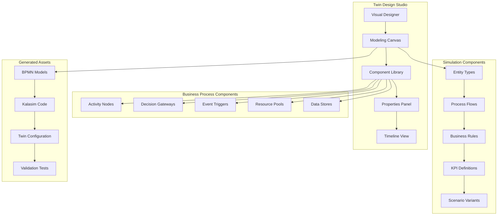
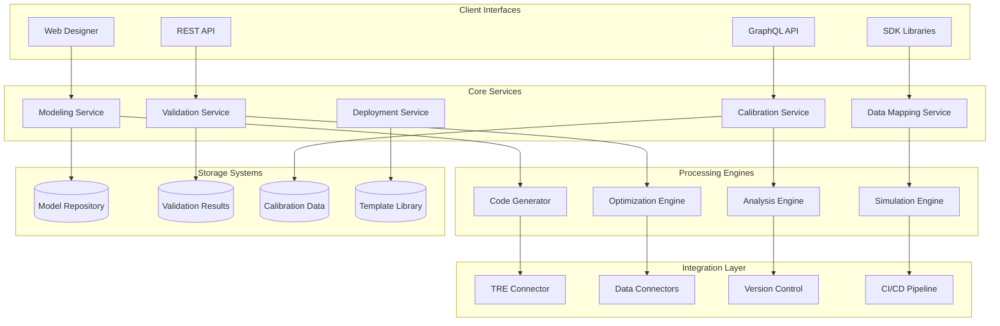

## Service Overview

The Twin Design Service (TDS) provides comprehensive design, modeling, and validation capabilities for digital twins within the AIMatrix ecosystem. TDS transforms business processes into executable simulation models, enabling sophisticated scenario planning, optimization, and predictive analytics. The service bridges the gap between business domain expertise and technical simulation implementation, offering visual modeling tools, automated data mapping, validation frameworks, and calibration services for digital twins deployed in the AMX Twin Runtime Environment (TRE). With multi-language support including Kotlin, Python, TypeScript, C#, and Java, TDS enables enterprise-grade twin development across diverse technology stacks with seamless integration into existing enterprise systems.

## Core Service Capabilities

### Digital Twin Modeling Studio

#### Visual Process Modeling



The TDS Visual Twin Modeling Studio provides an intuitive interface for creating digital twin specifications:

```typescript
// Twin Design Studio API
interface TwinDesignStudio {
    // Canvas management
    createTwinModel(projectId: string, twinType: TwinType): Promise<TwinModel>;
    loadTwinModel(modelId: string): Promise<TwinModel>;
    saveTwinModel(model: TwinModel): Promise<void>;
    
    // Component management
    addProcessNode(model: TwinModel, node: ProcessNode): Promise<void>;
    addResourcePool(model: TwinModel, resource: ResourcePool): Promise<void>;
    addDataFlow(model: TwinModel, flow: DataFlow): Promise<void>;
    addBusinessRule(model: TwinModel, rule: BusinessRule): Promise<void>;
    
    // Model generation
    generateSimulationModel(twinModel: TwinModel): Promise<SimulationModel>;
    generateKalasimCode(simulationModel: SimulationModel, language: "kotlin" | "python" | "typescript" | "csharp" | "java"): Promise<GeneratedCode>;
    validateTwinModel(model: TwinModel): Promise<ValidationResult>;
}

// Example supply chain twin design
class SupplyChainTwinDesigner {
    private studio: TwinDesignStudio;
    
    async designSupplyChainTwin(): Promise<TwinModel> {
        // Create new supply chain twin model
        const twinModel = await this.studio.createTwinModel(
            "supply-chain-optimization",
            TwinType.SUPPLY_CHAIN
        );
        
        // Define supplier entities
        const primarySupplier = await this.studio.addProcessNode(twinModel, {
            id: "primary_supplier",
            name: "Primary Component Supplier",
            type: ProcessNodeType.SUPPLIER,
            properties: {
                capacity: 10000,
                leadTimeDistribution: "triangular(5, 10, 21)", // days
                reliabilityScore: 0.95,
                qualityScore: 0.98,
                costPerUnit: 25.50,
                location: "Shanghai, China"
            },
            behaviors: [
                {
                    name: "production_planning",
                    frequency: "daily",
                    logic: "adjust_capacity_based_on_demand"
                },
                {
                    name: "quality_control",
                    frequency: "per_batch", 
                    logic: "random_quality_check"
                }
            ]
        });
        
        const secondarySupplier = await this.studio.addProcessNode(twinModel, {
            id: "secondary_supplier",
            name: "Alternative Supplier",
            type: ProcessNodeType.SUPPLIER,
            properties: {
                capacity: 5000,
                leadTimeDistribution: "normal(14, 3)",
                reliabilityScore: 0.88,
                qualityScore: 0.94,
                costPerUnit: 28.00,
                location: "Mexico City, Mexico"
            }
        });
        
        // Define manufacturing processes
        const assembly = await this.studio.addProcessNode(twinModel, {
            id: "assembly_process",
            name: "Product Assembly",
            type: ProcessNodeType.MANUFACTURING,
            properties: {
                processingTime: "exponential(120)", // minutes
                batchSize: 50,
                setupTime: 30,
                efficiency: 0.92,
                defectRate: 0.02
            },
            resources: [
                {
                    resourceId: "assembly_workers",
                    quantity: 5,
                    skillLevel: "intermediate"
                },
                {
                    resourceId: "assembly_line",
                    quantity: 1,
                    utilizationTarget: 0.85
                }
            ]
        });
        
        // Define distribution network
        const warehouse = await this.studio.addProcessNode(twinModel, {
            id: "main_warehouse",
            name: "Central Warehouse",
            type: ProcessNodeType.WAREHOUSE,
            properties: {
                capacity: 100000,
                pickingTime: "uniform(5, 15)", // minutes
                packingTime: "triangular(10, 15, 25)",
                inventoryPolicy: "min_max(1000, 5000)",
                storageCharges: 2.50 // per unit per month
            }
        });
        
        // Define resource pools
        await this.studio.addResourcePool(twinModel, {
            id: "assembly_workers",
            name: "Assembly Workers",
            capacity: 10,
            availability: {
                monday: "08:00-17:00",
                tuesday: "08:00-17:00", 
                wednesday: "08:00-17:00",
                thursday: "08:00-17:00",
                friday: "08:00-17:00"
            },
            shiftPattern: "single_shift",
            skillDistribution: {
                "novice": 0.2,
                "intermediate": 0.6,
                "expert": 0.2
            }
        });
        
        await this.studio.addResourcePool(twinModel, {
            id: "transportation_fleet",
            name: "Delivery Fleet",
            capacity: 15,
            properties: {
                vehicleType: "box_truck",
                capacityPerVehicle: 1000, // kg
                speedKmH: 60,
                costPerKm: 1.25,
                maintenanceSchedule: "weekly"
            }
        });
        
        // Define data flows between processes
        await this.studio.addDataFlow(twinModel, {
            id: "supplier_to_assembly",
            from: "primary_supplier",
            to: "assembly_process",
            dataType: "component_delivery",
            attributes: {
                quantity: "integer",
                qualityScore: "double",
                deliveryDate: "timestamp",
                batchId: "string"
            },
            frequency: "event_driven",
            latency: "real_time"
        });
        
        await this.studio.addDataFlow(twinModel, {
            id: "assembly_to_warehouse",
            from: "assembly_process",
            to: "main_warehouse",
            dataType: "finished_products",
            attributes: {
                productId: "string",
                quantity: "integer",
                completionDate: "timestamp",
                qualityGrade: "enum"
            }
        });
        
        // Define business rules
        await this.studio.addBusinessRule(twinModel, {
            id: "supplier_selection_rule",
            name: "Supplier Selection Logic",
            condition: "inventory_level < reorder_point",
            actions: [
                {
                    action: "select_supplier",
                    parameters: {
                        criteria: ["cost", "lead_time", "reliability"],
                        weights: [0.4, 0.3, 0.3]
                    }
                }
            ],
            priority: 1
        });
        
        await this.studio.addBusinessRule(twinModel, {
            id: "rush_order_rule",
            name: "Rush Order Processing",
            condition: "order_priority == 'urgent' && lead_time < required_date",
            actions: [
                {
                    action: "expedite_processing",
                    parameters: {
                        priority_multiplier: 2.0,
                        overtime_authorized: true
                    }
                }
            ]
        });
        
        // Generate implementation assets for all supported languages
        const implementations = await Promise.all([
            this.studio.generateKalasimCode(simulationModel, "kotlin"),
            this.studio.generateKalasimCode(simulationModel, "python"), 
            this.studio.generateKalasimCode(simulationModel, "typescript"),
            this.studio.generateKalasimCode(simulationModel, "csharp"),
            this.studio.generateKalasimCode(simulationModel, "java")
        ]);
        
        return { twinModel, implementations };
    }
}
```

### Process Simulation Design

#### Advanced Process Modeling Framework

```kotlin
// Process Simulation Designer
class ProcessSimulationDesigner(
    private val processAnalyzer: ProcessAnalyzer,
    private val optimizationEngine: OptimizationEngine,
    private val variabilityAnalyzer: VariabilityAnalyzer
) {
    
    suspend fun designProcessSimulation(
        businessProcess: BusinessProcess,
        objectives: List<OptimizationObjective>
    ): ProcessSimulationDesign {
        
        // Analyze process characteristics
        val processAnalysis = processAnalyzer.analyze(businessProcess)
        
        // Identify optimization opportunities
        val optimizationOpportunities = optimizationEngine.identifyOpportunities(
            process = businessProcess,
            currentPerformance = processAnalysis.currentMetrics,
            objectives = objectives
        )
        
        // Design simulation architecture
        val simulationDesign = ProcessSimulationDesign(
            processId = businessProcess.id,
            entities = designEntityTypes(businessProcess),
            resources = designResourcePools(businessProcess),
            activities = designActivities(businessProcess),
            flows = designProcessFlows(businessProcess),
            variability = designVariabilityModel(businessProcess),
            optimization = optimizationOpportunities
        )
        
        return simulationDesign
    }
    
    private suspend fun designEntityTypes(
        businessProcess: BusinessProcess
    ): List<EntityTypeDesign> {
        
        return businessProcess.entityTypes.map { entityType ->
            EntityTypeDesign(
                name = entityType.name,
                attributes = designEntityAttributes(entityType),
                lifecycle = designEntityLifecycle(entityType),
                behaviors = designEntityBehaviors(entityType),
                arrivalPattern = designArrivalPattern(entityType),
                batchingRules = designBatchingRules(entityType)
            )
        }
    }
    
    private fun designEntityAttributes(entityType: BusinessEntityType): List<AttributeDesign> {
        return entityType.attributes.map { attribute ->
            when (attribute.dataType) {
                AttributeDataType.NUMERIC -> {
                    NumericAttributeDesign(
                        name = attribute.name,
                        distributionType = inferDistribution(attribute),
                        range = inferRange(attribute),
                        correlations = identifyCorrelations(attribute)
                    )
                }
                
                AttributeDataType.CATEGORICAL -> {
                    CategoricalAttributeDesign(
                        name = attribute.name,
                        categories = inferCategories(attribute),
                        probabilities = inferProbabilities(attribute),
                        dependencies = identifyDependencies(attribute)
                    )
                }
                
                AttributeDataType.TEMPORAL -> {
                    TemporalAttributeDesign(
                        name = attribute.name,
                        timePattern = inferTimePattern(attribute),
                        seasonality = identifySeasonality(attribute),
                        trends = identifyTrends(attribute)
                    )
                }
                
                AttributeDataType.BOOLEAN -> {
                    BooleanAttributeDesign(
                        name = attribute.name,
                        probability = inferProbability(attribute),
                        conditions = identifyConditions(attribute)
                    )
                }
            }
        }
    }
    
    private suspend fun designResourcePools(
        businessProcess: BusinessProcess
    ): List<ResourcePoolDesign> {
        
        return businessProcess.resources.map { resource ->
            ResourcePoolDesign(
                id = resource.id,
                name = resource.name,
                capacity = designCapacityModel(resource),
                availability = designAvailabilityModel(resource),
                skills = designSkillModel(resource),
                scheduling = designSchedulingPolicy(resource),
                costs = designCostModel(resource),
                maintenance = designMaintenanceModel(resource)
            )
        }
    }
    
    private fun designCapacityModel(resource: BusinessResource): CapacityModel {
        return CapacityModel(
            baseCapacity = resource.baseCapacity,
            scalingRules = listOf(
                ScalingRule(
                    trigger = "utilization > 0.8",
                    action = "increase_capacity(10%)",
                    conditions = listOf("budget_available", "staff_available")
                ),
                ScalingRule(
                    trigger = "utilization < 0.4",
                    action = "decrease_capacity(5%)",
                    conditions = listOf("min_capacity_maintained")
                )
            ),
            temporalVariations = identifyTemporalCapacityPatterns(resource),
            constraints = resource.constraints
        )
    }
    
    private suspend fun designProcessFlows(
        businessProcess: BusinessProcess
    ): List<ProcessFlowDesign> {
        
        return businessProcess.flows.map { flow ->
            ProcessFlowDesign(
                id = flow.id,
                name = flow.name,
                routingLogic = designRoutingLogic(flow),
                processingTime = designProcessingTimeModel(flow),
                batchingRules = designFlowBatchingRules(flow),
                prioritization = designPriorityRules(flow),
                exceptionHandling = designExceptionHandling(flow),
                qualityControl = designQualityControlPoints(flow)
            )
        }
    }
    
    private fun designRoutingLogic(flow: BusinessFlow): RoutingLogic {
        return when (flow.routingType) {
            FlowRoutingType.SEQUENTIAL -> {
                SequentialRoutingLogic(
                    steps = flow.steps.map { step ->
                        SequentialStep(
                            id = step.id,
                            condition = step.condition,
                            processingLogic = step.logic
                        )
                    }
                )
            }
            
            FlowRoutingType.PARALLEL -> {
                ParallelRoutingLogic(
                    parallelBranches = flow.branches.map { branch ->
                        ParallelBranch(
                            id = branch.id,
                            condition = branch.condition,
                            synchronizationPoint = branch.syncPoint
                        )
                    },
                    joinLogic = flow.joinLogic
                )
            }
            
            FlowRoutingType.CONDITIONAL -> {
                ConditionalRoutingLogic(
                    decisions = flow.decisionPoints.map { decision ->
                        DecisionPoint(
                            condition = decision.condition,
                            trueRoute = decision.trueRoute,
                            falseRoute = decision.falseRoute,
                            probability = estimateDecisionProbability(decision)
                        )
                    }
                )
            }
        }
    }
}

// Kalasim Code Generation from Process Design
class KalasimCodeGenerator {
    
    fun generateSimulationCode(
        simulationDesign: ProcessSimulationDesign
    ): KalasimSimulationCode {
        
        return KalasimSimulationCode(
            packageName = "com.aimatrix.twins.${simulationDesign.processId}",
            imports = generateImports(),
            entityClasses = generateEntityClasses(simulationDesign.entities),
            resourceDefinitions = generateResourceDefinitions(simulationDesign.resources),
            processDefinitions = generateProcessDefinitions(simulationDesign.activities),
            mainSimulation = generateMainSimulation(simulationDesign)
        )
    }
    
    private fun generateMainSimulation(design: ProcessSimulationDesign): String {
        return """
            fun main() {
                simulation("${design.processId}_simulation") {
                    // Initialize resources
                    ${design.resources.joinToString("\n                    ") { generateResourceInitialization(it) }}
                    
                    // Define entity generators
                    ${design.entities.joinToString("\n                    ") { generateEntityGenerator(it) }}
                    
                    // Set up process flows
                    ${design.flows.joinToString("\n                    ") { generateProcessFlow(it) }}
                    
                    // Configure monitoring
                    monitor {
                        ${generateKPICollectors(design.kpis)}
                    }
                    
                    // Run simulation
                    run(${design.simulationDuration})
                }
            }
        """.trimIndent()
    }
    
    private fun generateEntityGenerator(entity: EntityTypeDesign): String {
        return when (entity.arrivalPattern.type) {
            ArrivalPatternType.EXPONENTIAL -> {
                """
                exponential(${entity.arrivalPattern.rate}) {
                    ${entity.name}().apply {
                        ${entity.attributes.joinToString("\n                        ") { generateAttributeInitialization(it) }}
                        
                        // Entity lifecycle
                        ${generateEntityLifecycle(entity.lifecycle)}
                    }
                }
                """.trimIndent()
            }
            
            ArrivalPatternType.POISSON -> {
                """
                poisson(${entity.arrivalPattern.rate}) {
                    ${entity.name}().apply {
                        ${entity.attributes.joinToString("\n                        ") { generateAttributeInitialization(it) }}
                    }
                }
                """.trimIndent()
            }
            
            ArrivalPatternType.BATCH -> {
                """
                batchArrival(
                    batchSize = ${entity.arrivalPattern.batchSize},
                    interBatchTime = ${entity.arrivalPattern.interBatchTime}
                ) {
                    ${entity.name}().apply {
                        ${entity.attributes.joinToString("\n                        ") { generateAttributeInitialization(it) }}
                    }
                }
                """.trimIndent()
            }
        }
    }
    
    private fun generateProcessFlow(flow: ProcessFlowDesign): String {
        return """
            process("${flow.name}") {
                ${generateFlowLogic(flow)}
            }
        """.trimIndent()
    }
    
    private fun generateFlowLogic(flow: ProcessFlowDesign): String {
        return when (flow.routingLogic) {
            is SequentialRoutingLogic -> {
                flow.routingLogic.steps.joinToString("\n                ") { step ->
                    """
                    // ${step.id}
                    ${generateProcessingStep(step)}
                    """.trimIndent()
                }
            }
            
            is ParallelRoutingLogic -> {
                """
                parallel(
                    ${flow.routingLogic.parallelBranches.joinToString(",\n                    ") { branch ->
                        "{ ${generateBranchLogic(branch)} }"
                    }}
                )
                """.trimIndent()
            }
            
            is ConditionalRoutingLogic -> {
                flow.routingLogic.decisions.joinToString("\n                ") { decision ->
                    """
                    if (${decision.condition}) {
                        ${generateRouteLogic(decision.trueRoute)}
                    } else {
                        ${generateRouteLogic(decision.falseRoute)}
                    }
                    """.trimIndent()
                }
            }
        }
    }
}
```

### Data Mapping and Integration

#### Automated Data Source Mapping

```kotlin
// Data Mapping Service
class DataMappingService(
    private val schemaAnalyzer: SchemaAnalyzer,
    private val mappingGenerator: MappingGenerator,
    private val transformationEngine: DataTransformationEngine
) {
    
    suspend fun createDataMappingPlan(
        twinModel: TwinModel,
        dataSources: List<DataSource>
    ): DataMappingPlan {
        
        // Analyze twin data requirements
        val twinDataRequirements = analyzeTwinDataRequirements(twinModel)
        
        // Analyze data source schemas
        val sourceSchemas = dataSources.map { source ->
            schemaAnalyzer.analyzeSchema(source)
        }
        
        // Generate mapping suggestions
        val mappingSuggestions = mappingGenerator.generateMappings(
            requirements = twinDataRequirements,
            sources = sourceSchemas
        )
        
        // Validate mappings
        val validationResults = validateMappings(mappingSuggestions)
        
        return DataMappingPlan(
            twinId = twinModel.id,
            requirements = twinDataRequirements,
            sources = sourceSchemas,
            mappings = mappingSuggestions,
            validation = validationResults,
            transformations = generateTransformations(mappingSuggestions)
        )
    }
    
    private suspend fun analyzeTwinDataRequirements(
        twinModel: TwinModel
    ): TwinDataRequirements {
        
        val entityRequirements = twinModel.entities.map { entity ->
            EntityDataRequirement(
                entityType = entity.type,
                requiredAttributes = entity.attributes.map { attr ->
                    AttributeRequirement(
                        name = attr.name,
                        dataType = attr.dataType,
                        required = attr.required,
                        constraints = attr.constraints,
                        updateFrequency = attr.updateFrequency
                    )
                },
                identificationKeys = entity.identificationKeys,
                relationships = entity.relationships
            )
        }
        
        val processRequirements = twinModel.processes.map { process ->
            ProcessDataRequirement(
                processId = process.id,
                inputData = process.inputs.map { input ->
                    DataRequirement(
                        name = input.name,
                        type = input.type,
                        source = input.expectedSource,
                        frequency = input.requiredFrequency
                    )
                },
                outputData = process.outputs.map { output ->
                    DataRequirement(
                        name = output.name,
                        type = output.type,
                        destination = output.destination,
                        frequency = output.frequency
                    )
                },
                triggerEvents = process.triggerEvents
            )
        }
        
        return TwinDataRequirements(
            entities = entityRequirements,
            processes = processRequirements,
            kpis = twinModel.kpis.map { kpi ->
                KPIDataRequirement(
                    name = kpi.name,
                    formula = kpi.formula,
                    requiredInputs = kpi.requiredInputs,
                    calculationFrequency = kpi.calculationFrequency
                )
            }
        )
    }
    
    private suspend fun generateTransformations(
        mappings: List<DataMapping>
    ): List<DataTransformation> {
        
        return mappings.map { mapping ->
            DataTransformation(
                id = generateTransformationId(mapping),
                sourceField = mapping.sourceField,
                targetField = mapping.targetField,
                transformationType = determineTransformationType(mapping),
                transformationLogic = generateTransformationLogic(mapping),
                validationRules = generateValidationRules(mapping)
            )
        }
    }
    
    private fun generateTransformationLogic(mapping: DataMapping): TransformationLogic {
        return when (mapping.transformationType) {
            TransformationType.DIRECT_COPY -> {
                DirectCopyTransformation(
                    sourceField = mapping.sourceField.name,
                    targetField = mapping.targetField.name
                )
            }
            
            TransformationType.TYPE_CONVERSION -> {
                TypeConversionTransformation(
                    sourceType = mapping.sourceField.dataType,
                    targetType = mapping.targetField.dataType,
                    conversionRules = generateConversionRules(mapping)
                )
            }
            
            TransformationType.AGGREGATION -> {
                AggregationTransformation(
                    sourceFields = mapping.sourceFields,
                    targetField = mapping.targetField.name,
                    aggregationFunction = determineAggregationFunction(mapping),
                    groupByFields = mapping.groupByFields
                )
            }
            
            TransformationType.LOOKUP -> {
                LookupTransformation(
                    sourceField = mapping.sourceField.name,
                    lookupTable = mapping.lookupTable,
                    lookupKey = mapping.lookupKey,
                    defaultValue = mapping.defaultValue
                )
            }
            
            TransformationType.CALCULATED -> {
                CalculatedTransformation(
                    inputFields = mapping.sourceFields,
                    targetField = mapping.targetField.name,
                    calculationFormula = mapping.calculationFormula,
                    parameters = mapping.calculationParameters
                )
            }
        }
    }
}

// Real-time Data Synchronization Framework
class RealTimeDataSynchronizer(
    private val streamProcessors: Map<String, StreamProcessor>,
    private val eventBus: EventBus,
    private val stateManager: TwinStateManager
) {
    
    suspend fun setupRealTimeSync(
        twinId: String,
        syncConfiguration: DataSyncConfiguration
    ): SyncSession {
        
        val syncSession = SyncSession(
            id = generateSessionId(),
            twinId = twinId,
            configuration = syncConfiguration,
            startTime = Instant.now()
        )
        
        // Initialize data stream subscriptions
        val subscriptions = syncConfiguration.dataSources.map { source ->
            async {
                setupDataSourceSubscription(source, syncSession)
            }
        }.awaitAll()
        
        // Start real-time processing
        startRealTimeProcessing(syncSession, subscriptions)
        
        return syncSession
    }
    
    private suspend fun setupDataSourceSubscription(
        source: DataSourceConfig,
        session: SyncSession
    ): DataSubscription {
        
        val processor = streamProcessors[source.type]
            ?: throw IllegalArgumentException("No processor for source type: ${source.type}")
        
        val subscription = when (source.type) {
            "kafka" -> setupKafkaSubscription(processor, source, session)
            "database_cdc" -> setupCDCSubscription(processor, source, session)
            "rest_api" -> setupAPIPollingSubscription(processor, source, session)
            "websocket" -> setupWebSocketSubscription(processor, source, session)
            "file_watcher" -> setupFileWatcherSubscription(processor, source, session)
            else -> throw UnsupportedOperationException("Unsupported source type: ${source.type}")
        }
        
        return subscription
    }
    
    private suspend fun startRealTimeProcessing(
        session: SyncSession,
        subscriptions: List<DataSubscription>
    ) {
        
        // Create processing pipeline for each subscription
        subscriptions.forEach { subscription ->
            launchDataProcessingPipeline(subscription, session)
        }
        
        // Monitor synchronization health
        launchSyncHealthMonitoring(session)
    }
    
    private fun launchDataProcessingPipeline(
        subscription: DataSubscription,
        session: SyncSession
    ) {
        
        GlobalScope.launch {
            subscription.dataStream.collect { dataEvent ->
                try {
                    // Apply data transformations
                    val transformedData = applyTransformations(
                        data = dataEvent,
                        transformations = subscription.transformations
                    )
                    
                    // Update twin state
                    stateManager.updateTwinState(
                        twinId = session.twinId,
                        update = transformedData
                    )
                    
                    // Publish update event
                    eventBus.publish(
                        TwinDataUpdatedEvent(
                            twinId = session.twinId,
                            sourceId = subscription.sourceId,
                            data = transformedData,
                            timestamp = Instant.now()
                        )
                    )
                    
                } catch (e: Exception) {
                    handleProcessingError(e, dataEvent, subscription, session)
                }
            }
        }
    }
}
```

### Validation Frameworks

#### Comprehensive Twin Validation System

```kotlin
// Twin Validation Framework
class TwinValidationFramework(
    private val modelValidator: ModelValidator,
    private val dataValidator: DataValidator,
    private val behaviorValidator: BehaviorValidator,
    private val performanceValidator: PerformanceValidator
) {
    
    suspend fun validateTwin(
        twinModel: TwinModel,
        validationLevel: ValidationLevel = ValidationLevel.COMPREHENSIVE
    ): TwinValidationReport {
        
        val validationTasks = mutableListOf<Deferred<ValidationResult>>()
        
        // Model structure validation
        validationTasks.add(
            async {
                modelValidator.validateModelStructure(twinModel)
            }
        )
        
        // Data consistency validation
        if (validationLevel >= ValidationLevel.DATA_CONSISTENCY) {
            validationTasks.add(
                async {
                    dataValidator.validateDataConsistency(twinModel)
                }
            )
        }
        
        // Behavior validation
        if (validationLevel >= ValidationLevel.BEHAVIOR) {
            validationTasks.add(
                async {
                    behaviorValidator.validateBehaviors(twinModel)
                }
            )
        }
        
        // Performance validation
        if (validationLevel >= ValidationLevel.COMPREHENSIVE) {
            validationTasks.add(
                async {
                    performanceValidator.validatePerformanceCharacteristics(twinModel)
                }
            )
        }
        
        // Execute all validations
        val results = validationTasks.awaitAll()
        
        // Aggregate results
        return TwinValidationReport(
            twinId = twinModel.id,
            validationLevel = validationLevel,
            overallResult = aggregateValidationResults(results),
            detailedResults = results,
            recommendations = generateValidationRecommendations(results),
            validatedAt = Instant.now()
        )
    }
    
    suspend fun validateAgainstRealData(
        twinModel: TwinModel,
        referenceData: ReferenceDataSet,
        validationPeriod: Duration
    ): RealDataValidationReport {
        
        // Run twin simulation with reference inputs
        val simulationResults = runValidationSimulation(twinModel, referenceData, validationPeriod)
        
        // Compare simulation outputs with actual outcomes
        val comparisons = compareSimulationWithReality(simulationResults, referenceData)
        
        // Calculate accuracy metrics
        val accuracyMetrics = calculateAccuracyMetrics(comparisons)
        
        // Identify discrepancies
        val discrepancies = identifyDiscrepancies(comparisons, accuracyMetrics)
        
        // Generate calibration recommendations
        val calibrationRecommendations = generateCalibrationRecommendations(discrepancies)
        
        return RealDataValidationReport(
            twinId = twinModel.id,
            referenceDataSet = referenceData.id,
            validationPeriod = validationPeriod,
            accuracyMetrics = accuracyMetrics,
            discrepancies = discrepancies,
            calibrationRecommendations = calibrationRecommendations,
            overallAccuracy = accuracyMetrics.overallAccuracy
        )
    }
}

// Model Structure Validator
class ModelValidator {
    
    suspend fun validateModelStructure(twinModel: TwinModel): ValidationResult {
        val issues = mutableListOf<ValidationIssue>()
        
        // Validate entity definitions
        twinModel.entities.forEach { entity ->
            validateEntityDefinition(entity)?.let { issues.add(it) }
        }
        
        // Validate process flows
        twinModel.processes.forEach { process ->
            validateProcessDefinition(process)?.let { issues.add(it) }
        }
        
        // Validate resource definitions
        twinModel.resources.forEach { resource ->
            validateResourceDefinition(resource)?.let { issues.add(it) }
        }
        
        // Validate data flows
        twinModel.dataFlows.forEach { dataFlow ->
            validateDataFlowDefinition(dataFlow, twinModel)?.let { issues.add(it) }
        }
        
        // Validate KPI definitions
        twinModel.kpis.forEach { kpi ->
            validateKPIDefinition(kpi, twinModel)?.let { issues.add(it) }
        }
        
        return ValidationResult(
            category = ValidationCategory.MODEL_STRUCTURE,
            passed = issues.isEmpty(),
            issues = issues,
            recommendations = generateStructureRecommendations(issues)
        )
    }
    
    private fun validateEntityDefinition(entity: EntityDefinition): ValidationIssue? {
        // Validate required attributes
        if (entity.attributes.none { it.required }) {
            return ValidationIssue(
                severity = IssueSeverity.WARNING,
                category = "Entity Definition",
                message = "Entity '${entity.name}' has no required attributes",
                suggestion = "Consider marking key business attributes as required"
            )
        }
        
        // Validate attribute data types
        entity.attributes.forEach { attribute ->
            if (attribute.dataType == AttributeDataType.UNKNOWN) {
                return ValidationIssue(
                    severity = IssueSeverity.ERROR,
                    category = "Entity Definition",
                    message = "Attribute '${attribute.name}' has unknown data type",
                    suggestion = "Specify a valid data type for the attribute"
                )
            }
        }
        
        // Validate lifecycle definition
        if (entity.lifecycle.states.isEmpty()) {
            return ValidationIssue(
                severity = IssueSeverity.WARNING,
                category = "Entity Definition",
                message = "Entity '${entity.name}' has no defined lifecycle states",
                suggestion = "Define lifecycle states for better simulation accuracy"
            )
        }
        
        return null
    }
    
    private fun validateProcessDefinition(process: ProcessDefinition): ValidationIssue? {
        // Validate process flow connectivity
        val unreachableActivities = findUnreachableActivities(process)
        if (unreachableActivities.isNotEmpty()) {
            return ValidationIssue(
                severity = IssueSeverity.ERROR,
                category = "Process Definition",
                message = "Process '${process.name}' has unreachable activities: ${unreachableActivities.joinToString()}",
                suggestion = "Ensure all activities are connected in the process flow"
            )
        }
        
        // Validate resource requirements
        process.activities.forEach { activity ->
            if (activity.resourceRequirements.isEmpty() && activity.processingTime == null) {
                return ValidationIssue(
                    severity = IssueSeverity.WARNING,
                    category = "Process Definition",
                    message = "Activity '${activity.name}' has no resource requirements or processing time",
                    suggestion = "Define resource requirements or processing time for realistic simulation"
                )
            }
        }
        
        return null
    }
}

// Behavior Validator
class BehaviorValidator {
    
    suspend fun validateBehaviors(twinModel: TwinModel): ValidationResult {
        val issues = mutableListOf<ValidationIssue>()
        
        // Validate entity behaviors
        twinModel.entities.forEach { entity ->
            entity.behaviors.forEach { behavior ->
                validateEntityBehavior(behavior, entity)?.let { issues.add(it) }
            }
        }
        
        // Validate process behaviors
        twinModel.processes.forEach { process ->
            validateProcessBehavior(process)?.let { issues.add(it) }
        }
        
        // Run behavior simulation tests
        val simulationTestResults = runBehaviorSimulationTests(twinModel)
        issues.addAll(simulationTestResults.issues)
        
        return ValidationResult(
            category = ValidationCategory.BEHAVIOR,
            passed = issues.isEmpty(),
            issues = issues,
            recommendations = generateBehaviorRecommendations(issues)
        )
    }
    
    private suspend fun runBehaviorSimulationTests(
        twinModel: TwinModel
    ): BehaviorTestResults {
        
        val testResults = mutableListOf<BehaviorTestResult>()
        val issues = mutableListOf<ValidationIssue>()
        
        // Test 1: Basic functionality
        val basicTest = runBasicBehaviorTest(twinModel)
        testResults.add(basicTest)
        if (!basicTest.passed) {
            issues.add(
                ValidationIssue(
                    severity = IssueSeverity.ERROR,
                    category = "Behavior Validation",
                    message = "Basic behavior test failed: ${basicTest.errorMessage}",
                    suggestion = "Check entity and process behavior definitions"
                )
            )
        }
        
        // Test 2: Stress testing
        val stressTest = runStressBehaviorTest(twinModel)
        testResults.add(stressTest)
        if (!stressTest.passed) {
            issues.add(
                ValidationIssue(
                    severity = IssueSeverity.WARNING,
                    category = "Behavior Validation",
                    message = "Stress test revealed behavior issues: ${stressTest.errorMessage}",
                    suggestion = "Review behavior logic for edge cases and high-load scenarios"
                )
            )
        }
        
        // Test 3: Boundary conditions
        val boundaryTest = runBoundaryBehaviorTest(twinModel)
        testResults.add(boundaryTest)
        if (!boundaryTest.passed) {
            issues.add(
                ValidationIssue(
                    severity = IssueSeverity.WARNING,
                    category = "Behavior Validation",
                    message = "Boundary condition test failed: ${boundaryTest.errorMessage}",
                    suggestion = "Add boundary condition handling in behavior logic"
                )
            )
        }
        
        return BehaviorTestResults(
            tests = testResults,
            issues = issues,
            overallPassed = issues.none { it.severity == IssueSeverity.ERROR }
        )
    }
}
```

#### C# Supply Chain Twin with Enterprise Integration

```csharp
// Enterprise Supply Chain Digital Twin with C# and SQL Server integration
using AIMatrix.TDS;
using AIMatrix.Enterprise;
using Microsoft.Extensions.DependencyInjection;
using Microsoft.Extensions.Logging;
using Microsoft.EntityFrameworkCore;
using System;
using System.Collections.Generic;
using System.Linq;
using System.Threading.Tasks;
using System.ComponentModel.DataAnnotations;

namespace AIMatrix.Enterprise.Twins
{
    /// <summary>
    /// Enterprise Supply Chain Twin with real-time ERP integration,
    /// SQL Server data persistence, and Azure analytics.
    /// </summary>
    [DigitalTwin("SupplyChainTwin")]
    [EnterpriseCompliant(ComplianceStandards.SOX | ComplianceStandards.ISO27001)]
    public class EnterpriseSupplyChainTwin : DigitalTwinBase
    {
        private readonly ILogger<EnterpriseSupplyChainTwin> _logger;
        private readonly ISupplierRepository _supplierRepository;
        private readonly IERPIntegrationService _erpService;
        private readonly IAzureAnalyticsService _analyticsService;
        private readonly ISimulationEngine _simulationEngine;

        // Twin Configuration with Enterprise Features
        [Required]
        public List<SupplierConfiguration> Suppliers { get; set; } = new();
        
        [Required]
        public List<ManufacturingProcess> Processes { get; set; } = new();
        
        [Required]
        public DistributionNetwork DistributionNetwork { get; set; } = new();
        
        public bool EnableRealTimeERPSync { get; set; } = true;
        public bool EnableAzureAnalytics { get; set; } = true;
        public string SqlServerConnectionString { get; set; } = string.Empty;
        public TimeSpan SimulationTimeHorizon { get; set; } = TimeSpan.FromDays(90);

        // Simulation State Management
        public SimulationState CurrentSimulationState { get; private set; } = SimulationState.Idle;
        public DateTime LastERPSync { get; private set; }
        public Dictionary<string, object> RealTimeMetrics { get; private set; } = new();

        public enum SimulationState
        {
            Idle,
            InitializingData,
            RunningSimulation,
            AnalyzingResults,
            SyncingWithERP,
            CompletedSuccessfully,
            Error
        }

        public EnterpriseSupplyChainTwin(
            IServiceProvider serviceProvider,
            ILogger<EnterpriseSupplyChainTwin> logger,
            ISupplierRepository supplierRepository,
            IERPIntegrationService erpService,
            IAzureAnalyticsService analyticsService,
            ISimulationEngine simulationEngine)
            : base(serviceProvider)
        {
            _logger = logger ?? throw new ArgumentNullException(nameof(logger));
            _supplierRepository = supplierRepository ?? throw new ArgumentNullException(nameof(supplierRepository));
            _erpService = erpService ?? throw new ArgumentNullException(nameof(erpService));
            _analyticsService = analyticsService ?? throw new ArgumentNullException(nameof(analyticsService));
            _simulationEngine = simulationEngine ?? throw new ArgumentNullException(nameof(simulationEngine));
        }

        protected override async Task InitializeAsync()
        {
            _logger.LogInformation("Initializing Enterprise Supply Chain Twin");

            try
            {
                await TransitionStateAsync(SimulationState.InitializingData);

                // Validate configuration using data annotations
                var validationResults = new List<ValidationResult>();
                var validationContext = new ValidationContext(this);
                if (!Validator.TryValidateObject(this, validationContext, validationResults, true))
                {
                    var errors = string.Join(", ", validationResults.Select(r => r.ErrorMessage));
                    throw new InvalidOperationException($"Twin configuration validation failed: {errors}");
                }

                // Initialize SQL Server connections and Entity Framework context
                if (EnableRealTimeERPSync && !string.IsNullOrEmpty(SqlServerConnectionString))
                {
                    await InitializeERPIntegrationAsync();
                }

                // Load supplier data from enterprise systems
                await LoadSupplierDataAsync();

                // Initialize Azure analytics if enabled
                if (EnableAzureAnalytics)
                {
                    await _analyticsService.InitializeAsync(this.GetType().Name);
                }

                // Set up real-time data synchronization
                await SetupRealTimeDataSyncAsync();

                await TransitionStateAsync(SimulationState.Idle);
                _logger.LogInformation("Enterprise Supply Chain Twin initialization completed");
            }
            catch (Exception ex)
            {
                _logger.LogError(ex, "Failed to initialize Enterprise Supply Chain Twin");
                await TransitionStateAsync(SimulationState.Error);
                throw;
            }
        }

        public async Task<SupplyChainSimulationResult> RunSupplyChainSimulationAsync(
            SupplyChainScenario scenario)
        {
            var simulationId = Guid.NewGuid();
            _logger.LogInformation($"Starting supply chain simulation {simulationId} with scenario: {scenario.Name}");

            try
            {
                await TransitionStateAsync(SimulationState.RunningSimulation);

                // Sync with ERP systems for latest data
                if (EnableRealTimeERPSync)
                {
                    await TransitionStateAsync(SimulationState.SyncingWithERP);
                    await SyncWithERPSystemsAsync();
                    LastERPSync = DateTime.UtcNow;
                }

                await TransitionStateAsync(SimulationState.RunningSimulation);

                // Create simulation model from current configuration
                var simulationModel = await BuildSimulationModelAsync(scenario);

                // Run discrete event simulation using Kalasim integration
                var simulationResults = await _simulationEngine.RunSimulationAsync(new SimulationRequest
                {
                    SimulationId = simulationId,
                    Model = simulationModel,
                    TimeHorizon = SimulationTimeHorizon,
                    ReplicationCount = scenario.ReplicationCount ?? 10,
                    WarmupPeriod = scenario.WarmupPeriod ?? TimeSpan.FromDays(7),
                    RandomSeed = scenario.RandomSeed,
                    OutputMetrics = scenario.RequestedMetrics ?? GetDefaultMetrics()
                });

                await TransitionStateAsync(SimulationState.AnalyzingResults);

                // Analyze results with Azure Machine Learning if enabled
                var analysisResults = EnableAzureAnalytics 
                    ? await _analyticsService.AnalyzeSimulationResultsAsync(simulationResults)
                    : new AnalysisResult { Message = "Azure Analytics disabled" };

                // Generate optimization recommendations using LINQ and pattern matching
                var recommendations = await GenerateOptimizationRecommendationsAsync(
                    simulationResults, analysisResults, scenario);

                // Store results in SQL Server for enterprise reporting
                await StoreSimulationResultsAsync(simulationId, simulationResults, analysisResults, recommendations);

                await TransitionStateAsync(SimulationState.CompletedSuccessfully);

                var result = new SupplyChainSimulationResult
                {
                    SimulationId = simulationId,
                    Scenario = scenario,
                    SimulationResults = simulationResults,
                    AnalysisResults = analysisResults,
                    OptimizationRecommendations = recommendations,
                    ExecutionTime = simulationResults.TotalExecutionTime,
                    CompletedAt = DateTime.UtcNow,
                    ERPDataTimestamp = LastERPSync
                };

                // Send real-time notification via SignalR
                await NotifySimulationCompletionAsync(result);

                return result;
            }
            catch (Exception ex)
            {
                _logger.LogError(ex, $"Supply chain simulation {simulationId} failed");
                await TransitionStateAsync(SimulationState.Error);
                throw new SimulationException($"Simulation failed: {ex.Message}", ex, simulationId);
            }
        }

        private async Task<SimulationModel> BuildSimulationModelAsync(SupplyChainScenario scenario)
        {
            var model = new SimulationModel
            {
                Name = $"SupplyChain_{scenario.Name}_{DateTime.UtcNow:yyyyMMdd}",
                TimeUnit = TimeUnit.Days,
                RandomSeed = scenario.RandomSeed ?? Random.Shared.Next()
            };

            // Build supplier entities with real-time data
            model.Entities.AddRange(
                from supplier in Suppliers
                join realtimeData in await GetRealTimeSupplierDataAsync() 
                on supplier.SupplierId equals realtimeData.SupplierId into supplierGroup
                from supplierData in supplierGroup.DefaultIfEmpty()
                select new SupplierEntity
                {
                    Id = supplier.SupplierId,
                    Name = supplier.Name,
                    Capacity = supplierData?.CurrentCapacity ?? supplier.BaseCapacity,
                    LeadTime = CreateDistribution(supplier.LeadTimeDistribution),
                    ReliabilityScore = supplierData?.CurrentReliability ?? supplier.BaseReliability,
                    Location = supplier.Location,
                    CostPerUnit = supplierData?.CurrentCostPerUnit ?? supplier.BaseCostPerUnit,
                    QualityScore = supplierData?.CurrentQuality ?? supplier.BaseQuality
                });

            // Build manufacturing processes with current utilization
            model.Processes.AddRange(
                from process in Processes
                select new ProcessEntity
                {
                    Id = process.ProcessId,
                    Name = process.Name,
                    ProcessingTime = CreateDistribution(process.ProcessingTimeDistribution),
                    BatchSize = process.BatchSize,
                    SetupTime = process.SetupTime,
                    Efficiency = process.CurrentEfficiency,
                    DefectRate = process.CurrentDefectRate,
                    Resources = process.RequiredResources.Select(r => new ResourceRequirement
                    {
                        ResourceId = r.ResourceId,
                        Quantity = r.Quantity,
                        SkillLevel = r.SkillLevel
                    }).ToList()
                });

            // Apply scenario-specific modifications using pattern matching
            ApplyScenarioModifications(model, scenario);

            return model;
        }

        private void ApplyScenarioModifications(SimulationModel model, SupplyChainScenario scenario)
        {
            // Use C# pattern matching for scenario handling
            foreach (var modification in scenario.Modifications)
            {
                switch (modification)
                {
                    case SupplierDisruptionModification disruption:
                        ApplySupplierDisruption(model, disruption);
                        break;
                    
                    case DemandChangeModification demandChange:
                        ApplyDemandChange(model, demandChange);
                        break;
                    
                    case CapacityModification capacityMod:
                        ApplyCapacityChange(model, capacityMod);
                        break;
                    
                    case QualityImprovementModification qualityMod:
                        ApplyQualityImprovement(model, qualityMod);
                        break;
                    
                    default:
                        _logger.LogWarning($"Unknown scenario modification type: {modification.GetType().Name}");
                        break;
                }
            }
        }

        private async Task<List<OptimizationRecommendation>> GenerateOptimizationRecommendationsAsync(
            SimulationResults simulationResults,
            AnalysisResult analysisResults,
            SupplyChainScenario scenario)
        {
            var recommendations = new List<OptimizationRecommendation>();

            // Analyze bottlenecks using LINQ queries on simulation data
            var bottlenecks = simulationResults.ResourceUtilization
                .Where(r => r.AverageUtilization > 0.85)
                .OrderByDescending(r => r.AverageUtilization)
                .Take(5)
                .ToList();

            foreach (var bottleneck in bottlenecks)
            {
                recommendations.Add(new OptimizationRecommendation
                {
                    Type = RecommendationType.CapacityIncrease,
                    Priority = bottleneck.AverageUtilization > 0.95 ? Priority.High : Priority.Medium,
                    ResourceId = bottleneck.ResourceId,
                    Description = $"Resource '{bottleneck.ResourceId}' showing {bottleneck.AverageUtilization:P1} utilization",
                    SuggestedActions = new[]
                    {
                        $"Increase capacity by {Math.Ceiling((bottleneck.AverageUtilization - 0.8) * 100)}%",
                        "Add parallel processing capability",
                        "Implement load balancing strategies"
                    },
                    EstimatedImpact = new ImpactEstimate
                    {
                        ThroughputIncrease = (bottleneck.AverageUtilization - 0.8) * 0.5,
                        CostIncrease = EstimateCapacityIncreaseCost(bottleneck.ResourceId, bottleneck.AverageUtilization),
                        ImplementationTimeWeeks = 4
                    }
                });
            }

            // Analyze supplier performance
            var underperformingSuppliers = simulationResults.SupplierPerformance
                .Where(s => s.DeliveryReliability < 0.9 || s.QualityScore < 0.95)
                .OrderBy(s => s.DeliveryReliability * s.QualityScore)
                .ToList();

            foreach (var supplier in underperformingSuppliers)
            {
                recommendations.Add(new OptimizationRecommendation
                {
                    Type = RecommendationType.SupplierImprovement,
                    Priority = supplier.DeliveryReliability < 0.8 ? Priority.High : Priority.Medium,
                    ResourceId = supplier.SupplierId,
                    Description = $"Supplier '{supplier.SupplierName}' reliability: {supplier.DeliveryReliability:P1}, quality: {supplier.QualityScore:P1}",
                    SuggestedActions = supplier.DeliveryReliability < 0.8 
                        ? new[] { "Consider alternative suppliers", "Implement supplier development program", "Add backup suppliers" }
                        : new[] { "Implement quality improvement program", "Increase quality inspections", "Provide supplier training" }
                });
            }

            // Use Azure ML for advanced recommendations if enabled
            if (EnableAzureAnalytics && analysisResults.MLRecommendations != null)
            {
                recommendations.AddRange(analysisResults.MLRecommendations.Select(mlRec => 
                    new OptimizationRecommendation
                    {
                        Type = RecommendationType.MLGenerated,
                        Priority = mlRec.Confidence > 0.8 ? Priority.High : Priority.Low,
                        Description = mlRec.Description,
                        SuggestedActions = mlRec.Actions,
                        EstimatedImpact = mlRec.EstimatedImpact,
                        MLConfidence = mlRec.Confidence
                    }));
            }

            return recommendations;
        }

        private async Task StoreSimulationResultsAsync(
            Guid simulationId,
            SimulationResults simulationResults,
            AnalysisResult analysisResults,
            List<OptimizationRecommendation> recommendations)
        {
            try
            {
                // Store in SQL Server using Entity Framework
                using var dbContext = CreateDbContext();
                
                var simulation = new SimulationRecord
                {
                    SimulationId = simulationId,
                    TwinId = this.TwinId,
                    StartTime = simulationResults.StartTime,
                    EndTime = simulationResults.EndTime,
                    ExecutionTime = simulationResults.TotalExecutionTime,
                    Status = "Completed",
                    ResultsJson = System.Text.Json.JsonSerializer.Serialize(simulationResults),
                    AnalysisJson = System.Text.Json.JsonSerializer.Serialize(analysisResults),
                    RecommendationsJson = System.Text.Json.JsonSerializer.Serialize(recommendations)
                };

                dbContext.SimulationRecords.Add(simulation);

                // Store detailed metrics for reporting
                var metrics = simulationResults.Metrics.Select(m => new SimulationMetric
                {
                    SimulationId = simulationId,
                    MetricName = m.Name,
                    MetricValue = m.Value,
                    MetricUnit = m.Unit,
                    Timestamp = m.Timestamp
                }).ToList();

                dbContext.SimulationMetrics.AddRange(metrics);

                await dbContext.SaveChangesAsync();

                _logger.LogInformation($"Stored simulation results for {simulationId} in SQL Server");
            }
            catch (Exception ex)
            {
                _logger.LogError(ex, $"Failed to store simulation results for {simulationId}");
                // Don't fail the simulation for storage issues
            }
        }

        private async Task TransitionStateAsync(SimulationState newState)
        {
            var previousState = CurrentSimulationState;
            CurrentSimulationState = newState;
            
            _logger.LogDebug($"Twin state transition: {previousState} -> {newState}");
            
            // Update real-time metrics
            RealTimeMetrics["CurrentState"] = newState.ToString();
            RealTimeMetrics["StateTransitionTime"] = DateTime.UtcNow;
            
            // Notify monitoring systems via SignalR
            await NotifyStateTransitionAsync(previousState, newState);
        }

        private async Task InitializeERPIntegrationAsync()
        {
            await _erpService.InitializeAsync(new ERPIntegrationConfig
            {
                ConnectionString = SqlServerConnectionString,
                SyncIntervalMinutes = 5,
                EnableRealTimeNotifications = true,
                DataSources = new[] { "Suppliers", "Inventory", "ProductionOrders", "SalesForecasts" }
            });

            // Subscribe to ERP data change notifications
            _erpService.OnDataChanged += async (source, changeType) =>
            {
                _logger.LogInformation($"ERP data change detected: {source} - {changeType}");
                await HandleERPDataChangeAsync(source, changeType);
            };
        }

        public async Task<TwinValidationResult> ValidateAsync()
        {
            var validationResult = new TwinValidationResult
            {
                TwinId = this.TwinId,
                ValidatedAt = DateTime.UtcNow,
                IsValid = true,
                Issues = new List<ValidationIssue>()
            };

            // Validate supplier configurations
            foreach (var supplier in Suppliers)
            {
                if (supplier.BaseCapacity <= 0)
                {
                    validationResult.Issues.Add(new ValidationIssue
                    {
                        Severity = ValidationSeverity.Error,
                        Category = "SupplierConfiguration",
                        Message = $"Supplier {supplier.Name} has invalid capacity: {supplier.BaseCapacity}"
                    });
                }
            }

            // Validate ERP connectivity if enabled
            if (EnableRealTimeERPSync)
            {
                try
                {
                    var erpHealth = await _erpService.CheckHealthAsync();
                    if (!erpHealth.IsHealthy)
                    {
                        validationResult.Issues.Add(new ValidationIssue
                        {
                            Severity = ValidationSeverity.Warning,
                            Category = "ERPIntegration", 
                            Message = $"ERP system health check failed: {erpHealth.ErrorMessage}"
                        });
                    }
                }
                catch (Exception ex)
                {
                    validationResult.Issues.Add(new ValidationIssue
                    {
                        Severity = ValidationSeverity.Error,
                        Category = "ERPIntegration",
                        Message = $"ERP connectivity test failed: {ex.Message}"
                    });
                }
            }

            validationResult.IsValid = !validationResult.Issues.Any(i => i.Severity == ValidationSeverity.Error);
            
            return validationResult;
        }

        // Enterprise twin capabilities for TDS integration
        public override TwinCapabilities GetCapabilities()
        {
            return new TwinCapabilities
            {
                SupportedSimulationTypes = new[] { "DiscreteEvent", "SystemDynamics", "HybridSimulation" },
                MaxSimulationHorizon = TimeSpan.FromDays(365),
                RealTimeIntegration = EnableRealTimeERPSync,
                ScenarioSupport = true,
                OptimizationSupport = true,
                ComplianceStandards = new[] { "SOX", "ISO27001", "GDPR" },
                IntegrationCapabilities = new[]
                {
                    "SqlServer",
                    "EntityFramework", 
                    "AzureML",
                    "ERPSystems",
                    "SignalR"
                },
                AnalyticsCapabilities = new[]
                {
                    "StatisticalAnalysis",
                    "MachineLearning",
                    "PredictiveAnalytics",
                    "OptimizationRecommendations"
                }
            };
        }
    }

    // Supporting enterprise classes and interfaces
    public class SupplierConfiguration
    {
        public string SupplierId { get; set; } = string.Empty;
        public string Name { get; set; } = string.Empty;
        public int BaseCapacity { get; set; }
        public string LeadTimeDistribution { get; set; } = "normal(14,3)";
        public double BaseReliability { get; set; } = 0.95;
        public string Location { get; set; } = string.Empty;
        public decimal BaseCostPerUnit { get; set; }
        public double BaseQuality { get; set; } = 0.98;
    }

    public class SupplyChainScenario
    {
        public string Name { get; set; } = string.Empty;
        public string Description { get; set; } = string.Empty;
        public int? ReplicationCount { get; set; } = 10;
        public TimeSpan? WarmupPeriod { get; set; }
        public int? RandomSeed { get; set; }
        public List<string>? RequestedMetrics { get; set; }
        public List<ScenarioModification> Modifications { get; set; } = new();
    }

    public abstract class ScenarioModification
    {
        public string ModificationId { get; set; } = string.Empty;
        public string Description { get; set; } = string.Empty;
    }

    public class SupplierDisruptionModification : ScenarioModification
    {
        public string SupplierId { get; set; } = string.Empty;
        public TimeSpan DisruptionStart { get; set; }
        public TimeSpan DisruptionDuration { get; set; }
        public double CapacityReduction { get; set; } = 0.5;
    }

    public enum ValidationSeverity
    {
        Info,
        Warning,
        Error
    }

    public enum Priority
    {
        Low,
        Medium,
        High,
        Critical
    }

    public enum RecommendationType
    {
        CapacityIncrease,
        SupplierImprovement,
        ProcessOptimization,
        MLGenerated
    }
}

// Enterprise dependency injection for twin deployment
public static class TwinServiceCollectionExtensions
{
    public static IServiceCollection AddEnterpriseSupplyChainTwin(
        this IServiceCollection services,
        IConfiguration configuration)
    {
        // Register twin and dependencies
        services.AddScoped<EnterpriseSupplyChainTwin>();
        services.AddScoped<ISupplierRepository, SqlServerSupplierRepository>();
        services.AddScoped<IERPIntegrationService, SAPERPIntegrationService>();
        services.AddScoped<IAzureAnalyticsService, AzureMLService>();
        services.AddScoped<ISimulationEngine, KalasimSimulationEngine>();

        // Entity Framework for SQL Server
        services.AddDbContext<SupplyChainContext>(options =>
            options.UseSqlServer(configuration.GetConnectionString("DefaultConnection"))
                   .EnableSensitiveDataLogging(false)
                   .LogTo(Console.WriteLine, Microsoft.Extensions.Logging.LogLevel.Information));

        // Azure Machine Learning integration
        if (configuration.GetValue<bool>("Azure:Enabled"))
        {
            services.AddSingleton<IAzureMLWorkspace>(provider =>
                new AzureMLWorkspace(configuration.GetConnectionString("AzureML")));
        }

        // SignalR for real-time notifications
        services.AddSignalR();

        return services;
    }
}
```

#### Java Digital Twin Implementation with Spring Boot and Apache Ecosystem

```java
// Enterprise Supply Chain Digital Twin with Java, Spring Boot, Apache Kafka, and Spark
package com.aimatrix.twins.supplychain;

import com.aimatrix.tds.*;
import com.aimatrix.kalasim.*;
import org.springframework.boot.SpringApplication;
import org.springframework.boot.autoconfigure.SpringBootApplication;
import org.springframework.boot.context.properties.ConfigurationProperties;
import org.springframework.context.annotation.Bean;
import org.springframework.context.annotation.Configuration;
import org.springframework.data.jpa.repository.JpaRepository;
import org.springframework.kafka.annotation.KafkaListener;
import org.springframework.kafka.core.KafkaTemplate;
import org.springframework.scheduling.annotation.Async;
import org.springframework.scheduling.annotation.Scheduled;
import org.springframework.transaction.annotation.Transactional;
import org.springframework.web.bind.annotation.*;
import org.apache.spark.sql.SparkSession;
import org.apache.spark.sql.Dataset;
import org.apache.spark.sql.Row;
import org.apache.camel.CamelContext;
import org.apache.camel.builder.RouteBuilder;

import javax.persistence.*;
import javax.validation.Valid;
import javax.validation.constraints.*;
import java.time.Duration;
import java.time.LocalDateTime;
import java.util.*;
import java.util.concurrent.CompletableFuture;
import java.util.concurrent.ConcurrentHashMap;
import java.util.stream.Collectors;

/**
 * Enterprise Supply Chain Digital Twin with comprehensive Java ecosystem integration
 * Features: Kalasim simulation, Spring Boot, Apache Kafka, Apache Spark, Apache Camel, JPA/Hibernate
 */
@Twin("SupplyChainTwin")
@EnterpriseCompliant(ComplianceStandards.SOX | ComplianceStandards.ISO27001)
@SpringBootApplication
@RestController
@RequestMapping("/api/v1/supply-chain-twin")
public class EnterpriseSupplyChainTwin extends DigitalTwinBase {
    
    private final SupplierRepository supplierRepository;
    private final SimulationEngine simulationEngine;
    private final KafkaTemplate<String, Object> kafkaTemplate;
    private final SparkSession sparkSession;
    private final CamelContext camelContext;
    private final ERPIntegrationService erpService;
    
    // Twin Configuration with Jakarta Bean Validation
    @NotEmpty(message = "At least one supplier is required")
    private List<SupplierConfiguration> suppliers = new ArrayList<>();
    
    @Min(value = 1, message = "Simulation horizon must be at least 1 day")
    private Duration simulationHorizon = Duration.ofDays(30);
    
    private boolean enableRealTimeERPSync = true;
    private boolean enableKafkaStreaming = true;
    private String sparkClusterEndpoint = "spark://localhost:7077";
    private boolean enableApacheCamelIntegration = true;
    private String sqlServerConnectionString = "jdbc:sqlserver://localhost:1433;databaseName=SupplyChain";
    private boolean enableAzureAnalytics = false;
    
    // Twin State Machine
    public enum SimulationState {
        IDLE("Twin ready for simulation"),
        INITIALIZING("Initializing simulation components"),
        WARMING_UP("Warming up simulation model"),
        RUNNING_SIMULATION("Running discrete event simulation"),
        ANALYZING_RESULTS("Analyzing simulation results"),
        GENERATING_RECOMMENDATIONS("Generating optimization recommendations"),
        SYNCHRONIZING_DATA("Synchronizing with ERP systems"),
        PROCESSING_SCENARIOS("Processing scenario comparisons"),
        COMPLETED("Simulation completed successfully");
        
        private final String description;
        
        SimulationState(String description) {
            this.description = description;
        }
        
        public String getDescription() { return description; }
    }
    
    private volatile SimulationState currentSimulationState = SimulationState.IDLE;
    private volatile Map<String, Object> realTimeMetrics = new ConcurrentHashMap<>();
    private volatile UUID currentSimulationId = null;
    
    public EnterpriseSupplyChainTwin(SupplierRepository supplierRepository,
                                   SimulationEngine simulationEngine,
                                   KafkaTemplate<String, Object> kafkaTemplate,
                                   SparkSession sparkSession,
                                   CamelContext camelContext,
                                   ERPIntegrationService erpService) {
        this.supplierRepository = supplierRepository;
        this.simulationEngine = simulationEngine;
        this.kafkaTemplate = kafkaTemplate;
        this.sparkSession = sparkSession;
        this.camelContext = camelContext;
        this.erpService = erpService;
    }
    
    /**
     * Primary twin simulation endpoint with comprehensive scenario support
     */
    @PostMapping("/simulate")
    @Async("simulationExecutor")
    @Transactional
    public CompletableFuture<SimulationResult> runSimulationAsync(@Valid @RequestBody SupplyChainScenario scenario) {
        var simulationId = UUID.randomUUID();
        currentSimulationId = simulationId;
        
        log.info("Starting supply chain simulation {} with scenario: {}", simulationId, scenario.getName());
        
        return CompletableFuture.supplyAsync(() -> {
            try {
                transitionState(SimulationState.INITIALIZING);
                
                // Build Kalasim simulation model using Java Stream API
                var simulationModel = buildKalasimModel(scenario);
                
                // Publish simulation start event to Kafka
                if (enableKafkaStreaming) {
                    publishToKafka("simulation-events", SimulationEvent.builder()
                        .eventType("SIMULATION_STARTED")
                        .simulationId(simulationId)
                        .twinId(this.getTwinId())
                        .scenario(scenario.getName())
                        .timestamp(LocalDateTime.now())
                        .build());
                }
                
                transitionState(SimulationState.RUNNING_SIMULATION);
                
                // Run discrete event simulation with Kalasim
                var simulationResults = runKalasimSimulation(simulationModel, scenario);
                
                transitionState(SimulationState.ANALYZING_RESULTS);
                
                // Analyze results using Apache Spark if available
                var analysisResults = sparkSession != null 
                    ? analyzeResultsWithSpark(simulationResults)
                    : analyzeResultsWithStreams(simulationResults);
                
                transitionState(SimulationState.GENERATING_RECOMMENDATIONS);
                
                // Generate optimization recommendations using ML if enabled
                var recommendations = generateOptimizationRecommendations(simulationResults, analysisResults);
                
                // Store results in SQL Server using JPA
                storeSimulationResults(simulationId, simulationResults, analysisResults, recommendations);
                
                transitionState(SimulationState.COMPLETED);
                
                return SimulationResult.builder()
                    .simulationId(simulationId)
                    .scenario(scenario)
                    .simulationResults(simulationResults)
                    .analysisResults(analysisResults)
                    .recommendations(recommendations)
                    .executionTimeMs(System.currentTimeMillis() - simulationResults.getStartTime().toEpochMilli())
                    .status("COMPLETED")
                    .build();
                    
            } catch (Exception e) {
                log.error("Error running simulation {} for scenario {}: {}", simulationId, scenario.getName(), e.getMessage(), e);
                transitionState(SimulationState.IDLE);
                
                return SimulationResult.builder()
                    .simulationId(simulationId)
                    .scenario(scenario)
                    .status("FAILED")
                    .errorMessage(e.getMessage())
                    .build();
            }
        });
    }
    
    /**
     * Build Kalasim discrete event simulation model using Java streams and functional programming
     */
    private KalasimModel buildKalasimModel(SupplyChainScenario scenario) {
        var modelBuilder = KalasimModel.builder()
            .name("SupplyChainSimulation_" + scenario.getName())
            .randomSeed(scenario.getRandomSeed())
            .simulationHorizon(simulationHorizon);
        
        // Create supplier entities using Stream API
        var supplierEntities = suppliers.stream()
            .map(supplier -> SupplierEntity.builder()
                .id(supplier.getSupplierId())
                .name(supplier.getName())
                .capacity(supplier.getBaseCapacity())
                .leadTimeDistribution(parseDistribution(supplier.getLeadTimeDistribution()))
                .reliability(supplier.getBaseReliability())
                .quality(supplier.getBaseQuality())
                .costPerUnit(supplier.getBaseCostPerUnit())
                .build())
            .collect(Collectors.toList());
        
        modelBuilder.suppliers(supplierEntities);
        
        // Create demand patterns from ERP data if available
        if (enableRealTimeERPSync) {
            var demandPatterns = erpService.getDemandForecasts().stream()
                .map(forecast -> DemandPattern.builder()
                    .productId(forecast.getProductId())
                    .demandRate(forecast.getAverageDemandPerDay())
                    .seasonalityFactor(forecast.getSeasonalityFactor())
                    .variability(forecast.getDemandVariability())
                    .build())
                .collect(Collectors.toList());
                
            modelBuilder.demandPatterns(demandPatterns);
        }
        
        return modelBuilder.build();
    }
    
    /**
     * Analyze simulation results using Apache Spark for big data analytics
     */
    @Async("sparkAnalyticsExecutor")
    private AnalysisResults analyzeResultsWithSpark(SimulationResults simulationResults) {
        if (sparkSession == null) {
            return analyzeResultsWithStreams(simulationResults);
        }
        
        try {
            // Convert simulation results to Spark DataFrame
            var resultData = simulationResults.getRawResults().getEvents().stream()
                .map(event -> Row.of(
                    event.getEventTime().toString(),
                    event.getEntityId(),
                    event.getEventType(),
                    event.getAttributes()
                ))
                .collect(Collectors.toList());
            
            var schema = DataTypes.createStructType(Arrays.asList(
                DataTypes.createStructField("event_time", DataTypes.StringType, false),
                DataTypes.createStructField("entity_id", DataTypes.StringType, false),
                DataTypes.createStructField("event_type", DataTypes.StringType, false),
                DataTypes.createStructField("attributes", DataTypes.StringType, true)
            ));
            
            var df = sparkSession.createDataFrame(resultData, schema);
            df.createOrReplaceTempView("simulation_events");
            
            // Advanced analytics with Spark SQL
            var supplierAnalysis = sparkSession.sql("""
                SELECT entity_id as supplier_id,
                       COUNT(*) as total_events,
                       COUNT(CASE WHEN event_type = 'DELIVERY_COMPLETED' THEN 1 END) as deliveries,
                       COUNT(CASE WHEN event_type = 'DELIVERY_DELAYED' THEN 1 END) as delays,
                       AVG(CASE WHEN event_type = 'QUALITY_CHECK' THEN CAST(attributes AS DOUBLE) END) as avg_quality
                FROM simulation_events 
                WHERE entity_id LIKE 'supplier_%'
                GROUP BY entity_id
                """).collectAsList();
            
            return AnalysisResults.builder()
                .supplierAnalysis(supplierAnalysis.stream()
                    .map(this::convertRowToSupplierAnalysis)
                    .collect(Collectors.toList()))
                .analysisCompletedAt(LocalDateTime.now())
                .build();
                
        } catch (Exception e) {
            log.error("Error analyzing results with Spark, falling back to stream processing", e);
            return analyzeResultsWithStreams(simulationResults);
        }
    }
    
    // Apache Kafka event streaming for real-time monitoring
    @KafkaListener(topics = "supply-chain-events", groupId = "supply-chain-twins")
    @Async("kafkaConsumerExecutor")
    public void handleSupplyChainEvent(SupplyChainEvent event) {
        log.info("Received supply chain event: {} for entity {}", event.getEventType(), event.getEntityId());
        
        // Update real-time metrics based on event
        switch (event.getEventType()) {
            case SUPPLIER_DISRUPTION:
                handleSupplierDisruption(event);
                break;
            case DEMAND_SPIKE:
                handleDemandSpike(event);
                break;
            case INVENTORY_THRESHOLD_BREACH:
                handleInventoryBreach(event);
                break;
            default:
                log.debug("Unhandled event type: {}", event.getEventType());
        }
    }
    
    // Scheduled ERP synchronization
    @Scheduled(fixedRate = 300000) // Every 5 minutes
    @Async("erpSyncExecutor")
    public void synchronizeWithERP() {
        if (!enableRealTimeERPSync) return;
        
        try {
            log.debug("Starting ERP synchronization");
            
            // Sync supplier data using parallel streams
            var erpSuppliers = erpService.getSupplierUpdates();
            erpSuppliers.parallelStream()
                .forEach(this::updateSupplierConfiguration);
            
            // Sync demand forecasts
            var demandForecasts = erpService.getDemandForecasts();
            updateDemandForecasts(demandForecasts);
            
            realTimeMetrics.put("last_erp_sync", LocalDateTime.now());
            log.debug("ERP synchronization completed successfully");
            
        } catch (Exception e) {
            log.error("Error during ERP synchronization", e);
            realTimeMetrics.put("erp_sync_error", e.getMessage());
        }
    }
    
    // JMX management and monitoring
    @ManagedResource(description = "Supply Chain Twin Management")
    public class TwinManagement {
        
        @ManagedAttribute(description = "Current simulation state")
        public String getCurrentSimulationState() {
            return currentSimulationState.name() + " - " + currentSimulationState.getDescription();
        }
        
        @ManagedAttribute(description = "Active suppliers count")
        public int getActiveSupplierCount() {
            return suppliers.size();
        }
        
        @ManagedAttribute(description = "Real-time metrics")
        public Map<String, Object> getRealTimeMetrics() {
            return new HashMap<>(realTimeMetrics);
        }
        
        @ManagedOperation(description = "Get Spark session status")
        public String getSparkSessionStatus() {
            if (sparkSession == null) {
                return "Spark session not initialized";
            }
            return "Spark session active - App ID: " + sparkSession.sparkContext().applicationId();
        }
    }
    
    private void transitionState(SimulationState newState) {
        var previousState = currentSimulationState;
        currentSimulationState = newState;
        
        log.debug("Twin state transition: {} -> {}", previousState, newState);
        realTimeMetrics.put("current_state", newState.name());
        realTimeMetrics.put("state_transition_time", LocalDateTime.now());
    }
    
    public static void main(String[] args) {
        SpringApplication.run(EnterpriseSupplyChainTwin.class, args);
    }
}

// Configuration class for Java enterprise features
@Configuration
@EnableJpaRepositories(basePackages = "com.aimatrix.twins.supplychain.repository")
@EnableKafka
@EnableScheduling
@EnableAsync
@EnableJpaAuditing
@EnableManagementEndpoints
@ConfigurationProperties(prefix = "aimatrix.supply-chain-twin")
public class SupplyChainTwinConfiguration {
    
    // Thread pool executors for different workloads
    @Bean
    @Primary
    public TaskExecutor simulationExecutor() {
        var executor = new ThreadPoolTaskExecutor();
        executor.setCorePoolSize(2);
        executor.setMaxPoolSize(8);
        executor.setQueueCapacity(10);
        executor.setThreadNamePrefix("simulation-");
        executor.setRejectedExecutionHandler(new ThreadPoolExecutor.CallerRunsPolicy());
        executor.initialize();
        return executor;
    }
    
    @Bean
    public TaskExecutor sparkAnalyticsExecutor() {
        var executor = new ThreadPoolTaskExecutor();
        executor.setCorePoolSize(1);
        executor.setMaxPoolSize(4);
        executor.setQueueCapacity(5);
        executor.setThreadNamePrefix("spark-analytics-");
        executor.initialize();
        return executor;
    }
    
    // Apache Spark configuration for analytics
    @Bean
    @ConditionalOnProperty(name = "aimatrix.supply-chain-twin.spark.enabled", havingValue = "true")
    public SparkSession sparkSession(@Value("${aimatrix.supply-chain-twin.spark.master}") String sparkMaster) {
        return SparkSession.builder()
            .appName("SupplyChainTwinAnalytics")
            .master(sparkMaster)
            .config("spark.sql.adaptive.enabled", "true")
            .config("spark.sql.adaptive.coalescePartitions.enabled", "true")
            .config("spark.serializer", "org.apache.spark.serializer.KryoSerializer")
            .config("spark.sql.session.timeZone", "UTC")
            .getOrCreate();
    }
    
    // Apache Camel configuration
    @Bean
    public CamelContext camelContext() throws Exception {
        var context = new DefaultCamelContext();
        context.setName("SupplyChainTwinCamel");
        context.setUseMDCLogging(true);
        return context;
    }
    
    // JPA configuration for SQL Server
    @Bean
    @Primary
    public DataSource primaryDataSource() {
        var dataSource = new HikariDataSource();
        dataSource.setJdbcUrl("jdbc:sqlserver://localhost:1433;databaseName=SupplyChain;encrypt=false");
        dataSource.setUsername("supply_chain_user");
        dataSource.setPassword("${SUPPLY_CHAIN_DB_PASSWORD}");
        dataSource.setMaximumPoolSize(20);
        dataSource.setMinimumIdle(5);
        dataSource.setConnectionTimeout(30000);
        dataSource.setIdleTimeout(600000);
        return dataSource;
    }
    
    // JMX configuration for monitoring
    @Bean
    public MBeanExporter mBeanExporter() {
        var exporter = new MBeanExporter();
        exporter.setDefaultDomain("com.aimatrix.twins.supplychain");
        exporter.setRegistrationBehaviorName("REGISTRATION_IGNORE_EXISTING");
        return exporter;
    }
}
```

### Calibration Services

#### Intelligent Twin Calibration System

```kotlin
// Twin Calibration Service
class TwinCalibrationService(
    private val parameterOptimizer: ParameterOptimizer,
    private val sensitivityAnalyzer: SensitivityAnalyzer,
    private val calibrationAlgorithms: Map<String, CalibrationAlgorithm>
) {
    
    suspend fun calibrateTwin(
        twinModel: TwinModel,
        referenceData: ReferenceDataSet,
        calibrationObjectives: List<CalibrationObjective>
    ): CalibrationResult {
        
        // Identify calibratable parameters
        val calibratableParameters = identifyCalibratableParameters(twinModel)
        
        // Perform sensitivity analysis
        val sensitivityAnalysis = sensitivityAnalyzer.analyze(
            twinModel = twinModel,
            parameters = calibratableParameters,
            objectives = calibrationObjectives
        )
        
        // Select calibration algorithm based on problem characteristics
        val algorithm = selectCalibrationAlgorithm(
            parameterCount = calibratableParameters.size,
            objectiveCount = calibrationObjectives.size,
            dataSize = referenceData.size,
            complexity = twinModel.complexity
        )
        
        // Execute calibration
        val calibrationResult = algorithm.calibrate(
            twinModel = twinModel,
            parameters = calibratableParameters,
            referenceData = referenceData,
            objectives = calibrationObjectives,
            sensitivityAnalysis = sensitivityAnalysis
        )
        
        // Validate calibration results
        val validation = validateCalibrationResults(calibrationResult, referenceData)
        
        return CalibrationResult(
            twinId = twinModel.id,
            algorithm = algorithm.name,
            originalParameters = calibratableParameters.associate { it.name to it.currentValue },
            calibratedParameters = calibrationResult.optimizedParameters,
            improvementMetrics = calibrationResult.improvementMetrics,
            validation = validation,
            confidenceScore = calibrationResult.confidenceScore
        )
    }
    
    private suspend fun identifyCalibratableParameters(
        twinModel: TwinModel
    ): List<CalibratableParameter> {
        
        val parameters = mutableListOf<CalibratableParameter>()
        
        // Entity parameters
        twinModel.entities.forEach { entity ->
            entity.attributes.forEach { attribute ->
                if (attribute.calibratable) {
                    parameters.add(
                        CalibratableParameter(
                            name = "${entity.name}.${attribute.name}",
                            currentValue = attribute.currentValue,
                            range = attribute.validRange,
                            type = attribute.dataType,
                            importance = calculateParameterImportance(entity, attribute)
                        )
                    )
                }
            }
        }
        
        // Process parameters
        twinModel.processes.forEach { process ->
            process.parameters.forEach { parameter ->
                if (parameter.calibratable) {
                    parameters.add(
                        CalibratableParameter(
                            name = "${process.name}.${parameter.name}",
                            currentValue = parameter.currentValue,
                            range = parameter.validRange,
                            type = parameter.dataType,
                            importance = calculateParameterImportance(process, parameter)
                        )
                    )
                }
            }
        }
        
        // Resource parameters
        twinModel.resources.forEach { resource ->
            resource.parameters.forEach { parameter ->
                if (parameter.calibratable) {
                    parameters.add(
                        CalibratableParameter(
                            name = "${resource.name}.${parameter.name}",
                            currentValue = parameter.currentValue,
                            range = parameter.validRange,
                            type = parameter.dataType,
                            importance = calculateParameterImportance(resource, parameter)
                        )
                    )
                }
            }
        }
        
        return parameters
    }
    
    private fun selectCalibrationAlgorithm(
        parameterCount: Int,
        objectiveCount: Int,
        dataSize: Int,
        complexity: ModelComplexity
    ): CalibrationAlgorithm {
        
        return when {
            // Simple problems with few parameters
            parameterCount <= 5 && objectiveCount == 1 -> {
                calibrationAlgorithms["gradient_descent"]!!
            }
            
            // Multi-objective problems
            objectiveCount > 1 -> {
                calibrationAlgorithms["nsga_ii"]!! // Non-dominated Sorting Genetic Algorithm
            }
            
            // High-dimensional parameter spaces
            parameterCount > 20 -> {
                calibrationAlgorithms["particle_swarm"]!!
            }
            
            // Complex models with expensive evaluations
            complexity == ModelComplexity.HIGH -> {
                calibrationAlgorithms["bayesian_optimization"]!!
            }
            
            // Default for moderate complexity
            else -> {
                calibrationAlgorithms["differential_evolution"]!!
            }
        }
    }
}

// Genetic Algorithm Calibration Implementation
class GeneticAlgorithmCalibration : CalibrationAlgorithm {
    
    override val name = "Genetic Algorithm"
    
    override suspend fun calibrate(
        twinModel: TwinModel,
        parameters: List<CalibratableParameter>,
        referenceData: ReferenceDataSet,
        objectives: List<CalibrationObjective>,
        sensitivityAnalysis: SensitivityAnalysis
    ): OptimizationResult {
        
        // Initialize population
        val population = initializePopulation(
            populationSize = 100,
            parameters = parameters,
            sensitivityAnalysis = sensitivityAnalysis
        )
        
        var generation = 0
        var bestIndividual = population.first()
        val convergenceHistory = mutableListOf<GenerationResult>()
        
        while (generation < maxGenerations && !hasConverged(convergenceHistory)) {
            
            // Evaluate fitness for each individual
            val fitnessScores = population.map { individual ->
                async {
                    evaluateFitness(individual, twinModel, referenceData, objectives)
                }
            }.awaitAll()
            
            // Update best individual
            val generationBest = population.zip(fitnessScores)
                .maxByOrNull { it.second.overallFitness }?.first
            
            if (generationBest != null && 
                fitnessScores[population.indexOf(generationBest)].overallFitness > bestIndividual.fitness) {
                bestIndividual = generationBest
                bestIndividual.fitness = fitnessScores[population.indexOf(generationBest)].overallFitness
            }
            
            // Record generation results
            convergenceHistory.add(
                GenerationResult(
                    generation = generation,
                    bestFitness = bestIndividual.fitness,
                    averageFitness = fitnessScores.map { it.overallFitness }.average(),
                    diversityMeasure = calculatePopulationDiversity(population)
                )
            )
            
            // Create next generation
            val newPopulation = createNextGeneration(
                currentPopulation = population,
                fitnessScores = fitnessScores,
                parameters = parameters
            )
            
            population.clear()
            population.addAll(newPopulation)
            generation++
        }
        
        return OptimizationResult(
            optimizedParameters = bestIndividual.parameterValues,
            finalFitness = bestIndividual.fitness,
            generations = generation,
            convergenceHistory = convergenceHistory,
            improvementMetrics = calculateImprovementMetrics(bestIndividual, parameters),
            confidenceScore = calculateConfidenceScore(bestIndividual, convergenceHistory)
        )
    }
    
    private suspend fun evaluateFitness(
        individual: Individual,
        twinModel: TwinModel,
        referenceData: ReferenceDataSet,
        objectives: List<CalibrationObjective>
    ): FitnessScore {
        
        // Apply individual's parameter values to twin model
        val calibratedModel = applyParameterValues(twinModel, individual.parameterValues)
        
        // Run simulation with calibrated model
        val simulationResults = runCalibrationSimulation(calibratedModel, referenceData)
        
        // Evaluate each objective
        val objectiveScores = objectives.map { objective ->
            evaluateObjective(objective, simulationResults, referenceData)
        }
        
        // Calculate overall fitness (weighted sum)
        val overallFitness = objectives.zip(objectiveScores) { objective, score ->
            objective.weight * score
        }.sum()
        
        return FitnessScore(
            overallFitness = overallFitness,
            objectiveScores = objectiveScores,
            penaltyScore = calculatePenaltyScore(individual, simulationResults)
        )
    }
    
    private fun createNextGeneration(
        currentPopulation: List<Individual>,
        fitnessScores: List<FitnessScore>,
        parameters: List<CalibratableParameter>
    ): List<Individual> {
        
        val newPopulation = mutableListOf<Individual>()
        
        // Elitism - keep best individuals
        val eliteCount = (currentPopulation.size * elitismRate).toInt()
        val elite = currentPopulation.zip(fitnessScores)
            .sortedByDescending { it.second.overallFitness }
            .take(eliteCount)
            .map { it.first }
        newPopulation.addAll(elite)
        
        // Generate offspring through crossover and mutation
        while (newPopulation.size < currentPopulation.size) {
            // Select parents
            val parent1 = tournamentSelection(currentPopulation, fitnessScores)
            val parent2 = tournamentSelection(currentPopulation, fitnessScores)
            
            // Crossover
            val offspring = crossover(parent1, parent2, parameters)
            
            // Mutation
            val mutatedOffspring = mutate(offspring, parameters)
            
            newPopulation.addAll(mutatedOffspring)
        }
        
        return newPopulation.take(currentPopulation.size)
    }
}
```

## Service Integration and APIs

### TDS Service Architecture



### Service API Specifications

```yaml
# TDS API Specification  
openapi: 3.0.0
info:
  title: Twin Design Service API
  version: 1.0.0
  description: Comprehensive API for digital twin design and simulation

paths:
  /api/v1/twins:
    post:
      summary: Create new digital twin model
      requestBody:
        content:
          application/json:
            schema:
              $ref: '#/components/schemas/TwinModelRequest'
      responses:
        201:
          description: Twin model created successfully
          content:
            application/json:
              schema:
                $ref: '#/components/schemas/TwinModel'

  /api/v1/twins/{twinId}/validate:
    post:
      summary: Validate digital twin model
      parameters:
        - name: twinId
          in: path
          required: true
          schema:
            type: string
      requestBody:
        content:
          application/json:
            schema:
              $ref: '#/components/schemas/ValidationRequest'
      responses:
        200:
          description: Validation completed
          content:
            application/json:
              schema:
                $ref: '#/components/schemas/ValidationReport'

  /api/v1/twins/{twinId}/calibrate:
    post:
      summary: Calibrate digital twin parameters
      parameters:
        - name: twinId
          in: path
          required: true
          schema:
            type: string
      requestBody:
        content:
          application/json:
            schema:
              $ref: '#/components/schemas/CalibrationRequest'
      responses:
        200:
          description: Calibration completed
          content:
            application/json:
              schema:
                $ref: '#/components/schemas/CalibrationResult'

  /api/v1/data-mapping:
    post:
      summary: Create data mapping plan
      requestBody:
        content:
          application/json:
            schema:
              $ref: '#/components/schemas/DataMappingRequest'
      responses:
        201:
          description: Data mapping plan created
          content:
            application/json:
              schema:
                $ref: '#/components/schemas/DataMappingPlan'

components:
  schemas:
    TwinModelRequest:
      type: object
      properties:
        name:
          type: string
        type:
          type: string
          enum: [process, supply_chain, financial, organizational]
        businessProcess:
          $ref: '#/components/schemas/BusinessProcess'
        requirements:
          $ref: '#/components/schemas/TwinRequirements'
        
    ValidationRequest:
      type: object
      properties:
        validationLevel:
          type: string
          enum: [basic, data_consistency, behavior, comprehensive]
        referenceData:
          type: string
          description: Reference to dataset for validation
        
    CalibrationRequest:
      type: object
      properties:
        referenceDataSet:
          type: string
        objectives:
          type: array
          items:
            $ref: '#/components/schemas/CalibrationObjective'
        algorithm:
          type: string
          enum: [genetic_algorithm, particle_swarm, bayesian_optimization]
```

---

**Access Twin Design Service**: [tds.aimatrix.com](https://tds.aimatrix.com)  
**Documentation**: [docs.aimatrix.com/tds](https://docs.aimatrix.com/tds)  
**Support**: [support@aimatrix.com](mailto:support@aimatrix.com)