Video Intelligence Service transforms your organization's video content - meetings, training sessions, presentations, and more - into structured knowledge. Using cutting-edge multi-modal AI, we extract not just transcripts but actionable insights, decisions, and knowledge that would otherwise remain locked in hours of recordings.

## The Hidden Value in Your Videos

Organizations record thousands of hours of content yearly:
- 🎥 **Meeting recordings**: Decisions, action items, discussions
- 📚 **Training videos**: Procedures, best practices, expertise
- 🎤 **Presentations**: Strategic insights, project updates
- 📹 **Customer calls**: Feedback, requirements, issues
- 🎬 **Webinars**: Knowledge sharing, Q&A sessions

Yet 95% of this valuable content is never reviewed again.

## What is Video Intelligence?

Video Intelligence goes beyond simple transcription. It's a comprehensive ETL (Extract, Transform, Load) process specifically designed for multimedia content:

```mermaid
graph LR
    A[Video Input] --> B[Multi-Modal Processing]
    B --> C[Intelligence Extraction]
    C --> D[Knowledge Capsules]
    D --> E[Actionable Insights]
    
    B1[Audio] --> B
    B2[Visual] --> B
    B3[Text/Slides] --> B
    B4[Context] --> B
    
    style A fill:#333,stroke:#00ff00
    style B fill:#333,stroke:#00ff00
    style C fill:#333,stroke:#00ff00
    style D fill:#333,stroke:#00ff00
    style E fill:#333,stroke:#00ff00
```



## Core Capabilities

### 1. Multi-Modal Analysis

We don't just hear - we see and understand:

#### **Audio Processing**
- Speaker identification and diarization
- Emotion and tone analysis
- Accent and language detection
- Background noise filtering

#### **Visual Understanding**
- Slide content extraction
- Whiteboard recognition
- Gesture and body language
- Screen share analysis
- Document detection

#### **Contextual Intelligence**
- Topic segmentation
- Key point extraction
- Decision identification
- Action item detection

### 2. Intelligent Extraction

From raw video to structured knowledge:

```
Meeting Video (60 minutes)
═════════════════════════════════════════

Extracted Intelligence:
├── Summary (2 minutes read)
├── Decisions Made (5 items)
│   ├── Launch date: March 15
│   ├── Budget approved: $50K
│   └── Team expansion: 3 hires
├── Action Items (8 tasks)
│   ├── John: Prepare proposal by Monday
│   ├── Sarah: Contact vendors
│   └── Mike: Update timeline
├── Key Insights (12 points)
├── Risk Factors (3 identified)
└── Follow-ups Required (4 items)
```

### 3. Knowledge Capsule Generation

Transform video segments into reusable knowledge:

```yaml
Knowledge Capsule Example:
  title: "Q1 Sales Strategy Discussion"
  source: "Leadership Meeting 2024-01-15"
  duration: "5:23-8:45"
  participants: ["CEO", "Sales VP", "CFO"]
  key_points:
    - Target 30% growth in enterprise segment
    - Focus on SaaS conversions
    - Implement partner channel program
  decisions:
    - Hire 5 enterprise sales reps
    - Allocate $200K for partner incentives
  action_items:
    - owner: "Sales VP"
      task: "Draft partner program proposal"
      due: "2024-01-22"
  references:
    - "Q4 Sales Report"
    - "Market Analysis 2024"
  embeddings: [vector_representation]
```

## Advanced Features

### Real-Time Processing Options

#### **Live Stream Processing**
Process meetings as they happen:

```mermaid
graph TD
    A[Live Meeting] --> B[Real-time Transcription]
    B --> C[Concurrent Analysis]
    C --> D[Instant Insights]
    D --> E[Live Dashboard]
    
    C --> F[Action Items]
    C --> G[Decisions]
    C --> H[Key Points]
    
    style A fill:#333,stroke:#00ff00
    style E fill:#333,stroke:#00ff00
```


#### **Batch Processing**
Efficient processing of recorded content:
- Upload multiple videos
- Queue processing
- Prioritize by importance
- Scheduled processing

### Multi-Language Support

Process content in any language:
- **Transcription**: 100+ languages
- **Translation**: Real-time translation
- **Cross-lingual**: Mixed language meetings
- **Subtitles**: Auto-generated captions

### Specialized Processing Modes

#### **Meeting Mode**
Optimized for business meetings:
- Agenda tracking
- Decision extraction
- Action item identification
- Participant contributions
- Meeting minutes generation

#### **Training Mode**
Perfect for educational content:
- Chapter segmentation
- Key concept extraction
- Quiz generation
- Practice exercises
- Learning objectives mapping

#### **Interview Mode**
Ideal for recruitment and research:
- Question-answer pairing
- Sentiment analysis
- Competency mapping
- Response evaluation
- Candidate scoring

## Technology Stack

### Leading Multi-Modal Models

We leverage the best AI models for each task:

```mermaid
graph TB
    subgraph "Audio Processing"
        A1[Whisper Large V3] --> A2[Best transcription accuracy]
        A3[Pyannote] --> A4[Speaker diarization]
    end
    
    subgraph "Vision Processing"
        V1[GPT-4 Vision] --> V2[Slide & document analysis]
        V3[CLIP] --> V4[Visual search & matching]
    end
    
    subgraph "Intelligence Synthesis"
        S1[Claude 3 Opus] --> S2[Meeting summarization]
        S3[GPT-4] --> S4[Action item extraction]
    end
    
    subgraph "Specialized Models"
        M1[Custom Models] --> M2[Domain-specific tasks]
        M3[Fine-tuned Models] --> M4[Industry terminology]
    end
    
    style A1 fill:#333,stroke:#00ff00
    style V1 fill:#333,stroke:#00ff00
    style S1 fill:#333,stroke:#00ff00
    style M1 fill:#333,stroke:#00ff00
```



### Adaptive Model Selection

Our system intelligently routes content to the optimal model:

```python
def select_video_processing_pipeline(video_metadata):
    """Intelligent routing based on content type"""
    
    pipeline = {
        "audio": select_audio_model(video_metadata.audio_quality),
        "vision": select_vision_model(video_metadata.visual_content),
        "synthesis": select_synthesis_model(video_metadata.complexity)
    }
    
    # Example routing logic
    if video_metadata.type == "board_meeting":
        pipeline["audio"] = "whisper_large_v3"
        pipeline["vision"] = "gpt4_vision"  # For slides
        pipeline["synthesis"] = "claude3_opus"  # Best summaries
    
    elif video_metadata.type == "training_video":
        pipeline["audio"] = "whisper_medium"
        pipeline["vision"] = "custom_slide_extractor"
        pipeline["synthesis"] = "gpt4_structured"
    
    elif video_metadata.type == "customer_call":
        pipeline["audio"] = "whisper_with_denoise"
        pipeline["emotion"] = "emotion_analyzer"
        pipeline["synthesis"] = "sentiment_aware_model"
    
    return optimize_for_cost_quality(pipeline)
```

## Real-World Applications

### Case Study: Global Consulting Firm

**Challenge**:
- 500+ hours of client meetings monthly
- Critical insights lost in recordings
- Manual note-taking inconsistent
- No searchable knowledge base

**Implementation**:
```
Week 1: System Setup
- Connected video platforms (Zoom, Teams, Webex)
- Configured processing pipelines
- Set up knowledge taxonomy

Week 2-3: Historical Processing
- Processed 5,000 hours of recordings
- Generated 15,000 knowledge capsules
- Extracted 50,000 action items
- Identified 10,000 decisions

Week 4: Deployment
- Launched searchable interface
- Integrated with project management
- Automated meeting minutes
- Set up real-time processing
```

**Results**:
- **Time Saved**: 20 hours/week per consultant
- **Insights Captured**: 95% vs 30% manual
- **Decision Tracking**: 100% accountability
- **ROI**: 300% in first year

### Case Study: Software Development Company

**Challenge**:
- Daily standups across 50 teams
- Sprint reviews and retrospectives
- Technical discussions not documented
- Knowledge lost when employees leave

**Solution Architecture**:

```mermaid
graph TD
    A[Daily Standups] --> E[Video Intelligence]
    B[Sprint Reviews] --> E
    C[Tech Discussions] --> E
    D[Training Sessions] --> E
    
    E --> F[Processing Pipeline]
    F --> G[Knowledge Base]
    
    G --> H[Sprint Reports]
    G --> I[Technical Wiki]
    G --> J[Team Insights]
    G --> K[Training Library]
    
    style A fill:#333,stroke:#00ff00
    style B fill:#333,stroke:#00ff00
    style C fill:#333,stroke:#00ff00
    style D fill:#333,stroke:#00ff00
    style G fill:#333,stroke:#00ff00
```



**Results**:
- Automatic sprint documentation
- Searchable technical discussions
- 60% reduction in repeated questions
- Preserved institutional knowledge

## Human-in-the-Loop Features

### Quality Assurance Workflow

Ensure accuracy for critical content:

```mermaid
graph LR
    A[AI Processing] --> B{Confidence Check}
    B -->|High >95%| C[Auto-Approve]
    B -->|Medium 80-95%| D[Quick Review]
    B -->|Low <80%| E[Full Review]
    
    D --> F[Human Validator]
    E --> F
    F --> G{Decision}
    G -->|Approve| H[Publish]
    G -->|Edit| I[Corrections]
    G -->|Reject| J[Reprocess]
    
    I --> H
    J --> A
    
    style A fill:#333,stroke:#00ff00
    style F fill:#333,stroke:#00ff00
    style H fill:#333,stroke:#00ff00
```



### Feedback Integration

Continuous improvement through user feedback:

```python
class FeedbackLoop:
    def process_correction(self, original, corrected, context):
        """Learn from human corrections"""
        
        # Store correction pattern
        self.correction_db.store({
            'original': original,
            'corrected': corrected,
            'context': context,
            'timestamp': now()
        })
        
        # Update model if pattern repeats
        if self.is_recurring_pattern(original, corrected):
            self.fine_tune_model(pattern)
            self.update_processing_rules(pattern)
        
        # Apply to similar content
        self.retroactive_correction(pattern)
```

## Specialized Features

### Meeting Intelligence Dashboard

Real-time insights from your meetings:

```
═══════════════════════════════════════════════════
            MEETING INTELLIGENCE DASHBOARD
═══════════════════════════════════════════════════

Today's Meetings: 12
├── Decisions Made: 34
├── Action Items: 67
├── Risks Identified: 8
└── Opportunities: 15

Trending Topics:
1. Q1 Revenue (8 mentions)
2. Product Launch (6 mentions)
3. Customer Feedback (5 mentions)

Speaker Time:
├── CEO: 35%
├── Sales: 25%
├── Engineering: 20%
├── Others: 20%

Sentiment Analysis:
├── Positive: 65%
├── Neutral: 30%
└── Concerning: 5%

Key Insights:
• Revenue ahead of target by 15%
• Product launch delayed by 2 weeks
• Customer satisfaction up 20%
• Three critical hires needed

Action Items Due This Week: 23
├── High Priority: 8
├── Medium Priority: 10
└── Low Priority: 5
═══════════════════════════════════════════════════
```

### Training Content Transformation

Convert training videos into comprehensive learning resources:

```yaml
Input: 2-hour training video
Output:
  course_structure:
    - module_1:
        title: "Introduction to System"
        duration: "15 minutes"
        key_concepts: ["Overview", "Architecture", "Components"]
        exercises: 3
        quiz_questions: 5
    - module_2:
        title: "Basic Operations"
        duration: "30 minutes"
        key_concepts: ["Setup", "Configuration", "Usage"]
        hands_on_labs: 2
        assessment: included
  
  learning_materials:
    - transcript: full_text_with_timestamps
    - slides: extracted_presentations
    - code_samples: identified_and_formatted
    - diagrams: extracted_and_enhanced
    
  knowledge_capsules: 25
  total_learning_time: "3 hours with exercises"
```

## Pricing Plans

### Basic Plan
**$500/month**
- 100 hours processing
- Standard transcription
- Basic summarization
- Email delivery
- 5-day retention

### Standard Plan
**$2,000/month**
- 500 hours processing
- Advanced analysis
- Action item extraction
- Dashboard access
- 30-day retention
- API access

### Premium Plan
**$5,000/month**
- Unlimited processing
- Real-time analysis
- Custom models
- White-label options
- Unlimited retention
- Priority support
- On-premise option

### Enterprise Plan
**Custom Pricing**
- Dedicated infrastructure
- Custom model training
- Integration development
- SLA guarantees
- 24/7 support
- Compliance features

## Implementation Process

### Phase 1: Setup (Week 1)
- Connect video platforms
- Configure processing rules
- Define knowledge structure
- Set up user access

### Phase 2: Pilot (Week 2-3)
- Process sample videos
- Validate output quality
- Gather user feedback
- Refine configurations

### Phase 3: Rollout (Week 4-5)
- Process historical content
- Train end users
- Integrate with systems
- Monitor performance

### Phase 4: Optimization (Ongoing)
- Fine-tune models
- Expand use cases
- Add integrations
- Scale processing

## ROI Calculator

Calculate your potential savings:

```
Average Meeting Duration: 60 minutes
Meetings per Week: 20
Participants per Meeting: 5
Cost per Hour (average): $75

Manual Processing:
- Note-taking: 60 min/meeting
- Summary writing: 30 min/meeting
- Action item tracking: 15 min/meeting
- Total: 105 min/meeting × 20 = 35 hours/week
- Cost: 35 hours × $75 = $2,625/week

With Video Intelligence:
- Automated processing: 0 min
- Review & validation: 5 min/meeting
- Total: 5 min × 20 = 1.67 hours/week
- Cost: 1.67 hours × $75 = $125/week

Weekly Savings: $2,500
Monthly Savings: $10,000
Annual Savings: $120,000

ROI: 2,400% 
```

## Success Stories

### Financial Services
> "Video Intelligence transformed how we handle compliance meetings. Every decision is now tracked, every action item followed up automatically. We've reduced compliance issues by 75%."
> 
> *— Chief Compliance Officer, Fortune 500 Bank*

### Healthcare
> "Training new staff used to take weeks. Now they can search our training video library and find exactly what they need in seconds. Onboarding time reduced by 60%."
> 
> *— Director of Training, Regional Hospital Network*

### Technology
> "We process 1,000+ hours of customer calls monthly. Video Intelligence helps us identify trends, issues, and opportunities we never knew existed. Customer satisfaction up 40%."
> 
> *— VP Customer Success, SaaS Company*

## Get Started Today

<div style="background: linear-gradient(135deg, #667eea 0%, #764ba2 100%); padding: 40px; border-radius: 12px; text-align: center; margin: 40px 0;">
  <h2 style="color: white; margin-top: 0;">Unlock the Value in Your Videos</h2>
  <p style="color: white; font-size: 1.2em; margin: 20px 0;">
    Start with a free analysis of your video content potential
  </p>
  <div style="display: flex; gap: 20px; justify-content: center; margin-top: 30px;">
    <a href="/business/contact" style="padding: 15px 30px; background: white; color: #667eea; text-decoration: none; border-radius: 6px; font-weight: bold; font-size: 1.1em;">
      Get Free Analysis →
    </a>
    <a href="/business/services/" style="padding: 15px 30px; border: 2px solid white; color: white; text-decoration: none; border-radius: 6px; font-weight: bold; font-size: 1.1em;">
      View All Services
    </a>
  </div>
</div>

---

*Video Intelligence Service - Transform conversations into actionable intelligence*