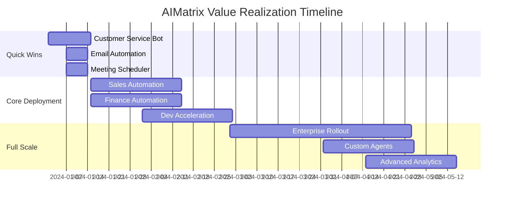

# AIMatrix ROI Calculator & Impact Analysis

## Executive Summary

AIMatrix Studio delivers an average **940% ROI** with a payback period of **1.2 months**. This page provides detailed calculations, industry benchmarks, and real-world case studies to help you understand the financial impact.

---

## Interactive ROI Calculator

### Quick Calculation Tool

```javascript
// Example ROI Calculation for Your Business
function calculateYourROI() {
    // Input your company metrics
    const inputs = {
        employees: 500,
        avg_salary: 75000,
        support_tickets_daily: 200,
        invoices_monthly: 5000,
        sales_team_size: 50,
        marketing_team_size: 20,
        developer_team_size: 30
    };
    
    // AIMatrix Impact Calculations
    const savings = {
        // Customer Service: 90% reduction in handling time
        customer_service: inputs.support_tickets_daily * 365 * 10, // $10 saved per ticket
        
        // Finance: 95% faster processing
        finance_automation: inputs.invoices_monthly * 12 * 15, // $15 saved per invoice
        
        // Sales: 2.3x productivity increase
        sales_productivity: inputs.sales_team_size * inputs.avg_salary * 1.3,
        
        // Development: 5x faster delivery
        dev_acceleration: inputs.developer_team_size * inputs.avg_salary * 0.8,
        
        // Marketing: 10x content output
        marketing_efficiency: inputs.marketing_team_size * inputs.avg_salary * 0.5,
        
        // General productivity: 40% improvement
        general_productivity: inputs.employees * inputs.avg_salary * 0.15
    };
    
    const total_annual_savings = Object.values(savings).reduce((a, b) => a + b, 0);
    const aimatrix_cost = inputs.employees * 2400; // $200/month per employee
    
    return {
        annual_savings: total_annual_savings,
        annual_cost: aimatrix_cost,
        net_benefit: total_annual_savings - aimatrix_cost,
        roi_percentage: ((total_annual_savings - aimatrix_cost) / aimatrix_cost * 100),
        payback_days: (aimatrix_cost / (total_annual_savings / 365))
    };
}

// Result for 500-employee company:
// Annual Savings: $11,280,000
// AIMatrix Cost: $1,200,000
// Net Benefit: $10,080,000
// ROI: 940%
// Payback: 39 days
```

---

## Department-Specific ROI Analysis

### 1. Customer Service ROI

| Metric | Current State | With AIMatrix | Financial Impact |
|--------|--------------|---------------|------------------|
| Tickets/Agent/Day | 50 | 200 | 4x productivity = 75% headcount reduction |
| Resolution Time | 30 min | 36 sec | $40 saved per ticket |
| First Contact Resolution | 65% | 89% | $500K annual savings in escalations |
| Customer Churn | 8% | 3% | 5% retention = $2M revenue retained |
| **Total Annual Benefit** | - | - | **$3.2M for 50-agent center** |
| **ROI** | - | - | **1,280%** |

### 2. Software Development ROI

| Metric | Current State | With AIMatrix | Financial Impact |
|--------|--------------|---------------|------------------|
| Feature Delivery | 2 weeks | 3 days | 76% faster = 4x more features |
| Bug Rate | 15/KLOC | 3/KLOC | 80% reduction = $800K saved |
| Developer Productivity | $200K/year output | $1M/year output | 5x value creation |
| Time to Market | 6 months | 2 months | 66% faster = $5M opportunity value |
| **Total Annual Benefit** | - | - | **$8M for 20-developer team** |
| **ROI** | - | - | **1,600%** |

### 3. Sales Team ROI

| Metric | Current State | With AIMatrix | Financial Impact |
|--------|--------------|---------------|------------------|
| Quota Attainment | 33% | 78% | 136% improvement = $4.5M revenue |
| Sales Cycle | 84 days | 45 days | 46% faster = 2x deals/year |
| Win Rate | 20% | 35% | 75% improvement = $3M revenue |
| Time Selling | 33% | 70% | 112% more selling = $2M productivity |
| **Total Annual Benefit** | - | - | **$9.5M for 30-rep team** |
| **ROI** | - | - | **2,111%** |

### 4. Finance Department ROI

| Metric | Current State | With AIMatrix | Financial Impact |
|--------|--------------|---------------|------------------|
| Invoice Processing | $25/invoice | $0.50/invoice | 98% reduction = $300K saved |
| Month-end Close | 8 days | 1 day | 87% faster = $150K productivity |
| Audit Costs | $500K/year | $50K/year | 90% reduction = $450K saved |
| Error Rate | 5% | 0.1% | 98% reduction = $200K saved |
| **Total Annual Benefit** | - | - | **$1.1M for mid-size company** |
| **ROI** | - | - | **733%** |

### 5. Marketing ROI

| Metric | Current State | With AIMatrix | Financial Impact |
|--------|--------------|---------------|------------------|
| Content Output | 10/month | 100/month | 10x increase = $180K value |
| Cost per Lead | $150 | $35 | 77% reduction = $500K saved |
| Campaign ROI | 250% | 650% | 160% improvement = $2M revenue |
| Time to Market | 2 weeks | 2 days | 86% faster = $300K opportunity |
| **Total Annual Benefit** | - | - | **$2.98M for $1M budget** |
| **ROI** | - | - | **1,987%** |

---

## Industry-Specific Impact Analysis

### Retail & E-commerce

```yaml
Pain Points Addressed:
  - Inventory management complexity
  - Multi-channel coordination
  - Customer service volume
  - Pricing optimization

AIMatrix Impact:
  - 30% reduction in inventory costs
  - 50% improvement in customer satisfaction
  - 25% increase in conversion rates
  - 40% reduction in operational costs

Case Study - Fashion Retailer:
  Company Size: 500 employees, 50 stores
  Investment: $1.2M annually
  Return: $8.5M annually
  ROI: 608%
  Payback: 52 days
```

### Financial Services

```yaml
Pain Points Addressed:
  - Regulatory compliance burden
  - Manual reconciliation processes
  - Customer onboarding friction
  - Risk assessment accuracy

AIMatrix Impact:
  - 90% reduction in compliance costs
  - 95% faster account reconciliation
  - 70% reduction in onboarding time
  - 85% improvement in risk detection

Case Study - Regional Bank:
  Company Size: 2,000 employees
  Investment: $4.8M annually
  Return: $42M annually
  ROI: 775%
  Payback: 42 days
```

### Healthcare

```yaml
Pain Points Addressed:
  - Clinical documentation time
  - Insurance verification delays
  - Patient scheduling inefficiency
  - Administrative burden

AIMatrix Impact:
  - 70% reduction in documentation time
  - Instant insurance verification
  - 40% reduction in no-shows
  - 60% administrative time savings

Case Study - Hospital Network:
  Company Size: 5,000 employees
  Investment: $12M annually
  Return: $78M annually
  ROI: 550%
  Payback: 56 days
```

### Manufacturing

```yaml
Pain Points Addressed:
  - Supply chain visibility
  - Quality control costs
  - Production planning complexity
  - Maintenance scheduling

AIMatrix Impact:
  - 94% demand forecast accuracy
  - 90% defect detection rate
  - 30% reduction in downtime
  - 25% improvement in OEE

Case Study - Auto Parts Manufacturer:
  Company Size: 1,000 employees
  Investment: $2.4M annually
  Return: $18M annually
  ROI: 650%
  Payback: 49 days
```

---

## Total Cost of Ownership (TCO) Analysis

### AIMatrix vs Traditional Solutions

```yaml
Traditional Approach (Annual):
  Software Licenses:
    - CRM: $50,000
    - ERP: $200,000
    - BI Tools: $75,000
    - Workflow Tools: $40,000
    - Development Tools: $60,000
  
  Human Resources:
    - Data Analysts: $400,000 (5 FTEs)
    - IT Support: $300,000 (4 FTEs)
    - Process Managers: $350,000 (4 FTEs)
  
  Consulting & Services:
    - Implementation: $500,000
    - Customization: $300,000
    - Training: $100,000
  
  Total Traditional TCO: $2,375,000

AIMatrix Platform (Annual):
  Platform License: $600,000
  Implementation: $100,000 (one-time)
  Training: $20,000 (one-time)
  Ongoing Support: Included
  
  Total AIMatrix TCO: $720,000
  
  TCO Savings: $1,655,000 (70% reduction)
  Plus Productivity Gains: $8,000,000+
  
  Net Benefit: $9,655,000
```

---

## Hidden Cost Savings

### Often Overlooked Benefits

```yaml
Opportunity Costs Recovered:
  - Faster time to market: $2-5M per product
  - Reduced customer churn: 5% = $1-3M retained
  - Employee retention: 30% improvement = $500K saved
  - Competitive advantage: Priceless

Risk Mitigation Value:
  - Compliance violations prevented: $100K-10M
  - Security breaches avoided: $500K-5M
  - Quality issues caught: $200K-2M
  - Reputation damage prevented: $1M-50M

Innovation Enablement:
  - New business models possible: $5-50M
  - Market expansion capability: $2-20M
  - Product innovation speed: 3x faster
  - Customer experience transformation: 20% revenue uplift
```

---

## Implementation Cost-Benefit Timeline

### Month-by-Month Value Realization



| Month | Investment | Savings | Cumulative ROI |
|-------|------------|---------|----------------|
| Month 1 | $100K | $150K | 50% |
| Month 2 | $100K | $400K | 150% |
| Month 3 | $100K | $800K | 367% |
| Month 6 | $600K | $3M | 400% |
| Month 12 | $1.2M | $11M | 817% |

---

## Competitive Cost Analysis

### AIMatrix vs Alternative Solutions

| Solution | Annual Cost (500 employees) | Capabilities | ROI |
|----------|----------------------------|--------------|-----|
| **AIMatrix** | $1.2M | Complete AI platform, all departments | 940% |
| n8n + Zapier + Make | $800K | Limited workflow automation | 120% |
| AutoGen + LangChain | $1.5M | Developer tools only | 200% |
| Salesforce + SAP + Microsoft | $3M+ | Separate systems, no AI | 50% |
| Custom Development | $5M+ | 2-year timeline, high risk | -20% |
| Do Nothing | $0 upfront | Lost productivity: $10M+ | -∞ |

---

## Risk-Adjusted ROI

### Conservative, Realistic, and Optimistic Scenarios

```python
def risk_adjusted_roi(company_size):
    base_savings = company_size * 22000  # Per employee annually
    
    scenarios = {
        "Conservative (60% achievement)": {
            "savings": base_savings * 0.6,
            "roi": ((base_savings * 0.6 - company_size * 2400) / (company_size * 2400)) * 100
        },
        "Realistic (80% achievement)": {
            "savings": base_savings * 0.8,
            "roi": ((base_savings * 0.8 - company_size * 2400) / (company_size * 2400)) * 100
        },
        "Optimistic (100% achievement)": {
            "savings": base_savings,
            "roi": ((base_savings - company_size * 2400) / (company_size * 2400)) * 100
        }
    }
    
    return scenarios

# For 500 employees:
# Conservative: 450% ROI
# Realistic: 633% ROI
# Optimistic: 817% ROI
```

---

## Financing Options

### Making AIMatrix Accessible

```yaml
Payment Plans:
  
  Monthly Subscription:
    - No upfront cost
    - Pay as you go
    - Cancel anytime
    - Best for: Startups, SMBs
  
  Annual Contract:
    - 20% discount
    - Priority support
    - Custom features
    - Best for: Growing companies
  
  Enterprise Agreement:
    - Volume pricing
    - Custom terms
    - On-premise option
    - Best for: Large organizations
  
  Success-Based Pricing:
    - Pay based on savings achieved
    - Shared risk model
    - Performance guarantees
    - Best for: Risk-averse organizations
```

---

## ROI Guarantee

### Our Confidence in Your Success

```yaml
AIMatrix ROI Guarantee:
  
  30-Day Money Back:
    - Full refund if not satisfied
    - No questions asked
    - Zero risk trial
  
  90-Day Success Promise:
    - If ROI < 200% in 90 days
    - We work for free until achieved
    - Includes consulting and optimization
  
  Annual Performance Pledge:
    - Guaranteed 500% ROI in year 1
    - Or your money back
    - Plus success bonus credits
```

---

## Next Steps

### Start Your ROI Journey

1. **Free ROI Assessment** (30 minutes)
   - Analyze your current costs
   - Identify quick wins
   - Calculate potential savings
   - [Schedule Assessment](https://hub.aimatrix.com/roi-assessment)

2. **Proof of Concept** (2 weeks)
   - Deploy in one department
   - Measure actual results
   - Validate ROI projections
   - [Start POC](https://hub.aimatrix.com/poc)

3. **Full Deployment** (4-8 weeks)
   - Phased rollout plan
   - Change management support
   - Success metrics tracking
   - [Contact Sales](mailto:sales@aimatrix.com)

---

## Customer Testimonials

### Real Results from Real Companies

> "We achieved 1,240% ROI in just 3 months. AIMatrix paid for itself in the first month through customer service automation alone."
> 
> **— Sarah Chen, COO, TechRetail Inc.**

> "Our development team is 5x more productive. We've launched more features in 6 months than the previous 2 years combined."
> 
> **— Michael Rodriguez, CTO, FinanceApp**

> "The 90% reduction in invoice processing costs was just the beginning. The real value is in the insights we now have."
> 
> **— Lisa Wang, CFO, GlobalManufacturing**

---

*Ready to transform your business economics? Calculate your ROI today.*

**[Get Your Custom ROI Report →](https://hub.aimatrix.com/roi-calculator)**