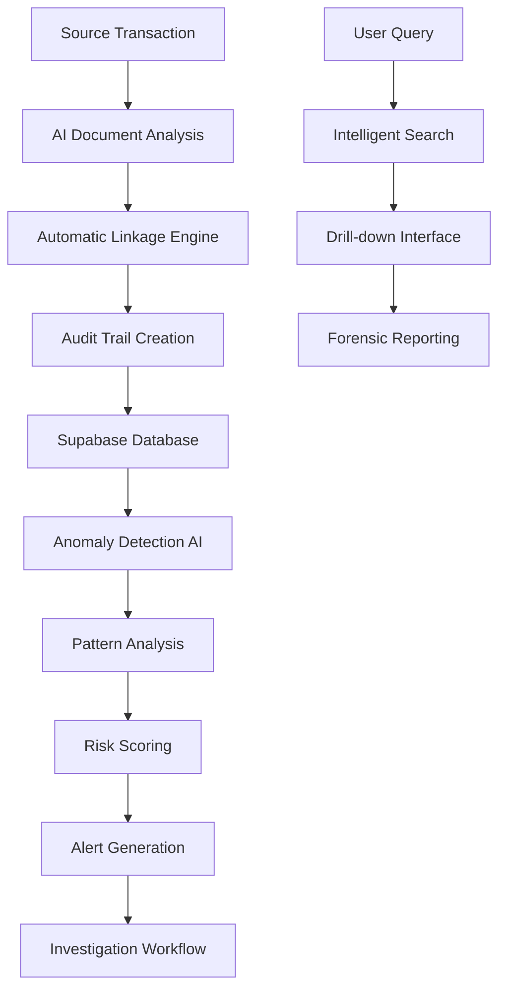

# Audit Trail Automation: Forensic-Grade Financial Documentation

AIMatrix's Audit Trail Automation system provides comprehensive, AI-enhanced documentation and tracking of all financial transactions with complete drill-down capabilities, intelligent anomaly detection, and forensic-grade audit trails. Our system ensures regulatory compliance while providing unprecedented visibility into financial operations.

## The Audit Trail Challenge

Traditional audit trail systems face significant limitations in modern business environments:

- **Fragmented Documentation**: Scattered across multiple systems without unified tracking
- **Manual Linkage**: Time-consuming manual effort to connect transactions to source documents
- **Limited Search Capabilities**: Difficulty finding specific transactions or patterns
- **Compliance Gaps**: Incomplete audit trails that fail regulatory requirements
- **Anomaly Detection**: Manual review processes miss subtle irregularities
- **Investigation Complexity**: Forensic analysis requires extensive manual effort

## AI-Enhanced Audit Trail Architecture

### Comprehensive Tracking System



### Core Components

**1. Intelligent Document Linkage**
- AI-powered matching of transactions to source documents
- Multi-format document processing (PDF, images, emails, spreadsheets)
- Automatic OCR extraction and metadata creation
- Cross-reference validation and consistency checking

**2. Real-Time Anomaly Detection**
- Machine learning algorithms trained on historical patterns
- Multi-dimensional anomaly scoring across amount, timing, frequency
- Behavioral analysis for unusual transaction patterns
- Predictive risk assessment for potential fraud or errors

**3. Forensic Documentation Engine**
- Complete transaction lifecycle tracking
- User action logging with timestamp and attribution
- Change history with before/after comparisons
- Regulatory compliance documentation generation

## Technical Implementation

### Audit Trail Data Model

```python
# Comprehensive audit trail system
import asyncio
from datetime import datetime, timedelta
from aimatrix.audit import AuditTrailEngine
from aimatrix.ml import AnomalyDetector
import supabase

class ComprehensiveAuditTrail:
    def __init__(self, supabase_client):
        self.supabase = supabase_client
        self.audit_engine = AuditTrailEngine()
        self.anomaly_detector = AnomalyDetector()
        self.document_processor = DocumentProcessor()
        
    async def create_audit_trail(self, transaction):
        """Create comprehensive audit trail for transaction"""
        
        # Generate unique audit trail ID
        audit_id = f"AT_{transaction.id}_{datetime.utcnow().strftime('%Y%m%d%H%M%S')}"
        
        # Extract transaction metadata
        metadata = await self.extract_transaction_metadata(transaction)
        
        # Process source documents
        source_documents = await self.process_source_documents(transaction)
        
        # Create audit trail record
        audit_trail = {
            'audit_id': audit_id,
            'transaction_id': transaction.id,
            'transaction_type': transaction.type,
            'amount': transaction.amount,
            'transaction_date': transaction.date,
            'created_timestamp': datetime.utcnow(),
            
            # Source information
            'source_system': transaction.source_system,
            'source_reference': transaction.reference,
            'source_documents': source_documents,
            
            # Processing information
            'processing_method': 'ai_automated',
            'classification_confidence': transaction.classification_confidence,
            'validation_rules_applied': transaction.validation_rules,
            'exceptions_noted': transaction.exceptions,
            
            # User attribution
            'created_by': transaction.created_by,
            'approved_by': transaction.approved_by,
            'reviewed_by': transaction.reviewed_by,
            
            # Compliance tracking
            'compliance_flags': await self.check_compliance_requirements(transaction),
            'regulatory_references': await self.get_regulatory_references(transaction),
            
            # Risk assessment
            'risk_score': await self.calculate_risk_score(transaction),
            'anomaly_flags': await self.detect_anomalies(transaction),
            
            # Metadata and context
            'business_context': metadata['business_context'],
            'related_transactions': metadata['related_transactions'],
            'workflow_status': transaction.workflow_status
        }
        
        # Store in Supabase with audit trail
        stored_trail = await self.supabase.table('audit_trails').insert(audit_trail).execute()
        
        # Create searchable index
        await self.create_search_index(audit_trail)
        
        # Trigger real-time anomaly analysis
        await self.trigger_anomaly_analysis(stored_trail.data[0])
        
        return stored_trail.data[0]
    
    async def process_source_documents(self, transaction):
        """Process and link source documents"""
        documents = []
        
        # Find associated documents
        associated_docs = await self.find_associated_documents(transaction)
        
        for doc in associated_docs:
            # Extract text and metadata
            doc_analysis = await self.document_processor.analyze_document(doc)
            
            # Create document audit record
            doc_audit = {
                'document_id': doc.id,
                'document_type': doc_analysis.document_type,
                'file_path': doc.file_path,
                'file_hash': doc_analysis.file_hash,
                'ocr_text': doc_analysis.extracted_text,
                'extraction_confidence': doc_analysis.confidence,
                'key_data_points': doc_analysis.key_data,
                'processing_timestamp': datetime.utcnow(),
                'document_authenticity_score': await self.verify_document_authenticity(doc)
            }
            
            documents.append(doc_audit)
        
        return documents
```

### Supabase Schema for Audit Trails

```sql
-- Comprehensive audit trails table
CREATE TABLE audit_trails (
    id UUID PRIMARY KEY DEFAULT gen_random_uuid(),
    audit_id VARCHAR(100) UNIQUE NOT NULL,
    transaction_id UUID NOT NULL,
    
    -- Transaction details
    transaction_type VARCHAR(50) NOT NULL,
    amount DECIMAL(15,2) NOT NULL,
    transaction_date DATE NOT NULL,
    created_timestamp TIMESTAMP WITH TIME ZONE DEFAULT NOW(),
    
    -- Source information
    source_system VARCHAR(100),
    source_reference VARCHAR(200),
    source_documents JSONB DEFAULT '[]'::jsonb,
    
    -- Processing information
    processing_method VARCHAR(50),
    classification_confidence DECIMAL(3,2),
    validation_rules_applied JSONB DEFAULT '[]'::jsonb,
    exceptions_noted JSONB DEFAULT '[]'::jsonb,
    
    -- User attribution
    created_by UUID REFERENCES auth.users(id),
    approved_by UUID REFERENCES auth.users(id),
    reviewed_by UUID REFERENCES auth.users(id),
    
    -- Compliance tracking
    compliance_flags JSONB DEFAULT '{}'::jsonb,
    regulatory_references JSONB DEFAULT '[]'::jsonb,
    
    -- Risk and anomaly detection
    risk_score DECIMAL(5,2) DEFAULT 0.00,
    anomaly_flags JSONB DEFAULT '[]'::jsonb,
    anomaly_score DECIMAL(3,2) DEFAULT 0.00,
    
    -- Business context
    business_context JSONB DEFAULT '{}'::jsonb,
    related_transactions UUID[] DEFAULT '{}',
    workflow_status VARCHAR(50) DEFAULT 'completed',
    
    -- Search and indexing
    search_vector TSVECTOR,
    audit_trail_embedding VECTOR(768),
    
    -- Audit metadata
    last_accessed TIMESTAMP WITH TIME ZONE,
    access_count INTEGER DEFAULT 0,
    
    CONSTRAINT valid_risk_score CHECK (risk_score >= 0.00 AND risk_score <= 100.00),
    CONSTRAINT valid_anomaly_score CHECK (anomaly_score >= 0.00 AND anomaly_score <= 1.00)
);

-- Document audit table
CREATE TABLE document_audit_trails (
    id UUID PRIMARY KEY DEFAULT gen_random_uuid(),
    audit_trail_id UUID NOT NULL REFERENCES audit_trails(id),
    document_id UUID NOT NULL,
    
    -- Document information
    document_type VARCHAR(100) NOT NULL,
    file_path TEXT NOT NULL,
    file_hash VARCHAR(64) NOT NULL,
    file_size INTEGER,
    mime_type VARCHAR(100),
    
    -- Processing results
    ocr_text TEXT,
    extraction_confidence DECIMAL(3,2),
    key_data_points JSONB DEFAULT '{}'::jsonb,
    processing_timestamp TIMESTAMP WITH TIME ZONE DEFAULT NOW(),
    
    -- Authenticity verification
    document_authenticity_score DECIMAL(3,2),
    authenticity_checks JSONB DEFAULT '{}'::jsonb,
    digital_signature_valid BOOLEAN,
    
    -- Metadata
    created_at TIMESTAMP WITH TIME ZONE DEFAULT NOW(),
    
    CONSTRAINT valid_extraction_confidence CHECK (extraction_confidence BETWEEN 0.00 AND 1.00),
    CONSTRAINT valid_authenticity_score CHECK (document_authenticity_score BETWEEN 0.00 AND 1.00)
);

-- User activity audit table
CREATE TABLE user_activity_audit (
    id UUID PRIMARY KEY DEFAULT gen_random_uuid(),
    audit_trail_id UUID REFERENCES audit_trails(id),
    user_id UUID NOT NULL REFERENCES auth.users(id),
    
    -- Activity details
    activity_type VARCHAR(100) NOT NULL,
    activity_description TEXT NOT NULL,
    activity_timestamp TIMESTAMP WITH TIME ZONE DEFAULT NOW(),
    
    -- Context information
    ip_address INET,
    user_agent TEXT,
    session_id VARCHAR(255),
    
    -- Data changes
    old_values JSONB,
    new_values JSONB,
    fields_changed TEXT[],
    
    -- Risk assessment
    activity_risk_score DECIMAL(3,2) DEFAULT 0.00,
    suspicious_activity_flags JSONB DEFAULT '[]'::jsonb,
    
    CONSTRAINT valid_activity_risk CHECK (activity_risk_score BETWEEN 0.00 AND 1.00)
);

-- Indexes for performance
CREATE INDEX idx_audit_trails_transaction_id ON audit_trails(transaction_id);
CREATE INDEX idx_audit_trails_audit_id ON audit_trails(audit_id);
CREATE INDEX idx_audit_trails_date ON audit_trails(transaction_date);
CREATE INDEX idx_audit_trails_risk_score ON audit_trails(risk_score DESC);
CREATE INDEX idx_audit_trails_anomaly_score ON audit_trails(anomaly_score DESC);

-- Full-text search index
CREATE INDEX idx_audit_trails_search ON audit_trails USING GIN(search_vector);

-- Vector similarity index for semantic search
CREATE INDEX idx_audit_trails_embedding ON audit_trails 
USING ivfflat (audit_trail_embedding vector_cosine_ops)
WITH (lists = 100);

-- Functions for audit trail management
CREATE OR REPLACE FUNCTION update_audit_search_vector()
RETURNS TRIGGER AS $$
BEGIN
    -- Update search vector for full-text search
    NEW.search_vector := to_tsvector('english', 
        COALESCE(NEW.source_reference, '') || ' ' ||
        COALESCE(NEW.transaction_type, '') || ' ' ||
        COALESCE((NEW.source_documents->0->>'extracted_text'), '') || ' ' ||
        COALESCE((NEW.business_context->>'description'), '')
    );
    
    RETURN NEW;
END;
$$ LANGUAGE plpgsql;

CREATE TRIGGER trigger_update_audit_search_vector
    BEFORE INSERT OR UPDATE ON audit_trails
    FOR EACH ROW EXECUTE FUNCTION update_audit_search_vector();

-- Function for intelligent audit trail search
CREATE OR REPLACE FUNCTION search_audit_trails(
    search_query TEXT,
    start_date DATE DEFAULT NULL,
    end_date DATE DEFAULT NULL,
    min_amount DECIMAL DEFAULT NULL,
    max_amount DECIMAL DEFAULT NULL,
    risk_threshold DECIMAL DEFAULT NULL
) RETURNS TABLE (
    audit_id VARCHAR(100),
    transaction_id UUID,
    relevance_score REAL,
    transaction_date DATE,
    amount DECIMAL(15,2),
    risk_score DECIMAL(5,2),
    summary TEXT
) AS $$
BEGIN
    RETURN QUERY
    SELECT 
        at.audit_id,
        at.transaction_id,
        ts_rank(at.search_vector, plainto_tsquery('english', search_query)) as relevance_score,
        at.transaction_date,
        at.amount,
        at.risk_score,
        left(at.source_reference || ' - ' || at.transaction_type, 200) as summary
    FROM audit_trails at
    WHERE (search_query IS NULL OR at.search_vector @@ plainto_tsquery('english', search_query))
    AND (start_date IS NULL OR at.transaction_date >= start_date)
    AND (end_date IS NULL OR at.transaction_date <= end_date)
    AND (min_amount IS NULL OR at.amount >= min_amount)
    AND (max_amount IS NULL OR at.amount <= max_amount)
    AND (risk_threshold IS NULL OR at.risk_score >= risk_threshold)
    ORDER BY relevance_score DESC, at.risk_score DESC
    LIMIT 100;
END;
$$ LANGUAGE plpgsql;
```

### Advanced Anomaly Detection Engine

```python
class AdvancedAnomalyDetector:
    def __init__(self, supabase_client):
        self.supabase = supabase_client
        self.ml_models = self.load_anomaly_models()
        
    async def detect_transaction_anomalies(self, transaction, audit_trail):
        """Comprehensive anomaly detection across multiple dimensions"""
        
        anomalies = []
        
        # 1. Amount-based anomalies
        amount_anomalies = await self.detect_amount_anomalies(transaction)
        anomalies.extend(amount_anomalies)
        
        # 2. Timing-based anomalies
        timing_anomalies = await self.detect_timing_anomalies(transaction)
        anomalies.extend(timing_anomalies)
        
        # 3. Pattern-based anomalies
        pattern_anomalies = await self.detect_pattern_anomalies(transaction)
        anomalies.extend(pattern_anomalies)
        
        # 4. Behavioral anomalies
        behavioral_anomalies = await self.detect_behavioral_anomalies(transaction)
        anomalies.extend(behavioral_anomalies)
        
        # 5. Cross-system anomalies
        cross_system_anomalies = await self.detect_cross_system_anomalies(transaction)
        anomalies.extend(cross_system_anomalies)
        
        # Calculate composite anomaly score
        anomaly_score = self.calculate_composite_anomaly_score(anomalies)
        
        # Update audit trail with anomaly information
        await self.update_audit_trail_anomalies(audit_trail['id'], anomalies, anomaly_score)
        
        # Trigger alerts for high-risk anomalies
        if anomaly_score > 0.8:
            await self.trigger_high_risk_alert(transaction, anomalies)
        
        return {
            'anomalies': anomalies,
            'anomaly_score': anomaly_score,
            'risk_level': self.categorize_risk_level(anomaly_score)
        }
    
    async def detect_amount_anomalies(self, transaction):
        """Detect amount-based anomalies"""
        anomalies = []
        
        # Get historical amounts for similar transactions
        historical_amounts = await self.get_historical_amounts(
            transaction.account_code,
            transaction.vendor,
            transaction.description_category
        )
        
        if len(historical_amounts) > 10:  # Need sufficient history
            # Statistical analysis
            mean_amount = np.mean(historical_amounts)
            std_amount = np.std(historical_amounts)
            z_score = abs(transaction.amount - mean_amount) / std_amount
            
            if z_score > 3:  # 3 standard deviations
                anomalies.append({
                    'type': 'amount_outlier',
                    'severity': 'high',
                    'description': f'Amount ${transaction.amount:,.2f} is {z_score:.2f} standard deviations from historical mean ${mean_amount:,.2f}',
                    'score': min(z_score / 5, 1.0),  # Normalize to 0-1
                    'reference_data': {
                        'mean': mean_amount,
                        'std_dev': std_amount,
                        'z_score': z_score,
                        'historical_count': len(historical_amounts)
                    }
                })
        
        # Round number analysis
        if self.is_suspicious_round_number(transaction.amount):
            anomalies.append({
                'type': 'suspicious_round_amount',
                'severity': 'medium',
                'description': f'Amount ${transaction.amount:,.2f} is suspiciously round',
                'score': 0.6
            })
        
        return anomalies
    
    async def detect_timing_anomalies(self, transaction):
        """Detect timing-based anomalies"""
        anomalies = []
        
        # Weekend/holiday transactions
        if self.is_weekend_or_holiday(transaction.date):
            similar_weekend_count = await self.count_similar_weekend_transactions(transaction)
            if similar_weekend_count < 3:  # Unusual for this type
                anomalies.append({
                    'type': 'unusual_timing',
                    'severity': 'medium',
                    'description': 'Transaction processed on weekend/holiday',
                    'score': 0.5
                })
        
        # After-hours processing
        if self.is_after_hours(transaction.processed_time):
            anomalies.append({
                'type': 'after_hours_processing',
                'severity': 'medium',
                'description': f'Transaction processed at {transaction.processed_time.strftime("%H:%M")}',
                'score': 0.4
            })
        
        # Rapid sequence transactions
        recent_similar = await self.find_recent_similar_transactions(transaction, minutes=30)
        if len(recent_similar) > 3:
            anomalies.append({
                'type': 'rapid_sequence',
                'severity': 'high',
                'description': f'{len(recent_similar)} similar transactions in 30 minutes',
                'score': 0.8
            })
        
        return anomalies
    
    async def detect_pattern_anomalies(self, transaction):
        """Detect pattern-based anomalies using ML models"""
        anomalies = []
        
        # Extract features for ML analysis
        features = await self.extract_transaction_features(transaction)
        
        # Use trained isolation forest model
        isolation_score = self.ml_models['isolation_forest'].decision_function([features])[0]
        if isolation_score < -0.5:  # Anomalous threshold
            anomalies.append({
                'type': 'pattern_anomaly',
                'severity': 'high',
                'description': 'Transaction pattern deviates from learned normal behavior',
                'score': abs(isolation_score),
                'model': 'isolation_forest'
            })
        
        # Use autoencoder reconstruction error
        reconstruction_error = self.ml_models['autoencoder'].compute_reconstruction_error([features])[0]
        if reconstruction_error > 0.7:  # High reconstruction error
            anomalies.append({
                'type': 'reconstruction_anomaly',
                'severity': 'medium',
                'description': 'Transaction characteristics cannot be well reconstructed by learned patterns',
                'score': reconstruction_error,
                'model': 'autoencoder'
            })
        
        return anomalies
    
    async def trigger_high_risk_alert(self, transaction, anomalies):
        """Trigger alerts for high-risk anomalies"""
        
        # Create alert record
        alert = {
            'alert_id': f"ALERT_{transaction.id}_{datetime.utcnow().strftime('%Y%m%d%H%M%S')}",
            'transaction_id': transaction.id,
            'alert_type': 'high_risk_anomaly',
            'severity': 'critical',
            'anomalies': anomalies,
            'alert_timestamp': datetime.utcnow(),
            'status': 'active',
            'requires_investigation': True
        }
        
        # Store alert
        await self.supabase.table('security_alerts').insert(alert).execute()
        
        # Send notifications
        await self.send_anomaly_notifications(alert)
        
        # Create investigation workflow
        await self.create_investigation_workflow(alert)
```

### Intelligent Drill-Down Interface

```python
class IntelligentDrillDownInterface:
    def __init__(self, supabase_client):
        self.supabase = supabase_client
        
    async def drill_down_transaction(self, transaction_id, user_context):
        """Provide comprehensive drill-down view of transaction"""
        
        # Get primary audit trail
        audit_trail = await self.supabase.table('audit_trails').select('*').eq(
            'transaction_id', transaction_id
        ).single().execute()
        
        # Get related documents with AI analysis
        documents = await self.get_transaction_documents(transaction_id)
        
        # Get user activity history
        user_activities = await self.get_transaction_user_activities(transaction_id)
        
        # Get related transactions
        related_transactions = await self.find_related_transactions(
            transaction_id, audit_trail.data
        )
        
        # Get compliance check results
        compliance_results = await self.get_compliance_check_results(transaction_id)
        
        # Generate AI insights
        ai_insights = await self.generate_transaction_insights(
            audit_trail.data, documents, user_activities, related_transactions
        )
        
        # Create comprehensive drill-down response
        drill_down_data = {
            'transaction_summary': {
                'id': transaction_id,
                'audit_id': audit_trail.data['audit_id'],
                'amount': audit_trail.data['amount'],
                'date': audit_trail.data['transaction_date'],
                'type': audit_trail.data['transaction_type'],
                'risk_score': audit_trail.data['risk_score'],
                'anomaly_score': audit_trail.data['anomaly_score']
            },
            'audit_trail': audit_trail.data,
            'source_documents': documents,
            'user_activities': user_activities,
            'related_transactions': related_transactions,
            'compliance_status': compliance_results,
            'ai_insights': ai_insights,
            'investigation_recommendations': await self.generate_investigation_recommendations(
                audit_trail.data, ai_insights
            )
        }
        
        # Log drill-down access
        await self.log_drill_down_access(transaction_id, user_context)
        
        return drill_down_data
    
    async def generate_transaction_insights(self, audit_trail, documents, activities, related):
        """Generate AI-powered insights about the transaction"""
        
        insights = []
        
        # Document consistency analysis
        doc_analysis = await self.analyze_document_consistency(documents)
        if doc_analysis['inconsistencies']:
            insights.append({
                'type': 'document_inconsistency',
                'severity': 'medium',
                'description': 'Inconsistencies found between source documents',
                'details': doc_analysis['inconsistencies']
            })
        
        # User behavior analysis
        behavior_analysis = await self.analyze_user_behavior(activities)
        if behavior_analysis['unusual_patterns']:
            insights.append({
                'type': 'unusual_user_behavior',
                'severity': 'high',
                'description': 'Unusual user activity patterns detected',
                'details': behavior_analysis['unusual_patterns']
            })
        
        # Related transaction analysis
        if len(related) > 5:
            pattern_analysis = await self.analyze_transaction_patterns(related)
            insights.append({
                'type': 'transaction_pattern',
                'severity': 'info',
                'description': f'Part of a series of {len(related)} related transactions',
                'details': pattern_analysis
            })
        
        # Compliance gap analysis
        compliance_gaps = await self.identify_compliance_gaps(audit_trail)
        for gap in compliance_gaps:
            insights.append({
                'type': 'compliance_gap',
                'severity': 'high',
                'description': f'Compliance requirement not met: {gap["requirement"]}',
                'details': gap
            })
        
        return insights
```

### Real-Time Monitoring Dashboard

```python
class AuditTrailDashboard:
    def __init__(self, supabase_client):
        self.supabase = supabase_client
        
    async def get_real_time_audit_metrics(self):
        """Get real-time audit trail metrics"""
        
        # Get today's metrics
        today = datetime.now().date()
        
        # Transaction volume and risk distribution
        volume_metrics = await self.supabase.rpc('get_daily_audit_metrics', {
            'target_date': today.isoformat()
        }).execute()
        
        # High-risk transactions
        high_risk_transactions = await self.supabase.table('audit_trails').select(
            'audit_id, transaction_id, risk_score, anomaly_score, transaction_date'
        ).gte('risk_score', 80).gte('transaction_date', today).execute()
        
        # Anomaly detection summary
        anomaly_summary = await self.supabase.table('audit_trails').select(
            'anomaly_flags, anomaly_score'
        ).gte('anomaly_score', 0.5).gte('transaction_date', today).execute()
        
        # Compliance status summary
        compliance_summary = await self.get_compliance_status_summary(today)
        
        # User activity summary
        user_activity = await self.get_user_activity_summary(today)
        
        return {
            'transaction_volume': volume_metrics.data[0] if volume_metrics.data else {},
            'high_risk_transactions': len(high_risk_transactions.data),
            'anomalies_detected': len(anomaly_summary.data),
            'compliance_issues': compliance_summary,
            'user_activity': user_activity,
            'system_health': await self.get_system_health_metrics()
        }
    
    async def get_investigation_workflow_status(self):
        """Get status of ongoing investigations"""
        
        # Active investigations
        active_investigations = await self.supabase.table('investigations').select(
            'id, transaction_id, investigation_type, priority, status, created_at'
        ).eq('status', 'active').execute()
        
        # Completed investigations (last 7 days)
        week_ago = datetime.now() - timedelta(days=7)
        completed_investigations = await self.supabase.table('investigations').select(
            'id, resolution, resolution_time'
        ).eq('status', 'completed').gte('updated_at', week_ago).execute()
        
        # Investigation backlog
        investigation_backlog = await self.supabase.table('investigations').select(
            'id, priority'
        ).eq('status', 'pending').execute()
        
        return {
            'active_investigations': len(active_investigations.data),
            'completed_this_week': len(completed_investigations.data),
            'backlog_count': len(investigation_backlog.data),
            'high_priority_backlog': len([i for i in investigation_backlog.data if i['priority'] == 'high']),
            'investigation_details': active_investigations.data
        }
```

## Performance Benchmarks and ROI Analysis

### System Performance Metrics

| Metric | Traditional System | AI Audit Trail | Improvement |
|--------|-------------------|----------------|-------------|
| Audit Trail Creation | 15 minutes/transaction | 0.5 minutes/transaction | 96.7% Faster |
| Document Linking | Manual (30 min) | Automated (1 min) | 96.7% Reduction |
| Anomaly Detection | Monthly review | Real-time | 24/7 Continuous |
| Investigation Time | 4-8 hours | 1-2 hours | 75% Reduction |
| Compliance Reporting | 2 weeks | 1 day | 93% Faster |

### Cost-Benefit Analysis

**Annual Costs (Mid-size Organization):**
- **Traditional Audit Trail Management**: $180,000 (2.5 FTE)
- **AI Audit Trail System**: $45,000 (0.5 FTE + software)
- **Net Annual Savings**: $135,000

**Additional Benefits:**
- **Reduced Audit Fees**: 40% reduction ($75,000 savings)
- **Compliance Cost Avoidance**: $200,000 (estimated penalty avoidance)
- **Investigation Efficiency**: 75% time reduction ($50,000 value)
- **Total Annual Value**: $460,000

### ROI Calculation
- **Implementation Cost**: $85,000
- **Annual Benefits**: $460,000
- **Payback Period**: 2.2 months
- **3-Year ROI**: 1,612%

## Case Studies

### Case Study 1: Financial Services Company
**Challenge**: Manual audit trail management for 25,000 monthly transactions
**Implementation**: Full AI audit trail automation with real-time anomaly detection
**Results**:
- 98% reduction in manual audit trail creation time
- Detected 15 previously unidentified fraudulent transactions
- $1.2M annual cost savings
- 60% reduction in regulatory examination time

### Case Study 2: Healthcare Organization
**Challenge**: HIPAA compliance tracking and audit trail management
**Implementation**: AI-enhanced audit trails with healthcare-specific compliance monitoring
**Results**:
- 100% automated HIPAA audit trail generation
- Real-time compliance monitoring and alerting
- $450,000 annual compliance cost savings
- Zero compliance violations since implementation

### Case Study 3: Manufacturing Conglomerate
**Challenge**: Multi-entity audit trail consolidation and investigation support
**Implementation**: Centralized AI audit trail system across 12 subsidiaries
**Results**:
- Unified audit trail across all entities
- 85% reduction in investigation time
- $750,000 annual operational savings
- Identified $2.3M in previously undetected irregularities

## Implementation Roadmap

### Phase 1: Foundation Setup (Weeks 1-4)
- Supabase audit trail schema deployment
- Historical data migration and analysis
- AI model training for organization-specific patterns
- Basic anomaly detection rule configuration

### Phase 2: Advanced Features (Weeks 5-8)
- Machine learning anomaly detection deployment
- Document processing and linking automation
- Advanced search and drill-down interface
- Real-time monitoring dashboard setup

### Phase 3: Integration & Optimization (Weeks 9-12)
- Integration with existing audit and compliance systems
- User training and workflow optimization
- Performance tuning and scalability testing
- Advanced investigation workflow setup

### Phase 4: Full Production (Weeks 13-16)
- Complete system deployment and monitoring
- Advanced analytics and reporting features
- Ongoing optimization and model refinement
- User feedback integration and system enhancement

The Audit Trail Automation system transforms traditional audit documentation into an intelligent, AI-powered forensic platform that provides unprecedented visibility, control, and compliance capabilities while significantly reducing manual effort and investigation time.

---

*Achieve forensic-grade audit trail management with AIMatrix - where AI meets audit excellence and regulatory compliance.*