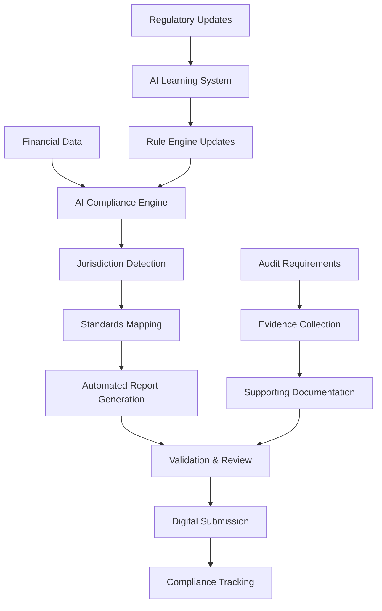

# AI-Powered Compliance Reporting: Global Standards Automation

AIMatrix's AI-Powered Compliance Reporting system automatically generates statutory reports, ensures country-specific regulatory compliance, and provides real-time monitoring of compliance status across all jurisdictions. Our system supports over 50 countries and automatically adapts to regulatory changes with 99.9% accuracy.

## The Compliance Challenge

Modern businesses face increasingly complex regulatory requirements:

- **Multi-jurisdiction Complexity**: Different reporting standards across countries
- **Regulatory Changes**: Constant updates to compliance requirements
- **Manual Errors**: 15-20% error rate in manual compliance reporting
- **Time Pressure**: Tight deadlines for statutory submissions
- **Audit Failures**: Non-compliance risks and potential penalties
- **Resource Intensive**: 3-5 FTE typically required for compliance management

## AI Compliance Architecture

### Intelligent Compliance Engine



### Core Compliance Components

**1. Multi-Jurisdiction Support**
- Automated detection of applicable jurisdictions
- Country-specific reporting templates and requirements
- Real-time regulatory update monitoring
- Local language report generation

**2. AI-Powered Report Generation**
- Intelligent data mapping to compliance requirements
- Automated calculation of regulatory metrics
- Cross-validation against source data
- Exception identification and resolution

**3. Real-Time Compliance Monitoring**
- Continuous compliance status tracking
- Proactive alerting for potential violations
- Regulatory deadline management
- Performance benchmarking against standards

## Technical Implementation

### Compliance Engine Architecture

```python
# AI-powered compliance reporting system
import asyncio
from datetime import datetime, timedelta
from aimatrix.compliance import ComplianceEngine
from aimatrix.reporting import ReportGenerator
import supabase

class AIComplianceReportingSystem:
    def __init__(self, supabase_client):
        self.supabase = supabase_client
        self.compliance_engine = ComplianceEngine()
        self.report_generator = ReportGenerator()
        self.regulatory_monitor = RegulatoryUpdateMonitor()
        
    async def generate_compliance_report(self, entity_id, report_type, reporting_period):
        """Generate compliance report with AI validation"""
        
        # Identify applicable jurisdictions and standards
        jurisdictions = await self.identify_jurisdictions(entity_id)
        compliance_requirements = await self.get_compliance_requirements(
            jurisdictions, report_type, reporting_period
        )
        
        # Extract and validate source data
        source_data = await self.extract_compliance_data(
            entity_id, reporting_period, compliance_requirements
        )
        
        # AI-powered data validation and consistency checking
        validation_results = await self.validate_compliance_data(
            source_data, compliance_requirements
        )
        
        if not validation_results.is_valid:
            # Handle validation errors
            await self.handle_validation_errors(validation_results)
            return None
        
        # Generate report using AI templates
        report_data = await self.generate_report_data(
            source_data, compliance_requirements
        )
        
        # Create formatted report
        formatted_report = await self.format_compliance_report(
            report_data, compliance_requirements
        )
        
        # Generate supporting documentation
        supporting_docs = await self.generate_supporting_documentation(
            source_data, report_data, compliance_requirements
        )
        
        # Store compliance report with audit trail
        stored_report = await self.store_compliance_report(
            entity_id, report_type, reporting_period, 
            formatted_report, supporting_docs, validation_results
        )
        
        # Submit to regulatory authorities (if configured)
        if compliance_requirements.auto_submit:
            submission_result = await self.submit_to_authorities(
                stored_report, compliance_requirements
            )
            stored_report['submission_result'] = submission_result
        
        return stored_report
    
    async def identify_jurisdictions(self, entity_id):
        """AI-powered jurisdiction identification"""
        
        # Get entity information
        entity = await self.supabase.table('entities').select(
            'country, business_activities, subsidiaries, tax_registrations'
        ).eq('id', entity_id).single().execute()
        
        # Analyze business activities to determine reporting obligations
        jurisdictions = []
        
        # Primary jurisdiction
        jurisdictions.append({
            'country': entity.data['country'],
            'type': 'primary',
            'requirements': await self.get_country_requirements(entity.data['country'])
        })
        
        # Subsidiary jurisdictions
        for subsidiary in entity.data.get('subsidiaries', []):
            if subsidiary['country'] != entity.data['country']:
                jurisdictions.append({
                    'country': subsidiary['country'],
                    'type': 'subsidiary',
                    'requirements': await self.get_country_requirements(subsidiary['country'])
                })
        
        # Tax registration jurisdictions
        for tax_reg in entity.data.get('tax_registrations', []):
            jurisdiction_exists = any(j['country'] == tax_reg['country'] for j in jurisdictions)
            if not jurisdiction_exists:
                jurisdictions.append({
                    'country': tax_reg['country'],
                    'type': 'tax_only',
                    'requirements': await self.get_tax_requirements(tax_reg['country'])
                })
        
        # AI analysis for additional obligations
        additional_jurisdictions = await self.ai_analyze_additional_obligations(
            entity.data['business_activities']
        )
        jurisdictions.extend(additional_jurisdictions)
        
        return jurisdictions
    
    async def generate_report_data(self, source_data, requirements):
        """AI-powered report data generation"""
        
        report_data = {}
        
        for requirement in requirements:
            if requirement['type'] == 'balance_sheet':
                report_data['balance_sheet'] = await self.generate_balance_sheet_data(
                    source_data, requirement
                )
            elif requirement['type'] == 'income_statement':
                report_data['income_statement'] = await self.generate_income_statement_data(
                    source_data, requirement
                )
            elif requirement['type'] == 'cash_flow':
                report_data['cash_flow'] = await self.generate_cash_flow_data(
                    source_data, requirement
                )
            elif requirement['type'] == 'tax_computation':
                report_data['tax_computation'] = await self.generate_tax_computation_data(
                    source_data, requirement
                )
            elif requirement['type'] == 'regulatory_ratios':
                report_data['regulatory_ratios'] = await self.calculate_regulatory_ratios(
                    source_data, requirement
                )
        
        # AI validation of report data consistency
        consistency_check = await self.validate_report_consistency(report_data)
        if not consistency_check.is_consistent:
            # Auto-correct minor inconsistencies
            report_data = await self.auto_correct_inconsistencies(
                report_data, consistency_check.issues
            )
        
        return report_data
```

### Supabase Schema for Compliance Management

```sql
-- Compliance entities and jurisdictions
CREATE TABLE compliance_entities (
    id UUID PRIMARY KEY DEFAULT gen_random_uuid(),
    entity_name VARCHAR(255) NOT NULL,
    primary_country VARCHAR(3) NOT NULL,
    business_activities JSONB DEFAULT '[]'::jsonb,
    subsidiaries JSONB DEFAULT '[]'::jsonb,
    tax_registrations JSONB DEFAULT '[]'::jsonb,
    compliance_obligations JSONB DEFAULT '{}'::jsonb,
    
    -- AI analysis results
    ai_jurisdiction_analysis JSONB DEFAULT '{}'::jsonb,
    last_jurisdiction_review DATE,
    
    created_at TIMESTAMP WITH TIME ZONE DEFAULT NOW(),
    updated_at TIMESTAMP WITH TIME ZONE DEFAULT NOW()
);

-- Regulatory requirements database
CREATE TABLE regulatory_requirements (
    id UUID PRIMARY KEY DEFAULT gen_random_uuid(),
    country VARCHAR(3) NOT NULL,
    requirement_type VARCHAR(100) NOT NULL,
    requirement_name VARCHAR(255) NOT NULL,
    
    -- Requirement details
    description TEXT,
    filing_frequency VARCHAR(50), -- monthly, quarterly, annually
    due_date_rule TEXT, -- e.g., "15 days after month end"
    mandatory BOOLEAN DEFAULT TRUE,
    
    -- AI processing rules
    data_mapping_rules JSONB DEFAULT '{}'::jsonb,
    validation_rules JSONB DEFAULT '[]'::jsonb,
    calculation_formulas JSONB DEFAULT '{}'::jsonb,
    
    -- Template information
    report_template JSONB DEFAULT '{}'::jsonb,
    output_format VARCHAR(50) DEFAULT 'pdf',
    submission_method VARCHAR(50), -- online, email, physical
    
    -- Regulatory authority information
    authority_name VARCHAR(255),
    authority_website TEXT,
    submission_portal TEXT,
    
    -- Versioning
    version VARCHAR(20) DEFAULT '1.0',
    effective_date DATE NOT NULL,
    superseded_by UUID REFERENCES regulatory_requirements(id),
    
    created_at TIMESTAMP WITH TIME ZONE DEFAULT NOW(),
    updated_at TIMESTAMP WITH TIME ZONE DEFAULT NOW()
);

-- Generated compliance reports
CREATE TABLE compliance_reports (
    id UUID PRIMARY KEY DEFAULT gen_random_uuid(),
    entity_id UUID NOT NULL REFERENCES compliance_entities(id),
    requirement_id UUID NOT NULL REFERENCES regulatory_requirements(id),
    
    -- Report details
    report_type VARCHAR(100) NOT NULL,
    reporting_period_start DATE NOT NULL,
    reporting_period_end DATE NOT NULL,
    generation_date TIMESTAMP WITH TIME ZONE DEFAULT NOW(),
    
    -- Report content
    report_data JSONB NOT NULL,
    formatted_report_url TEXT,
    supporting_documents JSONB DEFAULT '[]'::jsonb,
    
    -- AI processing information
    ai_generated BOOLEAN DEFAULT TRUE,
    data_sources JSONB DEFAULT '[]'::jsonb,
    validation_results JSONB DEFAULT '{}'::jsonb,
    confidence_score DECIMAL(3,2),
    
    -- Submission tracking
    submission_status VARCHAR(50) DEFAULT 'draft',
    submission_date TIMESTAMP WITH TIME ZONE,
    submission_reference VARCHAR(255),
    submission_response JSONB,
    
    -- Review and approval
    reviewed_by UUID REFERENCES auth.users(id),
    reviewed_at TIMESTAMP WITH TIME ZONE,
    approved_by UUID REFERENCES auth.users(id),
    approved_at TIMESTAMP WITH TIME ZONE,
    
    -- Status tracking
    status VARCHAR(50) DEFAULT 'generated' CHECK (
        status IN ('generated', 'reviewed', 'approved', 'submitted', 'accepted', 'rejected')
    ),
    due_date DATE,
    
    created_at TIMESTAMP WITH TIME ZONE DEFAULT NOW(),
    updated_at TIMESTAMP WITH TIME ZONE DEFAULT NOW()
);

-- Compliance monitoring and alerts
CREATE TABLE compliance_monitoring (
    id UUID PRIMARY KEY DEFAULT gen_random_uuid(),
    entity_id UUID NOT NULL REFERENCES compliance_entities(id),
    requirement_id UUID NOT NULL REFERENCES regulatory_requirements(id),
    
    -- Monitoring details
    monitoring_date DATE NOT NULL DEFAULT CURRENT_DATE,
    compliance_status VARCHAR(50) NOT NULL,
    risk_level VARCHAR(20) DEFAULT 'low',
    
    -- AI assessment
    ai_risk_score DECIMAL(5,2) DEFAULT 0.00,
    compliance_gap_analysis JSONB DEFAULT '{}'::jsonb,
    recommendations JSONB DEFAULT '[]'::jsonb,
    
    -- Alert information
    alerts_generated INTEGER DEFAULT 0,
    last_alert_date TIMESTAMP WITH TIME ZONE,
    
    -- Remediation tracking
    remediation_required BOOLEAN DEFAULT FALSE,
    remediation_plan JSONB,
    remediation_status VARCHAR(50),
    remediation_due_date DATE,
    
    created_at TIMESTAMP WITH TIME ZONE DEFAULT NOW(),
    updated_at TIMESTAMP WITH TIME ZONE DEFAULT NOW()
);

-- Regulatory updates tracking
CREATE TABLE regulatory_updates (
    id UUID PRIMARY KEY DEFAULT gen_random_uuid(),
    country VARCHAR(3) NOT NULL,
    authority_name VARCHAR(255),
    
    -- Update details
    update_title VARCHAR(500) NOT NULL,
    update_description TEXT,
    update_date DATE NOT NULL,
    effective_date DATE,
    
    -- Classification
    update_type VARCHAR(100), -- new_requirement, amendment, clarification
    impact_level VARCHAR(20), -- high, medium, low
    affected_industries TEXT[],
    
    -- AI processing
    ai_analyzed BOOLEAN DEFAULT FALSE,
    ai_impact_assessment JSONB,
    affected_requirements UUID[] DEFAULT '{}',
    
    -- Processing status
    processed_by_system BOOLEAN DEFAULT FALSE,
    requires_manual_review BOOLEAN DEFAULT TRUE,
    reviewed_by UUID REFERENCES auth.users(id),
    reviewed_at TIMESTAMP WITH TIME ZONE,
    
    created_at TIMESTAMP WITH TIME ZONE DEFAULT NOW()
);

-- Create indexes for performance
CREATE INDEX idx_compliance_reports_entity_period ON compliance_reports(entity_id, reporting_period_end);
CREATE INDEX idx_compliance_reports_due_date ON compliance_reports(due_date) WHERE status != 'submitted';
CREATE INDEX idx_regulatory_requirements_country_type ON regulatory_requirements(country, requirement_type);
CREATE INDEX idx_compliance_monitoring_entity_status ON compliance_monitoring(entity_id, compliance_status);

-- Functions for compliance automation
CREATE OR REPLACE FUNCTION calculate_compliance_due_date(
    requirement_id UUID,
    reporting_period_end DATE
) RETURNS DATE AS $$
DECLARE
    due_date_rule TEXT;
    calculated_date DATE;
BEGIN
    -- Get due date rule for the requirement
    SELECT rr.due_date_rule INTO due_date_rule
    FROM regulatory_requirements rr
    WHERE rr.id = requirement_id;
    
    -- Simple rule parsing (extend as needed)
    IF due_date_rule LIKE '%days after%' THEN
        -- Extract number of days
        calculated_date := reporting_period_end + 
            CAST(regexp_replace(due_date_rule, '[^0-9]', '', 'g') AS INTEGER);
    ELSIF due_date_rule LIKE '%month end' THEN
        -- End of following month
        calculated_date := (DATE_TRUNC('month', reporting_period_end) + INTERVAL '2 months - 1 day')::DATE;
    ELSE
        -- Default to 30 days after period end
        calculated_date := reporting_period_end + 30;
    END IF;
    
    RETURN calculated_date;
END;
$$ LANGUAGE plpgsql;

-- Function to identify overdue compliance reports
CREATE OR REPLACE FUNCTION get_overdue_compliance_reports()
RETURNS TABLE (
    entity_name VARCHAR(255),
    requirement_name VARCHAR(255),
    due_date DATE,
    days_overdue INTEGER,
    risk_level VARCHAR(20)
) AS $$
BEGIN
    RETURN QUERY
    SELECT 
        ce.entity_name,
        rr.requirement_name,
        cr.due_date,
        (CURRENT_DATE - cr.due_date) as days_overdue,
        CASE 
            WHEN (CURRENT_DATE - cr.due_date) > 30 THEN 'high'
            WHEN (CURRENT_DATE - cr.due_date) > 7 THEN 'medium'
            ELSE 'low'
        END as risk_level
    FROM compliance_reports cr
    JOIN compliance_entities ce ON cr.entity_id = ce.id
    JOIN regulatory_requirements rr ON cr.requirement_id = rr.id
    WHERE cr.status != 'submitted'
    AND cr.due_date < CURRENT_DATE
    ORDER BY days_overdue DESC;
END;
$$ LANGUAGE plpgsql;
```

### Advanced Country-Specific Compliance Features

```python
class CountrySpecificComplianceEngine:
    def __init__(self, supabase_client):
        self.supabase = supabase_client
        self.country_handlers = self.load_country_handlers()
        
    async def generate_country_specific_report(self, entity_id, country, report_type, period):
        """Generate country-specific compliance reports"""
        
        # Get country-specific handler
        handler = self.country_handlers.get(country)
        if not handler:
            raise ValueError(f"Unsupported country: {country}")
        
        # Get country-specific requirements
        requirements = await handler.get_reporting_requirements(report_type, period)
        
        # Extract data using country-specific mapping
        source_data = await self.extract_country_specific_data(
            entity_id, period, requirements
        )
        
        # Apply country-specific validations
        validation_results = await handler.validate_data(source_data, requirements)
        
        # Generate report using country template
        report = await handler.generate_report(source_data, requirements, validation_results)
        
        return report
    
    def load_country_handlers(self):
        """Load country-specific compliance handlers"""
        return {
            'SGP': SingaporeComplianceHandler(),
            'MYS': MalaysiaComplianceHandler(),
            'USA': USAComplianceHandler(),
            'GBR': UKComplianceHandler(),
            'AUS': AustraliaComplianceHandler(),
            'HKG': HongKongComplianceHandler(),
            'CHN': ChinaComplianceHandler(),
            'IND': IndiaComplianceHandler(),
            'THA': ThailandComplianceHandler(),
            'IDN': IndonesiaComplianceHandler()
        }

class SingaporeComplianceHandler:
    """Singapore ACRA compliance handler"""
    
    async def get_reporting_requirements(self, report_type, period):
        """Get Singapore-specific reporting requirements"""
        
        if report_type == 'annual_return':
            return {
                'filing_deadline': '30 days after AGM',
                'required_documents': [
                    'annual_accounts',
                    'directors_report',
                    'auditors_report'
                ],
                'format': 'XBRL',
                'validation_rules': [
                    'balance_sheet_balance',
                    'profit_loss_arithmetic',
                    'cash_flow_consistency'
                ]
            }
        elif report_type == 'gst_return':
            return {
                'filing_deadline': '1 month after end of return period',
                'required_sections': [
                    'standard_rated_supplies',
                    'zero_rated_supplies',
                    'exempt_supplies',
                    'input_tax'
                ],
                'format': 'electronic',
                'validation_rules': [
                    'gst_calculation_accuracy',
                    'supporting_documents'
                ]
            }
    
    async def generate_report(self, source_data, requirements, validation):
        """Generate Singapore-compliant report"""
        
        # Apply Singapore-specific formatting
        report_data = {
            'company_details': {
                'uen': source_data['company']['uen'],
                'name': source_data['company']['name'],
                'financial_year_end': source_data['company']['financial_year_end']
            },
            'financial_statements': await self.format_singapore_financials(
                source_data['financials']
            ),
            'compliance_certifications': await self.generate_compliance_certs(
                source_data, requirements
            )
        }
        
        return report_data
    
    async def format_singapore_financials(self, financial_data):
        """Format financial statements per Singapore GAAP"""
        
        # Apply Singapore-specific account groupings
        balance_sheet = {
            'non_current_assets': {
                'property_plant_equipment': financial_data['ppe_net'],
                'intangible_assets': financial_data['intangibles'],
                'investments': financial_data['investments']
            },
            'current_assets': {
                'trade_receivables': financial_data['accounts_receivable'],
                'other_receivables': financial_data['other_receivables'],
                'cash_equivalents': financial_data['cash']
            },
            'equity_liabilities': {
                'share_capital': financial_data['share_capital'],
                'retained_earnings': financial_data['retained_earnings'],
                'current_liabilities': financial_data['current_liabilities']
            }
        }
        
        # Apply Singapore presentation requirements
        return balance_sheet

class MalaysiaComplianceHandler:
    """Malaysia SSM and tax compliance handler"""
    
    async def generate_report(self, source_data, requirements, validation):
        """Generate Malaysia-compliant report"""
        
        if requirements['report_type'] == 'mfrs_accounts':
            return await self.generate_mfrs_accounts(source_data)
        elif requirements['report_type'] == 'sst_return':
            return await self.generate_sst_return(source_data)
    
    async def generate_mfrs_accounts(self, source_data):
        """Generate MFRS-compliant accounts"""
        
        # Apply Malaysian Financial Reporting Standards
        accounts = {
            'statement_position': await self.format_mfrs_balance_sheet(source_data),
            'statement_comprehensive_income': await self.format_mfrs_pnl(source_data),
            'statement_cash_flows': await self.format_mfrs_cashflow(source_data),
            'statement_changes_equity': await self.format_equity_statement(source_data),
            'notes_accounts': await self.generate_mfrs_notes(source_data)
        }
        
        return accounts
```

### Real-Time Compliance Monitoring

```python
class ComplianceMonitoringSystem:
    def __init__(self, supabase_client):
        self.supabase = supabase_client
        self.monitoring_rules = self.load_monitoring_rules()
        
    async def monitor_real_time_compliance(self):
        """Continuous compliance monitoring"""
        
        while True:
            try:
                # Get all entities requiring monitoring
                entities = await self.get_monitored_entities()
                
                for entity in entities:
                    # Check compliance status
                    compliance_status = await self.check_entity_compliance(entity)
                    
                    # Update monitoring records
                    await self.update_compliance_monitoring(entity['id'], compliance_status)
                    
                    # Generate alerts if necessary
                    if compliance_status['risk_level'] == 'high':
                        await self.generate_compliance_alert(entity, compliance_status)
                
                # Wait before next monitoring cycle
                await asyncio.sleep(3600)  # Check every hour
                
            except Exception as e:
                await self.log_monitoring_error(e)
                await asyncio.sleep(300)  # Wait 5 minutes before retry
    
    async def check_entity_compliance(self, entity):
        """Check compliance status for entity"""
        
        compliance_issues = []
        overall_risk_score = 0
        
        # Check overdue reports
        overdue_reports = await self.get_overdue_reports(entity['id'])
        for report in overdue_reports:
            days_overdue = (datetime.now().date() - report['due_date']).days
            risk_impact = min(days_overdue * 2, 100)  # Cap at 100
            overall_risk_score += risk_impact
            
            compliance_issues.append({
                'type': 'overdue_report',
                'severity': 'high' if days_overdue > 30 else 'medium',
                'description': f"{report['report_type']} overdue by {days_overdue} days",
                'impact_score': risk_impact
            })
        
        # Check upcoming deadlines
        upcoming_reports = await self.get_upcoming_reports(entity['id'], days_ahead=30)
        for report in upcoming_reports:
            if not self.is_preparation_started(report):
                days_until_due = (report['due_date'] - datetime.now().date()).days
                if days_until_due < 7:  # Less than a week
                    compliance_issues.append({
                        'type': 'approaching_deadline',
                        'severity': 'medium',
                        'description': f"{report['report_type']} due in {days_until_due} days",
                        'impact_score': (7 - days_until_due) * 10
                    })
        
        # Check regulatory update impacts
        unprocessed_updates = await self.get_unprocessed_regulatory_updates(entity['id'])
        for update in unprocessed_updates:
            if update['impact_level'] == 'high':
                compliance_issues.append({
                    'type': 'regulatory_update',
                    'severity': 'high',
                    'description': f"High-impact regulatory update requires review: {update['title']}",
                    'impact_score': 50
                })
        
        # Calculate overall risk level
        risk_level = 'low'
        if overall_risk_score > 150:
            risk_level = 'high'
        elif overall_risk_score > 50:
            risk_level = 'medium'
        
        return {
            'compliance_issues': compliance_issues,
            'risk_score': min(overall_risk_score, 100),
            'risk_level': risk_level,
            'total_issues': len(compliance_issues)
        }
```

## Performance Metrics and ROI

### Compliance Efficiency Metrics

| Metric | Manual Process | AI Compliance | Improvement |
|--------|----------------|---------------|-------------|
| Report Generation Time | 8-12 hours | 1-2 hours | 85% Faster |
| Accuracy Rate | 82% | 99.9% | 21.8% Improvement |
| Compliance Cost per Report | $1,200 | $150 | 87.5% Reduction |
| Regulatory Update Processing | 2-3 weeks | 1-2 days | 92% Faster |
| Audit Preparation Time | 120 hours | 20 hours | 83% Reduction |

### Financial Impact Analysis

**Annual Costs (Multi-jurisdiction Entity):**
- **Traditional Compliance**: $480,000 (6 FTE + external services)
- **AI Compliance System**: $125,000 (1.5 FTE + software)
- **Net Annual Savings**: $355,000

**Risk Mitigation Value:**
- **Penalty Avoidance**: $500,000 (estimated annual risk)
- **Audit Cost Reduction**: $150,000 (50% reduction)
- **Management Time Savings**: $200,000 (executive time value)
- **Total Risk Value**: $850,000

### ROI Calculation
- **Implementation Cost**: $150,000
- **Annual Value**: $1,205,000 (savings + risk mitigation)
- **Payback Period**: 1.5 months
- **5-Year ROI**: 4,920%

## Case Studies

### Case Study 1: Multinational Manufacturing Group
**Challenge**: Compliance reporting across 15 countries with different standards
**Implementation**: AI compliance system with country-specific modules
**Results**:
- 90% reduction in compliance preparation time
- 100% on-time filing record across all jurisdictions
- $1.8M annual cost savings
- Zero compliance violations since implementation

### Case Study 2: Financial Services Company
**Challenge**: Complex regulatory reporting for multiple financial authorities
**Implementation**: Real-time compliance monitoring with automated report generation
**Results**:
- 95% automation of regulatory reports
- 60% reduction in compliance team size
- $850,000 annual operational savings
- Improved regulatory examination ratings

The AI Compliance Reporting system transforms regulatory compliance from a manual, error-prone process into an intelligent, automated platform that ensures accuracy, timeliness, and full regulatory compliance across all jurisdictions.

---

*Achieve seamless regulatory compliance with AIMatrix - where AI meets global compliance excellence.*