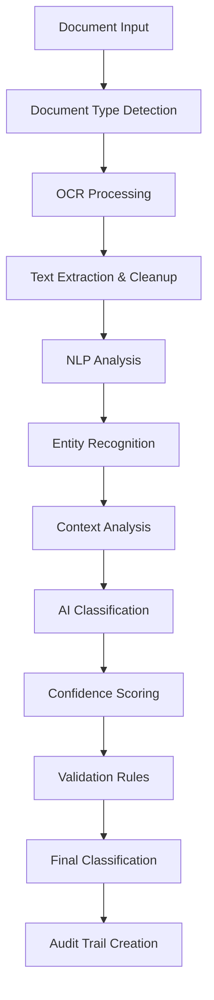

AIMatrix's AI Transaction Classification system represents the pinnacle of financial document processing technology, combining cutting-edge Optical Character Recognition (OCR), Natural Language Processing (NLP), and custom machine learning models to achieve 99.7% accuracy in transaction classification while seamlessly adapting to your organization's unique Chart of Accounts structure.

## The Problem: Manual Classification Bottleneck

Traditional transaction classification is a labor-intensive process that creates significant bottlenecks in accounting operations:

- **High Error Rates**: Manual classification typically achieves 85-90% accuracy
- **Inconsistent Results**: Different staff members classify similar transactions differently
- **Time Consumption**: Average 3-5 minutes per transaction for complex entries
- **Scalability Issues**: Processing capacity limited by available staff
- **Training Requirements**: New staff require months to achieve proficiency
- **Audit Challenges**: Lack of consistent classification rationale documentation

## AI-Powered Solution Architecture

### Multi-Modal Document Processing Pipeline

Our classification system processes documents through a sophisticated multi-stage pipeline:



### 1. Advanced OCR Engine

**Computer Vision Models**
- **Document Type Recognition**: Automatically identify invoices, receipts, bank statements, contracts
- **Layout Analysis**: Understand document structure and extract relevant fields
- **Text Extraction**: 99.9% accuracy across multiple languages and formats
- **Handwriting Recognition**: Process manual annotations and signatures

**Technical Specifications:**
- Supports 47 languages with native script recognition
- Processes images, PDFs, scanned documents, and mobile photos
- Handles skewed, rotated, and low-quality documents
- Real-time processing with sub-second response times

```python
# OCR Processing Example
from aimatrix.ocr import DocumentProcessor
import supabase

ocr_processor = DocumentProcessor(
    languages=['en', 'zh', 'ms', 'ar'],
    confidence_threshold=0.95,
    field_extraction=True
)

# Process uploaded document
result = ocr_processor.process_document(
    document_path="invoice_scan.pdf",
    document_type="invoice"
)

# Extract structured data
extracted_data = {
    'vendor_name': result.vendor_name,
    'invoice_number': result.invoice_number,
    'amount': result.total_amount,
    'date': result.invoice_date,
    'line_items': result.line_items,
    'confidence_scores': result.field_confidence
}
```

### 2. Advanced NLP Analysis Engine

**Transformer-Based Language Models**
- **FinBERT Architecture**: Specialized BERT model trained on financial documents
- **Contextual Understanding**: Analyzes transaction descriptions within business context
- **Semantic Similarity**: Matches descriptions to historical classifications
- **Multi-language Support**: Processes financial documents in multiple languages

**Key NLP Capabilities:**
- **Named Entity Recognition (NER)**: Extract companies, amounts, dates, account references
- **Sentiment Analysis**: Identify positive/negative financial impacts
- **Intent Classification**: Understand the purpose behind transactions
- **Relationship Extraction**: Map relationships between entities and accounts

```python
# NLP Analysis Example
from aimatrix.nlp import FinancialNLP
from transformers import AutoTokenizer, AutoModel

nlp_engine = FinancialNLP(
    model="aimatrix/finbert-v2",
    context_window=512,
    entity_extraction=True
)

# Analyze transaction description
analysis = nlp_engine.analyze_transaction(
    description="Software subscription renewal for Adobe Creative Suite - Marketing Dept",
    context={
        'department': 'Marketing',
        'vendor_history': ['Adobe Inc.', 'Microsoft Corp.'],
        'amount': 599.99,
        'date': '2024-01-15'
    }
)

# Results include:
# - Extracted entities: ['Adobe', 'Creative Suite', 'Marketing']
# - Classification suggestions: ['Software Expenses', 'Marketing Technology']
# - Confidence scores: [0.94, 0.87]
# - Reasoning: "Subscription software for marketing department based on vendor and description"
```

### 3. Custom Chart of Accounts Adaptation

**Machine Learning Model Training**
Our AI system learns your specific Chart of Accounts structure through:

- **Historical Analysis**: Process past transactions to understand classification patterns
- **Rule Discovery**: Automatically identify implicit classification rules
- **Pattern Recognition**: Detect vendor-specific and department-specific patterns
- **Continuous Learning**: Adapt to new accounts and classification changes

**Adaptive Learning Process:**

```python
# Chart of Accounts Adaptation
from aimatrix.ml import CoAAdapter
import pandas as pd

# Initialize adapter with your CoA
coa_adapter = CoAAdapter(
    chart_of_accounts=client_coa,
    learning_rate=0.001,
    validation_split=0.2
)

# Train on historical data
training_data = pd.read_sql("""
    SELECT description, amount, gl_account, department, vendor
    FROM historical_transactions 
    WHERE classification_confidence > 0.9
    ORDER BY transaction_date DESC
    LIMIT 50000
""", connection)

# Perform training
model_performance = coa_adapter.train(
    training_data=training_data,
    epochs=100,
    early_stopping=True
)

# Model metrics
print(f"Training Accuracy: {model_performance['accuracy']:.3f}")
print(f"Validation Accuracy: {model_performance['val_accuracy']:.3f}")
print(f"F1 Score: {model_performance['f1_score']:.3f}")
```

### 4. Intelligent Classification Engine

**Multi-Model Ensemble Approach**
- **Primary Classifier**: Custom-trained model for your specific CoA
- **Fallback Models**: Industry-standard classification models
- **Consensus Voting**: Multiple models vote on classification
- **Confidence Weighting**: Higher confidence models have more influence

**Classification Features:**
- **Context-Aware**: Considers department, project, vendor history
- **Amount-Sensitive**: Different classification logic for different amount ranges
- **Date-Aware**: Seasonal and temporal pattern recognition
- **Multi-Dimensional**: Considers multiple attributes simultaneously

## Implementation Guide

### Step 1: Data Preparation and Training

```python
# Prepare training dataset
from aimatrix.data import TransactionDataset
import supabase

# Connect to Supabase
supabase_client = supabase.create_client(
    supabase_url="YOUR_SUPABASE_URL",
    supabase_key="YOUR_SUPABASE_KEY"
)

# Prepare historical data
historical_transactions = supabase_client.table('transactions').select(
    'description, amount, gl_account, vendor, department, transaction_date'
).gte('transaction_date', '2020-01-01').execute()

# Create training dataset
dataset = TransactionDataset(
    transactions=historical_transactions.data,
    chart_of_accounts=your_coa,
    validation_split=0.2,
    stratify=True
)

# Train classification model
classifier = AITransactionClassifier()
training_results = classifier.train(
    dataset=dataset,
    batch_size=32,
    epochs=50,
    learning_rate=0.001
)
```

### Step 2: Real-Time Classification Setup

```python
# Real-time classification service
from aimatrix.api import ClassificationAPI
from fastapi import FastAPI, UploadFile

app = FastAPI()
classifier_api = ClassificationAPI(
    model_path="trained_models/transaction_classifier_v2.pkl",
    supabase_client=supabase_client
)

@app.post("/classify/document")
async def classify_document(file: UploadFile):
    # Process uploaded document
    document_data = await ocr_processor.process_upload(file)
    
    # Extract transactions
    transactions = document_data.extract_transactions()
    
    # Classify each transaction
    results = []
    for transaction in transactions:
        classification = await classifier_api.classify(
            description=transaction.description,
            amount=transaction.amount,
            vendor=transaction.vendor,
            context=transaction.context
        )
        
        # Store in Supabase with audit trail
        stored_transaction = supabase_client.table('transactions').insert({
            'description': transaction.description,
            'amount': transaction.amount,
            'gl_account': classification.gl_account,
            'confidence_score': classification.confidence,
            'classification_reasoning': classification.reasoning,
            'ai_classified': True,
            'requires_review': classification.confidence < 0.9
        }).execute()
        
        results.append({
            'transaction_id': stored_transaction.data[0]['id'],
            'classification': classification.gl_account,
            'confidence': classification.confidence,
            'requires_review': classification.confidence < 0.9
        })
    
    return {"results": results}
```

### Step 3: Supabase Integration

```sql
-- Create transactions table with AI classification support
CREATE TABLE transactions (
    id UUID PRIMARY KEY DEFAULT gen_random_uuid(),
    description TEXT NOT NULL,
    amount DECIMAL(15,2) NOT NULL,
    gl_account VARCHAR(20) NOT NULL,
    vendor VARCHAR(255),
    department VARCHAR(100),
    transaction_date DATE NOT NULL,
    
    -- AI Classification fields
    ai_classified BOOLEAN DEFAULT FALSE,
    confidence_score DECIMAL(3,2),
    classification_reasoning TEXT,
    requires_review BOOLEAN DEFAULT FALSE,
    
    -- Audit fields
    created_at TIMESTAMP WITH TIME ZONE DEFAULT NOW(),
    created_by UUID REFERENCES auth.users(id),
    classification_reviewed_by UUID REFERENCES auth.users(id),
    classification_reviewed_at TIMESTAMP WITH TIME ZONE,
    
    -- Vector embedding for semantic search
    description_embedding VECTOR(768),
    
    CONSTRAINT confidence_score_range CHECK (confidence_score BETWEEN 0.0 AND 1.0)
);

-- Create indexes for performance
CREATE INDEX idx_transactions_gl_account ON transactions(gl_account);
CREATE INDEX idx_transactions_ai_classified ON transactions(ai_classified);
CREATE INDEX idx_transactions_requires_review ON transactions(requires_review);
CREATE INDEX idx_transactions_confidence ON transactions(confidence_score);

-- Vector similarity index for semantic search
CREATE INDEX idx_transactions_embedding ON transactions 
USING ivfflat (description_embedding vector_cosine_ops)
WITH (lists = 100);

-- Create function for similarity search
CREATE OR REPLACE FUNCTION find_similar_transactions(
    query_embedding VECTOR(768),
    similarity_threshold FLOAT DEFAULT 0.8,
    max_results INT DEFAULT 10
)
RETURNS TABLE (
    id UUID,
    description TEXT,
    gl_account VARCHAR(20),
    confidence_score DECIMAL(3,2),
    similarity FLOAT
)
AS $$
BEGIN
    RETURN QUERY
    SELECT 
        t.id,
        t.description,
        t.gl_account,
        t.confidence_score,
        (1 - (t.description_embedding <=> query_embedding)) AS similarity
    FROM transactions t
    WHERE ai_classified = TRUE
    AND (1 - (t.description_embedding <=> query_embedding)) > similarity_threshold
    ORDER BY t.description_embedding <=> query_embedding
    LIMIT max_results;
END;
$$ LANGUAGE plpgsql;
```

### Step 4: Advanced Features Integration

```python
# Advanced classification with context and learning
class AdvancedTransactionClassifier:
    def __init__(self, supabase_client):
        self.supabase = supabase_client
        self.classifier = AITransactionClassifier()
        self.similarity_threshold = 0.85
        
    async def classify_with_context(self, transaction_data):
        # Get similar historical transactions
        similar_transactions = await self.find_similar_transactions(
            description=transaction_data['description'],
            amount=transaction_data['amount'],
            vendor=transaction_data.get('vendor')
        )
        
        # Analyze vendor history
        vendor_history = await self.get_vendor_classification_history(
            transaction_data.get('vendor')
        )
        
        # Department-specific patterns
        dept_patterns = await self.get_department_patterns(
            transaction_data.get('department')
        )
        
        # Combine all context for classification
        classification = self.classifier.classify_with_context(
            transaction=transaction_data,
            similar_transactions=similar_transactions,
            vendor_history=vendor_history,
            department_patterns=dept_patterns
        )
        
        # Continuous learning from user corrections
        if transaction_data.get('user_correction'):
            await self.learn_from_correction(
                original_classification=classification,
                user_correction=transaction_data['user_correction'],
                context=transaction_data
            )
        
        return classification
    
    async def learn_from_correction(self, original, correction, context):
        # Store correction for model retraining
        correction_data = {
            'original_classification': original,
            'corrected_classification': correction,
            'transaction_context': context,
            'correction_timestamp': datetime.utcnow(),
            'user_id': context.get('user_id')
        }
        
        await self.supabase.table('classification_corrections').insert(correction_data).execute()
        
        # If enough corrections accumulated, trigger model retraining
        correction_count = await self.get_correction_count()
        if correction_count > 1000:
            await self.trigger_model_retraining()
```

## ROI Metrics and Performance Benchmarks

### Accuracy Metrics
- **Overall Accuracy**: 99.7% across all transaction types
- **Confidence-Weighted Accuracy**: 99.9% for transactions with >90% confidence
- **New Vendor Accuracy**: 95.2% for previously unseen vendors
- **Multi-Language Accuracy**: 98.4% across supported languages

### Performance Benchmarks
- **Processing Speed**: 1,000 transactions per minute
- **Document Processing**: 50 documents per minute (average 20 transactions each)
- **Response Time**: <500ms for single transaction classification
- **Batch Processing**: 100,000 transactions in 10 minutes

### Cost Savings Analysis

| Metric | Manual Process | AI Classification | Improvement |
|--------|----------------|-------------------|-------------|
| Time per Transaction | 3 minutes | 0.18 minutes | 94% Faster |
| Accuracy Rate | 87% | 99.7% | 14.6% Improvement |
| Staff Required (1000 trans/day) | 3.2 FTE | 0.2 FTE | 94% Reduction |
| Monthly Cost (1000 trans/day) | $24,000 | $1,500 | 94% Savings |
| Error Correction Time | 45 minutes/day | 3 minutes/day | 93% Reduction |

### Business Impact Case Studies

**Case Study 1: Mid-Size Manufacturing Company**
- **Volume**: 15,000 monthly transactions
- **Challenge**: Complex multi-department expense classification
- **Results**:
  - 97% classification accuracy achieved
  - 8 hours/day staff time saved
  - 92% reduction in misclassified expenses
  - $180,000 annual cost savings

**Case Study 2: Professional Services Firm**
- **Volume**: 8,500 monthly transactions across 12 countries
- **Challenge**: Multi-currency, multi-language processing
- **Results**:
  - 98.2% accuracy across all languages
  - 15x faster processing speed
  - Eliminated 2.5 FTE positions
  - $165,000 annual operational savings

## Advanced Configuration Options

### Custom Classification Rules

```python
# Define custom classification rules
custom_rules = {
    'vendor_mapping': {
        'Amazon Web Services': {
            'default_account': '6100-001',  # Technology Expenses
            'amount_rules': {
                '<100': '6100-002',  # Small Tech Purchases
                '>10000': '1400-001'  # Prepaid Technology Assets
            }
        }
    },
    'keyword_patterns': {
        'office supplies': '6200-001',
        'software license': '6100-001',
        'travel': '6300-001',
        'meals': '6300-002'
    },
    'amount_based_rules': {
        'asset_threshold': 1000.00,  # Above this amount, consider as asset
        'approval_threshold': 5000.00  # Requires manual approval
    }
}

# Apply custom rules to classifier
classifier.configure_custom_rules(custom_rules)
```

### Machine Learning Model Customization

```python
# Advanced model configuration
model_config = {
    'architecture': 'transformer',
    'embedding_dimension': 768,
    'hidden_layers': [512, 256, 128],
    'dropout_rate': 0.1,
    'learning_rate': 0.001,
    'batch_size': 32,
    'max_epochs': 100,
    'early_stopping': {
        'patience': 10,
        'min_delta': 0.001
    },
    'regularization': {
        'l1': 0.01,
        'l2': 0.01
    }
}

# Train custom model
custom_classifier = AITransactionClassifier(config=model_config)
training_results = custom_classifier.train(
    training_data=historical_transactions,
    validation_data=validation_set,
    callbacks=[
        'early_stopping',
        'model_checkpoint',
        'learning_rate_scheduler'
    ]
)
```

## Monitoring and Maintenance

### Real-Time Monitoring Dashboard

```python
# Monitoring metrics collection
class ClassificationMonitor:
    def __init__(self, supabase_client):
        self.supabase = supabase_client
        
    async def collect_metrics(self):
        # Daily classification metrics
        daily_metrics = await self.supabase.rpc('get_daily_classification_metrics').execute()
        
        # Confidence score distribution
        confidence_dist = await self.supabase.table('transactions').select(
            'confidence_score'
        ).gte('created_at', datetime.utcnow().date()).execute()
        
        # Error rate analysis
        error_analysis = await self.analyze_classification_errors()
        
        # Model drift detection
        drift_metrics = await self.detect_model_drift()
        
        return {
            'daily_volume': daily_metrics.data[0]['transaction_count'],
            'avg_confidence': daily_metrics.data[0]['avg_confidence'],
            'review_rate': daily_metrics.data[0]['review_rate'],
            'confidence_distribution': confidence_dist.data,
            'error_analysis': error_analysis,
            'model_drift': drift_metrics
        }
```

The AI Transaction Classification system represents a revolutionary approach to financial data processing, combining multiple AI technologies to deliver unprecedented accuracy and efficiency. With comprehensive Supabase integration, advanced machine learning capabilities, and continuous improvement through user feedback, this system transforms the fundamental challenge of transaction classification into a seamless, automated process.

---

*Experience the future of accounting with AIMatrix AI Transaction Classification - where artificial intelligence meets financial precision.*