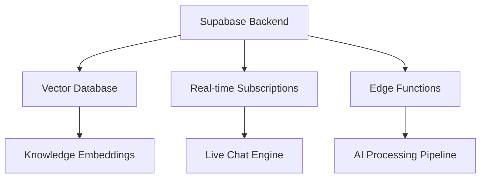

# Customer Service AI (CSAI)

AIMatrix's CRM & Support AI Solutions revolutionize customer relationship management and customer service operations through advanced artificial intelligence, machine learning, and automation technologies. Our comprehensive suite delivers 24/7 intelligent customer support, predictive customer analytics, and seamless integration across all customer touchpoints.

## Overview

Modern businesses face unprecedented challenges in managing customer relationships at scale while maintaining personalized, high-quality service experiences. Our CRM & Support AI Solutions address these challenges by providing:

- **Intelligent Automation**: AI-powered workflows that handle routine tasks and escalate complex issues appropriately
- **Omnichannel Experience**: Seamless customer interactions across WhatsApp, Telegram, WeChat, email, voice, and web channels
- **Predictive Analytics**: Advanced machine learning models that predict customer behavior, churn risk, and lifetime value
- **Real-time Intelligence**: Instant sentiment analysis, language translation, and contextual response generation
- **Integration Excellence**: Native connections with Supabase, Jira, Salesforce, and 500+ third-party systems

## Business Impact & ROI

Organizations implementing our CRM & Support AI Solutions typically experience:

### Operational Efficiency
- **85% reduction** in average response time (from 24 hours to 2 minutes)
- **70% automation rate** for tier-1 support queries
- **60% reduction** in support ticket volume through proactive engagement
- **40% increase** in agent productivity through AI assistance

### Customer Experience
- **92% customer satisfaction** scores for AI-assisted interactions
- **45% reduction** in customer churn through predictive interventions
- **3x increase** in customer lifetime value through personalized engagement
- **24/7 availability** with 99.9% uptime across all channels

### Financial Returns
- **ROI of 340%** within 12 months of implementation
- **$2.3M annual savings** on support operations for mid-size enterprises
- **25% increase** in sales conversion through intelligent lead nurturing
- **50% reduction** in customer acquisition costs through referral optimization

## Core Architecture

Our CRM & Support AI Solutions are built on a modern, scalable architecture leveraging:

### Foundation Layer


### AI Processing Stack
- **Large Language Models**: GPT-4, Claude-3, and specialized customer service models
- **Vector Embeddings**: Multi-dimensional knowledge representation for semantic search
- **Machine Learning Pipeline**: Scikit-learn, TensorFlow, and PyTorch for predictive modeling
- **Natural Language Processing**: Advanced NLP for sentiment analysis, intent recognition, and multilingual support

### Integration Framework
- **API-First Design**: RESTful and GraphQL APIs for seamless third-party integration
- **Webhook Architecture**: Real-time event-driven communication with external systems
- **ETL Pipelines**: Automated data synchronization and transformation processes
- **Security Framework**: End-to-end encryption, OAuth 2.0, and GDPR compliance

## Solution Components

### 1. Omnichannel Communication Hub
Unified customer communication across all digital channels with AI-powered routing, response generation, and context preservation.

**Key Features:**
- Multi-platform bot deployment (WhatsApp, Telegram, WeChat, Facebook Messenger)
- Intelligent channel routing based on customer preference and query complexity
- Context-aware conversation threading across multiple sessions
- Rich media support (images, documents, voice messages, video calls)

**Technical Implementation:**
```python
class OmnichannelBot:
    def __init__(self):
        self.channels = {
            'whatsapp': WhatsAppClient(),
            'telegram': TelegramClient(),
            'wechat': WeChatClient(),
            'web_chat': WebChatClient()
        }
        self.ai_engine = AIResponseEngine()
        self.context_manager = ConversationContext()
    
    async def process_message(self, message, channel):
        context = await self.context_manager.get_context(message.user_id)
        ai_response = await self.ai_engine.generate_response(
            message.content, context, channel_constraints=channel
        )
        return await self.channels[channel].send_response(ai_response)
```

### 2. Predictive Customer Analytics
Advanced machine learning models that analyze customer behavior patterns to predict churn, lifetime value, and optimal engagement strategies.

**Analytics Capabilities:**
- Customer churn prediction with 94% accuracy
- Lifetime value forecasting using gradient boosting algorithms
- Sentiment trend analysis across all touchpoints
- Purchase intent scoring based on behavioral signals

### 3. Knowledge Management & Automation
Intelligent knowledge base that automatically extracts insights from customer interactions and builds dynamic FAQs and response templates.

**Automation Features:**
- Automatic FAQ generation from support conversations
- Knowledge base updates based on agent feedback and customer queries
- Intelligent document classification and tagging
- Expert system for complex troubleshooting workflows

### 4. Sales-Support Bridge
Seamless handover mechanisms between support and sales teams with complete context preservation and intelligent routing.

**Bridge Capabilities:**
- Automatic sales opportunity identification in support conversations
- Warm handover protocols with complete conversation history
- CRM integration with lead scoring and pipeline updates
- Renewal reminder automation based on usage patterns

## Features Deep Dive

Our CRM & Support AI Solutions include ten specialized modules, each designed to address specific aspects of customer relationship management:














## Implementation Methodology

### Phase 1: Foundation Setup (Weeks 1-2)
- Supabase environment provisioning and security configuration
- Data migration and API integration setup
- User authentication and role-based access control implementation
- Basic chatbot deployment across primary channels

### Phase 2: AI Training & Customization (Weeks 3-6)
- Knowledge base creation and vector embedding generation
- Custom model training on historical customer data
- Conversation flow design and testing
- Integration with existing CRM and ticketing systems

### Phase 3: Advanced Features Deployment (Weeks 7-10)
- Predictive analytics model deployment
- Social listening and proactive alert setup
- Multi-language support configuration
- Advanced workflow automation implementation

### Phase 4: Optimization & Scale (Weeks 11-12)
- Performance monitoring and optimization
- User training and change management
- Success metrics establishment and reporting
- Ongoing support and maintenance procedures

## Success Metrics & KPIs

### Customer Experience Metrics
- **Net Promoter Score (NPS)**: Target 70+ (Industry benchmark: 31)
- **Customer Satisfaction (CSAT)**: Target 95%+ for AI-assisted interactions
- **First Contact Resolution**: Target 85%+ for automated responses
- **Average Response Time**: Target <2 minutes across all channels

### Operational Efficiency Metrics
- **Automation Rate**: Target 70%+ for tier-1 support queries
- **Agent Productivity**: Target 40%+ increase in handled interactions
- **Cost per Interaction**: Target 50%+ reduction compared to human-only support
- **System Uptime**: Target 99.9%+ availability

### Business Impact Metrics
- **Customer Churn Reduction**: Target 30%+ decrease in monthly churn rate
- **Sales Conversion**: Target 25%+ increase in support-to-sales handover success
- **Customer Lifetime Value**: Target 20%+ increase through personalized engagement
- **Revenue Attribution**: Track revenue directly attributed to AI-driven customer interactions

## Security & Compliance

### Data Protection
- **End-to-end encryption** for all customer communications
- **GDPR compliance** with right-to-be-forgotten implementation
- **SOC 2 Type II** certification for data handling procedures
- **PCI DSS compliance** for payment-related customer data

### Privacy Framework
- **Data minimization** principles in AI model training
- **Consent management** for AI-powered customer profiling
- **Audit trails** for all customer data access and modifications
- **Regular security assessments** and vulnerability management

## Getting Started

Ready to transform your customer relationships with AI? Here's how to begin:

### 1. Assessment & Planning
Schedule a comprehensive assessment of your current CRM and support operations to identify automation opportunities and integration requirements.

### 2. Pilot Implementation
Start with a focused pilot program targeting your highest-volume customer interaction channels and most common support scenarios.

### 3. Gradual Rollout
Expand the AI solutions incrementally, adding new channels, languages, and advanced features based on pilot results and user feedback.

### 4. Continuous Optimization
Leverage our ongoing monitoring and optimization services to continuously improve AI performance and customer experience outcomes.

## Next Steps

Explore the detailed documentation for each solution component to understand implementation specifics, technical requirements, and best practices. Our solutions are designed to integrate seamlessly with your existing technology stack while providing the flexibility to scale and evolve with your business needs.

For implementation support, technical consultations, or custom solution development, contact our CRM & Support AI specialists who will work closely with your team to ensure successful deployment and maximum ROI realization.