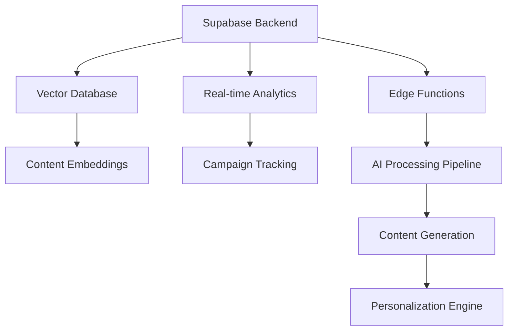

# Digital Marketing AI (DMAI)

AIMatrix's Digital Marketing AI Solutions revolutionize marketing operations through advanced artificial intelligence, machine learning, and automation technologies. Our comprehensive suite transforms every aspect of digital marketing, from content creation to campaign optimization, through intelligent automation, predictive analytics, and personalized customer journey orchestration.

## Overview

Modern marketing teams face unprecedented challenges in managing complex multi-channel campaigns while delivering personalized experiences at scale. Our Digital Marketing AI Solutions address these challenges by providing:

- **Campaign Automation**: AI-powered campaign creation, optimization, and management across all digital channels
- **Content Generation**: Intelligent content creation, optimization, and personalization for maximum engagement
- **SEO Optimization**: Advanced SEO automation with keyword research, content optimization, and technical SEO
- **Social Media Management**: Automated social media posting, engagement, and community management
- **Analytics & Insights**: Deep customer behavior analysis and predictive marketing intelligence
- **Personalization Engine**: Dynamic content and experience personalization based on user behavior and preferences

## Business Impact & ROI

Organizations implementing our Digital Marketing AI Solutions typically experience:

### Marketing Performance
- **250% increase** in campaign conversion rates through AI optimization
- **75% reduction** in content creation time through automated generation
- **90% improvement** in SEO rankings through intelligent optimization
- **150% increase** in social media engagement through personalized content

### Operational Efficiency
- **80% automation** of routine marketing tasks and workflows
- **60% reduction** in campaign setup and management time
- **85% improvement** in marketing attribution accuracy
- **70% increase** in marketing team productivity

### Financial Returns
- **ROI of 380%** within 12 months of implementation
- **$2.8M annual revenue increase** for mid-size enterprises through improved conversion
- **45% reduction** in marketing technology stack costs through consolidation
- **35% improvement** in customer lifetime value through personalization

## Core Architecture

Our Digital Marketing AI Solutions are built on a modern, scalable architecture leveraging:

### Foundation Layer


### AI Processing Stack
- **Large Language Models**: GPT-4, Claude-3, and specialized marketing content models
- **Computer Vision**: Advanced image and video analysis for visual content optimization
- **Machine Learning Pipeline**: TensorFlow, PyTorch, and scikit-learn for predictive marketing
- **Natural Language Processing**: Advanced NLP for content optimization, sentiment analysis, and SEO

### Integration Framework
- **Marketing Automation**: Native integration with HubSpot, Marketo, Pardot, and 150+ marketing platforms
- **Advertising Platforms**: Direct API integration with Google Ads, Facebook Ads, LinkedIn Ads, and programmatic platforms
- **Analytics Tools**: Real-time synchronization with Google Analytics, Adobe Analytics, and marketing intelligence platforms
- **Content Management**: Integration with WordPress, Drupal, Contentful, and headless CMS platforms

## Solution Components

### 1. Intelligent Campaign Automation
AI-powered campaign creation and optimization system that manages multi-channel marketing campaigns with automatic performance optimization and budget allocation.

**Key Features:**
- Multi-channel campaign orchestration (Google Ads, Facebook, LinkedIn, email, display)
- Automated A/B testing and performance optimization
- Dynamic budget allocation based on channel performance
- Real-time campaign adjustments and bid management

**Technical Implementation:**
```python
class CampaignAutomationEngine:
    def __init__(self):
        self.ad_platforms = {
            'google_ads': GoogleAdsClient(),
            'facebook_ads': FacebookAdsClient(),
            'linkedin_ads': LinkedInAdsClient(),
            'email_marketing': EmailClient()
        }
        self.optimization_engine = PerformanceOptimizer()
        self.budget_allocator = BudgetAllocationAI()
    
    async def optimize_campaigns(self, campaign_data):
        performance_metrics = await self.get_performance_data(campaign_data)
        optimization_recommendations = await self.optimization_engine.analyze(
            performance_metrics
        )
        
        for platform, recommendations in optimization_recommendations.items():
            await self.ad_platforms[platform].apply_optimizations(recommendations)
        
        return await self.budget_allocator.reallocate_budget(campaign_data)
```

### 2. AI Content Generation & Optimization
Advanced content creation system that generates high-quality marketing content, optimizes for SEO and engagement, and personalizes content for different audience segments.

**Content Capabilities:**
- Blog posts, social media content, ad copy, and email campaigns
- SEO-optimized content with automatic keyword integration
- Multi-format content creation (text, images, videos, infographics)
- Brand voice consistency across all generated content

### 3. Advanced SEO Automation
Comprehensive SEO optimization system that automates keyword research, content optimization, technical SEO, and link building strategies.

**SEO Features:**
- Automated keyword research and opportunity identification
- Content optimization for search intent and user experience
- Technical SEO audits and automated fix recommendations
- Local SEO optimization and review management

### 4. Social Media Intelligence
AI-powered social media management platform that automates content creation, posting schedules, community engagement, and social listening.

**Social Capabilities:**
- Automated content creation tailored to each social platform
- Optimal posting time prediction based on audience behavior
- Community management with intelligent response generation
- Social listening and brand mention analysis with sentiment scoring

## Features Deep Dive

Our Digital Marketing AI Solutions include ten specialized modules, each designed to address specific aspects of digital marketing optimization:














## Implementation Methodology

### Phase 1: Foundation Setup (Weeks 1-3)
- Marketing platform integration and data connection
- Content management system setup and configuration
- Analytics tracking implementation and validation
- User authentication and role-based access control

### Phase 2: AI Model Training (Weeks 4-8)
- Historical marketing data analysis and model training
- Content generation system customization and brand voice training
- SEO optimization engine calibration and keyword research setup
- Social media intelligence configuration and audience analysis

### Phase 3: Advanced Features Deployment (Weeks 9-14)
- Campaign automation workflows deployment and testing
- Personalization engine implementation and audience segmentation
- Competitive intelligence system setup and monitoring
- Advanced analytics dashboard and reporting configuration

### Phase 4: Optimization & Scale (Weeks 15-18)
- Performance monitoring and model refinement
- Marketing team training and change management
- Success metrics establishment and KPI tracking
- Ongoing optimization and support procedures

## Success Metrics & KPIs

### Campaign Performance Metrics
- **Click-Through Rate (CTR)**: Target 4x industry average through AI optimization
- **Conversion Rate**: Target 300%+ improvement through personalization
- **Cost Per Acquisition (CPA)**: Target 50%+ reduction through automation
- **Return on Ad Spend (ROAS)**: Target 6:1 minimum across all channels

### Content Marketing Metrics
- **Content Engagement**: Target 200%+ increase in average engagement rates
- **SEO Rankings**: Target 75%+ of target keywords in top 10 search results
- **Content Production**: Target 500%+ increase in content output through automation
- **Brand Awareness**: Target 150%+ increase in branded search volume

### Business Impact Metrics
- **Marketing Qualified Leads (MQLs)**: Target 400%+ increase in qualified lead volume
- **Customer Acquisition Cost**: Target 40%+ reduction through optimization
- **Customer Lifetime Value**: Target 35%+ increase through personalization
- **Revenue Attribution**: Target 95%+ accuracy in marketing attribution

## Security & Compliance

### Data Protection
- **End-to-end encryption** for all customer and campaign data
- **GDPR compliance** with privacy controls and data portability
- **CCPA compliance** for California consumer privacy protection
- **SOC 2 Type II** certification for marketing data security

### Privacy Framework
- **Cookie consent management** for all tracking and personalization
- **Data anonymization** in analytics and reporting
- **Opt-out mechanisms** for all automated marketing communications
- **Regular privacy audits** and compliance assessments

## Getting Started

Ready to transform your digital marketing with AI? Here's how to begin:

### 1. Marketing Audit & Assessment
Conduct a comprehensive analysis of your current marketing operations to identify automation opportunities and optimization potential.

### 2. Pilot Campaign Launch
Start with a focused pilot campaign targeting your highest-value audience segment with AI-powered content and automation.

### 3. Gradual Platform Expansion
Scale the AI solutions across all marketing channels and campaigns based on pilot results and performance improvements.

### 4. Continuous Optimization
Leverage our ongoing monitoring and optimization services to continuously improve campaign performance and marketing ROI.

## Next Steps

Explore the detailed documentation for each solution component to understand implementation specifics, integration requirements, and best practices. Our solutions are designed to integrate seamlessly with your existing marketing technology stack while providing advanced AI capabilities for maximum impact.

For implementation support, technical consultations, or custom solution development, contact our Digital Marketing AI specialists who will work closely with your team to ensure successful deployment and exceptional marketing results.