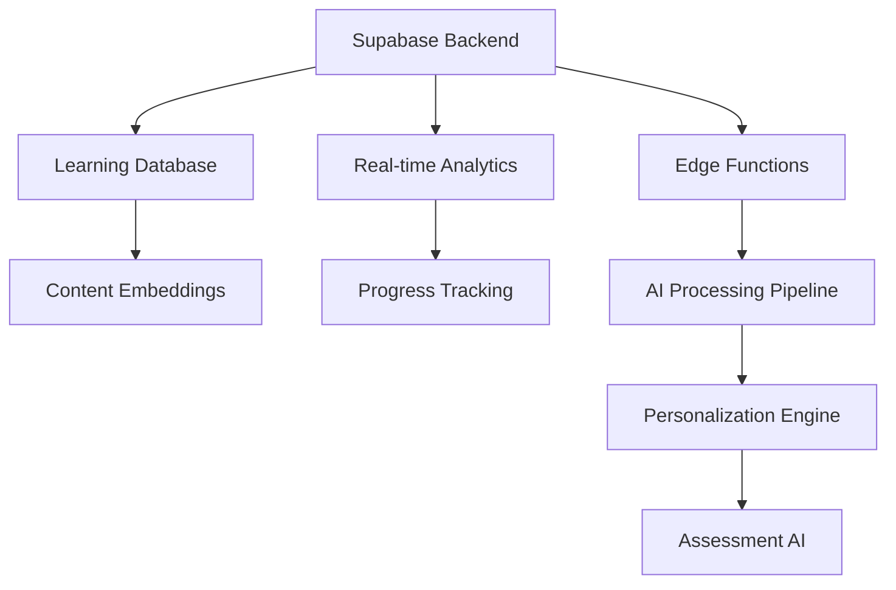

# Learning Management AI (LMAI)

AIMatrix's Learning Management AI Solutions revolutionize educational and corporate training programs through advanced artificial intelligence, machine learning, and automation technologies. Our comprehensive suite transforms every aspect of learning management, from personalized content delivery to skill assessment, through intelligent automation, adaptive learning algorithms, and predictive analytics.

## Overview

Modern educational institutions and corporate training programs face unprecedented challenges in delivering personalized, effective learning experiences at scale while tracking progress and ensuring competency development. Our Learning Management AI Solutions address these challenges by providing:

- **Personalized Learning Paths**: AI-powered curriculum adaptation based on individual learning styles, pace, and goals
- **Content Recommendation**: Intelligent content suggestion engine that optimizes learning outcomes
- **Progress Tracking**: Advanced analytics for learning progress monitoring and intervention identification
- **Skill Assessment**: Automated competency evaluation and gap analysis with personalized improvement plans
- **Certification Management**: Intelligent certification tracking, renewal management, and compliance monitoring
- **Learning Analytics**: Predictive insights for learner success and program optimization

## Business Impact & ROI

Organizations implementing our Learning Management AI Solutions typically experience:

### Learning Effectiveness
- **150% improvement** in learning retention rates through personalized approaches
- **75% reduction** in time to competency through optimized learning paths
- **90% increase** in course completion rates through adaptive content delivery
- **60% improvement** in skill assessment accuracy through AI-powered evaluation

### Operational Efficiency
- **80% automation** of administrative learning management tasks
- **65% reduction** in content creation time through AI assistance
- **70% improvement** in instructor productivity through intelligent insights
- **85% automation** of certification tracking and compliance monitoring

### Financial Returns
- **ROI of 390%** within 18 months of implementation
- **$2.6M annual savings** through operational efficiency and reduced training costs
- **45% reduction** in training delivery costs through automation
- **35% improvement** in employee skill development speed

## Core Architecture

Our Learning Management AI Solutions are built on a modern, scalable architecture leveraging:

### Foundation Layer


### AI Processing Stack
- **Large Language Models**: GPT-4, Claude-3, and specialized educational content models
- **Machine Learning Pipeline**: Scikit-learn, TensorFlow, and reinforcement learning for adaptive systems
- **Natural Language Processing**: Advanced NLP for content analysis, question generation, and assessment
- **Computer Vision**: Image and video analysis for multimedia learning content optimization

### Integration Framework
- **LMS Platforms**: Native integration with Moodle, Canvas, Blackboard, and 50+ learning systems
- **Content Management**: Integration with educational content repositories and authoring tools
- **HR Systems**: Seamless connection with HRIS platforms for employee development tracking
- **Assessment Tools**: Integration with testing platforms, certification bodies, and evaluation systems

## Solution Components

### 1. Adaptive Learning Path Engine
AI-powered learning system that creates personalized learning journeys, adapts content difficulty in real-time, and optimizes learning sequences for maximum effectiveness.

**Key Features:**
- Individualized curriculum generation based on learning goals and prerequisites
- Real-time difficulty adjustment based on learner performance and engagement
- Multi-modal learning preference accommodation (visual, auditory, kinesthetic)
- Competency-based progression with mastery verification

**Technical Implementation:**
```python
class AdaptiveLearningEngine:
    def __init__(self):
        self.learner_profiler = LearnerProfiler()
        self.content_optimizer = ContentOptimizer()
        self.path_generator = LearningPathGenerator()
        self.difficulty_adjuster = DifficultyAdjuster()
    
    async def generate_personalized_path(self, learner_id, learning_objectives):
        learner_profile = await self.learner_profiler.analyze_learner(learner_id)
        optimal_sequence = await self.path_generator.create_sequence(
            learning_objectives, learner_profile
        )
        
        for module in optimal_sequence:
            adapted_content = await self.content_optimizer.adapt_content(
                module, learner_profile
            )
            module.content = adapted_content
        
        return {
            'learning_path': optimal_sequence,
            'estimated_completion_time': self.estimate_completion_time(
                optimal_sequence, learner_profile
            ),
            'success_probability': await self.predict_success_rate(
                optimal_sequence, learner_profile
            )
        }
```

### 2. Intelligent Content Recommendation
Machine learning-powered content recommendation system that suggests optimal learning materials, exercises, and resources based on individual learner needs and performance patterns.

**Recommendation Capabilities:**
- Personalized content suggestions based on learning style and performance
- Collaborative filtering using peer learner success patterns
- Content gap identification and remedial resource recommendation
- Multimedia content optimization for different learning preferences

### 3. Advanced Progress Analytics
Comprehensive learning analytics platform that tracks learner progress, identifies at-risk learners, and provides predictive insights for intervention and support.

**Analytics Features:**
- Real-time progress monitoring with predictive completion modeling
- At-risk learner identification using machine learning algorithms
- Learning effectiveness analysis with content optimization recommendations
- Skill development tracking with competency gap analysis

### 4. AI-Powered Assessment & Certification
Intelligent assessment system that creates adaptive tests, provides automated grading, and manages certification processes with fraud detection and verification.

**Assessment Capabilities:**
- Adaptive testing that adjusts question difficulty based on responses
- Automated essay grading and feedback generation
- Proctoring and fraud detection for online assessments
- Certification compliance tracking and automated renewal management

## Features Deep Dive

Our Learning Management AI Solutions include ten specialized modules, each designed to address specific aspects of learning management and educational delivery:














## Implementation Methodology

### Phase 1: Foundation Setup (Weeks 1-4)
- Learning management system integration and data migration
- Learner profile creation and baseline assessment
- Content repository setup and initial categorization
- User authentication and role-based access control implementation

### Phase 2: AI Model Training (Weeks 5-10)
- Historical learning data analysis and model training
- Personalization algorithm calibration and testing
- Content recommendation engine development
- Assessment AI system configuration and validation

### Phase 3: Advanced Features Deployment (Weeks 11-16)
- Adaptive learning path system implementation
- Advanced analytics dashboard deployment
- Certification management workflow setup
- Mobile learning platform configuration

### Phase 4: Optimization & Scale (Weeks 17-20)
- Performance monitoring and model refinement
- Educator and learner training programs
- Success metrics establishment and KPI tracking
- Ongoing optimization and support procedures

## Success Metrics & KPIs

### Learning Effectiveness Metrics
- **Course Completion Rate**: Target 85%+ completion rate across all programs
- **Knowledge Retention**: Target 90%+ retention rate after 30 days
- **Skill Acquisition**: Target 80%+ competency achievement in designated skills
- **Learning Satisfaction**: Target 4.5/5 average learner satisfaction score

### Engagement Metrics
- **Time on Platform**: Target 40%+ increase in active learning time
- **Content Interaction**: Target 70%+ engagement with recommended content
- **Peer Collaboration**: Target 50%+ participation in collaborative learning activities
- **Mobile Usage**: Target 60%+ of learning activities on mobile devices

### Business Impact Metrics
- **Training Cost Reduction**: Target 35%+ reduction in per-learner training costs
- **Time to Competency**: Target 50%+ reduction in time to achieve job competency
- **Employee Performance**: Target 25%+ improvement in job performance metrics
- **Certification Compliance**: Target 98%+ compliance with required certifications

## Security & Compliance

### Data Protection
- **End-to-end encryption** for all learner data and educational content
- **FERPA compliance** for educational privacy and student records
- **GDPR compliance** with learner data portability and deletion rights
- **SOC 2 Type II** certification for learning data security

### Educational Standards
- **SCORM compliance** for interoperable learning content
- **xAPI (Tin Can API)** support for comprehensive learning experience tracking
- **QTI compliance** for standardized assessment and testing
- **Accessibility standards** compliance (WCAG 2.1 AA) for inclusive learning

## Getting Started

Ready to transform your learning management with AI? Here's how to begin:

### 1. Learning Needs Assessment
Conduct a comprehensive analysis of your current learning programs to identify personalization opportunities and effectiveness gaps.

### 2. Pilot Program Launch
Start with a focused pilot targeting a specific course or learning program to demonstrate AI-powered improvements.

### 3. Gradual Platform Expansion
Scale the AI solutions across all learning programs and user groups based on pilot results and learner feedback.

### 4. Continuous Optimization
Leverage our ongoing monitoring and optimization services to continuously improve learning outcomes and system effectiveness.

## Next Steps

Explore the detailed documentation for each solution component to understand implementation specifics, integration requirements, and educational best practices. Our solutions are designed to integrate seamlessly with your existing learning management systems while providing advanced AI capabilities for maximum educational impact.

For implementation support, technical consultations, or custom solution development, contact our Learning Management AI specialists who will work closely with your team to ensure successful deployment and exceptional learning outcomes.