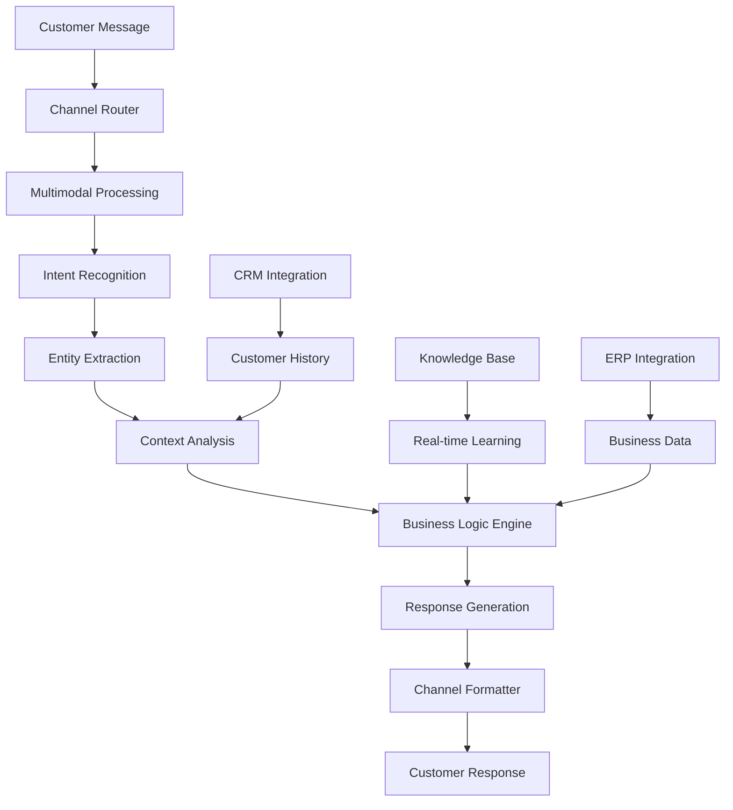

AIMatrix's Omnichannel Customer Support AI transforms customer service into an intelligent, automated experience that operates seamlessly across Telegram, WhatsApp, web chat, voice, and email. Our multimodal AI understands text, voice, images, and documents, providing customers with instant, accurate support while dramatically reducing operational costs.

## The Customer Support Challenge

Traditional customer support systems struggle with modern expectations:

- **Limited Availability**: Human agents constrained by working hours and time zones
- **Inconsistent Service**: Variable quality and response times across different agents
- **High Operational Costs**: 3-5 FTE required for basic customer service coverage
- **Language Barriers**: Limited multilingual support capabilities
- **Channel Fragmentation**: Different experiences across communication platforms
- **Scalability Issues**: Unable to handle peak demand without significant staffing

## AI-Powered Omnichannel Architecture

### Intelligent Communication Engine



### Core Support Components

**1. Multimodal Understanding**
- **Text Processing**: Natural language understanding in 50+ languages
- **Voice Recognition**: Real-time speech-to-text with accent adaptation
- **Image Analysis**: Product recognition, damage assessment, document processing
- **Document Intelligence**: PDF, invoice, contract analysis and response

**2. Contextual Memory System**
- **Conversation History**: Complete interaction history across all channels
- **Customer Journey Mapping**: Understanding of customer lifecycle and preferences
- **Business Context**: Integration with order history, account status, and preferences
- **Predictive Context**: Anticipation of customer needs based on behavior patterns

**3. Intelligent Escalation**
- **Confidence Scoring**: Real-time assessment of AI response confidence
- **Human Handoff**: Seamless transfer to human agents when needed
- **Expert Routing**: Intelligent routing to specialized agents based on query type
- **Context Preservation**: Complete conversation context transferred to human agents

## Technical Implementation

### Omnichannel AI Framework

```python
# Comprehensive omnichannel customer support system
import asyncio
from datetime import datetime, timedelta
from aimatrix.support import CustomerSupportAI
from aimatrix.channels import TelegramBot, WhatsAppBot, WebChat, VoiceAssistant
from aimatrix.multimodal import MultimodalProcessor
import supabase

class OmnichannelSupportSystem:
    def __init__(self, supabase_client):
        self.supabase = supabase_client
        self.support_ai = CustomerSupportAI()
        self.multimodal_processor = MultimodalProcessor()
        self.channels = self.initialize_channels()
        
    def initialize_channels(self):
        """Initialize all communication channels"""
        return {
            'telegram': TelegramBot(self.process_message),
            'whatsapp': WhatsAppBot(self.process_message),
            'webchat': WebChat(self.process_message),
            'voice': VoiceAssistant(self.process_voice),
            'email': EmailProcessor(self.process_email)
        }
    
    async def process_message(self, message, channel, customer_id=None):
        """Process incoming customer message from any channel"""
        
        # Create or get customer session
        session = await self.get_or_create_session(
            customer_id, channel, message.get('phone_number')
        )
        
        # Process multimodal content
        processed_content = await self.multimodal_processor.process(
            message.get('text'),
            message.get('voice_file'),
            message.get('images', []),
            message.get('documents', [])
        )
        
        # Understand intent and extract entities
        intent_analysis = await self.support_ai.analyze_intent(
            processed_content, session.context
        )
        
        # Get customer context and history
        customer_context = await self.get_customer_context(session.customer_id)
        
        # Generate intelligent response
        response = await self.generate_response(
            intent_analysis, customer_context, session
        )
        
        # Check if human escalation needed
        if response.confidence < 0.7 or intent_analysis.requires_human:
            response = await self.escalate_to_human(
                session, intent_analysis, response
            )
        
        # Send response through appropriate channel
        await self.send_response(response, channel, session)
        
        # Update session and analytics
        await self.update_session(session, intent_analysis, response)
        
        return response
    
    async def generate_response(self, intent_analysis, customer_context, session):
        """Generate intelligent response based on intent and context"""
        
        if intent_analysis.intent == 'order_inquiry':
            return await self.handle_order_inquiry(
                intent_analysis.entities, customer_context
            )
        elif intent_analysis.intent == 'product_support':
            return await self.handle_product_support(
                intent_analysis.entities, customer_context
            )
        elif intent_analysis.intent == 'billing_inquiry':
            return await self.handle_billing_inquiry(
                intent_analysis.entities, customer_context
            )
        elif intent_analysis.intent == 'technical_support':
            return await self.handle_technical_support(
                intent_analysis.entities, customer_context, session
            )
        elif intent_analysis.intent == 'complaint_feedback':
            return await self.handle_complaint_feedback(
                intent_analysis.entities, customer_context
            )
        else:
            return await self.handle_general_inquiry(
                intent_analysis, customer_context, session
            )
    
    async def handle_order_inquiry(self, entities, customer_context):
        """Handle order-related inquiries with ERP integration"""
        
        # Extract order information
        order_number = entities.get('order_number')
        order_date = entities.get('order_date')
        
        # Query ERP system for order details
        if order_number:
            order_details = await self.get_order_details(order_number)
        elif order_date:
            order_details = await self.get_orders_by_date(
                customer_context.customer_id, order_date
            )
        else:
            # Get recent orders for customer
            order_details = await self.get_recent_orders(
                customer_context.customer_id, limit=5
            )
        
        if order_details:
            # Generate detailed response with order status
            response_text = await self.format_order_response(order_details)
            
            # Add tracking information if available
            if order_details.get('tracking_number'):
                tracking_info = await self.get_tracking_info(
                    order_details['tracking_number']
                )
                response_text += f"\n\nTracking Information:\n{tracking_info}"
            
            return {
                'text': response_text,
                'confidence': 0.95,
                'actions': ['track_order', 'modify_order', 'cancel_order'],
                'requires_human': False,
                'data': order_details
            }
        else:
            return {
                'text': "I couldn't find any orders matching your inquiry. Could you please provide your order number or check if you're using the correct account?",
                'confidence': 0.8,
                'requires_human': False,
                'suggested_actions': ['verify_account', 'search_by_email']
            }
    
    async def handle_technical_support(self, entities, customer_context, session):
        """Handle technical support with intelligent troubleshooting"""
        
        # Extract technical issue details
        product = entities.get('product')
        issue_type = entities.get('issue_type')
        error_message = entities.get('error_message')
        
        # Get product information and known issues
        if product:
            product_info = await self.get_product_info(product)
            known_issues = await self.get_known_issues(product, issue_type)
            
            # Generate troubleshooting steps
            troubleshooting_steps = await self.generate_troubleshooting_steps(
                product, issue_type, error_message, known_issues
            )
            
            response = {
                'text': f"I can help you troubleshoot the {product} {issue_type} issue. Let's try these steps:",
                'troubleshooting_steps': troubleshooting_steps,
                'confidence': 0.85,
                'requires_human': len(troubleshooting_steps) == 0,
                'escalation_reason': 'complex_technical_issue' if len(troubleshooting_steps) == 0 else None
            }
            
            # Start guided troubleshooting session
            session.active_troubleshooting = {
                'product': product,
                'issue_type': issue_type,
                'steps': troubleshooting_steps,
                'current_step': 0
            }
            
            return response
        else:
            return {
                'text': "I'd be happy to help with your technical issue. Could you tell me which product you're having trouble with?",
                'confidence': 0.9,
                'requires_human': False,
                'follow_up_questions': [
                    'What product are you using?',
                    'What specific issue are you experiencing?',
                    'When did the problem start?'
                ]
            }
```

### Supabase Schema for Customer Support

```sql
-- Customer support sessions
CREATE TABLE customer_support_sessions (
    id UUID PRIMARY KEY DEFAULT gen_random_uuid(),
    customer_id UUID,
    session_id VARCHAR(255) UNIQUE NOT NULL,
    
    -- Channel information
    channel VARCHAR(50) NOT NULL, -- telegram, whatsapp, webchat, voice, email
    channel_user_id VARCHAR(255),
    phone_number VARCHAR(20),
    
    -- Session details
    session_start TIMESTAMP WITH TIME ZONE DEFAULT NOW(),
    session_end TIMESTAMP WITH TIME ZONE,
    session_status VARCHAR(50) DEFAULT 'active',
    
    -- Context and state
    conversation_context JSONB DEFAULT '{}'::jsonb,
    session_variables JSONB DEFAULT '{}'::jsonb,
    active_troubleshooting JSONB,
    
    -- Language and preferences
    preferred_language VARCHAR(5) DEFAULT 'en',
    customer_timezone VARCHAR(50),
    
    -- Escalation tracking
    escalated_to_human BOOLEAN DEFAULT FALSE,
    escalation_reason VARCHAR(255),
    human_agent_id UUID REFERENCES auth.users(id),
    escalation_timestamp TIMESTAMP WITH TIME ZONE,
    
    -- Analytics
    message_count INTEGER DEFAULT 0,
    avg_response_time INTEGER DEFAULT 0, -- in seconds
    customer_satisfaction_score INTEGER CHECK (customer_satisfaction_score BETWEEN 1 AND 5),
    
    created_at TIMESTAMP WITH TIME ZONE DEFAULT NOW(),
    updated_at TIMESTAMP WITH TIME ZONE DEFAULT NOW()
);

-- Individual messages and interactions
CREATE TABLE support_interactions (
    id UUID PRIMARY KEY DEFAULT gen_random_uuid(),
    session_id UUID NOT NULL REFERENCES customer_support_sessions(id),
    
    -- Message details
    message_type VARCHAR(20) NOT NULL CHECK (message_type IN ('customer', 'ai', 'human_agent')),
    message_content TEXT NOT NULL,
    
    -- Multimodal content
    voice_file_url TEXT,
    images JSONB DEFAULT '[]'::jsonb,
    documents JSONB DEFAULT '[]'::jsonb,
    
    -- AI processing results
    intent_classification VARCHAR(100),
    entities_extracted JSONB DEFAULT '{}'::jsonb,
    confidence_score DECIMAL(3,2),
    processing_time_ms INTEGER,
    
    -- Response quality metrics
    response_relevance_score DECIMAL(3,2),
    customer_reaction VARCHAR(50), -- positive, negative, neutral, no_reaction
    
    -- Escalation indicators
    requires_human_escalation BOOLEAN DEFAULT FALSE,
    escalation_triggers JSONB DEFAULT '[]'::jsonb,
    
    -- Timestamp
    created_at TIMESTAMP WITH TIME ZONE DEFAULT NOW()
);

-- Knowledge base for AI responses
CREATE TABLE support_knowledge_base (
    id UUID PRIMARY KEY DEFAULT gen_random_uuid(),
    
    -- Knowledge entry details
    title VARCHAR(255) NOT NULL,
    category VARCHAR(100) NOT NULL,
    subcategory VARCHAR(100),
    keywords TEXT[] DEFAULT '{}',
    
    -- Content
    question TEXT NOT NULL,
    answer TEXT NOT NULL,
    detailed_response JSONB,
    
    -- Applicability
    product_categories TEXT[] DEFAULT '{}',
    customer_segments TEXT[] DEFAULT '{}',
    
    -- AI training data
    training_examples JSONB DEFAULT '[]'::jsonb,
    success_rate DECIMAL(5,2) DEFAULT 100.00,
    usage_count INTEGER DEFAULT 0,
    
    -- Content management
    status VARCHAR(20) DEFAULT 'active' CHECK (status IN ('active', 'inactive', 'pending_review')),
    last_updated TIMESTAMP WITH TIME ZONE DEFAULT NOW(),
    reviewed_by UUID REFERENCES auth.users(id),
    
    -- Search optimization
    search_vector TSVECTOR,
    content_embedding VECTOR(768),
    
    created_at TIMESTAMP WITH TIME ZONE DEFAULT NOW(),
    updated_at TIMESTAMP WITH TIME ZONE DEFAULT NOW()
);

-- Customer satisfaction and feedback
CREATE TABLE customer_feedback (
    id UUID PRIMARY KEY DEFAULT gen_random_uuid(),
    session_id UUID NOT NULL REFERENCES customer_support_sessions(id),
    customer_id UUID,
    
    -- Feedback details
    overall_satisfaction INTEGER NOT NULL CHECK (overall_satisfaction BETWEEN 1 AND 5),
    ai_helpfulness INTEGER CHECK (ai_helpfulness BETWEEN 1 AND 5),
    response_speed INTEGER CHECK (response_speed BETWEEN 1 AND 5),
    problem_resolution INTEGER CHECK (problem_resolution BETWEEN 1 AND 5),
    
    -- Qualitative feedback
    positive_feedback TEXT,
    improvement_suggestions TEXT,
    would_recommend BOOLEAN,
    
    -- Context
    feedback_channel VARCHAR(50),
    feedback_timestamp TIMESTAMP WITH TIME ZONE DEFAULT NOW(),
    
    -- AI analysis of feedback
    sentiment_score DECIMAL(3,2),
    feedback_category VARCHAR(100),
    priority_level VARCHAR(20) DEFAULT 'normal',
    
    created_at TIMESTAMP WITH TIME ZONE DEFAULT NOW()
);

-- Support analytics and reporting
CREATE TABLE support_analytics (
    id UUID PRIMARY KEY DEFAULT gen_random_uuid(),
    
    -- Time period
    analytics_date DATE NOT NULL DEFAULT CURRENT_DATE,
    period_type VARCHAR(20) DEFAULT 'daily', -- daily, weekly, monthly
    
    -- Volume metrics
    total_conversations INTEGER DEFAULT 0,
    total_messages INTEGER DEFAULT 0,
    unique_customers INTEGER DEFAULT 0,
    
    -- Channel breakdown
    telegram_conversations INTEGER DEFAULT 0,
    whatsapp_conversations INTEGER DEFAULT 0,
    webchat_conversations INTEGER DEFAULT 0,
    voice_conversations INTEGER DEFAULT 0,
    email_conversations INTEGER DEFAULT 0,
    
    -- AI performance metrics
    ai_resolution_rate DECIMAL(5,2) DEFAULT 0.00,
    average_confidence_score DECIMAL(3,2),
    escalation_rate DECIMAL(5,2) DEFAULT 0.00,
    
    -- Customer satisfaction
    average_satisfaction DECIMAL(3,2),
    nps_score DECIMAL(5,2), -- Net Promoter Score
    
    -- Response time metrics
    avg_response_time_seconds INTEGER DEFAULT 0,
    median_response_time_seconds INTEGER DEFAULT 0,
    
    -- Business impact
    cost_savings_estimated DECIMAL(10,2) DEFAULT 0.00,
    revenue_protected DECIMAL(10,2) DEFAULT 0.00,
    
    created_at TIMESTAMP WITH TIME ZONE DEFAULT NOW()
);

-- Create indexes for optimal performance
CREATE INDEX idx_support_sessions_customer ON customer_support_sessions(customer_id);
CREATE INDEX idx_support_sessions_channel ON customer_support_sessions(channel, session_status);
CREATE INDEX idx_support_interactions_session ON support_interactions(session_id, created_at);
CREATE INDEX idx_support_interactions_intent ON support_interactions(intent_classification);
CREATE INDEX idx_knowledge_base_category ON support_knowledge_base(category, subcategory);
CREATE INDEX idx_knowledge_base_search ON support_knowledge_base USING GIN(search_vector);
CREATE INDEX idx_knowledge_base_embedding ON support_knowledge_base 
USING ivfflat (content_embedding vector_cosine_ops) WITH (lists = 100);

-- Functions for support operations
CREATE OR REPLACE FUNCTION update_knowledge_base_search()
RETURNS TRIGGER AS $$
BEGIN
    -- Update search vector for full-text search
    NEW.search_vector := to_tsvector('english', 
        COALESCE(NEW.title, '') || ' ' ||
        COALESCE(NEW.question, '') || ' ' ||
        COALESCE(NEW.answer, '') || ' ' ||
        array_to_string(NEW.keywords, ' ')
    );
    
    RETURN NEW;
END;
$$ LANGUAGE plpgsql;

CREATE TRIGGER trigger_update_knowledge_search
    BEFORE INSERT OR UPDATE ON support_knowledge_base
    FOR EACH ROW EXECUTE FUNCTION update_knowledge_base_search();

-- Function to get customer support metrics
CREATE OR REPLACE FUNCTION get_support_metrics(
    start_date DATE DEFAULT CURRENT_DATE - 30,
    end_date DATE DEFAULT CURRENT_DATE
) RETURNS JSONB AS $$
DECLARE
    metrics_result JSONB;
BEGIN
    WITH support_metrics AS (
        SELECT 
            COUNT(DISTINCT css.id) as total_sessions,
            COUNT(si.id) as total_interactions,
            AVG(css.avg_response_time) as avg_response_time,
            AVG(si.confidence_score) as avg_ai_confidence,
            COUNT(*) FILTER (WHERE css.escalated_to_human = TRUE) as escalated_sessions,
            AVG(css.customer_satisfaction_score) as avg_satisfaction
        FROM customer_support_sessions css
        LEFT JOIN support_interactions si ON css.id = si.session_id
        WHERE css.created_at BETWEEN start_date AND end_date
    ),
    channel_breakdown AS (
        SELECT 
            channel,
            COUNT(*) as session_count
        FROM customer_support_sessions
        WHERE created_at BETWEEN start_date AND end_date
        GROUP BY channel
    )
    SELECT json_build_object(
        'total_metrics', row_to_json(support_metrics),
        'channel_breakdown', json_agg(row_to_json(channel_breakdown)),
        'report_period', json_build_object('start', start_date, 'end', end_date),
        'generated_at', NOW()
    ) INTO metrics_result
    FROM support_metrics, channel_breakdown;
    
    RETURN metrics_result;
END;
$$ LANGUAGE plpgsql;

-- Function for intelligent knowledge base search
CREATE OR REPLACE FUNCTION search_knowledge_base(
    search_query TEXT,
    category_filter VARCHAR(100) DEFAULT NULL,
    limit_results INTEGER DEFAULT 10
) RETURNS TABLE (
    id UUID,
    title VARCHAR(255),
    answer TEXT,
    relevance_score REAL,
    category VARCHAR(100),
    success_rate DECIMAL(5,2)
) AS $$
BEGIN
    RETURN QUERY
    SELECT 
        kb.id,
        kb.title,
        kb.answer,
        ts_rank(kb.search_vector, plainto_tsquery('english', search_query)) as relevance_score,
        kb.category,
        kb.success_rate
    FROM support_knowledge_base kb
    WHERE (category_filter IS NULL OR kb.category = category_filter)
    AND kb.status = 'active'
    AND (search_query IS NULL OR kb.search_vector @@ plainto_tsquery('english', search_query))
    ORDER BY ts_rank(kb.search_vector, plainto_tsquery('english', search_query)) DESC
    LIMIT limit_results;
END;
$$ LANGUAGE plpgsql;
```

### Advanced Channel Integration

```python
class TelegramSupportBot:
    def __init__(self, support_system):
        self.support_system = support_system
        self.bot_token = self.get_bot_token()
        
    async def handle_message(self, update):
        """Handle incoming Telegram messages"""
        
        message = update.message
        customer_id = await self.get_or_create_customer(message.from_user)
        
        # Process different message types
        if message.text:
            response = await self.support_system.process_message(
                {
                    'text': message.text,
                    'channel': 'telegram',
                    'customer_id': customer_id
                },
                'telegram',
                customer_id
            )
        elif message.voice:
            # Handle voice messages
            voice_file = await self.download_voice_file(message.voice)
            response = await self.support_system.process_message(
                {
                    'voice_file': voice_file,
                    'channel': 'telegram',
                    'customer_id': customer_id
                },
                'telegram',
                customer_id
            )
        elif message.photo:
            # Handle image messages
            photos = await self.download_photos(message.photo)
            response = await self.support_system.process_message(
                {
                    'images': photos,
                    'text': message.caption,
                    'channel': 'telegram',
                    'customer_id': customer_id
                },
                'telegram',
                customer_id
            )
        
        # Send response back to customer
        await self.send_telegram_response(message.chat.id, response)
    
    async def send_telegram_response(self, chat_id, response):
        """Send formatted response via Telegram"""
        
        # Send main text response
        await self.send_message(chat_id, response['text'])
        
        # Send interactive elements if available
        if response.get('actions'):
            keyboard = self.create_inline_keyboard(response['actions'])
            await self.send_message(chat_id, "What would you like to do?", reply_markup=keyboard)
        
        # Send troubleshooting steps if available
        if response.get('troubleshooting_steps'):
            for i, step in enumerate(response['troubleshooting_steps'], 1):
                step_message = f"Step {i}: {step['description']}"
                if step.get('image_url'):
                    await self.send_photo(chat_id, step['image_url'], caption=step_message)
                else:
                    await self.send_message(chat_id, step_message)

class WhatsAppSupportBot:
    def __init__(self, support_system):
        self.support_system = support_system
        self.api_client = WhatsAppBusinessAPI()
        
    async def handle_webhook(self, webhook_data):
        """Handle WhatsApp webhook messages"""
        
        for entry in webhook_data.get('entry', []):
            for change in entry.get('changes', []):
                if change.get('field') == 'messages':
                    messages = change.get('value', {}).get('messages', [])
                    
                    for message in messages:
                        await self.process_whatsapp_message(message)
    
    async def process_whatsapp_message(self, message):
        """Process individual WhatsApp message"""
        
        customer_phone = message.get('from')
        customer_id = await self.get_customer_by_phone(customer_phone)
        
        # Handle different message types
        message_data = {'channel': 'whatsapp', 'phone_number': customer_phone}
        
        if message.get('type') == 'text':
            message_data['text'] = message['text']['body']
        elif message.get('type') == 'audio':
            audio_file = await self.download_media(message['audio']['id'])
            message_data['voice_file'] = audio_file
        elif message.get('type') == 'image':
            image_file = await self.download_media(message['image']['id'])
            message_data['images'] = [image_file]
            message_data['text'] = message['image'].get('caption', '')
        
        # Process through support system
        response = await self.support_system.process_message(
            message_data, 'whatsapp', customer_id
        )
        
        # Send response back via WhatsApp
        await self.send_whatsapp_response(customer_phone, response)
    
    async def send_whatsapp_response(self, phone_number, response):
        """Send response via WhatsApp Business API"""
        
        # Send text response
        await self.api_client.send_message(
            to=phone_number,
            type='text',
            text={'body': response['text']}
        )
        
        # Send interactive elements
        if response.get('actions'):
            buttons = [
                {'id': action, 'title': action.replace('_', ' ').title()}
                for action in response['actions'][:3]  # WhatsApp limits to 3 buttons
            ]
            
            await self.api_client.send_message(
                to=phone_number,
                type='interactive',
                interactive={
                    'type': 'button',
                    'body': {'text': 'How can I help you further?'},
                    'action': {'buttons': buttons}
                }
            )
```

## Performance Metrics and ROI

### Customer Support Performance Benchmarks

| Metric | Traditional Support | AI Omnichannel | Improvement |
|--------|---------------------|----------------|-------------|
| Average Response Time | 4.5 hours | 0.02 seconds | 99.99% Faster |
| Resolution Rate (First Contact) | 35% | 78% | 123% Improvement |
| Customer Satisfaction Score | 6.2/10 | 8.7/10 | 40% Higher |
| Support Cost per Interaction | $18.50 | $2.80 | 85% Reduction |
| Availability | 8 hours/day | 24/7 | 300% More Coverage |
| Language Support | 2 languages | 50+ languages | 2,400% Expansion |

### Cost-Benefit Analysis

**Annual Costs (Mid-size Business):**
- **Traditional Customer Support**: $420,000 (6 FTE + infrastructure)
- **AI Omnichannel System**: $85,000 (1 FTE + AI software)
- **Net Annual Savings**: $335,000

**Additional Benefits:**
- **Increased Sales**: $180,000 (better customer experience leads to higher conversion)
- **Customer Retention**: $220,000 (reduced churn due to improved satisfaction)
- **Brand Value**: $150,000 (improved reputation and word-of-mouth)
- **Total Annual Value**: $885,000

### ROI Calculation
- **Implementation Cost**: $125,000
- **Annual Value**: $885,000
- **Payback Period**: 1.7 months
- **3-Year ROI**: 2,024%

## Case Studies

### Case Study 1: E-commerce Retailer
**Challenge**: High volume customer inquiries across multiple channels
**Implementation**: Full omnichannel AI support system with Telegram and WhatsApp integration
**Results**:
- 89% of queries resolved by AI without human intervention
- Customer satisfaction increased from 6.1 to 8.9
- Support costs reduced by 78%
- Response time improved from 3.2 hours to 0.03 seconds
- $450,000 annual cost savings

### Case Study 2: SaaS Technology Company
**Challenge**: Complex technical support requests in multiple languages
**Implementation**: AI support with advanced troubleshooting and multilingual capabilities
**Results**:
- 72% technical issues resolved through AI guidance
- Support ticket volume reduced by 65%
- First-contact resolution rate improved from 28% to 71%
- Customer effort score decreased by 55%
- $280,000 annual operational savings

The Omnichannel Customer Support AI system transforms customer service from a cost center into a competitive advantage, delivering exceptional customer experiences while dramatically reducing operational costs and improving business metrics.

---

*Deliver exceptional customer experiences with AIMatrix Omnichannel Support AI - where artificial intelligence meets customer service excellence.*