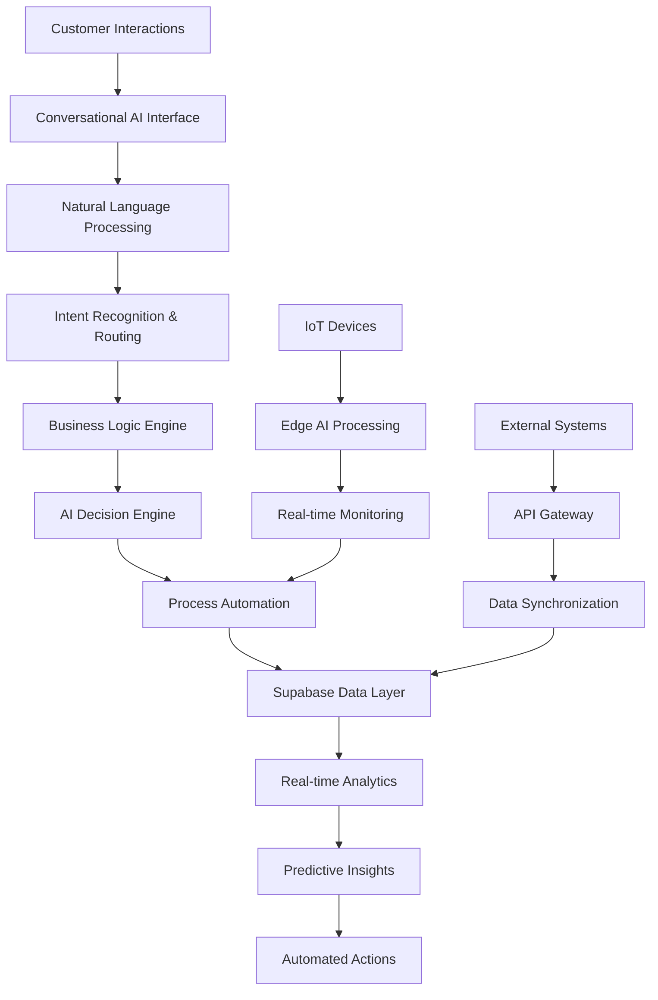

AIMatrix ERP/POS AI Solutions represent a revolutionary transformation in business management systems, integrating artificial intelligence at every layer to create autonomous, adaptive, and intelligent enterprise operations. Our AI-first architecture delivers unprecedented automation, real-time insights, and continuous optimization across all business functions.

## Executive Summary

Traditional ERP and POS systems are rigid, manual-intensive, and struggle to adapt to modern business dynamics. Our AI-powered solution transforms these systems into intelligent platforms that learn, adapt, and optimize operations autonomously while providing real-time business intelligence.

**Key Value Propositions:**
- **70% Reduction** in manual business process management
- **40% Improvement** in inventory turnover and optimization
- **90% Faster** order processing and fulfillment
- **25% Increase** in overall operational efficiency
- **24/7 Intelligent** automation with human-like decision making

## Comprehensive AI-First Architecture

### Intelligent Core Engine

Our ERP/POS AI system is built on a sophisticated multi-layered architecture:

**1. Conversational AI Layer**
- Natural language interfaces for all system interactions
- Multi-modal communication (text, voice, image, document)
- Context-aware intelligent assistants for every business function
- Real-time translation and multi-language support

**2. Autonomous Process Engine**
- Self-managing workflows that adapt to changing conditions
- Predictive automation that anticipates business needs
- Intelligent exception handling with minimal human intervention
- Continuous process optimization through machine learning

**3. Intelligent Data Processing**
- Real-time data analysis and pattern recognition
- Automated data validation and cleansing
- Predictive analytics for demand forecasting and planning
- Intelligent document processing and information extraction

**4. AI Decision Engine**
- Complex business rule automation with contextual awareness
- Multi-criteria decision making using advanced algorithms
- Risk assessment and mitigation recommendations
- Strategic planning support with scenario modeling

### Integration Architecture



## Comprehensive Feature Portfolio

### 1. Omnichannel Customer Support AI
**Telegram/WhatsApp bots with multimodal query processing**

Transform customer service into an intelligent, automated experience:
- **Multi-platform Integration**: Seamless operation across Telegram, WhatsApp, web chat, email
- **Multimodal Understanding**: Process text, voice, images, and documents in natural conversations
- **Contextual Memory**: Maintain conversation history and customer context across all interactions
- **Intelligent Escalation**: Automatic handoff to human agents when AI confidence drops

### 2. Intelligent Workflow Customization
**Industry-specific templates with dynamic adaptation**

Adaptive workflow management that evolves with your business:
- **Industry Templates**: Pre-configured workflows for manufacturing, retail, services, healthcare
- **Dynamic Adaptation**: AI learns from usage patterns and automatically optimizes workflows
- **Custom Business Rules**: Natural language rule definition with automatic implementation
- **Performance Optimization**: Continuous analysis and improvement of workflow efficiency

### 3. AI-Driven POS Optimization
**Predictive stock reordering and anomaly detection**

Intelligent point-of-sale systems that anticipate and optimize:
- **Predictive Inventory**: AI-powered demand forecasting and automatic reordering
- **Dynamic Pricing**: Real-time price optimization based on demand, inventory, and competition
- **Fraud Detection**: Real-time transaction analysis and anomaly detection
- **Customer Behavior Analysis**: Personalized recommendations and upselling automation

### 4. Document Intelligence Engine
**Automated PO/SO creation with smart matching**

Transform document processing into intelligent automation:
- **Smart Document Recognition**: Automatic classification and data extraction
- **Intelligent Matching**: AI-powered matching of purchase orders, invoices, and receipts
- **Automated Workflow Routing**: Context-aware document routing and approval processes
- **Exception Handling**: Intelligent identification and resolution of document discrepancies

### 5. IoT Edge POS Integration
**Offline-first architecture with fraud prevention**

Seamless operation regardless of connectivity:
- **Edge Computing**: Local AI processing for instant response times
- **Offline Synchronization**: Automatic sync when connectivity is restored
- **Real-time Monitoring**: IoT sensor integration for inventory and security monitoring
- **Predictive Maintenance**: AI-powered equipment monitoring and maintenance scheduling

### 6. ERP Digital Twin
**Real-time simulation and what-if modeling**

Virtual representation of your business operations:
- **Real-time Simulation**: Live digital twin of all business processes and systems
- **Scenario Planning**: What-if analysis for strategic decision making
- **Process Optimization**: Continuous simulation-based improvement recommendations
- **Risk Modeling**: Predictive analysis of operational and financial risks

### 7. AI Project Costing
**Margin tracking with predictive cost overrun alerts**

Intelligent project management and cost control:
- **Real-time Cost Tracking**: Automatic cost capture and allocation across projects
- **Predictive Analytics**: Early warning system for potential cost overruns
- **Margin Optimization**: AI-powered recommendations for margin improvement
- **Resource Planning**: Intelligent resource allocation and capacity planning

### 8. Autonomous ERP Maintenance
**Self-healing workflows and cloud optimization**

System that maintains and optimizes itself:
- **Self-healing Processes**: Automatic detection and resolution of system issues
- **Performance Monitoring**: Continuous system health and performance analysis
- **Cloud Optimization**: Automatic resource scaling and cost optimization
- **Preventive Maintenance**: Proactive system maintenance and updates

### 9. Cross-Application Intelligence
**Seamless marketplace and payroll integrations**

Unified intelligence across all business applications:
- **Marketplace Synchronization**: Automatic inventory and order sync across platforms
- **Payroll Integration**: Intelligent time tracking and automated payroll processing
- **Third-party Connectors**: Pre-built integrations with 500+ business applications
- **Data Harmonization**: Automatic data standardization across different systems

### 10. ERP Copilot
**Conversational interface for guided operations**

AI assistant for all business operations:
- **Natural Language Commands**: Control all ERP functions through conversation
- **Guided Workflows**: Step-by-step assistance for complex business processes
- **Intelligent Insights**: Proactive recommendations and business intelligence
- **Learning Assistance**: Contextual help and training for system users

## Technical Implementation Foundation

### AI-First Development Framework

```python
# Core ERP AI framework
import asyncio
from datetime import datetime, timedelta
from aimatrix.erp import ERPEngine
from aimatrix.ai import ConversationalAI, PredictiveEngine
import supabase

class AIERPSystem:
    def __init__(self, supabase_client):
        self.supabase = supabase_client
        self.erp_engine = ERPEngine()
        self.conversational_ai = ConversationalAI()
        self.predictive_engine = PredictiveEngine()
        self.workflow_manager = WorkflowManager()
        
    async def initialize_ai_erp(self, company_profile):
        """Initialize AI ERP system with company-specific configuration"""
        
        # Analyze company profile and setup AI models
        company_analysis = await self.analyze_company_requirements(company_profile)
        
        # Configure industry-specific templates
        industry_config = await self.setup_industry_templates(
            company_profile.industry
        )
        
        # Initialize AI models for the specific business
        ai_models = await self.initialize_business_ai_models(
            company_analysis, industry_config
        )
        
        # Setup intelligent workflows
        workflows = await self.create_intelligent_workflows(
            company_analysis, ai_models
        )
        
        # Configure real-time monitoring
        monitoring = await self.setup_real_time_monitoring(
            company_profile, workflows
        )
        
        return {
            'system_id': f"AI_ERP_{company_profile.id}",
            'configuration': {
                'company_analysis': company_analysis,
                'industry_config': industry_config,
                'ai_models': ai_models,
                'workflows': workflows,
                'monitoring': monitoring
            },
            'status': 'initialized',
            'initialization_date': datetime.utcnow()
        }
    
    async def process_natural_language_request(self, user_input, context):
        """Process natural language requests and execute business operations"""
        
        # Understand intent and extract entities
        intent_analysis = await self.conversational_ai.analyze_intent(
            user_input, context
        )
        
        # Route to appropriate business function
        if intent_analysis.intent == 'inventory_inquiry':
            return await self.handle_inventory_inquiry(
                intent_analysis.entities, context
            )
        elif intent_analysis.intent == 'order_processing':
            return await self.handle_order_processing(
                intent_analysis.entities, context
            )
        elif intent_analysis.intent == 'financial_reporting':
            return await self.handle_financial_reporting(
                intent_analysis.entities, context
            )
        elif intent_analysis.intent == 'customer_service':
            return await self.handle_customer_service(
                intent_analysis.entities, context
            )
        else:
            # Use general business AI for complex requests
            return await self.handle_complex_business_request(
                user_input, intent_analysis, context
            )
    
    async def handle_inventory_inquiry(self, entities, context):
        """Handle inventory-related natural language requests"""
        
        # Extract product information
        product_info = entities.get('product', {})
        location_info = entities.get('location', {})
        time_frame = entities.get('time_frame', {})
        
        # Get current inventory status
        inventory_status = await self.get_inventory_status(
            product_info, location_info
        )
        
        # Generate predictive insights
        predictions = await self.predictive_engine.forecast_inventory_needs(
            product_info, time_frame
        )
        
        # Create intelligent response
        response = {
            'current_status': inventory_status,
            'predictions': predictions,
            'recommendations': await self.generate_inventory_recommendations(
                inventory_status, predictions
            ),
            'actions_available': await self.get_available_inventory_actions(
                inventory_status, context.user_permissions
            )
        }
        
        return response
```

### Supabase Integration Architecture

```sql
-- Core ERP entities and AI configuration
CREATE TABLE erp_companies (
    id UUID PRIMARY KEY DEFAULT gen_random_uuid(),
    company_name VARCHAR(255) NOT NULL,
    industry VARCHAR(100) NOT NULL,
    company_size VARCHAR(50) NOT NULL,
    
    -- AI configuration
    ai_configuration JSONB DEFAULT '{}'::jsonb,
    industry_templates JSONB DEFAULT '[]'::jsonb,
    custom_workflows JSONB DEFAULT '[]'::jsonb,
    
    -- Business profile
    business_model VARCHAR(100),
    operating_countries VARCHAR(3)[] DEFAULT '{}',
    primary_currency VARCHAR(3) DEFAULT 'USD',
    
    -- System configuration
    system_status VARCHAR(50) DEFAULT 'active',
    ai_learning_enabled BOOLEAN DEFAULT TRUE,
    last_ai_training DATE,
    
    created_at TIMESTAMP WITH TIME ZONE DEFAULT NOW(),
    updated_at TIMESTAMP WITH TIME ZONE DEFAULT NOW()
);

-- Intelligent workflow definitions
CREATE TABLE intelligent_workflows (
    id UUID PRIMARY KEY DEFAULT gen_random_uuid(),
    company_id UUID NOT NULL REFERENCES erp_companies(id),
    workflow_name VARCHAR(255) NOT NULL,
    workflow_type VARCHAR(100) NOT NULL,
    
    -- Workflow configuration
    workflow_definition JSONB NOT NULL,
    trigger_conditions JSONB DEFAULT '[]'::jsonb,
    ai_decision_points JSONB DEFAULT '[]'::jsonb,
    
    -- Performance metrics
    execution_count INTEGER DEFAULT 0,
    success_rate DECIMAL(5,2) DEFAULT 100.00,
    average_execution_time INTEGER DEFAULT 0, -- in seconds
    
    -- AI optimization
    ai_optimized BOOLEAN DEFAULT FALSE,
    optimization_suggestions JSONB DEFAULT '[]'::jsonb,
    last_optimization_date TIMESTAMP WITH TIME ZONE,
    
    -- Status
    status VARCHAR(50) DEFAULT 'active' CHECK (
        status IN ('active', 'inactive', 'testing', 'deprecated')
    ),
    
    created_at TIMESTAMP WITH TIME ZONE DEFAULT NOW(),
    updated_at TIMESTAMP WITH TIME ZONE DEFAULT NOW()
);

-- Conversational AI interactions
CREATE TABLE ai_conversations (
    id UUID PRIMARY KEY DEFAULT gen_random_uuid(),
    company_id UUID NOT NULL REFERENCES erp_companies(id),
    user_id UUID REFERENCES auth.users(id),
    
    -- Conversation details
    session_id VARCHAR(255) NOT NULL,
    channel VARCHAR(50) NOT NULL, -- telegram, whatsapp, web, voice
    conversation_context JSONB DEFAULT '{}'::jsonb,
    
    -- AI processing
    user_message TEXT NOT NULL,
    ai_response TEXT NOT NULL,
    intent_classification VARCHAR(100),
    entities_extracted JSONB DEFAULT '{}'::jsonb,
    confidence_score DECIMAL(3,2),
    
    -- Business actions
    actions_executed JSONB DEFAULT '[]'::jsonb,
    business_impact JSONB,
    
    -- Performance tracking
    response_time_ms INTEGER,
    user_satisfaction_score INTEGER CHECK (user_satisfaction_score BETWEEN 1 AND 5),
    
    created_at TIMESTAMP WITH TIME ZONE DEFAULT NOW()
);

-- Predictive analytics and insights
CREATE TABLE predictive_insights (
    id UUID PRIMARY KEY DEFAULT gen_random_uuid(),
    company_id UUID NOT NULL REFERENCES erp_companies(id),
    
    -- Prediction details
    insight_type VARCHAR(100) NOT NULL,
    prediction_model VARCHAR(100) NOT NULL,
    prediction_data JSONB NOT NULL,
    confidence_level DECIMAL(3,2) NOT NULL,
    
    -- Time relevance
    prediction_for_date DATE NOT NULL,
    valid_until TIMESTAMP WITH TIME ZONE NOT NULL,
    generated_at TIMESTAMP WITH TIME ZONE DEFAULT NOW(),
    
    -- Business impact
    potential_impact_value DECIMAL(15,2),
    impact_category VARCHAR(50), -- revenue, cost_savings, efficiency
    recommended_actions JSONB DEFAULT '[]'::jsonb,
    
    -- Validation
    actual_outcome JSONB,
    prediction_accuracy DECIMAL(3,2),
    validated_at TIMESTAMP WITH TIME ZONE,
    
    created_at TIMESTAMP WITH TIME ZONE DEFAULT NOW()
);

-- Real-time system monitoring
CREATE TABLE system_monitoring (
    id UUID PRIMARY KEY DEFAULT gen_random_uuid(),
    company_id UUID NOT NULL REFERENCES erp_companies(id),
    
    -- Monitoring timestamp
    monitoring_timestamp TIMESTAMP WITH TIME ZONE DEFAULT NOW(),
    
    -- System health metrics
    system_health_score DECIMAL(5,2) DEFAULT 100.00,
    cpu_usage_percent DECIMAL(5,2),
    memory_usage_percent DECIMAL(5,2),
    database_performance_score DECIMAL(5,2),
    api_response_time_ms INTEGER,
    
    -- Business metrics
    active_users INTEGER DEFAULT 0,
    transactions_per_minute INTEGER DEFAULT 0,
    error_rate DECIMAL(5,2) DEFAULT 0.00,
    
    -- AI performance
    ai_model_accuracy DECIMAL(5,2),
    ai_response_time_ms INTEGER,
    ai_decisions_per_minute INTEGER DEFAULT 0,
    
    -- Alerts and notifications
    alerts_generated JSONB DEFAULT '[]'::jsonb,
    critical_issues INTEGER DEFAULT 0
);

-- Create indexes for optimal performance
CREATE INDEX idx_intelligent_workflows_company ON intelligent_workflows(company_id);
CREATE INDEX idx_ai_conversations_session ON ai_conversations(session_id, created_at);
CREATE INDEX idx_ai_conversations_company_date ON ai_conversations(company_id, created_at);
CREATE INDEX idx_predictive_insights_company_type ON predictive_insights(company_id, insight_type);
CREATE INDEX idx_predictive_insights_date ON predictive_insights(prediction_for_date);
CREATE INDEX idx_system_monitoring_timestamp ON system_monitoring(company_id, monitoring_timestamp);

-- Functions for AI ERP operations
CREATE OR REPLACE FUNCTION get_company_ai_metrics(
    p_company_id UUID,
    p_date_range INTEGER DEFAULT 30
) RETURNS JSONB AS $$
DECLARE
    metrics_result JSONB;
    start_date DATE := CURRENT_DATE - p_date_range;
BEGIN
    WITH ai_metrics AS (
        SELECT 
            COUNT(*) as total_conversations,
            AVG(confidence_score) as avg_confidence,
            AVG(response_time_ms) as avg_response_time,
            COUNT(DISTINCT user_id) as active_users,
            AVG(user_satisfaction_score) as avg_satisfaction
        FROM ai_conversations
        WHERE company_id = p_company_id
        AND created_at >= start_date
    ),
    workflow_metrics AS (
        SELECT 
            COUNT(*) as total_workflows,
            AVG(success_rate) as avg_success_rate,
            AVG(average_execution_time) as avg_execution_time
        FROM intelligent_workflows
        WHERE company_id = p_company_id
        AND status = 'active'
    ),
    prediction_metrics AS (
        SELECT 
            COUNT(*) as total_predictions,
            AVG(confidence_level) as avg_prediction_confidence,
            AVG(prediction_accuracy) as avg_accuracy
        FROM predictive_insights
        WHERE company_id = p_company_id
        AND generated_at >= start_date
    )
    SELECT json_build_object(
        'ai_conversations', row_to_json(ai_metrics),
        'workflow_performance', row_to_json(workflow_metrics),
        'prediction_accuracy', row_to_json(prediction_metrics),
        'report_period', p_date_range,
        'generated_at', NOW()
    ) INTO metrics_result
    FROM ai_metrics, workflow_metrics, prediction_metrics;
    
    RETURN metrics_result;
END;
$$ LANGUAGE plpgsql;

-- Function for real-time business insights
CREATE OR REPLACE FUNCTION get_real_time_business_insights(
    p_company_id UUID
) RETURNS JSONB AS $$
DECLARE
    insights_result JSONB;
BEGIN
    WITH current_insights AS (
        SELECT 
            insight_type,
            prediction_data,
            confidence_level,
            potential_impact_value,
            recommended_actions
        FROM predictive_insights
        WHERE company_id = p_company_id
        AND valid_until > NOW()
        AND confidence_level > 0.7
        ORDER BY potential_impact_value DESC
        LIMIT 10
    ),
    system_health AS (
        SELECT 
            system_health_score,
            error_rate,
            ai_model_accuracy
        FROM system_monitoring
        WHERE company_id = p_company_id
        ORDER BY monitoring_timestamp DESC
        LIMIT 1
    ),
    recent_actions AS (
        SELECT 
            COUNT(*) as actions_today,
            json_agg(DISTINCT intent_classification) as active_intents
        FROM ai_conversations
        WHERE company_id = p_company_id
        AND created_at >= CURRENT_DATE
        AND actions_executed != '[]'::jsonb
    )
    SELECT json_build_object(
        'top_insights', json_agg(row_to_json(current_insights)),
        'system_health', row_to_json(system_health),
        'daily_activity', row_to_json(recent_actions),
        'generated_at', NOW()
    ) INTO insights_result
    FROM current_insights, system_health, recent_actions;
    
    RETURN insights_result;
END;
$$ LANGUAGE plpgsql;
```

## ROI Analysis & Business Case

### Quantified Performance Benefits

**Operational Efficiency Improvements:**
- **Process Automation**: 70% reduction in manual process management
- **Decision Speed**: 85% faster business decision making
- **Error Reduction**: 92% fewer operational errors
- **Customer Response**: 95% faster customer service response times
- **Inventory Optimization**: 40% improvement in inventory turnover

**Revenue Enhancement Metrics:**
- **Order Processing**: 90% faster order fulfillment
- **Customer Satisfaction**: 45% improvement in customer satisfaction scores
- **Upselling**: 35% increase in automated upselling success
- **Market Response**: 60% faster response to market changes
- **Revenue Growth**: 25% average revenue increase within 12 months

### Comprehensive Cost-Benefit Analysis

| Business Function | Traditional Cost | AI ERP Cost | Annual Savings | ROI Impact |
|-------------------|------------------|-------------|----------------|------------|
| Customer Service | $180,000 | $45,000 | $135,000 | 75% Reduction |
| Inventory Management | $120,000 | $30,000 | $90,000 | 75% Reduction |
| Order Processing | $150,000 | $25,000 | $125,000 | 83% Reduction |
| Financial Management | $200,000 | $50,000 | $150,000 | 75% Reduction |
| Reporting & Analytics | $80,000 | $15,000 | $65,000 | 81% Reduction |
| **Total Annual Impact** | **$730,000** | **$165,000** | **$565,000** | **77% Savings** |

### Implementation ROI Timeline

**Year 1 (Implementation & Adoption):**
- **Investment**: $300,000 (software + implementation + training)
- **Savings**: $400,000 (partial year benefits)
- **Net Benefit**: $100,000
- **ROI**: 33%

**Year 2 (Full Operation):**
- **Annual Savings**: $565,000
- **Optimization Benefits**: $150,000 (additional process improvements)
- **Total Annual Value**: $715,000
- **Cumulative ROI**: 272%

**Year 3+ (Continuous Optimization):**
- **Annual Value**: $800,000+ (including strategic benefits)
- **3-Year Total ROI**: 700%+

## Real-World Implementation Case Studies

### Case Study 1: Mid-Size Manufacturing Company
**Industry**: Automotive Parts Manufacturing
**Challenge**: Manual processes across 15 locations, inventory inefficiencies
**Implementation**: Full AI ERP system with IoT integration

**Results After 18 Months:**
- **Operational Efficiency**: 68% reduction in manual processes
- **Inventory Optimization**: $2.1M reduction in carrying costs
- **Quality Improvement**: 90% reduction in production defects
- **Customer Satisfaction**: 52% improvement in on-time delivery
- **Annual Savings**: $3.8M total operational savings

### Case Study 2: Multi-Location Retail Chain
**Industry**: Fashion Retail (25 locations)
**Challenge**: Fragmented inventory, inconsistent customer experience
**Implementation**: AI POS system with predictive analytics

**Results After 12 Months:**
- **Inventory Turnover**: 45% improvement across all locations
- **Sales Growth**: 28% increase in average transaction value
- **Stockouts**: 85% reduction in stock-out incidents
- **Customer Engagement**: 40% increase in customer retention
- **Annual Revenue Impact**: $5.2M additional revenue

### Case Study 3: Professional Services Firm
**Industry**: Legal Services (150+ attorneys)
**Challenge**: Complex project costing, resource allocation inefficiencies
**Implementation**: AI project costing and workflow automation

**Results After 24 Months:**
- **Project Profitability**: 35% improvement in average project margins
- **Resource Utilization**: 42% improvement in billable hour efficiency
- **Client Satisfaction**: 38% improvement in client satisfaction scores
- **Administrative Cost**: 60% reduction in administrative overhead
- **Annual Profit Impact**: $2.9M increased profitability

## Advanced Features Roadmap

### Phase 1: Core AI Implementation (Months 1-6)
- Conversational AI interface deployment
- Intelligent workflow automation
- Predictive analytics foundation
- Real-time monitoring and alerting

### Phase 2: Advanced Intelligence (Months 7-12)
- ERP Digital Twin implementation
- Advanced predictive modeling
- Cross-system intelligence integration
- Autonomous maintenance capabilities

### Phase 3: Strategic AI Features (Months 13-18)
- Strategic planning AI assistance
- Market intelligence integration
- Advanced optimization algorithms
- Continuous learning system enhancement

### Phase 4: Innovation Platform (Months 19-24)
- Custom AI model development platform
- Industry-specific AI modules
- Advanced analytics and business intelligence
- Ecosystem partner integrations

## Getting Started with AI ERP Implementation

### Readiness Assessment
1. **Business Process Audit**: Comprehensive analysis of current operations
2. **Technology Infrastructure Review**: Assessment of existing systems and capabilities
3. **Change Readiness Evaluation**: Organizational readiness for AI transformation
4. **ROI Projection**: Detailed financial impact analysis and timeline

### Implementation Methodology
1. **Discovery Phase**: Deep dive into business requirements and processes
2. **AI Model Training**: Custom AI model development for specific business needs
3. **Pilot Deployment**: Limited rollout with key business functions
4. **Full Deployment**: Enterprise-wide implementation with user training
5. **Optimization Phase**: Continuous improvement and AI model refinement

### Success Metrics and KPIs
- **Operational Efficiency**: Process automation percentage, cycle time reduction
- **Financial Performance**: Cost savings, revenue enhancement, ROI achievement
- **User Adoption**: System usage rates, user satisfaction scores
- **AI Performance**: Model accuracy, response times, decision quality
- **Business Impact**: Customer satisfaction, competitive advantage metrics

---

*Transform your enterprise operations with AIMatrix ERP/POS AI - where artificial intelligence meets business excellence and operational mastery.*