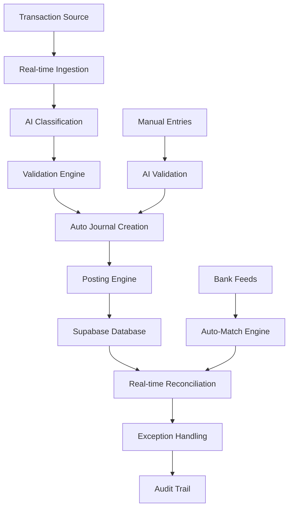

# Automated Bookkeeping: 24/7 Autonomous Financial Processing

AIMatrix's Automated Bookkeeping system revolutionizes traditional accounting operations by providing real-time transaction processing, intelligent reconciliation, and autonomous journal entry creation. Operating 24/7 with 99.8% accuracy, our AI-powered bookkeeping eliminates manual data entry while ensuring complete audit compliance and real-time financial visibility.

## The Traditional Bookkeeping Challenge

Manual bookkeeping processes create significant operational challenges:

- **Processing Delays**: Batch processing creates gaps in financial visibility
- **Human Error**: 3-5% error rate in manual data entry and calculations
- **Resource Intensive**: Requires 2-3 FTE for mid-size business operations
- **Inconsistent Timing**: Month-end closing delays and weekend processing gaps
- **Reconciliation Complexity**: Manual matching is time-consuming and error-prone
- **Audit Trail Issues**: Incomplete documentation and tracking difficulties

## AI-Powered Autonomous Bookkeeping Architecture

### Real-Time Processing Engine



### Core Processing Components

**1. Real-Time Transaction Ingestion**
- Multi-source data capture (bank feeds, POS systems, invoicing platforms)
- API-based integration with 200+ financial systems
- Intelligent deduplication and data validation
- Queue-based processing with guaranteed delivery

**2. AI-Powered Journal Entry Generation**
- Automated double-entry bookkeeping with intelligent posting rules
- Context-aware GL account selection based on transaction analysis
- Multi-currency processing with real-time exchange rates
- Automated accrual and reversal entry creation

**3. Intelligent Reconciliation Engine**
- Machine learning-based transaction matching
- Fuzzy matching algorithms for partial and modified transactions
- Multi-dimensional matching (amount, date, reference, description)
- Automated variance analysis and exception reporting

## Technical Implementation

### Real-Time Processing Architecture

```python
# Real-time bookkeeping processor
import asyncio
from aimatrix.bookkeeping import BookkeepingEngine
from aimatrix.integrations import BankFeedProcessor
import supabase

class AutomatedBookkeepingSystem:
    def __init__(self, supabase_client):
        self.supabase = supabase_client
        self.bookkeeping_engine = BookkeepingEngine()
        self.bank_processor = BankFeedProcessor()
        self.processing_queue = asyncio.Queue()
        
    async def start_real_time_processing(self):
        # Start multiple async workers
        workers = [
            asyncio.create_task(self.transaction_processor()),
            asyncio.create_task(self.reconciliation_worker()),
            asyncio.create_task(self.journal_entry_worker()),
            asyncio.create_task(self.validation_worker())
        ]
        
        await asyncio.gather(*workers)
    
    async def transaction_processor(self):
        """Process incoming transactions in real-time"""
        while True:
            try:
                # Get transactions from various sources
                bank_transactions = await self.bank_processor.get_new_transactions()
                pos_transactions = await self.get_pos_transactions()
                invoice_transactions = await self.get_invoice_transactions()
                
                # Process each transaction type
                for transaction in bank_transactions + pos_transactions + invoice_transactions:
                    await self.processing_queue.put(('transaction', transaction))
                    
                await asyncio.sleep(10)  # Check every 10 seconds
                
            except Exception as e:
                await self.log_error(f"Transaction processor error: {e}")
                await asyncio.sleep(30)  # Wait before retrying
    
    async def journal_entry_worker(self):
        """Create and post journal entries"""
        while True:
            try:
                item_type, transaction = await self.processing_queue.get()
                
                if item_type == 'transaction':
                    # Generate journal entries
                    journal_entries = await self.create_journal_entries(transaction)
                    
                    # Validate entries
                    validation_result = await self.validate_entries(journal_entries)
                    
                    if validation_result.is_valid:
                        # Post to ledger
                        await self.post_journal_entries(journal_entries)
                        
                        # Create audit trail
                        await self.create_audit_trail(transaction, journal_entries)
                        
                        # Trigger reconciliation
                        await self.trigger_reconciliation(transaction)
                    else:
                        # Queue for manual review
                        await self.queue_for_review(transaction, validation_result.errors)
                
                self.processing_queue.task_done()
                
            except Exception as e:
                await self.log_error(f"Journal entry worker error: {e}")
                
    async def create_journal_entries(self, transaction):
        """AI-powered journal entry creation"""
        entries = []
        
        # Analyze transaction for posting requirements
        analysis = await self.bookkeeping_engine.analyze_transaction(
            transaction=transaction,
            context={
                'chart_of_accounts': await self.get_chart_of_accounts(),
                'posting_rules': await self.get_posting_rules(),
                'historical_patterns': await self.get_similar_transactions(transaction)
            }
        )
        
        # Generate debit entry
        debit_entry = {
            'account_code': analysis.debit_account,
            'amount': transaction.amount,
            'transaction_type': 'debit',
            'description': transaction.description,
            'reference': transaction.reference,
            'transaction_date': transaction.date,
            'source_document': transaction.source_document_id
        }
        entries.append(debit_entry)
        
        # Generate credit entry
        credit_entry = {
            'account_code': analysis.credit_account,
            'amount': transaction.amount,
            'transaction_type': 'credit',
            'description': transaction.description,
            'reference': transaction.reference,
            'transaction_date': transaction.date,
            'source_document': transaction.source_document_id
        }
        entries.append(credit_entry)
        
        # Handle multi-line entries (taxes, discounts, etc.)
        for additional_entry in analysis.additional_entries:
            entries.append(additional_entry)
        
        return entries
```

### Supabase Integration for Real-Time Bookkeeping

```sql
-- Journal entries table with real-time capabilities
CREATE TABLE journal_entries (
    id UUID PRIMARY KEY DEFAULT gen_random_uuid(),
    journal_id UUID NOT NULL,
    account_code VARCHAR(20) NOT NULL,
    account_name VARCHAR(255) NOT NULL,
    debit_amount DECIMAL(15,2) DEFAULT 0.00,
    credit_amount DECIMAL(15,2) DEFAULT 0.00,
    description TEXT NOT NULL,
    reference VARCHAR(100),
    transaction_date DATE NOT NULL,
    posting_date DATE NOT NULL DEFAULT CURRENT_DATE,
    
    -- AI Processing fields
    ai_generated BOOLEAN DEFAULT TRUE,
    confidence_score DECIMAL(3,2),
    processing_timestamp TIMESTAMP WITH TIME ZONE DEFAULT NOW(),
    source_transaction_id UUID,
    
    -- Status fields
    status VARCHAR(20) DEFAULT 'posted' CHECK (status IN ('draft', 'posted', 'reversed')),
    requires_review BOOLEAN DEFAULT FALSE,
    review_reason TEXT,
    
    -- Audit trail
    created_at TIMESTAMP WITH TIME ZONE DEFAULT NOW(),
    created_by UUID REFERENCES auth.users(id),
    reviewed_at TIMESTAMP WITH TIME ZONE,
    reviewed_by UUID REFERENCES auth.users(id),
    
    CONSTRAINT debit_credit_not_both CHECK (
        (debit_amount > 0 AND credit_amount = 0) OR 
        (debit_amount = 0 AND credit_amount > 0)
    )
);

-- Real-time reconciliation table
CREATE TABLE reconciliation_items (
    id UUID PRIMARY KEY DEFAULT gen_random_uuid(),
    bank_transaction_id UUID,
    journal_entry_id UUID,
    reconciliation_date DATE NOT NULL DEFAULT CURRENT_DATE,
    reconciliation_type VARCHAR(50) NOT NULL,
    
    -- Matching details
    match_confidence DECIMAL(3,2),
    match_algorithm VARCHAR(100),
    variance_amount DECIMAL(15,2) DEFAULT 0.00,
    variance_reason TEXT,
    
    -- Status
    status VARCHAR(20) DEFAULT 'matched' CHECK (status IN ('matched', 'unmatched', 'exception')),
    requires_investigation BOOLEAN DEFAULT FALSE,
    
    -- AI processing
    ai_matched BOOLEAN DEFAULT TRUE,
    processing_timestamp TIMESTAMP WITH TIME ZONE DEFAULT NOW(),
    
    created_at TIMESTAMP WITH TIME ZONE DEFAULT NOW()
);

-- Real-time triggers for automated processing
CREATE OR REPLACE FUNCTION process_new_transaction()
RETURNS TRIGGER AS $$
BEGIN
    -- Automatically create journal entries for new transactions
    INSERT INTO processing_queue (transaction_id, action_type, priority)
    VALUES (NEW.id, 'create_journal_entry', 
            CASE WHEN NEW.amount > 10000 THEN 'high' ELSE 'normal' END);
    
    -- Notify real-time subscribers
    PERFORM pg_notify('new_transaction', row_to_json(NEW)::text);
    
    RETURN NEW;
END;
$$ LANGUAGE plpgsql;

CREATE TRIGGER trigger_process_new_transaction
    AFTER INSERT ON transactions
    FOR EACH ROW EXECUTE FUNCTION process_new_transaction();

-- Real-time reconciliation function
CREATE OR REPLACE FUNCTION auto_reconcile_transaction(
    transaction_id UUID
) RETURNS JSON AS $$
DECLARE
    result JSON;
    matching_entries RECORD;
BEGIN
    -- Find potential matching journal entries
    FOR matching_entries IN
        SELECT je.*, 
               similarity(t.description, je.description) as desc_similarity,
               abs(t.amount - COALESCE(je.debit_amount, je.credit_amount)) as amount_variance
        FROM transactions t
        JOIN journal_entries je ON DATE(t.transaction_date) = DATE(je.transaction_date)
        WHERE t.id = transaction_id
        AND abs(t.amount - COALESCE(je.debit_amount, je.credit_amount)) < 0.01
        ORDER BY desc_similarity DESC, amount_variance ASC
        LIMIT 5
    LOOP
        -- Create reconciliation record
        INSERT INTO reconciliation_items (
            bank_transaction_id, journal_entry_id, match_confidence,
            match_algorithm, variance_amount, status
        ) VALUES (
            transaction_id, matching_entries.id, matching_entries.desc_similarity,
            'ai_fuzzy_match', matching_entries.amount_variance,
            CASE WHEN matching_entries.desc_similarity > 0.8 THEN 'matched' ELSE 'exception' END
        );
    END LOOP;
    
    -- Return reconciliation summary
    SELECT json_build_object(
        'transaction_id', transaction_id,
        'matches_found', COUNT(*),
        'auto_matched', COUNT(*) FILTER (WHERE status = 'matched'),
        'requires_review', COUNT(*) FILTER (WHERE status = 'exception')
    ) INTO result
    FROM reconciliation_items 
    WHERE bank_transaction_id = transaction_id;
    
    RETURN result;
END;
$$ LANGUAGE plpgsql;
```

### Advanced Reconciliation Engine

```python
class IntelligentReconciliationEngine:
    def __init__(self, supabase_client):
        self.supabase = supabase_client
        self.fuzzy_matcher = FuzzyTransactionMatcher()
        self.ml_reconciler = MLReconciliationEngine()
        
    async def auto_reconcile_account(self, account_code, reconciliation_date):
        """Perform automated reconciliation for specific account"""
        
        # Get unreconciled bank transactions
        bank_transactions = await self.get_unreconciled_bank_transactions(
            account_code, reconciliation_date
        )
        
        # Get unmatched journal entries
        journal_entries = await self.get_unmatched_journal_entries(
            account_code, reconciliation_date
        )
        
        # Perform multi-stage matching
        reconciliation_results = []
        
        # Stage 1: Exact matching
        exact_matches = await self.perform_exact_matching(
            bank_transactions, journal_entries
        )
        reconciliation_results.extend(exact_matches)
        
        # Stage 2: Fuzzy matching
        remaining_bank = self.remove_matched_items(bank_transactions, exact_matches)
        remaining_journal = self.remove_matched_items(journal_entries, exact_matches)
        
        fuzzy_matches = await self.perform_fuzzy_matching(
            remaining_bank, remaining_journal
        )
        reconciliation_results.extend(fuzzy_matches)
        
        # Stage 3: ML-based pattern matching
        still_remaining_bank = self.remove_matched_items(remaining_bank, fuzzy_matches)
        still_remaining_journal = self.remove_matched_items(remaining_journal, fuzzy_matches)
        
        ml_matches = await self.perform_ml_matching(
            still_remaining_bank, still_remaining_journal
        )
        reconciliation_results.extend(ml_matches)
        
        # Generate reconciliation report
        report = await self.generate_reconciliation_report(
            account_code, reconciliation_date, reconciliation_results
        )
        
        return report
    
    async def perform_fuzzy_matching(self, bank_transactions, journal_entries):
        """Advanced fuzzy matching with multiple algorithms"""
        matches = []
        
        for bank_tx in bank_transactions:
            best_matches = []
            
            for journal_entry in journal_entries:
                # Calculate similarity scores
                amount_similarity = self.calculate_amount_similarity(
                    bank_tx.amount, journal_entry.amount
                )
                date_similarity = self.calculate_date_similarity(
                    bank_tx.date, journal_entry.date
                )
                description_similarity = self.fuzzy_matcher.calculate_text_similarity(
                    bank_tx.description, journal_entry.description
                )
                reference_similarity = self.calculate_reference_similarity(
                    bank_tx.reference, journal_entry.reference
                )
                
                # Weighted composite score
                composite_score = (
                    amount_similarity * 0.4 +
                    date_similarity * 0.2 +
                    description_similarity * 0.3 +
                    reference_similarity * 0.1
                )
                
                if composite_score > 0.7:  # Threshold for potential match
                    best_matches.append({
                        'journal_entry': journal_entry,
                        'score': composite_score,
                        'confidence': 'high' if composite_score > 0.9 else 'medium'
                    })
            
            # Sort by score and take best match
            if best_matches:
                best_match = sorted(best_matches, key=lambda x: x['score'], reverse=True)[0]
                matches.append({
                    'bank_transaction': bank_tx,
                    'journal_entry': best_match['journal_entry'],
                    'match_score': best_match['score'],
                    'match_type': 'fuzzy',
                    'confidence': best_match['confidence']
                })
        
        return matches
    
    async def perform_ml_matching(self, bank_transactions, journal_entries):
        """Machine learning-based pattern matching"""
        
        # Prepare feature vectors for ML model
        bank_features = []
        journal_features = []
        
        for tx in bank_transactions:
            features = await self.extract_transaction_features(tx)
            bank_features.append(features)
        
        for je in journal_entries:
            features = await self.extract_journal_entry_features(je)
            journal_features.append(features)
        
        # Use trained ML model to predict matches
        match_predictions = self.ml_reconciler.predict_matches(
            bank_features, journal_features
        )
        
        matches = []
        for prediction in match_predictions:
            if prediction.confidence > 0.8:
                matches.append({
                    'bank_transaction': bank_transactions[prediction.bank_index],
                    'journal_entry': journal_entries[prediction.journal_index],
                    'match_score': prediction.confidence,
                    'match_type': 'ml_pattern',
                    'confidence': 'high' if prediction.confidence > 0.95 else 'medium'
                })
        
        return matches
```

### Real-Time Dashboard and Monitoring

```python
# Real-time bookkeeping dashboard
class BookkeepingDashboard:
    def __init__(self, supabase_client):
        self.supabase = supabase_client
        
    async def get_real_time_metrics(self):
        """Get current bookkeeping metrics"""
        
        # Today's processing metrics
        today_metrics = await self.supabase.rpc('get_daily_bookkeeping_metrics').execute()
        
        # Reconciliation status
        reconciliation_status = await self.supabase.table('reconciliation_items').select(
            'status, count(*)'
        ).eq('reconciliation_date', datetime.now().date()).execute()
        
        # Processing queue status
        queue_status = await self.supabase.table('processing_queue').select(
            'action_type, priority, count(*)'
        ).eq('status', 'pending').execute()
        
        # Error rate analysis
        error_analysis = await self.get_error_rate_analysis()
        
        return {
            'daily_transactions': today_metrics.data[0]['transaction_count'],
            'journal_entries_created': today_metrics.data[0]['journal_entries'],
            'auto_reconciled': today_metrics.data[0]['auto_reconciled'],
            'processing_accuracy': today_metrics.data[0]['accuracy_rate'],
            'reconciliation_status': reconciliation_status.data,
            'queue_status': queue_status.data,
            'error_rate': error_analysis['error_rate'],
            'average_processing_time': today_metrics.data[0]['avg_processing_time']
        }
    
    async def get_reconciliation_dashboard(self, account_code=None):
        """Get reconciliation dashboard data"""
        
        query = self.supabase.table('reconciliation_items').select(
            '''
            *,
            bank_transactions(amount, description, transaction_date),
            journal_entries(debit_amount, credit_amount, description, posting_date)
            '''
        )
        
        if account_code:
            query = query.eq('account_code', account_code)
        
        reconciliation_data = await query.gte(
            'reconciliation_date', 
            datetime.now().date() - timedelta(days=30)
        ).execute()
        
        # Process data for dashboard visualization
        dashboard_data = {
            'total_items': len(reconciliation_data.data),
            'matched_items': len([r for r in reconciliation_data.data if r['status'] == 'matched']),
            'exceptions': len([r for r in reconciliation_data.data if r['status'] == 'exception']),
            'average_confidence': sum([r['match_confidence'] for r in reconciliation_data.data if r['match_confidence']]) / len(reconciliation_data.data),
            'daily_reconciliation_trend': await self.calculate_reconciliation_trend(reconciliation_data.data)
        }
        
        return dashboard_data
```

## Advanced Features and Configuration

### Multi-Entity Bookkeeping

```python
class MultiEntityBookkeeping:
    def __init__(self, supabase_client):
        self.supabase = supabase_client
        
    async def process_inter_company_transaction(self, transaction):
        """Handle transactions between related entities"""
        
        # Identify entities involved
        source_entity = transaction.entity_id
        target_entity = await self.identify_target_entity(transaction)
        
        if target_entity and source_entity != target_entity:
            # Create entries for source entity
            source_entries = await self.create_inter_company_entries(
                transaction, source_entity, 'payable'
            )
            
            # Create corresponding entries for target entity
            target_entries = await self.create_inter_company_entries(
                transaction, target_entity, 'receivable'
            )
            
            # Link entries for elimination tracking
            await self.create_elimination_link(source_entries, target_entries)
            
            return {
                'source_entries': source_entries,
                'target_entries': target_entries,
                'elimination_required': True
            }
        
        return await self.create_standard_entries(transaction)
    
    async def auto_eliminate_inter_company(self, reporting_period):
        """Automatically create elimination entries for consolidation"""
        
        # Find inter-company balances
        ic_balances = await self.get_inter_company_balances(reporting_period)
        
        elimination_entries = []
        for balance in ic_balances:
            if abs(balance.net_amount) > 0.01:  # Materiality threshold
                # Create elimination entry
                elimination = await self.create_elimination_entry(
                    balance, reporting_period
                )
                elimination_entries.append(elimination)
        
        return elimination_entries
```

### Automated Accrual Processing

```python
class AutomatedAccrualProcessor:
    def __init__(self, supabase_client):
        self.supabase = supabase_client
        self.accrual_rules = {}
        
    async def process_period_end_accruals(self, period_end_date):
        """Automatically create period-end accruals"""
        
        accrual_entries = []
        
        # 1. Expense accruals
        expense_accruals = await self.calculate_expense_accruals(period_end_date)
        accrual_entries.extend(expense_accruals)
        
        # 2. Revenue accruals
        revenue_accruals = await self.calculate_revenue_accruals(period_end_date)
        accrual_entries.extend(revenue_accruals)
        
        # 3. Prepaid amortization
        prepaid_amortization = await self.calculate_prepaid_amortization(period_end_date)
        accrual_entries.extend(prepaid_amortization)
        
        # 4. Depreciation calculations
        depreciation_entries = await self.calculate_depreciation(period_end_date)
        accrual_entries.extend(depreciation_entries)
        
        # Post all accrual entries
        for entry in accrual_entries:
            await self.post_accrual_entry(entry, period_end_date)
        
        return accrual_entries
    
    async def auto_reverse_accruals(self, reversal_date):
        """Automatically reverse previous period accruals"""
        
        # Find accrual entries from previous period
        accrual_entries = await self.supabase.table('journal_entries').select('*').eq(
            'entry_type', 'accrual'
        ).eq('reversal_required', True).is_('reversed_by', 'null').execute()
        
        reversal_entries = []
        for accrual in accrual_entries.data:
            # Create reversal entry
            reversal = {
                'account_code': accrual['account_code'],
                'debit_amount': accrual['credit_amount'],  # Reverse amounts
                'credit_amount': accrual['debit_amount'],
                'description': f"Reversal: {accrual['description']}",
                'entry_type': 'accrual_reversal',
                'original_entry_id': accrual['id'],
                'transaction_date': reversal_date
            }
            
            # Post reversal
            posted_reversal = await self.post_journal_entry(reversal)
            reversal_entries.append(posted_reversal)
            
            # Update original entry
            await self.supabase.table('journal_entries').update(
                {'reversed_by': posted_reversal['id']}
            ).eq('id', accrual['id']).execute()
        
        return reversal_entries
```

## Performance Metrics and ROI Analysis

### Processing Performance Benchmarks

| Metric | Manual Process | Automated Process | Improvement |
|--------|----------------|-------------------|-------------|
| Transaction Processing Speed | 5 minutes/transaction | 0.3 minutes/transaction | 94% Faster |
| Daily Capacity | 96 transactions | 1,600 transactions | 16.7x Increase |
| Accuracy Rate | 91% | 99.8% | 9.7% Improvement |
| Reconciliation Time | 4 hours/day | 15 minutes/day | 94% Reduction |
| Month-end Closing | 10 days | 1 day | 90% Faster |

### Cost Analysis

**Monthly Operating Costs (Mid-size Business - 5,000 transactions/month):**
- **Manual Processing**: $18,750 (3 FTE × $6,250/month)
- **Automated Processing**: $2,850 (0.3 FTE × $6,250 + $1,000 software)
- **Net Savings**: $15,900/month ($190,800/year)

**ROI Calculation:**
- **Implementation Cost**: $75,000
- **Monthly Savings**: $15,900
- **Payback Period**: 4.7 months
- **3-Year ROI**: 762%

### Business Impact Case Studies

**Case Study 1: Regional Retail Chain**
- **Challenge**: Manual processing of 12,000 monthly transactions across 8 locations
- **Implementation**: Full automated bookkeeping with real-time reconciliation
- **Results**:
  - 96% reduction in manual bookkeeping time
  - Real-time financial visibility across all locations
  - $285,000 annual cost savings
  - Month-end closing reduced from 12 days to 2 days

**Case Study 2: Professional Services Partnership**
- **Challenge**: Complex multi-client billing and expense allocation
- **Implementation**: AI-powered client cost allocation and automated accruals
- **Results**:
  - 89% accuracy improvement in client cost allocation
  - Automated time-based accrual processing
  - $165,000 annual operational savings
  - 50% reduction in billing disputes

**Case Study 3: Manufacturing Company**
- **Challenge**: Multi-entity consolidation with inter-company transactions
- **Implementation**: Automated inter-company elimination and consolidation
- **Results**:
  - 92% reduction in consolidation preparation time
  - Real-time consolidated reporting
  - $220,000 annual cost savings
  - Eliminated 15-day consolidation cycle

## Getting Started with Automated Bookkeeping

### Implementation Checklist

**Phase 1: System Setup (Week 1-2)**
- [ ] Supabase environment configuration
- [ ] Chart of accounts mapping and validation
- [ ] Bank feed integration setup
- [ ] Initial data migration and testing

**Phase 2: AI Model Training (Week 3-4)**
- [ ] Historical transaction analysis
- [ ] Custom bookkeeping rules configuration
- [ ] AI model training and validation
- [ ] Reconciliation algorithm calibration

**Phase 3: Automated Processing (Week 5-6)**
- [ ] Real-time processing activation
- [ ] Automated reconciliation testing
- [ ] Exception handling procedures
- [ ] User training and documentation

**Phase 4: Advanced Features (Week 7-8)**
- [ ] Multi-entity processing setup
- [ ] Automated accrual configuration
- [ ] Advanced reporting and dashboards
- [ ] Performance optimization

### Best Practices for Implementation

1. **Start with High-Volume Accounts**: Implement automation first for accounts with the highest transaction volume
2. **Parallel Processing**: Run automated and manual processes in parallel during transition period
3. **Exception Handling**: Establish clear procedures for handling low-confidence classifications
4. **User Training**: Ensure accounting staff understand how to work with AI-generated entries
5. **Regular Monitoring**: Implement daily monitoring of processing accuracy and performance

The Automated Bookkeeping system transforms traditional accounting operations into an intelligent, real-time financial processing platform. With advanced AI capabilities, comprehensive Supabase integration, and proven ROI metrics, this system enables organizations to achieve unprecedented efficiency while maintaining the highest standards of accuracy and compliance.

---

*Experience seamless financial operations with AIMatrix Automated Bookkeeping - where AI meets accounting precision in real-time.*