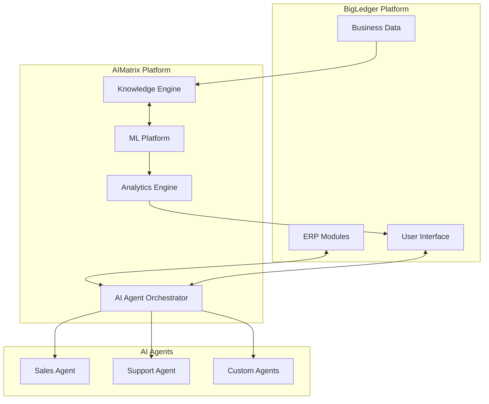

# AIMatrix AI Core Platform

## Transform Your Business with Intelligent Automation

AIMatrix is the next-generation **Agentic AI Platform** that seamlessly integrates with BigLedger to bring advanced artificial intelligence capabilities to your business operations. While BigLedger provides the robust business operating system and data hub, AIMatrix adds the intelligence layer that transforms data into actionable insights and automated decisions.

## What is AIMatrix?

AIMatrix is a comprehensive AI platform that enables businesses to:

- **Deploy AI Agents** that autonomously handle complex business tasks
- **Automate Decisions** with intelligent workflow automation
- **Predict Outcomes** using advanced machine learning models
- **Understand Customers** through natural language processing
- **Optimize Operations** with real-time analytics and insights

## Key Differentiators

### 🤖 Agentic Architecture
Unlike traditional AI tools that require constant human intervention, AIMatrix employs an **agentic architecture** where AI agents can:
- Autonomously execute multi-step business processes
- Learn from interactions and improve over time
- Collaborate with other agents to solve complex problems
- Make decisions within defined parameters

### 🔄 Seamless BigLedger Integration
AIMatrix is designed to work seamlessly with BigLedger:
- **Real-time Data Sync**: Automatic synchronization with BigLedger modules
- **Unified Interface**: Access AI capabilities directly from BigLedger UI
- **Bi-directional Flow**: AI insights flow back into BigLedger for action

### 🚀 Pre-built AI Solutions
Get started immediately with our library of pre-built AI agents:
- Sales Forecasting Agent
- Customer Service Chatbot
- Inventory Optimization Agent
- Fraud Detection Agent
- Document Processing Agent
- And 50+ more industry-specific agents

## Platform Components

### 1. AI Agent Orchestrator
The brain of AIMatrix that manages and coordinates multiple AI agents:
- Agent lifecycle management
- Task distribution and load balancing
- Inter-agent communication
- Performance monitoring

### 2. Knowledge Engine
Advanced knowledge management system powered by RAG (Retrieval Augmented Generation):
- Vector database for semantic search
- Knowledge graphs for relationship mapping
- Continuous learning from business data
- Multi-modal understanding (text, images, documents)

### 3. ML Operations Platform
End-to-end machine learning infrastructure:
- AutoML for automatic model creation
- Model versioning and registry
- A/B testing framework
- Edge deployment capabilities

### 4. Conversational AI Suite
Natural language capabilities for human-like interactions:
- Multi-language support (50+ languages)
- Voice and text interfaces
- Context-aware conversations
- Sentiment analysis and emotion detection

### 5. Analytics & Insights Engine
Real-time business intelligence powered by AI:
- Predictive analytics
- Anomaly detection
- Pattern recognition
- Automated reporting

## Use Cases by Industry

### Retail
- **Demand Forecasting**: Predict product demand with 95% accuracy
- **Price Optimization**: Dynamic pricing based on market conditions
- **Customer Personalization**: Individualized shopping experiences

### Manufacturing
- **Predictive Maintenance**: Reduce downtime by 40%
- **Quality Control**: AI-powered visual inspection
- **Supply Chain Optimization**: Intelligent inventory management

### Healthcare
- **Patient Flow**: Optimize hospital resource allocation
- **Diagnostic Assistance**: AI-supported medical diagnosis
- **Treatment Recommendations**: Evidence-based treatment suggestions

### Financial Services
- **Fraud Detection**: Real-time transaction monitoring
- **Risk Assessment**: Automated credit scoring
- **Compliance Monitoring**: Regulatory compliance automation

## Getting Started

### Quick Start (5 Minutes)
1. **Enable AIMatrix** in your BigLedger instance
2. **Choose an AI Agent** from the marketplace
3. **Configure** with your business rules
4. **Deploy** and start seeing results

```python
# Example: Deploy a Sales Forecasting Agent
from aimatrix import Agent, BigLedgerConnector

# Connect to BigLedger
connector = BigLedgerConnector(api_key="your-api-key")

# Create and configure agent
sales_agent = Agent.create(
    type="sales_forecasting",
    data_source=connector.get_sales_data(),
    forecast_period="30_days"
)

# Deploy and get predictions
predictions = sales_agent.deploy_and_predict()
print(f"Next 30 days forecast: ${predictions.total_revenue:,.2f}")
```

### System Requirements
- BigLedger Platform v3.0 or higher
- 8GB RAM minimum (16GB recommended)
- 50GB storage for AI models
- HTTPS-enabled environment

## Architecture Overview



## Performance & Scalability

AIMatrix is built for enterprise scale:

- **Processing Speed**: 1M+ predictions per second
- **Concurrent Agents**: Support for 10,000+ simultaneous agents
- **Data Volume**: Handle petabyte-scale datasets
- **Response Time**: <100ms for real-time predictions
- **Availability**: 99.99% uptime SLA

## Security & Compliance

### Enterprise-Grade Security
- End-to-end encryption for all data
- Role-based access control (RBAC)
- Audit logging for all AI decisions
- Data residency options

### Compliance Certifications
- SOC 2 Type II
- ISO 27001
- GDPR compliant
- HIPAA ready
- PCI DSS Level 1

## Pricing & Licensing

### Editions Available

| Edition | Features | Best For |
|---------|----------|----------|
| **Starter** | 5 AI Agents, Basic Analytics | Small businesses |
| **Professional** | 25 AI Agents, Advanced Analytics, API Access | Growing companies |
| **Enterprise** | Unlimited Agents, Custom Models, Priority Support | Large organizations |
| **AI-First** | Everything + AutoML, Edge Deployment | AI-native companies |

### Pricing Model
- **Per-agent pricing**: Pay only for active agents
- **Usage-based**: Scale up or down as needed
- **No hidden costs**: Transparent pricing
- **Free trial**: 30 days with full features

## Next Steps

### Explore More
- [Create Your First AI Agent →](/docs/ai-core/agents/creating-agents/)
- [Understanding Agent Orchestration →](/docs/ai-core/agents/agent-orchestration/)
- [Knowledge Management Guide →](/docs/ai-core/knowledge-base/)
- [ML Platform Overview →](/docs/ml-platform/)

### Get Help
- [Community Forum](https://forum.aimatrix.com)
- [Support Portal](https://support.aimatrix.com)
- [Developer Discord](https://discord.gg/aimatrix)
- Email: support@aimatrix.com

### Resources
- [API Documentation](/docs/developer/api-reference/)
- [Video Tutorials](/tutorials/)
- [Best Practices](/docs/best-practices/)
- [Case Studies](/community/success-stories/)

---

> [!NOTE]
> **Note**: AIMatrix requires BigLedger Platform v3.0 or higher. If you're using an older version, please [upgrade BigLedger](/docs/bigledger/upgrade/) first.

> [!TIP]
> **Pro Tip**: Start with pre-built agents from our marketplace to see immediate value, then gradually create custom agents tailored to your specific needs.