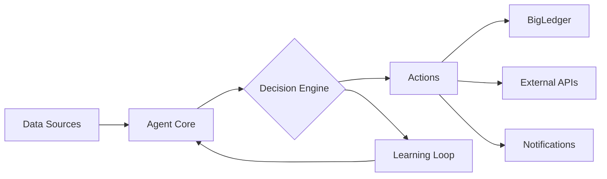

# Creating Custom AI Agents

## Overview

While AIMatrix provides 50+ pre-built agents, the real power comes from creating custom agents tailored to your specific business needs. This guide will walk you through creating your first custom AI agent.

## What is an AI Agent?

An AI agent in AIMatrix is an autonomous software entity that:
- **Observes** - Monitors data and events
- **Decides** - Makes intelligent decisions based on rules and ML models
- **Acts** - Executes actions in BigLedger or external systems
- **Learns** - Improves performance over time

## Agent Architecture



## Creating Your First Agent

### Step 1: Choose Agent Type

AIMatrix supports several agent types:

| Type | Use Case | Complexity |
|------|----------|------------|
| **Rule-Based** | Simple if-then logic | Low |
| **ML-Powered** | Predictions and patterns | Medium |
| **Conversational** | Natural language interaction | Medium |
| **Hybrid** | Combines multiple approaches | High |
| **Multi-Agent** | Coordinates other agents | High |

### Step 2: Define Agent Blueprint

Create a new agent using the AIMatrix Console or API:

```python
from aimatrix import AgentBuilder

# Create agent blueprint
agent = AgentBuilder.create(
    name="Customer Churn Predictor",
    type="ml_powered",
    description="Predicts and prevents customer churn"
)

# Define inputs
agent.add_input(
    source="bigledger.customers",
    fields=["purchase_history", "support_tickets", "last_login"]
)

# Define model
agent.set_model(
    type="classification",
    algorithm="gradient_boosting",
    target="churn_probability"
)

# Define actions
agent.add_action(
    trigger="churn_probability > 0.7",
    action="send_retention_offer"
)
```

### Step 3: Configure Data Sources

Connect your agent to BigLedger data:

```yaml
# agent-config.yaml
data_sources:
  - name: customer_data
    type: bigledger
    module: crm
    entities:
      - customers
      - transactions
      - interactions
    refresh: realtime
    
  - name: external_data
    type: api
    endpoint: https://api.social.com/sentiment
    auth: bearer_token
    refresh: hourly
```

### Step 4: Design Decision Logic

#### Rule-Based Logic
```python
# Simple rule engine
def decision_logic(context):
    customer = context.customer
    
    if customer.lifetime_value > 10000:
        priority = "high"
    elif customer.recent_tickets > 3:
        priority = "urgent"
    else:
        priority = "normal"
    
    return {
        "priority": priority,
        "action": determine_action(priority)
    }
```

#### ML-Based Logic
```python
# Machine learning model
def ml_decision_logic(context):
    # Feature extraction
    features = extract_features(context)
    
    # Get prediction
    prediction = model.predict(features)
    
    # Interpret results
    if prediction.confidence > 0.8:
        return {
            "action": prediction.recommended_action,
            "confidence": prediction.confidence
        }
    else:
        return {"action": "human_review"}
```

### Step 5: Implement Actions

Define what your agent can do:

```python
# Action definitions
class CustomerRetentionActions:
    
    @agent_action
    def send_retention_offer(self, customer_id, offer_type):
        """Send personalized retention offer"""
        offer = generate_offer(customer_id, offer_type)
        
        # Send via email
        email_service.send(
            to=customer.email,
            template="retention_offer",
            data=offer
        )
        
        # Log in BigLedger
        bigledger.log_activity(
            customer_id=customer_id,
            activity="retention_offer_sent",
            details=offer
        )
        
        return {"status": "sent", "offer_id": offer.id}
    
    @agent_action
    def escalate_to_human(self, customer_id, reason):
        """Escalate to human agent"""
        ticket = create_support_ticket(
            customer_id=customer_id,
            priority="high",
            reason=reason
        )
        
        notify_team(ticket)
        return {"ticket_id": ticket.id}
```

## Advanced Agent Features

### Multi-Agent Orchestration

Create agents that coordinate with others:

```python
# Orchestrator agent
orchestrator = AgentBuilder.create(
    name="Sales Orchestrator",
    type="multi_agent"
)

# Add sub-agents
orchestrator.add_agent("lead_scorer")
orchestrator.add_agent("opportunity_predictor")
orchestrator.add_agent("quote_generator")

# Define coordination logic
orchestrator.set_workflow("""
    1. lead_scorer evaluates new leads
    2. IF score > 80:
        - opportunity_predictor analyzes potential
        - quote_generator creates personalized quote
    3. ELSE:
        - Add to nurture campaign
""")
```

### Learning and Adaptation

Enable continuous learning:

```python
# Enable learning
agent.enable_learning(
    mode="reinforcement",
    feedback_source="user_actions",
    update_frequency="daily"
)

# Define reward function
def reward_function(action, outcome):
    if outcome == "customer_retained":
        return 1.0
    elif outcome == "customer_churned":
        return -1.0
    else:
        return 0.0

agent.set_reward_function(reward_function)
```

### Edge Deployment

Deploy agents at the edge for real-time processing:

```python
# Export for edge deployment
agent.export(
    format="onnx",
    optimization="quantized",
    target="edge_device"
)

# Edge configuration
edge_config = {
    "device_type": "raspberry_pi",
    "memory_limit": "512MB",
    "inference_engine": "tflite",
    "update_strategy": "incremental"
}

agent.deploy_to_edge(edge_config)
```

## Agent Development Workflow

### 1. Local Development
```bash
# Initialize agent project
aimatrix init my-agent

# Develop locally
cd my-agent
python agent.py --mode=development

# Test with sample data
aimatrix test --data=sample.json
```

### 2. Simulation Testing
```python
# Run simulation
simulator = AgentSimulator(agent)

# Test with historical data
results = simulator.run(
    data="historical_2024.csv",
    metrics=["accuracy", "response_time", "cost"]
)

print(f"Accuracy: {results.accuracy:.2%}")
print(f"Avg Response: {results.response_time}ms")
```

### 3. Staging Deployment
```bash
# Deploy to staging
aimatrix deploy --env=staging

# Monitor performance
aimatrix monitor my-agent --duration=7d

# A/B test against existing solution
aimatrix ab-test my-agent --baseline=current --split=0.1
```

### 4. Production Deployment
```bash
# Deploy to production
aimatrix deploy --env=production --rollout=gradual

# Set up monitoring
aimatrix monitor my-agent --alerts=enabled

# Enable auto-scaling
aimatrix scale my-agent --min=1 --max=10 --metric=cpu
```

## Best Practices

### 1. Start Simple
- Begin with rule-based logic
- Add ML capabilities gradually
- Test thoroughly before production

### 2. Design for Failure
```python
@agent_action
def safe_action(self, data):
    try:
        result = perform_action(data)
    except Exception as e:
        # Fallback logic
        result = fallback_action(data)
        log_error(e)
    
    return result
```

### 3. Monitor Everything
```python
# Add comprehensive logging
agent.add_metrics([
    "prediction_accuracy",
    "action_success_rate",
    "response_time_p95",
    "cost_per_decision"
])

# Set up alerts
agent.add_alert(
    condition="accuracy < 0.8",
    action="notify_team",
    severity="high"
)
```

### 4. Version Control
```yaml
# agent-version.yaml
version: 1.2.0
changes:
  - improved: Churn prediction accuracy
  - added: SMS notification channel
  - fixed: Timezone handling
compatibility:
  min_aimatrix: 3.0.0
  min_bigledger: 4.1.0
```

## Code Examples

### Complete Customer Service Agent
```python
from aimatrix import Agent, BigLedgerConnector
from aimatrix.nlp import IntentClassifier
from aimatrix.ml import PredictiveModel

class CustomerServiceAgent(Agent):
    """Intelligent customer service agent"""
    
    def __init__(self):
        super().__init__(name="CustomerServiceBot")
        
        # Initialize components
        self.bigledger = BigLedgerConnector()
        self.intent_classifier = IntentClassifier()
        self.sentiment_analyzer = SentimentAnalyzer()
        self.knowledge_base = KnowledgeBase()
        
    def process_message(self, message, customer_id):
        """Process customer message"""
        
        # Analyze message
        intent = self.intent_classifier.classify(message)
        sentiment = self.sentiment_analyzer.analyze(message)
        
        # Get customer context
        customer = self.bigledger.get_customer(customer_id)
        history = self.get_interaction_history(customer_id)
        
        # Determine response
        if sentiment.score < -0.5:
            # Escalate negative sentiment
            return self.escalate_to_human(customer_id, message)
        
        # Generate response
        response = self.generate_response(
            intent=intent,
            context={"customer": customer, "history": history}
        )
        
        # Log interaction
        self.log_interaction(customer_id, message, response)
        
        return response
    
    def generate_response(self, intent, context):
        """Generate contextual response"""
        
        if intent.type == "order_status":
            order = self.bigledger.get_latest_order(
                context["customer"].id
            )
            return f"Your order #{order.id} is {order.status}"
        
        elif intent.type == "return_request":
            return self.process_return(context["customer"])
        
        else:
            # Use knowledge base for general queries
            return self.knowledge_base.search(intent.query)

# Deploy the agent
agent = CustomerServiceAgent()
agent.deploy(
    channels=["web_chat", "mobile_app", "email"],
    availability="24/7",
    languages=["en", "zh", "ms"]
)
```

### Inventory Optimization Agent
```python
class InventoryOptimizer(Agent):
    """AI agent for inventory optimization"""
    
    def __init__(self):
        super().__init__(name="InventoryOptimizer")
        self.predictor = DemandPredictor()
        self.optimizer = StockOptimizer()
        
    @scheduled(cron="0 6 * * *")  # Daily at 6 AM
    def optimize_inventory(self):
        """Daily inventory optimization"""
        
        # Get current inventory
        inventory = self.bigledger.get_inventory()
        
        # Predict demand
        predictions = self.predictor.predict_demand(
            horizon_days=30,
            confidence_level=0.95
        )
        
        # Optimize stock levels
        recommendations = self.optimizer.optimize(
            current=inventory,
            predicted_demand=predictions,
            constraints={
                "budget": 100000,
                "storage_capacity": 5000,
                "lead_times": self.get_supplier_lead_times()
            }
        )
        
        # Execute recommendations
        for rec in recommendations:
            if rec.confidence > 0.8:
                self.execute_recommendation(rec)
            else:
                self.flag_for_review(rec)
        
        return {
            "optimized_skus": len(recommendations),
            "projected_savings": self.calculate_savings(recommendations)
        }
```

## Troubleshooting

### Common Issues

**Agent not starting**
```bash
# Check logs
aimatrix logs my-agent --tail=100

# Verify configuration
aimatrix validate my-agent

# Test connectivity
aimatrix test-connection --source=bigledger
```

**Poor performance**
```python
# Profile agent
profiler = AgentProfiler(agent)
report = profiler.analyze()

print(f"Bottleneck: {report.bottleneck}")
print(f"Optimization suggestions: {report.suggestions}")
```

**Incorrect predictions**
```python
# Retrain model
agent.retrain(
    data="updated_training_data.csv",
    validation_split=0.2,
    epochs=100
)

# Evaluate performance
metrics = agent.evaluate(test_data)
print(f"New accuracy: {metrics.accuracy:.2%}")
```

## Next Steps

- [Agent Orchestration →](/docs/ai-core/agents/agent-orchestration/)
- [ML Model Training →](/docs/ml-platform/model-development/)
- [Agent Marketplace →](/docs/ai-core/agents/agent-marketplace/)
- [Best Practices →](/docs/best-practices/agent-development/)

## Resources

- [Agent SDK Documentation](https://github.com/aimatrix/agent-sdk)
- [Example Agents](https://github.com/aimatrix/agent-examples)
- [Video Tutorial: Building Your First Agent](https://youtube.com/aimatrix/first-agent)
- [Community Forum](https://forum.aimatrix.com/agents)