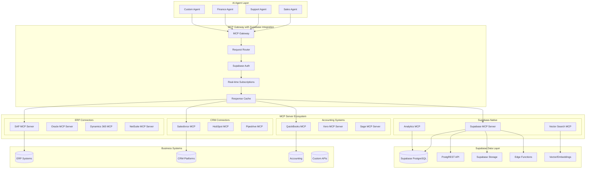
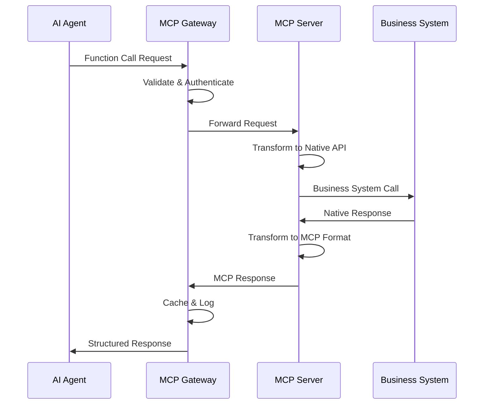

# MCP Servers

## Bridging AI and Business Systems

MCP (Model Context Protocol) Servers act as intelligent translators between AI agents and business systems, transforming complex enterprise APIs into AI-understandable interfaces. They provide secure, scalable, and semantically rich connections that enable AI agents to interact naturally with any business system.

## Supabase-Powered MCP Architecture



## MCP Protocol Fundamentals

### Core Protocol Specification

The Model Context Protocol defines standardized communication patterns between AI agents and business systems:

```typescript
// MCP Protocol Definition
interface MCPServer {
  // Server identification
  info: ServerInfo;
  
  // Available functions/tools
  functions: MCPFunction[];
  
  // Data schemas and types
  schemas: Record<string, JSONSchema>;
  
  // Real-time event subscriptions
  subscriptions: EventSubscription[];
}

interface MCPFunction {
  name: string;
  description: string;
  
  // Input schema (what the AI sends)
  input_schema: JSONSchema;
  
  // Output schema (what the system returns)
  output_schema: JSONSchema;
  
  // Examples for AI understanding
  examples: FunctionExample[];
  
  // Semantic annotations for better AI comprehension
  annotations: SemanticAnnotation[];
}

interface FunctionExample {
  description: string;
  input: any;
  output: any;
  context?: string;
}

// Semantic annotations help AI understand business context
interface SemanticAnnotation {
  type: 'business_entity' | 'workflow' | 'permission' | 'data_sensitivity';
  value: string;
  confidence: number;
}
```

### Protocol Message Flow



## Supabase Native MCP Server

### Supabase MCP Server Implementation

The Supabase MCP Server provides native integration with Supabase's complete backend-as-a-service platform, offering PostgreSQL database access, real-time subscriptions, storage, and Edge Functions.

```python
# Supabase MCP Server with comprehensive features
from supabase import create_client, Client
import asyncio
from typing import Dict, List, Optional, Any

class SupabaseMCPServer(MCPServer):
    def __init__(self, config: SupabaseConfig):
        self.supabase: Client = create_client(
            config.url,
            config.anon_key
        )
        self.service_client: Client = create_client(
            config.url,
            config.service_role_key
        )
        self.realtime_channels = {}
        self.functions = self._register_functions()
    
    def _register_functions(self):
        return [
            MCPFunction(
                name="query_table",
                description="Query Supabase table with filters, joins, and aggregations",
                input_schema={
                    "type": "object",
                    "properties": {
                        "table": {"type": "string", "description": "Table name to query"},
                        "select": {"type": "string", "default": "*", "description": "Columns to select"},
                        "filters": {"type": "object", "description": "Filter conditions"},
                        "order": {"type": "string", "description": "Order by clause"},
                        "limit": {"type": "integer", "default": 100, "maximum": 1000},
                        "offset": {"type": "integer", "default": 0}
                    },
                    "required": ["table"]
                },
                output_schema={
                    "type": "object",
                    "properties": {
                        "data": {"type": "array", "items": {"type": "object"}},
                        "count": {"type": "integer"},
                        "error": {"type": "string"}
                    }
                },
                examples=[
                    FunctionExample(
                        description="Get active users with their organizations",
                        input={
                            "table": "user_profiles",
                            "select": "*, organizations(name, plan)",
                            "filters": {"status": "active"},
                            "order": "created_at.desc",
                            "limit": 50
                        },
                        output={
                            "data": [
                                {
                                    "id": "user_123",
                                    "email": "user@company.com",
                                    "status": "active",
                                    "organizations": {"name": "Acme Corp", "plan": "professional"}
                                }
                            ],
                            "count": 50
                        }
                    )
                ]
            ),
            
            MCPFunction(
                name="insert_record",
                description="Insert new record into Supabase table",
                input_schema={
                    "type": "object",
                    "properties": {
                        "table": {"type": "string"},
                        "data": {"type": "object", "description": "Record data to insert"},
                        "upsert": {"type": "boolean", "default": False, "description": "Upsert if record exists"}
                    },
                    "required": ["table", "data"]
                },
                output_schema={
                    "type": "object",
                    "properties": {
                        "data": {"type": "object", "description": "Inserted record"},
                        "error": {"type": "string"}
                    }
                }
            ),
            
            MCPFunction(
                name="update_record",
                description="Update existing record in Supabase table",
                input_schema={
                    "type": "object",
                    "properties": {
                        "table": {"type": "string"},
                        "filters": {"type": "object", "description": "Update conditions"},
                        "data": {"type": "object", "description": "Data to update"}
                    },
                    "required": ["table", "filters", "data"]
                }
            ),
            
            MCPFunction(
                name="subscribe_to_changes",
                description="Subscribe to real-time changes on a table",
                input_schema={
                    "type": "object",
                    "properties": {
                        "table": {"type": "string"},
                        "events": {"type": "array", "items": {"type": "string", "enum": ["INSERT", "UPDATE", "DELETE"]}, "default": ["*"]},
                        "filter": {"type": "string", "description": "SQL filter for subscription"},
                        "callback_url": {"type": "string", "format": "uri", "description": "Webhook URL for real-time events"}
                    },
                    "required": ["table", "callback_url"]
                }
            ),
            
            MCPFunction(
                name="call_edge_function",
                description="Invoke Supabase Edge Function",
                input_schema={
                    "type": "object",
                    "properties": {
                        "function_name": {"type": "string"},
                        "payload": {"type": "object", "description": "Function payload"},
                        "headers": {"type": "object", "description": "Custom headers"}
                    },
                    "required": ["function_name"]
                }
            ),
            
            MCPFunction(
                name="vector_similarity_search",
                description="Perform vector similarity search using pgvector",
                input_schema={
                    "type": "object",
                    "properties": {
                        "table": {"type": "string"},
                        "vector_column": {"type": "string", "default": "embedding"},
                        "query_vector": {"type": "array", "items": {"type": "number"}},
                        "similarity_threshold": {"type": "number", "default": 0.7, "minimum": 0, "maximum": 1},
                        "limit": {"type": "integer", "default": 10, "maximum": 100},
                        "metadata_filters": {"type": "object", "description": "Additional metadata filters"}
                    },
                    "required": ["table", "query_vector"]
                },
                output_schema={
                    "type": "object",
                    "properties": {
                        "matches": {
                            "type": "array",
                            "items": {
                                "type": "object",
                                "properties": {
                                    "id": {"type": "string"},
                                    "similarity": {"type": "number"},
                                    "metadata": {"type": "object"}
                                }
                            }
                        }
                    }
                }
            ),
            
            MCPFunction(
                name="upload_file",
                description="Upload file to Supabase Storage",
                input_schema={
                    "type": "object",
                    "properties": {
                        "bucket": {"type": "string"},
                        "path": {"type": "string", "description": "File path in bucket"},
                        "file_data": {"type": "string", "description": "Base64 encoded file data"},
                        "content_type": {"type": "string"},
                        "upsert": {"type": "boolean", "default": False}
                    },
                    "required": ["bucket", "path", "file_data"]
                }
            )
        ]
    
    async def execute_function(self, function_name: str, parameters: dict):
        """Execute MCP function with Supabase integration"""
        
        try:
            if function_name == "query_table":
                return await self._query_table(parameters)
            elif function_name == "insert_record":
                return await self._insert_record(parameters)
            elif function_name == "update_record":
                return await self._update_record(parameters)
            elif function_name == "subscribe_to_changes":
                return await self._subscribe_to_changes(parameters)
            elif function_name == "call_edge_function":
                return await self._call_edge_function(parameters)
            elif function_name == "vector_similarity_search":
                return await self._vector_similarity_search(parameters)
            elif function_name == "upload_file":
                return await self._upload_file(parameters)
            else:
                raise MCPFunctionNotFoundError(f"Function {function_name} not found")
                
        except Exception as e:
            raise MCPExecutionError(f"Supabase operation failed: {str(e)}")
    
    async def _query_table(self, params):
        """Query Supabase table with advanced features"""
        
        query = self.supabase.table(params['table'])
        
        # Apply select
        if 'select' in params and params['select'] != '*':
            query = query.select(params['select'])
        else:
            query = query.select('*')
        
        # Apply filters
        if 'filters' in params:
            for key, value in params['filters'].items():
                if isinstance(value, dict):
                    # Handle complex filters like {"gte": 100} or {"in": [1,2,3]}
                    for op, val in value.items():
                        if op == 'eq':
                            query = query.eq(key, val)
                        elif op == 'neq':
                            query = query.neq(key, val)
                        elif op == 'gt':
                            query = query.gt(key, val)
                        elif op == 'gte':
                            query = query.gte(key, val)
                        elif op == 'lt':
                            query = query.lt(key, val)
                        elif op == 'lte':
                            query = query.lte(key, val)
                        elif op == 'in':
                            query = query.in_(key, val)
                        elif op == 'like':
                            query = query.like(key, val)
                        elif op == 'ilike':
                            query = query.ilike(key, val)
                else:
                    # Simple equality filter
                    query = query.eq(key, value)
        
        # Apply ordering
        if 'order' in params:
            order_parts = params['order'].split('.')
            column = order_parts[0]
            direction = order_parts[1] if len(order_parts) > 1 else 'asc'
            
            if direction.lower() == 'desc':
                query = query.order(column, desc=True)
            else:
                query = query.order(column, desc=False)
        
        # Apply limit and offset
        if 'limit' in params:
            query = query.limit(params['limit'])
        if 'offset' in params:
            query = query.offset(params['offset'])
        
        # Execute query
        response = query.execute()
        
        return {
            "data": response.data,
            "count": len(response.data) if response.data else 0
        }
    
    async def _insert_record(self, params):
        """Insert record into Supabase table"""
        
        table = self.supabase.table(params['table'])
        
        if params.get('upsert', False):
            response = table.upsert(params['data']).execute()
        else:
            response = table.insert(params['data']).execute()
        
        return {
            "data": response.data[0] if response.data else None
        }
    
    async def _update_record(self, params):
        """Update record in Supabase table"""
        
        query = self.supabase.table(params['table'])
        
        # Apply filters for update condition
        for key, value in params['filters'].items():
            query = query.eq(key, value)
        
        response = query.update(params['data']).execute()
        
        return {
            "data": response.data,
            "count": len(response.data) if response.data else 0
        }
    
    async def _subscribe_to_changes(self, params):
        """Setup real-time subscription to table changes"""
        
        channel_name = f"table-{params['table']}-{hash(str(params))}"
        
        # Create realtime channel
        channel = self.supabase.channel(channel_name)
        
        # Setup postgres changes subscription
        postgres_changes_config = {
            "event": params.get('events', ['*']),
            "schema": "public",
            "table": params['table']
        }
        
        if 'filter' in params:
            postgres_changes_config['filter'] = params['filter']
        
        def handle_postgres_changes(payload):
            """Handle real-time changes and forward to callback URL"""
            asyncio.create_task(self._forward_realtime_event(
                params['callback_url'], 
                payload
            ))
        
        channel.on_postgres_changes(
            **postgres_changes_config,
            callback=handle_postgres_changes
        )
        
        # Subscribe to channel
        channel.subscribe()
        
        # Store channel reference
        self.realtime_channels[channel_name] = channel
        
        return {
            "subscription_id": channel_name,
            "status": "subscribed",
            "message": f"Subscribed to changes on table '{params['table']}'"
        }
    
    async def _call_edge_function(self, params):
        """Call Supabase Edge Function"""
        
        headers = params.get('headers', {})
        payload = params.get('payload')
        
        response = self.supabase.functions.invoke(
            params['function_name'],
            invoke_options={
                "body": payload,
                "headers": headers
            }
        )
        
        return response
    
    async def _vector_similarity_search(self, params):
        """Perform vector similarity search using pgvector"""
        
        # Build RPC call for vector similarity search
        rpc_params = {
            "query_embedding": params['query_vector'],
            "match_threshold": params.get('similarity_threshold', 0.7),
            "match_count": params.get('limit', 10)
        }
        
        # Add metadata filters if provided
        if 'metadata_filters' in params:
            rpc_params['metadata_filter'] = params['metadata_filters']
        
        # Call stored procedure for vector search
        response = self.supabase.rpc(
            'match_documents',  # Assumes a stored procedure exists
            rpc_params
        ).execute()
        
        return {
            "matches": response.data or []
        }
    
    async def _upload_file(self, params):
        """Upload file to Supabase Storage"""
        
        import base64
        
        # Decode base64 file data
        file_bytes = base64.b64decode(params['file_data'])
        
        # Upload to storage
        response = self.supabase.storage.from_(params['bucket']).upload(
            path=params['path'],
            file=file_bytes,
            file_options={
                "content-type": params.get('content_type', 'application/octet-stream'),
                "upsert": params.get('upsert', False)
            }
        )
        
        if response.get('error'):
            raise Exception(response['error']['message'])
        
        # Get public URL
        public_url = self.supabase.storage.from_(params['bucket']).get_public_url(params['path'])
        
        return {
            "path": response['path'],
            "public_url": public_url,
            "size": len(file_bytes)
        }
    
    async def _forward_realtime_event(self, callback_url: str, payload: dict):
        """Forward real-time event to callback URL"""
        
        import aiohttp
        
        try:
            async with aiohttp.ClientSession() as session:
                await session.post(
                    callback_url,
                    json={
                        "event": "supabase_realtime",
                        "table": payload.get('table'),
                        "eventType": payload.get('eventType'),
                        "new": payload.get('new'),
                        "old": payload.get('old'),
                        "timestamp": payload.get('ts')
                    },
                    headers={"content-type": "application/json"}
                )
        except Exception as e:
            print(f"Failed to forward realtime event: {str(e)}")
```

### Supabase Real-time Subscriptions

Real-time capabilities are a core strength of Supabase, enabling AI agents to respond immediately to data changes.

```python
# Real-time subscription examples for AI agents
class SupabaseRealtimeIntegration:
    def __init__(self, supabase_client):
        self.supabase = supabase_client
        self.active_subscriptions = {}
    
    async def setup_agent_subscriptions(self, agent_id: str):
        """Setup real-time subscriptions for an AI agent"""
        
        subscriptions = [
            # Monitor user activities for sales agents
            {
                "table": "user_activities",
                "events": ["INSERT"],
                "filter": f"agent_id=eq.{agent_id}",
                "handler": self._handle_user_activity
            },
            
            # Monitor support tickets for support agents  
            {
                "table": "support_tickets",
                "events": ["INSERT", "UPDATE"],
                "filter": f"assigned_agent_id=eq.{agent_id}",
                "handler": self._handle_ticket_update
            },
            
            # Monitor system alerts
            {
                "table": "system_alerts",
                "events": ["INSERT"],
                "filter": "severity=eq.high",
                "handler": self._handle_system_alert
            }
        ]
        
        for sub in subscriptions:
            await self._create_subscription(agent_id, sub)
    
    async def _create_subscription(self, agent_id: str, config: dict):
        """Create a real-time subscription"""
        
        channel_name = f"agent-{agent_id}-{config['table']}"
        channel = self.supabase.channel(channel_name)
        
        channel.on_postgres_changes(
            event=config['events'],
            schema="public",
            table=config['table'],
            filter=config.get('filter'),
            callback=lambda payload: asyncio.create_task(
                config['handler'](agent_id, payload)
            )
        )
        
        channel.subscribe()
        self.active_subscriptions[channel_name] = channel
        
        return channel_name
    
    async def _handle_user_activity(self, agent_id: str, payload: dict):
        """Handle user activity events for sales agents"""
        
        activity = payload.get('new', {})
        
        # Trigger agent workflow based on activity type
        if activity.get('type') == 'page_view':
            await self._trigger_agent_workflow(agent_id, 'page_view_detected', activity)
        elif activity.get('type') == 'form_submission':
            await self._trigger_agent_workflow(agent_id, 'lead_conversion', activity)
        elif activity.get('type') == 'email_open':
            await self._trigger_agent_workflow(agent_id, 'email_engagement', activity)
    
    async def _handle_ticket_update(self, agent_id: str, payload: dict):
        """Handle support ticket updates"""
        
        ticket = payload.get('new', {})
        old_ticket = payload.get('old', {})
        
        # Check for priority changes
        if ticket.get('priority') != old_ticket.get('priority'):
            await self._trigger_agent_workflow(
                agent_id, 
                'priority_changed', 
                {
                    'ticket_id': ticket.get('id'),
                    'old_priority': old_ticket.get('priority'),
                    'new_priority': ticket.get('priority')
                }
            )
        
        # Check for new messages
        if payload.get('eventType') == 'INSERT':
            await self._trigger_agent_workflow(
                agent_id,
                'new_ticket_assigned',
                ticket
            )
    
    async def _handle_system_alert(self, agent_id: str, payload: dict):
        """Handle system alerts"""
        
        alert = payload.get('new', {})
        
        await self._trigger_agent_workflow(
            agent_id,
            'system_alert',
            {
                'alert_type': alert.get('type'),
                'severity': alert.get('severity'),
                'message': alert.get('message'),
                'requires_action': alert.get('requires_immediate_action', False)
            }
        )
    
    async def _trigger_agent_workflow(self, agent_id: str, event_type: str, data: dict):
        """Trigger AI agent workflow based on real-time events"""
        
        # This would integrate with your agent execution system
        workflow_payload = {
            "agent_id": agent_id,
            "trigger": event_type,
            "data": data,
            "timestamp": "now()",
            "source": "supabase_realtime"
        }
        
        # Queue workflow execution
        await self._queue_agent_workflow(workflow_payload)
    
    async def _queue_agent_workflow(self, payload: dict):
        """Queue agent workflow for execution"""
        
        # Insert into agent_workflows table for processing
        response = self.supabase.table('agent_workflows').insert({
            "agent_id": payload["agent_id"],
            "trigger_type": payload["trigger"],
            "payload": payload["data"],
            "status": "queued",
            "created_at": "now()"
        }).execute()
        
        return response
```

## Enterprise ERP Connectors

### SAP Integration

```python
# SAP MCP Server Implementation
class SAPMCPServer(MCPServer):
    def __init__(self, config: SAPConfig):
        self.sap_client = SAPClient(
            host=config.host,
            client=config.client,
            username=config.username,
            password=config.password
        )
        self.functions = self._register_functions()
    
    def _register_functions(self):
        return [
            MCPFunction(
                name="get_customer_info",
                description="Retrieve customer information from SAP",
                input_schema={
                    "type": "object",
                    "properties": {
                        "customer_id": {"type": "string", "description": "SAP customer number"},
                        "fields": {"type": "array", "items": {"type": "string"}, "default": ["*"]}
                    },
                    "required": ["customer_id"]
                },
                output_schema={
                    "type": "object",
                    "properties": {
                        "customer_id": {"type": "string"},
                        "name": {"type": "string"},
                        "address": {"type": "object"},
                        "credit_limit": {"type": "number"},
                        "payment_terms": {"type": "string"},
                        "last_order_date": {"type": "string", "format": "date"}
                    }
                },
                examples=[
                    FunctionExample(
                        description="Get basic customer information",
                        input={"customer_id": "CUST001"},
                        output={
                            "customer_id": "CUST001",
                            "name": "Acme Corporation", 
                            "credit_limit": 100000,
                            "payment_terms": "NET30"
                        }
                    )
                ],
                annotations=[
                    SemanticAnnotation(
                        type="business_entity",
                        value="customer",
                        confidence=0.95
                    ),
                    SemanticAnnotation(
                        type="data_sensitivity", 
                        value="confidential",
                        confidence=0.9
                    )
                ]
            ),
            
            MCPFunction(
                name="create_sales_order",
                description="Create a new sales order in SAP",
                input_schema={
                    "type": "object",
                    "properties": {
                        "customer_id": {"type": "string"},
                        "items": {
                            "type": "array",
                            "items": {
                                "type": "object",
                                "properties": {
                                    "material": {"type": "string"},
                                    "quantity": {"type": "number"},
                                    "price": {"type": "number"}
                                }
                            }
                        },
                        "delivery_date": {"type": "string", "format": "date"}
                    },
                    "required": ["customer_id", "items"]
                },
                output_schema={
                    "type": "object", 
                    "properties": {
                        "order_number": {"type": "string"},
                        "total_amount": {"type": "number"},
                        "status": {"type": "string"},
                        "estimated_delivery": {"type": "string", "format": "date"}
                    }
                },
                examples=[
                    FunctionExample(
                        description="Create order for office supplies",
                        input={
                            "customer_id": "CUST001",
                            "items": [
                                {"material": "PAPER_A4", "quantity": 100, "price": 5.99}
                            ]
                        },
                        output={
                            "order_number": "SO123456",
                            "total_amount": 599.00,
                            "status": "confirmed",
                            "estimated_delivery": "2025-09-01"
                        }
                    )
                ]
            )
        ]
    
    async def execute_function(self, function_name: str, parameters: dict):
        """Execute MCP function and return structured result"""
        
        if function_name == "get_customer_info":
            return await self._get_customer_info(parameters)
        elif function_name == "create_sales_order":
            return await self._create_sales_order(parameters)
        else:
            raise MCPFunctionNotFoundError(f"Function {function_name} not found")
    
    async def _get_customer_info(self, params):
        """Retrieve customer info from SAP"""
        try:
            # Call SAP RFC function
            result = await self.sap_client.call_function(
                'BAPI_CUSTOMER_GETDETAIL2',
                CUSTOMERNO=params['customer_id']
            )
            
            # Transform SAP response to MCP format
            return {
                "customer_id": result['CUSTOMERNO'],
                "name": result['CUSTOMERDETAIL']['NAME'],
                "address": {
                    "street": result['CUSTOMERDETAIL']['STREET'],
                    "city": result['CUSTOMERDETAIL']['CITY'],
                    "postal_code": result['CUSTOMERDETAIL']['POSTL_COD1'],
                    "country": result['CUSTOMERDETAIL']['COUNTRY']
                },
                "credit_limit": float(result['CUSTOMERDETAIL']['CREDIT_LIM']),
                "payment_terms": result['CUSTOMERDETAIL']['PMNTTRMS']
            }
            
        except SAPException as e:
            raise MCPExecutionError(f"SAP error: {e}")
```

### Oracle ERP Integration

```python
# Oracle ERP MCP Server
class OracleERPMCPServer(MCPServer):
    def __init__(self, config: OracleConfig):
        self.oracle_client = OracleClient(
            host=config.host,
            port=config.port,
            service_name=config.service_name,
            username=config.username,
            password=config.password
        )
        
    def _register_functions(self):
        return [
            MCPFunction(
                name="get_gl_balance",
                description="Get General Ledger account balance",
                input_schema={
                    "type": "object",
                    "properties": {
                        "account_code": {"type": "string"},
                        "period": {"type": "string", "format": "YYYY-MM"},
                        "currency": {"type": "string", "default": "USD"}
                    },
                    "required": ["account_code", "period"]
                },
                output_schema={
                    "type": "object",
                    "properties": {
                        "account_code": {"type": "string"},
                        "account_name": {"type": "string"},
                        "balance": {"type": "number"},
                        "currency": {"type": "string"},
                        "period": {"type": "string"},
                        "last_updated": {"type": "string", "format": "date-time"}
                    }
                }
            ),
            
            MCPFunction(
                name="create_purchase_requisition",
                description="Create purchase requisition in Oracle",
                input_schema={
                    "type": "object",
                    "properties": {
                        "items": {
                            "type": "array",
                            "items": {
                                "type": "object",
                                "properties": {
                                    "item_code": {"type": "string"},
                                    "description": {"type": "string"},
                                    "quantity": {"type": "number"},
                                    "unit_price": {"type": "number"},
                                    "department": {"type": "string"}
                                },
                                "required": ["item_code", "quantity", "department"]
                            }
                        },
                        "justification": {"type": "string"},
                        "requested_by": {"type": "string"},
                        "needed_by": {"type": "string", "format": "date"}
                    },
                    "required": ["items", "requested_by"]
                }
            )
        ]
    
    async def _get_gl_balance(self, params):
        """Query Oracle GL for account balance"""
        query = """
        SELECT 
            gcc.segment1 as account_code,
            gcc.description as account_name,
            SUM(gjl.accounted_dr - gjl.accounted_cr) as balance,
            gjh.currency_code,
            TO_CHAR(gjh.default_effective_date, 'YYYY-MM') as period
        FROM 
            gl_je_headers gjh,
            gl_je_lines gjl,
            gl_code_combinations gcc
        WHERE 
            gjh.je_header_id = gjl.je_header_id
            AND gjl.code_combination_id = gcc.code_combination_id
            AND gcc.segment1 = :account_code
            AND TO_CHAR(gjh.default_effective_date, 'YYYY-MM') = :period
        GROUP BY 
            gcc.segment1, gcc.description, gjh.currency_code, 
            TO_CHAR(gjh.default_effective_date, 'YYYY-MM')
        """
        
        result = await self.oracle_client.execute_query(
            query,
            account_code=params['account_code'],
            period=params['period']
        )
        
        if result:
            return {
                "account_code": result[0]['ACCOUNT_CODE'],
                "account_name": result[0]['ACCOUNT_NAME'], 
                "balance": float(result[0]['BALANCE']),
                "currency": params.get('currency', 'USD'),
                "period": params['period'],
                "last_updated": datetime.now().isoformat()
            }
        else:
            raise MCPExecutionError("Account not found or no data for period")
```

### Microsoft Dynamics 365 Integration

```yaml
# Dynamics 365 MCP Server Configuration
dynamics365:
  server_info:
    name: "Microsoft Dynamics 365 MCP Server"
    version: "1.0.0"
    description: "Connect AI agents to Dynamics 365 Business Central and Finance & Operations"
    
  connection:
    tenant_id: "${DYNAMICS_TENANT_ID}"
    client_id: "${DYNAMICS_CLIENT_ID}"
    client_secret: "${DYNAMICS_CLIENT_SECRET}"
    resource_url: "https://your-tenant.crm.dynamics.com"
    
  functions:
    - name: "get_contact"
      endpoint: "contacts"
      method: "GET"
      description: "Retrieve contact information from Dynamics 365"
      
    - name: "create_opportunity"
      endpoint: "opportunities"
      method: "POST"
      description: "Create new sales opportunity"
      
    - name: "get_account_summary"
      endpoint: "accounts"
      method: "GET"
      description: "Get account summary with related opportunities and activities"
      
  authentication:
    type: "oauth2"
    refresh_token_automatically: true
    
  rate_limiting:
    requests_per_minute: 100
    burst_limit: 20
```

## CRM Platform Connectors

### Salesforce Integration

```python
# Salesforce MCP Server with advanced features
class SalesforceMCPServer(MCPServer):
    def __init__(self, config: SalesforceConfig):
        self.sf_client = SalesforceClient(
            username=config.username,
            password=config.password,
            security_token=config.security_token,
            domain=config.domain,
            version=config.api_version or "54.0"
        )
        self.metadata_cache = {}
        
    def _register_functions(self):
        return [
            MCPFunction(
                name="query_records",
                description="Query Salesforce records using SOQL",
                input_schema={
                    "type": "object",
                    "properties": {
                        "object_type": {"type": "string", "description": "Salesforce object API name"},
                        "fields": {"type": "array", "items": {"type": "string"}},
                        "conditions": {"type": "string", "description": "WHERE clause conditions"},
                        "limit": {"type": "integer", "default": 100, "maximum": 2000}
                    },
                    "required": ["object_type"]
                },
                output_schema={
                    "type": "object",
                    "properties": {
                        "total_size": {"type": "integer"},
                        "records": {"type": "array", "items": {"type": "object"}},
                        "done": {"type": "boolean"}
                    }
                },
                examples=[
                    FunctionExample(
                        description="Find all open opportunities for a specific account",
                        input={
                            "object_type": "Opportunity",
                            "fields": ["Name", "Amount", "CloseDate", "StageName"],
                            "conditions": "AccountId = '001XX000003DHPi' AND IsClosed = false"
                        },
                        output={
                            "total_size": 5,
                            "records": [
                                {
                                    "Name": "Enterprise License Renewal",
                                    "Amount": 150000,
                                    "CloseDate": "2025-09-30",
                                    "StageName": "Proposal/Price Quote"
                                }
                            ],
                            "done": True
                        }
                    )
                ]
            ),
            
            MCPFunction(
                name="create_record",
                description="Create a new record in Salesforce",
                input_schema={
                    "type": "object",
                    "properties": {
                        "object_type": {"type": "string"},
                        "fields": {"type": "object", "description": "Field name-value pairs"}
                    },
                    "required": ["object_type", "fields"]
                },
                output_schema={
                    "type": "object",
                    "properties": {
                        "id": {"type": "string", "description": "Salesforce record ID"},
                        "success": {"type": "boolean"},
                        "errors": {"type": "array", "items": {"type": "string"}}
                    }
                }
            ),
            
            MCPFunction(
                name="intelligent_lead_scoring",
                description="AI-enhanced lead scoring using Salesforce data",
                input_schema={
                    "type": "object",
                    "properties": {
                        "lead_id": {"type": "string"},
                        "additional_context": {"type": "object"}
                    },
                    "required": ["lead_id"]
                },
                output_schema={
                    "type": "object",
                    "properties": {
                        "score": {"type": "integer", "minimum": 0, "maximum": 100},
                        "factors": {"type": "array", "items": {"type": "object"}},
                        "recommendations": {"type": "array", "items": {"type": "string"}},
                        "confidence": {"type": "number", "minimum": 0, "maximum": 1}
                    }
                }
            )
        ]
    
    async def _intelligent_lead_scoring(self, params):
        """Advanced lead scoring with AI enhancement"""
        
        # Get lead data from Salesforce
        lead_data = await self.sf_client.get_record('Lead', params['lead_id'])
        
        # Gather related data
        related_data = await self._gather_lead_context(lead_data)
        
        # Apply ML scoring model
        scoring_features = self._extract_scoring_features(lead_data, related_data)
        ml_score = await self._calculate_ml_score(scoring_features)
        
        # Generate explainable factors
        factors = await self._generate_scoring_factors(scoring_features, ml_score)
        
        # Create actionable recommendations
        recommendations = await self._generate_recommendations(lead_data, ml_score, factors)
        
        return {
            "score": int(ml_score.score),
            "factors": factors,
            "recommendations": recommendations,
            "confidence": ml_score.confidence
        }
    
    async def _gather_lead_context(self, lead_data):
        """Gather contextual data for lead scoring"""
        
        context = {}
        
        # Company information
        if lead_data.get('Company'):
            context['company'] = await self._enrich_company_data(lead_data['Company'])
        
        # Industry and market data
        if lead_data.get('Industry'):
            context['industry_trends'] = await self._get_industry_trends(lead_data['Industry'])
        
        # Similar customer analysis
        context['similar_customers'] = await self._find_similar_customers(lead_data)
        
        # Engagement history
        context['activities'] = await self._get_lead_activities(lead_data['Id'])
        
        return context
    
    def _extract_scoring_features(self, lead_data, context):
        """Extract features for ML scoring"""
        
        return {
            # Lead characteristics
            'title_seniority': self._categorize_title_seniority(lead_data.get('Title', '')),
            'company_size': self._estimate_company_size(context.get('company', {})),
            'industry_growth': context.get('industry_trends', {}).get('growth_rate', 0),
            
            # Engagement features
            'email_opens': context.get('activities', {}).get('email_opens', 0),
            'website_visits': context.get('activities', {}).get('website_visits', 0),
            'content_downloads': context.get('activities', {}).get('content_downloads', 0),
            
            # Behavioral features
            'response_time': context.get('activities', {}).get('avg_response_time', 0),
            'engagement_score': self._calculate_engagement_score(context.get('activities', {})),
            
            # Company features
            'company_revenue': context.get('company', {}).get('estimated_revenue', 0),
            'company_growth': context.get('company', {}).get('growth_rate', 0),
            'technology_stack': context.get('company', {}).get('technologies', []),
            
            # Similarity features
            'similar_customer_count': len(context.get('similar_customers', [])),
            'similar_customer_success_rate': self._calculate_success_rate(context.get('similar_customers', []))
        }
```

### HubSpot Integration

```python
# HubSpot MCP Server with workflow automation
class HubSpotMCPServer(MCPServer):
    def __init__(self, config: HubSpotConfig):
        self.hubspot_client = HubSpotClient(api_key=config.api_key)
        
    def _register_functions(self):
        return [
            MCPFunction(
                name="get_contact_timeline",
                description="Get complete timeline of contact interactions",
                input_schema={
                    "type": "object",
                    "properties": {
                        "contact_id": {"type": "string"},
                        "include_activities": {"type": "boolean", "default": True},
                        "date_range": {
                            "type": "object",
                            "properties": {
                                "start_date": {"type": "string", "format": "date"},
                                "end_date": {"type": "string", "format": "date"}
                            }
                        }
                    },
                    "required": ["contact_id"]
                }
            ),
            
            MCPFunction(
                name="trigger_workflow",
                description="Trigger HubSpot workflow for a contact or company",
                input_schema={
                    "type": "object",
                    "properties": {
                        "workflow_id": {"type": "string"},
                        "object_type": {"type": "string", "enum": ["contact", "company", "deal"]},
                        "object_id": {"type": "string"}
                    },
                    "required": ["workflow_id", "object_type", "object_id"]
                }
            ),
            
            MCPFunction(
                name="analyze_campaign_performance",
                description="Analyze email campaign performance with AI insights",
                input_schema={
                    "type": "object",
                    "properties": {
                        "campaign_id": {"type": "string"},
                        "comparison_period": {"type": "string", "enum": ["previous_campaign", "previous_month", "industry_benchmark"]}
                    },
                    "required": ["campaign_id"]
                }
            )
        ]
    
    async def _analyze_campaign_performance(self, params):
        """AI-powered campaign performance analysis"""
        
        # Get campaign data
        campaign = await self.hubspot_client.get_campaign(params['campaign_id'])
        campaign_stats = await self.hubspot_client.get_campaign_stats(params['campaign_id'])
        
        # Get comparison data
        comparison_data = await self._get_comparison_data(params['campaign_id'], params.get('comparison_period'))
        
        # AI analysis
        insights = await self._generate_campaign_insights(campaign, campaign_stats, comparison_data)
        
        # Generate recommendations
        recommendations = await self._generate_campaign_recommendations(insights)
        
        return {
            "campaign_performance": {
                "open_rate": campaign_stats.get('open_rate', 0),
                "click_rate": campaign_stats.get('click_rate', 0),
                "conversion_rate": campaign_stats.get('conversion_rate', 0),
                "unsubscribe_rate": campaign_stats.get('unsubscribe_rate', 0)
            },
            "comparison": comparison_data,
            "insights": insights,
            "recommendations": recommendations,
            "performance_score": self._calculate_performance_score(campaign_stats, comparison_data)
        }
```

## Accounting System Connectors

### QuickBooks Integration

```python
# QuickBooks MCP Server with financial intelligence
class QuickBooksMCPServer(MCPServer):
    def __init__(self, config: QuickBooksConfig):
        self.qb_client = QuickBooksClient(
            client_id=config.client_id,
            client_secret=config.client_secret,
            access_token=config.access_token,
            refresh_token=config.refresh_token,
            company_id=config.company_id
        )
        
    def _register_functions(self):
        return [
            MCPFunction(
                name="get_financial_summary", 
                description="Get comprehensive financial summary for a period",
                input_schema={
                    "type": "object",
                    "properties": {
                        "period": {"type": "string", "enum": ["current_month", "current_quarter", "current_year", "custom"]},
                        "start_date": {"type": "string", "format": "date"},
                        "end_date": {"type": "string", "format": "date"},
                        "include_comparisons": {"type": "boolean", "default": True}
                    },
                    "required": ["period"]
                },
                output_schema={
                    "type": "object",
                    "properties": {
                        "revenue": {"type": "number"},
                        "expenses": {"type": "number"},
                        "net_income": {"type": "number"},
                        "cash_flow": {"type": "object"},
                        "accounts_receivable": {"type": "number"},
                        "accounts_payable": {"type": "number"},
                        "comparisons": {"type": "object"}
                    }
                }
            ),
            
            MCPFunction(
                name="create_invoice",
                description="Create invoice with intelligent recommendations",
                input_schema={
                    "type": "object",
                    "properties": {
                        "customer_id": {"type": "string"},
                        "line_items": {
                            "type": "array",
                            "items": {
                                "type": "object",
                                "properties": {
                                    "description": {"type": "string"},
                                    "quantity": {"type": "number"},
                                    "rate": {"type": "number"},
                                    "item_ref": {"type": "string"}
                                }
                            }
                        },
                        "due_date": {"type": "string", "format": "date"},
                        "payment_terms": {"type": "string"}
                    },
                    "required": ["customer_id", "line_items"]
                }
            ),
            
            MCPFunction(
                name="cash_flow_forecast",
                description="AI-powered cash flow forecasting",
                input_schema={
                    "type": "object",
                    "properties": {
                        "forecast_months": {"type": "integer", "default": 6, "maximum": 12},
                        "scenario": {"type": "string", "enum": ["conservative", "realistic", "optimistic"]},
                        "include_pending_invoices": {"type": "boolean", "default": True}
                    }
                }
            )
        ]
    
    async def _cash_flow_forecast(self, params):
        """AI-powered cash flow forecasting"""
        
        # Get historical financial data
        historical_data = await self._get_historical_cash_flow(months=24)
        
        # Get pending invoices and bills
        pending_receivables = await self.qb_client.get_pending_invoices()
        pending_payables = await self.qb_client.get_pending_bills()
        
        # Get recurring transactions
        recurring_income = await self.qb_client.get_recurring_transactions('income')
        recurring_expenses = await self.qb_client.get_recurring_transactions('expense')
        
        # Apply ML forecasting model
        forecast = await self._generate_ml_forecast(
            historical_data=historical_data,
            pending_receivables=pending_receivables,
            pending_payables=pending_payables,
            recurring_transactions={
                'income': recurring_income,
                'expenses': recurring_expenses
            },
            forecast_months=params.get('forecast_months', 6),
            scenario=params.get('scenario', 'realistic')
        )
        
        # Generate insights and recommendations
        insights = await self._analyze_forecast_trends(forecast)
        recommendations = await self._generate_cash_flow_recommendations(forecast, insights)
        
        return {
            "forecast_period": f"{params.get('forecast_months', 6)} months",
            "scenario": params.get('scenario', 'realistic'),
            "monthly_projections": forecast.monthly_projections,
            "key_metrics": {
                "projected_cash_position": forecast.final_cash_position,
                "lowest_cash_month": forecast.lowest_cash_month,
                "cash_runway_months": forecast.cash_runway_months
            },
            "insights": insights,
            "recommendations": recommendations,
            "confidence_level": forecast.confidence_score
        }
```

### Xero Integration

```python
# Xero MCP Server with advanced reporting
class XeroMCPServer(MCPServer):
    def __init__(self, config: XeroConfig):
        self.xero_client = XeroClient(
            client_id=config.client_id,
            client_secret=config.client_secret,
            tenant_id=config.tenant_id
        )
        
    def _register_functions(self):
        return [
            MCPFunction(
                name="generate_management_report",
                description="Generate comprehensive management report with KPIs",
                input_schema={
                    "type": "object",
                    "properties": {
                        "report_type": {"type": "string", "enum": ["monthly", "quarterly", "annual"]},
                        "period_end": {"type": "string", "format": "date"},
                        "include_budget_variance": {"type": "boolean", "default": True},
                        "include_kpi_analysis": {"type": "boolean", "default": True}
                    },
                    "required": ["report_type", "period_end"]
                }
            ),
            
            MCPFunction(
                name="expense_categorization", 
                description="AI-powered expense categorization and analysis",
                input_schema={
                    "type": "object",
                    "properties": {
                        "date_range": {
                            "type": "object",
                            "properties": {
                                "start_date": {"type": "string", "format": "date"},
                                "end_date": {"type": "string", "format": "date"}
                            },
                            "required": ["start_date", "end_date"]
                        },
                        "analyze_anomalies": {"type": "boolean", "default": True},
                        "suggest_optimizations": {"type": "boolean", "default": True}
                    },
                    "required": ["date_range"]
                }
            )
        ]
    
    async def _expense_categorization(self, params):
        """AI-powered expense analysis and optimization"""
        
        # Get expense data
        expenses = await self.xero_client.get_bank_transactions(
            where=f"Type=='SPEND' AND Date>=datetime'{params['date_range']['start_date']}' AND Date<=datetime'{params['date_range']['end_date']}'"
        )
        
        # Categorize expenses using AI
        categorized_expenses = await self._ai_categorize_expenses(expenses)
        
        # Detect anomalies if requested
        anomalies = []
        if params.get('analyze_anomalies', True):
            anomalies = await self._detect_expense_anomalies(categorized_expenses)
        
        # Generate optimization suggestions
        optimizations = []
        if params.get('suggest_optimizations', True):
            optimizations = await self._suggest_expense_optimizations(categorized_expenses)
        
        # Calculate spending patterns
        patterns = await self._analyze_spending_patterns(categorized_expenses)
        
        return {
            "total_expenses": sum(exp.amount for exp in categorized_expenses),
            "category_breakdown": self._calculate_category_breakdown(categorized_expenses),
            "spending_patterns": patterns,
            "anomalies": anomalies,
            "optimization_opportunities": optimizations,
            "ai_insights": await self._generate_expense_insights(categorized_expenses)
        }
```

## Custom API & System Connectors

### Generic REST API MCP Server

```python
# Generic REST API MCP Server with intelligent adaptation
class GenericAPIMCPServer(MCPServer):
    def __init__(self, config: APIConfig):
        self.base_url = config.base_url
        self.auth = config.authentication
        self.rate_limiter = RateLimiter(config.rate_limits)
        self.schema_discoverer = APISchemaDiscoverer()
        
    async def discover_api_schema(self):
        """Automatically discover API schema and generate functions"""
        
        # Try common API discovery methods
        schema = None
        
        # 1. OpenAPI/Swagger specification
        try:
            schema = await self._discover_openapi_schema()
        except Exception:
            pass
        
        # 2. GraphQL introspection
        if not schema:
            try:
                schema = await self._discover_graphql_schema()
            except Exception:
                pass
        
        # 3. AI-powered endpoint discovery
        if not schema:
            schema = await self._ai_discover_endpoints()
        
        # Generate MCP functions from schema
        if schema:
            self.functions = await self._generate_functions_from_schema(schema)
        
        return schema
    
    async def _ai_discover_endpoints(self):
        """Use AI to discover API endpoints and their schemas"""
        
        # Get common endpoint patterns
        test_endpoints = [
            '/api/users', '/api/v1/users', '/users',
            '/api/orders', '/api/v1/orders', '/orders',
            '/api/products', '/api/v1/products', '/products',
            '/api/health', '/health', '/status'
        ]
        
        discovered_endpoints = []
        
        for endpoint in test_endpoints:
            try:
                # Test endpoint with GET request
                response = await self._safe_api_call('GET', endpoint)
                if response.status_code == 200:
                    
                    # Analyze response structure
                    schema = await self._infer_schema_from_response(response.json())
                    
                    discovered_endpoints.append({
                        'path': endpoint,
                        'method': 'GET',
                        'response_schema': schema,
                        'description': await self._ai_generate_description(endpoint, schema)
                    })
                    
            except Exception:
                continue
        
        return {
            'endpoints': discovered_endpoints,
            'base_url': self.base_url,
            'discovery_method': 'ai_exploration'
        }
    
    async def _generate_functions_from_schema(self, schema):
        """Generate MCP functions from discovered API schema"""
        
        functions = []
        
        for endpoint in schema['endpoints']:
            function_name = self._generate_function_name(endpoint['path'], endpoint['method'])
            
            function = MCPFunction(
                name=function_name,
                description=endpoint.get('description', f"{endpoint['method']} {endpoint['path']}"),
                input_schema=self._generate_input_schema(endpoint),
                output_schema=endpoint.get('response_schema', {"type": "object"}),
                examples=await self._generate_function_examples(endpoint)
            )
            
            functions.append(function)
        
        return functions
    
    def _generate_function_name(self, path, method):
        """Generate descriptive function name from API path and method"""
        
        # Clean up path
        clean_path = path.strip('/').replace('/', '_').replace('-', '_')
        
        # Add method prefix
        method_prefixes = {
            'GET': 'get',
            'POST': 'create',
            'PUT': 'update', 
            'DELETE': 'delete',
            'PATCH': 'modify'
        }
        
        prefix = method_prefixes.get(method, method.lower())
        
        return f"{prefix}_{clean_path}".replace('api_', '').replace('v1_', '')

# Database MCP Server
class DatabaseMCPServer(MCPServer):
    def __init__(self, config: DatabaseConfig):
        self.db_client = DatabaseClient(
            host=config.host,
            database=config.database,
            username=config.username,
            password=config.password,
            port=config.port
        )
        self.query_optimizer = QueryOptimizer()
        self.security_validator = QuerySecurityValidator()
        
    def _register_functions(self):
        return [
            MCPFunction(
                name="natural_language_query",
                description="Query database using natural language",
                input_schema={
                    "type": "object",
                    "properties": {
                        "question": {"type": "string", "description": "Natural language question about the data"},
                        "max_results": {"type": "integer", "default": 100},
                        "include_explanation": {"type": "boolean", "default": True}
                    },
                    "required": ["question"]
                },
                output_schema={
                    "type": "object",
                    "properties": {
                        "results": {"type": "array"},
                        "sql_query": {"type": "string"},
                        "explanation": {"type": "string"},
                        "result_count": {"type": "integer"}
                    }
                },
                examples=[
                    FunctionExample(
                        description="Find top customers by revenue this year",
                        input={"question": "Who are our top 10 customers by revenue this year?"},
                        output={
                            "results": [{"customer_name": "Acme Corp", "revenue": 150000}],
                            "sql_query": "SELECT customer_name, SUM(order_total) as revenue FROM...",
                            "explanation": "This query joins the customers and orders tables...",
                            "result_count": 10
                        }
                    )
                ]
            ),
            
            MCPFunction(
                name="execute_safe_query",
                description="Execute SQL query with security validation",
                input_schema={
                    "type": "object",
                    "properties": {
                        "sql_query": {"type": "string"},
                        "parameters": {"type": "object"},
                        "max_results": {"type": "integer", "default": 1000}
                    },
                    "required": ["sql_query"]
                }
            )
        ]
    
    async def _natural_language_query(self, params):
        """Convert natural language to SQL and execute"""
        
        # Get database schema context
        schema_context = await self.db_client.get_schema_metadata()
        
        # Convert natural language to SQL using AI
        sql_query = await self._nl_to_sql(params['question'], schema_context)
        
        # Validate query security
        security_check = await self.security_validator.validate_query(sql_query)
        if not security_check.safe:
            raise MCPSecurityError(f"Query rejected: {security_check.reason}")
        
        # Optimize query performance
        optimized_query = await self.query_optimizer.optimize(sql_query)
        
        # Execute query
        results = await self.db_client.execute_query(
            optimized_query,
            max_results=params.get('max_results', 100)
        )
        
        # Generate explanation if requested
        explanation = ""
        if params.get('include_explanation', True):
            explanation = await self._generate_query_explanation(
                sql_query, schema_context, results
            )
        
        return {
            "results": results,
            "sql_query": optimized_query,
            "explanation": explanation,
            "result_count": len(results)
        }
```

## MCP Server Management & Orchestration

### Server Registry & Discovery

```python
# MCP Server registry and discovery service
class MCPServerRegistry:
    def __init__(self):
        self.servers = {}
        self.health_monitor = HealthMonitor()
        self.load_balancer = LoadBalancer()
        
    async def register_server(self, server_info: MCPServerInfo):
        """Register new MCP server"""
        
        # Validate server
        validation = await self._validate_server(server_info)
        if not validation.valid:
            raise RegistrationError(validation.errors)
        
        # Health check
        health = await self.health_monitor.check_server_health(server_info.endpoint)
        if not health.healthy:
            raise RegistrationError("Server failed health check")
        
        # Add to registry
        self.servers[server_info.id] = RegisteredServer(
            info=server_info,
            registered_at=datetime.utcnow(),
            last_health_check=health,
            status='active'
        )
        
        # Setup monitoring
        await self.health_monitor.start_monitoring(server_info)
        
        return f"Server {server_info.name} registered successfully"
    
    async def discover_servers_for_task(self, task_description: str):
        """Find MCP servers capable of handling a specific task"""
        
        # Get task requirements using AI
        requirements = await self._analyze_task_requirements(task_description)
        
        # Find matching servers
        matching_servers = []
        
        for server_id, server in self.servers.items():
            if server.status != 'active':
                continue
                
            # Check capability match
            capability_score = await self._calculate_capability_score(
                server.info, requirements
            )
            
            if capability_score > 0.7:  # 70% match threshold
                matching_servers.append(ServerMatch(
                    server=server,
                    score=capability_score,
                    matching_functions=await self._identify_matching_functions(
                        server.info.functions, requirements
                    )
                ))
        
        # Sort by capability score
        matching_servers.sort(key=lambda x: x.score, reverse=True)
        
        return matching_servers
    
    async def _analyze_task_requirements(self, task_description):
        """Use AI to analyze what capabilities are needed for a task"""
        
        # AI prompt to extract requirements
        analysis_prompt = f"""
        Analyze this task and identify what business systems and capabilities are needed:
        
        Task: {task_description}
        
        Extract:
        1. Business systems (ERP, CRM, Accounting, etc.)
        2. Required operations (read, write, query, etc.)
        3. Data types involved
        4. Integration complexity level
        """
        
        # Use LLM to analyze
        analysis = await self.llm.analyze(analysis_prompt)
        
        return TaskRequirements(
            business_systems=analysis.get('business_systems', []),
            operations=analysis.get('operations', []),
            data_types=analysis.get('data_types', []),
            complexity=analysis.get('complexity', 'medium')
        )

# Intelligent request routing
class MCPRequestRouter:
    def __init__(self):
        self.registry = MCPServerRegistry()
        self.performance_tracker = PerformanceTracker()
        self.circuit_breaker = CircuitBreaker()
        
    async def route_request(self, request: MCPRequest):
        """Intelligently route MCP request to optimal server"""
        
        # Find capable servers
        capable_servers = await self.registry.discover_servers_for_task(
            request.function_name
        )
        
        if not capable_servers:
            raise NoCapableServerError("No servers can handle this request")
        
        # Score servers based on multiple factors
        server_scores = []
        for server_match in capable_servers:
            server = server_match.server
            
            # Get performance metrics
            perf_metrics = await self.performance_tracker.get_metrics(server.info.id)
            
            # Check circuit breaker status
            circuit_status = await self.circuit_breaker.get_status(server.info.id)
            
            # Calculate routing score
            score = self._calculate_routing_score(
                capability_score=server_match.score,
                performance_metrics=perf_metrics,
                circuit_status=circuit_status,
                current_load=server.current_load
            )
            
            server_scores.append(ServerScore(
                server=server,
                score=score,
                factors={
                    'capability': server_match.score,
                    'performance': perf_metrics.score,
                    'availability': 1.0 if circuit_status.closed else 0.0,
                    'load': 1.0 - (server.current_load / server.max_load)
                }
            ))
        
        # Select best server
        best_server = max(server_scores, key=lambda x: x.score)
        
        # Route request
        try:
            response = await self._execute_request(best_server.server, request)
            
            # Record success metrics
            await self.performance_tracker.record_success(
                best_server.server.info.id,
                response.execution_time
            )
            
            return response
            
        except Exception as e:
            # Record failure and potentially trigger circuit breaker
            await self.performance_tracker.record_failure(
                best_server.server.info.id,
                str(e)
            )
            
            # Try fallback servers
            return await self._try_fallback_servers(request, server_scores[1:])
```

## Security & Compliance

### Authentication & Authorization

```yaml
# MCP Server security configuration
security:
  authentication:
    methods:
      - oauth2
      - api_key
      - mutual_tls
      - saml
    
    token_validation:
      validate_expiry: true
      validate_audience: true
      validate_issuer: true
      
  authorization:
    model: "rbac"
    
    roles:
      - name: "agent_executor"
        permissions:
          - "mcp:call_function"
          - "mcp:read_schema"
        
      - name: "system_admin"
        permissions:
          - "mcp:*"
          - "server:manage"
          - "logs:read"
    
    function_permissions:
      "get_customer_info":
        required_scopes: ["customer:read"]
        data_classification: "confidential"
        
      "create_invoice":
        required_scopes: ["invoice:create", "financial:write"]
        data_classification: "restricted"
        approval_required: true
  
  encryption:
    in_transit: "tls_1.3"
    at_rest: "aes_256_gcm"
    key_rotation: "automatic"
    
  audit_logging:
    enabled: true
    log_level: "detailed"
    retention_days: 2555  # 7 years
    pii_masking: true
```

### Data Privacy & Governance

```python
# Data privacy and governance for MCP servers
class MCPDataGovernance:
    def __init__(self):
        self.data_classifier = DataClassifier()
        self.privacy_engine = PrivacyEngine()
        self.audit_logger = AuditLogger()
        
    async def validate_data_access(self, request: MCPRequest):
        """Validate data access permissions and privacy requirements"""
        
        # Classify data sensitivity
        data_classification = await self.data_classifier.classify_request(request)
        
        # Check privacy regulations compliance
        privacy_check = await self.privacy_engine.validate_compliance(
            request, data_classification
        )
        
        if not privacy_check.compliant:
            raise PrivacyViolationError(privacy_check.violations)
        
        # Log access for audit
        await self.audit_logger.log_data_access(
            request=request,
            classification=data_classification,
            user=request.user,
            timestamp=datetime.utcnow()
        )
        
        return privacy_check
    
    async def apply_data_masking(self, response_data, user_permissions):
        """Apply data masking based on user permissions"""
        
        masked_data = {}
        
        for field, value in response_data.items():
            field_sensitivity = await self.data_classifier.classify_field(field, value)
            
            if self._user_can_access_field(user_permissions, field_sensitivity):
                masked_data[field] = value
            else:
                # Apply appropriate masking
                if field_sensitivity.contains_pii:
                    masked_data[field] = self._mask_pii(value, field_sensitivity.pii_type)
                elif field_sensitivity.financial:
                    masked_data[field] = self._mask_financial_data(value)
                else:
                    masked_data[field] = "[REDACTED]"
        
        return masked_data
```

## Performance & Monitoring

### MCP Server Performance Monitoring

```python
# Comprehensive MCP server monitoring
class MCPServerMonitor:
    def __init__(self):
        self.metrics_collector = MetricsCollector()
        self.performance_analyzer = PerformanceAnalyzer()
        self.alerting = AlertingSystem()
        
    async def monitor_server_performance(self, server_id: str):
        """Monitor individual MCP server performance"""
        
        # Collect real-time metrics
        metrics = await self.metrics_collector.collect_server_metrics(server_id)
        
        # Analyze performance trends
        analysis = await self.performance_analyzer.analyze_trends(server_id, metrics)
        
        # Check for performance issues
        issues = await self._detect_performance_issues(metrics, analysis)
        
        # Generate alerts if needed
        for issue in issues:
            if issue.severity >= AlertSeverity.HIGH:
                await self.alerting.send_alert(issue)
        
        return ServerPerformanceReport(
            server_id=server_id,
            metrics=metrics,
            analysis=analysis,
            issues=issues,
            recommendations=await self._generate_performance_recommendations(analysis)
        )
    
    async def _detect_performance_issues(self, metrics, analysis):
        """Detect various performance issues"""
        
        issues = []
        
        # High response time
        if metrics.avg_response_time > 5000:  # 5 seconds
            issues.append(PerformanceIssue(
                type="high_response_time",
                severity=AlertSeverity.HIGH,
                description=f"Average response time is {metrics.avg_response_time}ms",
                impact="User experience degradation"
            ))
        
        # High error rate
        if metrics.error_rate > 0.05:  # 5%
            issues.append(PerformanceIssue(
                type="high_error_rate",
                severity=AlertSeverity.CRITICAL,
                description=f"Error rate is {metrics.error_rate*100:.1f}%",
                impact="Service reliability issues"
            ))
        
        # Memory leak detection
        if analysis.memory_trend.slope > 0.1:  # Growing memory usage
            issues.append(PerformanceIssue(
                type="memory_leak",
                severity=AlertSeverity.MEDIUM,
                description="Memory usage is consistently increasing",
                impact="Potential server instability"
            ))
        
        return issues
```

## Getting Started

### MCP Server Development Kit

```bash
# Install MCP Server SDK
npm install -g @aimatrix/mcp-sdk
# or
pip install aimatrix-mcp-sdk

# Create new MCP server
aimatrix mcp create \
  --name=my-erp-connector \
  --template=generic-api \
  --language=python

# Test MCP server
aimatrix mcp test \
  --server=./my-erp-connector \
  --test-suite=comprehensive

# Deploy MCP server
aimatrix mcp deploy \
  --server=./my-erp-connector \
  --environment=production \
  --monitoring=enabled
```

### Configuration Example

```yaml
# mcp-server-config.yaml
server:
  name: "Enterprise ERP Connector"
  version: "1.0.0"
  description: "Connect AI agents to enterprise ERP system"
  
  connection:
    type: "rest_api"
    base_url: "https://erp.company.com/api/v1"
    authentication:
      type: "oauth2"
      client_id: "${ERP_CLIENT_ID}"
      client_secret: "${ERP_CLIENT_SECRET}"
      token_endpoint: "https://erp.company.com/oauth/token"
    
  functions:
    - name: "get_customer"
      endpoint: "/customers/{id}"
      method: "GET"
      description: "Retrieve customer information"
      
    - name: "create_order"
      endpoint: "/orders"
      method: "POST"
      description: "Create new sales order"
      
  security:
    data_classification: "confidential"
    audit_logging: true
    rate_limiting:
      requests_per_minute: 100
      
  monitoring:
    health_check_endpoint: "/health"
    metrics_enabled: true
    performance_tracking: true
```

---

> [!NOTE]
> **Enterprise Integration**: MCP Servers provide the critical bridge between AI intelligence and existing business systems, enabling seamless digital transformation.

> [!TIP]
> **Start Simple**: Begin with read-only functions for existing systems, then gradually add write capabilities as confidence and trust build.

---

*MCP Servers - The intelligent connectors that make every business system AI-ready*