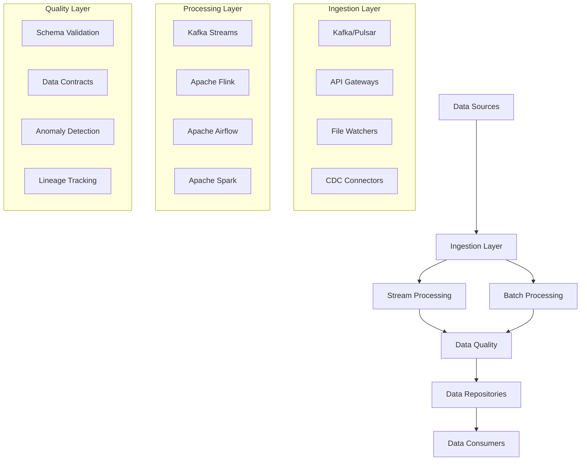

# Data Pipelines

The Data Pipelines component orchestrates the flow of data through the AIMatrix platform, ensuring reliable, scalable, and efficient data processing from ingestion to consumption. This system supports both real-time streaming and batch processing workflows with comprehensive quality assurance.

## Pipeline Architecture Overview



## Real-time Data Ingestion

### Apache Kafka Implementation

```python
from kafka import KafkaProducer, KafkaConsumer
from kafka.admin import KafkaAdminClient, NewTopic
import json
import asyncio
from typing import Dict, List, Any
import structlog

class KafkaIngestionManager:
    def __init__(self, bootstrap_servers: List[str], 
                 security_config: Dict[str, str] = None):
        self.bootstrap_servers = bootstrap_servers
        self.security_config = security_config or {}
        self.logger = structlog.get_logger()
        
        # Initialize admin client
        self.admin_client = KafkaAdminClient(
            bootstrap_servers=bootstrap_servers,
            **security_config
        )
        
    def create_optimized_topic(self, topic_name: str, 
                             partitions: int = 12, 
                             replication_factor: int = 3):
        """Create Kafka topic with optimal configuration"""
        topic_config = {
            'cleanup.policy': 'delete',
            'retention.ms': '604800000',  # 7 days
            'segment.ms': '86400000',     # 1 day
            'compression.type': 'snappy',
            'min.insync.replicas': '2'
        }
        
        topic = NewTopic(
            name=topic_name,
            num_partitions=partitions,
            replication_factor=replication_factor,
            topic_configs=topic_config
        )
        
        try:
            self.admin_client.create_topics([topic])
            self.logger.info(f"Created topic: {topic_name}")
        except Exception as e:
            self.logger.error(f"Failed to create topic {topic_name}: {e}")
            
    def create_producer(self, custom_config: Dict = None):
        """Create high-performance Kafka producer"""
        default_config = {
            'bootstrap_servers': self.bootstrap_servers,
            'value_serializer': lambda v: json.dumps(v).encode('utf-8'),
            'key_serializer': lambda v: v.encode('utf-8') if v else None,
            'acks': 'all',  # Wait for all replicas
            'retries': 3,
            'batch_size': 16384,
            'linger_ms': 5,  # Small delay for batching
            'compression_type': 'snappy',
            'max_in_flight_requests_per_connection': 5,
            'enable_idempotence': True
        }
        
        config = {**default_config, **self.security_config, **(custom_config or {})}
        return KafkaProducer(**config)
        
    async def batch_produce(self, producer: KafkaProducer, 
                          topic: str, messages: List[Dict]):
        """Efficiently batch produce messages"""
        futures = []
        
        for message in messages:
            key = message.get('key')
            value = message.get('value')
            
            future = producer.send(topic, key=key, value=value)
            futures.append(future)
            
        # Wait for all messages to be sent
        for future in futures:
            try:
                record_metadata = await asyncio.wrap_future(future)
                self.logger.debug(
                    "Message sent",
                    topic=record_metadata.topic,
                    partition=record_metadata.partition,
                    offset=record_metadata.offset
                )
            except Exception as e:
                self.logger.error(f"Failed to send message: {e}")
```

### Apache Pulsar Implementation

```python
import pulsar
from pulsar import Client, MessageId
import asyncio
from typing import Optional

class PulsarIngestionManager:
    def __init__(self, service_url: str, auth_config: Optional[Dict] = None):
        self.service_url = service_url
        self.auth_config = auth_config
        
        # Initialize client
        client_config = {'service_url': service_url}
        if auth_config:
            client_config.update(auth_config)
            
        self.client = pulsar.Client(**client_config)
        
    def create_producer(self, topic: str, producer_config: Dict = None):
        """Create optimized Pulsar producer"""
        default_config = {
            'topic': topic,
            'block_if_queue_full': True,
            'batching_enabled': True,
            'batching_max_messages': 1000,
            'batching_max_allowed_size_in_bytes': 1024 * 1024,  # 1MB
            'batching_max_publish_delay_ms': 10,
            'compression_type': pulsar.CompressionType.SNAPPY,
            'send_timeout_ms': 30000
        }
        
        config = {**default_config, **(producer_config or {})}
        return self.client.create_producer(**config)
        
    def create_consumer(self, topics: List[str], subscription_name: str,
                       consumer_config: Dict = None):
        """Create optimized Pulsar consumer"""
        default_config = {
            'topics': topics,
            'subscription_name': subscription_name,
            'consumer_type': pulsar.ConsumerType.Shared,
            'schema': pulsar.schema.StringSchema(),
            'initial_position': pulsar.InitialPosition.Latest,
            'prefetch_queue_size': 1000,
            'receiver_queue_size': 1000
        }
        
        config = {**default_config, **(consumer_config or {})}
        return self.client.subscribe(**config)
        
    async def process_messages(self, consumer, message_handler):
        """Asynchronous message processing"""
        while True:
            try:
                message = consumer.receive(timeout_millis=5000)
                
                # Process message
                await message_handler(message.data().decode('utf-8'))
                
                # Acknowledge message
                consumer.acknowledge(message)
                
            except Exception as e:
                self.logger.error(f"Error processing message: {e}")
                # Negative acknowledge for retry
                consumer.negative_acknowledge(message)
```

## ETL/ELT with Apache Airflow

### Advanced DAG Implementation

```python
from airflow import DAG
from airflow.operators.python import PythonOperator
from airflow.operators.bash import BashOperator
from airflow.providers.postgres.operators.postgres import PostgresOperator
from airflow.sensors.filesystem import FileSensor
from airflow.models import Variable
from datetime import datetime, timedelta
import pandas as pd

class AIMatrixETLPipeline:
    def __init__(self, dag_id: str, schedule_interval: str):
        self.dag_id = dag_id
        self.schedule_interval = schedule_interval
        
        # Default arguments
        self.default_args = {
            'owner': 'aimatrix',
            'depends_on_past': False,
            'start_date': datetime(2024, 1, 1),
            'email_on_failure': True,
            'email_on_retry': False,
            'retries': 3,
            'retry_delay': timedelta(minutes=5),
            'max_active_runs': 1
        }
        
        # Create DAG
        self.dag = DAG(
            dag_id=self.dag_id,
            default_args=self.default_args,
            description='AIMatrix ETL Pipeline',
            schedule_interval=self.schedule_interval,
            catchup=False,
            tags=['aimatrix', 'etl'],
            max_active_tasks=10
        )
        
    def create_data_ingestion_dag(self):
        """Create comprehensive data ingestion DAG"""
        
        # Data quality validation function
        def validate_data_quality(**context):
            """Validate incoming data quality"""
            import great_expectations as ge
            
            # Load data
            df = pd.read_csv(context['params']['input_file'])
            
            # Create Great Expectations dataset
            ge_df = ge.from_pandas(df)
            
            # Define expectations
            expectations = [
                ge_df.expect_column_to_exist('id'),
                ge_df.expect_column_values_to_not_be_null('id'),
                ge_df.expect_column_values_to_be_unique('id'),
                ge_df.expect_table_row_count_to_be_between(
                    min_value=1, max_value=1000000
                )
            ]
            
            # Validate
            validation_results = []
            for expectation in expectations:
                result = expectation.validate()
                validation_results.append(result)
                if not result.success:
                    raise ValueError(f"Data quality check failed: {result}")
                    
            return validation_results
            
        # Data transformation function
        def transform_data(**context):
            """Apply business logic transformations"""
            input_file = context['params']['input_file']
            output_file = context['params']['output_file']
            
            # Load data
            df = pd.read_csv(input_file)
            
            # Apply transformations
            df['processed_at'] = datetime.utcnow()
            df['source_system'] = context['params']['source_system']
            
            # Business logic
            if 'amount' in df.columns:
                df['amount_usd'] = df['amount'] * context['params'].get('exchange_rate', 1.0)
                
            # Data enrichment
            df = self._enrich_with_external_data(df)
            
            # Save transformed data
            df.to_csv(output_file, index=False)
            
            # Log statistics
            context['task_instance'].xcom_push(
                key='transformation_stats',
                value={
                    'rows_processed': len(df),
                    'columns': list(df.columns),
                    'processing_time': datetime.utcnow().isoformat()
                }
            )
            
        # File sensor
        file_sensor = FileSensor(
            task_id='wait_for_source_file',
            filepath=Variable.get('source_file_path'),
            fs_conn_id='fs_default',
            poke_interval=30,
            timeout=300,
            dag=self.dag
        )
        
        # Data validation
        validate_task = PythonOperator(
            task_id='validate_data_quality',
            python_callable=validate_data_quality,
            params={
                'input_file': Variable.get('source_file_path'),
                'quality_threshold': 0.95
            },
            dag=self.dag
        )
        
        # Data transformation
        transform_task = PythonOperator(
            task_id='transform_data',
            python_callable=transform_data,
            params={
                'input_file': Variable.get('source_file_path'),
                'output_file': Variable.get('processed_file_path'),
                'source_system': 'external_api'
            },
            dag=self.dag
        )
        
        # Load to database
        load_task = PostgresOperator(
            task_id='load_to_database',
            postgres_conn_id='aimatrix_db',
            sql="""
                COPY processed_data 
                FROM '{{ var.value.processed_file_path }}'
                WITH (FORMAT csv, HEADER true);
            """,
            dag=self.dag
        )
        
        # Data lineage tracking
        lineage_task = PythonOperator(
            task_id='track_data_lineage',
            python_callable=self._track_lineage,
            dag=self.dag
        )
        
        # Set dependencies
        file_sensor >> validate_task >> transform_task >> load_task >> lineage_task
        
        return self.dag
```

### Data Mesh Architecture

```python
from dataclasses import dataclass
from typing import Dict, List, Optional
import requests
import json

@dataclass
class DataContract:
    """Data contract specification"""
    name: str
    version: str
    schema: Dict
    sla: Dict
    ownership: Dict
    quality_requirements: Dict
    
class DataMeshManager:
    def __init__(self, catalog_url: str, auth_token: str):
        self.catalog_url = catalog_url
        self.auth_token = auth_token
        self.headers = {'Authorization': f'Bearer {auth_token}'}
        
    def register_data_product(self, contract: DataContract):
        """Register a new data product in the mesh"""
        payload = {
            'name': contract.name,
            'version': contract.version,
            'schema': contract.schema,
            'sla': contract.sla,
            'owner': contract.ownership,
            'quality': contract.quality_requirements,
            'discovery_metadata': {
                'tags': self._extract_tags(contract),
                'description': contract.schema.get('description', ''),
                'business_glossary_terms': self._extract_business_terms(contract)
            }
        }
        
        response = requests.post(
            f"{self.catalog_url}/data-products",
            json=payload,
            headers=self.headers
        )
        
        if response.status_code == 201:
            return response.json()['product_id']
        else:
            raise Exception(f"Failed to register data product: {response.text}")
            
    def validate_contract_compliance(self, product_id: str, 
                                   actual_data_sample: Dict) -> Dict:
        """Validate data against its contract"""
        # Get contract
        contract_response = requests.get(
            f"{self.catalog_url}/data-products/{product_id}/contract",
            headers=self.headers
        )
        
        if contract_response.status_code != 200:
            raise Exception("Failed to retrieve data contract")
            
        contract = contract_response.json()
        
        # Validate schema compliance
        schema_validation = self._validate_schema(
            actual_data_sample, 
            contract['schema']
        )
        
        # Validate quality requirements
        quality_validation = self._validate_quality(
            actual_data_sample,
            contract['quality']
        )
        
        # Validate SLA compliance
        sla_validation = self._validate_sla(
            product_id,
            contract['sla']
        )
        
        return {
            'compliant': all([
                schema_validation['valid'],
                quality_validation['valid'],
                sla_validation['valid']
            ]),
            'validations': {
                'schema': schema_validation,
                'quality': quality_validation,
                'sla': sla_validation
            }
        }
        
    def discover_data_products(self, search_criteria: Dict) -> List[Dict]:
        """Discover data products based on criteria"""
        params = {
            'tags': search_criteria.get('tags', []),
            'owner': search_criteria.get('owner'),
            'domain': search_criteria.get('domain'),
            'quality_score_min': search_criteria.get('min_quality', 0.8)
        }
        
        response = requests.get(
            f"{self.catalog_url}/data-products/search",
            params=params,
            headers=self.headers
        )
        
        if response.status_code == 200:
            return response.json()['products']
        else:
            raise Exception(f"Search failed: {response.text}")
```

## Stream Processing

### Apache Flink Implementation

```python
from pyflink.table import EnvironmentSettings, TableEnvironment
from pyflink.table.expressions import col, lit
from pyflink.common.typeinfo import Types
from pyflink.datastream import StreamExecutionEnvironment

class FlinkStreamProcessor:
    def __init__(self):
        # Create execution environment
        self.env = StreamExecutionEnvironment.get_execution_environment()
        self.env.set_parallelism(4)
        
        # Create table environment
        settings = EnvironmentSettings.new_instance() \
            .in_streaming_mode() \
            .use_blink_planner() \
            .build()
        self.table_env = TableEnvironment.create(settings)
        
    def setup_kafka_connector(self, kafka_config: Dict):
        """Configure Kafka connector for streaming"""
        kafka_ddl = f"""
        CREATE TABLE kafka_source (
            event_time TIMESTAMP(3) METADATA FROM 'timestamp',
            user_id STRING,
            event_type STRING,
            properties MAP<STRING, STRING>,
            WATERMARK FOR event_time AS event_time - INTERVAL '5' SECOND
        ) WITH (
            'connector' = 'kafka',
            'topic' = '{kafka_config['topic']}',
            'properties.bootstrap.servers' = '{kafka_config['bootstrap_servers']}',
            'properties.group.id' = '{kafka_config['group_id']}',
            'format' = 'json'
        )
        """
        
        self.table_env.execute_sql(kafka_ddl)
        
    def create_real_time_aggregation(self):
        """Create real-time windowed aggregations"""
        # Tumbling window aggregation
        result = self.table_env.sql_query("""
            SELECT 
                user_id,
                event_type,
                COUNT(*) as event_count,
                TUMBLE_START(event_time, INTERVAL '1' MINUTE) as window_start,
                TUMBLE_END(event_time, INTERVAL '1' MINUTE) as window_end
            FROM kafka_source
            GROUP BY 
                TUMBLE(event_time, INTERVAL '1' MINUTE),
                user_id,
                event_type
        """)
        
        # Create sink table
        sink_ddl = """
        CREATE TABLE aggregation_sink (
            user_id STRING,
            event_type STRING,
            event_count BIGINT,
            window_start TIMESTAMP(3),
            window_end TIMESTAMP(3)
        ) WITH (
            'connector' = 'elasticsearch-7',
            'hosts' = 'http://elasticsearch:9200',
            'index' = 'user_events_agg'
        )
        """
        
        self.table_env.execute_sql(sink_ddl)
        
        # Insert results into sink
        result.execute_insert('aggregation_sink')
        
    def implement_complex_event_processing(self):
        """Implement CEP for pattern detection"""
        from pyflink.cep import CEP, Pattern
        from pyflink.datastream.functions import KeySelector
        
        # Define pattern: Login -> Purchase within 1 hour
        pattern = Pattern.begin("login") \
            .where(lambda event: event['event_type'] == 'login') \
            .next("purchase") \
            .where(lambda event: event['event_type'] == 'purchase') \
            .within(3600000)  # 1 hour in milliseconds
            
        # Apply pattern to stream
        source_stream = self.table_env.to_append_stream(
            self.table_env.from_path('kafka_source'),
            Types.ROW([Types.STRING(), Types.STRING(), Types.SQL_TIMESTAMP()])
        )
        
        keyed_stream = source_stream.key_by(
            KeySelector(lambda event: event['user_id'])
        )
        
        pattern_stream = CEP.pattern(keyed_stream, pattern)
        
        # Process matches
        def process_pattern_match(match):
            login_event = match['login'][0]
            purchase_event = match['purchase'][0]
            
            return {
                'user_id': login_event['user_id'],
                'login_time': login_event['event_time'],
                'purchase_time': purchase_event['event_time'],
                'conversion_time_seconds': (
                    purchase_event['event_time'] - login_event['event_time']
                ).total_seconds(),
                'pattern': 'login_to_purchase'
            }
            
        result_stream = pattern_stream.select(process_pattern_match)
        
        return result_stream
```

### Kafka Streams Implementation

```python
from kafka.admin import KafkaAdminClient, NewTopic
import json
from typing import Dict, Any

class KafkaStreamsProcessor:
    def __init__(self, bootstrap_servers: str, application_id: str):
        self.bootstrap_servers = bootstrap_servers
        self.application_id = application_id
        
        # Kafka Streams configuration
        self.config = {
            'bootstrap.servers': bootstrap_servers,
            'application.id': application_id,
            'default.key.serde': 'org.apache.kafka.common.serialization.Serdes$StringSerde',
            'default.value.serde': 'org.apache.kafka.common.serialization.Serdes$StringSerde',
            'processing.guarantee': 'exactly_once',
            'replication.factor': 3,
            'min.insync.replicas': 2
        }
        
    def create_event_enrichment_topology(self):
        """Create topology for real-time event enrichment"""
        # This would typically be implemented in Java/Scala
        # Showing conceptual Python equivalent
        
        topology_definition = {
            'sources': {
                'events': {
                    'topic': 'raw-events',
                    'key_deserializer': 'string',
                    'value_deserializer': 'json'
                },
                'user_profiles': {
                    'topic': 'user-profiles',
                    'key_deserializer': 'string', 
                    'value_deserializer': 'json'
                }
            },
            'processors': {
                'enrich_events': {
                    'type': 'join',
                    'left_source': 'events',
                    'right_source': 'user_profiles',
                    'join_key': 'user_id',
                    'join_type': 'left_outer',
                    'window': '1_hour'
                },
                'filter_valid': {
                    'type': 'filter',
                    'condition': 'enriched_event.user_profile is not null'
                },
                'transform': {
                    'type': 'map',
                    'function': 'add_derived_fields'
                }
            },
            'sinks': {
                'enriched_events': {
                    'topic': 'enriched-events',
                    'key_serializer': 'string',
                    'value_serializer': 'json'
                }
            }
        }
        
        return topology_definition
        
    def implement_session_windowing(self):
        """Implement session-based windowing for user activity"""
        session_config = {
            'window_type': 'session',
            'inactivity_gap': '30_minutes',
            'grace_period': '5_minutes',
            'aggregation': {
                'page_views': 'count',
                'total_time': 'sum(time_on_page)',
                'bounce_rate': 'custom_function'
            }
        }
        
        return session_config
```

## Data Quality & Validation

### Great Expectations Integration

```python
import great_expectations as ge
from great_expectations.core import ExpectationSuite
from great_expectations.dataset import PandasDataset
import pandas as pd

class DataQualityManager:
    def __init__(self, context_root_dir: str):
        # Initialize Great Expectations context
        self.context = ge.get_context(context_root_dir=context_root_dir)
        
    def create_expectation_suite(self, suite_name: str, data_asset_name: str):
        """Create comprehensive expectation suite"""
        suite = self.context.create_expectation_suite(
            expectation_suite_name=suite_name,
            overwrite_existing=True
        )
        
        # Basic structural expectations
        basic_expectations = [
            {
                'expectation_type': 'expect_table_columns_to_match_ordered_list',
                'kwargs': {
                    'column_list': ['id', 'timestamp', 'user_id', 'event_type', 'value']
                }
            },
            {
                'expectation_type': 'expect_table_row_count_to_be_between',
                'kwargs': {
                    'min_value': 1,
                    'max_value': 1000000
                }
            }
        ]
        
        # Column-specific expectations
        column_expectations = {
            'id': [
                {
                    'expectation_type': 'expect_column_values_to_not_be_null'
                },
                {
                    'expectation_type': 'expect_column_values_to_be_unique'
                }
            ],
            'timestamp': [
                {
                    'expectation_type': 'expect_column_values_to_not_be_null'
                },
                {
                    'expectation_type': 'expect_column_values_to_be_of_type',
                    'kwargs': {'type_': 'datetime64'}
                }
            ],
            'user_id': [
                {
                    'expectation_type': 'expect_column_values_to_match_regex',
                    'kwargs': {'regex': r'^user_\d+$'}
                }
            ],
            'value': [
                {
                    'expectation_type': 'expect_column_values_to_be_between',
                    'kwargs': {'min_value': 0, 'max_value': 10000}
                }
            ]
        }
        
        # Add expectations to suite
        for expectation in basic_expectations:
            suite.add_expectation(**expectation)
            
        for column, expectations in column_expectations.items():
            for expectation in expectations:
                suite.add_expectation(
                    column=column,
                    **expectation
                )
                
        # Save suite
        self.context.save_expectation_suite(suite)
        return suite
        
    def validate_batch(self, batch_data: pd.DataFrame, 
                      expectation_suite_name: str) -> Dict:
        """Validate a batch of data"""
        # Create batch
        batch = ge.from_pandas(
            batch_data,
            expectation_suite=self.context.get_expectation_suite(
                expectation_suite_name
            )
        )
        
        # Run validation
        validation_result = batch.validate()
        
        # Process results
        validation_summary = {
            'success': validation_result.success,
            'statistics': validation_result.statistics,
            'failed_expectations': [
                {
                    'expectation_type': result.expectation_config.expectation_type,
                    'column': result.expectation_config.kwargs.get('column'),
                    'observed_value': result.result.get('observed_value'),
                    'details': result.result
                }
                for result in validation_result.results
                if not result.success
            ]
        }
        
        return validation_summary
        
    def setup_automated_profiling(self, data_source_name: str):
        """Set up automated data profiling"""
        profiler_config = {
            'data_source_name': data_source_name,
            'profiler_type': 'UserConfigurableProfiler',
            'config': {
                'semantic_types_dict': {
                    'numeric': ['value', 'amount', 'count'],
                    'datetime': ['timestamp', 'created_at', 'updated_at'],
                    'text': ['description', 'notes'],
                    'categorical': ['status', 'type', 'category']
                },
                'include_table_expectations': True,
                'include_column_expectations': True,
                'cardinality_limit_mode': 'abs',
                'max_unique_values': 100
            }
        }
        
        return profiler_config
```

### Data Contracts Implementation

```python
from pydantic import BaseModel, Field, validator
from typing import List, Dict, Any, Optional
from datetime import datetime
import yaml

class DataSchema(BaseModel):
    """Schema definition for data contracts"""
    fields: Dict[str, Dict[str, Any]]
    required_fields: List[str]
    optional_fields: List[str] = []
    
    @validator('fields')
    def validate_field_definitions(cls, v):
        required_keys = {'type', 'description'}
        for field_name, field_def in v.items():
            if not all(key in field_def for key in required_keys):
                raise ValueError(
                    f"Field {field_name} missing required keys: {required_keys}"
                )
        return v

class SLADefinition(BaseModel):
    """Service Level Agreement definition"""
    availability: float = Field(..., ge=0.0, le=1.0)
    latency_p99_ms: int = Field(..., gt=0)
    throughput_per_second: int = Field(..., gt=0)
    freshness_max_minutes: int = Field(..., gt=0)
    
class DataContract(BaseModel):
    """Complete data contract specification"""
    name: str
    version: str
    description: str
    owner: str
    schema: DataSchema
    sla: SLADefinition
    quality_requirements: Dict[str, Any]
    lineage: Dict[str, Any]
    created_at: datetime = Field(default_factory=datetime.utcnow)
    
class DataContractManager:
    def __init__(self, contract_registry_path: str):
        self.registry_path = contract_registry_path
        self.contracts = {}
        self.load_contracts()
        
    def load_contracts(self):
        """Load contracts from registry"""
        try:
            with open(self.registry_path, 'r') as f:
                contracts_data = yaml.safe_load(f)
                
            for contract_data in contracts_data.get('contracts', []):
                contract = DataContract(**contract_data)
                self.contracts[contract.name] = contract
                
        except FileNotFoundError:
            self.contracts = {}
            
    def register_contract(self, contract: DataContract):
        """Register new data contract"""
        # Validate contract
        self._validate_contract(contract)
        
        # Store contract
        self.contracts[contract.name] = contract
        
        # Save to registry
        self.save_contracts()
        
        return contract.name
        
    def validate_data_against_contract(self, contract_name: str, 
                                     data: pd.DataFrame) -> Dict:
        """Validate data against its contract"""
        if contract_name not in self.contracts:
            raise ValueError(f"Contract {contract_name} not found")
            
        contract = self.contracts[contract_name]
        validation_results = {
            'contract_name': contract_name,
            'validation_timestamp': datetime.utcnow().isoformat(),
            'schema_validation': self._validate_schema(data, contract.schema),
            'quality_validation': self._validate_quality(
                data, contract.quality_requirements
            ),
            'sla_compliance': self._check_sla_compliance(contract_name)
        }
        
        validation_results['overall_success'] = all([
            validation_results['schema_validation']['success'],
            validation_results['quality_validation']['success'],
            validation_results['sla_compliance']['success']
        ])
        
        return validation_results
        
    def _validate_schema(self, data: pd.DataFrame, 
                        schema: DataSchema) -> Dict:
        """Validate data schema compliance"""
        results = {
            'success': True,
            'errors': [],
            'warnings': []
        }
        
        # Check required columns
        missing_required = set(schema.required_fields) - set(data.columns)
        if missing_required:
            results['success'] = False
            results['errors'].append(
                f"Missing required columns: {missing_required}"
            )
            
        # Check column types
        for column in data.columns:
            if column in schema.fields:
                expected_type = schema.fields[column]['type']
                actual_type = str(data[column].dtype)
                
                if not self._types_compatible(actual_type, expected_type):
                    results['warnings'].append(
                        f"Column {column} type mismatch: "
                        f"expected {expected_type}, got {actual_type}"
                    )
                    
        return results
```

## Lineage Tracking

```python
import networkx as nx
from typing import Dict, List, Set
from datetime import datetime
import json

class DataLineageTracker:
    def __init__(self):
        self.lineage_graph = nx.DiGraph()
        self.lineage_metadata = {}
        
    def track_transformation(self, source_datasets: List[str],
                           target_dataset: str,
                           transformation_details: Dict):
        """Track data transformation lineage"""
        # Add nodes
        for dataset in source_datasets + [target_dataset]:
            if not self.lineage_graph.has_node(dataset):
                self.lineage_graph.add_node(dataset, type='dataset')
                
        # Add transformation node
        transformation_id = f"transform_{datetime.utcnow().isoformat()}"
        self.lineage_graph.add_node(transformation_id, type='transformation')
        
        # Add edges
        for source in source_datasets:
            self.lineage_graph.add_edge(source, transformation_id)
        self.lineage_graph.add_edge(transformation_id, target_dataset)
        
        # Store metadata
        self.lineage_metadata[transformation_id] = {
            'timestamp': datetime.utcnow().isoformat(),
            'transformation_type': transformation_details.get('type'),
            'code_reference': transformation_details.get('code_path'),
            'parameters': transformation_details.get('parameters', {}),
            'execution_metadata': transformation_details.get('metadata', {})
        }
        
    def get_upstream_lineage(self, dataset: str, max_depth: int = 10) -> Dict:
        """Get upstream data lineage"""
        upstream_graph = nx.DiGraph()
        visited = set()
        
        def traverse_upstream(node, current_depth):
            if current_depth >= max_depth or node in visited:
                return
                
            visited.add(node)
            upstream_graph.add_node(node)
            
            for predecessor in self.lineage_graph.predecessors(node):
                upstream_graph.add_edge(predecessor, node)
                traverse_upstream(predecessor, current_depth + 1)
                
        traverse_upstream(dataset, 0)
        
        return {
            'dataset': dataset,
            'upstream_dependencies': list(upstream_graph.nodes()),
            'dependency_graph': nx.node_link_data(upstream_graph),
            'critical_path': self._find_critical_path(upstream_graph, dataset)
        }
        
    def get_downstream_impact(self, dataset: str) -> Dict:
        """Get downstream impact analysis"""
        downstream_datasets = set()
        
        def traverse_downstream(node):
            for successor in self.lineage_graph.successors(node):
                if self.lineage_graph.nodes[successor]['type'] == 'dataset':
                    downstream_datasets.add(successor)
                traverse_downstream(successor)
                
        traverse_downstream(dataset)
        
        return {
            'dataset': dataset,
            'downstream_impact': list(downstream_datasets),
            'impact_severity': self._calculate_impact_severity(downstream_datasets)
        }
        
    def generate_lineage_report(self, format: str = 'json') -> str:
        """Generate comprehensive lineage report"""
        report_data = {
            'generation_timestamp': datetime.utcnow().isoformat(),
            'total_datasets': sum(1 for node in self.lineage_graph.nodes() 
                                if self.lineage_graph.nodes[node]['type'] == 'dataset'),
            'total_transformations': sum(1 for node in self.lineage_graph.nodes() 
                                       if self.lineage_graph.nodes[node]['type'] == 'transformation'),
            'lineage_graph': nx.node_link_data(self.lineage_graph),
            'transformation_metadata': self.lineage_metadata,
            'quality_metrics': self._calculate_lineage_quality_metrics()
        }
        
        if format == 'json':
            return json.dumps(report_data, indent=2)
        elif format == 'graphml':
            return nx.write_graphml_lxml(self.lineage_graph)
        else:
            raise ValueError(f"Unsupported format: {format}")
```

## Performance Optimization

### Pipeline Optimization Strategies

```python
import asyncio
from concurrent.futures import ThreadPoolExecutor, ProcessPoolExecutor
import multiprocessing as mp

class PipelineOptimizer:
    def __init__(self):
        self.optimization_strategies = {}
        self.performance_metrics = {}
        
    def adaptive_batch_sizing(self, pipeline_id: str, 
                            current_throughput: float,
                            target_throughput: float) -> int:
        """Dynamically adjust batch sizes based on performance"""
        current_batch_size = self.optimization_strategies.get(
            pipeline_id, {}).get('batch_size', 100
        )
        
        throughput_ratio = current_throughput / target_throughput
        
        if throughput_ratio < 0.8:  # Underperforming
            new_batch_size = max(10, int(current_batch_size * 0.8))
        elif throughput_ratio > 1.2:  # Over-performing
            new_batch_size = min(1000, int(current_batch_size * 1.2))
        else:
            new_batch_size = current_batch_size
            
        self.optimization_strategies[pipeline_id] = {
            'batch_size': new_batch_size,
            'last_updated': datetime.utcnow().isoformat()
        }
        
        return new_batch_size
        
    async def parallel_processing(self, data_batches: List[List], 
                                processing_function, 
                                max_workers: int = None):
        """Optimize parallel processing based on workload"""
        if max_workers is None:
            max_workers = min(mp.cpu_count(), len(data_batches))
            
        # Choose executor based on workload characteristics
        if self._is_cpu_intensive(processing_function):
            executor = ProcessPoolExecutor(max_workers=max_workers)
        else:
            executor = ThreadPoolExecutor(max_workers=max_workers)
            
        loop = asyncio.get_event_loop()
        
        tasks = [
            loop.run_in_executor(executor, processing_function, batch)
            for batch in data_batches
        ]
        
        try:
            results = await asyncio.gather(*tasks)
            return results
        finally:
            executor.shutdown(wait=True)
            
    def memory_optimization(self, data_stream, 
                          memory_limit_gb: float = 8.0) -> Generator:
        """Optimize memory usage for large data streams"""
        import psutil
        
        current_memory_gb = psutil.virtual_memory().used / (1024**3)
        chunk_size = 10000
        
        # Adjust chunk size based on available memory
        available_memory_gb = memory_limit_gb - current_memory_gb
        if available_memory_gb < 2.0:
            chunk_size = max(1000, chunk_size // 2)
        elif available_memory_gb > 6.0:
            chunk_size = min(100000, chunk_size * 2)
            
        chunk = []
        for item in data_stream:
            chunk.append(item)
            
            if len(chunk) >= chunk_size:
                yield chunk
                chunk = []
                
                # Check memory usage and adjust
                current_memory_gb = psutil.virtual_memory().used / (1024**3)
                if current_memory_gb > memory_limit_gb * 0.9:
                    chunk_size = max(100, chunk_size // 2)
                    
        if chunk:
            yield chunk
```

## Monitoring & Alerting

```python
from prometheus_client import Counter, Histogram, Gauge, start_http_server
import logging
import structlog
from typing import Dict, List

class PipelineMonitoring:
    def __init__(self):
        # Prometheus metrics
        self.pipeline_executions = Counter(
            'pipeline_executions_total',
            'Total pipeline executions',
            ['pipeline_id', 'status']
        )
        
        self.pipeline_duration = Histogram(
            'pipeline_execution_duration_seconds',
            'Pipeline execution duration',
            ['pipeline_id']
        )
        
        self.data_quality_score = Gauge(
            'data_quality_score',
            'Data quality score',
            ['dataset', 'quality_dimension']
        )
        
        self.pipeline_throughput = Gauge(
            'pipeline_throughput_records_per_second',
            'Pipeline throughput',
            ['pipeline_id']
        )
        
        # Structured logging
        self.logger = structlog.get_logger()
        
    def monitor_pipeline_execution(self, pipeline_id: str):
        """Context manager for monitoring pipeline execution"""
        class PipelineExecutionMonitor:
            def __init__(self, monitoring_instance, pipeline_id):
                self.monitoring = monitoring_instance
                self.pipeline_id = pipeline_id
                self.timer = None
                
            def __enter__(self):
                self.timer = self.monitoring.pipeline_duration.labels(
                    pipeline_id=self.pipeline_id
                ).time()
                self.timer.__enter__()
                return self
                
            def __exit__(self, exc_type, exc_val, exc_tb):
                status = 'success' if exc_type is None else 'failure'
                self.monitoring.pipeline_executions.labels(
                    pipeline_id=self.pipeline_id,
                    status=status
                ).inc()
                
                if self.timer:
                    self.timer.__exit__(exc_type, exc_val, exc_tb)
                    
                if exc_type:
                    self.monitoring.logger.error(
                        "pipeline_execution_failed",
                        pipeline_id=self.pipeline_id,
                        error=str(exc_val)
                    )
                else:
                    self.monitoring.logger.info(
                        "pipeline_execution_completed",
                        pipeline_id=self.pipeline_id
                    )
                    
        return PipelineExecutionMonitor(self, pipeline_id)
        
    def alert_on_anomalies(self, metrics: Dict[str, float], 
                          thresholds: Dict[str, Dict]):
        """Generate alerts based on metric thresholds"""
        alerts = []
        
        for metric_name, value in metrics.items():
            if metric_name in thresholds:
                threshold_config = thresholds[metric_name]
                
                # Check thresholds
                if 'min' in threshold_config and value < threshold_config['min']:
                    alerts.append({
                        'type': 'threshold_violation',
                        'metric': metric_name,
                        'value': value,
                        'threshold': threshold_config['min'],
                        'severity': threshold_config.get('severity', 'warning'),
                        'direction': 'below'
                    })
                    
                if 'max' in threshold_config and value > threshold_config['max']:
                    alerts.append({
                        'type': 'threshold_violation',
                        'metric': metric_name,
                        'value': value,
                        'threshold': threshold_config['max'],
                        'severity': threshold_config.get('severity', 'warning'),
                        'direction': 'above'
                    })
                    
        # Send alerts
        for alert in alerts:
            self._send_alert(alert)
            
        return alerts
        
    def _send_alert(self, alert: Dict):
        """Send alert to notification systems"""
        self.logger.warning(
            "pipeline_alert_triggered",
            alert_type=alert['type'],
            metric=alert['metric'],
            value=alert['value'],
            severity=alert['severity']
        )
        
        # Integration with alerting systems (Slack, PagerDuty, etc.)
        # Implementation depends on specific requirements
```

## Next Steps

- **[RAG & GraphRAG](../rag-graphrag/)** - Implement advanced retrieval systems
- **[Knowledge Management](../knowledge-management/)** - Set up automated knowledge extraction
- **[ML/AI Integration](../ml-ai-integration/)** - Connect with machine learning workflows
- **[Performance Optimization](../performance-optimization/)** - Advanced optimization techniques

The Data Pipelines component ensures reliable, scalable, and high-quality data flow throughout the AIMatrix platform, enabling real-time insights and automated decision-making.