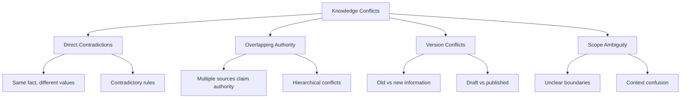

# Conflict Resolution

Handle conflicting information between knowledge capsules through intelligent priority scoring, namespace isolation, and strategic merge approaches.

## Understanding Knowledge Conflicts

### Types of Conflicts



### Conflict Categories

1. **Regulatory Conflicts**: Different versions of compliance rules
2. **Policy Conflicts**: Overlapping or contradictory policies  
3. **Procedural Conflicts**: Different ways to accomplish the same task
4. **Factual Conflicts**: Contradictory information about the same topic

## Priority and Trust Scoring System

### Trust Score Calculation

```typescript
interface TrustFactors {
  sourceCredibility: number;    // 0-1 scale
  recency: number;             // 0-1 scale  
  verificationLevel: number;   // 0-1 scale
  usageFrequency: number;      // 0-1 scale
  userFeedback: number;        // 0-1 scale
}

interface PriorityWeights {
  authority: number;           // 0.4
  recency: number;            // 0.2
  specificity: number;        // 0.2
  verification: number;       // 0.1
  usage: number;              // 0.1
}

class TrustScoreCalculator {
  private weights: PriorityWeights = {
    authority: 0.4,
    recency: 0.2,
    specificity: 0.2,
    verification: 0.1,
    usage: 0.1
  };
  
  calculateTrustScore(capsule: KnowledgeCapsule, factors: TrustFactors): number {
    const authorityScore = this.getAuthorityScore(capsule);
    const recencyScore = this.getRecencyScore(capsule.updatedAt);
    const specificityScore = this.getSpecificityScore(capsule);
    
    return (
      authorityScore * this.weights.authority +
      recencyScore * this.weights.recency +
      specificityScore * this.weights.specificity +
      factors.verificationLevel * this.weights.verification +
      factors.usageFrequency * this.weights.usage
    );
  }
  
  private getAuthorityScore(capsule: KnowledgeCapsule): number {
    const authorityLevels = {
      'regulatory_body': 1.0,
      'legal_department': 0.9,
      'management': 0.8,
      'subject_matter_expert': 0.7,
      'verified_user': 0.6,
      'standard_user': 0.4
    };
    
    return authorityLevels[capsule.metadata.authorityLevel] || 0.4;
  }
  
  private getRecencyScore(updatedAt: Date): number {
    const daysSinceUpdate = (Date.now() - updatedAt.getTime()) / (1000 * 60 * 60 * 24);
    
    // Exponential decay - newer content has higher score
    return Math.exp(-daysSinceUpdate / 30); // Half-life of 30 days
  }
  
  private getSpecificityScore(capsule: KnowledgeCapsule): number {
    // More specific rules/policies have higher priority
    const scopeScore = {
      'global': 0.3,
      'regional': 0.5,
      'departmental': 0.7,
      'team_specific': 0.8,
      'individual': 1.0
    };
    
    return scopeScore[capsule.metadata.scope] || 0.5;
  }
}
```

### Supabase Implementation

```sql
-- Trust scoring function
CREATE OR REPLACE FUNCTION calculate_trust_score(
    capsule_id UUID,
    authority_level TEXT,
    updated_at TIMESTAMP WITH TIME ZONE,
    scope TEXT,
    verification_level FLOAT DEFAULT 0.5,
    usage_frequency FLOAT DEFAULT 0.5
)
RETURNS FLOAT
LANGUAGE plpgsql
AS $$
DECLARE
    authority_score FLOAT;
    recency_score FLOAT;
    specificity_score FLOAT;
    final_score FLOAT;
    days_since_update FLOAT;
BEGIN
    -- Calculate authority score
    authority_score := CASE authority_level
        WHEN 'regulatory_body' THEN 1.0
        WHEN 'legal_department' THEN 0.9
        WHEN 'management' THEN 0.8
        WHEN 'subject_matter_expert' THEN 0.7
        WHEN 'verified_user' THEN 0.6
        ELSE 0.4
    END;
    
    -- Calculate recency score (exponential decay)
    days_since_update := EXTRACT(EPOCH FROM (NOW() - updated_at)) / (60 * 60 * 24);
    recency_score := EXP(-days_since_update / 30.0);
    
    -- Calculate specificity score
    specificity_score := CASE scope
        WHEN 'individual' THEN 1.0
        WHEN 'team_specific' THEN 0.8
        WHEN 'departmental' THEN 0.7
        WHEN 'regional' THEN 0.5
        WHEN 'global' THEN 0.3
        ELSE 0.5
    END;
    
    -- Weighted final score
    final_score := (
        authority_score * 0.4 +
        recency_score * 0.2 +
        specificity_score * 0.2 +
        verification_level * 0.1 +
        usage_frequency * 0.1
    );
    
    RETURN final_score;
END;
$$;
```

## Namespace Isolation

### Hierarchical Namespaces

```typescript
interface KnowledgeNamespace {
  id: string;
  name: string;
  parent?: string;
  authority: AuthorityLevel;
  isolation: IsolationLevel;
  inheritsFrom: string[];
  overrides: string[];
}

enum IsolationLevel {
  STRICT = 'strict',        // No inheritance, complete isolation
  SELECTIVE = 'selective',  // Explicit inheritance rules
  PERMISSIVE = 'permissive' // Inherits unless explicitly blocked
}

class NamespaceManager {
  async resolveConflict(
    capsules: KnowledgeCapsule[],
    context: QueryContext
  ): Promise<KnowledgeCapsule> {
    
    // Filter capsules by namespace accessibility
    const accessibleCapsules = this.filterByNamespace(capsules, context);
    
    // Group by conflict type
    const conflictGroups = this.groupConflicts(accessibleCapsules);
    
    // Apply resolution strategy for each group
    const resolved = await Promise.all(
      conflictGroups.map(group => this.resolveGroup(group, context))
    );
    
    // Merge results
    return this.mergeResolutions(resolved);
  }
  
  private filterByNamespace(
    capsules: KnowledgeCapsule[],
    context: QueryContext
  ): KnowledgeCapsule[] {
    return capsules.filter(capsule => {
      const namespace = this.getNamespace(capsule.namespaceId);
      return this.canAccess(namespace, context.userNamespace);
    });
  }
  
  private canAccess(target: KnowledgeNamespace, user: string): boolean {
    // Check if user namespace has access to target namespace
    const userNS = this.getNamespace(user);
    
    if (target.isolation === IsolationLevel.STRICT) {
      return target.id === user;
    }
    
    if (target.isolation === IsolationLevel.SELECTIVE) {
      return target.id === user || userNS.inheritsFrom.includes(target.id);
    }
    
    // Permissive: inherit unless blocked
    return !userNS.overrides.includes(target.id);
  }
}
```

### Namespace Database Schema

```sql
-- Namespace hierarchy table
CREATE TABLE knowledge_namespaces (
    id UUID PRIMARY KEY DEFAULT gen_random_uuid(),
    name TEXT NOT NULL,
    parent_id UUID REFERENCES knowledge_namespaces(id),
    authority_level TEXT NOT NULL,
    isolation_level TEXT NOT NULL DEFAULT 'selective',
    inherits_from UUID[] DEFAULT '{}',
    overrides UUID[] DEFAULT '{}',
    created_at TIMESTAMP WITH TIME ZONE DEFAULT NOW(),
    updated_at TIMESTAMP WITH TIME ZONE DEFAULT NOW()
);

-- Add namespace column to knowledge capsules
ALTER TABLE knowledge_capsules 
ADD COLUMN namespace_id UUID REFERENCES knowledge_namespaces(id);

-- Function to check namespace access
CREATE OR REPLACE FUNCTION can_access_namespace(
    user_namespace_id UUID,
    target_namespace_id UUID
)
RETURNS BOOLEAN
LANGUAGE plpgsql
AS $$
DECLARE
    target_ns RECORD;
    user_ns RECORD;
BEGIN
    -- Get namespace details
    SELECT * INTO target_ns FROM knowledge_namespaces WHERE id = target_namespace_id;
    SELECT * INTO user_ns FROM knowledge_namespaces WHERE id = user_namespace_id;
    
    -- Same namespace always has access
    IF user_namespace_id = target_namespace_id THEN
        RETURN TRUE;
    END IF;
    
    -- Check isolation level
    CASE target_ns.isolation_level
        WHEN 'strict' THEN
            RETURN FALSE;
        WHEN 'selective' THEN
            RETURN target_namespace_id = ANY(user_ns.inherits_from);
        WHEN 'permissive' THEN
            RETURN NOT (target_namespace_id = ANY(user_ns.overrides));
        ELSE
            RETURN FALSE;
    END CASE;
END;
$$;
```

## Override Mechanisms

### Override Strategies

```typescript
enum OverrideStrategy {
  REPLACE = 'replace',           // Completely replace conflicting content
  MERGE = 'merge',               // Combine non-conflicting parts
  SUPPLEMENT = 'supplement',     // Add to existing content
  CONTEXT_AWARE = 'context_aware' // Choose based on query context
}

interface OverrideRule {
  id: string;
  sourceNamespace: string;
  targetNamespace: string;
  strategy: OverrideStrategy;
  conditions: OverrideCondition[];
  priority: number;
}

interface OverrideCondition {
  field: string;
  operator: 'equals' | 'contains' | 'regex' | 'exists';
  value: any;
}

class OverrideManager {
  async applyOverride(
    baseCapsule: KnowledgeCapsule,
    overrideCapsule: KnowledgeCapsule,
    rule: OverrideRule
  ): Promise<KnowledgeCapsule> {
    
    switch (rule.strategy) {
      case OverrideStrategy.REPLACE:
        return this.replaceStrategy(baseCapsule, overrideCapsule);
      
      case OverrideStrategy.MERGE:
        return this.mergeStrategy(baseCapsule, overrideCapsule);
      
      case OverrideStrategy.SUPPLEMENT:
        return this.supplementStrategy(baseCapsule, overrideCapsule);
      
      case OverrideStrategy.CONTEXT_AWARE:
        return this.contextAwareStrategy(baseCapsule, overrideCapsule, rule);
      
      default:
        throw new Error(`Unknown override strategy: ${rule.strategy}`);
    }
  }
  
  private replaceStrategy(
    base: KnowledgeCapsule,
    override: KnowledgeCapsule
  ): KnowledgeCapsule {
    return {
      ...override,
      metadata: {
        ...override.metadata,
        originalId: base.id,
        overrideApplied: true,
        overrideTimestamp: new Date()
      }
    };
  }
  
  private mergeStrategy(
    base: KnowledgeCapsule,
    override: KnowledgeCapsule
  ): KnowledgeCapsule {
    return {
      ...base,
      content: this.mergeContent(base.content, override.content),
      metadata: {
        ...base.metadata,
        ...override.metadata,
        mergedFrom: [base.id, override.id],
        mergeTimestamp: new Date()
      }
    };
  }
  
  private mergeContent(baseContent: string, overrideContent: string): string {
    // Intelligent content merging logic
    const baseBlocks = this.parseContentBlocks(baseContent);
    const overrideBlocks = this.parseContentBlocks(overrideContent);
    
    const merged = { ...baseBlocks };
    
    // Override specific sections
    Object.keys(overrideBlocks).forEach(key => {
      merged[key] = overrideBlocks[key];
    });
    
    return this.reconstructContent(merged);
  }
}
```

## Merge Strategies for Overlapping Knowledge

### Intelligent Content Merging

```typescript
interface ContentBlock {
  type: 'heading' | 'paragraph' | 'list' | 'code' | 'table';
  content: string;
  metadata?: Record<string, any>;
}

class IntelligentMerger {
  async mergeOverlappingKnowledge(
    capsules: KnowledgeCapsule[],
    mergeConfig: MergeConfiguration
  ): Promise<KnowledgeCapsule> {
    
    // Sort by trust score (highest first)
    const sortedCapsules = capsules.sort((a, b) => b.trustScore - a.trustScore);
    
    const baseCapsule = sortedCapsules[0];
    const mergeCandidates = sortedCapsules.slice(1);
    
    let merged = { ...baseCapsule };
    
    for (const candidate of mergeCandidates) {
      merged = await this.mergeTwoCapsules(merged, candidate, mergeConfig);
    }
    
    return merged;
  }
  
  private async mergeTwoCapsules(
    base: KnowledgeCapsule,
    override: KnowledgeCapsule,
    config: MergeConfiguration
  ): Promise<KnowledgeCapsule> {
    
    const baseBlocks = this.parseIntoBlocks(base.content);
    const overrideBlocks = this.parseIntoBlocks(override.content);
    
    const mergedBlocks: ContentBlock[] = [];
    const processedIndices = new Set<number>();
    
    // Process each base block
    for (let i = 0; i < baseBlocks.length; i++) {
      if (processedIndices.has(i)) continue;
      
      const baseBlock = baseBlocks[i];
      const conflictingBlock = this.findConflictingBlock(baseBlock, overrideBlocks);
      
      if (conflictingBlock) {
        const resolved = await this.resolveBlockConflict(
          baseBlock,
          conflictingBlock,
          config
        );
        mergedBlocks.push(resolved);
      } else {
        mergedBlocks.push(baseBlock);
      }
      
      processedIndices.add(i);
    }
    
    // Add unique blocks from override
    const uniqueOverrideBlocks = overrideBlocks.filter(block => 
      !this.findConflictingBlock(block, baseBlocks)
    );
    mergedBlocks.push(...uniqueOverrideBlocks);
    
    return {
      ...base,
      content: this.blocksToContent(mergedBlocks),
      metadata: this.mergeMeatadata(base.metadata, override.metadata)
    };
  }
}
```

## Real-World Examples

### LHDN E-Invoice Regulation Updates

```typescript
// Handle regulatory updates with proper conflict resolution
class LHDNConflictResolver {
  async handleRegulationUpdate(
    newRegulation: KnowledgeCapsule,
    existingRegulations: KnowledgeCapsule[]
  ): Promise<ResolutionResult> {
    
    // Check for superseded regulations
    const superseded = await this.findSupersededRegulations(
      newRegulation,
      existingRegulations
    );
    
    // Handle effective date conflicts
    const effectiveDateConflicts = this.checkEffectiveDateConflicts(
      newRegulation,
      existingRegulations
    );
    
    // Create resolution plan
    const resolutionPlan: ResolutionPlan = {
      newRegulation,
      toSupersede: superseded,
      conflicts: effectiveDateConflicts,
      strategy: this.determineStrategy(newRegulation),
      effectiveDate: new Date(newRegulation.metadata.effectiveDate)
    };
    
    return this.executeResolutionPlan(resolutionPlan);
  }
  
  private determineStrategy(regulation: KnowledgeCapsule): OverrideStrategy {
    // LHDN regulations typically completely replace old versions
    if (regulation.metadata.regulationType === 'replacement') {
      return OverrideStrategy.REPLACE;
    }
    
    // Amendments merge with existing regulations
    if (regulation.metadata.regulationType === 'amendment') {
      return OverrideStrategy.MERGE;
    }
    
    // Clarifications supplement existing content
    return OverrideStrategy.SUPPLEMENT;
  }
}
```

### HR Policy Override System

```sql
-- HR policy conflict resolution
CREATE OR REPLACE FUNCTION resolve_hr_policy_conflict(
    base_policy_id UUID,
    override_policy_id UUID
)
RETURNS UUID
LANGUAGE plpgsql
AS $$
DECLARE
    base_policy RECORD;
    override_policy RECORD;
    merged_policy_id UUID;
    merge_strategy TEXT;
BEGIN
    -- Get policy details
    SELECT * INTO base_policy FROM knowledge_capsules WHERE id = base_policy_id;
    SELECT * INTO override_policy FROM knowledge_capsules WHERE id = override_policy_id;
    
    -- Determine merge strategy based on policy types
    IF base_policy.metadata->>'policy_type' = override_policy.metadata->>'policy_type' THEN
        -- Same policy type - replace if override has higher authority
        IF (override_policy.metadata->>'authority_level')::INTEGER > 
           (base_policy.metadata->>'authority_level')::INTEGER THEN
            merge_strategy := 'replace';
        ELSE
            merge_strategy := 'supplement';
        END IF;
    ELSE
        -- Different policy types - supplement
        merge_strategy := 'supplement';
    END IF;
    
    -- Create merged policy
    INSERT INTO knowledge_capsules (
        title,
        content,
        metadata,
        namespace_id,
        trust_score
    )
    SELECT 
        CASE 
            WHEN merge_strategy = 'replace' THEN override_policy.title
            ELSE base_policy.title || ' (Updated)'
        END,
        CASE 
            WHEN merge_strategy = 'replace' THEN override_policy.content
            ELSE base_policy.content || E'\n\n--- Updates ---\n\n' || override_policy.content
        END,
        jsonb_build_object(
            'merged_from', ARRAY[base_policy_id, override_policy_id],
            'merge_strategy', merge_strategy,
            'merge_timestamp', NOW(),
            'policy_type', COALESCE(override_policy.metadata->>'policy_type', base_policy.metadata->>'policy_type')
        ),
        COALESCE(override_policy.namespace_id, base_policy.namespace_id),
        GREATEST(base_policy.trust_score, override_policy.trust_score)
    RETURNING id INTO merged_policy_id;
    
    -- Mark original policies as superseded
    UPDATE knowledge_capsules 
    SET metadata = metadata || jsonb_build_object('superseded_by', merged_policy_id)
    WHERE id IN (base_policy_id, override_policy_id);
    
    RETURN merged_policy_id;
END;
$$;
```

### Multi-language Content Resolution

```typescript
// Handle conflicts in multi-language content
class MultiLanguageConflictResolver {
  async resolveLanguageConflicts(
    capsules: KnowledgeCapsule[],
    preferredLanguage: string
  ): Promise<KnowledgeCapsule> {
    
    // Group by language
    const languageGroups = this.groupByLanguage(capsules);
    
    // Prefer user's language
    if (languageGroups[preferredLanguage]) {
      const preferredCapsules = languageGroups[preferredLanguage];
      return this.resolveSameLanguageConflicts(preferredCapsules);
    }
    
    // Fallback to English, then other languages
    const fallbackOrder = ['en', 'zh', 'ar', 'ms', 'id', 'ru'];
    
    for (const lang of fallbackOrder) {
      if (languageGroups[lang]) {
        const resolved = await this.resolveSameLanguageConflicts(
          languageGroups[lang]
        );
        
        // Add translation metadata
        resolved.metadata = {
          ...resolved.metadata,
          translatedFrom: lang,
          requestedLanguage: preferredLanguage,
          translationAvailable: false
        };
        
        return resolved;
      }
    }
    
    // If no fallback available, merge best available translations
    return this.mergeBestTranslations(languageGroups);
  }
  
  private groupByLanguage(
    capsules: KnowledgeCapsule[]
  ): Record<string, KnowledgeCapsule[]> {
    return capsules.reduce((groups, capsule) => {
      const lang = capsule.metadata.language || 'en';
      if (!groups[lang]) groups[lang] = [];
      groups[lang].push(capsule);
      return groups;
    }, {} as Record<string, KnowledgeCapsule[]>);
  }
}
```

## Best Practices

### 1. Transparent Resolution
- Always log conflict resolution decisions
- Provide audit trails for regulatory compliance
- Make resolution rules visible to users

### 2. Performance Optimization
- Cache trust scores to avoid recalculation
- Use database indexes for namespace queries
- Implement lazy loading for conflict detection

### 3. User Control
- Allow users to override automatic resolutions
- Provide conflict visibility in the interface
- Enable manual conflict resolution workflows

### 4. Testing and Validation
- Test conflict resolution with realistic scenarios
- Validate merge results for correctness
- Monitor resolution quality over time

## Monitoring and Analytics

Track conflict resolution effectiveness:

```sql
-- Conflict resolution analytics
CREATE VIEW conflict_resolution_analytics AS
SELECT 
    DATE_TRUNC('day', resolved_at) as resolution_date,
    conflict_type,
    resolution_strategy,
    COUNT(*) as conflict_count,
    AVG(resolution_time_seconds) as avg_resolution_time,
    AVG(user_satisfaction_score) as avg_satisfaction
FROM conflict_resolutions cr
JOIN conflict_feedback cf ON cr.id = cf.resolution_id
WHERE resolved_at >= NOW() - INTERVAL '30 days'
GROUP BY resolution_date, conflict_type, resolution_strategy
ORDER BY resolution_date DESC;
```

Set up alerts for:
- High conflict rates in specific domains
- Resolution failures requiring manual intervention
- User dissatisfaction with automatic resolutions
- Performance degradation in resolution processing