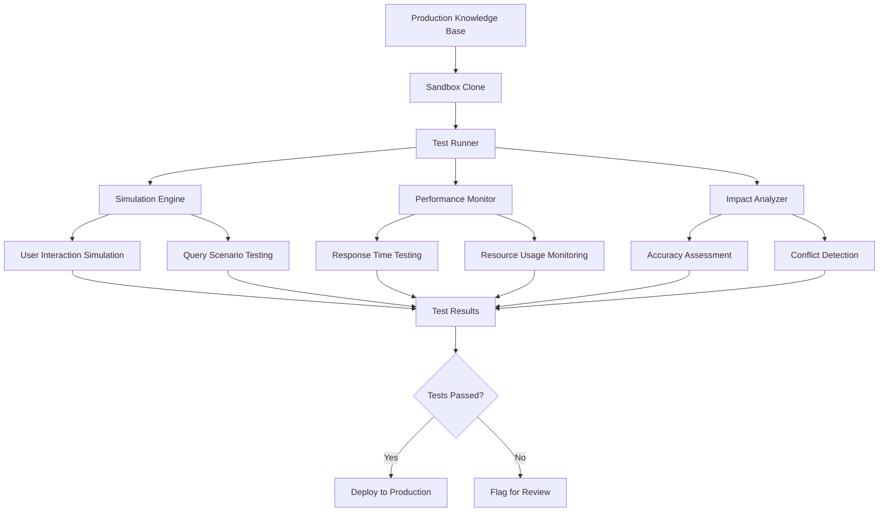

# Testing Sandbox

Create a secure, isolated testing environment for validating knowledge capsule changes before production deployment.

## Sandbox Architecture



## Sandbox Infrastructure

### Database Isolation

```sql
-- Create sandbox schema for isolated testing
CREATE SCHEMA IF NOT EXISTS sandbox;

-- Function to create sandbox instance
CREATE OR REPLACE FUNCTION create_sandbox_instance(
    instance_name TEXT,
    base_timestamp TIMESTAMP WITH TIME ZONE DEFAULT NOW()
)
RETURNS UUID
LANGUAGE plpgsql
AS $$
DECLARE
    sandbox_id UUID := gen_random_uuid();
    table_name TEXT;
BEGIN
    -- Create sandbox metadata
    INSERT INTO sandbox.instances (
        id,
        name,
        created_at,
        base_timestamp,
        status
    ) VALUES (
        sandbox_id,
        instance_name,
        NOW(),
        base_timestamp,
        'initializing'
    );
    
    -- Clone knowledge capsules table
    table_name := 'knowledge_capsules_' || replace(sandbox_id::TEXT, '-', '_');
    
    EXECUTE format(
        'CREATE TABLE sandbox.%I AS 
         SELECT * FROM public.knowledge_capsules 
         WHERE updated_at <= %L',
        table_name,
        base_timestamp
    );
    
    -- Clone related tables
    EXECUTE format(
        'CREATE TABLE sandbox.%I AS 
         SELECT * FROM public.knowledge_namespaces',
        'namespaces_' || replace(sandbox_id::TEXT, '-', '_')
    );
    
    -- Update sandbox status
    UPDATE sandbox.instances 
    SET status = 'ready' 
    WHERE id = sandbox_id;
    
    RETURN sandbox_id;
END;
$$;

-- Sandbox instance metadata table
CREATE TABLE IF NOT EXISTS sandbox.instances (
    id UUID PRIMARY KEY,
    name TEXT NOT NULL,
    created_at TIMESTAMP WITH TIME ZONE DEFAULT NOW(),
    base_timestamp TIMESTAMP WITH TIME ZONE,
    status TEXT DEFAULT 'initializing',
    test_results JSONB,
    expires_at TIMESTAMP WITH TIME ZONE DEFAULT NOW() + INTERVAL '7 days'
);
```

### TypeScript Sandbox Manager

```typescript
interface SandboxInstance {
  id: string;
  name: string;
  createdAt: Date;
  baseTimestamp: Date;
  status: 'initializing' | 'ready' | 'testing' | 'completed' | 'failed';
  testResults?: TestResults;
  expiresAt: Date;
}

interface TestConfiguration {
  testSuites: TestSuite[];
  simulationScenarios: SimulationScenario[];
  performanceThresholds: PerformanceThresholds;
  rollbackCriteria: RollbackCriteria;
}

class SandboxManager {
  private supabase: SupabaseClient;
  
  constructor(supabaseClient: SupabaseClient) {
    this.supabase = supabaseClient;
  }
  
  async createSandbox(
    name: string, 
    baseTimestamp?: Date
  ): Promise<SandboxInstance> {
    
    const { data, error } = await this.supabase
      .rpc('create_sandbox_instance', {
        instance_name: name,
        base_timestamp: baseTimestamp || new Date()
      });
    
    if (error) throw error;
    
    return this.getSandboxById(data);
  }
  
  async deployCapsuleToSandbox(
    sandboxId: string,
    capsule: KnowledgeCapsule
  ): Promise<void> {
    
    // Deploy to sandbox-specific table
    const tableName = `knowledge_capsules_${sandboxId.replace(/-/g, '_')}`;
    
    await this.supabase
      .schema('sandbox')
      .from(tableName)
      .upsert(capsule);
  }
  
  async runTests(
    sandboxId: string,
    config: TestConfiguration
  ): Promise<TestResults> {
    
    const instance = await this.getSandboxById(sandboxId);
    
    await this.updateSandboxStatus(sandboxId, 'testing');
    
    try {
      const testResults = await this.executeTestSuites(
        sandboxId,
        config
      );
      
      await this.storeSandboxResults(sandboxId, testResults);
      await this.updateSandboxStatus(sandboxId, 'completed');
      
      return testResults;
      
    } catch (error) {
      await this.updateSandboxStatus(sandboxId, 'failed');
      throw error;
    }
  }
  
  private async executeTestSuites(
    sandboxId: string,
    config: TestConfiguration
  ): Promise<TestResults> {
    
    const results: TestResults = {
      sandboxId,
      startTime: new Date(),
      testSuiteResults: [],
      performanceMetrics: {},
      overallStatus: 'running'
    };
    
    // Run all test suites in parallel
    const suitePromises = config.testSuites.map(suite =>
      this.runTestSuite(sandboxId, suite)
    );
    
    results.testSuiteResults = await Promise.all(suitePromises);
    
    // Run performance tests
    results.performanceMetrics = await this.runPerformanceTests(
      sandboxId,
      config.performanceThresholds
    );
    
    // Run simulation scenarios
    results.simulationResults = await this.runSimulations(
      sandboxId,
      config.simulationScenarios
    );
    
    results.endTime = new Date();
    results.overallStatus = this.determineOverallStatus(results);
    
    return results;
  }
}
```

## Simulation Engine

### User Interaction Simulation

```typescript
interface SimulationScenario {
  id: string;
  name: string;
  description: string;
  userProfiles: UserProfile[];
  queryPatterns: QueryPattern[];
  expectedBehaviors: ExpectedBehavior[];
  duration: number; // in seconds
}

interface QueryPattern {
  type: 'search' | 'specific' | 'conversational';
  queries: string[];
  frequency: number; // queries per minute
  context?: Record<string, any>;
}

class SimulationEngine {
  async runSimulation(
    sandboxId: string,
    scenario: SimulationScenario
  ): Promise<SimulationResult> {
    
    const startTime = new Date();
    const results: QueryResult[] = [];
    
    // Create virtual users
    const virtualUsers = await this.createVirtualUsers(scenario.userProfiles);
    
    // Run simulation for specified duration
    const simulationPromise = this.runSimulationLoop(
      sandboxId,
      virtualUsers,
      scenario.queryPatterns,
      scenario.duration
    );
    
    // Monitor simulation
    const monitoringPromise = this.monitorSimulation(sandboxId, startTime);
    
    const [queryResults, metrics] = await Promise.all([
      simulationPromise,
      monitoringPromise
    ]);
    
    return {
      scenarioId: scenario.id,
      startTime,
      endTime: new Date(),
      queryResults,
      performanceMetrics: metrics,
      behaviorAnalysis: await this.analyzeBehavior(
        queryResults,
        scenario.expectedBehaviors
      )
    };
  }
  
  private async runSimulationLoop(
    sandboxId: string,
    users: VirtualUser[],
    patterns: QueryPattern[],
    duration: number
  ): Promise<QueryResult[]> {
    
    const results: QueryResult[] = [];
    const endTime = Date.now() + (duration * 1000);
    
    while (Date.now() < endTime) {
      const batchPromises = users.map(user => 
        this.executeUserQueries(sandboxId, user, patterns)
      );
      
      const batchResults = await Promise.all(batchPromises);
      results.push(...batchResults.flat());
      
      // Wait before next batch
      await new Promise(resolve => setTimeout(resolve, 1000));
    }
    
    return results;
  }
  
  private async executeUserQueries(
    sandboxId: string,
    user: VirtualUser,
    patterns: QueryPattern[]
  ): Promise<QueryResult[]> {
    
    const results: QueryResult[] = [];
    
    for (const pattern of patterns) {
      const numQueries = Math.floor(pattern.frequency / 60); // per second
      
      for (let i = 0; i < numQueries; i++) {
        const query = this.selectQuery(pattern.queries);
        const startTime = Date.now();
        
        try {
          const response = await this.executeSandboxQuery(
            sandboxId,
            query,
            user.context
          );
          
          results.push({
            userId: user.id,
            query,
            response,
            responseTime: Date.now() - startTime,
            success: true,
            timestamp: new Date()
          });
          
        } catch (error) {
          results.push({
            userId: user.id,
            query,
            error: error.message,
            responseTime: Date.now() - startTime,
            success: false,
            timestamp: new Date()
          });
        }
      }
    }
    
    return results;
  }
}
```

### Performance Testing Framework

```typescript
interface PerformanceThresholds {
  maxResponseTime: number;      // milliseconds
  maxMemoryUsage: number;       // MB
  maxCPUUsage: number;          // percentage
  minAccuracyScore: number;     // 0-1 scale
  maxErrorRate: number;         // percentage
}

interface PerformanceMetrics {
  averageResponseTime: number;
  p95ResponseTime: number;
  memoryUsage: number;
  cpuUsage: number;
  accuracyScore: number;
  errorRate: number;
  throughput: number; // queries per second
}

class PerformanceTester {
  async runPerformanceTests(
    sandboxId: string,
    thresholds: PerformanceThresholds
  ): Promise<PerformanceTestResult> {
    
    const testResults: PerformanceTestResult = {
      startTime: new Date(),
      tests: [],
      overallStatus: 'running'
    };
    
    // Test response time under load
    testResults.tests.push(
      await this.testResponseTimeUnderLoad(sandboxId, thresholds)
    );
    
    // Test memory usage
    testResults.tests.push(
      await this.testMemoryUsage(sandboxId, thresholds)
    );
    
    // Test accuracy under stress
    testResults.tests.push(
      await this.testAccuracyUnderStress(sandboxId, thresholds)
    );
    
    // Test concurrent user scenarios
    testResults.tests.push(
      await this.testConcurrentUsers(sandboxId, thresholds)
    );
    
    testResults.endTime = new Date();
    testResults.overallStatus = testResults.tests.every(t => t.passed) 
      ? 'passed' 
      : 'failed';
    
    return testResults;
  }
  
  private async testResponseTimeUnderLoad(
    sandboxId: string,
    thresholds: PerformanceThresholds
  ): Promise<PerformanceTest> {
    
    const testQueries = [
      "What are the LHDN e-invoice requirements?",
      "How do I submit employee leave requests?",
      "What is the company's remote work policy?",
      "Explain the performance review process"
    ];
    
    const responseTimes: number[] = [];
    const concurrentUsers = 10;
    const queriesPerUser = 20;
    
    const userPromises = Array(concurrentUsers).fill(null).map(async () => {
      for (let i = 0; i < queriesPerUser; i++) {
        const query = testQueries[i % testQueries.length];
        const startTime = Date.now();
        
        await this.executeSandboxQuery(sandboxId, query);
        
        responseTimes.push(Date.now() - startTime);
      }
    });
    
    await Promise.all(userPromises);
    
    const averageResponseTime = responseTimes.reduce((a, b) => a + b, 0) / responseTimes.length;
    const p95ResponseTime = this.calculatePercentile(responseTimes, 95);
    
    return {
      name: 'Response Time Under Load',
      metrics: {
        averageResponseTime,
        p95ResponseTime,
        totalQueries: responseTimes.length
      },
      passed: averageResponseTime <= thresholds.maxResponseTime,
      details: {
        threshold: thresholds.maxResponseTime,
        actual: averageResponseTime,
        p95: p95ResponseTime
      }
    };
  }
  
  private calculatePercentile(values: number[], percentile: number): number {
    const sorted = [...values].sort((a, b) => a - b);
    const index = Math.ceil((percentile / 100) * sorted.length) - 1;
    return sorted[index];
  }
}
```

## Impact Analysis Tools

### Change Impact Assessment

```typescript
interface ImpactAnalysis {
  changedCapsules: string[];
  affectedQueries: QueryImpact[];
  userExperience: UserExperienceImpact;
  systemPerformance: PerformanceImpact;
  riskAssessment: RiskAssessment;
}

interface QueryImpact {
  query: string;
  beforeAccuracy: number;
  afterAccuracy: number;
  responseTimeChange: number;
  behaviorChange: 'improved' | 'degraded' | 'unchanged';
}

class ImpactAnalyzer {
  async analyzeImpact(
    sandboxId: string,
    baselineResults: TestResults,
    newResults: TestResults
  ): Promise<ImpactAnalysis> {
    
    const changedCapsules = await this.identifyChangedCapsules(sandboxId);
    
    const affectedQueries = await this.analyzeQueryImpact(
      baselineResults.queryResults,
      newResults.queryResults
    );
    
    const userExperienceImpact = this.analyzeUserExperience(
      baselineResults.simulationResults,
      newResults.simulationResults
    );
    
    const performanceImpact = this.analyzePerformanceImpact(
      baselineResults.performanceMetrics,
      newResults.performanceMetrics
    );
    
    const riskAssessment = this.assessRisk(
      affectedQueries,
      userExperienceImpact,
      performanceImpact
    );
    
    return {
      changedCapsules,
      affectedQueries,
      userExperience: userExperienceImpact,
      systemPerformance: performanceImpact,
      riskAssessment
    };
  }
  
  private analyzeQueryImpact(
    baselineQueries: QueryResult[],
    newQueries: QueryResult[]
  ): QueryImpact[] {
    
    const impacts: QueryImpact[] = [];
    const queryMap = new Map<string, QueryResult[]>();
    
    // Group queries by content
    baselineQueries.forEach(query => {
      if (!queryMap.has(query.query)) {
        queryMap.set(query.query, []);
      }
      queryMap.get(query.query)!.push(query);
    });
    
    newQueries.forEach(query => {
      if (queryMap.has(query.query)) {
        const baseline = queryMap.get(query.query)!;
        
        const baselineAccuracy = this.calculateAverageAccuracy(baseline);
        const newAccuracy = query.accuracyScore || 0;
        
        const baselineResponseTime = this.calculateAverageResponseTime(baseline);
        const responseTimeChange = query.responseTime - baselineResponseTime;
        
        impacts.push({
          query: query.query,
          beforeAccuracy: baselineAccuracy,
          afterAccuracy: newAccuracy,
          responseTimeChange,
          behaviorChange: this.determineBehaviorChange(
            baselineAccuracy,
            newAccuracy,
            responseTimeChange
          )
        });
      }
    });
    
    return impacts;
  }
  
  private assessRisk(
    queryImpacts: QueryImpact[],
    userExperience: UserExperienceImpact,
    performance: PerformanceImpact
  ): RiskAssessment {
    
    let riskScore = 0;
    const riskFactors: string[] = [];
    
    // Query accuracy degradation
    const degradedQueries = queryImpacts.filter(q => q.behaviorChange === 'degraded');
    if (degradedQueries.length > 0) {
      riskScore += degradedQueries.length * 10;
      riskFactors.push(`${degradedQueries.length} queries show degraded accuracy`);
    }
    
    // Performance degradation
    if (performance.responseTimeChange > 100) { // >100ms increase
      riskScore += 20;
      riskFactors.push('Significant response time increase');
    }
    
    // User experience impact
    if (userExperience.satisfactionChange < -0.1) {
      riskScore += 15;
      riskFactors.push('Decreased user satisfaction');
    }
    
    return {
      score: riskScore,
      level: this.getRiskLevel(riskScore),
      factors: riskFactors,
      recommendation: this.generateRecommendation(riskScore, riskFactors)
    };
  }
  
  private getRiskLevel(score: number): 'low' | 'medium' | 'high' | 'critical' {
    if (score < 10) return 'low';
    if (score < 30) return 'medium';
    if (score < 50) return 'high';
    return 'critical';
  }
}
```

## Rollback Testing

### Automated Rollback Scenarios

```typescript
interface RollbackCriteria {
  maxAccuracyDrop: number;      // Maximum acceptable accuracy decrease
  maxResponseTimeIncrease: number; // Maximum acceptable response time increase
  maxErrorRateIncrease: number; // Maximum acceptable error rate increase
  criticalQueries: string[];    // Queries that must not degrade
}

interface RollbackPlan {
  triggeredBy: string[];
  rollbackSteps: RollbackStep[];
  verificationTests: string[];
  estimatedDowntime: number;
}

class RollbackTester {
  async testRollbackScenarios(
    sandboxId: string,
    criteria: RollbackCriteria
  ): Promise<RollbackTestResult> {
    
    const testResult: RollbackTestResult = {
      startTime: new Date(),
      scenarios: [],
      overallStatus: 'running'
    };
    
    // Test immediate rollback
    testResult.scenarios.push(
      await this.testImmediateRollback(sandboxId)
    );
    
    // Test partial rollback
    testResult.scenarios.push(
      await this.testPartialRollback(sandboxId)
    );
    
    // Test rollback under load
    testResult.scenarios.push(
      await this.testRollbackUnderLoad(sandboxId)
    );
    
    // Test rollback verification
    testResult.scenarios.push(
      await this.testRollbackVerification(sandboxId, criteria)
    );
    
    testResult.endTime = new Date();
    testResult.overallStatus = testResult.scenarios.every(s => s.success)
      ? 'passed'
      : 'failed';
    
    return testResult;
  }
  
  private async testImmediateRollback(
    sandboxId: string
  ): Promise<RollbackScenario> {
    
    const startTime = Date.now();
    
    try {
      // Simulate deployment failure
      await this.simulateDeploymentFailure(sandboxId);
      
      // Execute immediate rollback
      const rollbackPlan = await this.generateRollbackPlan(sandboxId);
      await this.executeRollback(sandboxId, rollbackPlan);
      
      // Verify system restoration
      const isRestored = await this.verifySystemRestoration(sandboxId);
      
      return {
        name: 'Immediate Rollback',
        description: 'Test immediate rollback on deployment failure',
        executionTime: Date.now() - startTime,
        success: isRestored,
        details: {
          rollbackPlan,
          verificationPassed: isRestored
        }
      };
      
    } catch (error) {
      return {
        name: 'Immediate Rollback',
        description: 'Test immediate rollback on deployment failure',
        executionTime: Date.now() - startTime,
        success: false,
        error: error.message
      };
    }
  }
  
  private async generateRollbackPlan(sandboxId: string): Promise<RollbackPlan> {
    // Analyze current state and generate rollback plan
    const changedCapsules = await this.getChangedCapsules(sandboxId);
    
    return {
      triggeredBy: ['deployment_failure'],
      rollbackSteps: [
        {
          action: 'restore_capsules',
          targets: changedCapsules,
          order: 1
        },
        {
          action: 'rebuild_indexes',
          targets: ['embedding_index'],
          order: 2
        },
        {
          action: 'clear_caches',
          targets: ['query_cache', 'embedding_cache'],
          order: 3
        }
      ],
      verificationTests: [
        'critical_queries_test',
        'performance_baseline_test',
        'accuracy_verification_test'
      ],
      estimatedDowntime: 30000 // 30 seconds
    };
  }
}
```

## Real-World Testing Examples

### LHDN E-Invoice Testing

```typescript
// LHDN specific testing scenarios
class LHDNSandboxTester {
  async testEInvoiceRegulationUpdate(
    sandboxId: string,
    newRegulation: KnowledgeCapsule
  ): Promise<LHDNTestResult> {
    
    // Deploy new regulation to sandbox
    await this.deployCapsuleToSandbox(sandboxId, newRegulation);
    
    const testScenarios = [
      {
        name: 'Invoice Format Validation',
        queries: [
          'What is the required XML format for e-invoices?',
          'How do I validate e-invoice schema?',
          'What are mandatory fields in LHDN e-invoice?'
        ]
      },
      {
        name: 'Compliance Deadlines',
        queries: [
          'When is the e-invoice implementation deadline?',
          'What penalties apply for non-compliance?',
          'Are there phase-in periods for different business sizes?'
        ]
      },
      {
        name: 'Technical Requirements',
        queries: [
          'What API endpoints does LHDN provide?',
          'How do I authenticate with LHDN system?',
          'What are the rate limits for API calls?'
        ]
      }
    ];
    
    const results = await this.runLHDNScenarios(sandboxId, testScenarios);
    
    return {
      regulation: newRegulation.title,
      testDate: new Date(),
      scenarios: results,
      complianceVerification: await this.verifyCompliance(results),
      recommendation: this.generateLHDNRecommendation(results)
    };
  }
  
  private async verifyCompliance(
    results: ScenarioResult[]
  ): Promise<ComplianceVerification> {
    
    const criticalQueries = [
      'What is the required XML format for e-invoices?',
      'When is the e-invoice implementation deadline?'
    ];
    
    const criticalResults = results.filter(r =>
      r.queries.some(q => criticalQueries.includes(q.query))
    );
    
    const allCriticalPassed = criticalResults.every(r =>
      r.accuracy >= 0.95 && r.responseTime <= 1000
    );
    
    return {
      compliant: allCriticalPassed,
      criticalTestsPassed: criticalResults.length,
      totalCriticalTests: criticalQueries.length,
      details: criticalResults
    };
  }
}
```

### HR Policy Sandbox Testing

```sql
-- HR policy testing stored procedure
CREATE OR REPLACE FUNCTION test_hr_policy_sandbox(
    sandbox_id UUID,
    policy_capsule_id UUID
)
RETURNS JSONB
LANGUAGE plpgsql
AS $$
DECLARE
    test_results JSONB := '{}';
    test_queries TEXT[] := ARRAY[
        'What is the remote work policy?',
        'How do I request time off?',
        'What are the performance review criteria?',
        'Explain the dress code policy'
    ];
    query TEXT;
    result RECORD;
    table_name TEXT;
BEGIN
    table_name := 'knowledge_capsules_' || replace(sandbox_id::TEXT, '-', '_');
    
    -- Test each query
    FOREACH query IN ARRAY test_queries
    LOOP
        -- Execute query against sandbox
        EXECUTE format(
            'SELECT title, content, metadata->''accuracy_score'' as accuracy 
             FROM sandbox.%I 
             WHERE to_tsvector(content) @@ plainto_tsquery($1) 
             ORDER BY ts_rank(to_tsvector(content), plainto_tsquery($1)) DESC 
             LIMIT 1',
            table_name
        ) INTO result USING query;
        
        -- Store result
        test_results := test_results || jsonb_build_object(
            query,
            jsonb_build_object(
                'found', result IS NOT NULL,
                'title', COALESCE(result.title, ''),
                'accuracy', COALESCE(result.accuracy, 0)
            )
        );
    END LOOP;
    
    RETURN test_results;
END;
$$;
```

## Best Practices

### 1. Sandbox Lifecycle Management
- Automatically clean up expired sandboxes
- Set reasonable expiration times (7 days default)
- Implement sandbox resource quotas
- Monitor sandbox usage and costs

### 2. Test Data Management
- Use realistic test data that mirrors production
- Implement test data privacy protection
- Maintain test data freshness
- Version test datasets with capsule versions

### 3. Performance Testing
- Test under realistic load conditions
- Include edge cases and stress scenarios
- Monitor resource utilization during tests
- Set appropriate performance baselines

### 4. Integration Testing
- Test interactions between multiple capsules
- Verify namespace isolation works correctly
- Test conflict resolution in sandbox environment
- Validate real-time update propagation

## Monitoring and Alerts

Set up comprehensive monitoring for sandbox operations:

```sql
-- Sandbox monitoring dashboard
CREATE VIEW sandbox_monitoring AS
SELECT 
    i.id,
    i.name,
    i.status,
    i.created_at,
    i.expires_at,
    (i.test_results->>'overallStatus')::TEXT as test_status,
    COUNT(CASE WHEN tr.passed THEN 1 END) as tests_passed,
    COUNT(tr.id) as total_tests,
    AVG((tr.metrics->>'responseTime')::FLOAT) as avg_response_time
FROM sandbox.instances i
LEFT JOIN sandbox.test_runs tr ON tr.sandbox_id = i.id
WHERE i.created_at >= NOW() - INTERVAL '30 days'
GROUP BY i.id, i.name, i.status, i.created_at, i.expires_at, i.test_results
ORDER BY i.created_at DESC;
```

Configure alerts for:
- Sandbox test failures
- Performance degradation in tests
- Resource usage exceeding thresholds
- Expired sandboxes not cleaned up
- Critical test scenarios failing