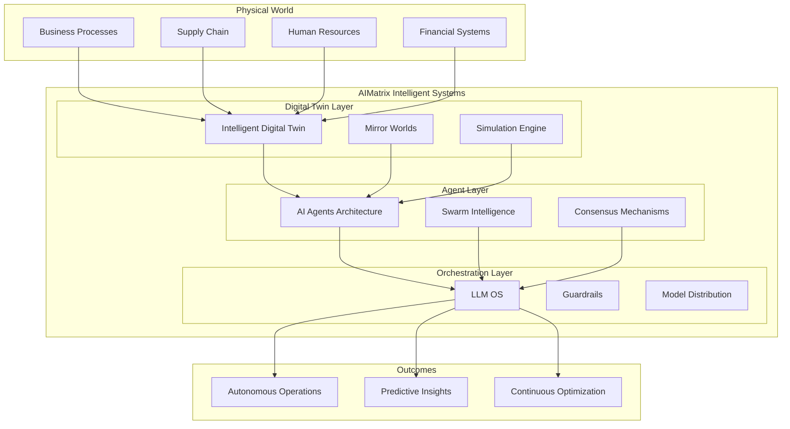

# AIMatrix Intelligent Systems

AIMatrix Intelligent Systems represents the convergence of artificial intelligence, digital twins, and autonomous agents to create adaptive, self-managing business ecosystems. Our platform transforms traditional business operations into intelligent, predictive, and autonomous systems that learn, adapt, and optimize in real-time.

## Core Components

### [Intelligent Digital Twin (IDT)](intelligent-digital-twin)
Create living digital replicas of your business processes, supply chains, and organizational structures with predictive capabilities.

### [AI Agents Architecture](ai-agents-architecture)
Multi-agent orchestration systems with specialized roles, swarm intelligence, and emergent behaviors.

### [LLM OS / LLM Lite](llm-os)
Centralized orchestration platform for AI models with fine-tuning, guardrails, and distributed inference.

## Vision: The Intelligent Enterprise

The future belongs to organizations that can operate as **living systems**—adaptive, self-healing, and continuously evolving. AIMatrix Intelligent Systems enables this transformation by:

### 🧬 **Biological-Inspired Computing**
- Self-organizing systems that adapt to changing conditions
- Emergent behaviors from simple agent interactions
- Evolutionary optimization of business processes

### 🌐 **Mirror Worlds**
- Complete digital replicas of business operations
- Real-time synchronization between physical and digital realms
- Predictive modeling with quantum-inspired simulation

### 🤖 **Autonomous Operations**
- Self-managing workflows that require minimal human intervention
- Intelligent decision-making at every operational level
- Continuous learning and optimization loops

## Key Capabilities

### Business Process Intelligence
Transform static workflows into intelligent, adaptive processes that:
- **Self-optimize** based on performance metrics and changing conditions
- **Predict bottlenecks** before they occur and automatically adjust resources
- **Learn from exceptions** and develop new handling patterns
- **Scale dynamically** based on demand and resource availability

### Synthetic Data Generation
Create realistic business scenarios and training data through:
- **Process simulation** with millions of variations
- **Customer behavior modeling** across different segments
- **Market condition synthesis** for stress testing
- **Regulatory scenario generation** for compliance testing

### Predictive Maintenance for Business
Apply predictive maintenance concepts to business operations:
- **Process health monitoring** with early warning systems
- **Resource utilization prediction** to prevent overallocation
- **Relationship maintenance** for customer and partner ecosystems
- **Knowledge base freshness** tracking and automatic updates

## Real-World Applications

### Financial Services
- **Risk simulation** across thousands of market scenarios
- **Customer journey optimization** through behavioral modeling
- **Regulatory compliance** with automated monitoring and reporting
- **Fraud detection** using multi-agent surveillance systems

### Supply Chain & Logistics
- **End-to-end visibility** through digital twin networks
- **Demand forecasting** with multi-variable predictive models
- **Route optimization** using swarm intelligence algorithms
- **Supplier relationship** management through AI agents

### Healthcare & Life Sciences
- **Patient pathway optimization** through process simulation
- **Resource allocation** using predictive analytics
- **Clinical trial design** with synthetic patient populations
- **Drug discovery** acceleration through intelligent automation

### Manufacturing & Industry 4.0
- **Production planning** with real-time demand integration
- **Quality prediction** using multi-sensor data fusion
- **Maintenance scheduling** through predictive algorithms
- **Energy optimization** across facility operations

## Getting Started

Ready to transform your organization into an intelligent enterprise? Choose your entry point:

1. **[Start with Digital Twins](intelligent-digital-twin/)** - Begin by modeling your core business processes
2. **[Deploy AI Agents](ai-agents-architecture/)** - Implement specialized agents for specific functions
3. **[Orchestrate with LLM OS](llm-os/)** - Centralize AI model management and deployment

## Architecture Overview

The future is intelligent, adaptive, and autonomous. With AIMatrix Intelligent Systems, your organization doesn't just use AI—it becomes an intelligent entity capable of continuous evolution and optimization.