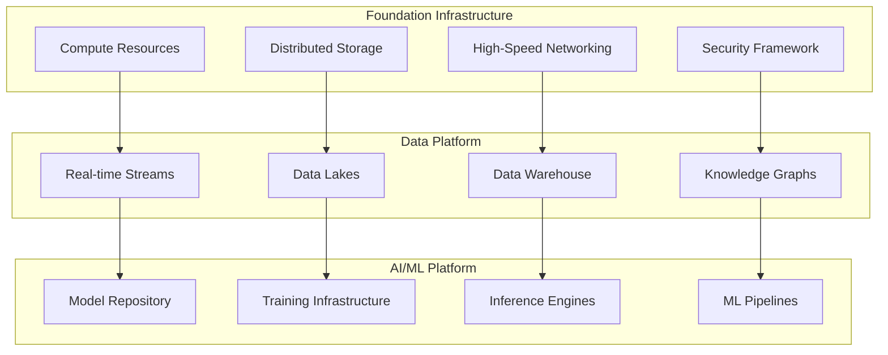
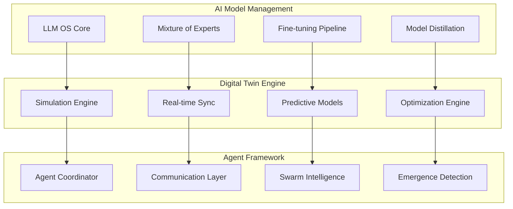
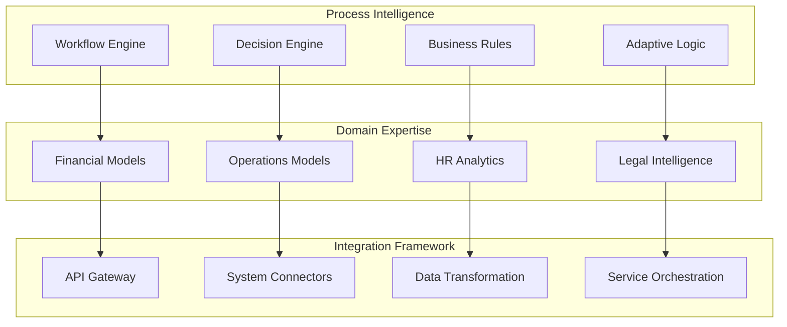
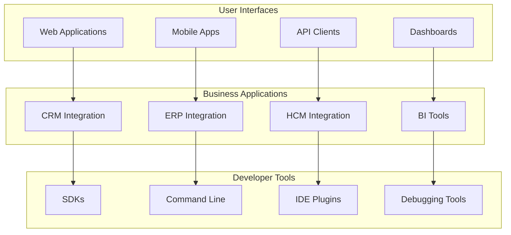
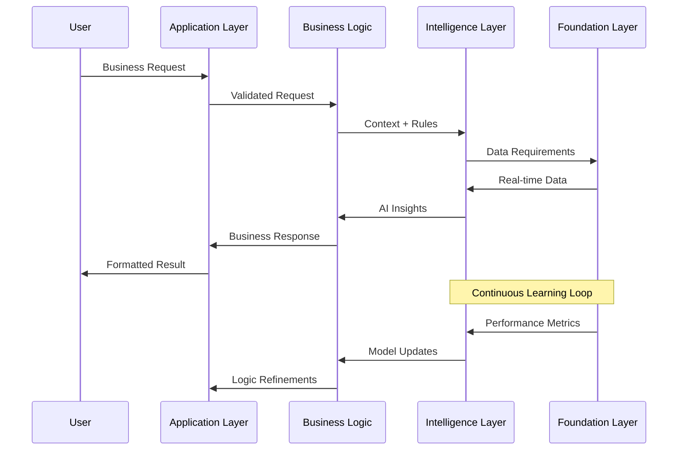
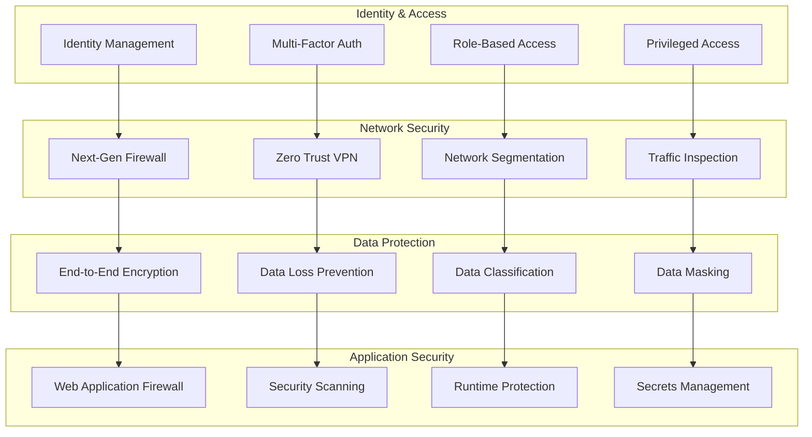

# Architecture Overview

The AIMatrix Intelligent Systems architecture represents a sophisticated multi-layered approach to creating autonomous, adaptive business intelligence. This document provides technical details on system design, component interactions, and deployment patterns.

## System Architecture Layers

### 1. Foundation Layer



#### Infrastructure Components

**Compute Resources**
- **Kubernetes Orchestration**: Container orchestration with auto-scaling
- **GPU Clusters**: NVIDIA A100/H100 clusters for AI workloads
- **Edge Computing**: ARM-based edge nodes for distributed inference
- **Serverless Functions**: Event-driven compute for lightweight operations

**Storage Systems**
- **Object Storage**: S3-compatible distributed storage for model artifacts
- **Time-Series Databases**: InfluxDB/TimescaleDB for temporal data
- **Graph Databases**: Neo4j for knowledge representation
- **Vector Databases**: Pinecone/Weaviate for semantic search

### 2. Intelligence Layer



#### Core Intelligence Components

**LLM OS Core**
```yaml
architecture:
  components:
    - model_registry: "Centralized model catalog and versioning"
    - scheduler: "Intelligent workload distribution"
    - router: "Content-aware request routing"
    - cache: "Multi-level response caching"
  
  capabilities:
    - distributed_inference: true
    - auto_scaling: true
    - fault_tolerance: true
    - performance_monitoring: true

  performance:
    throughput: "10,000+ requests/second"
    latency_p99: "< 200ms"
    availability: "99.99%"
    concurrent_models: "100+"
```

**Digital Twin Engine**
```yaml
simulation_engine:
  types:
    - discrete_event: "Business process simulation"
    - agent_based: "Complex adaptive systems"
    - system_dynamics: "Feedback loop modeling"
    - monte_carlo: "Risk and uncertainty analysis"
  
  capabilities:
    - real_time_sync: "< 1 second data propagation"
    - scalability: "Millions of simulated entities"
    - accuracy: "95%+ prediction accuracy"
    - optimization: "Multi-objective optimization"

  performance:
    simulation_speed: "100,000x real-time for simple models"
    entity_capacity: "10M+ concurrent entities"
    update_frequency: "Real-time to milliseconds"
```

### 3. Business Logic Layer



#### Business Intelligence Components

**Workflow Engine**
- **BPMN 2.0 Compliance**: Standard business process modeling
- **Dynamic Adaptation**: Real-time process modification
- **Exception Handling**: Intelligent error recovery
- **Performance Monitoring**: Process analytics and optimization

**Decision Engine**
- **Multi-criteria Decision Making**: Complex business logic
- **Machine Learning Integration**: Data-driven decisions
- **Human-in-the-Loop**: Collaborative decision making
- **Audit Trail**: Complete decision history

### 4. Application Layer



## Component Interactions

### Inter-Layer Communication

```python
# Example: Cross-layer communication patterns
class SystemArchitecture:
    def __init__(self):
        self.layers = {
            'foundation': FoundationLayer(),
            'intelligence': IntelligenceLayer(),
            'business_logic': BusinessLogicLayer(),
            'application': ApplicationLayer()
        }
        self.message_bus = MessageBus()
        self.event_store = EventStore()
    
    async def process_business_request(self, request):
        """Example of cross-layer request processing"""
        
        # Application Layer: Receive and validate request
        validated_request = await self.layers['application'].validate_request(request)
        
        # Business Logic Layer: Apply business rules
        business_context = await self.layers['business_logic'].apply_rules(validated_request)
        
        # Intelligence Layer: AI processing
        ai_response = await self.layers['intelligence'].process(business_context)
        
        # Foundation Layer: Resource management
        resources_allocated = await self.layers['foundation'].allocate_resources(ai_response)
        
        # Return processed result
        return await self.layers['application'].format_response(ai_response)
```

### Data Flow Architecture



## Deployment Patterns

### Cloud-Native Deployment

```yaml
apiVersion: v1
kind: ConfigMap
metadata:
  name: aimatrix-intelligent-systems-config
data:
  deployment_strategy: "cloud_native"
  scaling_policy: "horizontal_pod_autoscaler"
  
  # LLM OS Configuration
  llm_os_config: |
    orchestration:
      model_parallelism: true
      pipeline_parallelism: true
      data_parallelism: true
    
    inference:
      batch_size: 32
      max_sequence_length: 4096
      precision: "fp16"
    
    caching:
      redis_cluster: true
      cache_ttl: "1h"
      cache_size: "100GB"

  # Digital Twin Configuration  
  digital_twin_config: |
    simulation:
      engine: "kalasim"
      parallel_execution: true
      checkpointing: true
    
    synchronization:
      real_time_threshold: "1s"
      batch_sync_interval: "5m"
      conflict_resolution: "latest_wins"

  # Agent System Configuration
  agent_config: |
    coordination:
      mesh_network: true
      consensus_algorithm: "raft"
      heartbeat_interval: "30s"
    
    communication:
      protocol: "grpc"
      encryption: "tls_1_3"
      compression: "gzip"
---
apiVersion: apps/v1
kind: Deployment
metadata:
  name: llm-os-deployment
spec:
  replicas: 3
  selector:
    matchLabels:
      app: llm-os
  template:
    metadata:
      labels:
        app: llm-os
    spec:
      containers:
      - name: llm-os
        image: aimatrix/llm-os:latest
        resources:
          requests:
            memory: "16Gi"
            cpu: "4"
            nvidia.com/gpu: "1"
          limits:
            memory: "32Gi"
            cpu: "8"
            nvidia.com/gpu: "2"
        env:
        - name: CONFIG_PATH
          value: "/config/llm_os_config"
        volumeMounts:
        - name: config
          mountPath: /config
        - name: model-storage
          mountPath: /models
      volumes:
      - name: config
        configMap:
          name: aimatrix-intelligent-systems-config
      - name: model-storage
        persistentVolumeClaim:
          claimName: model-storage-pvc
```

### Hybrid Edge-Cloud Deployment

```yaml
# Edge Node Configuration
edge_deployment:
  node_specification:
    hardware:
      cpu: "ARM Cortex-A78 (8 cores)"
      memory: "16GB LPDDR5"
      storage: "1TB NVMe SSD"
      accelerator: "Neural Processing Unit (NPU)"
    
    software:
      os: "Ubuntu 22.04 LTS"
      runtime: "Docker 24.0"
      ai_framework: "TensorRT, ONNX Runtime"
    
    capabilities:
      max_models: 5
      inference_throughput: "1000 req/sec"
      latency_target: "< 10ms"
      offline_operation: true

  model_deployment:
    optimization:
      quantization: "int8"
      pruning: "50% sparsity"
      distillation: "teacher-student"
    
    caching:
      model_cache: "8GB"
      response_cache: "2GB"
      prefetching: true

# Cloud Coordination
cloud_coordination:
  model_management:
    central_registry: true
    automatic_updates: true
    rollback_capability: true
  
  data_synchronization:
    edge_to_cloud: "real-time metrics, periodic model updates"
    cloud_to_edge: "model updates, configuration changes"
    conflict_resolution: "cloud_authoritative"
  
  monitoring:
    health_checks: "30s interval"
    performance_metrics: "real-time"
    alerting: "immediate for critical issues"
```

### High-Availability Configuration

```yaml
high_availability:
  architecture: "active_active_multi_region"
  
  regions:
    primary:
      region: "us-east-1"
      availability_zones: ["us-east-1a", "us-east-1b", "us-east-1c"]
      load_balancer: "application_load_balancer"
    
    secondary:
      region: "us-west-2"
      availability_zones: ["us-west-2a", "us-west-2b", "us-west-2c"]
      load_balancer: "application_load_balancer"
    
    disaster_recovery:
      region: "eu-west-1"
      activation_mode: "manual"
      rpo: "15 minutes"  # Recovery Point Objective
      rto: "30 minutes"  # Recovery Time Objective

  data_replication:
    strategy: "synchronous_cross_az_asynchronous_cross_region"
    consistency_level: "eventual_consistency"
    backup_frequency: "continuous"
    
  failover:
    detection_time: "< 30 seconds"
    switchover_time: "< 60 seconds"
    automatic_failback: false
    health_check_interval: "5 seconds"

  monitoring:
    metrics:
      - availability_percentage
      - response_time_p99
      - error_rate
      - throughput
    
    alerting:
      critical_threshold: "99.9% availability"
      warning_threshold: "99.95% availability"
      escalation_policy: "immediate_page_for_critical"
```

## Security Architecture

### Zero Trust Security Model



### AI Model Security

```python
class AIModelSecurityFramework:
    def __init__(self):
        self.model_vault = SecureModelVault()
        self.input_sanitizer = InputSanitizer()
        self.output_filter = OutputSecurityFilter()
        self.audit_logger = SecurityAuditLogger()
    
    async def secure_model_inference(self, request, model):
        """Secure model inference with comprehensive protection"""
        
        # 1. Input validation and sanitization
        sanitized_input = await self.input_sanitizer.sanitize(
            input_data=request.input,
            expected_schema=model.input_schema,
            security_policies=request.security_policies
        )
        
        # 2. Model access control
        access_granted = await self.model_vault.verify_access(
            user=request.user,
            model=model,
            operation="inference"
        )
        
        if not access_granted:
            await self.audit_logger.log_access_denied(request, model)
            raise UnauthorizedModelAccess()
        
        # 3. Secure model execution
        inference_result = await self.execute_secure_inference(
            model=model,
            input_data=sanitized_input,
            security_context=request.security_context
        )
        
        # 4. Output filtering and validation
        filtered_output = await self.output_filter.filter(
            output=inference_result,
            sensitivity_level=model.sensitivity_level,
            user_clearance=request.user.clearance_level
        )
        
        # 5. Security audit logging
        await self.audit_logger.log_inference(
            user=request.user,
            model=model,
            input_hash=self.hash_input(sanitized_input),
            output_hash=self.hash_output(filtered_output),
            timestamp=datetime.now()
        )
        
        return SecureInferenceResult(
            output=filtered_output,
            security_metadata=self.create_security_metadata(request, model)
        )
```

## Performance Characteristics

### Scalability Metrics

```yaml
performance_benchmarks:
  throughput:
    llm_inference:
      small_models: "10,000 req/sec per GPU"
      large_models: "100 req/sec per GPU" 
      distributed: "100,000+ req/sec cluster-wide"
    
    digital_twin:
      simulation_speed: "1M+ events/sec"
      real_time_sync: "< 1 second latency"
      concurrent_twins: "10,000+ active twins"
    
    agent_coordination:
      message_throughput: "1M+ messages/sec"
      consensus_time: "< 100ms for 100 agents"
      swarm_coordination: "1,000+ agent swarms"

  latency:
    inference:
      p50: "< 50ms"
      p95: "< 100ms" 
      p99: "< 200ms"
    
    system_response:
      api_calls: "< 10ms"
      database_queries: "< 5ms"
      cache_hits: "< 1ms"

  resource_efficiency:
    gpu_utilization: "> 85%"
    memory_efficiency: "> 90%"
    network_utilization: "> 70%"
    storage_efficiency: "> 95%"
```

### Cost Optimization

```python
class CostOptimizationEngine:
    def __init__(self):
        self.cost_tracker = CostTracker()
        self.resource_optimizer = ResourceOptimizer()
        self.workload_predictor = WorkloadPredictor()
    
    async def optimize_deployment_costs(self, current_deployment):
        """Optimize deployment for cost efficiency"""
        
        # Analyze current costs
        cost_analysis = await self.cost_tracker.analyze_costs(
            deployment=current_deployment,
            time_window="30_days"
        )
        
        # Predict future workload
        workload_forecast = await self.workload_predictor.forecast(
            historical_data=cost_analysis.workload_history,
            forecast_horizon="7_days"
        )
        
        # Generate optimization recommendations
        optimizations = await self.resource_optimizer.recommend_optimizations(
            current_config=current_deployment.config,
            cost_analysis=cost_analysis,
            workload_forecast=workload_forecast,
            optimization_objectives=["cost", "performance", "availability"]
        )
        
        return CostOptimizationPlan(
            current_costs=cost_analysis.total_cost,
            projected_savings=optimizations.potential_savings,
            recommended_changes=optimizations.changes,
            implementation_plan=optimizations.implementation_timeline
        )

# Example optimization results
cost_optimization_results = {
    "infrastructure_savings": {
        "compute": "35% reduction via right-sizing",
        "storage": "40% reduction via intelligent tiering",
        "network": "25% reduction via traffic optimization"
    },
    
    "ai_model_optimization": {
        "model_compression": "60% memory reduction",
        "inference_optimization": "3x throughput improvement", 
        "caching": "80% cache hit rate"
    },
    
    "operational_efficiency": {
        "automation": "90% reduction in manual tasks",
        "monitoring": "50% faster issue resolution",
        "scaling": "Auto-scaling saves 30% on unused capacity"
    }
}
```

## Monitoring and Observability

### Comprehensive Monitoring Stack

```yaml
monitoring_architecture:
  metrics:
    collection: "Prometheus + Custom Exporters"
    storage: "VictoriaMetrics (long-term storage)"
    visualization: "Grafana + Custom Dashboards"
    alerting: "AlertManager + PagerDuty"
  
  logging:
    collection: "Fluent Bit"
    aggregation: "Elasticsearch"
    analysis: "Kibana + Custom Analytics"
    retention: "90 days standard, 365 days compliance"
  
  tracing:
    framework: "OpenTelemetry"
    storage: "Jaeger"
    analysis: "Distributed tracing analysis"
    sampling: "Intelligent sampling (1-100%)"
  
  ai_specific_monitoring:
    model_performance:
      - accuracy_drift
      - latency_trends  
      - resource_utilization
      - bias_detection
    
    business_metrics:
      - user_satisfaction
      - task_completion_rate
      - business_impact
      - roi_measurement

  dashboards:
    executive:
      - business_kpis
      - cost_overview
      - system_health
      - ai_impact
    
    operational:
      - system_performance
      - infrastructure_health
      - application_metrics
      - security_status
    
    technical:
      - model_performance
      - system_diagnostics
      - resource_utilization
      - error_analysis
```

This architecture overview provides the foundation for understanding how AIMatrix Intelligent Systems components work together to create autonomous, intelligent business operations. The modular, scalable design enables organizations to adopt intelligent systems incrementally while building toward full autonomous operations.

### Next Steps

- **[Explore Implementation Examples](../implementation-examples/)** - See practical implementation patterns
- **[Review Performance Benchmarks](../performance-benchmarks/)** - Understand system capabilities
- **[Check Integration Patterns](../../integration/)** - Connect with existing systems