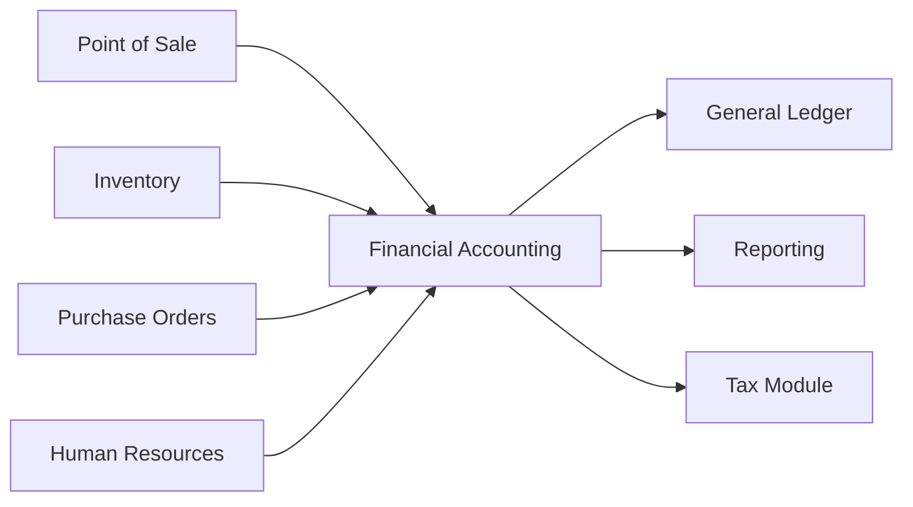

# Financial Accounting Module

## Overview

The BigLedger Financial Accounting module provides a comprehensive, standards-compliant accounting system designed for businesses of all sizes. Built with GAAP, IFRS, and local accounting standards in mind, it offers real-time financial insights while maintaining the rigor required for audit compliance.

## Core Concepts

### Double-Entry Accounting

BigLedger implements true double-entry bookkeeping where every transaction affects at least two accounts:

```
Debit Account A = Credit Account B

Example: Sale of $1,000
Debit: Accounts Receivable $1,000
Credit: Sales Revenue $1,000
```

### Chart of Accounts Structure

```
1000-1999: Assets
  1000-1099: Current Assets
    1000: Cash and Cash Equivalents
    1010: Petty Cash
    1020: Bank Accounts
    1100: Accounts Receivable
    1200: Inventory
  1500-1599: Fixed Assets
    1500: Property, Plant & Equipment
    1550: Accumulated Depreciation

2000-2999: Liabilities  
  2000-2099: Current Liabilities
    2000: Accounts Payable
    2100: Accrued Expenses
    2200: Taxes Payable
  2500-2599: Long-term Liabilities
    2500: Long-term Debt
    2600: Deferred Tax Liabilities

3000-3999: Equity
  3000: Common Stock
  3100: Retained Earnings
  3200: Additional Paid-in Capital

4000-4999: Revenue
  4000: Product Sales
  4100: Service Revenue
  4200: Other Income

5000-5999: Cost of Goods Sold
  5000: Direct Materials
  5100: Direct Labor
  5200: Manufacturing Overhead

6000-6999: Operating Expenses
  6000: Salaries and Wages
  6100: Rent Expense
  6200: Utilities
  6300: Marketing
  6400: Professional Fees
```

## Key Features

### 📊 General Ledger

#### Transaction Management
- **Journal Entries**: Manual and automated entries
- **Recurring Entries**: Scheduled recurring transactions
- **Reversing Entries**: Automatic reversal capabilities
- **Batch Processing**: Bulk transaction imports
- **Multi-currency**: Automatic exchange rate calculations
- **Audit Trail**: Complete transaction history

#### Account Management
- **Flexible COA**: Customizable chart of accounts
- **Account Groups**: Hierarchical account structure
- **Sub-accounts**: Unlimited sub-account levels
- **Cost Centers**: Department/project tracking
- **Account Reconciliation**: Bank and inter-company reconciliation
- **Opening Balances**: Historical data import

### 💰 Accounts Payable (AP)

#### Vendor Management
- **Vendor Database**: Comprehensive vendor profiles
- **Payment Terms**: Flexible payment term configuration
- **Credit Limits**: Vendor credit management
- **1099 Tracking**: US tax reporting
- **Vendor Portal**: Self-service vendor access

#### Purchase Processing
```yaml
Purchase Workflow:
  1. Purchase Requisition:
     - Department request
     - Budget validation
     - Approval routing
  
  2. Purchase Order:
     - Vendor selection
     - Price negotiation
     - Terms agreement
  
  3. Goods Receipt:
     - Quantity verification
     - Quality check
     - Three-way matching
  
  4. Invoice Processing:
     - OCR invoice capture
     - Automatic matching
     - Approval workflow
  
  5. Payment:
     - Payment scheduling
     - Batch payments
     - Electronic payments
```

#### Payment Features
- **Payment Runs**: Automated payment processing
- **Check Printing**: MICR check printing
- **ACH/Wire**: Electronic payment support
- **Foreign Payments**: International wire transfers
- **Payment Matching**: Automatic reconciliation
- **Early Payment Discounts**: Discount optimization

### 💳 Accounts Receivable (AR)

#### Customer Management
- **Customer Database**: 360-degree customer view
- **Credit Management**: Credit limits and terms
- **Aging Analysis**: Detailed aging reports
- **Collection Management**: Automated reminders
- **Customer Portal**: Self-service portal
- **Statement Generation**: Automatic statements

#### Billing & Invoicing
- **Invoice Templates**: Customizable invoice designs
- **Recurring Invoices**: Subscription billing
- **Pro-forma Invoices**: Quote to invoice conversion
- **Credit Notes**: Returns and adjustments
- **Multi-currency Billing**: Foreign currency invoices
- **Tax Calculation**: Automatic tax computation

#### Collections
```javascript
// Automated Collection Workflow
{
  "rules": [
    {
      "days_overdue": 0,
      "action": "send_invoice"
    },
    {
      "days_overdue": 15,
      "action": "send_reminder",
      "template": "friendly_reminder"
    },
    {
      "days_overdue": 30,
      "action": "send_notice",
      "template": "payment_notice"
    },
    {
      "days_overdue": 60,
      "action": "escalate",
      "assign_to": "collections_team"
    },
    {
      "days_overdue": 90,
      "action": "legal_action",
      "notify": "legal_department"
    }
  ]
}
```

### 🏦 Cash Management

#### Bank Integration
- **Bank Feeds**: Automatic transaction import
- **Bank Reconciliation**: Smart matching algorithms
- **Multi-bank Support**: Manage multiple accounts
- **Cash Forecasting**: Predictive cash flow
- **Sweep Accounts**: Automatic fund transfers

#### Cash Operations
- **Cash Position**: Real-time cash visibility
- **Payment Gateway**: Integrated payment processing
- **Petty Cash**: Petty cash management
- **Cash Journals**: Manual cash entries
- **Float Management**: Check float tracking

### 📈 Financial Reporting

#### Standard Reports

##### Income Statement (P&L)
```
                    Current Month    YTD
Revenue
  Product Sales     $100,000        $1,200,000
  Service Revenue    $50,000          $600,000
Total Revenue       $150,000        $1,800,000

Cost of Sales
  Direct Costs       $60,000          $720,000
Gross Profit         $90,000        $1,080,000
Gross Margin            60%              60%

Operating Expenses
  Salaries           $30,000          $360,000
  Rent               $10,000          $120,000
  Other              $15,000          $180,000
Total OpEx           $55,000          $660,000

EBITDA               $35,000          $420,000
EBITDA Margin          23.3%            23.3%
```

##### Balance Sheet
```
ASSETS
Current Assets
  Cash                        $500,000
  Accounts Receivable         $300,000
  Inventory                    $200,000
Total Current Assets        $1,000,000

Fixed Assets
  Property & Equipment        $800,000
  Less: Depreciation         ($200,000)
Total Fixed Assets            $600,000

TOTAL ASSETS               $1,600,000

LIABILITIES & EQUITY
Current Liabilities
  Accounts Payable            $200,000
  Accrued Expenses            $100,000
Total Current Liabilities     $300,000

Long-term Liabilities
  Term Loan                   $400,000

Equity
  Common Stock                $500,000
  Retained Earnings           $400,000
Total Equity                  $900,000

TOTAL LIABILITIES & EQUITY $1,600,000
```

##### Cash Flow Statement
- Operating Activities
- Investing Activities
- Financing Activities
- Free Cash Flow Analysis

#### Custom Reports
- **Report Builder**: Drag-and-drop report designer
- **Financial Ratios**: Automated ratio calculations
- **Variance Analysis**: Budget vs actual comparisons
- **Trend Analysis**: Period-over-period comparisons
- **Consolidated Reports**: Multi-entity consolidation
- **Segment Reporting**: Business unit analysis

### 🌍 Multi-Entity Management

#### Entity Structure
```
Parent Company
├── Subsidiary A (USA)
│   ├── Division 1
│   └── Division 2
├── Subsidiary B (Europe)
│   ├── Germany Branch
│   └── France Branch
└── Subsidiary C (Asia)
    ├── Singapore Office
    └── Hong Kong Office
```

#### Consolidation Features
- **Automated Elimination**: Inter-company transactions
- **Currency Translation**: Foreign subsidiary consolidation
- **Minority Interest**: Non-controlling interest calculations
- **Transfer Pricing**: Inter-company pricing rules
- **Consolidated Reporting**: Group financial statements

### 📋 Compliance & Audit

#### Tax Compliance
- **Sales Tax**: Multi-jurisdiction tax support
- **VAT/GST**: Value-added tax management
- **Income Tax**: Tax provision calculations
- **Tax Returns**: Automated tax return preparation
- **E-invoicing**: Government e-invoice compliance
- **BEPS Reporting**: International tax reporting

#### Audit Features
- **Audit Trail**: Complete transaction history
- **Document Management**: Supporting document storage
- **User Activity Logs**: Detailed access logs
- **Approval Workflows**: Multi-level approvals
- **Segregation of Duties**: Role-based permissions
- **Period Locking**: Prevent unauthorized changes

### 🔄 Period-End Processing

#### Month-End Checklist
```markdown
- [ ] Complete all transactions for the period
- [ ] Run bank reconciliations
- [ ] Post depreciation entries
- [ ] Accrue expenses
- [ ] Defer revenues
- [ ] Run allocation rules
- [ ] Reconcile inter-company accounts
- [ ] Review and post adjusting entries
- [ ] Generate preliminary reports
- [ ] Management review and approval
- [ ] Lock the period
- [ ] Generate final reports
- [ ] Backup data
```

#### Year-End Processing
- **Closing Entries**: Automated closing process
- **Retained Earnings**: Automatic rollover
- **1099 Generation**: Vendor tax forms
- **Financial Statements**: Annual report generation
- **Audit Preparation**: Audit schedule preparation
- **Tax Package**: Tax return support documents

## Configuration

### Initial Setup

#### Step 1: Company Configuration
```yaml
Company:
  Name: ABC Corporation
  Tax ID: 12-3456789
  Fiscal Year: January - December
  Functional Currency: USD
  Reporting Currency: USD
  Accounting Standards: GAAP
  Industry: Manufacturing
```

#### Step 2: Chart of Accounts Setup

1. **Import Standard COA**
   - Select industry template
   - Review account structure
   - Customize as needed

2. **Configure Account Properties**
   ```json
   {
     "account": "1000",
     "name": "Cash",
     "type": "Asset",
     "subtype": "Current Asset",
     "normal_balance": "Debit",
     "currency": "USD",
     "reconcilable": true,
     "active": true
   }
   ```

#### Step 3: Opening Balances

1. **Trial Balance Import**
   ```csv
   Account,Description,Debit,Credit
   1000,Cash,50000,0
   1100,Accounts Receivable,30000,0
   2000,Accounts Payable,0,20000
   3000,Common Stock,0,60000
   ```

2. **Balance Verification**
   - Total Debits = Total Credits
   - Balance sheet balances
   - Income statement at zero

### Tax Configuration

#### Sales Tax Setup
```javascript
{
  "tax_rules": [
    {
      "jurisdiction": "CA",
      "rate": 0.0725,
      "components": [
        {"name": "State Tax", "rate": 0.06},
        {"name": "County Tax", "rate": 0.0125}
      ]
    },
    {
      "jurisdiction": "NY",
      "rate": 0.08,
      "exemptions": ["food", "medicine"]
    }
  ]
}
```

#### VAT Configuration
```yaml
VAT Schemes:
  Standard Rate: 20%
  Reduced Rate: 5%
  Zero Rate: 0%
  Exempt: No VAT
  
Reverse Charge:
  Enabled: Yes
  Threshold: €10,000
```

## Integration

### ERP Module Integration



### Banking Integration

#### Supported Banks
- Bank of America
- Chase
- Wells Fargo
- Citibank
- HSBC
- Standard Chartered
- And 500+ more via Open Banking

#### Integration Methods
1. **Direct API**: Real-time connection
2. **File Import**: OFX, QFX, CSV
3. **Manual Entry**: Manual transaction entry

### External Systems

#### QuickBooks Migration
```python
# Migration script example
def migrate_from_quickbooks():
    # Export from QuickBooks
    qb_data = export_quickbooks_data()
    
    # Transform data
    transformed = transform_to_bigledger_format(qb_data)
    
    # Validate
    validation_result = validate_data(transformed)
    
    if validation_result.is_valid:
        # Import to BigLedger
        import_to_bigledger(transformed)
        
        # Verify balances
        verify_trial_balance()
    else:
        log_errors(validation_result.errors)
```

## Best Practices

### Internal Controls

1. **Segregation of Duties**
   - Separate authorization, recording, custody
   - Maker-checker for critical transactions
   - Regular rotation of duties

2. **Approval Matrix**
   | Transaction Type | Amount | Approver |
   |-----------------|--------|----------|
   | Purchase Order | < $1,000 | Supervisor |
   | Purchase Order | < $10,000 | Manager |
   | Purchase Order | > $10,000 | Director |
   | Journal Entry | Any | Controller |
   | Payment | < $5,000 | AP Manager |
   | Payment | > $5,000 | CFO |

3. **Reconciliation Schedule**
   - Daily: Cash reconciliation
   - Weekly: Credit card reconciliation
   - Monthly: Bank reconciliation, AR/AP aging
   - Quarterly: Inter-company reconciliation
   - Annually: Full account reconciliation

### Performance Optimization

1. **Database Optimization**
   ```sql
   -- Index frequently queried columns
   CREATE INDEX idx_gl_date ON general_ledger(transaction_date);
   CREATE INDEX idx_gl_account ON general_ledger(account_code);
   
   -- Partition large tables
   ALTER TABLE general_ledger 
   PARTITION BY RANGE (YEAR(transaction_date));
   ```

2. **Archiving Strategy**
   - Archive transactions older than 7 years
   - Maintain summary data for reporting
   - Compress archived data

### Security Measures

1. **Access Control**
   - Role-based permissions
   - IP restrictions
   - Two-factor authentication
   - Session management

2. **Data Protection**
   - Encryption at rest and in transit
   - Regular backups
   - Disaster recovery plan
   - GDPR/CCPA compliance

## Troubleshooting

### Common Issues

| Issue | Cause | Solution |
|-------|-------|----------|
| Out of balance | Missing journal entry leg | Review journal entries, ensure debits = credits |
| Reconciliation mismatch | Timing differences | Check outstanding items, adjust for timing |
| Report discrepancies | Incorrect mapping | Verify account mappings in report configuration |
| Performance issues | Large data volume | Implement archiving, optimize queries |
| Tax calculation errors | Outdated tax tables | Update tax configuration, verify rates |

### System Checks

```bash
# Daily health check
bigledger finance check --daily

# Validate trial balance
bigledger finance validate-tb --date 2024-01-31

# Reconciliation status
bigledger finance reconciliation-status

# Audit trail verification
bigledger finance audit-trail --verify
```

## Regulatory Compliance

### Supported Standards
- **US GAAP**: Generally Accepted Accounting Principles
- **IFRS**: International Financial Reporting Standards
- **UK GAAP**: UK accounting standards
- **IND AS**: Indian Accounting Standards
- **PRC GAAP**: Chinese accounting standards

### Compliance Features
- **SOX Compliance**: Sarbanes-Oxley controls
- **GDPR**: Data privacy compliance
- **PCI DSS**: Payment card security
- **HIPAA**: Healthcare data protection
- **ISO 27001**: Information security

## Support & Resources

- 📚 [Accounting Best Practices Guide](/docs/best-practices/accounting/)
- 🎥 [Video Tutorials](/tutorials/financial-accounting/)
- 📊 [Report Templates Library](/templates/financial/)
- 🤝 [Community Forum](https://forum.bigledger.com/finance)
- 📧 [Expert Support](mailto:finance@bigledger.com)

---

*BigLedger Financial Accounting - Where accuracy meets efficiency in financial management.*