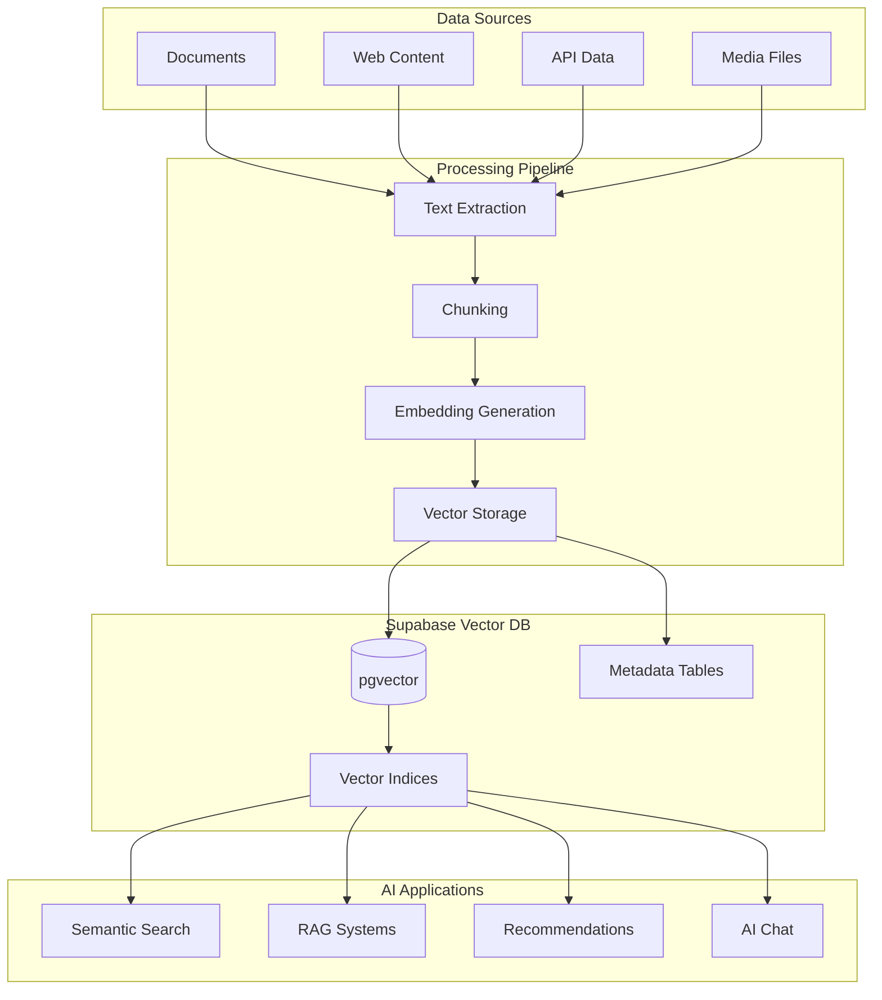

# Vector AI & Machine Learning with Supabase

Supabase's native pgvector extension makes it the perfect database for AI applications, providing high-performance vector storage, similarity search, and seamless integration with popular AI models and frameworks.

## Vector Database Architecture



## pgvector Setup and Configuration

### Enable pgvector Extension

```sql
-- Enable pgvector extension
CREATE EXTENSION IF NOT EXISTS vector;

-- Create vector-enabled tables
CREATE TABLE documents (
    id UUID PRIMARY KEY DEFAULT uuid_generate_v4(),
    title TEXT NOT NULL,
    content TEXT NOT NULL,
    source_url TEXT,
    metadata JSONB DEFAULT '{}',
    embedding VECTOR(1536), -- OpenAI ada-002 embedding dimension
    created_at TIMESTAMPTZ DEFAULT NOW(),
    updated_at TIMESTAMPTZ DEFAULT NOW()
);

CREATE TABLE knowledge_chunks (
    id UUID PRIMARY KEY DEFAULT uuid_generate_v4(),
    document_id UUID REFERENCES documents(id) ON DELETE CASCADE,
    chunk_index INTEGER NOT NULL,
    content TEXT NOT NULL,
    embedding VECTOR(1536),
    token_count INTEGER,
    metadata JSONB DEFAULT '{}',
    created_at TIMESTAMPTZ DEFAULT NOW()
);

-- Create vector indices for performance
CREATE INDEX ON documents USING ivfflat (embedding vector_cosine_ops) WITH (lists = 100);
CREATE INDEX ON knowledge_chunks USING ivfflat (embedding vector_cosine_ops) WITH (lists = 100);

-- Alternative: HNSW index for better recall (PostgreSQL 16+)
-- CREATE INDEX ON documents USING hnsw (embedding vector_cosine_ops);
```

### Optimize Vector Indices

```sql
-- Configure ivfflat parameters based on data size
-- For < 1M vectors: lists = rows/1000
-- For > 1M vectors: lists = sqrt(rows)

-- Update statistics for better query planning
ANALYZE documents;
ANALYZE knowledge_chunks;

-- Create compound indices for filtered searches
CREATE INDEX idx_documents_metadata_gin ON documents USING gin(metadata);
CREATE INDEX idx_documents_source_embedding ON documents(source_url, embedding);
CREATE INDEX idx_chunks_document_embedding ON knowledge_chunks(document_id, embedding);
```

## Embedding Generation Pipeline

### OpenAI Embeddings Integration

```typescript
import OpenAI from 'openai'
import { supabase } from '@/lib/supabase'

const openai = new OpenAI({
  apiKey: process.env.OPENAI_API_KEY
})

class EmbeddingGenerator {
  async generateEmbedding(text: string): Promise<number[]> {
    const response = await openai.embeddings.create({
      model: 'text-embedding-ada-002',
      input: text,
      encoding_format: 'float'
    })

    return response.data[0].embedding
  }

  async generateEmbeddings(texts: string[]): Promise<number[][]> {
    const response = await openai.embeddings.create({
      model: 'text-embedding-ada-002',
      input: texts,
      encoding_format: 'float'
    })

    return response.data.map(item => item.embedding)
  }

  // Batch processing for large datasets
  async batchGenerateEmbeddings(texts: string[], batchSize = 100): Promise<number[][]> {
    const batches = []
    for (let i = 0; i < texts.length; i += batchSize) {
      batches.push(texts.slice(i, i + batchSize))
    }

    const embeddings = []
    for (const batch of batches) {
      const batchEmbeddings = await this.generateEmbeddings(batch)
      embeddings.push(...batchEmbeddings)
      
      // Rate limiting
      await new Promise(resolve => setTimeout(resolve, 100))
    }

    return embeddings
  }
}
```

### Alternative Embedding Models

```typescript
// Hugging Face Transformers
class HuggingFaceEmbeddings {
  private modelUrl = 'https://api-inference.huggingface.co/models/sentence-transformers/all-MiniLM-L6-v2'

  async generateEmbedding(text: string): Promise<number[]> {
    const response = await fetch(this.modelUrl, {
      headers: {
        'Authorization': `Bearer ${process.env.HUGGINGFACE_API_KEY}`,
        'Content-Type': 'application/json'
      },
      method: 'POST',
      body: JSON.stringify({
        inputs: text,
        options: { wait_for_model: true }
      })
    })

    return await response.json()
  }
}

// Local embeddings with Ollama
class OllamaEmbeddings {
  private baseUrl = 'http://localhost:11434'

  async generateEmbedding(text: string): Promise<number[]> {
    const response = await fetch(`${this.baseUrl}/api/embeddings`, {
      method: 'POST',
      headers: { 'Content-Type': 'application/json' },
      body: JSON.stringify({
        model: 'nomic-embed-text',
        prompt: text
      })
    })

    const data = await response.json()
    return data.embedding
  }
}
```

## Document Processing and Chunking

### Intelligent Text Chunking

```typescript
import { RecursiveCharacterTextSplitter } from 'langchain/text_splitter'
import { TokenTextSplitter } from 'langchain/text_splitter'

class DocumentProcessor {
  private embeddings = new EmbeddingGenerator()

  async processDocument(content: string, metadata: any = {}): Promise<string> {
    // 1. Clean and preprocess text
    const cleanedContent = this.preprocessText(content)

    // 2. Create document record
    const { data: document, error } = await supabase
      .from('documents')
      .insert({
        title: metadata.title || 'Untitled',
        content: cleanedContent,
        source_url: metadata.source_url,
        metadata: metadata,
        embedding: await this.embeddings.generateEmbedding(cleanedContent)
      })
      .select()
      .single()

    if (error) throw error

    // 3. Create chunks
    await this.createChunks(document.id, cleanedContent)

    return document.id
  }

  private async createChunks(documentId: string, content: string) {
    // Smart chunking strategy
    const textSplitter = new RecursiveCharacterTextSplitter({
      chunkSize: 1000,
      chunkOverlap: 200,
      separators: ['\n\n', '\n', '. ', ' ', '']
    })

    const chunks = await textSplitter.createDocuments([content])
    
    // Generate embeddings for all chunks
    const chunkTexts = chunks.map(chunk => chunk.pageContent)
    const embeddings = await this.embeddings.batchGenerateEmbeddings(chunkTexts)

    // Store chunks with embeddings
    const chunkData = chunks.map((chunk, index) => ({
      document_id: documentId,
      chunk_index: index,
      content: chunk.pageContent,
      embedding: embeddings[index],
      token_count: this.countTokens(chunk.pageContent),
      metadata: chunk.metadata
    }))

    const { error } = await supabase
      .from('knowledge_chunks')
      .insert(chunkData)

    if (error) throw error
  }

  private preprocessText(text: string): string {
    // Remove excessive whitespace
    text = text.replace(/\s+/g, ' ')
    
    // Remove special characters that might interfere with embeddings
    text = text.replace(/[^\w\s\.\,\!\?\-\(\)]/g, ' ')
    
    // Normalize line breaks
    text = text.replace(/\r\n/g, '\n')
    
    return text.trim()
  }

  private countTokens(text: string): number {
    // Rough token estimation (4 chars per token on average)
    return Math.ceil(text.length / 4)
  }
}
```

### Advanced Chunking Strategies

```typescript
class AdvancedChunking {
  // Semantic chunking based on sentence similarity
  async semanticChunking(text: string, maxChunkSize = 1000): Promise<string[]> {
    const sentences = this.splitIntoSentences(text)
    const chunks = []
    let currentChunk = []
    let currentSize = 0

    for (let i = 0; i < sentences.length; i++) {
      const sentence = sentences[i]
      const sentenceSize = sentence.length

      if (currentSize + sentenceSize > maxChunkSize && currentChunk.length > 0) {
        // Check semantic similarity before creating chunk
        const similarity = await this.calculateChunkCoherence(currentChunk)
        
        if (similarity > 0.7) {
          chunks.push(currentChunk.join(' '))
          currentChunk = [sentence]
          currentSize = sentenceSize
        } else {
          // Find better breaking point
          const breakPoint = await this.findOptimalBreakPoint(currentChunk)
          chunks.push(currentChunk.slice(0, breakPoint).join(' '))
          currentChunk = [...currentChunk.slice(breakPoint), sentence]
          currentSize = currentChunk.join(' ').length
        }
      } else {
        currentChunk.push(sentence)
        currentSize += sentenceSize
      }
    }

    if (currentChunk.length > 0) {
      chunks.push(currentChunk.join(' '))
    }

    return chunks
  }

  // Hierarchical chunking for structured documents
  async hierarchicalChunking(text: string): Promise<any[]> {
    const sections = this.extractSections(text)
    const chunks = []

    for (const section of sections) {
      const sectionEmbedding = await this.embeddings.generateEmbedding(section.title)
      
      const subsections = await this.semanticChunking(section.content)
      const subsectionEmbeddings = await this.embeddings.batchGenerateEmbeddings(subsections)

      chunks.push({
        type: 'section',
        title: section.title,
        embedding: sectionEmbedding,
        subsections: subsections.map((content, index) => ({
          content,
          embedding: subsectionEmbeddings[index]
        }))
      })
    }

    return chunks
  }

  private async calculateChunkCoherence(sentences: string[]): Promise<number> {
    if (sentences.length < 2) return 1.0

    const embeddings = await this.embeddings.batchGenerateEmbeddings(sentences)
    let totalSimilarity = 0
    let comparisons = 0

    for (let i = 0; i < embeddings.length - 1; i++) {
      for (let j = i + 1; j < embeddings.length; j++) {
        totalSimilarity += this.cosineSimilarity(embeddings[i], embeddings[j])
        comparisons++
      }
    }

    return totalSimilarity / comparisons
  }
}
```

## Similarity Search Implementation

### Basic Vector Search

```typescript
class VectorSearch {
  // Semantic search with cosine similarity
  async semanticSearch(
    query: string,
    limit = 10,
    threshold = 0.7
  ): Promise<any[]> {
    // Generate embedding for query
    const queryEmbedding = await this.embeddings.generateEmbedding(query)

    // Perform vector search
    const { data, error } = await supabase.rpc('match_documents', {
      query_embedding: queryEmbedding,
      match_threshold: threshold,
      match_count: limit
    })

    if (error) throw error
    return data
  }

  // Hybrid search combining vector and text search
  async hybridSearch(
    query: string,
    limit = 10,
    vectorWeight = 0.7,
    textWeight = 0.3
  ): Promise<any[]> {
    const queryEmbedding = await this.embeddings.generateEmbedding(query)

    const { data, error } = await supabase.rpc('hybrid_search', {
      query_text: query,
      query_embedding: queryEmbedding,
      match_count: limit,
      vector_weight: vectorWeight,
      text_weight: textWeight
    })

    if (error) throw error
    return data
  }

  // Filtered vector search
  async filteredSearch(
    query: string,
    filters: any,
    limit = 10
  ): Promise<any[]> {
    const queryEmbedding = await this.embeddings.generateEmbedding(query)

    let queryBuilder = supabase
      .from('knowledge_chunks')
      .select(`
        id,
        content,
        metadata,
        document_id,
        documents!inner (
          title,
          source_url,
          metadata
        )
      `)
      .lt('embedding <-> $1', 0.8) // Similarity threshold

    // Apply filters
    Object.entries(filters).forEach(([key, value]) => {
      if (key.startsWith('metadata.')) {
        queryBuilder = queryBuilder.contains('metadata', { [key.split('.')[1]]: value })
      } else {
        queryBuilder = queryBuilder.eq(key, value)
      }
    })

    const { data, error } = await queryBuilder
      .order('embedding <-> $1')
      .limit(limit)

    if (error) throw error
    return data
  }
}
```

### Custom PostgreSQL Functions

```sql
-- Cosine similarity search function
CREATE OR REPLACE FUNCTION match_documents (
  query_embedding VECTOR(1536),
  match_threshold FLOAT,
  match_count INT
)
RETURNS TABLE (
  id UUID,
  content TEXT,
  metadata JSONB,
  similarity FLOAT
)
LANGUAGE plpgsql
AS $$
BEGIN
  RETURN QUERY
  SELECT
    knowledge_chunks.id,
    knowledge_chunks.content,
    knowledge_chunks.metadata,
    1 - (knowledge_chunks.embedding <=> query_embedding) AS similarity
  FROM knowledge_chunks
  WHERE 1 - (knowledge_chunks.embedding <=> query_embedding) > match_threshold
  ORDER BY knowledge_chunks.embedding <=> query_embedding
  LIMIT match_count;
END;
$$;

-- Hybrid search function
CREATE OR REPLACE FUNCTION hybrid_search (
  query_text TEXT,
  query_embedding VECTOR(1536),
  match_count INT,
  vector_weight FLOAT DEFAULT 0.7,
  text_weight FLOAT DEFAULT 0.3
)
RETURNS TABLE (
  id UUID,
  content TEXT,
  metadata JSONB,
  score FLOAT
)
LANGUAGE plpgsql
AS $$
BEGIN
  RETURN QUERY
  SELECT
    kc.id,
    kc.content,
    kc.metadata,
    (
      (1 - (kc.embedding <=> query_embedding)) * vector_weight +
      ts_rank_cd(to_tsvector('english', kc.content), plainto_tsquery('english', query_text)) * text_weight
    ) AS score
  FROM knowledge_chunks kc
  WHERE 
    kc.content @@ plainto_tsquery('english', query_text) OR
    1 - (kc.embedding <=> query_embedding) > 0.5
  ORDER BY score DESC
  LIMIT match_count;
END;
$$;

-- Multi-vector search for different embedding models
CREATE OR REPLACE FUNCTION multi_vector_search (
  openai_embedding VECTOR(1536),
  huggingface_embedding VECTOR(384),
  match_count INT
)
RETURNS TABLE (
  id UUID,
  content TEXT,
  combined_score FLOAT
)
LANGUAGE plpgsql
AS $$
BEGIN
  RETURN QUERY
  SELECT
    kc.id,
    kc.content,
    (
      (1 - (kc.openai_embedding <=> openai_embedding)) * 0.6 +
      (1 - (kc.huggingface_embedding <=> huggingface_embedding)) * 0.4
    ) AS combined_score
  FROM knowledge_chunks kc
  ORDER BY combined_score DESC
  LIMIT match_count;
END;
$$;
```

## RAG (Retrieval-Augmented Generation) Implementation

### Complete RAG System

```typescript
class RAGSystem {
  private vectorSearch = new VectorSearch()
  private llm: OpenAI

  constructor() {
    this.llm = new OpenAI({
      apiKey: process.env.OPENAI_API_KEY
    })
  }

  async generateAnswer(
    question: string,
    contextLimit = 5,
    options: any = {}
  ): Promise<string> {
    // 1. Retrieve relevant context
    const context = await this.retrieveContext(question, contextLimit)

    // 2. Generate answer with context
    const answer = await this.generateWithContext(question, context, options)

    // 3. Store Q&A for future reference
    await this.storeQA(question, answer, context)

    return answer
  }

  private async retrieveContext(question: string, limit: number): Promise<any[]> {
    // Multi-strategy retrieval
    const [vectorResults, hybridResults] = await Promise.all([
      this.vectorSearch.semanticSearch(question, limit),
      this.vectorSearch.hybridSearch(question, limit, 0.6, 0.4)
    ])

    // Combine and deduplicate results
    const combined = this.combineResults(vectorResults, hybridResults)
    
    // Rerank using cross-encoder or similar
    const reranked = await this.rerankResults(question, combined)
    
    return reranked.slice(0, limit)
  }

  private async generateWithContext(
    question: string,
    context: any[],
    options: any
  ): Promise<string> {
    const systemPrompt = `You are an AI assistant that answers questions based on the provided context. 
    Use only the information from the context to answer questions. 
    If the context doesn't contain enough information, say so clearly.`

    const contextText = context
      .map((item, index) => `[${index + 1}] ${item.content}`)
      .join('\n\n')

    const userPrompt = `Context:
${contextText}

Question: ${question}

Answer based on the context provided:`

    const response = await this.llm.chat.completions.create({
      model: options.model || 'gpt-4',
      messages: [
        { role: 'system', content: systemPrompt },
        { role: 'user', content: userPrompt }
      ],
      temperature: options.temperature || 0.1,
      max_tokens: options.max_tokens || 500
    })

    return response.choices[0].message.content || 'Unable to generate answer'
  }

  private combineResults(vectorResults: any[], hybridResults: any[]): any[] {
    const seen = new Set()
    const combined = []

    // Add vector results
    for (const result of vectorResults) {
      if (!seen.has(result.id)) {
        seen.add(result.id)
        combined.push({ ...result, source: 'vector' })
      }
    }

    // Add hybrid results
    for (const result of hybridResults) {
      if (!seen.has(result.id)) {
        seen.add(result.id)
        combined.push({ ...result, source: 'hybrid' })
      }
    }

    return combined
  }

  private async rerankResults(question: string, results: any[]): Promise<any[]> {
    // Simple reranking based on content length and similarity
    return results.sort((a, b) => {
      const scoreA = (a.similarity || a.score || 0) * (1 + Math.log(a.content.length))
      const scoreB = (b.similarity || b.score || 0) * (1 + Math.log(b.content.length))
      return scoreB - scoreA
    })
  }

  private async storeQA(question: string, answer: string, context: any[]) {
    await supabase
      .from('qa_history')
      .insert({
        question,
        answer,
        context_ids: context.map(c => c.id),
        metadata: {
          context_count: context.length,
          sources: context.map(c => c.source_url).filter(Boolean)
        }
      })
  }
}
```

### Conversational RAG

```typescript
class ConversationalRAG extends RAGSystem {
  async generateConversationalAnswer(
    question: string,
    conversationHistory: any[],
    contextLimit = 5
  ): Promise<string> {
    // 1. Generate contextual query from conversation history
    const contextualQuery = await this.generateContextualQuery(question, conversationHistory)

    // 2. Retrieve context using contextual query
    const context = await this.retrieveContext(contextualQuery, contextLimit)

    // 3. Generate answer considering conversation history
    const answer = await this.generateConversationalResponse(
      question,
      context,
      conversationHistory
    )

    return answer
  }

  private async generateContextualQuery(
    question: string,
    history: any[]
  ): Promise<string> {
    const recentHistory = history.slice(-5) // Last 5 messages
    const historyText = recentHistory
      .map(msg => `${msg.role}: ${msg.content}`)
      .join('\n')

    const response = await this.llm.chat.completions.create({
      model: 'gpt-3.5-turbo',
      messages: [
        {
          role: 'system',
          content: 'Convert the user question into a search query that considers the conversation context. Return only the search query.'
        },
        {
          role: 'user',
          content: `Conversation history:\n${historyText}\n\nCurrent question: ${question}\n\nSearch query:`
        }
      ],
      temperature: 0.1,
      max_tokens: 100
    })

    return response.choices[0].message.content || question
  }

  private async generateConversationalResponse(
    question: string,
    context: any[],
    history: any[]
  ): Promise<string> {
    const recentHistory = history.slice(-10)
    const historyText = recentHistory
      .map(msg => `${msg.role}: ${msg.content}`)
      .join('\n')

    const contextText = context
      .map((item, index) => `[${index + 1}] ${item.content}`)
      .join('\n\n')

    const response = await this.llm.chat.completions.create({
      model: 'gpt-4',
      messages: [
        {
          role: 'system',
          content: `You are an AI assistant in a conversation. Use the provided context to answer questions, 
          but also consider the conversation history for continuity. Be conversational and refer to 
          previous topics when relevant.`
        },
        {
          role: 'user',
          content: `Conversation history:\n${historyText}\n\nContext:\n${contextText}\n\nCurrent question: ${question}`
        }
      ],
      temperature: 0.2,
      max_tokens: 600
    })

    return response.choices[0].message.content || 'Unable to generate answer'
  }
}
```

## Recommendation Systems

### Content-Based Recommendations

```typescript
class RecommendationEngine {
  async getContentRecommendations(
    userId: string,
    itemType: string = 'document',
    limit = 10
  ): Promise<any[]> {
    // Get user's interaction history
    const userProfile = await this.buildUserProfile(userId)

    // Find similar items
    const recommendations = await supabase.rpc('content_recommendations', {
      user_embedding: userProfile.embedding,
      item_type: itemType,
      limit: limit,
      exclude_seen: userProfile.seenItems
    })

    return recommendations.data || []
  }

  private async buildUserProfile(userId: string): Promise<any> {
    // Get user's interactions
    const { data: interactions } = await supabase
      .from('user_interactions')
      .select(`
        item_id,
        interaction_type,
        rating,
        knowledge_chunks (content, embedding)
      `)
      .eq('user_id', userId)
      .order('created_at', { ascending: false })
      .limit(50)

    if (!interactions?.length) {
      return { embedding: null, seenItems: [] }
    }

    // Calculate weighted average of embeddings based on ratings
    let weightedSum = new Array(1536).fill(0)
    let totalWeight = 0

    interactions.forEach(interaction => {
      const weight = this.getInteractionWeight(interaction.interaction_type, interaction.rating)
      const embedding = interaction.knowledge_chunks.embedding
      
      for (let i = 0; i < embedding.length; i++) {
        weightedSum[i] += embedding[i] * weight
      }
      totalWeight += weight
    })

    // Normalize
    const userEmbedding = weightedSum.map(val => val / totalWeight)
    const seenItems = interactions.map(i => i.item_id)

    return {
      embedding: userEmbedding,
      seenItems
    }
  }

  private getInteractionWeight(type: string, rating?: number): number {
    const weights = {
      view: 1,
      like: 3,
      share: 5,
      bookmark: 4,
      rating: rating || 1
    }
    return weights[type] || 1
  }
}
```

### Collaborative Filtering

```typescript
class CollaborativeFiltering {
  async getUserSimilarityRecommendations(
    userId: string,
    limit = 10
  ): Promise<any[]> {
    // Find similar users
    const similarUsers = await this.findSimilarUsers(userId, 20)

    // Get recommendations from similar users
    const recommendations = await this.getRecommendationsFromSimilarUsers(
      userId,
      similarUsers,
      limit
    )

    return recommendations
  }

  private async findSimilarUsers(userId: string, limit: number): Promise<any[]> {
    const { data } = await supabase.rpc('find_similar_users', {
      target_user_id: userId,
      similarity_threshold: 0.3,
      limit: limit
    })

    return data || []
  }

  private async getRecommendationsFromSimilarUsers(
    userId: string,
    similarUsers: any[],
    limit: number
  ): Promise<any[]> {
    const userIds = similarUsers.map(u => u.user_id)
    
    // Get highly-rated items from similar users
    const { data } = await supabase
      .from('user_interactions')
      .select(`
        item_id,
        rating,
        knowledge_chunks (id, content, metadata)
      `)
      .in('user_id', userIds)
      .gte('rating', 4)
      .not('item_id', 'in', `(${await this.getUserSeenItems(userId)})`)
      .order('rating', { ascending: false })
      .limit(limit * 2)

    // Score and rank recommendations
    const scored = data?.map(item => ({
      ...item,
      score: this.calculateRecommendationScore(item, similarUsers)
    })) || []

    return scored
      .sort((a, b) => b.score - a.score)
      .slice(0, limit)
  }
}
```

## Semantic Search at Scale

### Search Performance Optimization

```typescript
class OptimizedVectorSearch {
  private searchCache = new Map<string, any>()
  private cacheTimeout = 300000 // 5 minutes

  async performanceSearch(
    query: string,
    options: any = {}
  ): Promise<any[]> {
    const cacheKey = this.generateCacheKey(query, options)
    
    // Check cache first
    if (this.searchCache.has(cacheKey)) {
      const cached = this.searchCache.get(cacheKey)
      if (Date.now() - cached.timestamp < this.cacheTimeout) {
        return cached.results
      }
    }

    // Parallel search strategies
    const [
      vectorResults,
      hybridResults,
      fuzzyResults
    ] = await Promise.all([
      this.vectorSearch(query, options),
      this.hybridSearch(query, options),
      this.fuzzySearch(query, options)
    ])

    // Combine and rerank
    const combined = await this.combineAndRerank(
      query,
      vectorResults,
      hybridResults,
      fuzzyResults
    )

    // Cache results
    this.searchCache.set(cacheKey, {
      results: combined,
      timestamp: Date.now()
    })

    return combined
  }

  private async vectorSearch(query: string, options: any): Promise<any[]> {
    const embedding = await this.embeddings.generateEmbedding(query)
    
    // Use prepared statement for better performance
    const { data } = await supabase.rpc('fast_vector_search', {
      query_embedding: embedding,
      match_count: options.limit || 50,
      similarity_threshold: options.threshold || 0.5
    })

    return data || []
  }

  private async combineAndRerank(
    query: string,
    ...resultSets: any[][]
  ): Promise<any[]> {
    // Combine results with source tracking
    const combined = new Map()
    
    resultSets.forEach((results, sourceIndex) => {
      results.forEach(result => {
        if (!combined.has(result.id)) {
          combined.set(result.id, {
            ...result,
            sources: [sourceIndex],
            sourceCount: 1
          })
        } else {
          const existing = combined.get(result.id)
          existing.sources.push(sourceIndex)
          existing.sourceCount++
        }
      })
    })

    // Convert to array and calculate final scores
    return Array.from(combined.values())
      .map(item => ({
        ...item,
        finalScore: this.calculateFinalScore(item)
      }))
      .sort((a, b) => b.finalScore - a.finalScore)
      .slice(0, 20)
  }

  private calculateFinalScore(item: any): number {
    const baseScore = item.similarity || item.score || 0
    const sourceBonus = item.sourceCount * 0.1 // Bonus for appearing in multiple searches
    const diversityBonus = this.calculateDiversityBonus(item)
    
    return baseScore + sourceBonus + diversityBonus
  }
}
```

### Advanced Vector Operations

```sql
-- Approximate nearest neighbor search with filtering
CREATE OR REPLACE FUNCTION filtered_ann_search (
  query_embedding VECTOR(1536),
  filters JSONB,
  match_count INT DEFAULT 20
)
RETURNS TABLE (
  id UUID,
  content TEXT,
  similarity FLOAT,
  metadata JSONB
)
LANGUAGE plpgsql
AS $$
BEGIN
  RETURN QUERY
  SELECT
    kc.id,
    kc.content,
    1 - (kc.embedding <=> query_embedding) AS similarity,
    kc.metadata
  FROM knowledge_chunks kc
  WHERE kc.metadata @> filters
  ORDER BY kc.embedding <=> query_embedding
  LIMIT match_count;
END;
$$;

-- Multi-modal search combining text and vector
CREATE OR REPLACE FUNCTION multimodal_search (
  text_query TEXT,
  vector_query VECTOR(1536),
  text_weight FLOAT DEFAULT 0.3,
  vector_weight FLOAT DEFAULT 0.7
)
RETURNS TABLE (
  id UUID,
  content TEXT,
  combined_score FLOAT
)
LANGUAGE plpgsql
AS $$
BEGIN
  RETURN QUERY
  SELECT
    kc.id,
    kc.content,
    (
      ts_rank_cd(to_tsvector('english', kc.content), plainto_tsquery('english', text_query)) * text_weight +
      (1 - (kc.embedding <=> vector_query)) * vector_weight
    ) AS combined_score
  FROM knowledge_chunks kc
  WHERE 
    kc.content @@ plainto_tsquery('english', text_query) OR
    kc.embedding <=> vector_query < 0.8
  ORDER BY combined_score DESC;
END;
$$;
```

## AI Agent Memory Storage

### Long-term Memory System

```typescript
class AgentMemorySystem {
  async storeMemory(
    agentId: string,
    memory: any,
    memoryType: 'episodic' | 'semantic' | 'procedural'
  ): Promise<void> {
    const embedding = await this.embeddings.generateEmbedding(memory.content)

    await supabase
      .from('agent_memories')
      .insert({
        agent_id: agentId,
        memory_type: memoryType,
        content: memory.content,
        embedding: embedding,
        metadata: memory.metadata,
        importance_score: this.calculateImportanceScore(memory),
        created_at: new Date().toISOString()
      })

    // Cleanup old memories if needed
    await this.cleanupOldMemories(agentId)
  }

  async retrieveRelevantMemories(
    agentId: string,
    query: string,
    memoryTypes: string[] = ['episodic', 'semantic'],
    limit = 10
  ): Promise<any[]> {
    const queryEmbedding = await this.embeddings.generateEmbedding(query)

    const { data, error } = await supabase
      .from('agent_memories')
      .select('*')
      .eq('agent_id', agentId)
      .in('memory_type', memoryTypes)
      .order('embedding <-> $1')
      .limit(limit)

    if (error) throw error

    // Apply recency and importance weighting
    return data.map(memory => ({
      ...memory,
      relevance_score: this.calculateRelevanceScore(memory, queryEmbedding)
    }))
  }

  private calculateImportanceScore(memory: any): number {
    let score = 0.5 // Base importance

    // Emotional content
    if (memory.metadata?.emotional_intensity) {
      score += memory.metadata.emotional_intensity * 0.3
    }

    // User interaction
    if (memory.metadata?.user_feedback) {
      score += memory.metadata.user_feedback === 'positive' ? 0.2 : -0.1
    }

    // Novelty
    if (memory.metadata?.novelty_score) {
      score += memory.metadata.novelty_score * 0.2
    }

    return Math.min(Math.max(score, 0), 1)
  }

  private async cleanupOldMemories(agentId: string): Promise<void> {
    // Keep only top N memories by importance and recency
    const maxMemories = 10000
    
    const { data: memoryCount } = await supabase
      .from('agent_memories')
      .select('count')
      .eq('agent_id', agentId)
      .single()

    if (memoryCount && memoryCount.count > maxMemories) {
      // Delete least important old memories
      await supabase.rpc('cleanup_agent_memories', {
        agent_id: agentId,
        keep_count: maxMemories
      })
    }
  }
}
```

## Testing and Monitoring

### Vector Search Testing

```typescript
describe('Vector Search', () => {
  test('should return relevant results for semantic query', async () => {
    const query = "machine learning algorithms"
    const results = await vectorSearch.semanticSearch(query, 5, 0.7)
    
    expect(results).toHaveLength(5)
    results.forEach(result => {
      expect(result.similarity).toBeGreaterThan(0.7)
      expect(result.content.toLowerCase()).toContain('machine learning')
    })
  })

  test('should handle empty query gracefully', async () => {
    const results = await vectorSearch.semanticSearch('', 5, 0.7)
    expect(results).toEqual([])
  })

  test('should respect similarity threshold', async () => {
    const results = await vectorSearch.semanticSearch('random query', 10, 0.9)
    results.forEach(result => {
      expect(result.similarity).toBeGreaterThan(0.9)
    })
  })
})
```

### Performance Monitoring

```sql
-- Monitor vector index performance
CREATE OR REPLACE FUNCTION monitor_vector_performance()
RETURNS TABLE (
  table_name TEXT,
  index_name TEXT,
  index_size TEXT,
  index_scans BIGINT
)
LANGUAGE sql
AS $$
  SELECT 
    schemaname||'.'||tablename as table_name,
    indexname as index_name,
    pg_size_pretty(pg_relation_size(indexrelid)) as index_size,
    idx_scan as index_scans
  FROM pg_stat_user_indexes 
  WHERE indexrelid IN (
    SELECT oid FROM pg_class WHERE relname LIKE '%embedding%'
  );
$$;

-- Monitor query performance
CREATE TABLE vector_query_stats (
  id SERIAL PRIMARY KEY,
  query_text TEXT,
  execution_time_ms INTEGER,
  result_count INTEGER,
  similarity_threshold FLOAT,
  created_at TIMESTAMPTZ DEFAULT NOW()
);
```

## Next Steps

With vector AI capabilities implemented, you can now:

1. **[Create Edge Functions](edge-functions/)** - Build AI-powered API endpoints
2. **[Set up Storage](storage-cdn/)** - Handle vector embeddings for files
3. **[Configure Monitoring](monitoring-observability/)** - Track AI performance metrics
4. **[Implement Real-time Features](realtime-features/)** - Add live AI interactions

Your Supabase platform now supports advanced AI features including semantic search, RAG systems, recommendations, and agent memory storage.