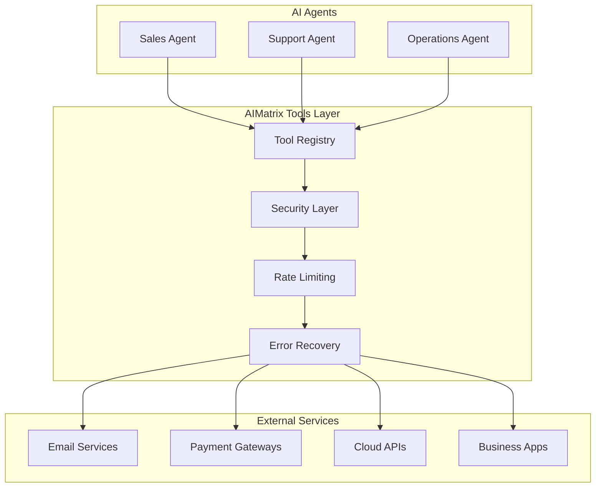

# AIMatrix Tools & Utilities

## Transform Any Service into AI-Ready Components

AIMatrix Tools & Utilities provide a comprehensive suite of pre-built integrations, tools, and utilities that enable AI agents to interact with virtually any service or system. Our tools act as intelligent bridges, transforming traditional APIs and services into AI-friendly interfaces that agents can understand and use autonomously.

## Tool Categories

<div style="display: grid; grid-template-columns: repeat(auto-fit, minmax(280px, 1fr)); gap: 20px; margin: 30px 0;">

<div style="border: 1px solid #00ff00; padding: 20px; border-radius: 8px;">
<h3>📧 Communication Tools</h3>
<p>Connect with customers and teams across all channels</p>
<ul style="list-style: none; padding: 0;">
  <li>→ <a href="/docs/tools-utilities/communication-tools/email/">Email (SMTP, IMAP, Exchange)</a></li>
  <li>→ <a href="/docs/tools-utilities/communication-tools/messaging/">SMS/MMS & Messaging</a></li>
  <li>→ <a href="/docs/tools-utilities/communication-tools/voice-video/">Voice & Video Calling</a></li>
  <li>→ <a href="/docs/tools-utilities/communication-tools/collaboration/">Team Collaboration</a></li>
</ul>
</div>

<div style="border: 1px solid #00ff00; padding: 20px; border-radius: 8px;">
<h3>🤖 Automation Tools</h3>
<p>Automate any task across web, desktop, and APIs</p>
<ul style="list-style: none; padding: 0;">
  <li>→ <a href="/docs/tools-utilities/automation-tools/browser/">Browser Automation</a></li>
  <li>→ <a href="/docs/tools-utilities/automation-tools/desktop/">Desktop Automation</a></li>
  <li>→ <a href="/docs/tools-utilities/automation-tools/api/">API Orchestration</a></li>
  <li>→ <a href="/docs/tools-utilities/automation-tools/workflow/">Workflow Automation</a></li>
</ul>
</div>

<div style="border: 1px solid #00ff00; padding: 20px; border-radius: 8px;">
<h3>💰 Financial Tools</h3>
<p>Handle payments, banking, and financial operations</p>
<ul style="list-style: none; padding: 0;">
  <li>→ <a href="/docs/tools-utilities/financial-tools/payments/">Payment Gateways</a></li>
  <li>→ <a href="/docs/tools-utilities/financial-tools/banking/">Banking APIs</a></li>
  <li>→ <a href="/docs/tools-utilities/financial-tools/crypto/">Cryptocurrency & Web3</a></li>
  <li>→ <a href="/docs/tools-utilities/financial-tools/tax/">Tax & Compliance</a></li>
</ul>
</div>

<div style="border: 1px solid #00ff00; padding: 20px; border-radius: 8px;">
<h3>☁️ Cloud & Infrastructure</h3>
<p>Manage cloud resources and infrastructure</p>
<ul style="list-style: none; padding: 0;">
  <li>→ <a href="/docs/tools-utilities/cloud-infrastructure/multi-cloud/">Multi-Cloud Management</a></li>
  <li>→ <a href="/docs/tools-utilities/cloud-infrastructure/containers/">Container Orchestration</a></li>
  <li>→ <a href="/docs/tools-utilities/cloud-infrastructure/serverless/">Serverless Functions</a></li>
  <li>→ <a href="/docs/tools-utilities/cloud-infrastructure/cost/">Cost Optimization</a></li>
</ul>
</div>

<div style="border: 1px solid #00ff00; padding: 20px; border-radius: 8px;">
<h3>📊 Data & Storage</h3>
<p>Access, process, and store data from any source</p>
<ul style="list-style: none; padding: 0;">
  <li>→ <a href="/docs/tools-utilities/data-storage/filesystems/">File Systems</a></li>
  <li>→ <a href="/docs/tools-utilities/data-storage/cloud-storage/">Cloud Storage</a></li>
  <li>→ <a href="/docs/tools-utilities/data-storage/databases/">Databases</a></li>
  <li>→ <a href="/docs/tools-utilities/data-storage/documents/">Document Management</a></li>
</ul>
</div>

<div style="border: 1px solid #00ff00; padding: 20px; border-radius: 8px;">
<h3>🔧 Development Tools</h3>
<p>Build, test, and deploy AI applications</p>
<ul style="list-style: none; padding: 0;">
  <li>→ <a href="/docs/developer/">SDK & Libraries</a></li>
  <li>→ <a href="/docs/developer/">Testing Frameworks</a></li>
  <li>→ <a href="/docs/developer/">Deployment Tools</a></li>
  <li>→ <a href="/docs/developer/">Monitoring & Analytics</a></li>
</ul>
</div>

</div>

## Key Features

### 🤖 AI-Native Design
Every tool is designed from the ground up to work with AI agents:
- **Natural Language APIs**: Describe what you want in plain English
- **Intelligent Error Recovery**: Agents can handle and recover from failures
- **Context Awareness**: Tools understand business context and user intent
- **Autonomous Operation**: Tools can operate without constant human oversight

### 🔌 Universal Connectivity
Connect to virtually any service or system:
- **500+ Pre-built Integrations**: Popular services ready out-of-the-box
- **Custom API Builder**: Transform any REST/GraphQL API in minutes
- **Legacy System Bridge**: Connect to old systems via RPA and screen scraping
- **Real-time Sync**: Bi-directional data synchronization

### 🛡️ Enterprise Security
Built for enterprise-grade security and compliance:
- **End-to-End Encryption**: All data encrypted in transit and at rest
- **Zero-Trust Architecture**: Never trust, always verify
- **Audit Logging**: Complete audit trail of all AI actions
- **Compliance Ready**: SOC2, GDPR, HIPAA, PCI-DSS compliant

### ⚡ High Performance
Optimized for speed and scale:
- **Sub-100ms Response**: Low-latency operations
- **Horizontal Scaling**: Auto-scale based on demand
- **Intelligent Caching**: Smart caching reduces API calls
- **Load Balancing**: Distribute load across multiple instances

## Quick Start Examples

### Email Automation
```python
from aimatrix.tools import EmailTool

# Initialize email tool
email = EmailTool(
    provider="gmail",
    credentials=gmail_credentials
)

# AI agent can now send emails naturally
agent.tell("Send a professional follow-up email to john@example.com about the meeting we had yesterday")
```

### Payment Processing
```python
from aimatrix.tools import PaymentTool

# Setup payment processing
payments = PaymentTool(
    provider="stripe",
    api_key=stripe_key
)

# Process payments with natural language
agent.tell("Process a $99.99 payment from the customer for the premium subscription")
```

### Browser Automation
```python
from aimatrix.tools import BrowserTool

# Initialize browser automation
browser = BrowserTool(headless=True)

# Automate complex web workflows
agent.tell("Go to our CRM, find all customers from last week, and export their data to a spreadsheet")
```

## Integration Patterns

### 1. Direct API Integration
For modern APIs with good documentation:
```python
@aimatrix.tool("Get weather data")
async def get_weather(location: str) -> dict:
    """Get current weather for a location"""
    response = await weather_api.get_current(location)
    return response.json()
```

### 2. Legacy System Bridge
For older systems without APIs:
```python
@aimatrix.tool("Update ERP inventory")
async def update_inventory(product_id: str, quantity: int):
    """Update inventory in legacy ERP system"""
    # Use RPA to navigate the old interface
    await rpa.navigate_to_inventory_screen()
    await rpa.enter_product_id(product_id)
    await rpa.update_quantity(quantity)
    await rpa.save_changes()
```

### 3. Multi-Step Workflows
For complex business processes:
```python
@aimatrix.workflow("Customer onboarding")
async def onboard_customer(customer_data: dict):
    """Complete customer onboarding process"""
    # Create customer in CRM
    customer = await crm.create_customer(customer_data)
    
    # Setup billing
    await billing.setup_customer(customer.id)
    
    # Send welcome email
    await email.send_welcome(customer.email)
    
    # Create support ticket
    await support.create_onboarding_ticket(customer.id)
```

## Supported Platforms

### Communication Platforms
- **Email**: Gmail, Outlook, Exchange, SMTP/IMAP
- **Messaging**: WhatsApp Business, Telegram, Signal
- **Team Chat**: Slack, Microsoft Teams, Discord
- **Voice/Video**: Zoom, Google Meet, WebRTC
- **SMS**: Twilio, Vonage, MessageBird

### Business Applications
- **CRM**: Salesforce, HubSpot, Pipedrive, Zoho
- **ERP**: SAP, Oracle, Microsoft Dynamics, NetSuite
- **Accounting**: QuickBooks, Xero, FreshBooks
- **E-commerce**: Shopify, WooCommerce, Magento
- **HR**: Workday, BambooHR, ADP

### Cloud Platforms
- **AWS**: EC2, S3, Lambda, RDS, and 200+ services
- **Google Cloud**: Compute, Storage, BigQuery, AI Platform
- **Microsoft Azure**: VMs, Storage, Functions, AI Services
- **Alibaba Cloud**: ECS, OSS, Function Compute

### Development Tools
- **Version Control**: GitHub, GitLab, Bitbucket
- **CI/CD**: Jenkins, GitHub Actions, Azure DevOps
- **Monitoring**: Datadog, New Relic, Prometheus
- **Databases**: PostgreSQL, MySQL, MongoDB, Redis

## Architecture Overview



## Best Practices

### Tool Selection
- **Choose the Right Tool**: Use specialized tools for better performance
- **Combine Tools**: Chain multiple tools for complex workflows
- **Cache Results**: Store frequently used data to reduce API calls
- **Handle Errors**: Always implement proper error handling

### Security Guidelines
- **Never Hardcode Credentials**: Use secure credential management
- **Principle of Least Privilege**: Grant minimum required permissions
- **Regular Audits**: Monitor and audit all tool usage
- **Secure Communication**: Always use HTTPS and encryption

### Performance Optimization
- **Async Operations**: Use async/await for better concurrency
- **Batch Operations**: Group similar operations together
- **Smart Retries**: Implement exponential backoff for failures
- **Monitor Usage**: Track performance and optimize bottlenecks

## Getting Started

### 1. Choose Your Tools
Browse our tool categories and select the integrations you need:
```bash
aimatrix tools list --category communication
aimatrix tools install email-tool smtp-tool
```

### 2. Configure Credentials
Set up secure access to external services:
```python
from aimatrix.config import CredentialManager

creds = CredentialManager()
creds.add("gmail", {
    "client_id": "your-client-id",
    "client_secret": "your-client-secret",
    "refresh_token": "your-refresh-token"
})
```

### 3. Create Your First Tool-Enabled Agent
```python
from aimatrix import Agent
from aimatrix.tools import EmailTool, CRMTool

agent = Agent(
    name="customer-service",
    tools=[
        EmailTool(),
        CRMTool(provider="salesforce")
    ],
    instructions="""
    You are a customer service agent. When customers email:
    1. Look up their information in the CRM
    2. Provide helpful responses
    3. Update their record with the interaction
    """
)
```

### 4. Deploy and Monitor
```python
# Deploy your agent
agent.deploy(environment="production")

# Monitor performance
agent.monitor(metrics=["response_time", "success_rate", "customer_satisfaction"])
```

## Tool Development

### Creating Custom Tools
Build your own tools for proprietary systems:

```python
from aimatrix.tools import BaseTool
from pydantic import BaseModel

class CustomCRMTool(BaseTool):
    name = "custom_crm"
    description = "Interact with our custom CRM system"
    
    @tool_function
    async def get_customer(self, email: str) -> dict:
        """Get customer information by email"""
        response = await self.api_client.get(f"/customers?email={email}")
        return response.json()
    
    @tool_function
    async def create_ticket(self, customer_id: str, issue: str) -> dict:
        """Create a support ticket"""
        ticket_data = {
            "customer_id": customer_id,
            "issue": issue,
            "status": "open"
        }
        response = await self.api_client.post("/tickets", json=ticket_data)
        return response.json()
```

### Publishing to Marketplace
Share your tools with the community:
```bash
aimatrix tools publish custom-crm-tool --public
```

## Support & Resources

### Documentation
- [Tool API Reference](/docs/api/tools/)
- [Integration Guides](/docs/guides/)
- [Best Practices](/docs/best-practices/)
- [Troubleshooting](/docs/troubleshooting/)

### Community
- [Tool Marketplace](https://marketplace.aimatrix.com)
- [Developer Forum](https://forum.aimatrix.com)
- [Discord Community](https://discord.gg/aimatrix)
- [GitHub Repository](https://github.com/aimatrix/tools)

### Enterprise Support
- Priority technical support
- Custom tool development
- Enterprise integrations
- Training and consultation

Contact: [enterprise@aimatrix.com](mailto:enterprise@aimatrix.com)

---

> [!TIP]
> **Pro Tip**: Start with our pre-built tools and gradually add custom integrations as your needs grow. Our tools are designed to work together seamlessly.

> [!NOTE]
> **Getting Help**: If you can't find a tool for your specific needs, reach out to our community or enterprise support team. We're always adding new integrations based on user feedback.