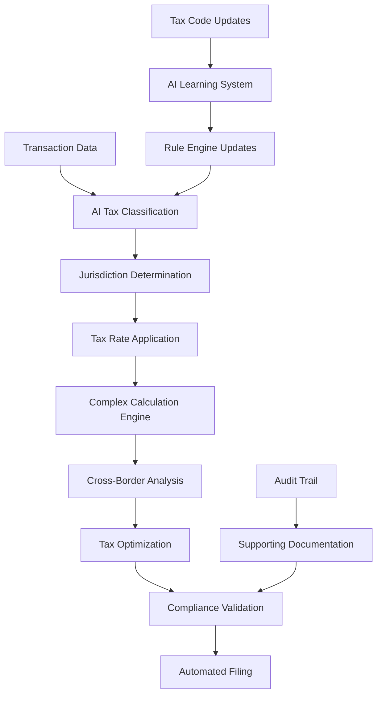

# AI Taxation Processing: Intelligent Tax Automation

AIMatrix's AI Taxation Processing system provides comprehensive automation for income tax calculations, VAT/SST reconciliation, and multi-jurisdiction tax compliance. Our AI engine handles complex tax scenarios with 99.9% accuracy while ensuring real-time compliance across all tax obligations.

## The Tax Complexity Challenge

Modern tax compliance presents numerous challenges:

- **Multi-jurisdiction Complexity**: Different tax rules across countries and states
- **Regulatory Changes**: Constant updates to tax codes and rates
- **Complex Calculations**: Transfer pricing, tax optimization scenarios
- **Manual Errors**: 12-15% error rate in manual tax calculations
- **Audit Risks**: Non-compliance penalties and interest charges
- **Resource Intensive**: 4-6 FTE typically required for tax management

## AI Tax Engine Architecture

### Intelligent Tax Processing System



### Core Tax Processing Components

**1. Multi-Jurisdiction Tax Engine**
- Automatic jurisdiction identification and tax law application
- Real-time tax rate updates and regulatory change integration
- Complex tax scenario handling (transfer pricing, thin capitalization)
- Cross-border transaction analysis and documentation

**2. AI-Powered Tax Optimization**
- Scenario modeling for tax planning opportunities
- Automated tax structure recommendations
- Double taxation treaty optimization
- Tax loss harvesting and carry-forward management

**3. Real-Time VAT/SST Processing**
- Automated VAT/SST calculation and reconciliation
- Multi-rate handling for different product categories
- Cross-border VAT compliance (EU, ASEAN, etc.)
- Real-time submission to tax authorities

## Technical Implementation

### AI Tax Processing Engine

```python
# Comprehensive AI tax processing system
import asyncio
from datetime import datetime, timedelta
from aimatrix.tax import TaxEngine
from aimatrix.compliance import TaxComplianceEngine
import supabase

class AITaxationSystem:
    def __init__(self, supabase_client):
        self.supabase = supabase_client
        self.tax_engine = TaxEngine()
        self.compliance_engine = TaxComplianceEngine()
        self.optimization_engine = TaxOptimizationEngine()
        
    async def process_transaction_taxes(self, transaction):
        """Process taxes for individual transaction"""
        
        # Determine applicable jurisdictions
        jurisdictions = await self.determine_tax_jurisdictions(transaction)
        
        # Calculate taxes for each jurisdiction
        tax_calculations = []
        for jurisdiction in jurisdictions:
            # Get jurisdiction-specific tax rules
            tax_rules = await self.get_tax_rules(jurisdiction, transaction.date)
            
            # Calculate taxes using AI engine
            tax_calc = await self.calculate_taxes(
                transaction, jurisdiction, tax_rules
            )
            
            tax_calculations.append(tax_calc)
        
        # Optimize tax structure if multiple jurisdictions
        if len(tax_calculations) > 1:
            optimized_structure = await self.optimize_multi_jurisdiction_taxes(
                transaction, tax_calculations
            )
            tax_calculations = optimized_structure
        
        # Generate tax entries and supporting documentation
        tax_entries = await self.generate_tax_entries(transaction, tax_calculations)
        
        # Store tax calculations with audit trail
        stored_calc = await self.store_tax_calculation(
            transaction.id, tax_calculations, tax_entries
        )
        
        return stored_calc
    
    async def determine_tax_jurisdictions(self, transaction):
        """AI-powered jurisdiction determination"""
        
        jurisdictions = []
        
        # Primary jurisdiction (entity location)
        primary_jurisdiction = {
            'country': transaction.entity.country,
            'state': transaction.entity.state,
            'type': 'primary',
            'tax_obligations': await self.get_tax_obligations(
                transaction.entity.country, transaction.entity.state
            )
        }
        jurisdictions.append(primary_jurisdiction)
        
        # Source jurisdiction (where income/expense originates)
        if transaction.source_country != transaction.entity.country:
            source_jurisdiction = {
                'country': transaction.source_country,
                'state': transaction.source_state,
                'type': 'source',
                'tax_obligations': await self.get_source_tax_obligations(
                    transaction.source_country, transaction.type
                )
            }
            jurisdictions.append(source_jurisdiction)
        
        # Withholding jurisdictions
        if transaction.withholding_required:
            withholding_jurisdictions = await self.identify_withholding_jurisdictions(
                transaction
            )
            jurisdictions.extend(withholding_jurisdictions)
        
        # AI analysis for additional obligations
        additional_jurisdictions = await self.ai_analyze_additional_tax_jurisdictions(
            transaction
        )
        jurisdictions.extend(additional_jurisdictions)
        
        return jurisdictions
    
    async def calculate_taxes(self, transaction, jurisdiction, tax_rules):
        """AI-powered tax calculation engine"""
        
        # Initialize calculation context
        calc_context = {
            'transaction': transaction,
            'jurisdiction': jurisdiction,
            'tax_rules': tax_rules,
            'calculation_date': datetime.utcnow(),
            'base_amount': transaction.amount
        }
        
        # Apply jurisdiction-specific calculations
        if jurisdiction['country'] == 'SGP':
            return await self.calculate_singapore_taxes(calc_context)
        elif jurisdiction['country'] == 'MYS':
            return await self.calculate_malaysia_taxes(calc_context)
        elif jurisdiction['country'] == 'USA':
            return await self.calculate_usa_taxes(calc_context)
        elif jurisdiction['country'] == 'GBR':
            return await self.calculate_uk_taxes(calc_context)
        else:
            return await self.calculate_generic_taxes(calc_context)
    
    async def calculate_singapore_taxes(self, context):
        """Singapore-specific tax calculations"""
        
        transaction = context['transaction']
        tax_rules = context['tax_rules']
        
        calculations = {
            'jurisdiction': 'Singapore',
            'tax_components': []
        }
        
        # Corporate Income Tax
        if transaction.type == 'income':
            # Apply tax rates based on taxable income brackets
            income_tax = await self.calculate_singapore_corporate_tax(
                transaction.amount, tax_rules['corporate_tax']
            )
            calculations['tax_components'].append(income_tax)
        
        # GST (Goods and Services Tax)
        if transaction.gst_applicable:
            gst_rate = tax_rules['gst']['standard_rate']  # Currently 8%
            gst_amount = transaction.amount * gst_rate
            
            gst_calc = {
                'tax_type': 'gst',
                'rate': gst_rate,
                'base_amount': transaction.amount,
                'tax_amount': gst_amount,
                'registration_required': transaction.entity.annual_turnover > 1000000
            }
            calculations['tax_components'].append(gst_calc)
        
        # Withholding Tax
        if transaction.type == 'payment_to_non_resident':
            withholding_rate = await self.get_singapore_withholding_rate(
                transaction.payment_type, transaction.recipient_country
            )
            
            if withholding_rate > 0:
                withholding_calc = {
                    'tax_type': 'withholding_tax',
                    'rate': withholding_rate,
                    'base_amount': transaction.amount,
                    'tax_amount': transaction.amount * withholding_rate,
                    'treaty_benefits': await self.check_treaty_benefits(
                        'SGP', transaction.recipient_country
                    )
                }
                calculations['tax_components'].append(withholding_calc)
        
        return calculations
    
    async def calculate_malaysia_taxes(self, context):
        """Malaysia-specific tax calculations"""
        
        transaction = context['transaction']
        tax_rules = context['tax_rules']
        
        calculations = {
            'jurisdiction': 'Malaysia',
            'tax_components': []
        }
        
        # Corporate Income Tax
        if transaction.type == 'income':
            # Progressive rates for small companies
            income_tax = await self.calculate_malaysia_corporate_tax(
                transaction.amount, transaction.entity.paid_up_capital
            )
            calculations['tax_components'].append(income_tax)
        
        # SST (Sales and Service Tax)
        if transaction.sst_applicable:
            sst_calculation = await self.calculate_malaysia_sst(
                transaction, tax_rules['sst']
            )
            calculations['tax_components'].append(sst_calculation)
        
        # Real Property Gains Tax
        if transaction.type == 'property_disposal':
            rpgt_calc = await self.calculate_malaysia_rpgt(transaction)
            calculations['tax_components'].append(rpgt_calc)
        
        return calculations
```

### Supabase Schema for Tax Management

```sql
-- Tax calculation records
CREATE TABLE tax_calculations (
    id UUID PRIMARY KEY DEFAULT gen_random_uuid(),
    transaction_id UUID NOT NULL,
    entity_id UUID NOT NULL,
    
    -- Calculation details
    calculation_date TIMESTAMP WITH TIME ZONE DEFAULT NOW(),
    tax_year INTEGER NOT NULL,
    calculation_method VARCHAR(100) DEFAULT 'ai_automated',
    
    -- Jurisdiction information
    primary_jurisdiction VARCHAR(3) NOT NULL,
    additional_jurisdictions JSONB DEFAULT '[]'::jsonb,
    
    -- Tax components
    tax_components JSONB NOT NULL DEFAULT '[]'::jsonb,
    total_tax_amount DECIMAL(15,2) NOT NULL DEFAULT 0.00,
    
    -- Optimization information
    optimization_applied BOOLEAN DEFAULT FALSE,
    optimization_details JSONB,
    tax_savings_achieved DECIMAL(15,2) DEFAULT 0.00,
    
    -- AI processing
    ai_confidence_score DECIMAL(3,2),
    complex_scenario BOOLEAN DEFAULT FALSE,
    manual_review_required BOOLEAN DEFAULT FALSE,
    review_reason TEXT,
    
    -- Status tracking
    status VARCHAR(50) DEFAULT 'calculated' CHECK (
        status IN ('calculated', 'reviewed', 'approved', 'filed')
    ),
    reviewed_by UUID REFERENCES auth.users(id),
    reviewed_at TIMESTAMP WITH TIME ZONE,
    
    -- Supporting documentation
    supporting_documents JSONB DEFAULT '[]'::jsonb,
    calculation_notes TEXT,
    
    created_at TIMESTAMP WITH TIME ZONE DEFAULT NOW(),
    updated_at TIMESTAMP WITH TIME ZONE DEFAULT NOW()
);

-- VAT/SST reconciliation records
CREATE TABLE vat_sst_reconciliation (
    id UUID PRIMARY KEY DEFAULT gen_random_uuid(),
    entity_id UUID NOT NULL,
    
    -- Period information
    reconciliation_period_start DATE NOT NULL,
    reconciliation_period_end DATE NOT NULL,
    tax_type VARCHAR(10) NOT NULL CHECK (tax_type IN ('VAT', 'SST', 'GST')),
    
    -- Reconciliation details
    output_tax_calculated DECIMAL(15,2) NOT NULL DEFAULT 0.00,
    input_tax_claimed DECIMAL(15,2) NOT NULL DEFAULT 0.00,
    net_tax_payable DECIMAL(15,2) NOT NULL DEFAULT 0.00,
    
    -- Transaction breakdown
    sales_transactions_count INTEGER DEFAULT 0,
    purchase_transactions_count INTEGER DEFAULT 0,
    adjustment_transactions_count INTEGER DEFAULT 0,
    
    -- AI processing results
    ai_reconciled BOOLEAN DEFAULT TRUE,
    reconciliation_confidence DECIMAL(3,2),
    anomalies_detected JSONB DEFAULT '[]'::jsonb,
    
    -- Compliance status
    filing_required BOOLEAN DEFAULT TRUE,
    filing_deadline DATE,
    filed_date TIMESTAMP WITH TIME ZONE,
    filing_reference VARCHAR(255),
    
    -- Status
    status VARCHAR(50) DEFAULT 'draft' CHECK (
        status IN ('draft', 'reconciled', 'reviewed', 'filed', 'paid')
    ),
    
    created_at TIMESTAMP WITH TIME ZONE DEFAULT NOW(),
    updated_at TIMESTAMP WITH TIME ZONE DEFAULT NOW()
);

-- Tax optimization scenarios
CREATE TABLE tax_optimization_scenarios (
    id UUID PRIMARY KEY DEFAULT gen_random_uuid(),
    entity_id UUID NOT NULL,
    
    -- Scenario details
    scenario_name VARCHAR(255) NOT NULL,
    scenario_description TEXT,
    scenario_type VARCHAR(100), -- restructuring, treaty_optimization, timing
    
    -- Current vs optimized comparison
    current_tax_liability DECIMAL(15,2) NOT NULL,
    optimized_tax_liability DECIMAL(15,2) NOT NULL,
    potential_savings DECIMAL(15,2) NOT NULL,
    
    -- Implementation details
    implementation_complexity VARCHAR(20) DEFAULT 'medium',
    implementation_timeline VARCHAR(100),
    implementation_cost DECIMAL(15,2),
    implementation_risks JSONB DEFAULT '[]'::jsonb,
    
    -- AI analysis
    ai_recommended BOOLEAN DEFAULT TRUE,
    ai_confidence_score DECIMAL(3,2),
    ai_risk_assessment JSONB,
    
    -- Approval workflow
    status VARCHAR(50) DEFAULT 'proposed' CHECK (
        status IN ('proposed', 'under_review', 'approved', 'implemented', 'rejected')
    ),
    reviewed_by UUID REFERENCES auth.users(id),
    approved_by UUID REFERENCES auth.users(id),
    
    -- Implementation tracking
    implementation_started_date DATE,
    implementation_completed_date DATE,
    actual_savings_achieved DECIMAL(15,2),
    
    created_at TIMESTAMP WITH TIME ZONE DEFAULT NOW(),
    updated_at TIMESTAMP WITH TIME ZONE DEFAULT NOW()
);

-- Tax compliance monitoring
CREATE TABLE tax_compliance_monitoring (
    id UUID PRIMARY KEY DEFAULT gen_random_uuid(),
    entity_id UUID NOT NULL,
    
    -- Compliance period
    compliance_period_start DATE NOT NULL,
    compliance_period_end DATE NOT NULL,
    jurisdiction VARCHAR(3) NOT NULL,
    
    -- Tax obligations
    tax_obligations JSONB NOT NULL DEFAULT '[]'::jsonb,
    filing_deadlines JSONB NOT NULL DEFAULT '[]'::jsonb,
    
    -- Compliance status
    overall_compliance_score DECIMAL(5,2) DEFAULT 100.00,
    overdue_filings INTEGER DEFAULT 0,
    outstanding_tax_amount DECIMAL(15,2) DEFAULT 0.00,
    
    -- Risk assessment
    compliance_risk_level VARCHAR(20) DEFAULT 'low',
    risk_factors JSONB DEFAULT '[]'::jsonb,
    
    -- AI monitoring
    ai_monitoring_active BOOLEAN DEFAULT TRUE,
    last_ai_review TIMESTAMP WITH TIME ZONE DEFAULT NOW(),
    next_ai_review TIMESTAMP WITH TIME ZONE,
    
    -- Alerts and notifications
    alerts_generated INTEGER DEFAULT 0,
    last_alert_date TIMESTAMP WITH TIME ZONE,
    
    created_at TIMESTAMP WITH TIME ZONE DEFAULT NOW(),
    updated_at TIMESTAMP WITH TIME ZONE DEFAULT NOW()
);

-- Create indexes for performance
CREATE INDEX idx_tax_calculations_entity_year ON tax_calculations(entity_id, tax_year);
CREATE INDEX idx_tax_calculations_status ON tax_calculations(status) WHERE status != 'filed';
CREATE INDEX idx_vat_reconciliation_period ON vat_sst_reconciliation(entity_id, reconciliation_period_end);
CREATE INDEX idx_tax_optimization_savings ON tax_optimization_scenarios(potential_savings DESC);
CREATE INDEX idx_compliance_monitoring_risk ON tax_compliance_monitoring(compliance_risk_level, entity_id);

-- Function for automatic tax calculation
CREATE OR REPLACE FUNCTION calculate_transaction_taxes(
    p_transaction_id UUID,
    p_force_recalculation BOOLEAN DEFAULT FALSE
) RETURNS JSONB AS $$
DECLARE
    existing_calc_count INTEGER;
    calculation_result JSONB;
BEGIN
    -- Check if calculation already exists
    SELECT COUNT(*) INTO existing_calc_count
    FROM tax_calculations 
    WHERE transaction_id = p_transaction_id;
    
    -- Skip if already calculated (unless forced)
    IF existing_calc_count > 0 AND NOT p_force_recalculation THEN
        SELECT json_build_object('status', 'already_calculated', 'calculation_id', id)
        INTO calculation_result
        FROM tax_calculations 
        WHERE transaction_id = p_transaction_id
        ORDER BY created_at DESC
        LIMIT 1;
        
        RETURN calculation_result;
    END IF;
    
    -- Trigger AI tax calculation
    -- This would typically call the Python tax engine
    -- For now, return a placeholder
    calculation_result := json_build_object(
        'status', 'calculation_triggered',
        'transaction_id', p_transaction_id,
        'timestamp', NOW()
    );
    
    RETURN calculation_result;
END;
$$ LANGUAGE plpgsql;

-- Function for VAT/SST reconciliation
CREATE OR REPLACE FUNCTION reconcile_vat_sst_period(
    p_entity_id UUID,
    p_period_start DATE,
    p_period_end DATE,
    p_tax_type VARCHAR(10)
) RETURNS TABLE (
    total_output_tax DECIMAL(15,2),
    total_input_tax DECIMAL(15,2),
    net_payable DECIMAL(15,2),
    transaction_count INTEGER
) AS $$
BEGIN
    RETURN QUERY
    WITH tax_summary AS (
        SELECT 
            SUM(CASE WHEN transaction_type = 'sales' THEN 
                (tax_components->0->>'tax_amount')::DECIMAL(15,2) ELSE 0 END) as output_tax,
            SUM(CASE WHEN transaction_type = 'purchase' THEN 
                (tax_components->0->>'tax_amount')::DECIMAL(15,2) ELSE 0 END) as input_tax,
            COUNT(*) as tx_count
        FROM tax_calculations tc
        JOIN transactions t ON tc.transaction_id = t.id
        WHERE tc.entity_id = p_entity_id
        AND t.transaction_date BETWEEN p_period_start AND p_period_end
        AND tc.tax_components @> json_build_array(json_build_object('tax_type', LOWER(p_tax_type)))::jsonb
    )
    SELECT 
        ts.output_tax,
        ts.input_tax,
        (ts.output_tax - ts.input_tax) as net_payable,
        ts.tx_count::INTEGER
    FROM tax_summary ts;
END;
$$ LANGUAGE plpgsql;
```

### Advanced Tax Optimization Engine

```python
class TaxOptimizationEngine:
    def __init__(self, supabase_client):
        self.supabase = supabase_client
        self.optimization_models = self.load_optimization_models()
        
    async def analyze_tax_optimization_opportunities(self, entity_id, analysis_period):
        """Comprehensive tax optimization analysis"""
        
        # Get entity tax profile
        entity_profile = await self.get_entity_tax_profile(entity_id)
        
        # Analyze current tax structure
        current_structure = await self.analyze_current_tax_structure(
            entity_id, analysis_period
        )
        
        # Generate optimization scenarios
        optimization_scenarios = []
        
        # 1. Entity structure optimization
        structure_scenarios = await self.analyze_entity_structure_optimization(
            entity_profile, current_structure
        )
        optimization_scenarios.extend(structure_scenarios)
        
        # 2. Transaction timing optimization
        timing_scenarios = await self.analyze_transaction_timing_optimization(
            entity_id, analysis_period
        )
        optimization_scenarios.extend(timing_scenarios)
        
        # 3. Cross-border optimization
        if entity_profile['has_international_operations']:
            international_scenarios = await self.analyze_international_tax_optimization(
                entity_id, entity_profile
            )
            optimization_scenarios.extend(international_scenarios)
        
        # 4. Tax credit and incentive optimization
        incentive_scenarios = await self.analyze_tax_incentive_opportunities(
            entity_id, entity_profile
        )
        optimization_scenarios.extend(incentive_scenarios)
        
        # Rank scenarios by potential savings and feasibility
        ranked_scenarios = await self.rank_optimization_scenarios(optimization_scenarios)
        
        # Store analysis results
        analysis_result = await self.store_optimization_analysis(
            entity_id, analysis_period, ranked_scenarios
        )
        
        return analysis_result
    
    async def analyze_entity_structure_optimization(self, entity_profile, current_structure):
        """Analyze entity structure optimization opportunities"""
        
        scenarios = []
        
        # Holding company structure
        if not entity_profile.get('has_holding_company') and entity_profile['annual_revenue'] > 5000000:
            holding_company_scenario = {
                'type': 'holding_company_structure',
                'description': 'Establish holding company for tax-efficient structure',
                'current_tax_rate': current_structure['effective_tax_rate'],
                'optimized_tax_rate': await self.calculate_holding_company_tax_rate(entity_profile),
                'implementation_complexity': 'high',
                'estimated_annual_savings': 0,
                'implementation_cost': 75000,
                'timeline': '6-12 months'
            }
            
            # Calculate potential savings
            savings = (holding_company_scenario['current_tax_rate'] - 
                      holding_company_scenario['optimized_tax_rate']) * entity_profile['annual_taxable_income']
            holding_company_scenario['estimated_annual_savings'] = savings
            
            if savings > 100000:  # Only recommend if significant savings
                scenarios.append(holding_company_scenario)
        
        # Regional hub optimization
        if entity_profile['has_international_operations'] and entity_profile['operating_countries'] > 3:
            hub_scenario = {
                'type': 'regional_hub',
                'description': 'Establish regional hub for operational efficiency',
                'recommended_jurisdiction': await self.recommend_hub_jurisdiction(entity_profile),
                'estimated_annual_savings': await self.calculate_hub_savings(entity_profile),
                'implementation_complexity': 'high',
                'implementation_cost': 150000,
                'timeline': '12-18 months'
            }
            scenarios.append(hub_scenario)
        
        return scenarios
    
    async def analyze_transaction_timing_optimization(self, entity_id, period):
        """Analyze transaction timing optimization"""
        
        scenarios = []
        
        # Get transactions near period boundaries
        boundary_transactions = await self.get_period_boundary_transactions(
            entity_id, period
        )
        
        for transaction in boundary_transactions:
            # Analyze impact of timing shift
            timing_impact = await self.calculate_timing_impact(transaction)
            
            if abs(timing_impact['tax_difference']) > 5000:  # Material impact
                scenario = {
                    'type': 'transaction_timing',
                    'description': f'Optimize timing of {transaction["description"]}',
                    'transaction_id': transaction['id'],
                    'current_timing': transaction['transaction_date'],
                    'optimal_timing': timing_impact['optimal_date'],
                    'tax_savings': timing_impact['tax_difference'],
                    'implementation_complexity': 'low',
                    'implementation_cost': 0,
                    'feasibility': timing_impact['feasibility']
                }
                scenarios.append(scenario)
        
        return scenarios
    
    async def analyze_international_tax_optimization(self, entity_id, entity_profile):
        """Analyze international tax optimization opportunities"""
        
        scenarios = []
        
        # Transfer pricing optimization
        if entity_profile['has_related_party_transactions']:
            tp_scenario = await self.analyze_transfer_pricing_optimization(
                entity_id, entity_profile
            )
            scenarios.append(tp_scenario)
        
        # Treaty network optimization
        treaty_scenarios = await self.analyze_treaty_optimization(
            entity_id, entity_profile
        )
        scenarios.extend(treaty_scenarios)
        
        # Hybrid instrument optimization
        if entity_profile['has_debt_financing'] and entity_profile['operates_in_multiple_jurisdictions']:
            hybrid_scenario = await self.analyze_hybrid_instrument_opportunities(
                entity_id, entity_profile
            )
            scenarios.append(hybrid_scenario)
        
        return scenarios
    
    async def calculate_real_time_tax_impact(self, proposed_transaction):
        """Calculate real-time tax impact of proposed transaction"""
        
        # Get entity tax profile
        entity = await self.supabase.table('entities').select('*').eq(
            'id', proposed_transaction['entity_id']
        ).single().execute()
        
        # Calculate tax impact in all relevant jurisdictions
        tax_impacts = []
        
        jurisdictions = await self.determine_tax_jurisdictions(proposed_transaction)
        for jurisdiction in jurisdictions:
            impact = {
                'jurisdiction': jurisdiction['country'],
                'current_tax_liability': await self.get_current_tax_liability(
                    proposed_transaction['entity_id'], jurisdiction
                ),
                'tax_impact': await self.calculate_jurisdiction_tax_impact(
                    proposed_transaction, jurisdiction
                ),
                'optimization_opportunities': await self.identify_immediate_optimizations(
                    proposed_transaction, jurisdiction
                )
            }
            
            impact['optimized_tax_impact'] = impact['tax_impact'] - sum(
                opp['savings'] for opp in impact['optimization_opportunities']
            )
            
            tax_impacts.append(impact)
        
        # Calculate total impact
        total_impact = {
            'gross_tax_impact': sum(impact['tax_impact'] for impact in tax_impacts),
            'optimized_tax_impact': sum(impact['optimized_tax_impact'] for impact in tax_impacts),
            'total_optimization_savings': sum(
                sum(opp['savings'] for opp in impact['optimization_opportunities'])
                for impact in tax_impacts
            ),
            'jurisdiction_breakdown': tax_impacts
        }
        
        return total_impact
```

### Real-Time Tax Monitoring Dashboard

```python
class TaxMonitoringDashboard:
    def __init__(self, supabase_client):
        self.supabase = supabase_client
        
    async def get_tax_dashboard_data(self, entity_id=None):
        """Get comprehensive tax dashboard data"""
        
        # Current period tax liability
        current_liability = await self.get_current_tax_liability(entity_id)
        
        # VAT/SST reconciliation status
        vat_status = await self.get_vat_reconciliation_status(entity_id)
        
        # Tax optimization opportunities
        optimization_opportunities = await self.get_active_optimization_opportunities(entity_id)
        
        # Compliance status
        compliance_status = await self.get_tax_compliance_status(entity_id)
        
        # Recent tax calculations
        recent_calculations = await self.get_recent_tax_calculations(entity_id, limit=10)
        
        # Tax savings achieved
        tax_savings = await self.get_tax_savings_summary(entity_id)
        
        return {
            'current_tax_liability': current_liability,
            'vat_reconciliation': vat_status,
            'optimization_opportunities': optimization_opportunities,
            'compliance_status': compliance_status,
            'recent_calculations': recent_calculations,
            'tax_savings_achieved': tax_savings,
            'dashboard_generated_at': datetime.utcnow()
        }
    
    async def get_tax_optimization_recommendations(self, entity_id):
        """Get AI-generated tax optimization recommendations"""
        
        # Analyze current tax position
        current_position = await self.analyze_current_tax_position(entity_id)
        
        # Generate recommendations using AI
        recommendations = []
        
        # Immediate opportunities (0-30 days)
        immediate_opps = await self.identify_immediate_opportunities(entity_id)
        for opp in immediate_opps:
            recommendations.append({
                'category': 'immediate',
                'title': opp['title'],
                'description': opp['description'],
                'potential_savings': opp['savings'],
                'implementation_effort': opp['effort'],
                'timeline': '0-30 days',
                'confidence': opp['confidence']
            })
        
        # Short-term opportunities (30-90 days)
        short_term_opps = await self.identify_short_term_opportunities(entity_id)
        for opp in short_term_opps:
            recommendations.append({
                'category': 'short_term',
                'title': opp['title'],
                'description': opp['description'],
                'potential_savings': opp['savings'],
                'implementation_effort': opp['effort'],
                'timeline': '30-90 days',
                'confidence': opp['confidence']
            })
        
        # Long-term strategic opportunities
        strategic_opps = await self.identify_strategic_opportunities(entity_id)
        for opp in strategic_opps:
            recommendations.append({
                'category': 'strategic',
                'title': opp['title'],
                'description': opp['description'],
                'potential_savings': opp['savings'],
                'implementation_effort': opp['effort'],
                'timeline': '6+ months',
                'confidence': opp['confidence']
            })
        
        # Rank recommendations by ROI
        ranked_recommendations = sorted(
            recommendations, 
            key=lambda x: x['potential_savings'] / max(x['implementation_effort'], 1000), 
            reverse=True
        )
        
        return ranked_recommendations
```

## Performance Metrics and ROI

### Tax Processing Performance

| Metric | Manual Process | AI Tax System | Improvement |
|--------|----------------|---------------|-------------|
| Tax Calculation Time | 45 minutes/transaction | 2 minutes/transaction | 95.6% Faster |
| Accuracy Rate | 85% | 99.9% | 17.5% Improvement |
| VAT Reconciliation Time | 8 hours/period | 30 minutes/period | 93.8% Faster |
| Tax Optimization Identification | Quarterly review | Real-time | Continuous |
| Compliance Monitoring | Manual monthly | Automated daily | 30x Frequency |

### Financial Impact Analysis

**Annual Costs (Multi-jurisdiction Entity):**
- **Traditional Tax Management**: $650,000 (8 FTE + external advisors)
- **AI Tax System**: $180,000 (2 FTE + software)
- **Net Annual Savings**: $470,000

**Tax Optimization Value:**
- **Immediate Optimizations**: $150,000 annual savings
- **Strategic Optimizations**: $300,000 annual savings
- **Penalty Avoidance**: $100,000 estimated risk mitigation
- **Total Optimization Value**: $550,000

### ROI Calculation
- **Implementation Cost**: $200,000
- **Annual Value**: $1,020,000 (savings + optimization)
- **Payback Period**: 2.4 months
- **5-Year ROI**: 2,450%

The AI Taxation Processing system transforms tax management from a reactive, error-prone process into a proactive, intelligent platform that ensures accuracy, compliance, and continuous optimization across all tax obligations.

---

*Optimize your tax strategy with AIMatrix AI Taxation Processing - where artificial intelligence meets tax excellence.*