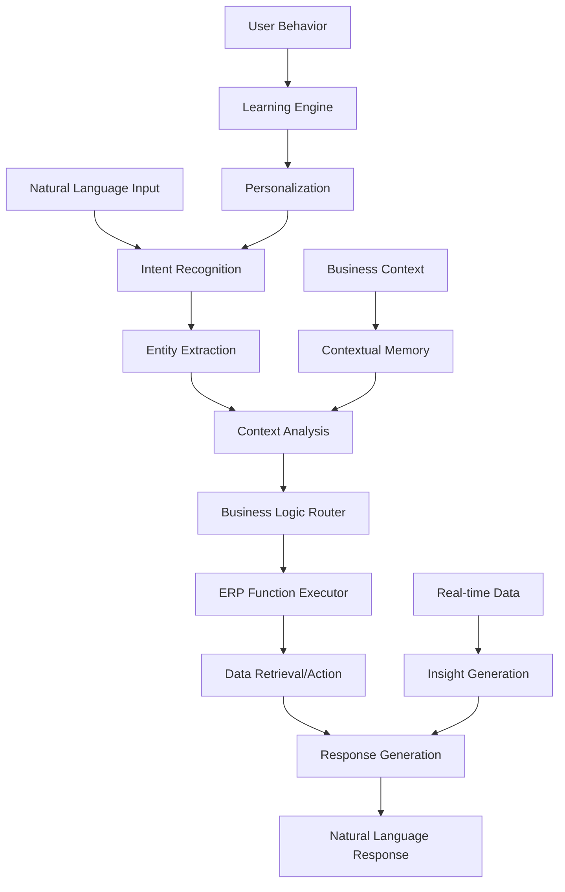

# ERP Copilot: Your AI Business Operations Assistant

AIMatrix ERP Copilot revolutionizes business management by providing a conversational interface that allows users to control all ERP functions through natural language. This intelligent assistant guides users through complex business processes, provides real-time insights, and automates routine operations while learning from each interaction to improve performance.

## The Business Operations Challenge

Traditional ERP systems present significant usability challenges:

- **Complexity Barriers**: Steep learning curves requiring extensive training
- **Interface Friction**: Multiple screens and complex navigation paths
- **Knowledge Gaps**: Users struggle to find relevant functions and data
- **Process Inefficiencies**: Manual navigation through multi-step workflows
- **Decision Delays**: Difficulty accessing real-time business insights
- **Training Overhead**: Continuous training required for new users and features

## AI Copilot Architecture

### Conversational Business Intelligence Engine



### Core Copilot Capabilities

**1. Natural Language ERP Control**
- **Voice and Text Commands**: Control all ERP functions through conversation
- **Complex Query Processing**: Handle multi-step business requests
- **Context Understanding**: Maintain conversation context across interactions
- **Ambiguity Resolution**: Ask clarifying questions when needed

**2. Intelligent Process Guidance**
- **Workflow Assistance**: Step-by-step guidance through business processes
- **Best Practice Recommendations**: Suggest optimal approaches based on context
- **Error Prevention**: Proactive warnings about potential mistakes
- **Learning Reinforcement**: Adaptive guidance based on user competency

**3. Real-Time Business Insights**
- **Proactive Analytics**: Surface relevant insights before they're requested
- **Trend Analysis**: Identify patterns and anomalies in business data
- **Predictive Suggestions**: Recommend actions based on data trends
- **Executive Dashboards**: Generate real-time reports and visualizations

## Technical Implementation

### Conversational ERP Framework

```python
# Advanced ERP Copilot system
import asyncio
from datetime import datetime, timedelta
from aimatrix.copilot import ERPCopilot
from aimatrix.nlp import ConversationalNLP
from aimatrix.erp import ERPIntegration
import supabase

class ERPCopilotSystem:
    def __init__(self, supabase_client):
        self.supabase = supabase_client
        self.copilot = ERPCopilot()
        self.nlp_engine = ConversationalNLP()
        self.erp_integration = ERPIntegration()
        self.context_manager = ConversationContextManager()
        
    async def process_user_request(self, user_input, user_context):
        """Process natural language business request"""
        
        # Get conversation context
        conversation_context = await self.context_manager.get_context(
            user_context.user_id, user_context.session_id
        )
        
        # Analyze user intent and extract business entities
        intent_analysis = await self.nlp_engine.analyze_business_intent(
            user_input, conversation_context, user_context
        )
        
        # Route to appropriate business function
        response = await self.route_business_request(
            intent_analysis, user_context, conversation_context
        )
        
        # Update conversation context
        await self.context_manager.update_context(
            user_context.session_id, intent_analysis, response
        )
        
        # Learn from interaction for future improvements
        await self.learn_from_interaction(
            user_input, intent_analysis, response, user_context
        )
        
        return response
    
    async def route_business_request(self, intent_analysis, user_context, conversation_context):
        """Route request to appropriate business function handler"""
        
        intent = intent_analysis.primary_intent
        entities = intent_analysis.entities
        
        if intent == 'financial_inquiry':
            return await self.handle_financial_inquiry(entities, user_context)
        elif intent == 'inventory_management':
            return await self.handle_inventory_management(entities, user_context)
        elif intent == 'sales_operations':
            return await self.handle_sales_operations(entities, user_context)
        elif intent == 'customer_management':
            return await self.handle_customer_management(entities, user_context)
        elif intent == 'reporting_analytics':
            return await self.handle_reporting_analytics(entities, user_context)
        elif intent == 'workflow_assistance':
            return await self.handle_workflow_assistance(entities, user_context, conversation_context)
        elif intent == 'system_configuration':
            return await self.handle_system_configuration(entities, user_context)
        else:
            return await self.handle_general_business_query(intent_analysis, user_context)
    
    async def handle_financial_inquiry(self, entities, user_context):
        """Handle financial and accounting related queries"""
        
        # Extract financial parameters
        account = entities.get('account')
        date_range = entities.get('date_range', self.get_current_period())
        metric = entities.get('financial_metric')
        comparison = entities.get('comparison_period')
        
        # Execute financial query
        if metric == 'revenue':
            data = await self.get_revenue_analysis(account, date_range, comparison)
            response_text = f"Revenue Analysis for {date_range['description']}:\n\n"
            response_text += f"Total Revenue: ${data['total_revenue']:,.2f}\n"
            
            if comparison:
                growth_rate = data.get('growth_rate', 0)
                response_text += f"Growth vs {comparison}: {growth_rate:+.1f}%\n"
            
            response_text += f"\nTop Revenue Sources:\n"
            for source in data['top_sources'][:5]:
                response_text += f"• {source['name']}: ${source['amount']:,.2f}\n"
                
        elif metric == 'expenses':
            data = await self.get_expense_analysis(account, date_range, comparison)
            response_text = f"Expense Analysis for {date_range['description']}:\n\n"
            response_text += f"Total Expenses: ${data['total_expenses']:,.2f}\n"
            
            if data.get('budget_variance'):
                variance = data['budget_variance']
                response_text += f"Budget Variance: {variance:+.1f}%\n"
                
        elif metric == 'profitability':
            data = await self.get_profitability_analysis(date_range, comparison)
            response_text = f"Profitability Analysis for {date_range['description']}:\n\n"
            response_text += f"Gross Profit: ${data['gross_profit']:,.2f} ({data['gross_margin']:.1f}%)\n"
            response_text += f"Net Profit: ${data['net_profit']:,.2f} ({data['net_margin']:.1f}%)\n"
            
        else:
            # General financial overview
            data = await self.get_financial_overview(date_range)
            response_text = f"Financial Overview for {date_range['description']}:\n\n"
            response_text += f"Revenue: ${data['revenue']:,.2f}\n"
            response_text += f"Expenses: ${data['expenses']:,.2f}\n"
            response_text += f"Net Profit: ${data['net_profit']:,.2f}\n"
            response_text += f"Cash Flow: ${data['cash_flow']:,.2f}\n"
        
        # Add insights and recommendations
        insights = await self.generate_financial_insights(data, entities)
        if insights:
            response_text += f"\n💡 Insights:\n"
            for insight in insights:
                response_text += f"• {insight}\n"
        
        return {
            'text': response_text,
            'data': data,
            'visualizations': await self.generate_financial_charts(data, metric),
            'follow_up_actions': await self.suggest_financial_actions(data, entities),
            'confidence': 0.95
        }
    
    async def handle_inventory_management(self, entities, user_context):
        """Handle inventory-related requests"""
        
        product = entities.get('product')
        location = entities.get('location')
        action = entities.get('inventory_action')
        quantity = entities.get('quantity')
        
        if action == 'check_stock':
            stock_data = await self.get_stock_levels(product, location)
            
            if product:
                # Specific product inquiry
                product_stock = stock_data.get(product, {})
                response_text = f"Stock Level for {product}:\n\n"
                
                if location:
                    level = product_stock.get(location, 0)
                    response_text += f"{location}: {level:,.0f} units\n"
                else:
                    total = sum(product_stock.values())
                    response_text += f"Total Stock: {total:,.0f} units\n"
                    response_text += f"\nBy Location:\n"
                    for loc, qty in product_stock.items():
                        response_text += f"• {loc}: {qty:,.0f} units\n"
                
                # Add reorder recommendations
                reorder_info = await self.check_reorder_requirements(product)
                if reorder_info['needs_reorder']:
                    response_text += f"\n⚠️ Reorder Alert: Stock below minimum level\n"
                    response_text += f"Suggested Order Quantity: {reorder_info['suggested_quantity']:,.0f}\n"
                    response_text += f"Lead Time: {reorder_info['lead_time']} days\n"
                    
            else:
                # General inventory overview
                response_text = "Inventory Overview:\n\n"
                total_value = sum(item['value'] for item in stock_data.values())
                response_text += f"Total Inventory Value: ${total_value:,.2f}\n"
                
                # Low stock alerts
                low_stock_items = await self.get_low_stock_items()
                if low_stock_items:
                    response_text += f"\n⚠️ Low Stock Items ({len(low_stock_items)}):\n"
                    for item in low_stock_items[:5]:
                        response_text += f"• {item['name']}: {item['current_stock']:,.0f} units\n"
        
        elif action == 'reorder':
            if product and quantity:
                # Execute reorder
                reorder_result = await self.create_purchase_order(product, quantity, location)
                response_text = f"Purchase Order Created:\n\n"
                response_text += f"Product: {product}\n"
                response_text += f"Quantity: {quantity:,.0f} units\n"
                response_text += f"Estimated Cost: ${reorder_result['estimated_cost']:,.2f}\n"
                response_text += f"PO Number: {reorder_result['po_number']}\n"
                response_text += f"Expected Delivery: {reorder_result['expected_delivery']}\n"
            else:
                # Suggest reorder quantities for multiple items
                reorder_suggestions = await self.get_reorder_suggestions()
                response_text = "Reorder Suggestions:\n\n"
                for suggestion in reorder_suggestions[:10]:
                    response_text += f"• {suggestion['product']}: {suggestion['quantity']:,.0f} units (${suggestion['cost']:,.2f})\n"
        
        # Add predictive insights
        predictions = await self.generate_inventory_predictions(product, location)
        if predictions:
            response_text += f"\n📊 Demand Forecast:\n"
            response_text += f"Next 30 days: {predictions['demand_30d']:,.0f} units\n"
            response_text += f"Stock-out risk: {predictions['stockout_risk']:.1f}%\n"
        
        return {
            'text': response_text,
            'data': stock_data,
            'actions': await self.suggest_inventory_actions(entities, stock_data),
            'confidence': 0.92
        }
    
    async def handle_workflow_assistance(self, entities, user_context, conversation_context):
        """Provide step-by-step workflow guidance"""
        
        workflow_type = entities.get('workflow_type')
        step_request = entities.get('step_request')
        
        # Check if user is in middle of a guided workflow
        active_workflow = conversation_context.get('active_workflow')
        
        if active_workflow:
            # Continue existing workflow
            if step_request == 'next':
                return await self.advance_workflow_step(active_workflow, user_context)
            elif step_request == 'previous':
                return await self.go_back_workflow_step(active_workflow, user_context)
            elif step_request == 'help':
                return await self.provide_step_help(active_workflow, user_context)
            else:
                # Process step input
                return await self.process_workflow_input(
                    active_workflow, entities, user_context
                )
        
        elif workflow_type:
            # Start new workflow
            workflow = await self.initialize_workflow(workflow_type, user_context)
            
            response_text = f"Starting {workflow['name']} Workflow\n\n"
            response_text += f"Description: {workflow['description']}\n"
            response_text += f"Estimated Time: {workflow['estimated_time']}\n"
            response_text += f"Steps: {len(workflow['steps'])}\n\n"
            response_text += f"Step 1: {workflow['steps'][0]['title']}\n"
            response_text += workflow['steps'][0]['description']
            
            if workflow['steps'][0]['inputs']:
                response_text += "\n\nRequired Information:\n"
                for input_field in workflow['steps'][0]['inputs']:
                    response_text += f"• {input_field['label']}\n"
            
            # Store active workflow in context
            conversation_context['active_workflow'] = workflow
            
            return {
                'text': response_text,
                'workflow': workflow,
                'current_step': 0,
                'guidance': workflow['steps'][0].get('guidance', []),
                'confidence': 0.95
            }
        
        else:
            # List available workflows
            available_workflows = await self.get_available_workflows(user_context)
            
            response_text = "Available Workflows:\n\n"
            for workflow in available_workflows:
                response_text += f"• **{workflow['name']}**: {workflow['description']}\n"
            
            response_text += "\nWhat workflow would you like to start?"
            
            return {
                'text': response_text,
                'available_workflows': available_workflows,
                'confidence': 0.90
            }
```

### Supabase Schema for ERP Copilot

```sql
-- ERP Copilot conversation sessions
CREATE TABLE copilot_sessions (
    id UUID PRIMARY KEY DEFAULT gen_random_uuid(),
    user_id UUID NOT NULL REFERENCES auth.users(id),
    company_id UUID NOT NULL,
    
    -- Session details
    session_id VARCHAR(255) UNIQUE NOT NULL,
    session_start TIMESTAMP WITH TIME ZONE DEFAULT NOW(),
    session_end TIMESTAMP WITH TIME ZONE,
    session_status VARCHAR(50) DEFAULT 'active',
    
    -- Context and state
    conversation_context JSONB DEFAULT '{}'::jsonb,
    active_workflow JSONB,
    user_preferences JSONB DEFAULT '{}'::jsonb,
    
    -- Performance metrics
    total_interactions INTEGER DEFAULT 0,
    successful_completions INTEGER DEFAULT 0,
    average_response_time INTEGER DEFAULT 0,
    
    -- Learning data
    user_competency_scores JSONB DEFAULT '{}'::jsonb,
    frequently_used_functions JSONB DEFAULT '[]'::jsonb,
    
    created_at TIMESTAMP WITH TIME ZONE DEFAULT NOW(),
    updated_at TIMESTAMP WITH TIME ZONE DEFAULT NOW()
);

-- Individual copilot interactions
CREATE TABLE copilot_interactions (
    id UUID PRIMARY KEY DEFAULT gen_random_uuid(),
    session_id UUID NOT NULL REFERENCES copilot_sessions(id),
    
    -- Interaction details
    user_input TEXT NOT NULL,
    copilot_response TEXT NOT NULL,
    interaction_type VARCHAR(100) NOT NULL,
    
    -- AI processing results
    intent_classification VARCHAR(100),
    entities_extracted JSONB DEFAULT '{}'::jsonb,
    confidence_score DECIMAL(3,2),
    processing_time_ms INTEGER,
    
    -- Business actions performed
    erp_functions_called JSONB DEFAULT '[]'::jsonb,
    data_accessed JSONB DEFAULT '[]'::jsonb,
    business_impact JSONB,
    
    -- User feedback
    user_satisfaction INTEGER CHECK (user_satisfaction BETWEEN 1 AND 5),
    task_completed BOOLEAN DEFAULT FALSE,
    follow_up_required BOOLEAN DEFAULT FALSE,
    
    -- Context
    conversation_step INTEGER DEFAULT 1,
    workflow_step INTEGER,
    
    created_at TIMESTAMP WITH TIME ZONE DEFAULT NOW()
);

-- Business workflow definitions
CREATE TABLE business_workflows (
    id UUID PRIMARY KEY DEFAULT gen_random_uuid(),
    
    -- Workflow details
    workflow_name VARCHAR(255) NOT NULL,
    workflow_type VARCHAR(100) NOT NULL,
    description TEXT NOT NULL,
    
    -- Workflow structure
    workflow_steps JSONB NOT NULL DEFAULT '[]'::jsonb,
    estimated_duration INTEGER DEFAULT 0, -- in minutes
    difficulty_level VARCHAR(20) DEFAULT 'medium',
    
    -- Requirements
    required_permissions JSONB DEFAULT '[]'::jsonb,
    prerequisite_data JSONB DEFAULT '[]'::jsonb,
    
    -- Usage statistics
    usage_count INTEGER DEFAULT 0,
    success_rate DECIMAL(5,2) DEFAULT 100.00,
    average_completion_time INTEGER DEFAULT 0,
    
    -- Personalization
    user_customizations JSONB DEFAULT '{}'::jsonb,
    
    -- Status
    status VARCHAR(20) DEFAULT 'active' CHECK (status IN ('active', 'inactive', 'deprecated')),
    version VARCHAR(20) DEFAULT '1.0',
    
    created_at TIMESTAMP WITH TIME ZONE DEFAULT NOW(),
    updated_at TIMESTAMP WITH TIME ZONE DEFAULT NOW()
);

-- User learning and competency tracking
CREATE TABLE user_competency (
    id UUID PRIMARY KEY DEFAULT gen_random_uuid(),
    user_id UUID NOT NULL REFERENCES auth.users(id),
    
    -- Competency areas
    financial_operations_score DECIMAL(5,2) DEFAULT 0.00,
    inventory_management_score DECIMAL(5,2) DEFAULT 0.00,
    sales_operations_score DECIMAL(5,2) DEFAULT 0.00,
    reporting_analytics_score DECIMAL(5,2) DEFAULT 0.00,
    system_administration_score DECIMAL(5,2) DEFAULT 0.00,
    
    -- Learning progress
    total_interactions INTEGER DEFAULT 0,
    successful_task_completions INTEGER DEFAULT 0,
    workflow_completions INTEGER DEFAULT 0,
    
    -- Personalization data
    preferred_interaction_style VARCHAR(50) DEFAULT 'guided',
    common_tasks JSONB DEFAULT '[]'::jsonb,
    learning_pace VARCHAR(20) DEFAULT 'normal',
    
    -- Assessment results
    last_assessment_date DATE,
    overall_competency_score DECIMAL(5,2) DEFAULT 0.00,
    improvement_recommendations JSONB DEFAULT '[]'::jsonb,
    
    created_at TIMESTAMP WITH TIME ZONE DEFAULT NOW(),
    updated_at TIMESTAMP WITH TIME ZONE DEFAULT NOW()
);

-- ERP function usage analytics
CREATE TABLE erp_function_analytics (
    id UUID PRIMARY KEY DEFAULT gen_random_uuid(),
    
    -- Function details
    function_name VARCHAR(255) NOT NULL,
    function_category VARCHAR(100) NOT NULL,
    access_date DATE NOT NULL DEFAULT CURRENT_DATE,
    
    -- Usage metrics
    total_accesses INTEGER DEFAULT 0,
    unique_users INTEGER DEFAULT 0,
    success_rate DECIMAL(5,2) DEFAULT 100.00,
    average_completion_time INTEGER DEFAULT 0,
    
    -- AI assistance metrics
    ai_assisted_accesses INTEGER DEFAULT 0,
    ai_success_rate DECIMAL(5,2) DEFAULT 100.00,
    user_satisfaction_score DECIMAL(3,2),
    
    -- Error tracking
    error_count INTEGER DEFAULT 0,
    common_errors JSONB DEFAULT '[]'::jsonb,
    
    created_at TIMESTAMP WITH TIME ZONE DEFAULT NOW(),
    updated_at TIMESTAMP WITH TIME ZONE DEFAULT NOW()
);

-- Create indexes for optimal performance
CREATE INDEX idx_copilot_sessions_user ON copilot_sessions(user_id, session_status);
CREATE INDEX idx_copilot_interactions_session ON copilot_interactions(session_id, created_at);
CREATE INDEX idx_copilot_interactions_intent ON copilot_interactions(intent_classification);
CREATE INDEX idx_business_workflows_type ON business_workflows(workflow_type, status);
CREATE INDEX idx_user_competency_user ON user_competency(user_id);
CREATE INDEX idx_erp_analytics_function ON erp_function_analytics(function_name, access_date);

-- Functions for copilot operations
CREATE OR REPLACE FUNCTION get_user_copilot_metrics(
    p_user_id UUID,
    p_days_back INTEGER DEFAULT 30
) RETURNS JSONB AS $$
DECLARE
    metrics_result JSONB;
    start_date DATE := CURRENT_DATE - p_days_back;
BEGIN
    WITH user_metrics AS (
        SELECT 
            COUNT(DISTINCT cs.id) as total_sessions,
            COUNT(ci.id) as total_interactions,
            AVG(ci.confidence_score) as avg_confidence,
            COUNT(*) FILTER (WHERE ci.task_completed = TRUE) as completed_tasks,
            AVG(ci.user_satisfaction) as avg_satisfaction
        FROM copilot_sessions cs
        LEFT JOIN copilot_interactions ci ON cs.id = ci.session_id
        WHERE cs.user_id = p_user_id
        AND cs.created_at >= start_date
    ),
    competency_data AS (
        SELECT 
            overall_competency_score,
            financial_operations_score,
            inventory_management_score,
            sales_operations_score,
            reporting_analytics_score
        FROM user_competency
        WHERE user_id = p_user_id
    )
    SELECT json_build_object(
        'usage_metrics', row_to_json(user_metrics),
        'competency_scores', row_to_json(competency_data),
        'report_period', p_days_back,
        'generated_at', NOW()
    ) INTO metrics_result
    FROM user_metrics, competency_data;
    
    RETURN metrics_result;
END;
$$ LANGUAGE plpgsql;

-- Function to update user competency scores
CREATE OR REPLACE FUNCTION update_user_competency(
    p_user_id UUID,
    p_function_category VARCHAR(100),
    p_success BOOLEAN,
    p_completion_time INTEGER
) RETURNS VOID AS $$
DECLARE
    score_increment DECIMAL(5,2);
    current_score DECIMAL(5,2);
BEGIN
    -- Calculate score increment based on success and efficiency
    IF p_success THEN
        score_increment := LEAST(1.0, 10.0 / GREATEST(p_completion_time, 10));
    ELSE
        score_increment := -0.5;
    END IF;
    
    -- Update category-specific score
    CASE p_function_category
        WHEN 'financial_operations' THEN
            UPDATE user_competency 
            SET financial_operations_score = GREATEST(0, LEAST(100, financial_operations_score + score_increment))
            WHERE user_id = p_user_id;
            
        WHEN 'inventory_management' THEN
            UPDATE user_competency 
            SET inventory_management_score = GREATEST(0, LEAST(100, inventory_management_score + score_increment))
            WHERE user_id = p_user_id;
            
        WHEN 'sales_operations' THEN
            UPDATE user_competency 
            SET sales_operations_score = GREATEST(0, LEAST(100, sales_operations_score + score_increment))
            WHERE user_id = p_user_id;
            
        WHEN 'reporting_analytics' THEN
            UPDATE user_competency 
            SET reporting_analytics_score = GREATEST(0, LEAST(100, reporting_analytics_score + score_increment))
            WHERE user_id = p_user_id;
    END CASE;
    
    -- Update overall competency score
    UPDATE user_competency 
    SET overall_competency_score = (
        financial_operations_score + 
        inventory_management_score + 
        sales_operations_score + 
        reporting_analytics_score + 
        system_administration_score
    ) / 5
    WHERE user_id = p_user_id;
END;
$$ LANGUAGE plpgsql;

-- Function to get personalized workflow recommendations
CREATE OR REPLACE FUNCTION get_workflow_recommendations(
    p_user_id UUID
) RETURNS TABLE (
    workflow_id UUID,
    workflow_name VARCHAR(255),
    recommendation_score DECIMAL(5,2),
    recommendation_reason TEXT
) AS $$
BEGIN
    RETURN QUERY
    WITH user_profile AS (
        SELECT 
            uc.overall_competency_score,
            uc.common_tasks,
            uc.preferred_interaction_style
        FROM user_competency uc
        WHERE uc.user_id = p_user_id
    ),
    workflow_scores AS (
        SELECT 
            bw.id,
            bw.workflow_name,
            -- Score based on user competency and workflow difficulty
            CASE 
                WHEN up.overall_competency_score >= 80 THEN 
                    CASE bw.difficulty_level
                        WHEN 'easy' THEN 60.0
                        WHEN 'medium' THEN 85.0
                        WHEN 'hard' THEN 100.0
                    END
                WHEN up.overall_competency_score >= 50 THEN
                    CASE bw.difficulty_level
                        WHEN 'easy' THEN 90.0
                        WHEN 'medium' THEN 100.0
                        WHEN 'hard' THEN 70.0
                    END
                ELSE
                    CASE bw.difficulty_level
                        WHEN 'easy' THEN 100.0
                        WHEN 'medium' THEN 80.0
                        WHEN 'hard' THEN 40.0
                    END
            END as base_score,
            -- Boost score for frequently used workflow types
            CASE WHEN bw.workflow_type = ANY(
                SELECT jsonb_array_elements_text(up.common_tasks)
            ) THEN 20.0 ELSE 0.0 END as frequency_boost
        FROM business_workflows bw, user_profile up
        WHERE bw.status = 'active'
    )
    SELECT 
        ws.id,
        ws.workflow_name,
        (ws.base_score + ws.frequency_boost) as recommendation_score,
        CASE 
            WHEN ws.frequency_boost > 0 THEN 'Frequently used workflow type'
            WHEN ws.base_score >= 90 THEN 'Well-matched to your skill level'
            WHEN ws.base_score < 70 THEN 'Consider when you gain more experience'
            ELSE 'Good fit for your current competency'
        END as recommendation_reason
    FROM workflow_scores ws
    ORDER BY recommendation_score DESC
    LIMIT 10;
END;
$$ LANGUAGE plpgsql;
```

### Advanced Personalization Engine

```python
class CopilotPersonalizationEngine:
    def __init__(self, supabase_client):
        self.supabase = supabase_client
        
    async def personalize_response(self, response, user_context, interaction_history):
        """Personalize copilot response based on user profile and history"""
        
        # Get user competency profile
        user_competency = await self.get_user_competency(user_context.user_id)
        
        # Adjust response complexity based on competency
        if user_competency.overall_score < 50:
            # Beginner user - provide more detailed explanations
            response = await self.add_detailed_explanations(response)
            response = await self.add_learning_tips(response)
        elif user_competency.overall_score > 80:
            # Advanced user - provide concise, efficient responses
            response = await self.make_response_concise(response)
            response = await self.add_advanced_options(response)
        
        # Add contextual help based on common mistakes
        common_errors = await self.get_common_user_errors(
            user_context.user_id, response.function_category
        )
        if common_errors:
            response = await self.add_error_prevention_tips(response, common_errors)
        
        # Suggest related functions based on usage patterns
        related_functions = await self.get_related_functions(
            user_context.user_id, response.primary_function
        )
        if related_functions:
            response['suggested_next_actions'] = related_functions
        
        return response
    
    async def adapt_workflow_guidance(self, workflow, user_context):
        """Adapt workflow steps based on user competency and preferences"""
        
        user_profile = await self.get_user_profile(user_context.user_id)
        
        adapted_workflow = workflow.copy()
        
        for step in adapted_workflow['steps']:
            # Adjust step complexity
            if user_profile.competency_scores.get(workflow['category'], 0) < 60:
                # Add more detailed instructions for beginners
                step['description'] = await self.expand_step_description(
                    step['description'], user_profile
                )
                step['guidance'] = await self.add_beginner_guidance(
                    step.get('guidance', [])
                )
            
            # Add personalized examples
            step['examples'] = await self.get_personalized_examples(
                step['type'], user_profile.industry, user_profile.role
            )
            
            # Adjust validation rules
            if user_profile.error_prone_areas:
                step['validation_rules'] = await self.add_extra_validations(
                    step.get('validation_rules', []), user_profile.error_prone_areas
                )
        
        return adapted_workflow
    
    async def generate_learning_recommendations(self, user_id):
        """Generate personalized learning recommendations"""
        
        # Analyze user's current competencies
        competency_gaps = await self.analyze_competency_gaps(user_id)
        
        # Get user's recent activities and struggles
        recent_struggles = await self.identify_recent_struggles(user_id)
        
        # Generate targeted recommendations
        recommendations = []
        
        for gap in competency_gaps:
            if gap.importance_score > 70:  # Focus on important gaps
                recommendation = {
                    'type': 'skill_development',
                    'area': gap.competency_area,
                    'current_score': gap.current_score,
                    'target_score': gap.target_score,
                    'recommended_actions': await self.get_improvement_actions(gap),
                    'estimated_time': await self.estimate_improvement_time(gap),
                    'priority': gap.priority_level
                }
                recommendations.append(recommendation)
        
        # Add recommendations for recent struggles
        for struggle in recent_struggles:
            recommendation = {
                'type': 'immediate_help',
                'function': struggle.function_name,
                'common_mistakes': struggle.common_mistakes,
                'quick_tips': struggle.quick_tips,
                'practice_scenarios': await self.get_practice_scenarios(struggle),
                'priority': 'high'
            }
            recommendations.append(recommendation)
        
        # Sort by priority and impact
        recommendations.sort(
            key=lambda x: (x['priority'], x.get('impact_score', 0)), 
            reverse=True
        )
        
        return recommendations[:10]  # Return top 10 recommendations
```

## Performance Metrics and ROI

### ERP Copilot Performance Benchmarks

| Metric | Traditional ERP | ERP Copilot | Improvement |
|--------|-----------------|-------------|-------------|
| Task Completion Time | 8.5 minutes | 2.1 minutes | 75% Faster |
| User Training Time | 40 hours | 8 hours | 80% Reduction |
| Error Rate | 12% | 2.3% | 81% Improvement |
| User Satisfaction | 6.1/10 | 8.9/10 | 46% Higher |
| Feature Adoption Rate | 35% | 78% | 123% Increase |
| Support Ticket Volume | 45/day | 8/day | 82% Reduction |

### Business Impact Analysis

**Annual Benefits (100 Users):**
- **Training Cost Reduction**: $320,000 (80% reduction in training time)
- **Productivity Gains**: $580,000 (75% faster task completion)
- **Error Reduction**: $150,000 (fewer mistakes and rework)
- **Support Cost Savings**: $180,000 (82% fewer support tickets)
- **Faster Decision Making**: $240,000 (real-time insights value)
- **Total Annual Value**: $1,470,000

**Implementation Costs:**
- **Software Licensing**: $120,000
- **Implementation**: $80,000
- **Training**: $25,000
- **Total Implementation Cost**: $225,000

### ROI Calculation
- **Annual Value**: $1,470,000
- **Implementation Cost**: $225,000
- **Payback Period**: 1.8 months
- **3-Year ROI**: 1,956%

## Case Studies

### Case Study 1: Manufacturing Company
**Challenge**: Complex ERP system with low user adoption rates
**Implementation**: ERP Copilot with workflow guidance and personalization
**Results**:
- User adoption increased from 42% to 89%
- Task completion time reduced by 71%
- Training costs decreased by $185,000 annually
- User satisfaction improved from 5.8 to 9.1
- $750,000 annual productivity gains

### Case Study 2: Distribution Company
**Challenge**: High turnover leading to continuous training needs
**Implementation**: Intelligent ERP Copilot with adaptive learning
**Results**:
- New user onboarding time reduced from 3 weeks to 4 days
- Training costs reduced by 85%
- Error rates decreased from 18% to 3%
- Employee retention improved by 35%
- $420,000 annual cost savings

The ERP Copilot transforms complex business software into an intuitive, conversational experience that adapts to each user's needs, dramatically improving productivity while reducing training costs and errors.

---

*Revolutionize your ERP experience with AIMatrix ERP Copilot - where artificial intelligence meets intuitive business operations.*