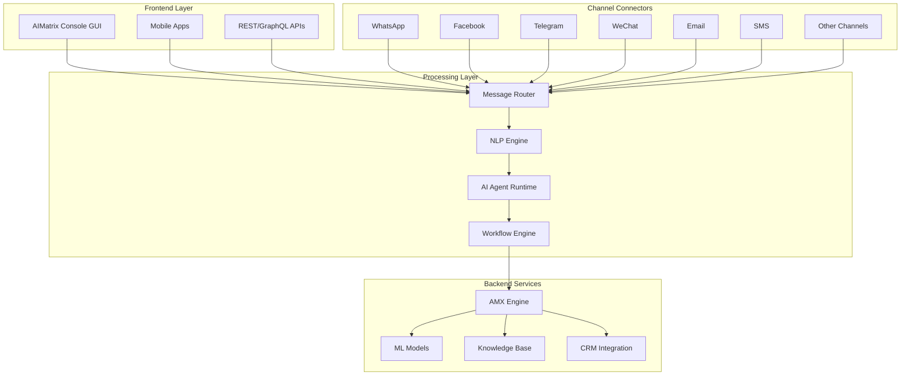

AIMatrix Console is a revolutionary GUI-based contact center platform that combines traditional customer service capabilities with advanced AI automation. It enables businesses to manage all customer communications through a single, powerful interface where AI agents can read, process, and respond to messages across every major communication channel on behalf of human operators.

## Platform Overview

AIMatrix Console transforms customer service operations by providing:
- **Unified omnichannel inbox** for all customer communications
- **AI-powered message processing** and automated responses
- **Intelligent routing** based on content, urgency, and complexity
- **Real-time agent assistance** with suggested responses
- **Automated workflow execution** for common requests
- **Comprehensive analytics** across all channels

## Supported Communication Channels

### Messaging Platforms
- **WhatsApp Business**: Full API integration with media support
- **Facebook Messenger**: Complete page management and automation
- **Instagram Direct**: Business account messaging
- **Telegram**: Bot and business account integration
- **WeChat**: Official account and mini-program support
- **LINE**: Official account messaging (Japan/Asia)
- **Viber**: Business messaging platform
- **Signal**: Privacy-focused messaging

### Traditional Channels
- **Email**: IMAP/SMTP with intelligent parsing
- **SMS/MMS**: Global carrier support with shortcodes
- **Voice**: VoIP integration with transcription
- **Live Chat**: Website widget with co-browsing
- **Video Chat**: WebRTC-based video support

### Social Media
- **Twitter/X**: Mentions, DMs, and replies
- **LinkedIn**: InMail and messaging
- **TikTok**: Business messaging
- **Discord**: Server and DM management
- **Slack**: Workspace integration

### Business Platforms
- **Microsoft Teams**: Enterprise collaboration
- **Zoom Chat**: Meeting and persistent chat
- **Salesforce Chatter**: CRM integration
- **HubSpot Conversations**: Marketing automation
- **Zendesk**: Ticketing system integration

## Core Features

### Unified Inbox

All communications centralized in one powerful interface:

```
┌────────────────────────────────────────────────────────────┐
│                    AIMatrix Console                        │
├──────┬─────────────────────────────────────────────────────┤
│      │ Unified Inbox                              [🔍]     │
│ 📧   ├─────────────────────────────────────────────────────┤
│ 💬   │ ▶ John Smith (WhatsApp)          2 min ago    🤖   │
│ 📱   │   "Need help with order #12345"                     │
│ 💼   │ ▶ Sarah Chen (Email)             5 min ago    ⚡   │
│ 🌐   │   "Requesting product demo"                         │
│      │ ▶ Mike Johnson (SMS)            12 min ago   ✓    │
│      │   "Changed delivery address"                        │
│      │ ▶ Lisa Wang (WeChat)           15 min ago   🔄   │
│      │   "询问产品价格" [Translated: Asking about price]   │
└──────┴─────────────────────────────────────────────────────┘
```

### AI Agent Capabilities

#### Autonomous Message Processing
- **Auto-categorization**: Instantly classify inquiries by type
- **Sentiment analysis**: Detect customer emotions and urgency
- **Language detection**: Automatic translation for 100+ languages
- **Intent recognition**: Understand customer needs accurately
- **Entity extraction**: Identify order numbers, dates, names

#### Intelligent Response Generation
- **Context-aware replies**: Personalized based on history
- **Multi-turn conversations**: Maintain context across messages
- **Brand voice consistency**: Responses match company tone
- **Compliance checking**: Ensure regulatory compliance
- **Escalation detection**: Know when to involve humans

### Agent Workspace

```
┌─────────────────────────────────────────────────────────────┐
│ Customer: John Smith          Channel: WhatsApp             │
├─────────────────────────────────────────────────────────────┤
│ Conversation History                    │ Customer Info     │
├─────────────────────────────────────────┼───────────────────┤
│ JS: Need help with order #12345         │ Name: John Smith  │
│                                          │ ID: CUST-7891     │
│ AI: I found your order. It was shipped  │ Orders: 15        │
│     yesterday via FedEx. Tracking:      │ Lifetime: $4,250  │
│     1234567890                          │ Status: Gold      │
│                                          │                   │
│ JS: When will it arrive?                │ Recent Orders:    │
│                                          │ #12345 - Shipped  │
│ [AI Suggested Response]                 │ #12298 - Done     │
│ Based on FedEx tracking, your order     │ #12156 - Done     │
│ will arrive tomorrow by 5 PM.           │                   │
│ [Send] [Edit] [Generate Alt]            │                   │
└─────────────────────────────────────────┴───────────────────┘
```

### Workflow Automation

Create sophisticated automation rules:

```typescript
interface AutomationRule {
  trigger: {
    channel: Channel[]
    keywords?: string[]
    sentiment?: 'positive' | 'negative' | 'neutral'
    customerTier?: 'bronze' | 'silver' | 'gold' | 'platinum'
  }
  conditions: Condition[]
  actions: {
    autoReply?: boolean
    assignTo?: Agent | Team
    addTags?: string[]
    updateCRM?: boolean
    executeWorkflow?: string
  }
}
```

### Real-time Analytics Dashboard

```
┌──────────────────────────────────────────────────────────┐
│                Performance Dashboard                      │
├────────────────┬───────────────┬────────────────────────┤
│ Response Time  │ Resolution    │ Customer Satisfaction  │
│ Avg: 45 sec    │ Rate: 87%     │ CSAT: 4.6/5.0         │
│ ↓ 65% vs human │ ↑ 12% today   │ NPS: 72               │
├────────────────┴───────────────┴────────────────────────┤
│ Channel Performance (Last 24 Hours)                      │
│ WhatsApp:  2,341 msgs  │ 98% handled by AI            │
│ Email:     1,856 msgs  │ 92% handled by AI            │
│ SMS:         987 msgs  │ 95% handled by AI            │
│ WeChat:      654 msgs  │ 89% handled by AI            │
│ Telegram:    432 msgs  │ 94% handled by AI            │
└───────────────────────────────────────────────────────────┘
```

## Implementation Architecture

### System Components



### Deployment via CLI

Setup and deploy AIMatrix Console using aimatrix-cli:

```bash
# Install aimatrix-cli
curl -sSL https://aimatrix.com/cli/install.sh | bash

# Initialize console deployment
aimatrix console init --name "production-console"

# Configure channels
aimatrix console channel add whatsapp \
  --api-key "your-whatsapp-business-api-key" \
  --phone-number "+1234567890"

aimatrix console channel add email \
  --smtp-host "smtp.company.com" \
  --imap-host "imap.company.com" \
  --username "support@company.com"

aimatrix console channel add telegram \
  --bot-token "your-telegram-bot-token"

# Configure AI agents
aimatrix console agent create "customer-service" \
  --model "gpt-4" \
  --knowledge-base "product-docs" \
  --max-concurrent 100

# Deploy console
aimatrix console deploy \
  --environment production \
  --replicas 3 \
  --region us-east-1

# Monitor deployment
aimatrix console status
```

## Channel-Specific Features

### WhatsApp Business Integration

- **Rich media support**: Images, videos, documents, voice notes
- **Interactive messages**: Quick replies, lists, buttons
- **Catalog integration**: Product browsing within chat
- **Business profile**: Automated business info responses
- **Message templates**: Pre-approved templates for notifications

### WeChat Official Account

- **Mini-program integration**: Launch services within chat
- **QR code campaigns**: Track campaign effectiveness
- **Payment integration**: WeChat Pay for transactions
- **Menu customization**: Rich interactive menus
- **Moments advertising**: Coordinate with ad campaigns

### Telegram Bot Features

- **Inline keyboards**: Interactive button layouts
- **Bot commands**: Slash commands for quick actions
- **Group management**: Moderate and manage groups
- **Channel posting**: Automated channel updates
- **Web app integration**: Launch web apps in chat

### Email Intelligence

- **Thread management**: Maintain conversation context
- **Attachment processing**: Extract and analyze attachments
- **Calendar integration**: Schedule meetings automatically
- **Signature extraction**: Parse contact information
- **Priority detection**: Identify urgent emails

## AI Agent Training

### Custom Model Training

Train AI agents specific to your business:

```python
# Training configuration
training_config = {
    "base_model": "llama-3.1-70b",
    "training_data": [
        "historical_conversations.json",
        "product_documentation.pdf",
        "company_policies.txt"
    ],
    "fine_tuning": {
        "epochs": 10,
        "batch_size": 32,
        "learning_rate": 0.001
    },
    "evaluation_metrics": [
        "response_accuracy",
        "sentiment_preservation",
        "brand_voice_consistency"
    ]
}

# Deploy trained model
aimatrix console model deploy \
  --name "custom-service-agent" \
  --config training_config.json
```

### Knowledge Base Management

```bash
# Add knowledge sources
aimatrix console knowledge add \
  --source "product-manual.pdf" \
  --type documentation

aimatrix console knowledge add \
  --source "https://docs.company.com" \
  --type website \
  --crawl-depth 3

# Update knowledge base
aimatrix console knowledge refresh --all

# Test knowledge retrieval
aimatrix console knowledge test \
  --query "return policy for electronics"
```

## Advanced Features

### Sentiment-Based Routing

Automatically route based on customer emotion:

```javascript
const routingRules = {
  angry: {
    priority: "HIGH",
    assignTo: "senior_agents",
    autoResponse: false,
    escalate: true
  },
  frustrated: {
    priority: "MEDIUM",
    assignTo: "experienced_agents",
    autoResponse: true,
    suggestCompensation: true
  },
  happy: {
    priority: "NORMAL",
    assignTo: "any_available",
    autoResponse: true,
    requestReview: true
  }
};
```

### Multi-Language Support

Handle conversations in 100+ languages:

```typescript
interface LanguageConfig {
  detected: string // "es"
  confidence: number // 0.98
  translation: {
    enabled: boolean
    target: string // "en"
    preserveContext: boolean
  }
  culturalAdaptation: {
    timeZone: string
    dateFormat: string
    currency: string
    formalityLevel: 'formal' | 'casual'
  }
}
```

### Compliance & Security

- **GDPR compliance**: Data privacy and right to erasure
- **HIPAA compliance**: Healthcare data protection
- **PCI DSS**: Payment card security
- **End-to-end encryption**: Message security
- **Audit trails**: Complete conversation history
- **Data residency**: Regional data storage options

## AI-Powered Todo List

### Intelligent Task Management

AIMatrix Console includes a revolutionary AI-powered todo list where users can add tasks, issues, and commands that AI agents process and execute autonomously in the background:

```
┌──────────────────────────────────────────────────────────┐
│                   AI Todo List                           │
├──────────────────────────────────────────────────────────┤
│ Active Tasks (AI Processing)                             │
├──────────────────────────────────────────────────────────┤
│ 🔄 Generate Q4 revenue report from sales data          │
│    Status: Analyzing 45,000 transactions...             │
│    Progress: [=========>        ] 67%                   │
│                                                          │
│ 🔄 Reply to all customer inquiries from yesterday       │
│    Status: Drafting responses (142/203 complete)        │
│    Progress: [============>     ] 70%                   │
│                                                          │
│ 🔄 Update product catalog with new pricing              │
│    Status: Updating database entries...                 │
│    Progress: [======>           ] 35%                   │
├──────────────────────────────────────────────────────────┤
│ Queued Tasks                                            │
├──────────────────────────────────────────────────────────┤
│ ⏳ Schedule meetings with leads from trade show         │
│ ⏳ Analyze competitor pricing and suggest adjustments   │
│ ⏳ Create social media content for next week            │
│ ⏳ Process refund requests from support tickets         │
├──────────────────────────────────────────────────────────┤
│ Completed Tasks (Last 24 Hours)                        │
├──────────────────────────────────────────────────────────┤
│ ✅ Sent follow-up emails to 347 customers              │
│ ✅ Generated monthly performance dashboard              │
│ ✅ Updated CRM with 523 new contact details            │
│ ✅ Processed 89 order modifications                     │
├──────────────────────────────────────────────────────────┤
│ [+ Add Task] [⚙️ Settings] [📊 Analytics] [🔄 Refresh] │
└──────────────────────────────────────────────────────────┘
```

### Task Types and AI Capabilities

```typescript
interface AITask {
  id: string
  type: 'analysis' | 'communication' | 'data_processing' | 'content_creation' | 'automation'
  description: string
  priority: 'urgent' | 'high' | 'normal' | 'low'
  assignedAgent: AIAgent
  status: 'queued' | 'processing' | 'completed' | 'failed' | 'requires_approval'
  estimatedCompletion: Date
  dependencies: string[]
  approvalRequired: boolean
  recurringSchedule?: CronExpression
}
```

### Natural Language Task Creation

Users can add tasks using natural language:

```javascript
// User inputs
"Reply to all customer emails from yesterday with personalized responses"
"Generate a sales report comparing this month to last month"
"Schedule follow-up calls with all leads marked as 'interested'"
"Update the website FAQ based on common support tickets"
"Send birthday greetings to customers with birthdays this week"

// AI interprets and executes
const taskProcessor = {
  interpret: (input) => {
    // NLP processing to understand intent
    // Break down into executable subtasks
    // Assign to appropriate AI agents
    // Schedule and prioritize
  },
  execute: async (task) => {
    // Gather required data
    // Process using AI capabilities
    // Execute actions
    // Report results
  }
}
```

### Background Execution Engine

```kotlin
class AITaskExecutor(
    private val agentPool: AgentPool,
    private val taskQueue: PriorityQueue<AITask>
) {
    suspend fun processTasksInBackground() {
        coroutineScope {
            while (true) {
                val task = taskQueue.poll()
                launch {
                    val agent = agentPool.getAvailableAgent(task.type)
                    try {
                        val result = agent.execute(task)
                        notifyCompletion(task, result)
                    } catch (e: Exception) {
                        handleTaskFailure(task, e)
                    }
                }
                delay(100) // Check for new tasks
            }
        }
    }
}
```

### Smart Task Suggestions

AI suggests tasks based on patterns and business needs:

```
┌──────────────────────────────────────────────────────────┐
│ 💡 Suggested Tasks (AI Recommendations)                  │
├──────────────────────────────────────────────────────────┤
│ • Follow up with customers who abandoned carts (47)      │
│ • Update product descriptions for SEO optimization       │
│ • Send re-engagement emails to inactive users (892)      │
│ • Analyze this week's support tickets for trends         │
│ • Prepare weekly team performance report                 │
│ [Add All] [Add Selected] [Dismiss]                      │
└──────────────────────────────────────────────────────────┘
```

## Responsive UI Design

### Desktop Experience (Windows/Mac/Linux)

Full-featured comprehensive interface with all capabilities:

```
┌─────────────────────────────────────────────────────────────────────┐
│ AIMatrix Console - Desktop View                          👤 Admin   │
├────────┬────────────────────────────────────────────┬──────────────┤
│        │                                            │              │
│  Nav   │           Main Content Area                │   Side       │
│  Menu  │                                            │   Panels     │
│        │    • Full dashboard with all widgets       │              │
│  📧    │    • Multi-column layouts                  │  • Chat      │
│  💬    │    • Drag-and-drop customization            │  • Tasks     │
│  📊    │    • Split-screen views                     │  • Metrics   │
│  🤖    │    • Advanced filtering and search          │  • Alerts    │
│  ⚙️    │    • Keyboard shortcuts enabled             │              │
│        │    • Context menus and tooltips             │              │
└────────┴────────────────────────────────────────────┴──────────────┘
```

**Desktop Features:**
- Multiple windows and tabs
- Drag-and-drop interface builders
- Advanced data tables with sorting/filtering
- Rich text editors with full formatting
- Multi-panel layouts
- Keyboard navigation
- Mouse hover previews
- Right-click context menus

### Mobile Experience (iOS/Android)

Simplified, touch-optimized interface for mobile devices:

```
┌─────────────────┐
│ ☰ AMX Console   │
├─────────────────┤
│                 │
│   Inbox (47)    │
│   ─────────     │
│   📧 Email (12) │
│   💬 Chat (23)  │
│   📱 SMS (12)   │
│                 │
├─────────────────┤
│ Quick Actions   │
│ [📝] [📊] [🔔]  │
├─────────────────┤
│ Recent Tasks    │
│ • Process orders│
│ • Reply emails  │
│ • Update CRM    │
└─────────────────┘
```

**Mobile Optimizations:**
- Single column layout
- Swipe gestures for navigation
- Bottom navigation bar
- Collapsible sections
- Touch-friendly buttons (min 44px)
- Simplified forms
- Voice input support
- Offline mode with sync

### Responsive Breakpoints

```css
/* Mobile First Approach */
@media (min-width: 320px) {
  /* Mobile - Single column, simplified UI */
  .console-layout { grid-template-columns: 1fr; }
}

@media (min-width: 768px) {
  /* Tablet - Two column, expanded features */
  .console-layout { grid-template-columns: 1fr 2fr; }
}

@media (min-width: 1024px) {
  /* Desktop - Full featured, multi-panel */
  .console-layout { grid-template-columns: 200px 1fr 300px; }
}

@media (min-width: 1920px) {
  /* Large screens - Maximum features */
  .console-layout { grid-template-columns: 250px 1fr 400px; }
}
```

### Platform-Specific Features

**iOS/Android Mobile App:**
- Push notifications for urgent messages
- Biometric authentication (Face ID/Touch ID)
- Share sheet integration
- Camera for document scanning
- Location services for field agents
- Background task processing
- Widget support for quick actions

**Desktop Application:**
- System tray integration
- Global hotkeys
- File system access
- Multi-monitor support
- Native OS notifications
- Clipboard management
- Screen recording for training

### Adaptive UI Components

```typescript
interface ResponsiveComponent {
  mobile: {
    view: 'simplified' | 'compact' | 'list'
    interactions: 'touch' | 'swipe' | 'tap'
    dataDisplay: 'summary' | 'essential'
  }
  tablet: {
    view: 'expanded' | 'grid'
    interactions: 'touch' | 'hover'
    dataDisplay: 'detailed' | 'charts'
  }
  desktop: {
    view: 'comprehensive' | 'customizable'
    interactions: 'mouse' | 'keyboard' | 'drag'
    dataDisplay: 'full' | 'analytics' | 'realtime'
  }
}
```

## Integration Ecosystem

### CRM Systems
- Salesforce
- HubSpot
- Microsoft Dynamics
- Zoho CRM
- Pipedrive

### E-commerce Platforms
- Shopify
- WooCommerce
- Magento
- BigCommerce
- Square

### Help Desk Software
- Zendesk
- Freshdesk
- Intercom
- Help Scout
- Jira Service Management

### Marketing Tools
- Mailchimp
- ActiveCampaign
- Marketo
- Pardot
- Klaviyo

## Performance Metrics

### System Capabilities

| Metric | Specification |
|--------|--------------|
| Concurrent conversations | 100,000+ |
| Messages per second | 10,000+ |
| Response latency | < 100ms |
| AI processing time | < 500ms |
| Channel connections | Unlimited |
| Agent capacity | 10,000+ |
| Uptime SLA | 99.99% |

### Business Impact

| Metric | Before | After | Improvement |
|--------|--------|-------|-------------|
| Response time | 4 hours | 30 seconds | 99% faster |
| Resolution rate | 65% | 87% | 34% increase |
| Cost per interaction | $6.50 | $0.45 | 93% reduction |
| Customer satisfaction | 3.2/5 | 4.6/5 | 44% increase |
| Agent productivity | 50 tickets/day | 200 tickets/day | 300% increase |

## Pricing & Deployment

### Cloud SaaS
- **Starter**: $499/month (1,000 conversations)
- **Professional**: $1,999/month (10,000 conversations)
- **Enterprise**: Custom pricing (unlimited)

### On-Premise
- **License**: Starting at $25,000/year
- **Implementation**: $10,000-50,000
- **Support**: 20% annual maintenance

### Hybrid Deployment
- Combine cloud and on-premise
- Custom architecture design
- Enterprise consulting included

## Getting Started

### Quick Start Guide

1. **Sign up** for AIMatrix Console account
2. **Connect** your communication channels
3. **Configure** AI agents and workflows
4. **Train** on your business knowledge
5. **Deploy** and start handling messages

### Resources

- [Video Tutorials](https://aimatrix.com/console/tutorials)
- [API Documentation](https://docs.aimatrix.com/console/api)
- [Best Practices Guide](https://aimatrix.com/console/best-practices)
- [Community Forum](https://community.aimatrix.com/console)

## Support

- **Community**: Free forum support
- **Professional**: Business hours support
- **Enterprise**: 24/7 dedicated support
- **Premier**: White-glove onboarding and consulting

---

*AIMatrix Console: Where AI meets customer service excellence, enabling businesses to deliver exceptional experiences across every channel while reducing costs by up to 93%.*