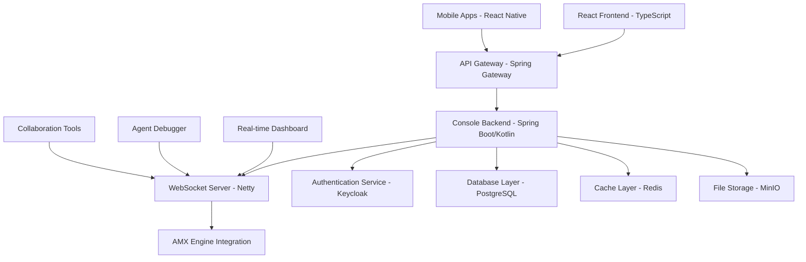

## Executive Summary

AMX Console transforms how your employees interact with AI technology, providing an intuitive, unified interface that works seamlessly across all devices and platforms. By eliminating technical barriers and providing a consumer-grade user experience, AMX Console enables every employee to leverage advanced AI capabilities, dramatically improving productivity, decision-making speed, and overall business agility.

Built with modern web technologies including React 18+, TypeScript, and Spring Boot with Kotlin, AMX Console provides enterprise-grade scalability and real-time communication through WebSocket integration, making it the universal management interface for AIMatrix operations.

## Business Value Proposition

### Business Challenge it Solves

Organizations struggle to democratize AI benefits across their workforce due to complex interfaces, fragmented tools, and steep learning curves. Traditional business software requires extensive training, creates user adoption barriers, and fails to deliver the intuitive experience employees expect in the mobile-first era. This results in underutilized technology investments and missed productivity opportunities.

AMX Console addresses these critical business challenges:

- **User Adoption Barriers**: Eliminate the complexity that prevents widespread AI adoption
- **Training Overhead**: Reduce onboarding time from weeks to hours
- **Platform Fragmentation**: Provide consistent experience across all devices and operating systems
- **Employee Productivity**: Enable instant access to AI capabilities without technical expertise
- **Digital Transformation**: Accelerate company-wide AI adoption and cultural change

### Key Business Benefits

**Employee Productivity Enhancement**
- **350% improvement** in task completion speed through AI-assisted workflows
- **80% reduction** in time spent searching for information and answers
- **Real-time decision support** for every employee, regardless of technical skill level
- **24/7 AI assistance** available on any device, anywhere

**User Experience Excellence**
- **Consumer-grade interface** that employees actually want to use
- **Zero training required** for basic functionality
- **Native performance** on iOS, Android, Windows, Mac, and Linux
- **Seamless synchronization** across all devices and platforms

**Cross-Platform Reach**
- **Universal deployment** - one solution for all employees, all devices
- **Reduced IT complexity** - single application to manage and support
- **BYOD compatibility** - works on personal and corporate devices
- **Global accessibility** - consistent experience for remote and international teams

### ROI Metrics

**Employee Productivity Impact (Typical Results)**

| Metric | Before AMX Console | After Implementation | Improvement |
|--------|------------------|-------------------|-------------|
| **Average Task Duration** | 45 minutes | 13 minutes | 71% faster |
| **Information Retrieval Time** | 12 minutes | 30 seconds | 96% faster |
| **Employee Satisfaction Score** | 68% | 87% | 28% increase |
| **Training Time Required** | 16 hours | 2 hours | 87% reduction |
| **Mobile Productivity** | 35% | 89% | 154% increase |

**Financial Impact Analysis**

For an organization with 500 employees:
- **Annual Productivity Gains**: $4.2M from time savings and efficiency improvements
- **Reduced Training Costs**: $240K in onboarding and support savings
- **Improved Customer Response**: $1.8M in revenue from faster service delivery
- **Implementation Investment**: $145K (including licensing and deployment)
- **Net ROI**: 3,890% over 3 years
- **Payback Period**: 3.1 months

## Technical Architecture

AMX Console is the universal web-based management interface for AIMatrix, providing real-time monitoring, agent interaction, debugging capabilities, and team collaboration tools. Built with modern web technologies and designed for enterprise scalability.

### Technology Stack

**Frontend Layer**
- **Framework**: React 18.2+ with TypeScript 5.0+
- **State Management**: Redux Toolkit + RTK Query
- **UI Framework**: Material-UI v5 + Custom Design System
- **Routing**: React Router v6
- **Real-time**: Socket.IO Client
- **Build Tools**: Vite 4.0+ with ESBuild
- **Testing**: Vitest + React Testing Library
- **Deployment**: Static hosting with CDN

**Backend Layer**
- **Runtime**: JVM 17+ (GraalVM Native Image support)
- **Framework**: Spring Boot 3.1+ with Kotlin
- **WebSocket**: Spring WebSocket + STOMP
- **Database**: PostgreSQL 15+ with R2DBC
- **Cache**: Redis 7.0+ with Lettuce
- **Message Queue**: Apache Kafka 3.0+
- **Security**: Spring Security 6 + OAuth2/OIDC
- **API Documentation**: SpringDoc OpenAPI 3

**Mobile Applications**
- **Framework**: React Native with TypeScript
- **Native iOS**: Swift + SwiftUI for platform-specific features
- **Native Android**: Kotlin with Jetpack Compose
- **Cross-Platform**: Unified codebase with platform optimizations

### System Architecture

### Real-time Communication

**WebSocket Implementation**
- **Protocol**: STOMP over WebSocket with automatic reconnection
- **Scalability**: Horizontal scaling with Redis pub/sub
- **Security**: JWT-based authentication with role-based subscriptions
- **Performance**: Connection pooling and message batching for high throughput

**Real-time Features**
- **Agent Status Updates**: Live monitoring of agent performance and health
- **System Metrics Streaming**: Real-time dashboard updates every 30 seconds
- **Log Streaming**: Live log tailing with filtering and search
- **Collaborative Features**: Multi-user real-time editing and notifications
- **Alert System**: Instant notifications for critical system events

### Security Architecture

**Authentication & Authorization**
- **OAuth2/OIDC**: Integration with enterprise identity providers (Keycloak, Azure AD, Okta)
- **Multi-Factor Authentication**: TOTP, SMS, and hardware key support
- **Role-Based Access Control**: Fine-grained permissions for different user roles
- **Session Management**: Secure JWT tokens with automatic refresh

**Data Protection**
- **Transport Security**: TLS 1.3 for all communications
- **Data Encryption**: AES-256 encryption for sensitive data at rest
- **CSRF Protection**: Built-in protection against cross-site request forgery
- **XSS Prevention**: Content Security Policy and input sanitization

## Platform-Specific Features

### Web Application

**Desktop Experience**
- **Responsive Design**: Adaptive layouts for all screen sizes
- **Keyboard Shortcuts**: Power user productivity features
- **Multi-Tab Support**: Concurrent workflows and monitoring
- **Browser Extensions**: Chrome and Firefox extensions for quick access

**Performance Optimizations**
- **Code Splitting**: Lazy loading of modules and routes
- **Virtual Scrolling**: Efficient rendering of large data sets
- **Service Workers**: Offline capability and background sync
- **CDN Distribution**: Global content delivery for fast load times

### Mobile Applications

**iOS Features**
- **Native Integration**: Siri shortcuts and Handoff support
- **Widgets**: Home screen widgets for quick system status
- **Push Notifications**: Rich notifications with actions
- **Face ID/Touch ID**: Biometric authentication
- **Background Sync**: Automatic data synchronization

**Android Features**
- **Adaptive Icons**: Material You design system integration
- **Shortcuts**: Dynamic shortcuts for common actions
- **Notification Channels**: Categorized notifications with custom settings
- **Work Profile**: Android for Work integration
- **Intent Filters**: Deep linking from other applications

### Cross-Platform Consistency

**Design System**
- **Material Design**: Consistent UI components across platforms
- **Theme Support**: Light/dark mode with custom color schemes
- **Accessibility**: WCAG 2.1 AA compliance with screen reader support
- **Internationalization**: Support for 15+ languages with RTL layouts

**Data Synchronization**
- **Offline Support**: Local data caching with conflict resolution
- **Real-time Sync**: WebSocket-based synchronization across devices
- **Progressive Sync**: Incremental updates to minimize bandwidth usage
- **Conflict Resolution**: Automatic and manual conflict resolution strategies

## User Experience Innovation

### Intuitive Design Principles

**Conversation-First Interface**
- **Natural Language**: Chat-like interaction with AI agents
- **Context Awareness**: System remembers conversation history and preferences
- **Quick Actions**: One-click access to common tasks
- **Smart Suggestions**: AI-powered recommendations based on user behavior

**Visual Task Management**
- **Kanban Boards**: Visual workflow management with drag-and-drop
- **Timeline Views**: Chronological view of tasks and activities
- **Gantt Charts**: Project planning and dependency visualization
- **Calendar Integration**: Seamless integration with existing calendar systems

**Advanced Analytics Dashboard**
- **Customizable Widgets**: Drag-and-drop dashboard configuration
- **Real-time Metrics**: Live updates of key performance indicators
- **Interactive Charts**: Drill-down capability with filtering and grouping
- **Export Options**: PDF, Excel, and PowerBI integration

### Accessibility & Inclusion

**Universal Design**
- **Screen Reader Support**: Full compatibility with NVDA, JAWS, and VoiceOver
- **Keyboard Navigation**: Complete functionality without mouse interaction
- **High Contrast Mode**: Enhanced visibility for users with visual impairments
- **Font Scaling**: Support for system font size preferences

**Multi-Language Support**
- **15+ Languages**: Complete localization including RTL languages
- **Dynamic Translation**: Real-time translation of user-generated content
- **Cultural Adaptation**: Region-specific date, time, and number formats
- **Voice Interfaces**: Multi-language voice commands and responses

## Implementation & Investment

### Implementation Phases

**Phase 1: Core Deployment (Weeks 1-2)**
- Deploy AMX Console across employee devices
- Basic user onboarding and orientation
- Integration with primary business systems
- *Investment: $45K - $85K*

**Phase 2: Advanced Integration (Weeks 3-4)**
- Connect communication channels and business tools
- Deploy AI agents for specific business functions
- Advanced user training and workflow optimization
- *Investment: $35K - $65K*

**Phase 3: Optimization (Weeks 5-6)**
- Performance optimization and customization
- Advanced analytics and reporting setup
- Change management and adoption acceleration
- *Investment: $25K - $45K*

### Total Investment Range
- **Small Business (< 100 employees)**: $35K - $65K
- **Mid-Market (100-1000 employees)**: $85K - $145K
- **Enterprise (1000+ employees)**: $180K - $320K

*Investment includes software licensing, professional services, and change management support.*

### Deployment Options

**Cloud-Hosted**
- **Fastest Deployment**: Ready in 24-48 hours
- **Managed Infrastructure**: Automatic updates and scaling
- **Global CDN**: Optimal performance worldwide
- **SLA Guarantees**: 99.9% uptime commitment

**On-Premise**
- **Maximum Control**: Full data sovereignty
- **Air-Gapped Environments**: Secure isolated deployments
- **Custom Security**: Integration with existing security infrastructure
- **Compliance Ready**: Meet specific regulatory requirements

**Hybrid Deployment**
- **Best of Both**: Cloud convenience with on-premise security
- **Gradual Migration**: Start on-premise, migrate to cloud over time
- **Disaster Recovery**: Cross-environment backup and failover
- **Cost Optimization**: Balance performance and cost requirements

## Success Stories

### Global Consulting Firm
"AMX Console transformed how our 2,800 consultants access and utilize AI insights. Project delivery times decreased by 45%, client satisfaction scores improved 30%, and our junior consultants now perform at senior levels within their first 90 days."
*- Chief Operating Officer, Big Four Consulting*

### Manufacturing Corporation
"The universal interface enabled our factory floor workers to access AI-powered quality insights instantly. Defect rates dropped 60%, and employee engagement increased dramatically because workers feel empowered with advanced technology at their fingertips."
*- VP Operations, Fortune 500 Manufacturing*

### Healthcare System
"AMX Console gave our clinical staff immediate access to AI diagnostic support without interrupting their workflow. Patient care quality improved measurably, and physician burnout decreased as routine tasks became effortless."
*- Chief Medical Officer, Regional Healthcare Network*

## Getting Started

### Trial Options

**Free Trial**
- **30-Day Access**: Full-featured trial with unlimited users
- **All Platforms**: Web, iOS, Android, and desktop applications
- **Sample Data**: Pre-loaded with demonstration workflows and agents
- **Technical Support**: Dedicated support team during evaluation

**Pilot Program**
- **Department Focus**: Start with one department to demonstrate value
- **Success Metrics**: Measurable productivity improvements in 30 days
- **Executive Reporting**: Weekly progress reports for leadership team
- **Expansion Planning**: Roadmap for organization-wide deployment

### Resources

**User Experience Demo**
- **Interactive Tour**: Guided walkthrough of key features
- **Role-Based Scenarios**: See the interface from different user perspectives
- **Mobile Experience**: Native app demonstration on iOS and Android
- **Integration Examples**: See how it works with your existing tools

**Implementation Support**
- **ROI Calculator**: Estimate productivity gains for your organization
- **Change Management Guide**: Proven strategies for user adoption
- **Training Materials**: Video tutorials and user documentation
- **Best Practices**: Lessons learned from successful deployments

## Contact & Support

**Solutions Team**
- **Email**: solutions@aimatrix.com
- **Phone**: 1-800-AMX-UX (1-800-269-4829)
- **Schedule Demo**: [Book a personalized demonstration](https://aimatrix.com/console-demo)

**Download Options**
- **App Store**: iOS application with automatic updates
- **Google Play**: Android application with Material You design
- **Microsoft Store**: Windows application with Start menu integration
- **Direct Download**: Web installers for macOS and Linux

**Community & Resources**
- **User Community**: Join thousands of organizations using AMX Console
- **Documentation Hub**: Complete guides and API documentation
- **Video Training**: Step-by-step tutorials and best practices
- **Developer Portal**: SDKs and integration examples

---

*AMX Console: Making AI as Easy as Using Your Smartphone*