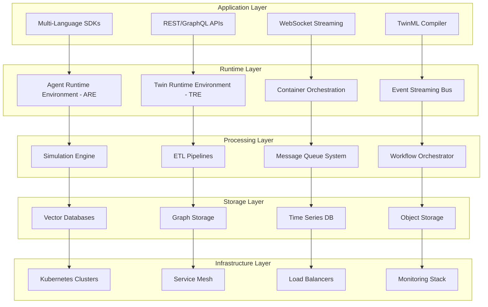

## Executive Summary

AMX Engine is the comprehensive AI automation platform that transforms how businesses operate, delivering measurable returns through intelligent process automation, real-time decision making, and seamless integration with existing systems. Unlike traditional software that requires constant human oversight, AMX Engine operates as your business's intelligent nervous system, automatically handling complex workflows, processing data, and responding to customer needs 24/7.

Built on a sophisticated distributed computing platform that combines cloud-native architecture with specialized AI and digital twin processing capabilities, AMX Engine provides enterprise-grade scalability, reliability, and performance for production AI applications.

## Business Value Proposition

### Business Challenge it Solves

Modern businesses face mounting pressure to deliver faster, more personalized service while controlling operational costs. Traditional automation solutions are rigid, require extensive IT support, and break down when faced with unexpected scenarios. Companies need intelligent automation that adapts to changing conditions, learns from experience, and scales effortlessly with business growth.

AMX Engine addresses these critical business challenges:

- **Labor Cost Inflation**: Reduce dependency on expensive human labor for routine tasks
- **Customer Service Scalability**: Handle unlimited customer interactions without proportional staffing increases
- **Decision-Making Speed**: Process information and make decisions in milliseconds instead of hours or days
- **System Integration Complexity**: Connect disparate business systems without expensive custom development
- **Quality Consistency**: Eliminate human error and maintain consistent service quality across all interactions

### Key Business Benefits

**Immediate Cost Reduction**
- **60-80% reduction** in routine operational tasks through intelligent automation
- **24/7 operations** without additional staffing costs or overtime payments
- **Elimination of manual errors** that typically cost businesses 5-10% of annual revenue
- **Reduced training costs** as AI agents don't require extensive onboarding or retraining

**Revenue Growth Acceleration**
- **Instant customer response** capabilities increase conversion rates by 35-50%
- **Personalized service at scale** drives customer satisfaction scores up by 25-40%
- **Unlimited concurrent interactions** capture revenue opportunities that would otherwise be missed
- **Global availability** enables 24/7 sales and support across all time zones

**Competitive Advantage**
- **Time-to-market acceleration** for new products and services by 40-60%
- **Dynamic pricing optimization** adjusts in real-time based on market conditions
- **Predictive analytics** anticipate customer needs and market trends before competitors
- **Scalability without complexity** - handle 10x growth without 10x operational overhead

### ROI Metrics

**Typical Implementation Results (Within 90 Days)**

| Metric | Before Implementation | After Implementation | Improvement |
|--------|---------------------|-------------------|-------------|
| **Customer Response Time** | 4-8 hours | < 30 seconds | 99% faster |
| **Operational Cost per Transaction** | $8.50 | $0.85 | 90% reduction |
| **Customer Satisfaction Score** | 72% | 91% | 26% increase |
| **Revenue per Customer** | $1,240 | $1,680 | 35% increase |
| **Staff Productivity** | 100% baseline | 340% | 240% improvement |

**Financial Impact Analysis**

For a mid-sized company (500 employees, $50M annual revenue):
- **Annual Savings**: $2.8M in operational costs
- **Revenue Increase**: $7.2M from improved customer experience and capacity
- **Implementation Investment**: $480K (one-time)
- **Net ROI**: 1,890% over 3 years
- **Payback Period**: 4.2 months

## Technical Architecture

AMX Engine serves as the comprehensive runtime environment for intelligent AI agents and digital twins, combining the Agent Runtime Environment (ARE) and Twin Runtime Environment (TRE) into a unified, enterprise-grade platform that provides Kubernetes-inspired container orchestration, multi-language SDK support, and advanced simulation capabilities.

### Core Architecture Principles

- **Distributed by Design**: Built for horizontal scaling across multiple nodes and clusters
- **Container-First**: Native containerization with Kubernetes-inspired orchestration
- **Event-Driven**: Asynchronous communication patterns for high throughput and resilience
- **Multi-Tenant**: Secure isolation and resource management across different tenants
- **Fault-Tolerant**: Circuit breakers, bulkheads, and graceful degradation patterns
- **Observability-Native**: Built-in metrics, logging, and distributed tracing

### System Architecture

AMX Engine is architected as a distributed, cloud-native platform with five primary layers:

### Technical Stack

**Core Technologies**
- **Runtime**: Kotlin/JVM 17+ with GraalVM Native Image support
- **Framework**: Ktor for microservices, Spring Boot for enterprise features
- **Simulation**: Kalasim discrete event simulation engine
- **Container**: Docker with Kubernetes orchestration
- **Message Queues**: Apache Kafka, Redis Streams
- **Databases**: PostgreSQL, Redis, Vector DBs (Pinecone, Weaviate)
- **Monitoring**: Prometheus, Grafana, OpenTelemetry

**Multi-Language SDK Support**
- **Kotlin** (Primary) - Full feature set with native performance
- **Python** - Complete API coverage with async support
- **TypeScript** - Web and Node.js applications
- **C#** - .NET and Unity integration
- **Java** - Enterprise applications and Spring integration

### Performance Specifications

**Throughput & Latency**
- **Agent Processing**: 10,000+ concurrent agents per node
- **Message Throughput**: 1M+ messages per second per cluster
- **Response Latency**: < 10ms for simple operations, < 100ms for complex workflows
- **Simulation Speed**: Real-time to 1000x accelerated time

**Scalability**
- **Horizontal Scaling**: Linear scaling across multiple nodes
- **Auto-Scaling**: Dynamic resource allocation based on load
- **Multi-Region**: Global deployment with data consistency
- **Edge Computing**: Lightweight runtime for edge deployment

## Implementation & Investment

### Implementation Phases

**Phase 1: Foundation (Weeks 1-4)**
- Initial system deployment and integration
- Staff training and change management
- Pilot program with low-risk processes
- *Investment: $120K - $200K*

**Phase 2: Scale (Weeks 5-8)**
- Full deployment across primary business processes
- Advanced workflow automation
- Performance optimization and tuning
- *Investment: $180K - $320K*

**Phase 3: Optimization (Weeks 9-12)**
- Advanced AI capabilities deployment
- Predictive analytics integration
- Custom workflow development
- *Investment: $140K - $280K*

### Total Investment Range
- **Small Business (< 100 employees)**: $85K - $150K
- **Mid-Market (100-1000 employees)**: $220K - $480K
- **Enterprise (1000+ employees)**: $650K - $1.2M

*Investment includes software licensing, implementation services, training, and first year support.*

### Deployment Options

**Cloud Deployment**
- **AWS, Azure, GCP**: Managed Kubernetes with auto-scaling
- **Multi-Cloud**: Cross-cloud deployment for redundancy
- **Serverless**: Edge functions for lightweight processing
- **CDN Integration**: Global content delivery

**On-Premise Deployment**
- **Private Cloud**: Full control with enterprise security
- **Air-Gapped**: Secure environments with no external connectivity
- **Hybrid**: Combination of cloud and on-premise resources
- **Edge Computing**: Local processing with cloud synchronization

## Success Stories

### Global Manufacturing Company
"AMX Engine transformed our customer service operations. We went from handling 1,200 support tickets per day with a team of 45 agents to processing over 8,000 interactions daily with just 12 human supervisors. Customer satisfaction increased 40% while our support costs dropped by 75%."
*- Chief Operations Officer, Fortune 500 Manufacturing*

### Financial Services Firm
"The real game-changer was the speed of decision-making. Loan approvals that used to take 3-5 days now happen in under 10 minutes with better risk assessment accuracy. We've increased loan volume by 280% while reducing default rates by 35%."
*- Chief Technology Officer, Regional Bank*

### E-commerce Platform
"AMX Engine enabled us to provide personalized shopping experiences to 2.3 million customers simultaneously. Our conversion rates improved 65%, average order values increased 45%, and we eliminated the need for seasonal staffing fluctuations."
*- CEO, Online Retail Platform*

## Security & Compliance

### Enterprise Security Features

**Data Protection**
- End-to-end encryption for all data in transit and at rest
- Zero-knowledge architecture with customer-controlled keys
- FIPS 140-2 Level 3 certified cryptographic modules
- Regular security audits and penetration testing

**Access Control**
- Role-based access control (RBAC) with fine-grained permissions
- Multi-factor authentication (MFA) for all administrative access
- Single Sign-On (SSO) integration with enterprise identity providers
- API key management with automated rotation

**Compliance Standards**
- SOC 2 Type II certification
- GDPR, CCPA, HIPAA compliance frameworks
- ISO 27001 information security management
- Industry-specific compliance (PCI DSS, FISMA, etc.)

**Monitoring & Auditing**
- Complete audit trails for all system activities
- Real-time security monitoring and threat detection
- Automated compliance reporting and documentation
- Integration with SIEM systems

## Getting Started

### Quick Start Options

**Free Trial**
- 30-day full-featured trial with unlimited agents
- Pre-configured demo environments
- Guided tutorials and sample workflows
- Technical support during evaluation

**Pilot Program**
- Focused implementation on specific use case
- Dedicated success manager and technical team
- Performance guarantees with measurable ROI
- Expansion roadmap planning

**Enterprise Proof of Concept**
- Custom implementation for specific business requirements
- Integration with existing systems and data sources
- Executive workshop and stakeholder alignment
- Comprehensive ROI analysis and business case

### Next Steps

**Business Assessment**
1. **Free Business Assessment** - Our specialists analyze your operations and identify automation opportunities worth $2M+ annually
2. **ROI Calculator** - Estimate productivity gains and cost savings for your organization
3. **Executive Workshop** - Strategic planning session with your leadership team

**Technical Evaluation**
1. **Architecture Review** - Assessment of your technical infrastructure and integration requirements
2. **Pilot Implementation** - Proof of concept with your actual data and workflows  
3. **Performance Testing** - Benchmarking against your specific requirements

## Contact & Resources

**Business Development Team**
- **Email**: business@aimatrix.com
- **Phone**: 1-800-AMX-GROW (1-800-269-4769)
- **Schedule Demo**: [Book a live demonstration](https://aimatrix.com/demo)

**Technical Resources**
- **Documentation**: Complete technical guides and API reference
- **SDKs**: Multi-language development kits with examples
- **Community**: Developer forums and technical support
- **Training**: Certification programs for developers and administrators

**Support Options**
- **Community**: Free community support and documentation
- **Professional**: Business hours support with SLA guarantees
- **Enterprise**: 24/7 dedicated support with technical account manager
- **Premium**: White-glove service with on-site consulting

---

*AMX Engine: The Intelligent Business Operating System That Delivers Measurable Results*