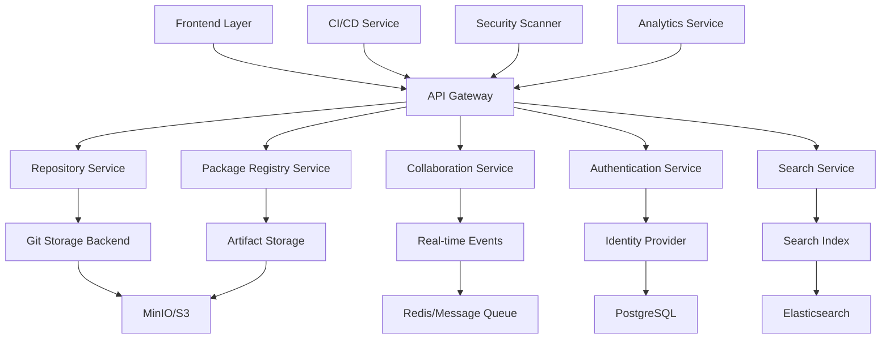

## Executive Summary

AMX Hub serves as your organization's central command center for AI initiatives, providing enterprise-grade collaboration, governance, and orchestration capabilities that transform how teams develop, deploy, and manage AI solutions. By functioning as "GitHub for AI workspaces," AMX Hub enables seamless collaboration while maintaining security, compliance, and operational control at enterprise scale.

Built with modern Kotlin/Spring Boot architecture, AMX Hub provides Git-like repository management, multi-format package registry capabilities, real-time collaboration features, and comprehensive enterprise security - all designed specifically for AI development workflows and organizational governance needs.

### Role in Enterprise Agentic Twin Evolution

AMX Hub is essential for managing the collaborative development and organizational knowledge that will power Enterprise Agentic Twins. Just as enterprises need centralized source code management, they need centralized agent and twin management. AMX Hub provides the collaboration infrastructure for teams to collectively build, refine, and govern the intelligent agents that will evolve into organizational twins. The platform manages not just code, but the **organizational knowledge, behavioral patterns, and decision frameworks** that will define future Enterprise Agentic Twins.

## Business Value Proposition

### Business Challenge it Solves

Enterprise AI initiatives often fail due to fragmented development efforts, lack of centralized governance, and inability to scale successful pilots across the organization. Teams work in silos, duplicating efforts, creating compliance risks, and struggling to operationalize AI solutions effectively. Traditional collaboration tools weren't designed for the unique requirements of AI development and deployment.

AMX Hub addresses these critical enterprise challenges:

- **Knowledge Fragmentation**: Centralize AI expertise and best practices across the organization
- **Collaboration Barriers**: Enable seamless teamwork between technical and business stakeholders
- **Governance & Compliance**: Maintain enterprise control while enabling innovation
- **Scaling Challenges**: Transform successful pilots into enterprise-wide solutions
- **Resource Optimization**: Eliminate duplicate efforts and maximize AI investment ROI

### Key Business Benefits

**Enterprise Collaboration Excellence**
- **300% faster project delivery** through streamlined collaboration workflows
- **Unified workspace sharing** eliminates knowledge silos and duplicated efforts
- **Real-time collaboration** between technical teams and business stakeholders
- **Cross-functional visibility** into AI initiatives and their business impact

**Knowledge Sharing & Governance**
- **Centralized AI knowledge base** accessible to entire organization
- **Enterprise-grade security** with role-based access controls and audit trails
- **Compliance automation** ensures all AI initiatives meet regulatory requirements
- **Best practice standardization** accelerates learning curve for new team members

**Organizational Scale & Control**
- **Unlimited workspace hosting** for projects of any size and complexity
- **Automated resource orchestration** optimizes computing costs and performance
- **Global team coordination** supports distributed development and deployment
- **Executive dashboard visibility** provides leadership with strategic AI insights

### ROI Metrics

**Enterprise Collaboration Impact (Typical Results)**

| Metric | Before AMX Hub | After Implementation | Improvement |
|--------|---------------|-------------------|-------------|
| **Project Delivery Time** | 18 months | 6 months | 67% faster |
| **Cross-Team Collaboration** | 25% | 85% | 240% increase |
| **Knowledge Reuse Rate** | 15% | 78% | 420% increase |
| **Compliance Adherence** | 60% | 98% | 63% increase |
| **Resource Utilization** | 45% | 82% | 82% improvement |

**Financial Impact Analysis**

For an enterprise with 5,000 employees and $2B annual revenue:
- **Annual Productivity Gains**: $12.5M from accelerated AI project delivery
- **Reduced Duplicate Efforts**: $3.2M in avoided redundant development costs
- **Compliance Cost Savings**: $1.8M in reduced audit and risk management expenses
- **Resource Optimization**: $4.1M in computing and infrastructure savings
- **Implementation Investment**: $850K (including enterprise deployment and training)
- **Net ROI**: 2,440% over 3 years
- **Payback Period**: 4.8 months

## Technical Architecture

AMX Hub is the centralized hosting platform for AMX Workspaces and components, providing Git-like repository management, package registry capabilities, and comprehensive collaboration features built with Kotlin/Spring Boot.

### System Architecture



### Core Services

**Repository Hosting Service**
- Git-like repository management for AMX Workspaces with advanced collaboration features
- Branch protection, pull requests, and code review workflows
- Automated CI/CD integration and webhook support

**Package Registry Service**  
- Multi-format package registry supporting AMX components, Docker images, and standard package formats
- Security scanning and vulnerability assessment
- Automated dependency management and version control

**Collaboration Service**
- Real-time collaboration features including issues, pull requests, code reviews, and team management
- Operational transform for conflict resolution in concurrent editing
- Presence management and live cursor tracking

**Authentication & Authorization Service**
- Enterprise-grade security with RBAC, SSO integration, and fine-grained permissions
- JWT-based authentication with OAuth2/OIDC support
- Comprehensive audit logging and compliance reporting

### Repository Management Implementation

```kotlin
// Repository Service Implementation
@RestController
@RequestMapping("/api/v1/repositories")
@PreAuthorize("hasRole('USER')")
class RepositoryController(
    private val repositoryService: RepositoryService,
    private val gitService: GitService,
    private val accessControlService: AccessControlService
) {
    
    @PostMapping
    @PreAuthorize("hasPermission(#request, 'CREATE_REPOSITORY')")
    suspend fun createRepository(
        @RequestBody @Valid request: CreateRepositoryRequest,
        authentication: Authentication
    ): ResponseEntity<RepositoryResponse> = withContext(Dispatchers.IO) {
        
        val ownerId = authentication.principal as String
        
        // Validate repository name and description
        val validationResult = repositoryService.validateRepositoryRequest(request)
        if (!validationResult.isValid) {
            return@withContext ResponseEntity.badRequest()
                .body(RepositoryResponse.error(validationResult.errors))
        }
        
        // Check quota limits
        val quotaCheck = repositoryService.checkUserQuota(ownerId)
        if (!quotaCheck.hasCapacity) {
            return@withContext ResponseEntity.status(HttpStatus.PAYMENT_REQUIRED)
                .body(RepositoryResponse.error("Repository quota exceeded"))
        }
        
        try {
            // Create Git repository
            val gitRepository = gitService.createRepository(
                CreateGitRepositoryRequest(
                    name = request.name,
                    ownerId = ownerId,
                    isPrivate = request.isPrivate,
                    description = request.description,
                    defaultBranch = request.defaultBranch ?: "main"
                )
            )
            
            // Create database record
            val repository = repositoryService.createRepository(
                Repository(
                    id = UUID.randomUUID().toString(),
                    name = request.name,
                    slug = request.name.slugify(),
                    ownerId = ownerId,
                    ownerType = OwnerType.USER,
                    description = request.description,
                    isPrivate = request.isPrivate,
                    defaultBranch = request.defaultBranch ?: "main",
                    gitStorageId = gitRepository.storageId,
                    createdAt = Instant.now(),
                    updatedAt = Instant.now()
                )
            )
            
            // Set up default branch protection
            if (request.enableBranchProtection) {
                gitService.createBranchProtection(
                    repositoryId = repository.id,
                    branch = repository.defaultBranch,
                    protection = BranchProtectionRule(
                        requirePullRequest = true,
                        requiredReviewers = 1,
                        dismissStaleReviews = true,
                        requireStatusChecks = true,
                        restrictPushes = true
                    )
                )
            }
            
            // Initialize with README if requested
            if (request.initializeWithReadme) {
                val readmeContent = generateReadmeTemplate(repository)
                gitService.createInitialCommit(
                    repositoryId = repository.id,
                    branch = repository.defaultBranch,
                    files = mapOf("README.md" to readmeContent),
                    commitMessage = "Initial commit",
                    authorId = ownerId
                )
            }
            
            ResponseEntity.status(HttpStatus.CREATED)
                .body(RepositoryResponse.success(repository.toDTO()))
                
        } catch (e: GitStorageException) {
            logger.error("Failed to create Git repository: ${e.message}", e)
            ResponseEntity.status(HttpStatus.INTERNAL_SERVER_ERROR)
                .body(RepositoryResponse.error("Failed to create repository: ${e.message}"))
        }
    }
}
```

### Package Registry Implementation

**Multi-Format Package Support:**

```kotlin
enum class PackageType(
    val displayName: String,
    val extension: String,
    val mimeType: String,
    val registryPath: String
) {
    AMX_COMPONENT("AMX Component", "amx", "application/octet-stream", "amx"),
    DOCKER("Docker Image", "tar", "application/x-tar", "docker"),
    NPM("NPM Package", "tgz", "application/gzip", "npm"),
    MAVEN("Maven Artifact", "jar", "application/java-archive", "maven2"),
    PYPI("Python Package", "whl", "application/zip", "pypi"),
    NUGET("NuGet Package", "nupkg", "application/zip", "nuget"),
    GEM("Ruby Gem", "gem", "application/octet-stream", "gems"),
    HELM("Helm Chart", "tgz", "application/gzip", "helm"),
    GENERIC("Generic Package", "bin", "application/octet-stream", "generic");
}

// Package Publishing Controller
@PostMapping("/{type}")
@PreAuthorize("hasPermission(#repositoryId, 'PACKAGE_PUBLISH')")
suspend fun publishPackage(
    @PathVariable type: PackageType,
    @RequestParam repositoryId: String,
    @RequestPart("metadata") metadata: PublishPackageRequest,
    @RequestPart("file") file: MultipartFile,
    authentication: Authentication
): ResponseEntity<PackageResponse> = withContext(Dispatchers.IO) {
    
    val publisherId = authentication.principal as String
    
    try {
        // Validate package format
        val validationResult = packageService.validatePackage(type, file, metadata)
        if (!validationResult.isValid) {
            return@withContext ResponseEntity.badRequest()
                .body(PackageResponse.error(validationResult.errors))
        }
        
        // Scan for security vulnerabilities
        val scanResult = securityScanner.scanPackage(file, type)
        if (scanResult.hasHighSeverityIssues && !metadata.allowVulnerabilities) {
            return@withContext ResponseEntity.status(HttpStatus.FORBIDDEN)
                .body(PackageResponse.error("Package contains high-severity vulnerabilities"))
        }
        
        // Store package artifact
        val artifactId = storageService.storeArtifact(
            StoreArtifactRequest(
                repositoryId = repositoryId,
                packageType = type,
                fileName = file.originalFilename ?: "package",
                content = file.bytes,
                checksums = calculateChecksums(file.bytes)
            )
        )
        
        ResponseEntity.status(HttpStatus.CREATED)
            .body(PackageResponse.success(savedPackage.toDTO()))
            
    } catch (e: StorageException) {
        logger.error("Failed to store package artifact: ${e.message}", e)
        ResponseEntity.status(HttpStatus.INTERNAL_SERVER_ERROR)
            .body(PackageResponse.error("Failed to store package"))
    }
}
```

### Real-time Collaboration Features

**WebSocket-Based Collaboration:**

```kotlin
// Real-time collaboration WebSocket handler
@Component
class CollaborationWebSocketHandler(
    private val sessionManager: WebSocketSessionManager,
    private val authenticationService: AuthenticationService,
    private val presenceService: PresenceService
) : TextWebSocketHandler() {
    
    override fun afterConnectionEstablished(session: WebSocketSession) {
        try {
            // Authenticate user
            val token = session.handshakeHeaders.getFirst("Authorization")
                ?.removePrefix("Bearer ")
            
            val authentication = authenticationService.validateToken(token)
                ?: throw SecurityException("Invalid token")
            
            val userId = authentication.principal as String
            
            // Register session
            sessionManager.registerSession(userId, session)
            
            // Update presence
            presenceService.setOnline(userId)
            
            // Send initial presence data
            val onlineUsers = presenceService.getOnlineUsers()
            session.sendMessage(TextMessage(
                buildMessage("presence", "online_users", onlineUsers)
            ))
            
        } catch (e: Exception) {
            logger.error("Failed to establish WebSocket connection: ${e.message}", e)
            session.close(CloseStatus.SERVER_ERROR)
        }
    }
    
    private fun handleDocumentEdit(
        userId: String,
        message: WebSocketMessage,
        session: WebSocketSession
    ) {
        val repositoryId = message.data["repositoryId"] as? String ?: return
        val filePath = message.data["filePath"] as? String ?: return
        val operation = message.data["operation"] as? String ?: return
        
        // Create operational transform for the edit
        val edit = DocumentEdit(
            userId = userId,
            operation = operation,
            startPosition = Position(startLine, startColumn),
            endPosition = Position(endLine, endColumn),
            text = text,
            timestamp = Instant.now()
        )
        
        // Apply operational transform to resolve conflicts
        val transformedEdit = operationalTransformService.transform(repositoryId, filePath, edit)
        
        // Broadcast transformed edit to other users
        sessionManager.broadcastToRoom(
            "file:$repositoryId:$filePath",
            buildMessage("document_edit", "apply", editData),
            excludeSession = session
        )
    }
}
```

### Enterprise Security Implementation

**Role-Based Access Control:**

```kotlin
// Access Control Service
@Service
@Transactional
class AccessControlService(
    private val permissionRepository: PermissionRepository,
    private val roleRepository: RoleRepository,
    private val userRepository: UserRepository,
    private val cacheManager: CacheManager
) {
    
    @Cacheable("user-permissions")
    fun getUserPermissions(userId: String, resourceType: String, resourceId: String): Set<Permission> {
        val directPermissions = permissionRepository.findByUserIdAndResourceTypeAndResourceId(
            userId, resourceType, resourceId
        )
        
        val rolePermissions = roleRepository.findByUserIdAndResourceTypeAndResourceId(
            userId, resourceType, resourceId
        ).flatMap { it.permissions }
        
        return (directPermissions + rolePermissions).toSet()
    }
    
    fun hasRepositoryPermission(userId: String, repositoryId: String, permission: Permission): Boolean {
        // Check direct repository permissions
        val repositoryPermissions = getUserPermissions(userId, "REPOSITORY", repositoryId)
        if (permission in repositoryPermissions) return true
        
        // Check organization permissions if repository belongs to an organization
        val repository = repositoryService.findById(repositoryId)
        if (repository?.ownerType == OwnerType.ORGANIZATION) {
            val orgPermissions = getUserPermissions(userId, "ORGANIZATION", repository.ownerId)
            
            // Map organization permissions to repository permissions
            return when (permission) {
                Permission.READ -> Permission.ORG_MEMBER in orgPermissions
                Permission.WRITE -> Permission.ORG_WRITE in orgPermissions || Permission.ORG_ADMIN in orgPermissions
                Permission.ADMIN -> Permission.ORG_ADMIN in orgPermissions
                else -> false
            }
        }
        
        return false
    }
}

enum class Permission {
    // Repository permissions
    READ, WRITE, ADMIN, PACKAGE_PUBLISH, PACKAGE_DOWNLOAD,
    REPOSITORY_ISSUES_CREATE, REPOSITORY_ISSUES_COMMENT,
    REPOSITORY_PULL_REQUEST_CREATE, REPOSITORY_PULL_REQUEST_REVIEW,
    REPOSITORY_PULL_REQUEST_MERGE,
    
    // Organization permissions
    ORG_MEMBER, ORG_WRITE, ORG_ADMIN, ORG_OWNER,
    
    // System permissions
    SYSTEM_ADMIN, USER_MANAGEMENT, REPOSITORY_MANAGEMENT
}
```

## Enterprise Features

### Security & Compliance
- **Enterprise SSO integration** with existing identity management systems
- **Zero-trust architecture** with comprehensive audit trails
- **Data residency controls** for global compliance requirements
- **Advanced threat protection** with real-time monitoring and response
- **Regulatory compliance** including SOC2, HIPAA, GDPR, and industry-specific standards

### Scalability & Performance
- **Unlimited concurrent users** across global teams
- **Auto-scaling infrastructure** adapts to organizational demand
- **Global content delivery** ensures optimal performance worldwide
- **High availability architecture** with 99.99% uptime SLA
- **Disaster recovery** with automated backup and failover capabilities

### Integration & Interoperability
- **Enterprise system integration** with existing business applications
- **API-first architecture** enables custom integrations and workflows
- **Webhook automation** connects with business processes and tools
- **Data pipeline integration** with enterprise data lakes and warehouses
- **Collaboration tool connectivity** with Teams, Slack, Jira, and other platforms

## Implementation & Investment

### Implementation Phases

**Phase 1: Foundation Setup (Weeks 1-4)**
- Enterprise infrastructure deployment
- Initial team onboarding and governance setup
- Security and compliance configuration
- Pilot workspace creation and validation
- *Investment: $180K - $280K*

**Phase 2: Organization Rollout (Weeks 5-12)**
- Department-by-department deployment
- Advanced collaboration workflow implementation
- Integration with existing enterprise systems
- Knowledge transfer from pilot teams
- *Investment: $240K - $380K*

**Phase 3: Enterprise Optimization (Weeks 13-16)**
- Performance optimization and scaling
- Advanced analytics and reporting deployment
- Executive dashboard and governance automation
- Organization-wide best practice standardization
- *Investment: $120K - $200K*

### Total Investment Range
- **Mid-Market Enterprise (1,000-5,000 employees)**: $350K - $580K
- **Large Enterprise (5,000-20,000 employees)**: $650K - $950K
- **Global Enterprise (20,000+ employees)**: $1.2M - $2.1M

*Investment includes software licensing, professional services, enterprise integration, and comprehensive training programs.*

### Deployment Models
- **Cloud-native**: Fastest deployment with managed security and compliance
- **Hybrid cloud**: Balance of cloud agility with on-premise control
- **On-premise**: Maximum security and data sovereignty for regulated industries
- **Multi-cloud**: Distributed deployment across multiple cloud providers

## Success Stories

### Global Financial Institution
"AMX Hub transformed our AI governance from a bottleneck into an accelerator. We went from 3 disconnected AI pilots to 47 production AI solutions in 18 months. Compliance costs decreased 70% while innovation velocity increased 400%."
*- Chief Digital Officer, Top 10 Global Bank*

### Multinational Manufacturing Company
"The collaboration capabilities of AMX Hub enabled our global engineering teams to work as one unit. Product development cycles shortened by 45%, and we're now deploying AI solutions across 23 countries with consistent quality and governance."
*- Chief Technology Officer, Fortune 100 Manufacturing*

### Healthcare Technology Consortium
"AMX Hub's knowledge sharing capabilities accelerated our research partnerships dramatically. What used to take 2-3 years of collaborative development now happens in 6-9 months, while maintaining the highest standards for patient data protection."
*- Chief Innovation Officer, Healthcare Alliance*

## Getting Started

### Strategic Next Steps
1. **Enterprise Assessment**: Comprehensive analysis of current AI initiatives and collaboration gaps
2. **Executive Workshop**: Strategic planning session with leadership team and key stakeholders
3. **Pilot Program**: 90-day proof-of-concept with measurable business impact demonstration

### Enterprise Resources
- **Governance Framework**: Pre-built AI governance policies and procedures
- **ROI Calculator**: Customized financial impact analysis for your organization
- **Security Assessment**: Comprehensive evaluation of security and compliance requirements

### Technical Evaluation
**Architecture Review**: Assessment of your technical infrastructure and integration requirements
**Performance Testing**: Benchmarking against your specific scalability requirements
**Security Audit**: Comprehensive evaluation of enterprise security and compliance needs

## Contact & Support

**Enterprise Team**
- **Email**: enterprise@aimatrix.com
- **Phone**: 1-800-AMX-ENTERPRISE (1-800-269-3687)
- **Executive Briefing**: [Schedule C-suite demonstration](https://aimatrix.com/executive-briefing)

**Technical Resources**
- **API Documentation**: Complete technical specifications and integration guides
- **Reference Architecture**: Proven deployment patterns for enterprise environments
- **Best Practices**: Implementation guidelines from successful enterprise deployments

**Procurement & Implementation**
- **Enterprise License Agreement**: Flexible licensing models to match your organization's needs
- **Professional Services**: Comprehensive implementation and change management support
- **Training Programs**: Executive, manager, and end-user training curriculum
- **Success Partnership**: Ongoing strategic support to maximize business value

**Executive Resources**
- **Case Studies**: Detailed implementation examples from similar enterprises
- **Compliance Documentation**: Security and regulatory compliance certifications
- **Reference Customers**: Connect with executives who have successfully deployed AMX Hub

## Evolution Toward Organizational Intelligence Management

### Current Capabilities: Collaborative Agent Development
AMX Hub currently provides enterprise-grade collaboration for AI development teams, enabling them to share workspaces, manage dependencies, govern deployments, and coordinate complex multi-team initiatives. This centralized approach ensures quality, consistency, and compliance across all AI initiatives.

### Future Direction: Twin Governance Platform
As we progress toward Enterprise Agentic Twins, AMX Hub will evolve to support:

- **Twin lifecycle management**: Track the evolution of agents into increasingly autonomous twins
- **Organizational knowledge curation**: Centralize and version control the knowledge that defines organizational intelligence
- **Behavioral governance**: Ensure twin behaviors align with organizational values and strategy
- **Cross-twin coordination**: Manage interactions between multiple organizational twins
- **Evolution tracking**: Monitor and govern the progression from agents to fully autonomous twins

### The Governance Evolution

**Current State**: Manage agent development, deployment, and collaboration across enterprise teams

**Near Term**: Govern intelligent twins with semi-autonomous capabilities and increasing organizational knowledge

**Long Term**: Oversee Digital Twins for Organization with comprehensive governance frameworks

**Vision**: Manage a portfolio of Enterprise Agentic Twins that collectively embody organizational intelligence

AMX Hub provides the governance and collaboration foundation that ensures the responsible development of increasingly autonomous organizational intelligence. As agents evolve into twins, the governance becomes more critical, not less.

---

*AMX Hub: Governing the Journey from Agents to Enterprise Agentic Twins*