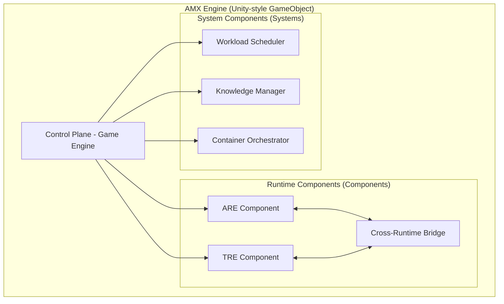
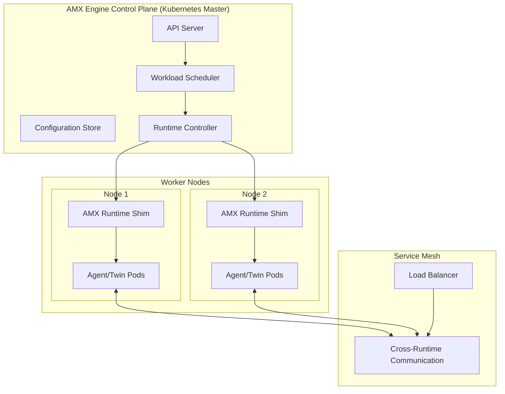
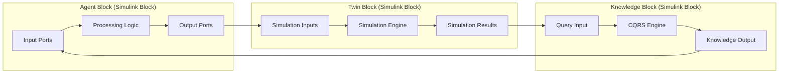
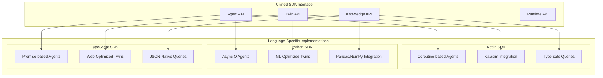
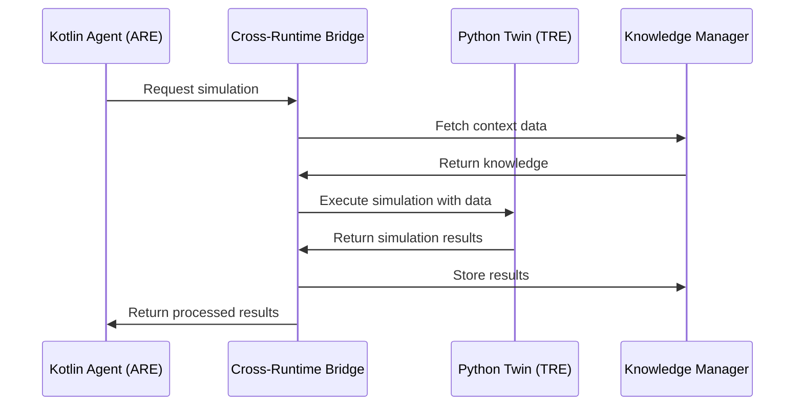
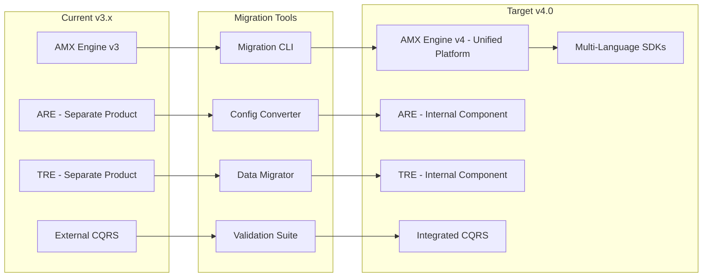

AMX Engine 4.0 represents a fundamental architectural evolution, transforming from a traditional monolithic simulation engine to a unified container orchestration platform that combines the best of Kubernetes pod management, MATLAB Simulink visual modeling, Unity's component architecture, AnyLogic's multi-method simulation, and Simul8's process optimization.

## Architectural Philosophy

### From Separate Products to Integrated Components

**Previous Architecture (v3.x):**
- AMX Engine: Standalone simulation platform
- ARE (Agent Runtime Environment): Separate product for agent execution
- TRE (Twin Runtime Environment): Separate product for twin simulation
- Knowledge distribution: External CQRS system
- Limited cross-runtime communication

**New Architecture (v4.0):**
- **AMX Engine**: Unified orchestration platform
- **ARE**: Internal runtime environment component
- **TRE**: Internal runtime environment component  
- **Knowledge Management**: Integrated CQRS system
- **Multi-Language SDKs**: Native support for Kotlin, Python, TypeScript
- **Workspace Integration**: Git-based development with Docker containerization

## Core Architectural Principles

### 1. Unity Engine Inspiration - Component-Based Design


### 2. Kubernetes Inspiration - Container Orchestration


### 3. MATLAB Simulink Inspiration - Visual Block Modeling


## Detailed Component Architecture

### AMX Engine Control Plane

The control plane manages the entire platform, inspired by Kubernetes' master node architecture:

```kotlin
// AMX Engine Control Plane
class AMXEngineControlPlane(
    private val apiServer: APIServer,
    private val scheduler: WorkloadScheduler,
    private val runtimeController: RuntimeController,
    private val knowledgeManager: KnowledgeManager
) {
    
    suspend fun initialize() {
        // Initialize core components
        apiServer.start()
        scheduler.initialize()
        runtimeController.start()
        knowledgeManager.initializeCQRS()
        
        // Register runtime environments as internal components
        runtimeController.registerRuntimeEnvironment(
            name = "ARE",
            type = AgentRuntimeEnvironment::class,
            config = AREConfiguration()
        )
        
        runtimeController.registerRuntimeEnvironment(
            name = "TRE", 
            type = TwinRuntimeEnvironment::class,
            config = TREConfiguration()
        )
        
        // Set up cross-runtime communication bridge
        val bridge = CrossRuntimeBridge(
            areRuntime = runtimeController.getRuntime("ARE"),
            treRuntime = runtimeController.getRuntime("TRE"),
            knowledgeManager = knowledgeManager
        )
        
        runtimeController.enableCrossRuntimeBridge(bridge)
    }
    
    suspend fun deployWorkload(spec: WorkloadSpec): DeploymentResult {
        // Intelligent runtime selection
        val targetRuntime = scheduler.selectOptimalRuntime(spec)
        
        return when (targetRuntime) {
            "ARE" -> deployToARERuntime(spec)
            "TRE" -> deployToTRERuntime(spec)
            else -> throw UnsupportedRuntimeException("Unknown runtime: $targetRuntime")
        }
    }
}
```

### Integrated Agent Runtime Environment (ARE)

ARE is now an internal component of AMX Engine, providing container-based agent execution:

```kotlin
// ARE as Internal Component
class AgentRuntimeEnvironment : RuntimeEnvironment {
    private val containerOrchestrator: ContainerOrchestrator
    private val agentLifecycleManager: AgentLifecycleManager
    private val networkPolicyManager: NetworkPolicyManager
    
    override suspend fun deployWorkload(spec: AgentDeploymentSpec): DeploymentResult {
        // Create container specification (Kubernetes-style)
        val containerSpec = ContainerSpec(
            image = resolveAgentImage(spec.language, spec.runtime),
            resources = ResourceRequirements(
                requests = spec.resources.requests,
                limits = spec.resources.limits
            ),
            securityContext = SecurityContext(
                runAsNonRoot = true,
                readOnlyRootFilesystem = true,
                capabilities = CapabilitySet.minimal()
            ),
            volumes = createVolumes(spec),
            environment = createEnvironment(spec)
        )
        
        // Deploy as pod (Kubernetes-style)
        val pod = Pod(
            metadata = PodMetadata(
                name = generatePodName(spec.name),
                namespace = spec.namespace,
                labels = mapOf(
                    "app" to spec.name,
                    "runtime" to "are",
                    "language" to spec.language
                )
            ),
            spec = PodSpec(
                containers = listOf(containerSpec),
                restartPolicy = RestartPolicy.Always,
                serviceAccountName = spec.serviceAccount
            )
        )
        
        return containerOrchestrator.deployPod(pod)
    }
    
    override suspend fun scaleWorkload(
        workloadId: String, 
        targetReplicas: Int
    ): ScalingResult {
        return agentLifecycleManager.scale(workloadId, targetReplicas)
    }
}
```

### Integrated Twin Runtime Environment (TRE)

TRE is now an internal component providing discrete event simulation capabilities:

```kotlin
// TRE as Internal Component
class TwinRuntimeEnvironment : RuntimeEnvironment {
    private val simulationEngine: MultiMethodSimulationEngine
    private val timeManager: DistributedTimeManager
    private val scenarioManager: ScenarioManager
    
    override suspend fun deployWorkload(spec: TwinDeploymentSpec): DeploymentResult {
        // Initialize simulation environment (AnyLogic-inspired)
        val simEnvironment = simulationEngine.createEnvironment(
            method = determineSimulationMethod(spec),
            timeControl = spec.simulation.timeControl,
            realTimeSync = spec.simulation.realTimeSync
        )
        
        // Set up discrete event simulation (Simul8-inspired)
        val twinModel = when (spec.twinType) {
            TwinType.PROCESS -> createProcessTwin(spec, simEnvironment)
            TwinType.SUPPLY_CHAIN -> createSupplyChainTwin(spec, simEnvironment)
            TwinType.FINANCIAL -> createFinancialTwin(spec, simEnvironment)
            TwinType.ORGANIZATIONAL -> createOrganizationalTwin(spec, simEnvironment)
        }
        
        // Deploy in container (maintaining consistency with ARE)
        val containerSpec = ContainerSpec(
            image = "aimatrix/tre-runtime:latest",
            resources = spec.resources,
            environment = mapOf(
                "TWIN_TYPE" to spec.twinType.name,
                "SIMULATION_METHOD" to spec.simulation.method,
                "TIME_CONTROL" to spec.simulation.timeControl.toString()
            ),
            volumes = createSimulationVolumes(spec)
        )
        
        return containerOrchestrator.deployPod(createTwinPod(containerSpec, spec))
    }
    
    private fun determineSimulationMethod(spec: TwinDeploymentSpec): SimulationMethod {
        return when {
            spec.hasAgentBasedElements() -> SimulationMethod.AGENT_BASED
            spec.hasDiscreteEvents() -> SimulationMethod.DISCRETE_EVENT
            spec.hasSystemDynamics() -> SimulationMethod.SYSTEM_DYNAMICS
            spec.requiresMultiMethod() -> SimulationMethod.MULTI_METHOD
            else -> SimulationMethod.DISCRETE_EVENT
        }
    }
}
```

## Multi-Language SDK Architecture

### SDK Unified Interface

All SDKs share a common interface but are optimized for their respective languages:



### Cross-Language Interoperability

The platform enables seamless communication between agents and twins written in different languages:



## Container Orchestration Layer

### Pod Management (Kubernetes-Inspired)

```yaml
# Example agent pod specification
apiVersion: aimatrix.com/v1
kind: AgentPod
metadata:
  name: risk-analysis-agent-abc123
  namespace: financial-services
  labels:
    app: risk-analysis
    runtime: are
    language: kotlin
    version: "1.2.0"
spec:
  containers:
  - name: agent
    image: aimatrix/kotlin-agent-runtime:latest
    ports:
    - containerPort: 8080
      name: http
    - containerPort: 9090
      name: grpc
    resources:
      requests:
        cpu: "500m"
        memory: "1Gi"
      limits:
        cpu: "2000m"
        memory: "4Gi"
    env:
    - name: AGENT_CLASS
      value: "com.company.RiskAnalysisAgent"
    - name: KNOWLEDGE_ENDPOINT
      value: "http://knowledge-manager:8080"
    - name: RUNTIME_ENVIRONMENT
      value: "ARE"
    volumeMounts:
    - name: agent-code
      mountPath: /app/agents
      readOnly: true
    - name: knowledge-cache
      mountPath: /app/knowledge
    securityContext:
      runAsNonRoot: true
      runAsUser: 65532
      readOnlyRootFilesystem: true
      allowPrivilegeEscalation: false
      capabilities:
        drop: ["ALL"]
  volumes:
  - name: agent-code
    configMap:
      name: risk-analysis-agent-code
  - name: knowledge-cache
    emptyDir:
      sizeLimit: 1Gi
  restartPolicy: Always
  serviceAccountName: agent-service-account
```

### Service Mesh Integration

```yaml
# Service mesh configuration for cross-runtime communication
apiVersion: networking.istio.io/v1beta1
kind: VirtualService
metadata:
  name: cross-runtime-routing
spec:
  hosts:
  - amx-engine
  http:
  - match:
    - headers:
        source-runtime:
          exact: "ARE"
        target-runtime:
          exact: "TRE"
    route:
    - destination:
        host: tre-runtime-service
        port:
          number: 8080
      weight: 100
    fault:
      delay:
        percentage:
          value: 0.1
        fixedDelay: 5s
  - match:
    - headers:
        source-runtime:
          exact: "TRE"
        target-runtime:
          exact: "ARE"
    route:
    - destination:
        host: are-runtime-service
        port:
          number: 8080
      weight: 100
```

## Knowledge Management & CQRS Integration

### Event-Sourced Knowledge Distribution

```kotlin
// CQRS Knowledge Management System
class KnowledgeManager(
    private val eventStore: EventStore,
    private val queryProjectors: List<QueryProjector>,
    private val commandHandlers: Map<String, CommandHandler>
) {
    
    suspend fun executeCommand(command: KnowledgeCommand): CommandResult {
        val handler = commandHandlers[command.type] 
            ?: throw UnknownCommandException(command.type)
        
        // Execute command and generate events
        val events = handler.handle(command)
        
        // Store events in event store
        events.forEach { event ->
            eventStore.append(event)
        }
        
        // Notify projectors (eventually consistent)
        events.forEach { event ->
            queryProjectors.forEach { projector ->
                projector.projectAsync(event)
            }
        }
        
        return CommandResult.Success(events.size)
    }
    
    suspend fun executeQuery(query: KnowledgeQuery): QueryResult {
        return when (query) {
            is CapsuleQuery -> executeCapsuleQuery(query)
            is VectorQuery -> executeVectorQuery(query)
            is TimeSeriesQuery -> executeTimeSeriesQuery(query)
            else -> throw UnsupportedQueryException(query.type)
        }
    }
    
    // Cross-runtime knowledge distribution
    suspend fun distributeToRuntime(
        knowledge: KnowledgeUpdate,
        targetRuntime: RuntimeType
    ) {
        when (targetRuntime) {
            RuntimeType.ARE -> distributeToARECache(knowledge)
            RuntimeType.TRE -> distributeToTRECache(knowledge)
            RuntimeType.ALL -> {
                distributeToARECache(knowledge)
                distributeToTRECache(knowledge)
            }
        }
    }
}
```

## Workspace-Driven Development

### Git-Based Workspace Structure

```
enterprise-aimatrix-project/
├── .aimatrix/
│   ├── config.yaml                    # AMX Engine configuration
│   ├── security/
│   │   ├── policies.yaml             # Security policies
│   │   ├── rbac.yaml                 # Role-based access control
│   │   └── secrets.yaml              # Secret management config
│   ├── docker/
│   │   ├── kotlin-agent.Dockerfile    # Kotlin agent container
│   │   ├── python-agent.Dockerfile   # Python agent container
│   │   ├── typescript-agent.Dockerfile # TypeScript agent container
│   │   └── twin.Dockerfile           # Twin container template
│   ├── k8s/
│   │   ├── namespace.yaml            # Kubernetes namespace
│   │   ├── rbac.yaml                 # Kubernetes RBAC
│   │   ├── network-policies.yaml     # Network policies
│   │   └── ingress.yaml              # Ingress configuration
│   └── monitoring/
│       ├── prometheus.yaml           # Metrics configuration
│       ├── grafana-dashboards/       # Custom dashboards
│       └── alerts.yaml              # Alerting rules
├── agents/                          # Multi-language agents
│   ├── kotlin/
│   │   ├── build.gradle.kts          # Kotlin build configuration
│   │   ├── src/main/kotlin/
│   │   │   ├── RiskAnalysisAgent.kt
│   │   │   ├── ComplianceAgent.kt
│   │   │   └── FraudDetectionAgent.kt
│   │   └── deployment.yaml          # Kubernetes deployment spec
│   ├── python/
│   │   ├── pyproject.toml           # Python project configuration
│   │   ├── requirements.txt         # Python dependencies
│   │   ├── src/
│   │   │   ├── predictive_agent.py
│   │   │   ├── analytics_agent.py
│   │   │   └── ml_training_agent.py
│   │   └── deployment.yaml          # Kubernetes deployment spec
│   ├── typescript/
│   │   ├── package.json             # Node.js configuration
│   │   ├── tsconfig.json            # TypeScript configuration
│   │   ├── src/
│   │   │   ├── web-agent.ts
│   │   │   ├── api-integration-agent.ts
│   │   │   └── realtime-agent.ts
│   │   └── deployment.yaml          # Kubernetes deployment spec
│   ├── csharp/
│   │   ├── CustomerService.csproj   # C# project configuration
│   │   ├── appsettings.json         # Application settings
│   │   ├── src/
│   │   │   ├── EnterpriseAgent.cs
│   │   │   ├── IntegrationAgent.cs
│   │   │   └── ComplianceAgent.cs
│   │   └── deployment.yaml          # Kubernetes deployment spec
│   └── java/
│       ├── pom.xml                  # Maven configuration
│       ├── application.properties   # Spring Boot configuration
│       ├── src/main/java/
│       │   ├── CustomerServiceAgent.java
│       │   ├── AnalyticsAgent.java
│       │   └── IntegrationAgent.java
│       └── deployment.yaml          # Kubernetes deployment spec
├── twins/                           # Multi-language digital twins
│   ├── kotlin/
│   │   └── SupplyChainTwin.kt
│   ├── python/
│   │   ├── predictive_twin.py
│   │   └── optimization_twin.py
│   ├── typescript/
│   │   └── dashboard-twin.ts
│   ├── csharp/
│   │   └── ManufacturingTwin.cs
│   └── java/
│       └── SupplyChainTwin.java
├── knowledge/                       # Knowledge management
│   ├── capsules/                    # Knowledge capsules
│   │   ├── customer-data.yaml
│   │   ├── product-catalog.yaml
│   │   └── market-intelligence.yaml
│   ├── schemas/                     # Data schemas
│   │   ├── customer.json
│   │   ├── product.json
│   │   └── transaction.json
│   └── policies/                    # Distribution policies
│       ├── data-classification.yaml
│       ├── access-control.yaml
│       └── retention-policies.yaml
├── tests/                          # Integration tests
│   ├── agents/
│   ├── twins/
│   └── e2e/
├── docs/                           # Project documentation
│   ├── architecture.md
│   ├── deployment.md
│   └── api-reference.md
├── docker-compose.dev.yaml         # Development stack
├── docker-compose.prod.yaml        # Production stack
└── README.md                       # Project overview
```

## Performance and Scalability

### Resource Management (Kubernetes-Inspired)

```kotlin
// Resource allocation and management
class ResourceManager {
    
    suspend fun allocateResources(
        workloadSpec: WorkloadSpec
    ): ResourceAllocation {
        
        val nodeResources = getAvailableNodeResources()
        val optimalNode = selectOptimalNode(nodeResources, workloadSpec)
        
        return ResourceAllocation(
            nodeId = optimalNode.id,
            cpuAllocation = CpuAllocation(
                requests = workloadSpec.resources.cpu.requests,
                limits = workloadSpec.resources.cpu.limits,
                cpuSet = allocateCpuSet(optimalNode, workloadSpec)
            ),
            memoryAllocation = MemoryAllocation(
                requests = workloadSpec.resources.memory.requests,
                limits = workloadSpec.resources.memory.limits,
                memoryType = if (workloadSpec.requiresHighPerformance) 
                    MemoryType.HUGE_PAGES else MemoryType.STANDARD
            ),
            storageAllocation = StorageAllocation(
                volumeMounts = createVolumeMounts(workloadSpec),
                persistentVolumes = createPersistentVolumes(workloadSpec)
            ),
            networkAllocation = NetworkAllocation(
                bandwidth = workloadSpec.resources.network.bandwidth,
                policies = createNetworkPolicies(workloadSpec)
            )
        )
    }
}
```

### Auto-Scaling (HPA-Inspired)

```yaml
# Horizontal Pod Autoscaler for agents
apiVersion: autoscaling/v2
kind: HorizontalPodAutoscaler  
metadata:
  name: risk-analysis-agent-hpa
spec:
  scaleTargetRef:
    apiVersion: aimatrix.com/v1
    kind: AgentDeployment
    name: risk-analysis-agent
  minReplicas: 2
  maxReplicas: 20
  metrics:
  - type: Resource
    resource:
      name: cpu
      target:
        type: Utilization
        averageUtilization: 70
  - type: Resource
    resource:
      name: memory
      target:
        type: Utilization
        averageUtilization: 80
  - type: Pods
    pods:
      metric:
        name: agent_queue_length
      target:
        type: AverageValue
        averageValue: "10"
  behavior:
    scaleUp:
      stabilizationWindowSeconds: 60
      policies:
      - type: Percent
        value: 100
        periodSeconds: 15
    scaleDown:
      stabilizationWindowSeconds: 300
      policies:
      - type: Percent
        value: 10
        periodSeconds: 60
```

## Security Architecture

### Zero-Trust Network (Istio-Inspired)

```yaml
# Zero-trust security policies
apiVersion: security.istio.io/v1beta1
kind: PeerAuthentication
metadata:
  name: amx-engine-mutual-tls
  namespace: aimatrix-system
spec:
  mtls:
    mode: STRICT

---
apiVersion: security.istio.io/v1beta1
kind: AuthorizationPolicy
metadata:
  name: cross-runtime-authorization
  namespace: aimatrix-system
spec:
  rules:
  - from:
    - source:
        principals: ["cluster.local/ns/aimatrix-system/sa/are-service-account"]
    to:
    - operation:
        methods: ["POST", "GET"]
    when:
    - key: request.headers[runtime-source]
      values: ["ARE"]
  - from:
    - source:
        principals: ["cluster.local/ns/aimatrix-system/sa/tre-service-account"]
    to:
    - operation:
        methods: ["POST", "GET"]
    when:
    - key: request.headers[runtime-source]
      values: ["TRE"]
```

## Migration Strategy

### From v3.x to v4.0



## Future Roadmap

### Phase 1: Foundation (Q2 2025)
- ✅ Unified AMX Engine 4.0 platform
- ✅ Integrated ARE/TRE runtime environments  
- ✅ Multi-language SDK support (Kotlin, Python, TypeScript)
- ✅ Container orchestration layer
- ✅ CQRS knowledge management integration

### Phase 2: Enhancement (Q3 2025)
- **GPU Acceleration**: CUDA support for ML-heavy agents and twins
- **Edge Deployment**: Lightweight runtime for edge computing scenarios
- **Advanced Networking**: Service mesh with advanced traffic management
- **Observability**: Enhanced monitoring, tracing, and debugging tools
- **Visual Designer**: Low-code/no-code agent and twin creation interface

### Phase 3: Enterprise (Q4 2025)
- **Multi-Cluster Federation**: Cross-region deployment and management
- **Advanced Security**: Hardware security modules, attestation, compliance frameworks
- **Performance Optimization**: JIT compilation, memory optimization, network acceleration
- **Ecosystem Integration**: Third-party plugin system, marketplace, certification program

### Phase 4: Innovation (Q1 2026)
- **Quantum-Classical Hybrid**: Integration with quantum computing platforms
- **AI-Driven Optimization**: Self-optimizing agents and twins
- **Autonomous Evolution**: Self-improving system capabilities
- **Industry Standards**: Contribution to open standards for AI system orchestration

---

AMX Engine 4.0 represents the convergence of container orchestration, multi-method simulation, and intelligent knowledge management into a unified platform that scales from development laptops to enterprise data centers. By integrating the best architectural patterns from proven systems like Kubernetes, MATLAB Simulink, Unity Engine, AnyLogic, and Simul8, we've created a next-generation foundation for AI-driven business systems.